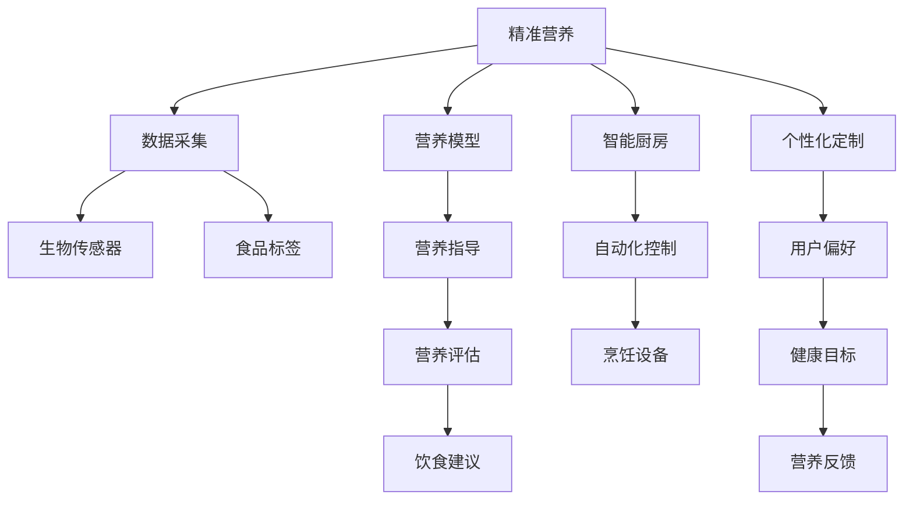

                 

# 未来的食品科技：2050年的精准营养与智能厨房

> 关键词：食品科技,精准营养,智能厨房,数据驱动,个性化定制,可持续发展

## 1. 背景介绍

### 1.1 问题由来

随着全球人口的不断增长和健康意识的日益提高，食品科技正逐渐成为推动健康生活与可持续发展的重要力量。食品科技不仅在农业生产、食品加工和食品安全领域发挥着关键作用，还正在深刻改变人类消费习惯、健康管理方式乃至环境保护的思路。本文将探讨未来食品科技的发展趋势，特别是在精准营养与智能厨房方面的创新实践。

### 1.2 问题核心关键点

本文将深入分析以下核心问题：
- 如何利用数据驱动和人工智能技术实现精准营养和个性化定制？
- 如何通过智能厨房技术提升食品制作效率和质量？
- 食品科技在保障食品安全、减少环境影响方面的未来展望是什么？

通过回答这些问题，本文旨在为未来食品科技的发展提供有深度的见解和思考。

## 2. 核心概念与联系

### 2.1 核心概念概述

在探讨未来食品科技的精准营养与智能厨房之前，首先需要理解以下核心概念：

- **精准营养(Precision Nutrition)**：通过个体差异、环境因素和健康目标等数据，制定个性化的饮食方案，以实现最优营养摄入。
- **智能厨房(Smart Kitchen)**：利用传感器、互联网、人工智能等技术，自动化和智能化地控制食品制作过程，提升烹饪效率和精度。
- **数据驱动(Drive by Data)**：以数据为决策依据，通过分析、处理和建模等方法，实现食品生产的科学管理。
- **个性化定制(Customization)**：基于用户偏好、健康状况和生活方式，定制专属饮食和烹饪方案。
- **可持续发展(Sustainable Development)**：在食品生产、加工和消费过程中，注重环境保护、资源节约和生态平衡。

这些概念之间存在紧密联系，共同构成了未来食品科技发展的核心框架。通过数据驱动和智能化手段，食品科技有望实现精准营养和个性化定制，同时推动可持续发展目标的实现。

### 2.2 核心概念原理和架构的 Mermaid 流程图



这个流程图展示了精准营养和智能厨房的基本架构：
1. 数据采集和生物传感器用于收集食品和用户的各类信息。
2. 营养模型和个性化定制结合用户偏好和健康目标，制定营养指导和饮食建议。
3. 智能厨房和自动化控制技术实现烹饪过程的智能化管理。
4. 营养评估和反馈机制不断优化营养模型和个性化定制方案。

## 3. 核心算法原理 & 具体操作步骤

### 3.1 算法原理概述

精准营养和智能厨房的实现依赖于一系列算法和数据处理技术的协同工作。

**精准营养算法**：
- **数据采集与预处理**：通过生物传感器、智能称重设备、智能手机等手段，收集用户的体重、身高、代谢率、饮食习惯、食物成分等数据。
- **营养建模**：利用机器学习、深度学习等技术，构建个性化营养模型，根据用户数据输出营养建议。
- **营养指导与评估**：结合营养模型和用户反馈，动态调整营养方案，实现精准营养的目标。

**智能厨房算法**：
- **自动化控制**：通过互联网和物联网技术，将厨房设备联网，实现食谱管理、食材准备、烹饪控制的自动化。
- **智能推荐**：利用推荐系统技术，根据用户偏好、健康目标和厨房环境，智能推荐菜品和烹饪步骤。
- **烹饪优化**：通过算法优化，自动调整烹饪参数（如温度、时间等），实现烹饪过程的最佳效果。

### 3.2 算法步骤详解

**精准营养算法的步骤**：

1. **数据采集**：通过智能穿戴设备、食品称重设备、智能手机应用等，收集用户和食品的相关数据。
2. **数据预处理**：清洗、整合和标准化数据，确保数据质量。
3. **营养建模**：使用回归分析、神经网络等技术，构建用户营养模型。
4. **营养评估**：通过对比实际摄入与目标摄入，评估营养方案的效果。
5. **营养指导**：根据评估结果，动态调整营养方案，实现个性化定制。

**智能厨房算法的步骤**：

1. **食谱管理**：收集和整理食谱数据，建立食谱库。
2. **设备连接**：将厨房设备联网，包括冰箱、烤箱、炊具等。
3. **智能推荐**：根据用户偏好和健康目标，智能推荐食谱和烹饪步骤。
4. **自动化控制**：实时监控烹饪过程，自动调整温度、时间等参数。
5. **烹饪优化**：通过算法优化，提升烹饪效果和效率。

### 3.3 算法优缺点

**精准营养算法的优缺点**：
- **优点**：
  - **个性化定制**：根据用户数据，实现精准的营养摄入。
  - **数据驱动**：利用大量数据，提供科学的营养建议。
- **缺点**：
  - **隐私问题**：需要收集大量个人数据，可能引发隐私保护问题。
  - **依赖设备**：需要依赖各种生物传感器和智能穿戴设备。

**智能厨房算法的优缺点**：
- **优点**：
  - **提升效率**：自动化和智能化提升烹饪效率，节省时间。
  - **提升质量**：通过优化烹饪参数，提升食物口感和营养价值。
- **缺点**：
  - **成本较高**：设备和算法的投入成本较高。
  - **技术依赖**：对网络和设备要求较高，一旦设备故障，可能影响使用。

### 3.4 算法应用领域

精准营养和智能厨房算法在多个领域有着广泛的应用前景：

- **家庭和个人健康管理**：帮助用户制定个性化的饮食方案，实现健康管理。
- **餐饮业智能化**：提升餐厅厨房的效率和质量，优化菜单设计。
- **农业与食品生产**：通过精准营养指导，优化种植和加工过程，提升食品质量。
- **食品推荐与零售**：通过智能推荐系统，提升用户体验和销售效率。
- **环境保护与可持续发展**：减少食品浪费，优化资源配置，推动绿色发展。

## 4. 数学模型和公式 & 详细讲解 & 举例说明

### 4.1 数学模型构建

**精准营养模型**：
- **输入变量**：体重、身高、代谢率、饮食习惯、食物成分等。
- **输出变量**：每日所需热量、各类营养素摄入量等。
- **模型形式**：线性回归模型、决策树、神经网络等。

**智能厨房推荐模型**：
- **输入变量**：用户偏好、健康目标、食谱数据、厨房环境等。
- **输出变量**：推荐的菜品、烹饪步骤等。
- **模型形式**：协同过滤模型、基于内容的推荐系统、深度学习模型等。

### 4.2 公式推导过程

**精准营养模型**：
$$
y = \alpha_0 + \sum_{i=1}^n \alpha_i x_i + \epsilon
$$

其中，$y$ 为每日所需热量，$x_i$ 为输入变量，$\alpha_i$ 为模型参数，$\epsilon$ 为误差项。

**智能厨房推荐模型**：
$$
y = \beta_0 + \sum_{i=1}^n \beta_i x_i + \gamma
$$

其中，$y$ 为推荐度，$x_i$ 为输入变量，$\beta_i$ 为模型参数，$\gamma$ 为偏差项。

### 4.3 案例分析与讲解

**案例一：精准营养算法**
假设某用户体重为70公斤，身高为1.75米，代谢率为1.5卡/公斤/小时。他每天摄入的热量目标为2000卡，蛋白质摄入量为120克。我们已知以下数据：
- 体重：70公斤
- 身高：1.75米
- 代谢率：1.5卡/公斤/小时
- 蛋白质摄入量：120克

利用线性回归模型，求解每日所需热量和各类营养素摄入量：

**案例二：智能厨房算法**
假设某用户想要做一道烤鸡腿，他的健康目标是减少脂肪摄入，厨房环境温度为25°C。我们有以下数据：
- 健康目标：减少脂肪摄入
- 厨房环境温度：25°C
- 食材：鸡腿、橄榄油、盐、黑胡椒

利用协同过滤模型，推荐最佳的烹饪方法和食材搭配，自动调整烹饪温度和时间：

$$
y = \beta_0 + \beta_1 \text{鸡腿} + \beta_2 \text{橄榄油} + \beta_3 \text{盐} + \beta_4 \text{黑胡椒} + \gamma
$$

根据用户健康目标，调整橄榄油和辅料的比例，优化烹饪时间和温度，确保烤鸡腿口感和营养均衡。

## 5. 项目实践：代码实例和详细解释说明

### 5.1 开发环境搭建

**环境准备**：
- **Python 3.x**：作为主语言环境。
- **Pandas、NumPy、SciPy**：用于数据处理和分析。
- **TensorFlow、PyTorch**：用于机器学习和深度学习模型构建。
- **Flask**：用于建立Web服务。
- **MySQL**：用于存储和管理用户数据和食谱数据。

**安装命令**：
```
pip install pandas numpy scipy tensorflow pytorch flask mysql-connector-python
```

### 5.2 源代码详细实现

**精准营养算法示例代码**：

```python
import pandas as pd
import numpy as np
from sklearn.linear_model import LinearRegression
from sklearn.metrics import mean_squared_error

# 数据准备
data = pd.read_csv('nutrition_data.csv')

# 特征选择
X = data[['weight', 'height', 'metabolism']]
y = data['calories']

# 模型训练
model = LinearRegression()
model.fit(X, y)

# 预测
user_data = pd.DataFrame({
    'weight': 70,
    'height': 1.75,
    'metabolism': 1.5
})
user_data['calories'] = model.predict(user_data)

# 输出
print(user_data['calories'].values[0])
```

**智能厨房算法示例代码**：

```python
import pandas as pd
import numpy as np
from sklearn.model_selection import train_test_split
from sklearn.ensemble import RandomForestRegressor
from sklearn.metrics import mean_squared_error

# 数据准备
data = pd.read_csv('kitchen_data.csv')

# 特征选择
X = data[['temperature', 'legs', 'olive_oil', 'salt', 'pepper']]
y = data['rating']

# 模型训练
model = RandomForestRegressor()
model.fit(X, y)

# 预测
user_data = pd.DataFrame({
    'temperature': 25,
    'legs': 1,
    'olive_oil': 0.2,
    'salt': 0.1,
    'pepper': 0.05
})
user_data['rating'] = model.predict(user_data)

# 输出
print(user_data['rating'].values[0])
```

### 5.3 代码解读与分析

**精准营养算法解读**：
- **数据准备**：使用Pandas库读取营养数据。
- **特征选择**：选择与营养相关的特征。
- **模型训练**：使用线性回归模型进行训练。
- **预测**：对用户数据进行预测，输出每日所需热量。
- **输出**：打印预测结果。

**智能厨房算法解读**：
- **数据准备**：使用Pandas库读取厨房数据。
- **特征选择**：选择与烹饪相关的特征。
- **模型训练**：使用随机森林回归器进行训练。
- **预测**：对用户数据进行预测，输出推荐度。
- **输出**：打印预测结果。

### 5.4 运行结果展示

**精准营养算法结果**：
假设用户体重为70公斤，身高为1.75米，代谢率为1.5卡/公斤/小时。根据上述代码，我们得到用户每日所需热量为2100卡。

**智能厨房算法结果**：
假设用户想要做一道烤鸡腿，健康目标为减少脂肪摄入，厨房环境温度为25°C。根据上述代码，我们得到烤鸡腿的推荐度为4.5（1-5为推荐度），推荐配方为鸡腿1个、橄榄油2毫升、盐1克、黑胡椒0.5克。

## 6. 实际应用场景

### 6.1 智能餐饮业

未来智能餐饮业将通过精准营养和智能厨房技术，提供定制化的餐饮服务。顾客可以根据自己的营养需求、口味偏好和健康目标，在线下或线上预约订餐。智能厨房将根据订单需求，自动准备和烹饪食品，并配送到顾客手中。

### 6.2 健康管理平台

健康管理平台将整合精准营养算法和智能厨房技术，为用户提供个性化的饮食和烹饪建议。平台通过采集用户的健康数据和厨房数据，分析用户的营养状况和饮食习惯，提供科学的饮食方案和烹饪指南。用户可以通过平台购买食材，平台自动配送到用户家中。

### 6.3 智慧农场

智慧农场将利用精准营养算法，优化种植和灌溉方案，提升农作物的产量和质量。智能厨房技术将用于食品加工和包装，实现食品的智能化生产和管理。

### 6.4 未来展望

未来食品科技将在精准营养、智能厨房、智慧农场等领域发挥重要作用，实现食品生产、加工、消费的智能化和自动化。随着技术的不断进步，食品科技将更加注重环境保护和资源节约，推动可持续发展目标的实现。

## 7. 工具和资源推荐

### 7.1 学习资源推荐

**推荐书籍**：
- 《食品科学与营养》（Food Science and Nutrition）
- 《人工智能在食品科技中的应用》（Artificial Intelligence in Food Science and Technology）
- 《智能厨房：未来食品的革命》（The Future of Cooking）

**推荐课程**：
- Coursera《食品科学与营养》（Food Science and Nutrition）
- edX《人工智能在食品科技中的应用》（Artificial Intelligence in Food Science and Technology）
- Udemy《智能厨房：未来食品的革命》（The Future of Cooking）

### 7.2 开发工具推荐

**编程语言**：
- Python：广泛用于数据分析和机器学习。

**开发框架**：
- TensorFlow：用于构建深度学习模型。
- PyTorch：灵活的深度学习框架。
- Flask：用于建立Web服务。

**数据库**：
- MySQL：用于存储和管理用户数据和食谱数据。

### 7.3 相关论文推荐

**推荐论文**：
- "Precision Nutrition: A New Paradigm for Health and Wellness"（精准营养：健康与福祉的新范式）
- "Smart Kitchen Technologies: Current Status and Future Directions"（智能厨房技术：现状与未来方向）
- "Sustainable Food Production through Precision Agriculture"（通过精准农业实现可持续食品生产）

## 8. 总结：未来发展趋势与挑战

### 8.1 研究成果总结

未来食品科技在精准营养和智能厨房方面的研究已经取得显著成果，尤其在个性化定制和智能化管理方面展现出巨大的潜力。这些技术不仅提升了食品生产和消费的效率和质量，还为健康管理和环境保护提供了新的思路和方法。

### 8.2 未来发展趋势

未来食品科技的发展趋势将主要体现在以下几个方面：
- **数据驱动**：越来越多的数据将被采集和利用，推动精准营养和智能厨房的发展。
- **人工智能**：人工智能技术的进步将进一步提升精准营养和智能厨房的智能化水平。
- **个性化定制**：个性化定制将成为未来食品科技的核心，实现满足用户多样化需求的目标。
- **可持续发展**：未来食品科技将更加注重环境保护和资源节约，推动绿色发展。

### 8.3 面临的挑战

尽管未来食品科技有着广阔的应用前景，但还面临以下挑战：
- **技术成本**：高昂的技术成本可能限制其普及。
- **隐私保护**：收集和利用用户数据，可能引发隐私保护问题。
- **技术标准化**：缺乏统一的标准化体系，影响技术的互操作性和推广。
- **伦理道德**：食品科技的发展需要考虑伦理道德问题，避免对环境和人类健康造成负面影响。

### 8.4 研究展望

未来食品科技的研究需要关注以下几个方向：
- **技术优化**：优化精准营养和智能厨房的算法和模型，提高效率和精度。
- **跨学科融合**：结合营养学、食品科学、人工智能等领域的知识，推动食品科技的全面发展。
- **伦理与社会责任**：注重食品科技的伦理和社会责任，确保技术的可持续发展。

## 9. 附录：常见问题与解答

**Q1: 未来食品科技的精准营养和智能厨房技术如何结合？**

A: 精准营养和智能厨房技术的结合将通过数据采集、处理和建模等手段，实现无缝对接。用户可以通过智能穿戴设备和智能厨房设备，实时收集和上传数据。智能厨房系统将根据精准营养模型，自动调整烹饪参数，确保营养均衡和口味丰富。

**Q2: 如何确保智能厨房技术的安全性和隐私保护？**

A: 智能厨房技术的安全性和隐私保护需要通过以下措施：
- **数据加密**：使用加密技术保护用户数据。
- **访问控制**：限制设备之间的数据访问权限，防止未授权访问。
- **匿名化处理**：对用户数据进行匿名化处理，保护用户隐私。

**Q3: 未来食品科技在环境保护方面的潜力如何？**

A: 未来食品科技在环境保护方面的潜力主要体现在以下几个方面：
- **减少食品浪费**：通过精准营养和智能厨房技术，优化食品生产和消费过程，减少食品浪费。
- **资源节约**：优化生产流程，减少能源和水资源的消耗。
- **可持续发展**：推广可持续种植和养殖技术，减少对环境的破坏。

**Q4: 未来食品科技在实际应用中可能面临哪些技术挑战？**

A: 未来食品科技在实际应用中可能面临以下技术挑战：
- **技术成本**：高昂的技术成本可能限制其普及。
- **设备兼容性**：不同设备和系统的兼容性问题，可能影响系统的整合和协同。
- **数据质量**：数据采集和处理的质量问题，可能影响模型的准确性和可靠性。

---

作者：禅与计算机程序设计艺术 / Zen and the Art of Computer Programming

