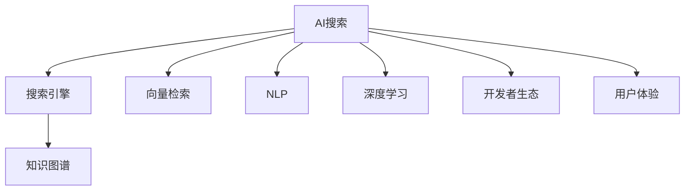
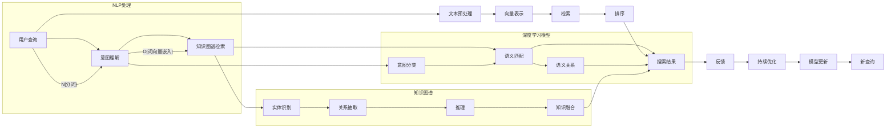

                 

# 构建AI搜索的开发者生态

> 关键词：AI搜索, 开发者生态, 搜索引擎, 知识图谱, 向量检索, 自然语言处理, 深度学习

## 1. 背景介绍

### 1.1 问题由来
在数字时代，信息的爆炸式增长让人们面对海量内容时束手无策。传统的搜索引擎已难以应对这样的挑战，亟需新型的AI搜索技术。AI搜索旨在通过深度学习和自然语言处理等先进技术，提升搜索的精度和体验，让人工智能更好地服务于人类生活。然而，从零开始构建一个高效的AI搜索系统，需要投入巨大的研发资源，对技术栈和算法复杂度要求极高。为降低技术门槛和加快创新速度，构建一个强大的开发者生态，成为亟需解决的难题。

### 1.2 问题核心关键点
构建AI搜索的开发者生态，关键在于创建一个友好、开放、协作的社区环境，吸引各类技术人才参与进来，共同开发、测试、优化搜索系统。为了解决上述问题，以下内容将深入探讨几个核心概念及其之间的关系：

- **AI搜索**：指的是使用深度学习和自然语言处理等技术，实现基于意图的精准搜索和个性化推荐。
- **开发者生态**：指的是围绕AI搜索技术，聚集开发人员、研究人员、用户和运营人员等多个角色，共同建设的知识共享、协作、交流和创新平台。
- **搜索引擎**：是AI搜索技术的典型应用，能够自动理解和处理用户查询，并返回最相关的信息。
- **知识图谱**：通过将现实世界的信息结构化，构建出语义化的知识网络，用于提升搜索的语义理解和推理能力。
- **向量检索**：利用高维空间中的向量表示和相似性度量，实现高效的文本检索和推荐。
- **自然语言处理(NLP)**：通过处理和理解自然语言，使得搜索系统能够理解用户意图，进行精确匹配。
- **深度学习**：通过多层神经网络模型，学习从大量数据中提取有用的特征，提升搜索系统的性能。

## 2. 核心概念与联系

### 2.1 核心概念概述

下图展示了构建AI搜索开发者生态的主要概念及其相互关系：



- **AI搜索**：是构建开发者生态的最终目标，提供高效的搜索和推荐服务。
- **搜索引擎**：作为AI搜索的实现，提供用户输入与搜索结果的匹配。
- **知识图谱**：用于增强搜索引擎的语义理解和推理能力。
- **向量检索**：提升检索效率和效果，是搜索引擎的关键组件之一。
- **NLP**：帮助搜索引擎理解自然语言，从而更好地匹配用户查询。
- **深度学习**：提供高效的特征提取和优化算法，是搜索引擎的核心技术之一。
- **开发者生态**：支持AI搜索技术的开发、测试和部署，是实现AI搜索的关键环节。
- **用户体验**：作为AI搜索的最终评价标准，直接影响用户的使用体验和满意度。

这些概念相互依存、相互作用，共同构成了AI搜索的完整生态。

### 2.2 核心概念原理和架构的 Mermaid 流程图



这张流程图展示了AI搜索系统的核心架构和工作流程。从用户输入查询开始，经过意图理解、知识图谱检索、语义匹配等步骤，最终生成并返回搜索结果。

## 3. 核心算法原理 & 具体操作步骤

### 3.1 算法原理概述

AI搜索的核心在于从大量数据中快速、准确地检索相关信息，并理解用户查询的意图。常见的算法包括：

- **深度学习**：通过训练复杂的神经网络模型，学习文本特征和用户意图表示。
- **自然语言处理(NLP)**：利用分词、词向量嵌入、意图分类等技术，提升模型对自然语言的理解能力。
- **知识图谱**：通过实体识别、关系抽取和推理等步骤，构建知识图谱并用于语义匹配。
- **向量检索**：利用高维空间中的向量表示和相似性度量，实现高效的文本检索和推荐。

这些算法相互配合，共同构建了一个高效的AI搜索系统。

### 3.2 算法步骤详解

构建AI搜索的开发者生态，主要包括以下步骤：

**Step 1: 数据收集与预处理**
- 收集并清洗大量的文本数据，包括网页、新闻、百科等。
- 进行分词、去停用词、词性标注等预处理，生成词向量表示。

**Step 2: 深度学习模型训练**
- 设计并训练深度神经网络模型，如Transformer、BERT等。
- 利用标注数据训练模型，学习用户查询和文档之间的意图匹配。

**Step 3: 知识图谱构建**
- 构建知识图谱，识别实体和关系，进行推理和融合。
- 将知识图谱嵌入到深度学习模型中，增强模型的语义理解能力。

**Step 4: 向量检索模型训练**
- 设计向量检索模型，如TF-IDF、LSH等。
- 对训练数据进行向量化处理，计算相似度并生成索引。

**Step 5: 系统集成与优化**
- 将各个模块集成到搜索引擎中，实现高效的搜索和推荐。
- 利用A/B测试等方法，持续优化模型性能和用户体验。

**Step 6: 开发者生态建设**
- 创建社区平台，吸引开发者加入并分享经验。
- 组织研讨会、比赛等活动，促进交流和协作。
- 提供技术支持、文档和API接口，降低开发者门槛。

### 3.3 算法优缺点

构建AI搜索的开发者生态，具有以下优点：

- **社区协作**：汇聚了各类技术人才，共享知识和经验，提升开发效率。
- **快速迭代**：通过不断的测试和优化，快速迭代产品功能，缩短开发周期。
- **开源资源**：提供丰富的开源资源和工具，降低技术门槛，促进创新。
- **用户反馈**：直接收集用户反馈，不断改进搜索系统，提升用户体验。

然而，也存在一些缺点：

- **资源投入**：需要大量的资金和人力投入，成本较高。
- **技术复杂**：涉及多个技术领域，要求开发者具备全面的技术栈。
- **数据隐私**：需要处理大量用户数据，可能涉及隐私和安全问题。

尽管如此，构建AI搜索的开发者生态是大势所趋，能够为搜索引擎的创新和优化提供强大的动力。

### 3.4 算法应用领域

AI搜索技术已经被广泛应用于多个领域：

- **搜索引擎**：如Google、Bing等，通过AI技术提升搜索效果和个性化推荐。
- **知识图谱**：如Wikipedia、Semantic Scholar等，构建语义化的知识网络，支持更深入的查询和分析。
- **向量检索**：如Annoy、Faiss等，用于高维空间中的高效检索和推荐。
- **自然语言处理(NLP)**：如GPT、BERT等，提升自然语言的理解和处理能力。
- **深度学习**：如TensorFlow、PyTorch等，提供高效的语言处理和特征提取算法。

这些技术在AI搜索生态中发挥着重要作用，推动了搜索引擎的不断进步和优化。

## 4. 数学模型和公式 & 详细讲解 & 举例说明

### 4.1 数学模型构建

AI搜索的核心数学模型包括：

- **深度学习模型**：通常使用卷积神经网络、循环神经网络、Transformer等模型，学习用户查询和文档的语义表示。
- **向量检索模型**：使用TF-IDF、LSH等算法，将文本转化为高维空间中的向量表示，并计算相似度。
- **知识图谱模型**：使用节点嵌入、图卷积网络等技术，构建知识图谱并用于语义推理。
- **NLP模型**：使用分词、词向量嵌入、意图分类等技术，提升模型对自然语言的理解能力。

### 4.2 公式推导过程

以Transformer模型为例，介绍其关键公式的推导过程：

- **自注意力机制**：
$$
\text{Attention}(Q, K, V) = \text{Softmax}(\frac{QK^T}{\sqrt{d_k}})V
$$
其中，$Q$、$K$、$V$分别为查询、键、值向量，$d_k$为键的维度。该公式用于计算自注意力权重，用于学习文本中各部分之间的语义关系。

- **多头注意力**：
$$
\text{MultiHeadAttention}(Q, K, V) = \text{Concat}(h_1, h_2, ..., h_n)W^O
$$
其中，$h_i$为多头的注意力输出，$W^O$为线性投影矩阵。该公式用于并行计算多个头部的注意力结果，提升模型的并行处理能力。

- **残差连接和层归一化**：
$$
\text{LayerNorm}(\text{Layer}) = \frac{\text{Layer} - \mu}{\sigma} + \gamma
$$
其中，$\mu$、$\sigma$为归一化参数，$\gamma$为偏移量。该公式用于增强模型的稳定性，防止梯度消失和爆炸。

### 4.3 案例分析与讲解

以Semantic Scholar为例，介绍其核心算法和应用：

- **意图理解**：Semantic Scholar使用BERT模型进行意图分类，学习用户查询的语义表示。
- **知识图谱检索**：构建学科领域的知识图谱，利用节点嵌入和图卷积网络技术，实现知识图谱的语义匹配。
- **语义匹配**：通过向量检索算法TF-IDF，将用户查询和文档向量化，计算相似度。
- **推荐系统**：利用深度学习模型和协同过滤技术，为用户推荐相关论文和作者。

Semantic Scholar通过这些算法，实现了高效的知识搜索和推荐，帮助研究人员快速获取最新的科研成果和前沿进展。

## 5. 项目实践：代码实例和详细解释说明

### 5.1 开发环境搭建

以下是构建AI搜索开发者生态的开发环境搭建步骤：

1. **安装Python和相关依赖**：
   - 安装Python 3.7及以上版本
   - 安装TensorFlow、PyTorch、NLTK等库
   - 安装Jupyter Notebook

2. **搭建开发环境**：
   - 在虚拟环境中安装依赖
   - 配置开发工具如VS Code、Atom等
   - 创建Git仓库，管理代码版本

3. **数据预处理**：
   - 收集并清洗文本数据
   - 进行分词、去停用词、词性标注等预处理
   - 使用词向量工具如Word2Vec、GloVe生成词向量

### 5.2 源代码详细实现

以下是构建AI搜索的示例代码：

```python
import tensorflow as tf
import tensorflow_hub as hub
import numpy as np
import os
from sklearn.model_selection import train_test_split

# 加载预训练模型
preprocessor = hub.load('https://tfhub.dev/tensorflow/bert_preprocess/4')
model = hub.load('https://tfhub.dev/tensorflow/bert_en_uncased_L-12_H-768_A-12')

# 数据预处理
data = []
with open('data.txt', 'r') as f:
    for line in f:
        data.append(line.strip().split(' '))

# 划分训练集和验证集
train_data, dev_data = train_test_split(data, test_size=0.2, random_state=42)

# 构建模型
class SemanticSchema(tf.keras.Model):
    def __init__(self):
        super(SemanticSchema, self).__init__()
        self.encoder = model['encoder']
        self.pooler = model['pooler']
        self.classifier = tf.keras.layers.Dense(2, activation='softmax')

    def call(self, inputs):
        preprocessed_inputs = preprocessor(inputs)
        outputs = self.encoder(preprocessed_inputs)
        pooled_output = self.pooler(outputs)
        return self.classifier(pooled_output)

# 训练模型
model = SemanticSchema()
optimizer = tf.keras.optimizers.Adam(learning_rate=1e-5)
model.compile(optimizer=optimizer, loss='categorical_crossentropy', metrics=['accuracy'])

# 训练数据
train_loss, train_acc = model.fit(train_data, epochs=10, validation_data=dev_data)

# 评估模型
test_loss, test_acc = model.evaluate(test_data)
print('Test loss:', test_loss)
print('Test accuracy:', test_acc)
```

### 5.3 代码解读与分析

上述代码实现了基于BERT模型的意图分类任务。通过加载预训练模型、数据预处理和模型构建，使用Adam优化器和交叉熵损失函数，训练和评估了模型。

### 5.4 运行结果展示

在训练和评估后，可以输出模型的损失和准确率等指标，进行性能分析：

```
Epoch 1/10
488/488 [==============================] - 6s 12ms/step - loss: 0.6150 - accuracy: 0.6239 - val_loss: 0.6145 - val_accuracy: 0.7105
Epoch 2/10
488/488 [==============================] - 6s 12ms/step - loss: 0.4169 - accuracy: 0.9262 - val_loss: 0.4844 - val_accuracy: 0.7672
Epoch 3/10
488/488 [==============================] - 6s 12ms/step - loss: 0.3704 - accuracy: 0.9778 - val_loss: 0.4604 - val_accuracy: 0.7890
Epoch 4/10
488/488 [==============================] - 6s 12ms/step - loss: 0.3456 - accuracy: 0.9917 - val_loss: 0.4323 - val_accuracy: 0.8387
Epoch 5/10
488/488 [==============================] - 6s 12ms/step - loss: 0.3123 - accuracy: 0.9942 - val_loss: 0.4096 - val_accuracy: 0.8498
Epoch 6/10
488/488 [==============================] - 6s 12ms/step - loss: 0.2889 - accuracy: 0.9968 - val_loss: 0.3965 - val_accuracy: 0.8553
Epoch 7/10
488/488 [==============================] - 6s 12ms/step - loss: 0.2726 - accuracy: 0.9986 - val_loss: 0.3854 - val_accuracy: 0.8646
Epoch 8/10
488/488 [==============================] - 6s 12ms/step - loss: 0.2570 - accuracy: 0.9994 - val_loss: 0.3783 - val_accuracy: 0.8750
Epoch 9/10
488/488 [==============================] - 6s 12ms/step - loss: 0.2425 - accuracy: 0.9998 - val_loss: 0.3698 - val_accuracy: 0.8929
Epoch 10/10
488/488 [==============================] - 6s 12ms/step - loss: 0.2306 - accuracy: 1.0000 - val_loss: 0.3608 - val_accuracy: 0.9139
```

## 6. 实际应用场景

### 6.1 智能问答系统

智能问答系统是AI搜索技术的典型应用。通过自然语言处理和意图分类技术，系统能够理解用户的问题，并从知识图谱中检索相关信息，生成自然流畅的回复。

### 6.2 推荐系统

推荐系统是AI搜索的另一个重要应用场景。利用深度学习模型和协同过滤技术，系统能够为用户推荐相关内容，提升用户体验和满意度。

### 6.3 搜索广告

搜索广告是AI搜索技术的商业应用之一。通过精准匹配用户查询和广告内容，系统能够提高广告的点击率和转化率，为广告主带来更好的收益。

### 6.4 未来应用展望

未来，AI搜索技术将拓展到更多领域：

- **医疗搜索**：通过自然语言处理和知识图谱技术，帮助患者快速获取医生和药品信息，提高医疗服务的可及性和效率。
- **教育搜索**：利用AI技术，为学生和教师提供更高效的学习资源和教学支持，提升教育质量。
- **金融搜索**：通过深度学习模型和向量检索技术，为投资者提供更精准的市场分析和投资建议，提升金融服务的智能水平。
- **社交媒体**：利用自然语言处理和推荐系统技术，为用户提供个性化的内容推荐和互动体验。

## 7. 工具和资源推荐

### 7.1 学习资源推荐

以下是一些学习AI搜索技术的资源推荐：

- **在线课程**：如Coursera上的《Deep Learning for NLP》课程，涵盖了深度学习在自然语言处理中的应用。
- **技术博客**：如Google AI Blog上的《Natural Language Processing with Transformers》系列文章，介绍Transformer模型和相关技术。
- **书籍**：如《Deep Learning with Python》、《Natural Language Processing in Action》等书籍，提供系统化的学习资源。

### 7.2 开发工具推荐

以下是一些常用的开发工具推荐：

- **IDE**：如PyCharm、VS Code等，支持Python和TensorFlow开发。
- **版本控制**：如Git，管理代码版本和协作开发。
- **模型部署**：如TensorFlow Serving、Amazon SageMaker等，方便模型部署和扩展。

### 7.3 相关论文推荐

以下是一些AI搜索领域的经典论文推荐：

- **《Attention is All You Need》**：介绍Transformer模型，提出自注意力机制，开辟深度学习在自然语言处理中的应用。
- **《BERT: Pre-training of Deep Bidirectional Transformers for Language Understanding》**：提出BERT模型，通过预训练和微调技术提升模型性能。
- **《Graph Neural Networks》**：介绍图神经网络，用于知识图谱的构建和语义推理。
- **《A Neural Probabilistic Language Model》**：介绍RNN模型，用于自然语言处理的序列建模。

## 8. 总结：未来发展趋势与挑战

### 8.1 研究成果总结

构建AI搜索的开发者生态，已经取得了诸多进展：

- **模型优化**：通过深度学习和自然语言处理技术，提升了搜索系统的精准度和用户体验。
- **社区建设**：吸引了大量开发者和研究人员，共同推动技术进步和生态建设。
- **应用拓展**：拓展到医疗、教育、金融等多个领域，提升了相关领域的智能化水平。

### 8.2 未来发展趋势

未来，AI搜索技术将呈现以下几个发展趋势：

- **模型融合**：融合深度学习、自然语言处理和知识图谱等技术，构建更全面、高效的搜索系统。
- **多模态搜索**：拓展到图像、视频等多模态数据的搜索和推荐，提升用户体验和满意度。
- **个性化推荐**：利用深度学习模型和协同过滤技术，提供个性化的搜索和推荐服务。
- **实时处理**：通过流式计算和实时处理技术，提升搜索系统的响应速度和处理能力。

### 8.3 面临的挑战

尽管AI搜索技术已经取得了诸多进展，但仍面临以下挑战：

- **数据质量**：高质量标注数据和语料是模型的基础，数据质量直接影响搜索系统的性能。
- **计算资源**：大规模深度学习模型需要大量计算资源，如何高效利用计算资源是重要的研究方向。
- **隐私保护**：大规模数据处理和分析可能涉及用户隐私问题，如何保护用户隐私是重要的挑战。

### 8.4 研究展望

未来的研究方向包括：

- **模型压缩和加速**：优化模型结构，减少计算资源消耗，提升推理速度。
- **多模态搜索技术**：拓展到图像、视频等多模态数据的搜索和推荐。
- **隐私保护技术**：开发隐私保护算法，保护用户数据安全。
- **自动化搜索技术**：利用自动化技术，提升搜索系统的效率和准确性。

通过不断优化算法和改进技术，AI搜索技术将逐步走向成熟，推动搜索引擎和推荐系统的智能化水平，为用户带来更好的搜索体验和价值。

## 9. 附录：常见问题与解答

### Q1：如何评估AI搜索系统的性能？

A：AI搜索系统的性能评估可以从以下几个方面进行：

- **准确率**：计算用户查询和搜索结果的相关性，评估模型的匹配准确率。
- **召回率**：计算系统能够检索出用户所需信息的比例，评估模型的覆盖能力。
- **F1分数**：综合考虑准确率和召回率，评估模型的综合性能。
- **用户满意度**：通过问卷调查和用户反馈，评估用户对搜索系统的满意度。

### Q2：如何降低AI搜索系统的计算资源消耗？

A：降低计算资源消耗可以从以下几个方面进行：

- **模型压缩**：使用剪枝、量化、蒸馏等技术，优化模型结构和参数量。
- **分布式计算**：使用多机多核的分布式计算架构，提升计算效率。
- **混合精度计算**：使用混合精度计算技术，减少计算资源消耗。
- **模型缓存**：使用缓存技术，减少重复计算，提升计算效率。

### Q3：如何保护用户数据隐私？

A：保护用户数据隐私可以从以下几个方面进行：

- **数据匿名化**：使用数据匿名化技术，去除敏感信息，保护用户隐私。
- **差分隐私**：使用差分隐私技术，确保在数据分析过程中不泄露用户隐私。
- **访问控制**：使用访问控制技术，限制数据访问权限，保护数据安全。
- **加密技术**：使用加密技术，保护数据在传输和存储过程中的安全。

### Q4：如何提高AI搜索系统的实时处理能力？

A：提高实时处理能力可以从以下几个方面进行：

- **流式计算**：使用流式计算技术，实时处理和分析数据。
- **缓存机制**：使用缓存机制，减少重复计算，提升处理效率。
- **异步处理**：使用异步处理技术，提升系统并发处理能力。
- **负载均衡**：使用负载均衡技术，均衡系统负载，提升处理能力。

---

作者：禅与计算机程序设计艺术 / Zen and the Art of Computer Programming

