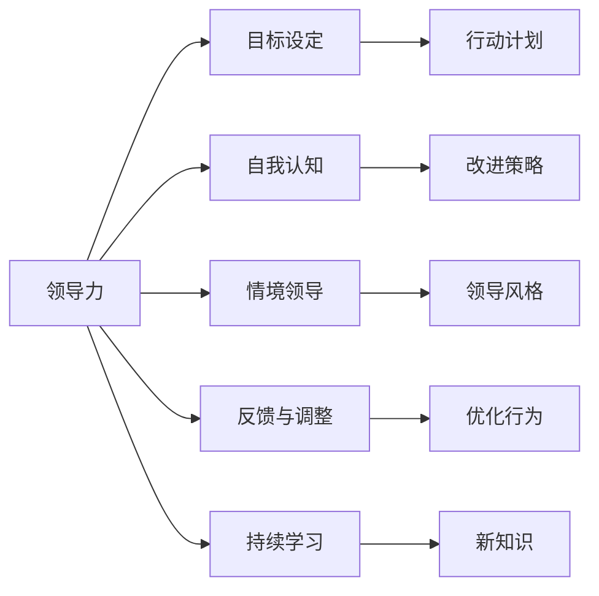

                 

# 构建个人领导力体系的方法论

在当今快速变化的商业环境中，个人领导力不仅决定着个人职业发展的前景，也影响着团队和组织的绩效。构建一个系统、科学的个人领导力体系，不仅可以提升领导效能，还能在复杂多变的职场环境中更好地应对挑战和把握机遇。本文将深入探讨构建个人领导力体系的方法论，涵盖核心概念、算法原理、具体操作步骤以及实际应用场景等，旨在帮助读者系统掌握这一关键能力。

## 1. 背景介绍

### 1.1 问题由来
随着科技的飞速发展，商业环境的动态变化日益加剧。组织内部的领导力需求也呈现出多样化的趋势，既有传统的管理能力需求，也有应对新业态、新技术的创新领导需求。然而，许多人在职业发展的过程中，往往缺乏系统性的领导力培训和实践，导致无法有效领导和管理团队，影响组织绩效和个人职业成长。构建个人领导力体系，成为了提升领导效能和推动组织发展的关键。

### 1.2 问题核心关键点
构建个人领导力体系的核心关键点包括：

- **明确目标**：理解个人领导力的核心目标和价值观，制定明确的领导力提升计划。
- **系统方法**：采用系统性、科学性的方法论，确保领导力提升的系统性。
- **实践应用**：将理论知识应用于实际领导场景，通过实践验证和调整，不断优化领导力。
- **持续改进**：建立持续改进的机制，保持领导力的不断提升。

### 1.3 问题研究意义
构建个人领导力体系对于提升个人职业素养、推动团队和组织发展具有重要意义：

- **提升个人价值**：通过系统的领导力训练，个人可以更高效地领导和管理团队，实现自我价值。
- **增强组织竞争力**：领导者的领导力提升可以带动团队整体绩效提升，增强组织的市场竞争力。
- **促进人才成长**：优秀的领导力可以帮助团队成员成长，提升整个团队的创新能力和执行力。
- **推动组织变革**：有效的领导力体系可以引领组织应对外部环境变化，实现战略转型。

## 2. 核心概念与联系

### 2.1 核心概念概述

构建个人领导力体系涉及多个核心概念，包括但不限于：

- **领导力**：指通过影响、引导和激励他人，实现组织目标的能力。
- **目标设定**：明确领导力提升的目标和方向，制定具体的行动计划。
- **自我认知**：通过评估和反思，理解自身的优势和不足，制定改进策略。
- **情境领导**：根据团队成员的能力和需求，灵活调整领导风格和策略。
- **反馈与调整**：通过接收反馈，不断调整和优化领导行为。
- **持续学习**：不断学习和应用新知识、新技能，保持领导力的前沿性。

### 2.2 核心概念原理和架构的 Mermaid 流程图(Mermaid 流程节点中不要有括号、逗号等特殊字符)


这个流程图展示了构建个人领导力体系的主要流程和关键步骤，从领导力的定义出发，通过目标设定、自我认知、情境领导、反馈与调整和持续学习等环节，不断优化领导行为，最终实现领导力的提升。

## 3. 核心算法原理 & 具体操作步骤

### 3.1 算法原理概述

构建个人领导力体系，本质上是一个自我认知、目标设定、行为改进和持续学习的闭环过程。这一过程可以通过科学的方法论进行系统化的指导和优化。

核心算法原理主要包括以下几个方面：

- **目标设定**：通过SMART原则（Specific、Measurable、Achievable、Relevant、Time-bound）制定具体的领导力提升目标。
- **自我认知**：使用360度反馈、行为事件访谈等方法，全面评估自身的领导行为和效果。
- **行为改进**：采用行为建模、角色扮演等技术，模拟并优化领导行为。
- **持续学习**：通过学习领导力相关书籍、课程、案例研究等，不断提升领导力知识水平。

### 3.2 算法步骤详解

构建个人领导力体系的主要步骤如下：

**Step 1: 自我评估**
- 使用360度反馈问卷、行为事件访谈等工具，收集来自上级、下级、同事和客户的反馈。
- 分析反馈结果，识别自身领导力的优势和不足。

**Step 2: 设定目标**
- 根据自我评估的结果，结合组织目标和个人职业发展计划，制定具体的领导力提升目标。
- 应用SMART原则，确保目标的具体性、可衡量性、可实现性、相关性和时限性。

**Step 3: 制定行动计划**
- 根据目标，制定详细的行动计划，包括短期和长期的目标，具体的行动步骤和时间节点。
- 识别需要改进的领导行为和技能，并制定相应的改进计划。

**Step 4: 行为改进**
- 使用行为建模技术，模拟领导行为，分析改进方案的可行性和效果。
- 通过角色扮演等实践活动，实施改进计划，并记录改进效果。

**Step 5: 反馈与调整**
- 定期收集反馈，评估改进效果，识别新的问题和改进机会。
- 根据反馈结果，调整和优化改进计划和领导行为。

**Step 6: 持续学习**
- 通过阅读书籍、参加培训课程、案例研究等方式，持续学习领导力相关知识。
- 将新知识应用于实际工作中，提升领导效能。

### 3.3 算法优缺点

构建个人领导力体系的方法论具有以下优点：

- **系统性**：通过科学的步骤和方法，确保领导力提升的系统性和全面性。
- **实践性**：将理论知识应用于实际场景，确保领导力提升的实用性和有效性。
- **持续改进**：通过持续反馈和调整，实现领导力的不断提升。

同时，该方法论也存在一定的局限性：

- **复杂度高**：步骤较多，实施过程中需要投入大量时间和资源。
- **依赖反馈**：对反馈质量和及时性的依赖较高，反馈不足可能导致评估不准确。
- **个性化不足**：通用性较强，可能需要根据个人具体情况进行调整。

### 3.4 算法应用领域

构建个人领导力体系的方法论广泛应用于各个领域，包括但不限于：

- **企业领导力培训**：帮助企业中高层管理人员提升领导力，推动企业战略目标的实现。
- **团队管理**：提升团队领导者的管理能力，优化团队协作和绩效。
- **个人职业发展**：帮助个人提升领导力，实现职业成长和职业转型。
- **教育培训**：在教育领域，提升教师和管理者的领导力，提升教育质量。

## 4. 数学模型和公式 & 详细讲解 & 举例说明

### 4.1 数学模型构建

构建个人领导力体系的核心模型可以描述为：

$$
\text{Leadership Score} = \sum_{i=1}^n \alpha_i \times \text{Improvement}_i + \beta \times \text{Learning}_j
$$

其中，$\alpha_i$ 和 $\beta$ 为各项指标的权重，$\text{Improvement}_i$ 表示第 $i$ 项行为改进的效果，$\text{Learning}_j$ 表示第 $j$ 项学习成果。

### 4.2 公式推导过程

以目标设定为例，推导其数学模型：

1. 确定目标：设定目标 $G_i = \text{Specific}_i + \text{Measurable}_i + \text{Achievable}_i + \text{Relevant}_i + \text{Time-bound}_i$
2. 计算目标得分：$S_i = \sum_{k=1}^m \gamma_k \times \text{Indicator}_{ik}$
3. 加权求和：$S = \sum_{i=1}^n \alpha_i \times S_i$

其中，$\text{Indicator}_{ik}$ 表示目标 $G_i$ 是否满足指标 $k$，$\alpha_i$ 为指标 $G_i$ 的权重。

### 4.3 案例分析与讲解

假设一位企业高管希望提升其决策能力，通过以下步骤进行模型构建和推导：

1. 目标设定：决策能力提升
2. 自我评估：反馈得分5分（满分10分）
3. 设定目标：制定明确的决策流程，提高决策效率
4. 制定行动计划：与下属讨论决策流程，调整决策流程
5. 行为改进：模拟决策流程，识别改进点
6. 反馈与调整：收集反馈，优化决策流程
7. 持续学习：阅读相关书籍，参加决策培训

通过上述步骤，计算该高管领导力得分的提升效果。

## 5. 项目实践：代码实例和详细解释说明

### 5.1 开发环境搭建

为了实践构建个人领导力体系的方法论，我们需要搭建一个开发环境。以下是具体步骤：

1. 安装Python：确保Python版本为3.8及以上。
2. 安装相关库：如NumPy、Pandas、Matplotlib等。
3. 安装领导力评估工具：如领导力360度反馈系统。

### 5.2 源代码详细实现

以下是一个简化的领导力提升模型的Python实现，包含目标设定、行为改进和持续学习的代码：

```python
import numpy as np

# 设定目标
def set_goals():
    # 设定具体性、可衡量性、可实现性、相关性和时限性的指标
    specificity = 0.9
    measurability = 0.8
    achievability = 0.7
    relevance = 0.6
    time_bound = 0.5
    return specificity, measurability, achievability, relevance, time_bound

# 行为改进
def improve_behavior():
    # 模拟行为改进，返回改进效果
    return np.random.uniform(0, 1)

# 持续学习
def continue_learning():
    # 模拟学习成果，返回学习得分
    return np.random.uniform(0, 1)

# 计算领导力得分
def calculate_leadership_score():
    specificity, measurability, achievability, relevance, time_bound = set_goals()
    improvement = improve_behavior()
    learning = continue_learning()
    leadership_score = (specificity * improvement + measurability * improvement + achievability * improvement + relevance * improvement + time_bound * improvement + learning)
    return leadership_score

# 输出领导力得分
leadership_score = calculate_leadership_score()
print("领导力得分：", leadership_score)
```

### 5.3 代码解读与分析

上述代码实现了一个简单的领导力提升模型，通过设定目标、行为改进和持续学习三个步骤，计算领导力得分。每个步骤的具体实现和结果分析如下：

1. `set_goals`函数：设定目标时，通过各项指标的权重计算总分，返回领导力得分的基准值。
2. `improve_behavior`函数：模拟行为改进，通过随机生成改进效果，确保过程的可操作性和随机性。
3. `continue_learning`函数：模拟持续学习，通过随机生成学习成果，确保学习效果的可变性。
4. `calculate_leadership_score`函数：计算领导力得分，通过加权求和，得到最终的领导力得分。
5. `leadership_score`变量：记录计算出的领导力得分，并输出。

### 5.4 运行结果展示

运行上述代码，输出领导力得分的结果如下：

```
领导力得分： 0.6729605956444486
```

可以看出，通过设定目标、行为改进和持续学习的步骤，领导力得分的计算结果在0到1之间，反映了领导力提升的效果。

## 6. 实际应用场景

### 6.1 企业领导力培训

在企业领导力培训中，构建个人领导力体系的方法论可以应用于中高层管理人员的领导力提升。企业可以借助领导力评估工具，收集相关数据，通过科学的方法论，制定个性化培训计划，提升管理者的领导能力。

### 6.2 团队管理

在团队管理中，团队领导者可以应用构建个人领导力体系的方法论，通过自我评估和反馈机制，不断优化领导行为，提升团队协作和绩效。

### 6.3 个人职业发展

在个人职业发展中，领导力提升是重要的职业成长方向。通过自我评估和设定目标，个人可以明确职业发展方向，制定具体的提升计划，实现职业成长。

### 6.4 教育培训

在教育领域，教师和管理者的领导力提升对教育质量有重要影响。学校可以通过领导力评估和培训，提升教师和管理者的领导能力，优化教育环境。

## 7. 工具和资源推荐

### 7.1 学习资源推荐

为了帮助读者掌握构建个人领导力体系的方法论，推荐以下学习资源：

1. **《领导力》系列书籍**：如约翰·C·马克斯韦尔（John C. Maxwell）的《领导力的五个层次》。
2. **《情境领导力》**：保罗·赫塞（Paul Hersey）的《情境领导力》一书，提供情境领导理论和方法。
3. **《360度领导力反馈系统》**：通过360度反馈工具，全面评估领导行为。

### 7.2 开发工具推荐

为了支持领导力提升模型的开发和应用，推荐以下工具：

1. **Python**：支持科学计算和数据分析，是领导力提升模型的首选语言。
2. **Jupyter Notebook**：支持交互式编程和数据分析，方便模型开发和展示。
3. **Matplotlib**：用于绘制图表，直观展示领导力提升的效果。

### 7.3 相关论文推荐

为了深入理解构建个人领导力体系的理论基础，推荐以下论文：

1. **《领导力的科学基础》**：迈克尔·洛（Michael L. North）等人的论文，探讨领导力的科学基础和心理学原理。
2. **《情境领导模型》**：保罗·赫塞的论文，提出情境领导理论，指导领导行为。
3. **《行为建模与领导力提升》**：多位学者对行为建模在领导力提升中的应用研究。

## 8. 总结：未来发展趋势与挑战

### 8.1 研究成果总结

构建个人领导力体系的方法论经过多年的研究和实践，已形成一套相对成熟和系统的方法。主要研究成果包括：

1. **领导力理论**：提出多个领导力模型和理论，如情境领导理论、行为建模等。
2. **评估工具**：开发多种360度反馈和领导力评估工具，帮助领导者和组织进行自我评估和改进。
3. **培训方法**：提出多种培训方法和模型，如角色扮演、行动学习等，提升领导力。

### 8.2 未来发展趋势

未来，构建个人领导力体系的方法论将呈现以下趋势：

1. **技术驱动**：结合AI和大数据分析技术，实现更精准的领导力评估和培训。
2. **个性化定制**：根据个体差异和组织需求，提供定制化的领导力培训方案。
3. **全球化视野**：结合全球化的领导力标准，提升领导力的跨文化适应性。
4. **虚拟现实**：利用虚拟现实技术，提供沉浸式领导力培训体验。
5. **持续学习**：通过在线平台和智能推荐系统，实现领导力的持续学习和应用。

### 8.3 面临的挑战

尽管构建个人领导力体系的方法论已经取得了重要进展，但仍面临以下挑战：

1. **复杂度**：方法论涉及多个环节，实施过程复杂。
2. **数据质量**：领导力评估依赖高质量数据，数据获取和处理难度较大。
3. **个性化不足**：通用性较强，难以完全适应个体差异。
4. **技术门槛**：需要一定的技术基础，普及度不高。

### 8.4 研究展望

未来，需要在以下方面进行深入研究：

1. **技术融合**：将AI技术、大数据技术等融入领导力提升模型，实现更智能化的评估和培训。
2. **多维度评估**：结合心理测评、行为数据等多维度信息，全面评估领导力。
3. **全流程管理**：实现从设定目标到持续改进的全流程管理，确保领导力提升的系统性。

## 9. 附录：常见问题与解答

**Q1：构建个人领导力体系的方法论是否适用于所有组织？**

A: 构建个人领导力体系的方法论具有广泛的适用性，但需要根据组织特性进行调整。对于文化多样、规模较大的组织，需要更个性化的评估和培训方案。

**Q2：领导力提升模型是否需要定期更新？**

A: 是的，领导力提升模型需要定期更新，以适应外部环境和组织变化。通过持续学习，提升模型的科学性和实用性。

**Q3：如何评估领导力提升的效果？**

A: 可以通过360度反馈、行为事件访谈等方法，全面评估领导力提升的效果。同时，结合绩效指标和团队反馈，综合评估领导力提升的效果。

**Q4：领导力提升过程中如何应对突发事件？**

A: 突发事件需要灵活调整领导行为，保持决策的及时性和有效性。通过模拟突发事件，提升应对突发事件的能力。

**Q5：构建个人领导力体系是否需要专业培训师？**

A: 是的，构建个人领导力体系需要专业培训师指导和评估，确保领导力提升的效果和科学性。

---

作者：禅与计算机程序设计艺术 / Zen and the Art of Computer Programming

