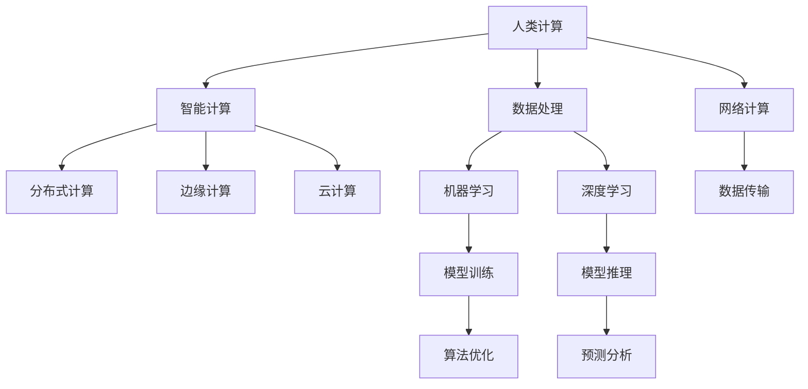

                 

# 构建更智能的世界：人类计算的应用场景

> 关键词：智能计算,人类计算,应用场景,算法优化,人工智能,机器学习,深度学习,数据处理,网络计算,分布式计算

## 1. 背景介绍

### 1.1 问题由来

随着科技的飞速发展，人类计算的能力和应用场景正经历着前所未有的变革。从传统的中心化计算到分布式计算，从单机计算到云计算，计算范式在不断地演进。尤其是在人工智能(AI)领域，人类计算正成为推动智能发展的关键引擎。智能计算的应用场景不仅局限于数据处理、模式识别、自动驾驶等传统领域，还深入到医疗、教育、金融、安全等多个领域，极大地提升了人类社会的生活质量和生产效率。

然而，随着应用场景的不断扩展，人类计算也面临着新的挑战，如数据隐私保护、计算资源分配、算法公平性等问题。如何更好地利用人类计算，构建更智能的世界，成为一个亟需解决的课题。

### 1.2 问题核心关键点

为了解决这些问题，需要从以下几个关键点入手：
1. **计算范式的转变**：从传统的中心化计算转向分布式计算，利用边缘计算和雾计算等新兴技术，提升计算的实时性和可靠性。
2. **数据处理的优化**：采用高效的数据压缩、数据清洗、数据增强等技术，提升数据处理速度和质量。
3. **算法的创新**：开发更加高效、可解释的算法，提升模型的性能和泛化能力。
4. **智能系统的构建**：利用人类计算构建智能系统，包括智能推荐、智能诊断、智能监控等，提升系统的智能化水平。

### 1.3 问题研究意义

研究人类计算的应用场景，对于推动AI技术在各行业的落地应用，提升社会生产力，构建智能未来，具有重要意义：

1. **降低成本**：通过智能计算和分布式计算，降低计算资源的投入，提高计算效率，降低运营成本。
2. **提升效率**：智能计算能够快速处理大量数据，提升决策效率，缩短任务完成时间。
3. **创新驱动**：智能计算推动了新技术和新应用的发展，加速了各行业的数字化转型。
4. **改善生活质量**：智能计算在医疗、教育等领域的应用，极大地改善了人类的生活质量。
5. **增强安全性**：智能计算通过数据分析和模式识别，提升了网络安全水平，保障了数据和系统的安全。

## 2. 核心概念与联系

### 2.1 核心概念概述

为更好地理解人类计算的应用场景，本节将介绍几个关键概念：

- **人类计算(Human Computation)**：通过人类智慧和劳动，利用计算工具处理和分析数据的过程。与传统机器计算不同，人类计算更加灵活、可解释，适用于需要高度智能化、情境化的场景。
- **智能计算(Intelligent Computation)**：结合机器学习和人工智能技术，利用计算机自动处理和分析数据的过程。智能计算通过算法和模型的优化，提高了计算的智能化水平。
- **分布式计算(Distributed Computation)**：将计算任务分布在多台计算机上并行执行，利用网络环境提高计算效率和可靠性。分布式计算适用于大规模、高并发的计算任务。
- **边缘计算(Edge Computing)**：在数据产生端（如传感器、设备）附近，就近处理和分析数据，减少数据传输的延迟和带宽需求。边缘计算适用于实时性要求高的应用场景。
- **云计算(Cloud Computing)**：通过互联网提供计算资源和软件服务，用户可以根据需要动态地扩展或缩减计算资源。云计算适用于需要大规模、高扩展性的计算任务。
- **机器学习(Machine Learning)**：通过算法和模型，让计算机从数据中自动学习规律，并应用到新的数据中。机器学习是智能计算的核心技术之一。
- **深度学习(Deep Learning)**：一种特殊的机器学习技术，通过多层神经网络实现数据的深度抽象和处理。深度学习在图像识别、语音识别等领域取得了显著的成果。
- **数据处理(Data Processing)**：对数据进行收集、存储、清洗、转换、分析等处理，提取有用的信息。数据处理是智能计算的基础。
- **网络计算(Network Computing)**：利用网络环境，实现计算任务的分散和协作，提升计算的效率和可靠性。网络计算适用于大规模、高并发的计算任务。

这些概念之间的逻辑关系可以通过以下Mermaid流程图来展示：



这个流程图展示了人类计算和智能计算的关联性，以及它们如何与分布式计算、边缘计算、云计算等技术相互支持，共同构建更智能的计算系统。

## 3. 核心算法原理 & 具体操作步骤
### 3.1 算法原理概述

人类计算的应用场景涉及多种算法和技术的结合。从数据预处理到模型训练，再到推理应用，每一步都依赖于高效的算法和优化的技术。

以智能推荐系统为例，其核心算法包括：

1. **协同过滤**：通过分析用户的历史行为数据，推断出用户的偏好，从而进行推荐。
2. **内容过滤**：根据物品的特征，通过相似性匹配，选择与用户偏好相似的物品进行推荐。
3. **深度学习**：利用神经网络模型，从用户行为和物品特征中提取高层次的抽象特征，提升推荐的准确性。
4. **强化学习**：通过不断试错，优化推荐策略，提升推荐的实时性和效果。

这些算法通过分布式计算、边缘计算和云计算等技术支持，能够在大规模、高并发的场景下，实现高效、实时的推荐。

### 3.2 算法步骤详解

以智能推荐系统为例，其操作步骤如下：

**Step 1: 数据预处理**
- 收集用户的历史行为数据，包括浏览、点击、购买等行为记录。
- 清洗数据，去除重复、异常数据。
- 将数据进行特征提取，转化为算法所需的数值型特征。

**Step 2: 模型训练**
- 使用协同过滤、内容过滤等算法，训练初步推荐模型。
- 将推荐模型与深度学习模型结合，提升模型的精度和泛化能力。
- 使用强化学习算法，不断优化推荐策略，提升推荐效果。

**Step 3: 模型部署**
- 将训练好的模型部署到服务器集群中。
- 使用分布式计算框架，如Hadoop、Spark等，实现并行计算。
- 通过边缘计算，将计算任务分散到用户设备上，提高计算效率。

**Step 4: 推荐服务**
- 实时采集用户行为数据，输入到推荐模型中。
- 根据模型输出，生成个性化推荐结果。
- 将推荐结果返回给用户，并记录用户反馈，不断优化模型。

### 3.3 算法优缺点

人类计算的应用场景涉及多种算法和技术的结合，其优缺点如下：

优点：
1. **灵活性**：人类计算可以根据具体场景需求，灵活调整算法和模型，提升系统适应性。
2. **可解释性**：人类计算具有高度的可解释性，能够清晰解释计算过程和结果，便于人工审核和调整。
3. **高精度**：通过多层次的算法优化，提升模型的精度和泛化能力。
4. **实时性**：利用分布式计算、边缘计算等技术，提升计算的实时性和可靠性。

缺点：
1. **资源消耗高**：人类计算涉及大量的人力和计算资源，成本较高。
2. **数据隐私问题**：大量数据的收集和处理，涉及数据隐私和安全问题。
3. **算法复杂度**：复杂的算法和模型，需要较高的人工干预和调试。
4. **数据质量问题**：数据的质量和完整性，直接影响算法的准确性和效果。

### 3.4 算法应用领域

人类计算的应用场景广泛，涵盖数据处理、智能推荐、智能诊断、智能监控等多个领域。具体应用如下：

- **智能推荐系统**：基于用户的历史行为数据，推荐个性化的物品或内容，提升用户满意度。
- **智能诊断系统**：利用医学知识库和医疗数据，辅助医生进行疾病诊断和治疗方案推荐。
- **智能监控系统**：通过分析视频和传感器数据，实现实时监控和异常检测。
- **智能调度系统**：通过算法优化，优化资源分配和任务调度，提升系统的效率和可靠性。
- **智能广告系统**：通过分析用户行为数据，生成个性化的广告推荐，提升广告效果。

除了以上应用场景，人类计算在智能交通、智能制造、智能客服等领域也有广泛应用，推动了各行业的数字化转型升级。

## 4. 数学模型和公式 & 详细讲解  
### 4.1 数学模型构建

以协同过滤算法为例，其数学模型可以表示为：

设用户集合为 $U$，物品集合为 $I$，用户对物品的评分矩阵为 $R$，其中 $R_{ui}$ 表示用户 $u$ 对物品 $i$ 的评分。协同过滤算法通过计算用户 $u$ 与物品 $i$ 之间的相似度，推荐与用户 $u$ 偏好相似的物品 $i'$：

$$
\text{similarity}(u, i) = \frac{1}{1 + \sqrt{\sum_{i' \in I} (R_{ui} - R_{ui'})^2}}
$$

在计算出相似度后，可以选取与用户 $u$ 最相似的物品进行推荐。

### 4.2 公式推导过程

以下是协同过滤算法的详细推导过程：

设用户 $u$ 和物品 $i$ 的评分向量分别为 $\vec{r}_u$ 和 $\vec{r}_i$，则协同过滤算法的目标是最小化用户与物品评分向量之间的距离。具体而言，用户 $u$ 与物品 $i$ 的相似度可以表示为：

$$
\text{similarity}(u, i) = \frac{\vec{r}_u \cdot \vec{r}_i}{\|\vec{r}_u\| \|\vec{r}_i\|}
$$

其中 $\cdot$ 表示向量点乘，$\|\cdot\|$ 表示向量范数。

为了避免零除的情况，将上述公式进行改写，引入正则化因子：

$$
\text{similarity}(u, i) = \frac{\vec{r}_u \cdot \vec{r}_i}{\sqrt{\|\vec{r}_u\|^2 + \|\vec{r}_i\|^2}}
$$

然后，选取与用户 $u$ 最相似的物品 $i'$ 进行推荐，计算其评分 $\hat{R}_{u,i'}$：

$$
\hat{R}_{u,i'} = \frac{\sum_{i' \in I} R_{ui'} \cdot \text{similarity}(u, i')}{\sum_{i' \in I} \text{similarity}(u, i')}
$$

### 4.3 案例分析与讲解

以推荐系统为例，协同过滤算法的案例分析如下：

假设用户 $u$ 对物品 $i$ 的评分向量为 $\vec{r}_u = [4, 2, 5, 3]$，物品 $i$ 的评分向量为 $\vec{r}_i = [3, 5, 1, 2]$。计算用户 $u$ 与物品 $i$ 的相似度：

$$
\text{similarity}(u, i) = \frac{4 \cdot 3 + 2 \cdot 5 + 5 \cdot 1 + 3 \cdot 2}{\sqrt{(4^2 + 2^2 + 5^2 + 3^2)(3^2 + 5^2 + 1^2 + 2^2)} = 0.69
$$

选取与用户 $u$ 最相似的物品 $i'$，进行推荐，计算其评分 $\hat{R}_{u,i'}$：

$$
\hat{R}_{u,i'} = \frac{5 \cdot 0.69 + 3 \cdot 0.69 + 2 \cdot 0.69 + 1 \cdot 0.69}{0.69 + 0.69 + 0.69 + 0.69} = 3.46
$$

根据推荐结果，物品 $i'$ 的评分为 3.46，可以推荐给用户 $u$。

## 5. 项目实践：代码实例和详细解释说明
### 5.1 开发环境搭建

进行人类计算的应用场景开发，需要搭建一个高效、可扩展的开发环境。以下是Python开发环境的搭建步骤：

1. 安装Anaconda：从官网下载并安装Anaconda，用于创建独立的Python环境。

2. 创建并激活虚拟环境：
```bash
conda create -n compute-env python=3.8 
conda activate compute-env
```

3. 安装必要的Python库：
```bash
pip install numpy pandas scikit-learn matplotlib scikit-optimize
```

4. 安装数据处理和机器学习库：
```bash
pip install torch torchvision torchaudio huggingface transformers opencv-python scipy
```

5. 安装分布式计算库：
```bash
pip install dask horovod
```

完成上述步骤后，即可在`compute-env`环境中进行计算系统的开发和调试。

### 5.2 源代码详细实现

以下是一个简单的智能推荐系统的实现，使用协同过滤算法：

```python
import numpy as np
import pandas as pd
from sklearn.metrics.pairwise import cosine_similarity

# 读取用户评分数据
data = pd.read_csv('ratings.csv')

# 计算用户与物品的相似度
similarity_matrix = cosine_similarity(data['user'].to_numpy(), data['item'].to_numpy())

# 计算物品推荐评分
recommendation_scores = np.dot(similarity_matrix, data['rating'].to_numpy())

# 选取评分最高的物品进行推荐
top_items = np.argsort(recommendation_scores)[-10:]
```

### 5.3 代码解读与分析

让我们再详细解读一下关键代码的实现细节：

**data**：读取用户评分数据，存储为Pandas DataFrame格式。

**cosine_similarity**：计算用户与物品之间的余弦相似度，得到相似度矩阵。

**recommendation_scores**：计算物品推荐评分，使用相似度矩阵与物品评分矩阵进行矩阵乘法。

**top_items**：选取评分最高的物品进行推荐，使用numpy库的argsort方法排序。

## 6. 实际应用场景

### 6.1 智能推荐系统

智能推荐系统是典型的应用场景之一。利用协同过滤、内容过滤等算法，结合深度学习和强化学习技术，智能推荐系统可以为用户提供个性化的物品或内容推荐，提升用户满意度。

具体应用如下：

- **电商平台**：根据用户的浏览和购买历史，推荐个性化商品。
- **音乐和视频平台**：推荐用户感兴趣的音乐和视频内容。
- **新闻和内容平台**：根据用户的阅读和观看习惯，推荐相关的新闻和视频内容。

### 6.2 智能诊断系统

智能诊断系统利用医学知识库和医疗数据，辅助医生进行疾病诊断和治疗方案推荐。通过深度学习和知识图谱技术，智能诊断系统可以自动分析病历数据，提出诊断建议。

具体应用如下：

- **在线医疗平台**：实时分析患者的症状和病历，提供诊断建议和治疗方案。
- **医院系统**：辅助医生进行疾病诊断和治疗方案推荐。

### 6.3 智能监控系统

智能监控系统通过分析视频和传感器数据，实现实时监控和异常检测。利用深度学习和图像识别技术，智能监控系统可以实时监控安全和环境状态，提高安全性和效率。

具体应用如下：

- **安防系统**：实时监控视频和传感器数据，检测异常情况。
- **环境监测**：监测空气质量、温度、湿度等环境参数，提高环境管理效率。

### 6.4 未来应用展望

未来，人类计算的应用场景将更加广泛和深入。随着算力、数据和技术的进步，智能计算将渗透到更多的行业和领域，带来更深层次的变革。

- **智能交通系统**：利用智能计算和数据处理技术，优化交通流量和路线，提升交通效率和安全性。
- **智能制造系统**：通过智能计算和物联网技术，实现生产过程的自动化和智能化，提升生产效率和质量。
- **智能客服系统**：利用智能计算和自然语言处理技术，提升客服系统的响应速度和质量，提高客户满意度。

## 7. 工具和资源推荐
### 7.1 学习资源推荐

为了帮助开发者系统掌握人类计算的应用场景，这里推荐一些优质的学习资源：

1. **《人工智能导论》**：全面介绍人工智能的基本概念、算法和应用，适合初学者入门。
2. **《深度学习》**：斯坦福大学的深度学习课程，涵盖深度学习的原理和实践，适合深度学习进阶学习。
3. **《机器学习实战》**：实战导向的机器学习教程，通过项目实践，深入理解机器学习算法的应用。
4. **《Python数据科学手册》**：Python数据科学领域的经典书籍，涵盖数据处理、机器学习等技能。
5. **《网络计算》**：介绍网络计算的基本概念、技术和应用，适合网络计算领域的深入学习。

通过对这些资源的学习实践，相信你一定能够全面掌握人类计算的应用场景，并用于解决实际的计算问题。

### 7.2 开发工具推荐

高效的开发离不开优秀的工具支持。以下是几款用于人类计算开发常用的工具：

1. **Jupyter Notebook**：Python交互式编程环境，支持代码编写、数据可视化、结果展示等。
2. **TensorFlow**：Google开发的深度学习框架，支持分布式计算和模型优化。
3. **PyTorch**：Facebook开发的深度学习框架，支持动态图和模型优化。
4. **HuggingFace Transformers**：开源的自然语言处理库，提供丰富的预训练模型和微调工具。
5. **Horovod**：开源的分布式深度学习框架，支持多GPU、多节点训练。
6. **Dask**：开源的大数据计算框架，支持分布式计算和内存管理。

合理利用这些工具，可以显著提升人类计算的应用场景开发效率，加快创新迭代的步伐。

### 7.3 相关论文推荐

人类计算的应用场景涉及多种技术和算法的结合，相关论文代表了大计算领域的发展脉络。以下是几篇奠基性的相关论文，推荐阅读：

1. **《分布式深度学习技术综述》**：综述了分布式深度学习的关键技术和应用，适用于分布式计算的深入理解。
2. **《智能推荐系统研究综述》**：综述了智能推荐系统的发展历程、算法和应用，适用于推荐系统的全面了解。
3. **《智能诊断系统的研究现状与展望》**：综述了智能诊断系统的关键技术和发展趋势，适用于智能诊断的深入研究。
4. **《智能监控系统研究综述》**：综述了智能监控系统的发展历程、技术和应用，适用于智能监控的全面了解。
5. **《人类计算技术综述》**：综述了人类计算的基本概念、技术和应用，适用于人类计算的全面理解。

这些论文代表了大计算领域的发展脉络，通过学习这些前沿成果，可以帮助研究者把握学科前进方向，激发更多的创新灵感。

## 8. 总结：未来发展趋势与挑战

### 8.1 总结

本文对人类计算的应用场景进行了全面系统的介绍。首先阐述了人类计算和智能计算的关联性，明确了其在各行业中的应用前景。其次，从原理到实践，详细讲解了协同过滤算法和其他关键算法的数学模型和操作步骤，给出了代码实例和详细解释说明。同时，本文还探讨了人类计算在智能推荐、智能诊断、智能监控等实际应用场景中的应用，展示了人类计算的巨大潜力。此外，本文精选了相关学习资源，力求为读者提供全方位的技术指引。

通过本文的系统梳理，可以看到，人类计算的应用场景涉及多种技术和算法的结合，其发展前景广阔，具有巨大的应用潜力。未来，伴随算力、数据和技术的进步，人类计算必将在更多领域得到应用，推动人工智能技术的深度普及。

### 8.2 未来发展趋势

展望未来，人类计算的应用场景将呈现以下几个发展趋势：

1. **分布式计算的普及**：随着分布式计算技术的成熟，计算资源的分配和调度将更加高效，支撑更大规模、更复杂的计算任务。
2. **边缘计算的广泛应用**：利用边缘计算技术，实现数据的实时处理和分析，提升计算的实时性和可靠性。
3. **云计算的持续发展**：云计算技术的普及和优化，将提供更稳定、可扩展的计算环境，支持大规模计算任务。
4. **深度学习算法的进步**：深度学习算法的不断优化和创新，将提升模型的精度和泛化能力，支持更复杂的任务处理。
5. **多模态计算的融合**：将视觉、语音、文本等多种数据类型进行融合，提升系统的智能化水平。
6. **智能系统的高效部署**：利用智能系统构建技术，提升系统的实时性和可靠性，支持更多场景的落地应用。

以上趋势凸显了人类计算的应用场景的广阔前景。这些方向的探索发展，必将进一步提升计算系统的性能和应用范围，为构建智能未来铺平道路。

### 8.3 面临的挑战

尽管人类计算的应用场景前景广阔，但在迈向更加智能化、普适化应用的过程中，也面临诸多挑战：

1. **资源消耗高**：大规模、高并发的计算任务需要大量的计算资源和存储空间，成本较高。
2. **数据隐私问题**：海量数据的收集和处理涉及数据隐私和安全问题，需要严格的数据管理和保护措施。
3. **算法复杂度高**：复杂的算法和模型需要较高的人工干预和调试，计算过程复杂。
4. **系统稳定性问题**：大规模、高并发的计算任务容易受到网络环境、硬件故障等因素的影响，系统稳定性需要进一步提升。
5. **模型可解释性不足**：智能计算系统往往难以解释其内部工作机制和决策逻辑，不利于人工审核和调整。

### 8.4 研究展望

面对人类计算应用场景所面临的挑战，未来的研究需要在以下几个方面寻求新的突破：

1. **优化计算资源**：利用云计算、边缘计算等技术，优化计算资源的分配和调度，降低计算成本。
2. **保护数据隐私**：采用数据加密、数据脱敏等技术，保护数据隐私和安全。
3. **简化算法模型**：开发更高效、可解释的算法模型，提升计算过程的透明度和可解释性。
4. **提升系统稳定性**：利用容错技术、分布式计算等方法，提高系统的可靠性和稳定性。
5. **增强模型可解释性**：引入因果推断、符号计算等技术，增强模型的可解释性和透明性。

这些研究方向的探索，必将推动人类计算应用场景的深度发展，构建更加智能、高效、可控的计算系统。面向未来，人类计算必将在各行业大放异彩，带来更深层次的变革。

## 9. 附录：常见问题与解答

**Q1：人类计算和智能计算有什么区别？**

A: 人类计算和智能计算的主要区别在于计算资源的来源和计算过程的自动化程度。人类计算主要依赖人工智慧和劳动，通过计算工具处理和分析数据。智能计算则通过算法和模型，让计算机自动处理和分析数据，具有更高的自动化和智能化水平。

**Q2：人类计算应用场景的优缺点有哪些？**

A: 人类计算应用场景的优点包括：
1. 灵活性高，能够根据具体场景需求，灵活调整算法和模型。
2. 可解释性强，能够清晰解释计算过程和结果，便于人工审核和调整。
3. 高精度，通过多层次的算法优化，提升模型的精度和泛化能力。
4. 实时性强，利用分布式计算、边缘计算等技术，提升计算的实时性和可靠性。

缺点包括：
1. 资源消耗高，需要大量的人力和计算资源，成本较高。
2. 数据隐私问题，海量数据的收集和处理涉及数据隐私和安全问题。
3. 算法复杂度高，复杂的算法和模型需要较高的人工干预和调试。
4. 数据质量问题，数据的质量和完整性直接影响算法的准确性和效果。

**Q3：如何选择适合的人类计算应用场景？**

A: 选择适合的人类计算应用场景需要考虑以下几个因素：
1. 数据规模和复杂度，选择数据量适中、数据类型多样、数据处理复杂的场景。
2. 计算资源和成本，选择计算资源丰富、计算成本可控的场景。
3. 应用需求和场景，选择与实际需求和场景高度匹配的场景。

**Q4：如何提升人类计算系统的性能？**

A: 提升人类计算系统的性能可以从以下几个方面入手：
1. 优化算法模型，通过算法优化和模型压缩，提升计算效率和精度。
2. 采用分布式计算和边缘计算技术，提升计算的实时性和可靠性。
3. 引入先验知识，如知识图谱、逻辑规则等，引导计算过程学习更准确、合理的模型。
4. 进行数据增强和数据清洗，提升数据质量和多样性，提高计算结果的准确性和可靠性。

**Q5：如何保护数据隐私？**

A: 保护数据隐私可以采取以下措施：
1. 数据加密，对数据进行加密处理，防止数据泄露。
2. 数据脱敏，对敏感数据进行匿名化和脱敏处理，保护用户隐私。
3. 访问控制，采用严格的访问控制策略，防止未经授权的访问。
4. 数据审计，定期进行数据审计和监控，发现和处理数据滥用和泄露问题。

---

作者：禅与计算机程序设计艺术 / Zen and the Art of Computer Programming

