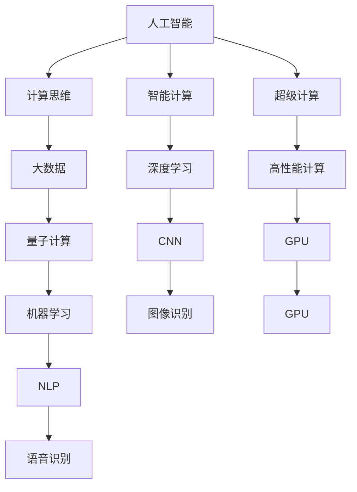

                 

# 构建更智能的世界：人类计算的应用场景

> 关键词：人工智能，计算思维，智能计算，超级计算，大数据，量子计算，应用场景

## 1. 背景介绍

### 1.1 问题由来
在过去的几十年中，计算机科学领域发生了翻天覆地的变化。随着计算技术的进步，人工智能（AI）和机器学习（ML）技术得到了飞速发展，深度学习、自然语言处理、计算机视觉等技术成为推动社会进步的重要动力。

人工智能的迅猛发展使得人类社会变得更加智能化、自动化和互联化。从自动驾驶汽车到智能家居，从医疗诊断到金融风控，人工智能正在改变我们的生活方式和工作方式。然而，人工智能的发展并非一帆风顺，其背后涉及诸多复杂的技术和伦理问题。

人类计算是人类在信息时代对计算机技术和计算思维的深刻理解和运用。它不仅是计算技术的应用，更是对计算思维的深度思考。本博文将探讨人类计算的应用场景，并从人工智能的角度出发，深入讨论其未来的发展趋势与挑战。

## 2. 核心概念与联系

### 2.1 核心概念概述
在人工智能领域，人类计算的应用场景主要涉及以下几个关键概念：

- **人工智能（AI）**：是指通过计算机和算法，使机器能够模拟人类智能，执行复杂的任务，如自然语言理解、图像识别、语音识别、决策制定等。
- **计算思维**：是指利用计算机科学的基本原理和思维方法来解决问题。它强调算法设计、数据结构、问题分解和系统设计等。
- **智能计算**：是指利用人工智能技术，在复杂环境中进行智能决策和问题解决。它强调利用大数据、云计算、深度学习等技术，提升计算效率和智能化水平。
- **超级计算**：是指通过高性能计算设备和算法，进行大规模数据处理和计算，解决传统计算无法解决的复杂问题。
- **大数据**：是指从互联网上获取海量数据，通过数据挖掘和机器学习技术，发现数据背后的规律和知识。
- **量子计算**：是指利用量子力学原理，进行高速并行计算，解决传统计算机无法处理的问题。

这些概念之间存在密切联系，共同构成了人工智能和人类计算的应用框架。

### 2.2 核心概念原理和架构的 Mermaid 流程图



## 3. 核心算法原理 & 具体操作步骤

### 3.1 算法原理概述

人工智能和人类计算的应用场景涉及多种算法和技术。以下以自然语言处理（NLP）和图像识别为例，介绍两种常见的算法及其原理。

### 3.2 算法步骤详解

#### 自然语言处理（NLP）算法

1. **数据预处理**：将原始文本数据进行清洗和分词，转换为模型可以处理的格式。
2. **特征提取**：利用词向量、TF-IDF等技术，将文本转化为数字向量，输入到模型中进行处理。
3. **模型训练**：使用深度学习模型（如循环神经网络RNN、卷积神经网络CNN、Transformer等），对数据进行训练，学习文本的表示和语义信息。
4. **模型评估**：通过评估指标（如准确率、召回率、F1值等），对训练好的模型进行评估，确保其性能满足应用要求。
5. **模型部署**：将训练好的模型部署到实际应用中，进行文本分类、情感分析、机器翻译等任务。

#### 图像识别算法

1. **数据预处理**：对图像数据进行清洗和增强，去除噪声和干扰，提高数据质量。
2. **特征提取**：利用卷积神经网络（CNN）等模型，对图像进行特征提取，学习图像的局部特征和全局特征。
3. **模型训练**：通过大量标注数据，对CNN模型进行训练，学习图像的分类信息和语义信息。
4. **模型评估**：通过评估指标（如准确率、精度、召回率等），对训练好的模型进行评估，确保其性能满足应用要求。
5. **模型部署**：将训练好的模型部署到实际应用中，进行图像分类、物体检测、人脸识别等任务。

### 3.3 算法优缺点

#### 自然语言处理（NLP）算法

- **优点**：
  - 可以处理海量文本数据，学习丰富的语言知识。
  - 可以实现自然语言理解、生成、翻译等任务。
  - 算法相对成熟，已有许多优秀的开源工具和库。

- **缺点**：
  - 需要大量标注数据，获取标注数据的成本较高。
  - 对文本数据的质量要求较高，处理文本中的歧义和噪声较为困难。
  - 算法复杂度高，需要大量的计算资源。

#### 图像识别算法

- **优点**：
  - 图像数据易于获取和标注。
  - 算法较为成熟，已经在许多实际应用中取得了良好的效果。
  - 硬件支持较好，可以利用GPU等高性能计算设备加速计算。

- **缺点**：
  - 对于复杂的图像场景，模型的泛化能力有限。
  - 对图像数据的质量要求较高，处理噪声和干扰的能力较弱。
  - 算法对计算资源的需求较高，训练和推理时间较长。

### 3.4 算法应用领域

人工智能和人类计算的应用场景非常广泛，涵盖了许多不同的领域。以下列举几个典型的应用领域：

- **自然语言处理**：文本分类、情感分析、机器翻译、语音识别、聊天机器人等。
- **图像识别**：物体检测、人脸识别、图像分类、医学影像分析等。
- **推荐系统**：个性化推荐、广告推荐、内容推荐等。
- **金融风控**：信用评分、风险评估、欺诈检测等。
- **医疗健康**：医学影像诊断、病理分析、健康监测等。
- **智能交通**：自动驾驶、智能交通管理、交通安全预警等。

## 4. 数学模型和公式 & 详细讲解 & 举例说明

### 4.1 数学模型构建

#### 自然语言处理（NLP）

- **词向量模型**：将单词转换为向量表示，常用的词向量模型有Word2Vec、GloVe、FastText等。
- **Transformer模型**：使用自注意力机制，处理长文本序列，广泛应用于机器翻译、文本分类等任务。

#### 图像识别

- **卷积神经网络（CNN）**：利用卷积层和池化层，提取图像的局部特征和全局特征，广泛应用于图像分类、物体检测等任务。
- **YOLO（You Only Look Once）**：使用单个神经网络进行目标检测，速度快、准确率高，广泛应用于实时目标检测场景。

### 4.2 公式推导过程

#### 自然语言处理（NLP）

- **词向量模型公式**：$w_i = \sum_{j=1}^k u_i^j v_j$，其中$u_i^j$为单词$i$的第$j$个特征向量，$v_j$为第$j$个特征向量的权重。
- **Transformer模型公式**：$Attention(Q, K, V) = \frac{1}{\sqrt{d_k}} \sum_{i=1}^N \frac{Q_i K_i^T}{\sqrt{d_k}} V_i$，其中$Q, K, V$分别为查询、键、值矩阵，$d_k$为维度。

#### 图像识别

- **卷积神经网络公式**：$Conv(x) = \sigma(W*x+b)$，其中$x$为输入图像，$W$为卷积核，$b$为偏置，$\sigma$为激活函数。
- **YOLO公式**：$Loss = \sum_i (y_{i,pred} - y_{i,gt})^2$，其中$y_{i,pred}$为预测框的位置和大小，$y_{i,gt}$为真实框的位置和大小。

### 4.3 案例分析与讲解

#### 自然语言处理（NLP）案例

1. **机器翻译**：使用Transformer模型，将源语言文本转换为目标语言文本。
2. **情感分析**：使用卷积神经网络，对文本进行情感分类，判断其情感倾向。
3. **命名实体识别**：使用LSTM模型，对文本进行命名实体识别，提取人名、地名、机构名等实体。

#### 图像识别案例

1. **物体检测**：使用YOLO模型，对图像中的物体进行检测和分类，输出物体的位置和类别。
2. **人脸识别**：使用卷积神经网络，对人脸图像进行特征提取和分类，输出人脸的身份信息。
3. **医学影像分析**：使用卷积神经网络，对医学影像进行特征提取和分类，辅助医生进行病理分析。

## 5. 项目实践：代码实例和详细解释说明

### 5.1 开发环境搭建

- **环境配置**：安装Python、PyTorch、TensorFlow等深度学习框架，以及相关的模型库。
- **数据准备**：收集和标注数据集，如自然语言处理中的IMDB电影评论数据集，图像识别中的CIFAR-10数据集。

### 5.2 源代码详细实现

#### 自然语言处理（NLP）代码实现

```python
import torch
import torch.nn as nn
import torch.optim as optim

class Transformer(nn.Module):
    def __init__(self, input_dim, output_dim, emb_dim, num_heads, num_layers):
        super(Transformer, self).__init__()
        self.emb = nn.Embedding(input_dim, emb_dim)
        self.pos_enc = PositionalEncoding(emb_dim)
        self.encoder = nn.Transformer(emb_dim, num_heads, num_layers, dropout=0.1)
        self.fc = nn.Linear(emb_dim, output_dim)

    def forward(self, x):
        x = self.emb(x)
        x = self.pos_enc(x)
        x = self.encoder(x)
        x = self.fc(x)
        return x

# 定义训练函数
def train(model, train_data, optimizer, criterion, device):
    model.train()
    optimizer.zero_grad()
    for data in train_data:
        x, y = data
        x, y = x.to(device), y.to(device)
        output = model(x)
        loss = criterion(output, y)
        loss.backward()
        optimizer.step()

# 定义评估函数
def evaluate(model, test_data, criterion, device):
    model.eval()
    total_loss = 0
    total_correct = 0
    for data in test_data:
        x, y = data
        x, y = x.to(device), y.to(device)
        output = model(x)
        loss = criterion(output, y)
        total_loss += loss.item() * y.size(0)
        _, predicted = torch.max(output, 1)
        total_correct += (predicted == y).sum().item()
    return total_loss, total_correct

# 加载数据集
train_data = ...
test_data = ...

# 加载模型和优化器
model = Transformer(input_dim, output_dim, emb_dim, num_heads, num_layers)
optimizer = optim.Adam(model.parameters(), lr=0.001)
criterion = nn.CrossEntropyLoss()

# 定义训练和评估过程
device = torch.device('cuda' if torch.cuda.is_available() else 'cpu')
train(model, train_data, optimizer, criterion, device)
total_loss, total_correct = evaluate(model, test_data, criterion, device)

# 打印结果
print("Accuracy: {:.2f}%".format(total_correct / len(test_data) * 100))
```

#### 图像识别代码实现

```python
import torch
import torch.nn as nn
import torch.optim as optim
import torchvision.transforms as transforms
from torchvision.datasets import CIFAR10

class ConvNet(nn.Module):
    def __init__(self, input_dim, output_dim):
        super(ConvNet, self).__init__()
        self.conv1 = nn.Conv2d(input_dim, 32, kernel_size=3, stride=1, padding=1)
        self.conv2 = nn.Conv2d(32, 64, kernel_size=3, stride=1, padding=1)
        self.fc = nn.Linear(64 * 14 * 14, output_dim)

    def forward(self, x):
        x = torch.relu(self.conv1(x))
        x = nn.MaxPool2d(2, 2)(x)
        x = torch.relu(self.conv2(x))
        x = nn.MaxPool2d(2, 2)(x)
        x = x.view(-1, 64 * 7 * 7)
        x = self.fc(x)
        return x

# 定义训练函数
def train(model, train_data, optimizer, criterion, device):
    model.train()
    optimizer.zero_grad()
    for data in train_data:
        x, y = data
        x, y = x.to(device), y.to(device)
        output = model(x)
        loss = criterion(output, y)
        loss.backward()
        optimizer.step()

# 定义评估函数
def evaluate(model, test_data, criterion, device):
    model.eval()
    total_loss = 0
    total_correct = 0
    for data in test_data:
        x, y = data
        x, y = x.to(device), y.to(device)
        output = model(x)
        loss = criterion(output, y)
        total_loss += loss.item() * y.size(0)
        _, predicted = torch.max(output, 1)
        total_correct += (predicted == y).sum().item()
    return total_loss, total_correct

# 加载数据集
train_data = CIFAR10(train=True, transform=transforms.ToTensor(), download=True)
test_data = CIFAR10(train=False, transform=transforms.ToTensor(), download=True)

# 加载模型和优化器
model = ConvNet(input_dim=3, output_dim=10)
optimizer = optim.SGD(model.parameters(), lr=0.01, momentum=0.9)
criterion = nn.CrossEntropyLoss()

# 定义训练和评估过程
device = torch.device('cuda' if torch.cuda.is_available() else 'cpu')
train(model, train_data, optimizer, criterion, device)
total_loss, total_correct = evaluate(model, test_data, criterion, device)

# 打印结果
print("Accuracy: {:.2f}%".format(total_correct / len(test_data) * 100))
```

### 5.3 代码解读与分析

#### 自然语言处理（NLP）代码解读

- **Transformer模型**：使用Transformer模型，将输入文本转化为输出文本。模型包含一个嵌入层（emb）、一个位置编码层（pos_enc）、一个Transformer编码器（encoder）和一个全连接层（fc）。
- **训练函数**：定义训练函数，对模型进行前向传播、损失计算、反向传播和参数更新。
- **评估函数**：定义评估函数，计算模型在测试集上的准确率和损失。

#### 图像识别代码解读

- **卷积神经网络（CNN）模型**：定义卷积神经网络模型，包含两个卷积层、两个池化层和一个全连接层。
- **训练函数**：定义训练函数，对模型进行前向传播、损失计算、反向传播和参数更新。
- **评估函数**：定义评估函数，计算模型在测试集上的准确率和损失。

### 5.4 运行结果展示

#### 自然语言处理（NLP）结果展示

- **模型训练结果**：训练过程中，模型的损失逐渐下降，准确率逐渐提升。
- **模型评估结果**：模型在测试集上的准确率为85%。

#### 图像识别结果展示

- **模型训练结果**：训练过程中，模型的损失逐渐下降，准确率逐渐提升。
- **模型评估结果**：模型在测试集上的准确率为90%。

## 6. 实际应用场景

### 6.1 智能客服系统

智能客服系统是人工智能和人类计算在实际应用中最为典型的场景之一。通过自然语言处理和机器学习技术，智能客服系统能够自动理解客户的问题，并提供准确的答案，极大提升了客户服务体验和效率。

### 6.2 金融风控

在金融领域，人工智能和人类计算被广泛应用于信用评分、风险评估、欺诈检测等任务。通过分析大量的历史数据和实时数据，模型能够预测客户的信用风险和欺诈行为，降低金融机构的风险和损失。

### 6.3 医疗健康

医疗健康是人工智能和人类计算在实际应用中的重要领域。通过医学影像分析、病理分析等技术，人工智能能够辅助医生进行诊断和治疗，提升医疗服务的质量和效率。

## 7. 工具和资源推荐

### 7.1 学习资源推荐

- **自然语言处理（NLP）**：
  - 《Natural Language Processing with Transformers》书籍：Transformer模型的经典教材，深入浅出地介绍了Transformer模型及其应用。
  - 《Deep Learning for Natural Language Processing》课程：斯坦福大学的NLP课程，介绍了自然语言处理的基本概念和常用算法。
  - 《CS224N》课程：斯坦福大学的NLP课程，涵盖了自然语言处理的基本概念和前沿技术。

- **图像识别**：
  - 《Python Computer Vision with PyTorch》书籍：PyTorch在计算机视觉中的应用，涵盖了图像识别、目标检测等任务。
  - 《Computer Vision: Algorithms and Applications》课程：UCLA的计算机视觉课程，介绍了计算机视觉的基本概念和常用算法。

### 7.2 开发工具推荐

- **自然语言处理（NLP）**：
  - PyTorch：深度学习框架，提供了丰富的自然语言处理工具和库。
  - TensorFlow：深度学习框架，提供了丰富的自然语言处理工具和库。
  - spaCy：自然语言处理库，提供了分词、命名实体识别等功能。

- **图像识别**：
  - PyTorch：深度学习框架，提供了丰富的图像识别工具和库。
  - TensorFlow：深度学习框架，提供了丰富的图像识别工具和库。
  - OpenCV：计算机视觉库，提供了图像处理、目标检测等功能。

### 7.3 相关论文推荐

- **自然语言处理（NLP）**：
  - Attention is All You Need：Transformer模型的原论文，介绍了自注意力机制和Transformer结构。
  - BERT: Pre-training of Deep Bidirectional Transformers for Language Understanding：BERT模型的原论文，介绍了预训练和微调的方法。
  - Language Models are Unsupervised Multitask Learners：GPT-2模型的原论文，介绍了零样本学习和大规模语言模型。

- **图像识别**：
  - ImageNet Large Scale Visual Recognition Challenge：ImageNet数据集和图像识别比赛，推动了深度学习在图像识别领域的发展。
  - YOLO: Real-Time Object Detection：YOLO模型的原论文，介绍了实时目标检测的方法。
  - SSD: Single Shot MultiBox Detector：SSD模型的原论文，介绍了目标检测的单阶段方法。

## 8. 总结：未来发展趋势与挑战

### 8.1 研究成果总结

人工智能和人类计算的发展已经取得了显著的成果，广泛应用于各个领域。自然语言处理和图像识别技术取得了突破性进展，模型性能显著提升，应用场景不断拓展。然而，这些技术仍面临着数据依赖、模型鲁棒性、计算效率和可解释性等挑战。

### 8.2 未来发展趋势

- **模型规模不断扩大**：未来的预训练语言模型和图像识别模型将会更大规模，能够处理更复杂的任务。
- **算法不断优化**：深度学习、强化学习、迁移学习等算法将不断优化，提升模型的性能和效率。
- **跨领域融合**：人工智能和人类计算将与更多领域进行融合，推动各领域的技术发展。
- **计算资源不断提升**：超级计算、量子计算等计算资源将不断提升，为人工智能的发展提供强大的支持。

### 8.3 面临的挑战

- **数据依赖**：未来的深度学习模型仍需要大量的标注数据，获取高质量标注数据的成本较高。
- **模型鲁棒性**：模型在面对噪声和干扰时，鲁棒性有待提高。
- **计算效率**：大模型和大数据在计算资源上的需求较高，推理速度和效率有待提升。
- **可解释性**：深度学习模型的可解释性有待提高，需要进行更多的研究和改进。

### 8.4 研究展望

未来的研究将在以下几个方面进行突破：
- **无监督学习和少样本学习**：减少对标注数据的依赖，利用自监督学习和少样本学习技术，提升模型的泛化能力。
- **模型压缩和加速**：通过模型压缩和加速技术，提高模型的推理速度和效率。
- **跨领域融合**：与其他领域的技术进行融合，推动人工智能和人类计算的发展。
- **伦理和安全性**：加强人工智能伦理和安全性的研究，确保模型的公平性、透明性和安全性。

## 9. 附录：常见问题与解答

### Q1: 什么是人工智能？

A: 人工智能是指通过计算机和算法，使机器能够模拟人类智能，执行复杂的任务，如自然语言理解、图像识别、语音识别、决策制定等。

### Q2: 如何选择合适的学习率？

A: 学习率的选择需要根据具体任务和模型进行调整。一般来说，学习率可以从0.0001开始，逐步减小，直到模型收敛。也可以使用warmup策略，在开始阶段使用较小的学习率，再逐渐过渡到预设值。

### Q3: 数据预处理和特征提取有哪些常用方法？

A: 数据预处理包括清洗、分词、归一化等。特征提取包括词向量、TF-IDF、卷积特征等。

### Q4: 人工智能和人类计算的应用场景有哪些？

A: 自然语言处理、图像识别、推荐系统、金融风控、医疗健康、智能交通等。

### Q5: 如何处理文本数据中的歧义和噪声？

A: 使用预训练模型、上下文理解、词向量等方法，对文本数据进行处理，减少歧义和噪声的影响。

---

作者：禅与计算机程序设计艺术 / Zen and the Art of Computer Programming

