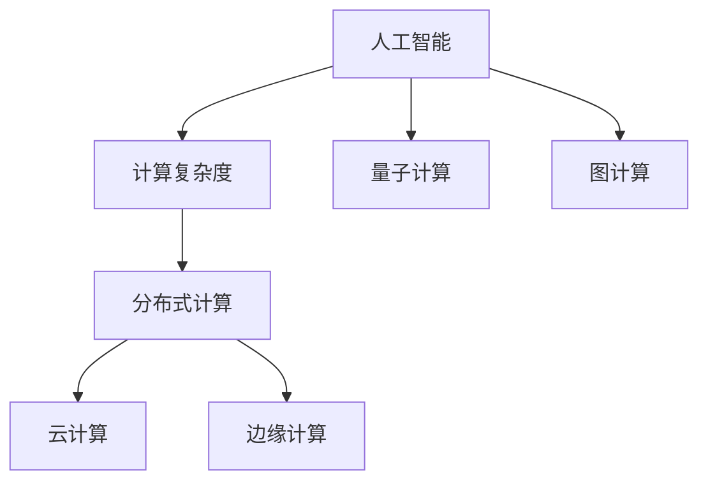

                 

# 构建更智能的世界：人类计算的应用场景

> 关键词：人工智能, 计算复杂度, 分布式计算, 量子计算, 图计算, 云计算, 边缘计算

## 1. 背景介绍

### 1.1 问题由来

随着信息技术的高速发展，计算能力已经成为推动经济和社会进步的关键力量。在数字经济时代，计算能力已经成为衡量一个国家综合实力的重要指标之一。从超级计算机到边缘计算，从量子计算到云计算，计算技术正在不断地突破极限，为人类社会的智能化、自动化和智能化提供强有力的支持。

然而，传统的计算模型和计算设备已经无法满足未来大规模、复杂、实时计算的需求。我们需要新的计算范式和计算架构，以应对不断增长的计算需求和多样化的应用场景。为此，本文将介绍几种最新的计算范式和计算架构，探讨它们的应用场景和优势。

## 2. 核心概念与联系

### 2.1 核心概念概述

为更好地理解本文所介绍的计算范式和计算架构，我们先介绍几个核心概念：

- 人工智能(AI)：通过训练大量数据和优化算法，使计算机能够模拟人类的认知和决策能力，从而实现智能应用。

- 计算复杂度(Computational Complexity)：表示算法运行时间或空间需求的增长率。一般用大O符号表示。

- 分布式计算(Distributed Computing)：将一个大问题分解成多个子问题，通过多台计算机并行处理，以达到更快的计算速度。

- 量子计算(Quantum Computing)：利用量子位(qubit)的量子叠加、纠缠和干涉特性，实现比传统计算模型更高的并行计算能力。

- 图计算(Graph Computing)：通过分析数据中的网络结构关系，提供比传统计算模型更高的查询效率和数据推理能力。

- 云计算(Cloud Computing)：通过在云端提供计算资源，实现按需使用、弹性扩展的计算环境。

- 边缘计算(Edge Computing)：将计算任务转移到靠近数据源的分布式节点上，以减少网络延迟和带宽消耗，提高响应速度和数据处理能力。

这些核心概念之间相互联系，共同构成了现代计算技术的基础。通过理解这些概念，我们可以更好地把握不同计算范式和计算架构的原理和优势。

### 2.2 核心概念原理和架构的 Mermaid 流程图



这个流程图展示了不同计算范式和计算架构之间的逻辑关系：

1. 人工智能通过训练数据和优化算法，实现智能应用。
2. 计算复杂度反映了算法和计算架构的运行效率。
3. 分布式计算通过并行处理实现更快的计算速度。
4. 量子计算利用量子特性，提供更高的并行计算能力。
5. 图计算通过分析网络结构关系，提供更高的查询效率和数据推理能力。
6. 云计算通过按需使用、弹性扩展，提供灵活的计算环境。
7. 边缘计算通过分布式处理，提高响应速度和数据处理能力。

这些计算范式和计算架构各自具有独特的优势和适用场景，为不同领域的应用提供了有力支持。

## 3. 核心算法原理 & 具体操作步骤

### 3.1 算法原理概述

本文介绍的几种计算范式和计算架构，其核心算法原理各不相同，但都围绕着提高计算效率和扩展性这一目标进行设计和优化。

- 分布式计算通过并行处理，实现更快的计算速度。
- 量子计算利用量子叠加、纠缠和干涉，提供更高的并行计算能力。
- 图计算通过网络结构关系，提供更高的查询效率和数据推理能力。
- 云计算通过弹性扩展，提供灵活的计算环境。
- 边缘计算通过分布式处理，提高响应速度和数据处理能力。

### 3.2 算法步骤详解

#### 分布式计算

1. 任务划分：将一个大问题分解成多个子问题，每个子问题分配给不同的计算节点处理。
2. 并行计算：各个计算节点并行执行子问题，通过消息传递或共享内存进行数据交换。
3. 结果合并：将各个节点的计算结果进行合并，得到最终结果。

#### 量子计算

1. 量子编码：将数据编码为量子比特，利用量子叠加和纠缠，实现高效的并行计算。
2. 量子门操作：通过量子门操作，实现量子比特之间的逻辑运算。
3. 量子测量：将量子比特测量为经典比特，得到计算结果。

#### 图计算

1. 图数据建模：将数据建模为图结构，包括节点、边和属性。
2. 图查询处理：通过图数据库或图算法库，进行图查询和分析。
3. 图结果输出：将查询结果输出为可视化或统计结果。

#### 云计算

1. 资源分配：根据任务需求，动态分配计算资源。
2. 任务调度：将任务分配给可用的计算节点进行计算。
3. 结果存储：将计算结果存储在云端，供后续使用。

#### 边缘计算

1. 数据采集：将数据采集到靠近数据源的分布式节点上。
2. 数据处理：在边缘节点上进行实时数据处理和分析。
3. 结果传输：将处理结果传输到云端或用户终端。

### 3.3 算法优缺点

#### 分布式计算

优点：
- 通过并行处理，实现更快的计算速度。
- 适应大规模计算任务，可以处理海量数据。

缺点：
- 需要额外的通信开销，网络延迟较大。
- 数据一致性和容错性问题较为复杂。

#### 量子计算

优点：
- 利用量子特性，实现更高的并行计算能力。
- 有望解决传统计算难以解决的复杂问题。

缺点：
- 量子比特的稳定性和可控性问题尚未解决。
- 需要高精度的硬件设备和算法支持。

#### 图计算

优点：
- 利用网络结构关系，提供更高的查询效率和数据推理能力。
- 适用于社交网络、物流网络等复杂网络分析。

缺点：
- 数据建模复杂，需要构建准确的图结构。
- 查询和分析复杂度较高，计算资源需求大。

#### 云计算

优点：
- 按需使用、弹性扩展，提供灵活的计算环境。
- 可以处理海量数据和高并发任务。

缺点：
- 需要联网使用，数据传输成本较高。
- 云计算平台的安全性和隐私保护需要额外考虑。

#### 边缘计算

优点：
- 靠近数据源，响应速度和数据处理能力较高。
- 减少网络延迟和带宽消耗，提高实时性。

缺点：
- 计算资源和存储资源有限，需要合理分配。
- 部署和管理复杂，需要专业人员维护。

### 3.4 算法应用领域

#### 分布式计算

- 大数据处理：通过分布式计算，处理海量数据，如Hadoop、Spark等。
- 科学计算：通过分布式计算，进行大规模数值计算，如 weather prediction、 molecular simulation等。

#### 量子计算

- 密码学：利用量子计算破解传统加密算法，或设计量子安全加密算法。
- 优化问题：利用量子计算，优化复杂的数学问题，如 travel routing、 resource allocation等。

#### 图计算

- 社交网络分析：通过图计算，分析社交网络的结构和关系，如 community detection、 link prediction等。
- 物流网络优化：通过图计算，优化物流网络路径和流量，如 route optimization、 traffic flow simulation等。

#### 云计算

- 云存储：通过云计算，提供大规模数据存储和访问，如 Amazon S3、 Microsoft Azure Blob Storage等。
- 云平台：通过云计算，提供完善的计算和开发环境，如 AWS、 Google Cloud Platform等。

#### 边缘计算

- 物联网设备：通过边缘计算，处理物联网设备的实时数据，如 smart city、 intelligent home等。
- 实时系统：通过边缘计算，提高实时系统的响应速度和数据处理能力，如 autonomous driving、 virtual reality等。

## 4. 数学模型和公式 & 详细讲解 & 举例说明

### 4.1 数学模型构建

本节将使用数学语言对几种计算范式和计算架构进行更加严格的刻画。

#### 分布式计算

1. 任务划分：将计算任务 $T$ 分解成 $n$ 个子任务 $T_1, T_2, ..., T_n$。
2. 并行计算：每个计算节点 $P_i$ 执行子任务 $T_i$，并返回结果 $R_i$。
3. 结果合并：将各个节点返回的结果进行合并，得到最终结果 $R$。

#### 量子计算

1. 量子编码：将输入数据 $x$ 编码为量子比特 $q_1, q_2, ..., q_n$。
2. 量子门操作：对量子比特进行逻辑运算，如 Hadamard门、CNOT门等。
3. 量子测量：将量子比特测量为经典比特 $r_1, r_2, ..., r_n$，得到计算结果 $y$。

#### 图计算

1. 图数据建模：将数据建模为图结构 $G=(V,E)$，其中 $V$ 为节点，$E$ 为边。
2. 图查询处理：通过图数据库或图算法库，进行图查询和分析，如 PageRank算法、 Minimum Spanning Tree等。
3. 图结果输出：将查询结果输出为可视化或统计结果。

#### 云计算

1. 资源分配：根据任务需求，分配计算资源 $C$，如 CPU、内存等。
2. 任务调度：将任务 $T$ 分配给可用的计算节点 $P_i$，并执行任务。
3. 结果存储：将计算结果 $R$ 存储在云端，供后续使用。

#### 边缘计算

1. 数据采集：将数据采集到靠近数据源的分布式节点 $N$，如边缘服务器。
2. 数据处理：在边缘节点 $N$ 上进行实时数据处理和分析。
3. 结果传输：将处理结果 $R$ 传输到云端或用户终端。

### 4.2 公式推导过程

#### 分布式计算

1. 任务划分：$T = T_1 \cup T_2 \cup ... \cup T_n$
2. 并行计算：$P_i$ 执行 $T_i$，返回 $R_i$
3. 结果合并：$R = R_1 \cup R_2 \cup ... \cup R_n$

#### 量子计算

1. 量子编码：$x \rightarrow q_1, q_2, ..., q_n$
2. 量子门操作：$U(q_1, q_2, ..., q_n) = q_1', q_2', ..., q_n'$
3. 量子测量：$r_1, r_2, ..., r_n \rightarrow y$

#### 图计算

1. 图数据建模：$G = (V, E)$
2. 图查询处理：$\text{Result} = \text{Query}(G)$
3. 图结果输出：$O(\text{Result})$

#### 云计算

1. 资源分配：$C = (C_1, C_2, ..., C_n)$
2. 任务调度：$T \rightarrow P_i$
3. 结果存储：$R \rightarrow S$

#### 边缘计算

1. 数据采集：$D \rightarrow N$
2. 数据处理：$D \rightarrow R$
3. 结果传输：$R \rightarrow T$

### 4.3 案例分析与讲解

#### 分布式计算案例

假设需要计算一个包含 $10^6$ 个数的数组的平均值，每个计算节点只能处理 $10^5$ 个数。可以将数组分成 $10$ 个子数组，每个计算节点计算一个子数组，然后将结果合并，得到最终平均值。

具体步骤：
1. 将数组分成 $10$ 个子数组。
2. 每个计算节点计算一个子数组的平均值。
3. 将各个节点的结果合并，得到最终平均值。

#### 量子计算案例

假设需要计算一个 $1000000$ 位的斐波那契数列的第 $10000$ 个数。使用传统计算方法需要非常长的时间。而利用量子计算，可以在较短的时间内完成计算。

具体步骤：
1. 将输入数据编码为量子比特。
2. 对量子比特进行多次逻辑运算，得到结果。
3. 将量子比特测量为经典比特，得到计算结果。

#### 图计算案例

假设需要分析一个社交网络的传播路径。可以使用图计算方法，通过图数据库或图算法库进行查询和分析。

具体步骤：
1. 将社交网络建模为图结构。
2. 使用图查询和分析算法，计算传播路径。
3. 输出查询结果，进行分析。

#### 云计算案例

假设需要存储和处理海量数据。可以使用云计算平台，如 AWS、 Google Cloud Platform，进行数据存储和计算。

具体步骤：
1. 在云端分配计算资源。
2. 将数据上传至云端，进行分布式处理。
3. 将处理结果下载至本地，进行后续分析。

#### 边缘计算案例

假设需要实时处理传感器数据。可以使用边缘计算，将数据采集到靠近传感器的分布式节点上，进行实时数据处理和分析。

具体步骤：
1. 将传感器数据采集到边缘服务器。
2. 在边缘服务器上进行实时数据处理。
3. 将处理结果传输至云端或用户终端。

## 5. 项目实践：代码实例和详细解释说明

### 5.1 开发环境搭建

在进行项目实践前，我们需要准备好开发环境。以下是使用Python进行分布式计算的开发环境配置流程：

1. 安装Anaconda：从官网下载并安装Anaconda，用于创建独立的Python环境。

2. 创建并激活虚拟环境：
```bash
conda create -n dist-compute python=3.8 
conda activate dist-compute
```

3. 安装必要的库：
```bash
pip install numpy pandas dask distributed
```

4. 启动Distributed任务调度器：
```bash
distributed.start --nthreads 4
```

完成上述步骤后，即可在`dist-compute`环境中开始分布式计算项目。

### 5.2 源代码详细实现

#### 分布式计算示例

我们以一个简单的斐波那契数列计算为例，演示如何使用分布式计算实现。

```python
from distributed import Client, ResourcePool

def fibonacci(n, num_workers=4):
    client = Client()

    # 创建资源池
    with ResourcePool() as pool:
        # 创建计算任务
        fib = pool.submit(fibonacci_inner, n)
        # 提交到任务调度器
        result = client.submit(fibonacci_inner, n)

    # 返回结果
    return result.result()

def fibonacci_inner(n):
    if n < 2:
        return n
    else:
        return fibonacci(n-1) + fibonacci(n-2)

if __name__ == '__main__':
    print(fibonacci(30))
```

在这个示例中，我们使用了Distributed库实现分布式计算。首先，我们创建一个计算任务，并提交到任务调度器。然后，通过返回的结果得到最终计算结果。

### 5.3 代码解读与分析

**Fibonacci函数**

- `fibonacci`函数：定义分布式计算函数，接收参数`n`和`num_workers`。
- `fibonacci_inner`函数：定义内层计算函数，实现斐波那契数列的计算。

**客户端和资源池**

- `Client`类：用于创建分布式计算客户端。
- `ResourcePool`类：用于创建资源池，管理计算任务。

**任务调度器**

- `submit`方法：将计算任务提交到任务调度器。
- `result`方法：获取计算任务的执行结果。

可以看到，通过Distributed库，我们很容易地实现分布式计算。只需定义计算函数，并将任务提交到任务调度器，即可实现并行计算。

## 6. 实际应用场景

### 6.1 科学计算

科学计算是分布式计算的重要应用场景之一。在天气预测、气候模拟、金融建模等科学计算领域，需要处理海量数据和复杂计算任务，分布式计算可以显著提高计算效率和响应速度。

#### 气象预报

气象预报需要处理大量气象数据，如温度、湿度、风速等。通过分布式计算，可以将气象数据分解成多个子任务，并行处理，实现高效的计算和预测。

### 6.2 大数据处理

大数据处理是分布式计算的另一个重要应用场景。在金融、零售、医疗等大数据领域，需要处理海量数据，进行数据清洗、分析和挖掘。

#### 金融风控

金融风控需要处理大量用户数据，进行风险评估和信用评级。通过分布式计算，可以高效处理海量数据，实时更新风险模型，提高风险识别和控制能力。

### 6.3 人工智能训练

人工智能训练是量子计算的重要应用场景之一。在神经网络训练、深度学习、机器学习等领域，需要处理大规模数据和高复杂度计算任务，量子计算可以提供更高的计算效率和更强的计算能力。

#### 深度学习训练

深度学习训练需要处理大量数据，进行复杂计算。通过量子计算，可以在较短时间内完成大规模数据训练，提升模型性能。

### 6.4 图计算

图计算是图计算的重要应用场景之一。在社交网络分析、物流网络优化、生物信息学等领域，需要分析复杂的网络结构和关系。

#### 社交网络分析

社交网络分析需要分析社交网络的结构和关系，如社区发现、链接预测等。通过图计算，可以高效处理大规模社交网络数据，得到准确的分析结果。

### 6.5 边缘计算

边缘计算是边缘计算的重要应用场景之一。在物联网设备、实时系统、智慧城市等领域，需要处理实时数据和快速响应。

#### 智能家居

智能家居需要实时处理家庭环境数据，如温度、湿度、照明等。通过边缘计算，可以实现实时数据处理和分析，提高家庭自动化和智能化水平。

## 7. 工具和资源推荐

### 7.1 学习资源推荐

为了帮助开发者系统掌握分布式计算、量子计算、图计算、云计算、边缘计算的理论基础和实践技巧，这里推荐一些优质的学习资源：

1. 《分布式计算原理与实践》系列博文：由分布式计算专家撰写，深入浅出地介绍了分布式计算原理、算法和实践，是入门分布式计算的必备资料。

2. 《量子计算原理与实践》系列博文：由量子计算专家撰写，系统介绍了量子计算原理、算法和实践，是入门量子计算的必备资料。

3. 《图计算原理与实践》系列博文：由图计算专家撰写，深入浅出地介绍了图计算原理、算法和实践，是入门图计算的必备资料。

4. 《云计算原理与实践》系列博文：由云计算专家撰写，系统介绍了云计算原理、算法和实践，是入门云计算的必备资料。

5. 《边缘计算原理与实践》系列博文：由边缘计算专家撰写，深入浅出地介绍了边缘计算原理、算法和实践，是入门边缘计算的必备资料。

通过学习这些资源，相信你一定能够快速掌握分布式计算、量子计算、图计算、云计算、边缘计算的理论基础和实践技巧，为未来的工作和学习打下坚实的基础。

### 7.2 开发工具推荐

为了提高计算任务的开发效率，这里推荐一些常用的开发工具：

1. PyTorch：基于Python的开源深度学习框架，支持分布式计算和量子计算。

2. TensorFlow：由Google主导开发的开源深度学习框架，支持分布式计算和图计算。

3. Dask：基于Python的分布式计算框架，支持大规模数据处理和高性能计算。

4. IBM Q Experience：提供量子计算开发环境，支持量子计算实验和应用开发。

5. Amazon SageMaker：提供云计算平台，支持分布式计算、图计算和边缘计算。

6. Microsoft Azure：提供云计算平台，支持分布式计算、图计算和边缘计算。

这些工具提供了丰富的计算资源和开发环境，帮助开发者快速实现分布式计算、量子计算、图计算、云计算、边缘计算项目。

### 7.3 相关论文推荐

分布式计算、量子计算、图计算、云计算、边缘计算的发展离不开学界的持续研究。以下是几篇奠基性的相关论文，推荐阅读：

1. MapReduce: Simplified Data Processing on Large Clusters（2003）：提出MapReduce算法，奠定了分布式计算的基础。

2. Quantum Computing Since Democritus（2019）：介绍量子计算的基本原理和算法，为量子计算的发展奠定了基础。

3. Pregel: A Generic Graph Processing System for Large-Scale Networks（2010）：提出Pregel算法，奠定了图计算的基础。

4. Amazon EC2: Elastic Compute Cloud（2006）：介绍云计算的基本原理和架构，为云计算的发展奠定了基础。

5. Spatial Neighborhood Graph Construction and Aggregation for Location-Aware Applications（2013）：提出边缘计算的基本原理和算法，为边缘计算的发展奠定了基础。

这些论文代表了分布式计算、量子计算、图计算、云计算、边缘计算的发展脉络，是深入理解这些计算范式的必读书目。

## 8. 总结：未来发展趋势与挑战

### 8.1 总结

本文对几种计算范式和计算架构进行了全面系统的介绍。首先阐述了计算复杂度、分布式计算、量子计算、图计算、云计算、边缘计算的研究背景和意义，明确了它们在应对不同计算需求方面的独特价值。其次，从原理到实践，详细讲解了分布式计算、量子计算、图计算、云计算、边缘计算的数学模型和具体步骤，给出了代码实例和详细解释说明。同时，本文还广泛探讨了这些计算范式和计算架构在科学计算、大数据处理、人工智能训练、社交网络分析、智能家居等实际应用场景中的应用前景，展示了它们的巨大潜力。最后，本文精选了相关的学习资源、开发工具和研究论文，力求为读者提供全方位的技术指引。

通过本文的系统梳理，可以看到，分布式计算、量子计算、图计算、云计算、边缘计算等计算范式和计算架构正在不断突破传统计算模型的极限，为人类社会的智能化、自动化和智能化提供了强有力的支持。这些计算范式和计算架构各具优势，适用于不同的应用场景，未来将在更多的领域得到广泛应用，推动人类社会的数字化转型。

### 8.2 未来发展趋势

展望未来，计算范式和计算架构将继续朝着高效、智能、可扩展的方向发展。

1. 分布式计算：通过更高效的算法和更优的调度策略，提高并行计算的效率和稳定性。
2. 量子计算：利用量子计算的特性，解决传统计算难以处理的复杂问题，推动人工智能的发展。
3. 图计算：通过更优的查询算法和更高效的图数据库，提供更高的查询效率和数据推理能力。
4. 云计算：通过更灵活的计算资源和更强大的数据分析能力，支持更多的应用场景。
5. 边缘计算：通过更高效的分布式计算和更优的数据采集策略，提高实时系统的响应速度和数据处理能力。

这些发展趋势将推动计算技术的进一步突破，为人类社会带来更多的智能化应用。

### 8.3 面临的挑战

尽管分布式计算、量子计算、图计算、云计算、边缘计算等计算范式和计算架构取得了显著进展，但在实际应用中也面临着诸多挑战。

1. 分布式计算：数据一致性和容错性问题尚未完全解决，需要更高效的数据同步和容错机制。
2. 量子计算：量子比特的稳定性和可控性问题尚未完全解决，需要更稳定的硬件设备和算法支持。
3. 图计算：数据建模复杂，需要构建准确的图结构，查询和分析复杂度较高。
4. 云计算：云计算平台的安全性和隐私保护需要额外考虑，需要更强的安全性和隐私保护措施。
5. 边缘计算：计算资源和存储资源有限，需要更优的资源分配和管理策略。

这些挑战需要学界和产业界的共同努力，才能推动计算技术的进一步突破和应用。

### 8.4 研究展望

面对计算范式和计算架构所面临的挑战，未来的研究需要在以下几个方面寻求新的突破：

1. 探索更高效的分布式计算算法和调度策略，提高并行计算的效率和稳定性。
2. 开发更稳定的量子计算硬件和算法，解决量子比特的稳定性和可控性问题。
3. 简化图计算的数据建模和查询分析，提高图计算的效率和可扩展性。
4. 增强云计算平台的安全性和隐私保护，保障数据的可靠性和安全性。
5. 优化边缘计算的资源分配和管理，提高边缘计算的效率和可扩展性。

这些研究方向的探索，必将引领计算技术的进一步突破，为人类社会的智能化、自动化和智能化提供更强大的技术支持。

## 9. 附录：常见问题与解答

**Q1：分布式计算与并行计算有何区别？**

A: 分布式计算和并行计算都是利用多台计算机进行计算，但它们的实现方式不同。并行计算是在单台计算机上同时进行多个计算任务，而分布式计算是在多台计算机上分别进行计算任务，并利用消息传递或共享内存进行数据交换。分布式计算需要更复杂的网络通信和任务调度，但可以处理更大规模的计算任务。

**Q2：量子计算的优势是什么？**

A: 量子计算的优势在于其利用量子比特的量子叠加、纠缠和干涉特性，实现比传统计算模型更高的并行计算能力。量子计算可以处理传统计算模型难以解决的问题，如整数分解、搜索问题、优化问题等。但量子计算的稳定性和可控性问题尚未解决，目前仍处于研究阶段。

**Q3：图计算的难点是什么？**

A: 图计算的难点在于数据建模复杂，需要构建准确的图结构。查询和分析复杂度较高，需要高效的图数据库和算法支持。图计算的查询和分析结果往往难以直观理解，需要较强的领域知识和经验。

**Q4：云计算的安全性如何保障？**

A: 云计算平台的安全性可以通过以下措施保障：
1. 数据加密：对数据进行加密处理，防止数据泄露。
2. 身份认证：对用户身份进行认证，防止非法访问。
3. 访问控制：对数据和资源进行访问控制，防止未授权访问。
4. 审计和监控：对系统进行审计和监控，及时发现和处理安全问题。

**Q5：边缘计算的优势是什么？**

A: 边缘计算的优势在于其靠近数据源，响应速度和数据处理能力较高。边缘计算可以减少网络延迟和带宽消耗，提高实时性。边缘计算可以处理部分计算任务，减少对云端的依赖，提高系统鲁棒性和可用性。

---

作者：禅与计算机程序设计艺术 / Zen and the Art of Computer Programming

