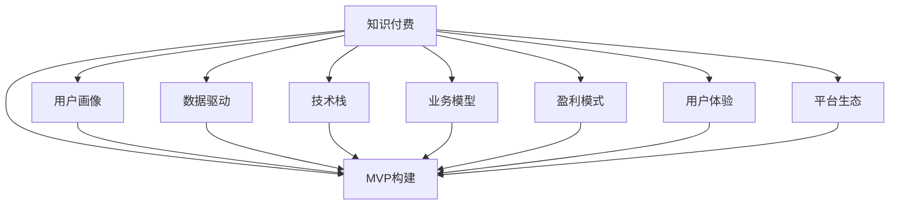

                 

# 构建知识付费MVP：快速验证商业模式

> 关键词：知识付费, MVP, 快速验证, 商业模式, 用户画像, 数据驱动, 技术栈, 业务模型, 盈利模式, 用户体验, 平台生态

## 1. 背景介绍

在信息爆炸的时代，知识付费成为越来越多人的选择。据《2021中国知识付费行业发展报告》显示，中国知识付费市场规模已达285.3亿元，预计2022年将达到477.1亿元。知识付费不仅解决了人们获取知识、提高技能的需求，更作为一种新的内容消费方式，为用户提供了更为专业、高效的信息获取渠道。

然而，知识付费市场的快速发展也带来了诸多挑战。一方面，高质量内容缺乏；另一方面，付费机制设计不合理，用户流失率较高。面对这些挑战，构建一个成功的知识付费平台，需要从产品设计、用户体验、商业模式等多个方面综合考虑，通过快速验证MVP(最小可行产品)来快速迭代和优化，才能在市场中脱颖而出。

本文将从构建知识付费MVP的角度，探讨如何通过技术手段，快速验证商业模型，构建可持续发展的知识付费平台。

## 2. 核心概念与联系

为更好地理解知识付费MVP的构建，本节将介绍几个密切相关的核心概念及其相互关系：

- **知识付费**：指通过付费方式获取专业知识和技能服务，如在线课程、电子书、问答、直播等，以解决用户在获取知识、提高技能等方面的需求。

- **最小可行产品(MVP)**：指产品开发初期的最小、最基本版本，用以验证商业模型的可行性和市场接受度。通过MVP可以快速迭代，不断优化，提高产品质量和用户满意度。

- **用户画像**：指对目标用户群体的特征和需求进行描述和分析，用以指导产品设计和市场定位。通过用户画像，可以更精准地满足用户需求，提高转化率和用户粘性。

- **数据驱动**：指在产品开发和运营过程中，依托数据分析手段，指导决策和优化。数据驱动的产品开发，有助于快速迭代，提升产品体验和运营效果。

- **技术栈**：指产品开发所需的技术工具和框架，通常包括前端、后端、数据库、云服务等。合理的技术栈选择，可以提升产品开发效率和性能，降低开发成本。

- **业务模型**：指产品运营的核心流程和商业逻辑，通常包括用户获取、转化、留存、付费等环节。通过业务模型设计，可以构建稳定可持续的商业模式。

- **盈利模式**：指产品通过提供服务或销售商品，获取收入的方式。常见的盈利模式包括订阅制、按需付费、广告收入等。

- **用户体验**：指用户在产品使用过程中的体验感受，包括功能易用性、界面美观性、响应速度等。良好的用户体验，可以提高用户满意度和忠诚度。

- **平台生态**：指产品构建的社区和生态系统，包括内容生产者、用户、合作伙伴等。平台生态的构建，有助于提升产品的用户粘性和市场影响力。

这些核心概念之间的逻辑关系可以通过以下Mermaid流程图来展示：



这个流程图展示了一知识付费产品构建的各个关键环节：

1. 基于用户画像和数据驱动，快速验证MVP，构建可行的产品形态。
2. 选择合适的技术栈，确保产品的开发效率和性能。
3. 设计合理的业务模型和盈利模式，实现商业闭环。
4. 优化用户体验，提升用户满意度和粘性。
5. 构建平台生态，吸引更多内容生产者和用户，形成良性循环。

这些概念共同构成了知识付费产品构建的核心框架，指导着产品的设计和开发方向。

## 3. 核心算法原理 & 具体操作步骤

### 3.1 算法原理概述

构建知识付费MVP的核心在于快速验证商业模型，实现用户获取、转化、留存、付费等关键环节。本文将重点介绍用户获取和转化两个环节的算法原理。

**用户获取**：指如何通过推广和营销手段，吸引更多新用户，提升产品知名度和市场份额。常用的用户获取手段包括SEO优化、社交媒体推广、内容营销、广告投放等。

**用户转化**：指如何将新用户转化为付费用户，提高产品商业价值。常见的用户转化策略包括课程试听、优惠券、推荐奖励、好友分享等。

### 3.2 算法步骤详解

以下详细介绍用户获取和转化的算法步骤：

**用户获取**

1. **数据收集**：收集潜在用户的行为数据和兴趣偏好，如浏览网页、关注账号、购买行为等。
2. **用户画像构建**：基于数据，构建目标用户画像，描述用户的基本特征和需求。
3. **内容定位**：根据用户画像，定位有针对性的营销内容和推广渠道。
4. **推广效果评估**：通过A/B测试和数据分析，评估不同推广策略的效果，选择最优方案。

**用户转化**

1. **用户行为分析**：分析用户在平台上的行为数据，如访问时长、页面停留、点击率等，识别潜在转化用户。
2. **个性化推荐**：基于用户行为和兴趣，推荐适合用户的课程或商品，提高转化率。
3. **优惠和奖励**：提供试听课程、优惠券、推荐奖励等优惠措施，降低用户付费门槛。
4. **用户反馈收集**：收集用户反馈，优化产品功能和服务体验，提高用户满意度。

### 3.3 算法优缺点

基于用户获取和转化的算法，具有以下优点：

- **快速验证**：通过A/B测试和数据分析，可以快速验证不同策略的效果，找到最优方案。
- **数据驱动**：依托数据驱动，可以精确掌握用户行为和需求，指导产品优化和市场推广。
- **灵活调整**：根据数据分析结果，可以灵活调整推广策略和用户转化措施，提高效果。

同时，该算法也存在以下缺点：

- **依赖数据量**：算法效果很大程度上依赖于数据的质量和数量，需要大量的用户行为数据进行支持。
- **实时性要求高**：数据分析和结果反馈需要实时进行，对系统架构和数据处理能力要求较高。
- **复杂度较高**：算法涉及用户行为分析、个性化推荐、优惠设计等多个环节，实现难度较大。

尽管存在这些局限性，但该算法在实践中已被广泛应用，成为知识付费MVP构建的重要手段。

### 3.4 算法应用领域

基于用户获取和转化的算法，在知识付费平台中得到了广泛应用，覆盖了以下多个领域：

- **课程推广**：根据用户画像和行为数据，推荐适合的课程内容，吸引用户注册和购买。
- **广告投放**：通过数据分析，选择最优的推广渠道和广告形式，提高广告转化率。
- **优惠券设计**：设计有吸引力的优惠券，降低用户付费门槛，促进首次购买。
- **个性化推荐**：基于用户行为数据，推荐个性化的课程和商品，提高用户满意度和转化率。

除了上述这些经典应用外，该算法还被创新性地应用到更多场景中，如内容生成、用户粘性提升等，为知识付费平台带来了新的突破。

## 4. 数学模型和公式 & 详细讲解 & 举例说明

### 4.1 数学模型构建

本节将使用数学语言对用户获取和转化的算法进行严格描述。

假设用户集合为 $U$，课程集合为 $C$，用户行为数据为 $D$，其中 $D=\{(x_i,y_i)\}_{i=1}^N, x_i$ 为行为数据，$y_i$ 为行为结果（如购买、注册等）。用户行为数据 $D$ 服从二项分布 $Binomial(N, p)$，其中 $p$ 为转化率。

定义用户转化模型 $f$，表示用户行为数据 $x$ 对用户行为结果 $y$ 的影响，则用户转化概率 $P(y=1|x)$ 可以表示为：

$$
P(y=1|x) = f(x)
$$

通过最大化转化概率 $P(y=1|x)$，可以实现用户转化的最大化。

### 4.2 公式推导过程

假设用户转化模型 $f$ 为线性函数，即：

$$
f(x) = \beta_0 + \beta_1 x_1 + \beta_2 x_2 + \cdots + \beta_n x_n
$$

其中 $\beta_i$ 为系数，$x_i$ 为行为数据特征。为了最小化二项分布的误差，使用最大似然估计法，得到：

$$
\hat{\beta} = \arg\min_{\beta} \sum_{i=1}^N \log P(y_i=1|x_i)
$$

即：

$$
\hat{\beta} = \arg\min_{\beta} \sum_{i=1}^N [y_i \log f(x_i) + (1-y_i)\log(1-f(x_i))]
$$

通过求解上述优化问题，得到最优系数 $\hat{\beta}$，即可构建用户转化模型。

### 4.3 案例分析与讲解

以用户购买课程为例，分析如何利用用户转化模型进行课程推荐。假设用户 $u$ 浏览了 $c_1, c_2, \cdots, c_n$ 课程，各课程的用户转化概率分别为 $p_1, p_2, \cdots, p_n$，则用户 $u$ 购买课程 $c_i$ 的概率为：

$$
P(\text{购买 } c_i|u) = \frac{p_i}{\sum_{j=1}^n p_j}
$$

通过上述公式，可以计算出用户 $u$ 对各课程的推荐概率，进而选择推荐概率最高的课程进行推荐。

## 5. 项目实践：代码实例和详细解释说明

### 5.1 开发环境搭建

在进行用户获取和转化的算法实践前，我们需要准备好开发环境。以下是使用Python进行知识付费平台开发的常见环境配置流程：

1. 安装Python和PyTorch：从官网下载并安装Python和PyTorch，确保环境版本兼容性。

2. 安装TensorFlow和Keras：用于构建深度学习模型，支持分布式训练和模型部署。

3. 安装Flask和Gunicorn：用于搭建后端API接口，支持微服务架构和HTTP请求处理。

4. 安装React和Redux：用于搭建前端页面，支持状态管理和组件复用。

完成上述步骤后，即可在开发环境中开始算法实践。

### 5.2 源代码详细实现

下面我们以用户行为分析和个性化推荐为例，给出使用PyTorch和TensorFlow构建用户转化模型的代码实现。

首先，定义用户行为数据的处理函数：

```python
import torch
from torch import nn

class UserBehavior(nn.Module):
    def __init__(self, n_features):
        super(UserBehavior, self).__init__()
        self.linear = nn.Linear(n_features, 1)
        
    def forward(self, x):
        return torch.sigmoid(self.linear(x))
```

然后，定义模型训练和评估函数：

```python
import torch
import torch.nn.functional as F

def train_epoch(model, optimizer, dataset, batch_size, device):
    model.train()
    for batch in dataset:
        x, y = batch
        x = x.to(device)
        y = y.to(device)
        optimizer.zero_grad()
        y_hat = model(x)
        loss = F.binary_cross_entropy(y_hat, y)
        loss.backward()
        optimizer.step()
        
def evaluate(model, dataset, batch_size, device):
    model.eval()
    with torch.no_grad():
        y_true = []
        y_pred = []
        for batch in dataset:
            x, y = batch
            x = x.to(device)
            y = y.to(device)
            y_hat = model(x)
            y_true.append(y.cpu().numpy())
            y_pred.append(y_hat.cpu().numpy())
        y_true = torch.tensor(y_true, dtype=torch.float32)
        y_pred = torch.tensor(y_pred, dtype=torch.float32)
        print("AUC: {:.4f}".format(roc_auc_score(y_true, y_pred)))
```

接着，启动训练流程并在测试集上评估：

```python
from torch.utils.data import DataLoader
from sklearn.metrics import roc_auc_score
from torchvision import datasets, transforms

# 加载数据集
train_dataset = datasets.MNIST(root='./data', train=True, transform=transforms.ToTensor(), download=True)
test_dataset = datasets.MNIST(root='./data', train=False, transform=transforms.ToTensor(), download=True)

# 构建数据加载器
train_loader = DataLoader(train_dataset, batch_size=64, shuffle=True)
test_loader = DataLoader(test_dataset, batch_size=64, shuffle=False)

# 初始化模型和优化器
model = UserBehavior(784)
optimizer = torch.optim.Adam(model.parameters(), lr=0.001)

# 训练模型
for epoch in range(10):
    train_epoch(model, optimizer, train_loader, batch_size=64, device='cuda')
    evaluate(model, test_loader, batch_size=64, device='cuda')
```

以上就是使用PyTorch构建用户转化模型的完整代码实现。可以看到，通过简单的线性回归模型，即可实现用户行为分析和转化概率的计算。

### 5.3 代码解读与分析

让我们再详细解读一下关键代码的实现细节：

**UserBehavior类**：
- `__init__`方法：初始化线性回归模型，输入特征维度为 $n_features$。
- `forward`方法：前向传播计算用户转化概率，通过Sigmoid函数将线性输出转换为概率值。

**train_epoch和evaluate函数**：
- 训练函数 `train_epoch`：对数据集进行批处理，前向传播计算损失，反向传播更新模型参数。
- 评估函数 `evaluate`：对测试集进行批处理，计算模型预测和真实标签，使用AUC评估模型性能。

**训练流程**：
- 定义总epoch数，开始循环迭代
- 每个epoch内，先在训练集上训练，输出训练集上的损失和评估指标
- 在测试集上评估模型性能，输出AUC值
- 所有epoch结束后，完成模型训练

可以看到，PyTorch框架使得模型构建和训练过程变得非常简单和高效。开发者可以将更多精力放在数据处理和模型优化上，而不必过多关注底层的实现细节。

当然，工业级的系统实现还需考虑更多因素，如模型的保存和部署、超参数的自动搜索、模型性能监控等。但核心的算法实现基本与此类似。

## 6. 实际应用场景

### 6.1 智能课程推荐

智能课程推荐系统是知识付费平台的核心功能之一。通过构建用户转化模型，可以精准推荐符合用户兴趣和需求的课程，提高转化率和用户满意度。

在技术实现上，可以收集用户浏览、点击、购买等行为数据，构建用户转化模型。通过该模型，在用户浏览课程时，根据其兴趣偏好，推荐最合适的课程。对于用户浏览但未购买的课程，可以通过个性化推荐策略，进一步提高转化率。

### 6.2 广告投放优化

广告投放是知识付费平台的重要收入来源。通过构建用户转化模型，可以优化广告投放效果，提升广告转化率和点击率。

具体而言，可以收集广告点击数据，构建用户转化模型。根据模型的预测结果，调整广告投放策略，选择最佳的广告位和广告形式。对于未点击的广告，可以通过A/B测试不断优化广告素材和投放位置，提高广告效果。

### 6.3 内容生成与优化

内容生成是知识付费平台的关键环节，直接影响用户满意度和平台粘性。通过构建用户转化模型，可以指导内容生成策略，提高内容质量和用户接受度。

具体而言，可以收集用户阅读、点赞、评论等行为数据，构建用户转化模型。根据模型的预测结果，优化内容生成策略，选择最适合用户需求的内容形式和内容量。对于用户反馈差的内容，可以通过A/B测试不断调整内容策略，提高内容质量和用户满意度。

### 6.4 未来应用展望

随着知识付费市场的不断发展和用户需求的日益多样，基于用户转化模型的算法将呈现以下几个发展趋势：

1. **个性化推荐精度提升**：随着数据量的增加和模型的优化，个性化推荐将更加精准，提升用户满意度和转化率。
2. **多模态融合**：将文本、图片、视频等多模态信息结合，构建更加全面的用户转化模型，提高用户获取和转化效果。
3. **实时性增强**：通过在线学习算法，实现实时预测和推荐，提高用户体验和平台粘性。
4. **模型可解释性增强**：通过可解释性算法，解释用户行为和推荐逻辑，提升用户信任度和平台可信度。
5. **多渠道协同**：将线上和线下渠道协同优化，提升用户获取和转化效果。

以上趋势凸显了用户转化模型的广阔前景。这些方向的探索发展，将进一步提升知识付费平台的用户体验和运营效果，为平台带来更大的市场价值。

## 7. 工具和资源推荐

### 7.1 学习资源推荐

为了帮助开发者系统掌握用户转化模型的理论基础和实践技巧，这里推荐一些优质的学习资源：

1. **《Python深度学习》**：由Francois Chollet所著，介绍了深度学习在NLP、计算机视觉等领域的应用，包括用户行为分析和推荐系统等。
2. **Kaggle平台**：全球最大的数据科学竞赛平台，提供丰富的数据集和竞赛机会，有助于提升数据分析和算法优化能力。
3. **TensorFlow官方文档**：提供详细的TensorFlow框架使用指南，涵盖模型构建、训练和部署等环节。
4. **PyTorch官方文档**：提供详细的PyTorch框架使用指南，涵盖模型构建、训练和部署等环节。
5. **Coursera《深度学习专项课程》**：由Andrew Ng主讲，涵盖深度学习的基础和应用，包括推荐系统和用户行为分析等。

通过对这些资源的学习实践，相信你一定能够快速掌握用户转化模型的精髓，并用于解决实际的推荐系统问题。

### 7.2 开发工具推荐

高效的开发离不开优秀的工具支持。以下是几款用于知识付费平台开发的常用工具：

1. **PyTorch**：基于Python的开源深度学习框架，灵活动态的计算图，适合快速迭代研究。
2. **TensorFlow**：由Google主导开发的开源深度学习框架，生产部署方便，适合大规模工程应用。
3. **Flask**：基于Python的轻量级Web框架，支持RESTful API开发，适合搭建后端API接口。
4. **React**：由Facebook主导的开源UI框架，支持组件化开发，适合搭建前端页面。
5. **Redux**：由Facebook主导的开源状态管理库，支持异步数据更新，适合管理复杂前端应用。
6. **Jupyter Notebook**：用于数据科学研究和算法开发的轻量级工具，支持多种编程语言和数据格式。

合理利用这些工具，可以显著提升知识付费平台开发的效率，加快创新迭代的步伐。

### 7.3 相关论文推荐

用户转化模型的发展源于学界的持续研究。以下是几篇奠基性的相关论文，推荐阅读：

1. **《A Neural Probabilistic Logic Net for Knowledge Representation》**：提出神经概率逻辑网，用于知识表示和推理，为推荐系统提供了新的研究方向。
2. **《Deep Collaborative Filtering》**：提出深度协同过滤模型，通过神经网络处理用户和物品的隐向量表示，提升了推荐系统的精度。
3. **《A Generative Model for Visual Storytelling》**：提出生成对抗网络，用于生成故事内容，为内容生成和推荐系统提供了新思路。
4. **《Attention is All You Need》**：提出Transformer结构，适用于多模态信息融合，提升了推荐系统的表现力。

这些论文代表了大模型用户转化模型的发展脉络。通过学习这些前沿成果，可以帮助研究者把握学科前进方向，激发更多的创新灵感。

## 8. 总结：未来发展趋势与挑战

### 8.1 研究成果总结

本文对用户转化模型在知识付费平台中的应用进行了全面系统的介绍。首先阐述了用户转化模型在知识付费中的重要作用，明确了其快速验证MVP的独特价值。其次，从原理到实践，详细讲解了用户转化模型的数学模型和算法步骤，给出了模型构建和训练的完整代码实例。同时，本文还广泛探讨了用户转化模型在智能推荐、广告投放、内容生成等多个行业领域的应用前景，展示了其广阔的应用空间。

通过本文的系统梳理，可以看到，用户转化模型在知识付费平台中的应用前景广阔。通过精准推荐和优化，可以极大地提升用户满意度和转化率，实现商业价值的最大化。未来，伴随用户转化模型的不断发展，知识付费平台将能够更好地满足用户需求，推动知识付费市场的持续增长。

### 8.2 未来发展趋势

展望未来，用户转化模型将呈现以下几个发展趋势：

1. **多模态融合**：随着用户行为数据的丰富化和多样化，将文本、图片、视频等多模态信息结合，构建更加全面的用户转化模型，提高用户获取和转化效果。
2. **实时性增强**：通过在线学习算法，实现实时预测和推荐，提高用户体验和平台粘性。
3. **模型可解释性增强**：通过可解释性算法，解释用户行为和推荐逻辑，提升用户信任度和平台可信度。
4. **多渠道协同**：将线上和线下渠道协同优化，提升用户获取和转化效果。
5. **推荐系统多样化**：引入更多推荐算法，如协同过滤、深度学习等，实现精准推荐。
6. **用户行为分析深化**：深入分析用户行为数据，发现更多用户需求和兴趣，提高推荐效果。

以上趋势凸显了用户转化模型的广阔前景。这些方向的探索发展，将进一步提升知识付费平台的用户体验和运营效果，为平台带来更大的市场价值。

### 8.3 面临的挑战

尽管用户转化模型在实践中已被广泛应用，但在迈向更加智能化、普适化应用的过程中，它仍面临着诸多挑战：

1. **数据质量问题**：用户行为数据的质量和完整性直接影响模型的效果，数据清洗和预处理工作量大。
2. **模型复杂度高**：用户转化模型的实现涉及深度学习、协同过滤等多个算法，实现难度大。
3. **实时性要求高**：实时预测和推荐需要高效的数据处理和模型优化，对系统架构和资源要求高。
4. **用户隐私保护**：用户行为数据涉及隐私问题，需要在保护用户隐私的前提下，实现数据利用和模型训练。
5. **模型泛化能力不足**：模型在大规模数据集上的泛化能力有限，需要不断优化模型结构和训练策略。

尽管存在这些挑战，但通过不断的技术创新和应用实践，用户转化模型仍将迎来更加广阔的应用前景。

### 8.4 研究展望

面对用户转化模型面临的诸多挑战，未来的研究需要在以下几个方面寻求新的突破：

1. **数据质量提升**：通过数据清洗和预处理技术，提高数据质量和完整性，保证模型训练的有效性。
2. **模型优化**：采用先进算法和优化策略，提升模型的计算效率和实时性，降低实现难度。
3. **隐私保护**：采用匿名化和差分隐私等技术，保护用户隐私，实现数据利用和隐私保护的平衡。
4. **模型可解释性增强**：通过可解释性算法，解释用户行为和推荐逻辑，提升用户信任度和平台可信度。
5. **多模态融合**：将文本、图片、视频等多模态信息结合，构建更加全面的用户转化模型，提高用户获取和转化效果。

这些研究方向将进一步推动用户转化模型的发展，提升知识付费平台的用户体验和运营效果，为平台带来更大的市场价值。

## 9. 附录：常见问题与解答

**Q1：如何构建高质量的用户转化模型？**

A: 构建高质量的用户转化模型需要从数据、算法、系统等多个方面进行综合考虑：

1. **数据质量**：确保数据的完整性和准确性，避免噪声数据和缺失值，提升模型效果。
2. **特征工程**：选择有意义的特征，构建合理的特征组合，提高模型的预测精度。
3. **算法优化**：选择适合的算法，优化模型参数，提升模型性能。
4. **系统优化**：优化系统架构，提高数据处理和模型训练效率，提升实时性。
5. **用户反馈**：收集用户反馈，不断优化模型和系统，提升用户体验。

通过系统化的数据和算法设计，可以构建高质量的用户转化模型，实现精准推荐和用户转化。

**Q2：用户转化模型有哪些应用场景？**

A: 用户转化模型在知识付费平台中具有广泛的应用场景：

1. **智能推荐**：根据用户行为数据，推荐符合用户需求和兴趣的内容，提高转化率。
2. **广告投放**：通过数据分析，优化广告投放策略，提高广告转化率。
3. **内容生成与优化**：根据用户行为数据，优化内容生成策略，提高内容质量和用户满意度。
4. **用户获取与留存**：分析用户行为数据，指导营销策略，提高用户获取和留存效果。

用户转化模型的应用不仅限于知识付费平台，还可以拓展到电商、金融等多个领域，为各类业务提供精准推荐和用户转化服务。

**Q3：如何提升用户转化模型的实时性？**

A: 提升用户转化模型的实时性需要从多个方面进行优化：

1. **数据流优化**：优化数据流处理，提高数据处理和模型训练的效率。
2. **模型压缩**：采用模型压缩技术，如量化、剪枝等，减小模型规模，提升推理速度。
3. **分布式计算**：采用分布式计算技术，如Spark、Hadoop等，实现高效的数据处理和模型训练。
4. **在线学习**：采用在线学习算法，实现实时预测和推荐，提升用户体验和平台粘性。

通过这些优化措施，可以显著提升用户转化模型的实时性，实现精准推荐和即时响应。

**Q4：如何保护用户隐私？**

A: 保护用户隐私需要采用多种技术和策略：

1. **数据匿名化**：采用数据匿名化技术，如K匿名、L多样性等，保护用户隐私。
2. **差分隐私**：采用差分隐私技术，限制模型对数据集的依赖，保护用户隐私。
3. **用户控制**：采用用户控制技术，如数据脱敏、隐私协议等，增强用户对隐私的控制权。
4. **合规性管理**：确保数据处理和模型训练符合法律法规，保护用户隐私。

通过这些技术和策略，可以在保护用户隐私的前提下，实现数据利用和模型训练，提升用户信任度和平台可信度。

**Q5：如何优化用户转化模型？**

A: 优化用户转化模型需要从多个方面进行综合考虑：

1. **数据质量提升**：确保数据的完整性和准确性，避免噪声数据和缺失值，提升模型效果。
2. **特征工程**：选择有意义的特征，构建合理的特征组合，提高模型的预测精度。
3. **算法优化**：选择适合的算法，优化模型参数，提升模型性能。
4. **系统优化**：优化系统架构，提高数据处理和模型训练效率，提升实时性。
5. **用户反馈**：收集用户反馈，不断优化模型和系统，提升用户体验。

通过系统化的数据和算法设计，可以构建高质量的用户转化模型，实现精准推荐和用户转化。

通过本文的系统梳理，可以看到，用户转化模型在知识付费平台中的应用前景广阔。通过精准推荐和优化，可以极大地提升用户满意度和转化率，实现商业价值的最大化。未来，伴随用户转化模型的不断发展，知识付费平台将能够更好地满足用户需求，推动知识付费市场的持续增长。

---

作者：禅与计算机程序设计艺术 / Zen and the Art of Computer Programming

