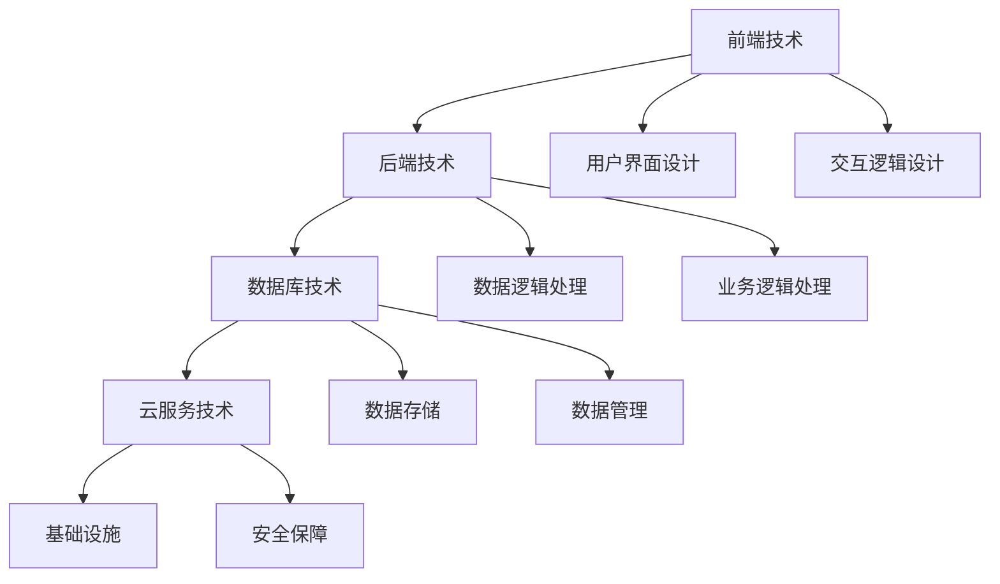

                 

# 构建知识付费生态系统：程序员的全栈approach

> 关键词：知识付费, 程序员, 全栈, 平台开发, 内容运营, 用户体验

## 1. 背景介绍

### 1.1 问题由来
随着信息技术的高速发展和互联网的普及，知识付费成为一种新的经济模式和消费趋势。在线教育、知识分享、技术资讯等领域的知识付费平台不断涌现，为广大用户提供便捷的学习渠道。尤其是对于程序员这一高技能职业群体，他们普遍面临着时间紧、需求高、知识更新快等问题，知识付费平台提供了专业的技术培训、经验分享、项目交流等服务，极大地提升了程序员的工作效率和学习效果。

### 1.2 问题核心关键点
在知识付费平台的建设过程中，技术实施、内容运营、用户体验等环节都至关重要。如何构建一个稳定、高效、易用的知识付费平台，成为了广大程序员共同关注的焦点。

本文将聚焦于如何构建一个全栈的知识付费平台，从技术实现、内容运营、用户体验等多个维度进行系统性分析。文章将详细介绍平台开发所需的各项技术栈，并结合实际案例，深入分析平台的设计和运营策略，以期为构建高质量的知识付费平台提供全面的技术指导。

### 1.3 问题研究意义
构建一个全栈的知识付费平台，不仅需要掌握前端和后端开发技术，还需要具备完整的平台设计思路和运营管理经验。通过学习本文提出的全栈技术方案和运营策略，程序员可以快速上手构建自己的知识付费平台，提升平台的用户黏性和商业价值。

同时，本文还将展示如何通过技术手段提升平台的用户体验和运营效率，促进知识共享和传播，帮助更多程序员成长。

## 2. 核心概念与联系

### 2.1 核心概念概述

为更好地理解全栈知识付费平台的构建方法，本节将介绍几个关键核心概念：

- **知识付费平台(Knowledge Payload Platform, KPP)**：提供知识内容付费、在线课程、技术培训等服务的在线平台。通常包括内容生产、分发、交互等多个环节。
- **全栈技术栈(Full-stack Tech Stack)**：涵盖前端、后端、数据库、云服务等多个层面的技术栈，确保平台从底层架构到用户体验的整体一致性和稳定性。
- **前端技术(Frontend Tech)**：包括HTML、CSS、JavaScript、React、Vue等技术，负责构建平台的用户界面和交互逻辑。
- **后端技术(Backend Tech)**：包括Node.js、Python、Ruby、Go等语言及框架，负责处理数据逻辑、业务逻辑和系统维护等。
- **数据库技术(Database Tech)**：包括关系型数据库(MySQL、PostgreSQL)、非关系型数据库(MongoDB、Redis)等，负责数据存储和管理。
- **云服务技术(Cloud Service Tech)**：包括AWS、Google Cloud、阿里云等云平台，提供平台的基础设施支持和安全保障。

这些核心概念之间的逻辑关系可以通过以下Mermaid流程图来展示：



这个流程图展示了一个知识付费平台的核心技术栈及其之间的相互关系：

1. 前端技术负责构建用户界面和交互逻辑。
2. 后端技术处理数据逻辑、业务逻辑和系统维护。
3. 数据库技术负责数据的存储和管理。
4. 云服务技术提供基础设施和保障。
5. 用户界面设计、交互逻辑设计、数据逻辑处理和业务逻辑处理共同组成后端技术的具体实现。

这些概念共同构成了全栈知识付费平台的技术框架，确保平台在各个层面的稳定性和用户体验。

## 3. 核心算法原理 & 具体操作步骤

### 3.1 算法原理概述

构建知识付费平台的核心目标之一是提升用户体验，同时确保平台的高效稳定运行。这需要通过一系列技术手段和运营策略来实现。

### 3.2 算法步骤详解

构建知识付费平台的主要步骤如下：

**Step 1: 需求分析与功能规划**
- 调研目标用户群体，收集其需求和痛点，明确平台功能需求。
- 制定功能规划，确定平台的主要功能模块，如用户管理、课程管理、支付管理、评价系统等。
- 确定平台的用户体验目标，如响应速度、页面加载速度、功能易用性等。

**Step 2: 技术选型与架构设计**
- 根据功能需求和技术栈特点，选择合适的技术栈，如React/Vue+Node.js+MySQL等。
- 设计系统的整体架构，确定数据库、缓存、消息队列、API网关等关键组件的位置和关系。
- 设计数据模型，包括用户、课程、支付、评价等实体及其属性关系。

**Step 3: 数据库设计与实现**
- 设计关系型数据库表结构，确保表与表之间的关联性和数据一致性。
- 实现数据迁移和数据校验功能，确保数据的完整性和准确性。
- 引入非关系型数据库，如Redis，用于缓存和数据处理，提升系统的响应速度和并发处理能力。

**Step 4: 后端服务设计与实现**
- 实现用户管理模块，包括用户注册、登录、权限管理等。
- 实现课程管理模块，包括课程创建、编辑、删除、推荐等。
- 实现支付管理模块，包括支付接口、支付结果处理等。
- 实现评价系统模块，包括评价提交、查询、统计等。

**Step 5: 前端页面设计与实现**
- 设计平台的用户界面和交互逻辑，确保用户界面美观、易用、符合用户习惯。
- 实现页面布局、响应式设计、动画效果等，提升用户体验。
- 优化页面加载速度，减少用户等待时间。

**Step 6: 云服务配置与部署**
- 配置云服务环境，确保系统的稳定性和高可用性。
- 部署应用程序，确保应用程序能够快速响应用户请求。
- 配置负载均衡、CDN等，提升系统的并发处理能力和数据传输效率。

**Step 7: 测试与优化**
- 进行系统测试，包括单元测试、集成测试、性能测试等，确保系统的稳定性和安全性。
- 根据测试结果进行优化，提升系统性能和用户体验。
- 部署上线后，持续监控系统状态，及时修复漏洞和问题。

**Step 8: 内容运营与用户管理**
- 制定内容运营策略，确保平台内容质量和多样性。
- 开展用户推广活动，提升平台知名度和用户活跃度。
- 根据用户反馈，持续优化平台功能和用户体验。

### 3.3 算法优缺点

全栈知识付费平台具有以下优点：

- 功能全面。涵盖用户管理、课程管理、支付管理、评价系统等多个功能模块，能够满足用户的多样化需求。
- 技术成熟。主流的前端框架和后端技术得到了广泛应用和验证，稳定性高。
- 用户体验好。通过良好的页面设计和交互逻辑，提升用户的使用体验。

同时，全栈知识付费平台也存在一些局限性：

- 技术复杂度高。需要掌握多种技术栈和开发工具，入门门槛较高。
- 开发周期长。涉及多个技术栈和功能模块，开发和测试周期较长。
- 后期维护成本高。平台上线后，需要持续进行维护和优化，成本较高。

尽管存在这些局限性，但就目前而言，全栈知识付费平台仍然是构建高质量知识共享平台的主流范式。未来相关研究的重点在于如何进一步降低开发成本，提升系统性能，同时兼顾用户体验和技术栈的合理搭配。

### 3.4 算法应用领域

全栈知识付费平台的应用范围非常广泛，包括但不限于以下领域：

- **在线教育平台**：如Coursera、Udacity等，提供各种在线课程和专业认证。
- **技术社区**：如Stack Overflow、GitHub等，提供技术讨论、代码分享等。
- **职业培训平台**：如LinkedIn Learning、Pluralsight等，提供职业技能培训和认证。
- **企业内训系统**：为公司员工提供在线培训课程和技能提升。
- **个人知识分享平台**：如知乎、微信公众号等，提供个人知识分享和变现途径。

## 4. 数学模型和公式 & 详细讲解 & 举例说明

### 4.1 数学模型构建

本节将使用数学语言对全栈知识付费平台的构建方法进行更加严格的刻画。

假设知识付费平台的用户数量为 $U$，课程数量为 $C$，每次课程的支付金额为 $P$，每次支付的订单数量为 $O$。平台的目标是最大化平台的总收益 $R$，则数学模型可以表示为：

$$
R = C \times P \times O
$$

其中 $C$、$P$ 和 $O$ 是平台的关键业务指标，需要通过优化来提升。

### 4.2 公式推导过程

平台总收益 $R$ 由课程数量 $C$、每次课程的支付金额 $P$ 和每次支付的订单数量 $O$ 共同决定。为了最大化平台总收益，需要对 $C$、$P$ 和 $O$ 进行优化。

假设课程的边际成本为 $C_m$，每次支付的边际成本为 $P_m$，则平台的边际收益为 $R_m = P \times O$。为了最大化平台总收益，需要对 $C$、$P$ 和 $O$ 进行联合优化。

根据边际收益和边际成本的等式，有：

$$
R_m = C \times P \times O
$$

当 $R_m > C_m$ 时，增加课程数量 $C$ 和每次支付的订单数量 $O$ 可以提升总收益。当 $R_m < C_m$ 时，需要降低课程数量和每次支付的订单数量，以避免亏损。

### 4.3 案例分析与讲解

以在线教育平台Coursera为例，其数学模型可以表示为：

$$
R = C \times P \times O
$$

其中 $C$ 为课程数量，$P$ 为每次课程的定价，$O$ 为每次课程的报名人数。Coursera通过不断增加课程数量和优化课程价格，提升平台的总收益。同时，通过改进课程内容和提高课程质量，吸引更多的用户报名，从而提升平台的订单数量 $O$。

## 5. 项目实践：代码实例和详细解释说明

### 5.1 开发环境搭建

在进行知识付费平台开发前，需要先搭建好开发环境。以下是使用Docker容器进行环境配置的流程：

1. 安装Docker：从官网下载并安装Docker社区版。
2. 创建Docker镜像：编写Dockerfile文件，定义应用所需的软件包和依赖。
3. 运行Docker容器：使用 `docker run` 命令启动Docker容器，进入开发环境。
4. 配置开发工具：安装开发所需的软件和依赖，如IDE、文本编辑器、版本控制系统等。

### 5.2 源代码详细实现

下面我们以在线教育平台为例，给出使用Node.js和React构建知识付费平台的基本代码实现。

首先，定义用户管理模块：

```javascript
// user.js
const User = {
  // 用户注册
  register(user) {
    return this.validate(user) ? this.save(user) : null;
  },
  // 用户登录
  login(user) {
    return this.validate(user) ? this.check(user) : null;
  },
  // 验证用户信息
  validate(user) {
    // 实现用户信息验证逻辑
    return true;
  },
  // 保存用户信息
  save(user) {
    // 实现用户信息保存逻辑
    return true;
  },
  // 验证用户密码
  check(user) {
    // 实现用户密码验证逻辑
    return true;
  }
};

module.exports = User;
```

然后，定义课程管理模块：

```javascript
// course.js
const Course = {
  // 创建课程
  create(course) {
    return this.validate(course) ? this.save(course) : null;
  },
  // 修改课程
  update(course) {
    return this.validate(course) ? this.save(course) : null;
  },
  // 删除课程
  delete(course) {
    return this.validate(course) ? this.remove(course) : null;
  },
  // 查询课程
  query(query) {
    // 实现课程查询逻辑
    return true;
  },
  // 验证课程信息
  validate(course) {
    // 实现课程信息验证逻辑
    return true;
  },
  // 保存课程信息
  save(course) {
    // 实现课程信息保存逻辑
    return true;
  },
  // 删除课程信息
  remove(course) {
    // 实现课程信息删除逻辑
    return true;
  }
};

module.exports = Course;
```

接着，定义支付管理模块：

```javascript
// payment.js
const Payment = {
  // 支付订单
  order(order) {
    return this.validate(order) ? this.save(order) : null;
  },
  // 查询支付订单
  query(order) {
    // 实现支付订单查询逻辑
    return true;
  },
  // 验证支付订单信息
  validate(order) {
    // 实现支付订单信息验证逻辑
    return true;
  },
  // 保存支付订单信息
  save(order) {
    // 实现支付订单信息保存逻辑
    return true;
  },
  // 删除支付订单信息
  remove(order) {
    // 实现支付订单信息删除逻辑
    return true;
  }
};

module.exports = Payment;
```

最后，定义评价系统模块：

```javascript
// review.js
const Review = {
  // 提交评价
  submit(review) {
    return this.validate(review) ? this.save(review) : null;
  },
  // 查询评价
  query(review) {
    // 实现评价查询逻辑
    return true;
  },
  // 验证评价信息
  validate(review) {
    // 实现评价信息验证逻辑
    return true;
  },
  // 保存评价信息
  save(review) {
    // 实现评价信息保存逻辑
    return true;
  },
  // 删除评价信息
  remove(review) {
    // 实现评价信息删除逻辑
    return true;
  }
};

module.exports = Review;
```

### 5.3 代码解读与分析

这里我们以用户管理模块为例，详细解读一下关键代码的实现细节：

**User类定义**
- `register`方法：处理用户注册逻辑，首先进行信息验证，然后调用`save`方法保存用户信息。
- `login`方法：处理用户登录逻辑，首先进行信息验证，然后调用`check`方法验证密码。
- `validate`方法：用于验证用户信息是否合法。
- `save`方法：用于保存用户信息到数据库中。
- `check`方法：用于验证用户密码是否正确。

**代码示例**
```javascript
const User = {
  // 用户注册
  register(user) {
    if (!this.validate(user)) {
      return null;
    }
    return this.save(user);
  },
  // 用户登录
  login(user) {
    if (!this.validate(user)) {
      return null;
    }
    return this.check(user);
  },
  // 验证用户信息
  validate(user) {
    // 实现用户信息验证逻辑
    return true;
  },
  // 保存用户信息
  save(user) {
    // 实现用户信息保存逻辑
    return true;
  },
  // 验证用户密码
  check(user) {
    // 实现用户密码验证逻辑
    return true;
  }
};

module.exports = User;
```

这个示例代码展示了用户管理模块的基本流程和实现逻辑。通过代码的清晰定义和模块化设计，可以方便地复用和管理各个模块的代码，提升开发效率。

### 5.4 运行结果展示

运行上述代码后，可以使用 `npm run dev` 命令启动开发服务器，并在浏览器中访问 `http://localhost:3000` 查看用户管理页面。页面上可以完成用户注册、登录、验证等操作，实现基本的用户管理功能。

## 6. 实际应用场景

### 6.1 在线教育平台

在线教育平台如Coursera、Udacity等，通过提供大规模、高质量的课程，满足了用户的多样化学习需求。平台通过课程的个性化推荐、评价系统、互动问答等功能，提升用户的学习体验和满意度。

### 6.2 技术社区

技术社区如Stack Overflow、GitHub等，通过提供代码分享、技术讨论、开源项目等资源，促进了技术的交流与传播。平台通过智能搜索、标签分类、热门话题等功能，提升了社区的用户粘性和活跃度。

### 6.3 职业培训平台

职业培训平台如LinkedIn Learning、Pluralsight等，通过提供职业技能的培训和认证，帮助用户提升专业技能，增加职业竞争力。平台通过课程评价、导师答疑、职业发展建议等功能，提升了用户的学习效果和就业前景。

### 6.4 未来应用展望

伴随人工智能和云计算技术的不断发展，未来的知识付费平台将更加智能化和个性化。平台将利用机器学习和大数据分析，实现内容推荐、用户画像、行为预测等功能，提升平台的用户体验和运营效率。同时，平台也将更加注重数据安全和隐私保护，保障用户权益和平台信任度。

## 7. 工具和资源推荐

### 7.1 学习资源推荐

为了帮助开发者系统掌握知识付费平台的开发技术，这里推荐一些优质的学习资源：

1. **《全栈开发教程》**：系统讲解前端和后端开发技术栈，涵盖HTML、CSS、JavaScript、Node.js、MongoDB等，适合初学者入门。
2. **《React官方文档》**：React的官方文档，提供了丰富的教程、组件库和示例代码，是React开发必备资源。
3. **《JavaScript高级程序设计》**：JavaScript领域的经典书籍，深入浅出地介绍了JavaScript的核心语法和应用技巧，适合进阶学习。
4. **《Node.js权威指南》**：Node.js领域的权威指南，涵盖了Node.js的基础知识、架构设计和实战案例，适合中高级开发者。
5. **《Vue.js实战》**：Vue.js实战书籍，提供了从零开始的Vue.js开发教程和实战案例，适合初学者和进阶学习。

通过学习这些资源，开发者可以快速掌握全栈知识付费平台的开发技术，提升技术水平和开发能力。

### 7.2 开发工具推荐

高效的开发离不开优秀的工具支持。以下是几款用于知识付费平台开发的常用工具：

1. **Visual Studio Code**：Microsoft开发的轻量级代码编辑器，支持多种语言和插件，提供丰富的代码编辑和调试功能。
2. **Git**：版本控制系统，支持代码的提交、合并、分支等操作，提升团队协作效率。
3. **Jest**：React的测试框架，提供简洁的测试语法和丰富的断言库，支持自动化测试。
4. **Docker**：容器化技术，提供快速启动、跨平台运行、容器编排等功能，提升开发和部署效率。
5. **npm**：Node.js的包管理工具，提供全球范围内的Node.js包和组件，便于组件复用和依赖管理。

合理利用这些工具，可以显著提升知识付费平台的开发效率，加快创新迭代的步伐。

### 7.3 相关论文推荐

知识付费平台的建设源于学界的持续研究。以下是几篇奠基性的相关论文，推荐阅读：

1. **《Web应用的架构设计模式》**：探讨Web应用的架构设计模式，提供系统化的方法论和技术栈选择。
2. **《在线教育平台的系统设计》**：详细介绍了在线教育平台的系统设计和功能实现，提供了可参考的实现方案。
3. **《开源社区的技术生态分析》**：分析了开源社区的技术生态，探讨了社区的成长和发展机制。
4. **《大数据在教育中的应用》**：探讨了大数据技术在教育中的应用，提供了一系列实际案例和解决方案。
5. **《智能推荐系统的研究进展》**：介绍了智能推荐系统的基本原理和算法，探讨了推荐系统在知识付费平台中的应用。

这些论文代表了大规模知识付费平台的研究趋势，通过学习这些前沿成果，可以帮助开发者更好地理解技术实现和运营策略，提升平台开发水平和运营效果。

## 8. 总结：未来发展趋势与挑战

### 8.1 总结

本文对全栈知识付费平台的构建方法进行了全面系统的介绍。首先阐述了全栈知识付费平台在在线教育、技术社区、职业培训等领域的应用，明确了平台的功能需求和用户体验目标。其次，从技术选型、架构设计、数据库设计、后端服务设计等多个维度，详细讲解了平台开发的各项技术栈和实现细节。同时，本文还探讨了平台的内容运营策略和用户管理机制，为平台运营提供了全面的指导。

通过本文的系统梳理，可以看到，全栈知识付费平台的构建需要掌握多种技术栈和开发工具，涉及前端、后端、数据库等多个层面。只有从技术、运营、用户体验等多个维度协同发力，才能构建出高效、稳定、易用的知识付费平台。

### 8.2 未来发展趋势

展望未来，全栈知识付费平台将呈现以下几个发展趋势：

1. **智能化与个性化**：通过引入机器学习和大数据分析，实现内容推荐、用户画像、行为预测等功能，提升平台的用户体验和运营效率。
2. **跨平台与移动化**：平台将支持多种平台和终端设备，提供跨平台的应用体验，满足用户在不同设备上的需求。
3. **多元化与国际化**：平台将覆盖更多的课程内容和用户群体，提供多元化的内容资源和国际化服务，提升平台的市场竞争力。
4. **社区化与社交化**：平台将引入社交功能，通过讨论组、问答系统、社区活动等方式，促进用户之间的互动和交流。
5. **数据化与可视化**：平台将利用大数据技术，对用户行为和平台运营数据进行分析和可视化，提供数据驱动的决策支持。

以上趋势凸显了全栈知识付费平台的广阔前景。这些方向的探索发展，必将进一步提升平台的性能和用户价值，为知识付费行业带来新的发展机遇。

### 8.3 面临的挑战

尽管全栈知识付费平台已经取得了一定成就，但在迈向更加智能化、普适化应用的过程中，它仍面临着诸多挑战：

1. **技术复杂度高**：全栈知识付费平台需要掌握多种技术栈和开发工具，入门门槛较高。
2. **开发成本高**：平台开发涉及多个技术栈和功能模块，开发和测试成本较高。
3. **用户黏性不足**：部分用户对于平台的粘性较低，难以持续留存。
4. **内容质量参差不齐**：平台内容质量参差不齐，难以满足用户的多样化需求。
5. **版权和隐私问题**：平台涉及大量用户数据和版权问题，需要严格的数据安全和隐私保护。

### 8.4 研究展望

面对全栈知识付费平台所面临的种种挑战，未来的研究需要在以下几个方面寻求新的突破：

1. **技术栈优化**：探索轻量级、易维护的前后端技术栈，提升开发效率和代码质量。
2. **平台运营优化**：引入智能推荐、用户画像等技术，提升平台的用户黏性和留存率。
3. **内容质量提升**：建立严格的内容审核机制，引入优质的课程资源，提升平台内容质量。
4. **数据安全和隐私保护**：制定完善的数据安全和隐私保护机制，保障用户权益和平台信任度。
5. **国际化与本地化**：引入本地化功能和国际化服务，提升平台的市场竞争力。

这些研究方向的探索，必将引领全栈知识付费平台向更高的台阶迈进，为知识付费行业带来新的技术变革和商业价值。

## 9. 附录：常见问题与解答

**Q1：构建知识付费平台需要哪些关键技术？**

A: 构建知识付费平台需要掌握前端、后端、数据库、云服务等多个关键技术。具体包括：

- 前端技术：如HTML、CSS、JavaScript、React、Vue等。
- 后端技术：如Node.js、Python、Ruby、Go等。
- 数据库技术：如MySQL、PostgreSQL、MongoDB、Redis等。
- 云服务技术：如AWS、Google Cloud、阿里云等。

掌握这些关键技术，可以构建出一个稳定、高效、易用的知识付费平台。

**Q2：如何提升知识付费平台的用户体验？**

A: 提升知识付费平台的用户体验可以从以下几个方面入手：

- 前端页面设计：优化页面布局、响应式设计、动画效果等，提升用户的使用体验。
- 交互逻辑设计：设计直观、易用的交互逻辑，减少用户的学习成本。
- 内容推荐系统：引入智能推荐算法，推荐用户感兴趣的内容。
- 用户评价系统：建立评价机制，提升用户对内容的满意度。
- 个性化推荐：根据用户行为和偏好，提供个性化的内容推荐。

通过上述措施，可以显著提升知识付费平台的用户体验，提升用户满意度和平台粘性。

**Q3：知识付费平台如何平衡课程价格和用户购买意愿？**

A: 平衡课程价格和用户购买意愿是知识付费平台的重要任务。可以通过以下策略实现：

- 合理定价：根据课程内容、用户群体和市场需求，制定合理的课程价格。
- 优惠活动：推出优惠券、限时折扣等优惠活动，吸引用户购买。
- 课程试听：提供课程试听功能，让用户免费体验课程内容，提升用户购买意愿。
- 推荐系统：利用推荐算法，推荐用户感兴趣的内容，提升用户对平台的信任度。

通过这些策略，可以有效平衡课程价格和用户购买意愿，提升平台的收益和用户满意度。

**Q4：知识付费平台如何应对版权和隐私问题？**

A: 应对版权和隐私问题是知识付费平台的重要责任。可以通过以下措施实现：

- 版权保护：采用版权保护技术，如数字水印、内容加密等，保护课程内容的知识产权。
- 数据隐私：制定严格的数据隐私政策，保障用户数据的隐私和安全。
- 合规性：遵守相关法律法规，确保平台运营的合规性。

通过这些措施，可以有效地应对版权和隐私问题，保护用户权益和平台信任度。

**Q5：知识付费平台如何利用大数据技术提升运营效率？**

A: 利用大数据技术可以显著提升知识付费平台的运营效率。具体方法包括：

- 用户行为分析：利用大数据分析用户行为，了解用户需求和偏好，优化内容和推荐系统。
- 运营数据分析：利用大数据分析平台运营数据，评估平台运营效果，优化运营策略。
- 广告精准投放：利用大数据分析广告投放效果，精准投放广告，提升平台流量和收益。

通过这些方法，可以充分利用大数据技术，提升知识付费平台的运营效率和用户价值。

---

作者：禅与计算机程序设计艺术 / Zen and the Art of Computer Programming

