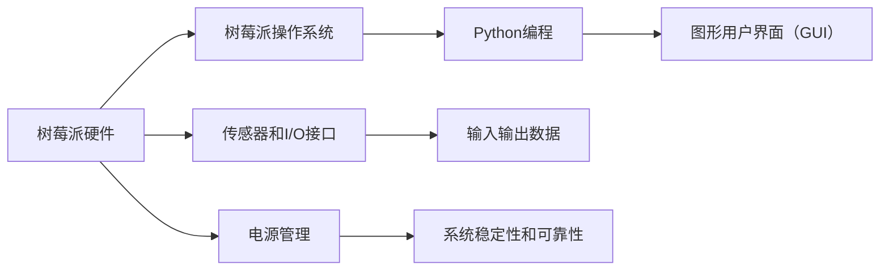

                 

# 树莓派项目开发：从入门到精通

在技术迅猛发展的今天，树莓派（Raspberry Pi）这一小型廉价计算机成为了各类项目开发的热门选择。作为一款基于ARM架构的开源计算机，树莓派以其低成本、高性能、易于部署的特点，在教育、科研、工业和消费电子等多个领域得到广泛应用。本文将从入门到精通，系统讲解树莓派项目开发的各个方面，帮助读者全面掌握树莓派的使用技能，并在此基础上深入探索项目开发的高级技巧。

## 1. 背景介绍

### 1.1 树莓派概述

树莓派是一块基于ARM架构的计算机，由英国树莓派基金会在2012年首次推出。树莓派以其低廉的价格、强大的性能和丰富的开源支持，迅速成为硬件爱好者的首选开发平台之一。目前，树莓派已经发布了几代产品，最新版本为树莓派4，搭载了64位ARM Cortex-A72处理器，最高可支持2GB RAM和64GB eMMC存储。树莓派的运行系统为树莓派操作系统（Raspberry Pi OS），基于Linux内核构建，支持Debian、Ubuntu等多种发行版。

### 1.2 树莓派项目的应用场景

树莓派项目应用广泛，涵盖教育、科学实验、工业控制、智能家居等多个领域。以下是一些典型应用场景：

- **科学实验和教育**：树莓派低成本、易学易用，适合作为科学实验和课堂教学的平台。通过树莓派，学生可以轻松开展编程、电子、物理等各类实验，提升实践能力。
- **物联网（IoT）和智能家居**：树莓派内置多个I/O接口和传感器，能够方便地与其他硬件设备进行连接和交互。通过树莓派，用户可以实现智能照明、安全监控、环境监测等功能。
- **工业控制和嵌入式系统**：树莓派支持多种编程语言和操作系统，适合进行嵌入式系统开发和工业控制应用。在工业领域，树莓派可用于数据采集、实时监控、工业自动化等。
- **机器人开发和无人驾驶**：树莓派可用于机器人平台和无人驾驶系统中，搭载各类传感器和相机，实现复杂的感知和决策功能。
- **多媒体和数字艺术**：树莓派可以运行各类多媒体软件和数字艺术工具，如音频编辑、视频处理、图形设计等。树莓派还可作为音频/视频服务器，支持流媒体播放。

## 2. 核心概念与联系

### 2.1 核心概念概述

树莓派项目开发涉及多个关键概念，包括但不限于树莓派硬件、树莓派操作系统、Python编程、GPU加速、图形用户界面（GUI）等。

- **树莓派硬件**：树莓派主板、电源、摄像头、传感器等硬件设备是项目开发的基础。了解硬件接口和连接方式，是成功开发项目的第一步。
- **树莓派操作系统**：树莓派操作系统是树莓派的核心软件平台，包括文件系统、驱动程序、用户空间应用等。常用的树莓派操作系统有Raspberry Pi OS、Debian、Ubuntu等。
- **Python编程**：Python是树莓派项目开发的主要编程语言，因其简洁易学、库资源丰富，适合初学者和高级开发者使用。
- **GPU加速**：树莓派内置NVIDIA Jetson GPU，可提供高效计算能力，适合图像处理、深度学习等高性能任务。
- **图形用户界面（GUI）**：图形界面可大幅提升项目开发效率，使界面设计、交互体验更加直观和便捷。常用的GUI框架包括PyQt、Kivy等。

### 2.2 核心概念原理和架构的 Mermaid 流程图

以下是树莓派项目开发的整体流程，展示了不同组件之间的联系：



这个流程图示意图说明了树莓派硬件设备、操作系统、编程语言和用户界面之间的相互关系。树莓派硬件提供计算和存储资源，操作系统提供系统管理功能，编程语言和用户界面则用于实现具体应用。

## 3. 核心算法原理 & 具体操作步骤

### 3.1 算法原理概述

树莓派项目开发的核心算法原理包括数据处理、图像处理、深度学习、自然语言处理等。这些算法在树莓派上通常使用Python实现，借助NumPy、OpenCV、TensorFlow等库进行高效计算。

- **数据处理**：树莓派项目开发中，数据通常以文件或流的形式输入输出。数据处理算法需支持高效读写、数据清洗、特征提取等操作。
- **图像处理**：树莓派内置GPU，适合进行图像处理任务。图像处理算法需支持图像滤波、边缘检测、目标识别等操作。
- **深度学习**：树莓派支持深度学习框架，如图像分类、目标检测等。深度学习算法需高效利用GPU加速，支持并行计算。
- **自然语言处理（NLP）**：树莓派支持自然语言处理任务，如文本分析、情感分析、智能问答等。NLP算法需高效利用内存和CPU，支持高效存储和检索。

### 3.2 算法步骤详解

树莓派项目开发的步骤主要包括：

1. **硬件准备**：安装树莓派主板、摄像头、传感器等硬件设备，并确保正确连接。
2. **系统安装**：选择合适的树莓派操作系统进行安装，并进行基本配置。
3. **环境搭建**：安装Python、NumPy、OpenCV、TensorFlow等常用库和框架。
4. **项目开发**：根据项目需求，设计算法流程，编写Python代码，并进行调试和优化。
5. **性能测试**：进行各项性能测试，确保项目运行稳定和高效。
6. **部署上线**：将项目部署到树莓派硬件上，并进行必要的系统维护。

### 3.3 算法优缺点

树莓派项目开发的优势包括：

- **低成本**：树莓派硬件成本低廉，适合各类预算有限的项目。
- **高性能**：树莓派内置GPU和高效计算能力，支持复杂算法和大型数据集。
- **易用性**：树莓派操作系统和编程语言简单易学，适合初学者和快速开发。
- **开源支持**：树莓派社区活跃，资源丰富，易于获取支持和帮助。

缺点包括：

- **物理限制**：树莓派硬件体积有限，适合小型项目，不适合大型服务器和数据中心。
- **内存限制**：树莓派内置内存较小，不适合处理大规模数据集和复杂算法。
- **处理速度**：树莓派内置CPU性能较低，不适合处理极端高负载任务。

### 3.4 算法应用领域

树莓派项目开发的应用领域广泛，涵盖以下几大类：

- **科学实验和教育**：适合进行物理实验、化学实验、编程教学等。
- **物联网（IoT）和智能家居**：适合实现环境监测、安全监控、智能照明等功能。
- **工业控制和嵌入式系统**：适合进行数据采集、实时监控、工业自动化等。
- **机器人开发和无人驾驶**：适合进行感知、决策、控制等复杂功能。
- **多媒体和数字艺术**：适合进行音频编辑、视频处理、图形设计等。

## 4. 数学模型和公式 & 详细讲解 & 举例说明

### 4.1 数学模型构建

树莓派项目开发涉及的数学模型包括图像处理、深度学习、自然语言处理等。这里以图像处理为例，构建图像分类模型。

假设有一张待分类的图像，像素点表示为$x_1, x_2, ..., x_n$，通过卷积层和池化层得到特征图$y_1, y_2, ..., y_m$，最终输出分类结果$z$。则模型可以表示为：

$$ y = Convolution(x, W) + Bias $$
$$ z = Softmax(y) $$

其中，$W$为卷积核权重，$Bias$为偏置项，$Softmax$为激活函数。

### 4.2 公式推导过程

以图像分类为例，推导卷积神经网络（CNN）的基本公式：

设输入图像为$x \in \mathbb{R}^{n \times n \times c}$，卷积核权重为$W \in \mathbb{R}^{k \times k \times c \times o}$，则卷积操作可表示为：

$$ y = Convolution(x, W) = \sum_{i=1}^{k}\sum_{j=1}^{k}\sum_{c=1}^{c}\sum_{o=1}^{o}W_{i,j,c,o}x_{i,j,c} $$

其中，$x_{i,j,c}$表示输入图像的第$i$行第$j$列第$c$通道的像素值，$W_{i,j,c,o}$表示卷积核的第$i$行第$j$列第$c$通道和第$o$通道之间的权重值。

通过多个卷积和池化层，得到特征图$y \in \mathbb{R}^{m \times m \times o}$。将特征图输入全连接层和softmax激活函数，输出分类结果$z \in \mathbb{R}^{k}$。

### 4.3 案例分析与讲解

以基于树莓派实现的图像分类项目为例，具体分析项目实现步骤：

1. **数据准备**：收集图像数据集，进行标注和预处理。
2. **模型搭建**：使用TensorFlow框架搭建CNN模型，设计卷积层、池化层、全连接层和softmax激活函数。
3. **训练模型**：使用图像数据集对模型进行训练，调整超参数和优化器。
4. **模型评估**：在测试集上评估模型性能，计算准确率和损失函数。
5. **部署应用**：将训练好的模型部署到树莓派上，实现实时图像分类。

## 5. 项目实践：代码实例和详细解释说明

### 5.1 开发环境搭建

以下是树莓派项目开发的开发环境搭建步骤：

1. **安装树莓派操作系统**：使用SD卡工具将树莓派操作系统安装到SD卡中，并连接到树莓派主板。
2. **配置网络**：配置树莓派的网络参数，确保能正常访问互联网。
3. **安装开发工具**：安装Python、NumPy、OpenCV、TensorFlow等常用库和框架。
4. **连接摄像头**：将摄像头连接到树莓派上，确保正确连接。
5. **连接传感器**：根据项目需求，连接各类传感器和I/O设备。

### 5.2 源代码详细实现

以下是基于树莓派实现的图像分类项目的Python代码实现：

```python
import cv2
import numpy as np
import tensorflow as tf

# 加载模型
model = tf.keras.models.load_model('model.h5')

# 加载摄像头
cap = cv2.VideoCapture(0)

while True:
    ret, frame = cap.read()
    if not ret:
        break
    
    # 预处理图像
    frame = cv2.resize(frame, (224, 224))
    frame = frame / 255.0
    frame = np.expand_dims(frame, axis=0)
    
    # 推理预测
    result = model.predict(frame)
    class_index = result.argmax()
    class_name = class_names[class_index]
    
    # 显示结果
    cv2.putText(frame, class_name, (20, 50), cv2.FONT_HERSHEY_SIMPLEX, 1, (0, 255, 0), 2)
    cv2.imshow('frame', frame)
    
    if cv2.waitKey(1) == ord('q'):
        break

cap.release()
cv2.destroyAllWindows()
```

### 5.3 代码解读与分析

上述代码实现了树莓派上的实时图像分类项目。具体分析如下：

- **加载模型**：使用TensorFlow的`load_model`函数加载训练好的模型文件，确保模型已经训练好。
- **加载摄像头**：使用OpenCV的`VideoCapture`函数打开摄像头，进行实时视频采集。
- **预处理图像**：对采集到的图像进行缩放、归一化等预处理操作，确保输入到模型的数据格式正确。
- **推理预测**：将预处理后的图像输入模型进行推理预测，得到分类结果。
- **显示结果**：在采集到的图像上标注分类结果，并显示在屏幕上。
- **按键退出**：使用OpenCV的`waitKey`函数监听键盘按键，当按键q时退出程序。

## 6. 实际应用场景

### 6.1 智能家居

树莓派在智能家居领域有广泛应用，可以实现智能照明、安全监控、环境监测等功能。例如，树莓派可以通过摄像头和传感器监测室内环境，自动调节灯光和温度，提升家居舒适度。

### 6.2 物联网（IoT）

树莓派内置I/O接口和传感器，适合进行各类物联网应用。例如，树莓派可以实现智能门锁、智能开关、智能插座等功能，提升家庭生活的便捷性和智能化水平。

### 6.3 工业控制

树莓派适合进行工业控制应用，如数据采集、实时监控、工业自动化等。例如，树莓派可以实现对生产设备的远程控制和监控，提升生产效率和安全性。

### 6.4 机器人开发

树莓派可用于机器人平台和无人驾驶系统中，搭载各类传感器和相机，实现复杂的感知和决策功能。例如，树莓派可以实现机器人避障、语音识别、图像识别等功能，提升机器人的智能化水平。

## 7. 工具和资源推荐

### 7.1 学习资源推荐

以下是树莓派项目开发的几个学习资源：

1. **树莓派官方文档**：树莓派官网提供详尽的硬件和软件文档，涵盖安装、配置、编程等方面，是树莓派项目开发的重要参考资料。
2. **PyImageSearch**：专注于图像处理的博客，提供了丰富的图像处理算法和实践案例，适合初学者和高级开发者参考。
3. **TensorFlow官方文档**：TensorFlow作为流行的深度学习框架，提供了详尽的教程和示例，适合进行各类深度学习应用。
4. **树莓派社区**：树莓派社区活跃，用户众多，提供丰富的资源和经验分享，适合获取支持和帮助。

### 7.2 开发工具推荐

以下是树莓派项目开发的几个常用开发工具：

1. **OpenCV**：开源计算机视觉库，支持图像处理、目标识别、机器学习等功能，适合树莓派项目开发。
2. **PyTorch**：基于Python的深度学习框架，支持GPU加速和分布式训练，适合复杂深度学习应用。
3. **Raspberry Pi Imaging Tool**：用于将树莓派操作系统安装到SD卡的工具，方便进行硬件部署。
4. **Python IDE**：如PyCharm、Spyder等，支持树莓派项目开发，提供代码提示、调试功能等。

### 7.3 相关论文推荐

以下是树莓派项目开发的几个相关论文：

1. **"Raspberry Pi in the classroom: A platform for learning to code"**：介绍树莓派在课堂教学中的应用，适合教育领域参考。
2. **"Raspberry Pi based visual object tracking system"**：介绍基于树莓派的视觉跟踪系统，适合图像处理领域参考。
3. **"Design and implementation of a Raspberry Pi based home automation system"**：介绍基于树莓派的智能家居系统，适合智能家居领域参考。
4. **"Raspberry Pi for biomedical applications: A review"**：介绍树莓派在生物医学领域的应用，适合医疗领域参考。

## 8. 总结：未来发展趋势与挑战

### 8.1 研究成果总结

树莓派项目开发已经取得了丰富的成果，涵盖了科学实验、教育、智能家居、工业控制等多个领域。这些成果展示了树莓派在硬件和软件两个层面的强大能力，推动了各类应用的发展。

### 8.2 未来发展趋势

树莓派项目开发的未来发展趋势包括：

1. **硬件升级**：未来树莓派将推出性能更强的硬件版本，支持更多的I/O接口和传感器。
2. **软件优化**：树莓派操作系统和编程工具将不断优化，支持更多语言和框架，提升开发效率。
3. **生态系统扩展**：树莓派社区将不断壮大，提供更多资源和支持，推动生态系统的扩展。
4. **跨平台支持**：树莓派将支持更多操作系统和平台，方便开发者在不同环境中使用。

### 8.3 面临的挑战

树莓派项目开发仍面临一些挑战：

1. **硬件限制**：树莓派硬件性能和内存限制，可能导致项目部署受限。
2. **开发门槛**：树莓派项目开发需要一定的编程和硬件知识，初学者入门难度较高。
3. **资源不足**：树莓派开发社区资源相对较少，项目开发需要更多支持。
4. **安全问题**：树莓派上的项目可能面临安全威胁，需要加强防护。

### 8.4 研究展望

未来的研究展望包括：

1. **硬件优化**：研究和开发性能更强的树莓派硬件，支持更大规模的数据处理和更高负载的任务。
2. **跨平台支持**：开发跨平台树莓派项目，支持更多的操作系统和平台，提升开发灵活性。
3. **生态系统建设**：建立完善的项目开发生态系统，提供更多资源和支持，吸引更多开发者加入。
4. **应用拓展**：探索树莓派在更多领域的应用，如医疗、金融、农业等，推动技术创新和产业发展。

## 9. 附录：常见问题与解答

### Q1: 树莓派硬件如何选择？

A: 选择树莓派硬件时，需考虑以下因素：
- **处理器性能**：如树莓派4支持64位ARM Cortex-A72，性能更强。
- **内存大小**：如树莓派4支持2GB RAM，适合运行大型程序。
- **接口类型**：如树莓派4支持USB 3.0和HDMI 2.1，适合连接更多外设。
- **价格预算**：如树莓派4价格稍高，但性能更优。

### Q2: 树莓派操作系统如何选择？

A: 选择树莓派操作系统时，需考虑以下因素：
- **稳定性**：如Raspberry Pi OS基于Debian，稳定可靠。
- **社区支持**：如Ubuntu树莓派版社区活跃，资源丰富。
- **安装难度**：如Raspberry Pi Imaging Tool工具方便安装，适合初学者。
- **更新频率**：如定期更新，提供安全补丁和优化性能。

### Q3: 如何进行图像处理？

A: 进行图像处理时，需使用OpenCV等库，进行图像预处理、特征提取、目标识别等操作。具体步骤包括：
- **安装OpenCV**：使用`pip install opencv-python`命令安装OpenCV。
- **加载图像**：使用`cv2.imread`函数加载图像。
- **预处理图像**：使用`cv2.resize`函数调整图像尺寸，`cv2.cvtColor`函数转换图像颜色空间，`cv2.GaussianBlur`函数进行图像模糊等。
- **特征提取**：使用`cv2.Canny`函数进行边缘检测，`cv2.HoughCircles`函数进行圆形检测，`cv2.matchTemplate`函数进行模板匹配等。
- **目标识别**：使用`cv2.CascadeClassifier`函数进行目标识别，如人脸识别、车辆识别等。

### Q4: 如何进行深度学习？

A: 进行深度学习时，需使用TensorFlow等框架，进行模型搭建、训练和推理等操作。具体步骤包括：
- **安装TensorFlow**：使用`pip install tensorflow`命令安装TensorFlow。
- **搭建模型**：使用`tf.keras.Sequential`函数搭建模型，添加卷积层、池化层、全连接层等。
- **训练模型**：使用`model.fit`函数进行模型训练，调整超参数和优化器。
- **保存模型**：使用`model.save`函数保存模型，方便后续使用。
- **推理预测**：使用`model.predict`函数进行模型推理，得到预测结果。

以上是树莓派项目开发的详细指南，通过系统学习本教程，相信读者能够全面掌握树莓派的使用技能，并在此基础上深入探索项目开发的高级技巧。树莓派作为一款功能强大、易于使用的开发平台，将在未来迎来更广泛的应用和发展。

