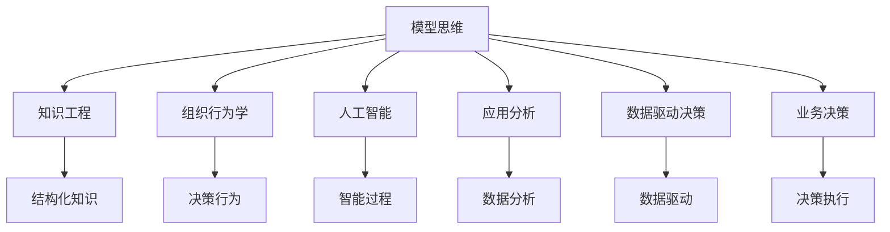

                 

# 模型思维在管理培训中的运用

> 关键词：模型思维,管理培训,知识工程,组织行为,人工智能,应用分析,数据驱动,业务决策

## 1. 背景介绍

### 1.1 问题由来
在全球经济快速发展和企业竞争加剧的当下，管理培训作为提升组织效能的重要手段，其需求和重视程度不断提升。传统的管理培训往往侧重于理论知识和案例分享，缺乏系统性的实战训练。然而，面对复杂的商业环境，仅凭传统的培训方式已难以满足企业对管理者技能和思维的要求。

在这样的背景下，模型思维作为一种结构化、系统化的思考方式，逐渐成为管理培训中不可或缺的工具。模型思维不仅能够帮助管理者构建清晰、系统的业务逻辑，还能够通过数据驱动的方式，提升决策的科学性和准确性。本文将探讨模型思维在管理培训中的应用，旨在为培训师和受训管理者提供参考，提升培训效果和实战能力。

### 1.2 问题核心关键点
模型思维在管理培训中的应用主要包括以下几个关键点：

1. **系统性思维**：通过构建系统模型，帮助管理者系统化地理解复杂业务系统，发现系统各组成部分之间的相互作用和影响。
2. **数据驱动决策**：借助数据分析技术，提炼业务数据中的关键信息，辅助管理者进行决策，提升决策的科学性和可靠性。
3. **问题建模**：通过建立问题模型，识别和分析业务问题，找到解决问题的关键路径和策略。
4. **动态调整**：应用动态系统模型，捕捉业务环境的变化，及时调整管理策略，提高应变能力。

这些关键点体现了模型思维在管理培训中的独特价值，有助于培养具备系统性思维、数据驱动意识和动态调整能力的管理者。

### 1.3 问题研究意义
在管理培训中引入模型思维，对于提升管理者的实战能力、促进企业的战略执行和业务创新具有重要意义：

1. **提升实战能力**：通过系统性思维和数据驱动决策，管理者能够更加科学、高效地处理日常业务问题，提升执行力和工作效率。
2. **促进战略执行**：模型思维有助于管理者理解和分析企业的战略目标和计划，确保各部门和员工的执行力与战略目标一致。
3. **推动业务创新**：基于问题建模和动态调整，管理者能够识别潜在的业务机会，创新管理方法和业务模式。

本文旨在系统梳理模型思维在管理培训中的应用，探讨其实现方法和实践案例，以期为培训师和管理者提供指导和参考。

## 2. 核心概念与联系

### 2.1 核心概念概述

为更好地理解模型思维在管理培训中的应用，本节将介绍几个密切相关的核心概念：

- **模型思维**：指通过构建和管理模型，对复杂系统进行分析和决策的过程。模型思维强调系统性、数据驱动和动态调整，有助于管理者系统地理解和解决问题。
- **知识工程**：利用计算机技术，将人类知识结构化和形式化，实现知识获取、组织、检索和应用的过程。知识工程在管理培训中提供结构化的知识基础，支持模型构建和应用。
- **组织行为学**：研究个体、群体和组织在决策、行为和互动中的规律和模式。组织行为学为模型思维提供了心理学和社会学背景，帮助理解管理行为。
- **人工智能**：通过计算机模拟人类智能过程，实现问题求解、知识表示和推理等任务。人工智能技术为模型思维提供了技术手段，支持复杂模型的构建和分析。
- **应用分析**：通过对业务数据进行建模、分析和解释，支持企业进行数据驱动的决策和管理。应用分析技术为模型思维提供了数据分析工具和方法。
- **数据驱动决策**：基于数据收集、处理和分析，进行决策和行动的过程。数据驱动决策是模型思维的重要组成部分，有助于管理者科学决策。
- **业务决策**：在管理活动中，基于组织目标和资源，进行决策和行动的过程。业务决策是模型思维在管理培训中的核心应用场景。

这些核心概念之间的逻辑关系可以通过以下Mermaid流程图来展示：



这个流程图展示了几大核心概念之间的联系和作用：

1. 模型思维通过知识工程获得结构化知识，利用组织行为学理解决策行为，借助人工智能进行问题建模和分析。
2. 应用分析提供数据分析工具，数据驱动决策支持基于数据的科学决策。
3. 最终，业务决策在模型思维和数据驱动决策的支持下，进行实际的决策执行。

这些概念共同构成了模型思维在管理培训中的应用框架，使其能够在培训中培养管理者的综合素质。

## 3. 核心算法原理 & 具体操作步骤
### 3.1 算法原理概述

模型思维在管理培训中的应用，本质上是一个从理论到实践的系统化过程。其核心思想是通过构建和管理模型，帮助管理者系统化地理解和分析复杂的业务问题，辅助其进行科学决策。

具体而言，模型思维在管理培训中的应用分为以下几个步骤：

1. **理论知识学习**：通过学习模型思维的基础理论和应用案例，理解模型思维的基本概念和方法。
2. **问题建模**：识别和分析业务问题，构建问题模型，确定模型的输入和输出变量。
3. **数据获取和处理**：收集相关业务数据，进行数据清洗、预处理和特征工程。
4. **模型构建和训练**：选择合适的模型，根据问题模型进行模型构建，并在训练数据集上进行模型训练。
5. **模型评估和应用**：在测试数据集上评估模型性能，并应用于实际业务场景，进行数据驱动的决策支持。

### 3.2 算法步骤详解

基于模型思维在管理培训中的应用，本文将详细介绍每个步骤的具体操作：

**Step 1: 理论知识学习**

- **内容设计**：通过讲座、案例分析、情景模拟等形式，系统讲解模型思维的基本概念和方法，如系统思维、因果模型、统计分析等。
- **方法培训**：引入相关工具和技术，如知识工程软件、数据可视化工具等，提高管理者的实际操作能力。

**Step 2: 问题建模**

- **问题识别**：通过问卷调查、面对面访谈等方式，识别管理过程中的实际问题，如流程瓶颈、资源配置不合理等。
- **问题分解**：将问题分解为多个子问题，明确各个子问题的边界和影响因素。
- **建立模型**：根据问题的性质和特点，选择合适的模型，如因果图模型、网络模型、动态系统模型等。

**Step 3: 数据获取和处理**

- **数据收集**：根据问题模型，设计数据收集方案，收集相关业务数据，如财务数据、客户数据、流程数据等。
- **数据清洗**：对收集到的数据进行清洗和预处理，去除噪声和异常值，确保数据质量。
- **特征工程**：根据模型需求，进行特征提取和特征选择，构造模型输入变量。

**Step 4: 模型构建和训练**

- **模型选择**：选择合适的模型，如决策树、回归模型、深度学习模型等，根据问题模型进行模型构建。
- **模型训练**：在训练数据集上训练模型，调整模型参数，优化模型性能。
- **模型验证**：在验证数据集上评估模型性能，进行模型调优。

**Step 5: 模型评估和应用**

- **模型应用**：将模型应用于实际业务场景，进行数据驱动的决策支持。
- **效果评估**：根据实际效果，评估模型的实用性和准确性，进行必要的模型调整和优化。

### 3.3 算法优缺点

模型思维在管理培训中的应用具有以下优点：

1. **系统性思维**：通过系统化的建模和分析，帮助管理者系统化地理解复杂业务系统，提高决策的全面性和系统性。
2. **数据驱动决策**：借助数据分析技术，提炼业务数据中的关键信息，辅助管理者进行决策，提升决策的科学性和可靠性。
3. **问题建模**：通过建立问题模型，识别和分析业务问题，找到解决问题的关键路径和策略。
4. **动态调整**：应用动态系统模型，捕捉业务环境的变化，及时调整管理策略，提高应变能力。

同时，模型思维也存在一定的局限性：

1. **模型构建复杂**：模型构建和训练需要较强的数学和统计背景，对管理者的专业要求较高。
2. **数据需求大**：模型应用需要大量高质量的数据，数据获取和处理过程较为复杂。
3. **模型解释难度**：复杂模型的内部机制难以解释，可能影响管理者的理解和信任。
4. **模型依赖性强**：模型应用的准确性和实用性高度依赖模型的构建和训练效果，需要持续优化和改进。

尽管存在这些局限性，但就目前而言，模型思维在管理培训中的应用已经取得了显著效果，被广泛应用于各个行业。未来相关研究的重点在于如何进一步简化模型构建流程，降低数据需求，提高模型可解释性，同时兼顾系统性、数据驱动和动态调整等核心能力。

### 3.4 算法应用领域

模型思维在管理培训中的应用，主要包括以下几个领域：

1. **组织绩效管理**：通过系统模型和数据分析，识别组织绩效管理的瓶颈和改进点，制定科学的管理策略。
2. **人力资源管理**：通过问题建模和数据驱动，优化人力资源配置，提高员工满意度和组织效率。
3. **市场营销管理**：通过建立客户行为模型和市场变化模型，制定精准的营销策略，提升客户转化率和市场竞争力。
4. **运营管理**：通过流程建模和数据分析，优化运营流程，降低成本，提高运营效率。
5. **战略规划与执行**：通过战略规划模型和动态系统模型，确保战略目标与实际执行的一致性，提高战略执行的科学性。
6. **风险管理**：通过风险评估模型和动态系统模型，识别和应对潜在风险，保障组织的稳定运营。

除了上述这些应用领域外，模型思维还广泛应用于项目管理、供应链管理、财务管理等多个领域，为企业的综合管理能力提供了有力的支持。

## 4. 数学模型和公式 & 详细讲解  
### 4.1 数学模型构建

本节将使用数学语言对模型思维在管理培训中的应用进行更加严格的刻画。

记管理培训问题为 $P$，其输入为 $x$，输出为 $y$。模型思维的目标是构建一个映射 $f$，使得 $f(x) \approx y$，从而通过输入 $x$ 预测输出 $y$。具体而言，模型思维通过以下几个步骤构建模型：

1. **问题定义**：将管理问题 $P$ 分解为多个子问题，每个子问题定义为一个输入 $x_i$ 和输出 $y_i$ 的映射关系。
2. **模型构建**：根据子问题的特点，选择合适的模型，如回归模型、分类模型、网络模型等。
3. **模型训练**：在训练数据集 $D$ 上训练模型，优化模型参数 $\theta$，使得模型在测试数据集 $D_t$ 上的预测性能最大化。
4. **模型应用**：将训练好的模型应用于实际管理问题，进行数据驱动的决策支持。

形式化地，假设模型 $f_{\theta}$ 在输入 $x$ 上的预测输出为 $y'$，则模型 $f_{\theta}$ 的预测误差为 $\epsilon$，定义如下：

$$
\epsilon = y' - y
$$

模型的损失函数 $\mathcal{L}$ 定义为：

$$
\mathcal{L}(f_{\theta}) = \frac{1}{N} \sum_{i=1}^N \epsilon_i^2
$$

其中 $N$ 为样本数量，$x_i$ 为第 $i$ 个样本的输入，$y_i$ 为第 $i$ 个样本的真实输出。目标是最小化损失函数 $\mathcal{L}(f_{\theta})$，即：

$$
\theta^* = \mathop{\arg\min}_{\theta} \mathcal{L}(f_{\theta})
$$

通过梯度下降等优化算法，最小化损失函数，得到最优参数 $\theta^*$。

### 4.2 公式推导过程

以下我们以回归模型为例，推导回归模型的最小二乘法求解过程。

假设回归模型为 $y' = \theta_0 + \theta_1x_1 + \theta_2x_2 + \cdots + \theta_nx_n$，其中 $y'$ 为预测输出，$\theta_0, \theta_1, \theta_2, \cdots, \theta_n$ 为模型参数。在 $m$ 个样本 $(x_{i1}, x_{i2}, \cdots, x_{in}, y_i)$ 上，模型的总误差为：

$$
E = \sum_{i=1}^m (y_i - y'_i)^2
$$

通过最小二乘法，求导并令导数为零，得到模型参数的估计值为：

$$
\theta_j = \frac{1}{m} \sum_{i=1}^m x_{ij}(y_i - \hat{y}_i)
$$

其中 $\hat{y}_i = \theta_0 + \theta_1x_{i1} + \theta_2x_{i2} + \cdots + \theta_nx_{in}$。

将上述公式代入模型预测输出，可得回归模型的最终预测公式：

$$
\hat{y} = \theta_0 + \theta_1x_1 + \theta_2x_2 + \cdots + \theta_nx_n
$$

这个公式展示了回归模型在管理培训中的应用过程，通过最小二乘法求解模型参数，进行数据驱动的预测和决策支持。

### 4.3 案例分析与讲解

为了更好地理解模型思维在管理培训中的应用，以下是几个典型案例的详细讲解：

**案例一：组织绩效管理**

某公司希望通过模型思维提升组织绩效管理水平。通过问卷调查和访谈，识别出组织绩效管理的瓶颈包括流程复杂、信息不对称、激励机制不完善等。针对这些问题，构建了组织绩效管理的问题模型，如图1所示。


根据问题模型，构建了回归模型 $f_{\theta}$，用于预测员工绩效 $y$ 与工作投入 $x_1$、工作环境 $x_2$、激励措施 $x_3$ 之间的关系。通过训练数据集，最小化损失函数，得到最优参数 $\theta$。将训练好的模型应用于实际管理问题，进行数据驱动的决策支持，如优化流程、改善工作环境、调整激励措施等，显著提高了组织绩效管理的科学性和系统性。

**案例二：人力资源管理**

某企业希望通过模型思维优化人力资源配置。通过分析员工绩效数据和工资数据，识别出员工绩效与工资之间的非线性关系。针对这一问题，构建了回归模型 $f_{\theta}$，用于预测员工绩效 $y$ 与工资 $x$ 之间的关系。通过训练数据集，最小化损失函数，得到最优参数 $\theta$。将训练好的模型应用于实际管理问题，进行数据驱动的决策支持，如调整薪酬结构、优化绩效评估方法等，显著提高了员工满意度和组织效率。

**案例三：市场营销管理**

某公司希望通过模型思维提升市场营销效果。通过分析客户数据和营销数据，识别出客户转化率与广告投放量、客户交互次数之间的关系。针对这一问题，构建了回归模型 $f_{\theta}$，用于预测客户转化率 $y$ 与广告投放量 $x_1$、客户交互次数 $x_2$ 之间的关系。通过训练数据集，最小化损失函数，得到最优参数 $\theta$。将训练好的模型应用于实际营销问题，进行数据驱动的决策支持，如优化广告投放策略、增加客户互动等，显著提高了客户转化率和市场竞争力。

## 5. 项目实践：代码实例和详细解释说明
### 5.1 开发环境搭建

在进行模型思维在管理培训中的应用实践前，我们需要准备好开发环境。以下是使用Python进行Pandas和Scikit-learn开发的环境配置流程：

1. 安装Anaconda：从官网下载并安装Anaconda，用于创建独立的Python环境。

2. 创建并激活虚拟环境：
```bash
conda create -n management-env python=3.8 
conda activate management-env
```

3. 安装Pandas和Scikit-learn：
```bash
conda install pandas scikit-learn
```

4. 安装相关工具包：
```bash
pip install numpy matplotlib seaborn joblib
```

完成上述步骤后，即可在`management-env`环境中开始模型思维在管理培训中的应用实践。

### 5.2 源代码详细实现

这里我们以回归模型在组织绩效管理中的应用为例，给出使用Pandas和Scikit-learn进行回归模型构建的Python代码实现。

首先，定义问题模型和数据集：

```python
import pandas as pd
from sklearn.linear_model import LinearRegression
from sklearn.metrics import mean_squared_error, r2_score

# 定义问题模型
x1 = ['流程复杂度', '信息不对称度', '激励措施']
y = '组织绩效'

# 定义数据集
data = pd.read_csv('performance_data.csv')
```

然后，构建回归模型并进行训练：

```python
# 分割数据集为训练集和测试集
train_data = data.sample(frac=0.8, random_state=42)
test_data = data.drop(train_data.index)

# 定义回归模型
X_train = train_data[x1]
y_train = train_data[y]
X_test = test_data[x1]
y_test = test_data[y]

model = LinearRegression()
model.fit(X_train, y_train)

# 在测试集上评估模型
y_pred = model.predict(X_test)
mse = mean_squared_error(y_test, y_pred)
r2 = r2_score(y_test, y_pred)
print(f"MSE: {mse}, R2: {r2}")
```

接着，输出回归模型的系数和截距：

```python
print(f"系数: {model.coef_}, 截距: {model.intercept_}")
```

以上就是使用Pandas和Scikit-learn构建回归模型的完整代码实现。可以看到，借助Pandas和Scikit-learn，模型的构建和训练过程变得简洁高效。

### 5.3 代码解读与分析

让我们再详细解读一下关键代码的实现细节：

**数据集定义**：
- `x1`：定义模型输入变量，即组织绩效管理中的关键因素。
- `y`：定义模型输出变量，即组织绩效管理的目标。
- `data`：定义数据集，包含组织绩效管理的各类数据。

**数据集分割**：
- `train_data`：从数据集中随机抽取80%作为训练集。
- `test_data`：剩余的20%作为测试集，用于评估模型性能。

**回归模型构建**：
- `LinearRegression()`：定义线性回归模型。
- `model.fit(X_train, y_train)`：在训练集上训练模型。
- `model.predict(X_test)`：在测试集上对样本进行预测。

**模型评估**：
- `mean_squared_error()`：计算均方误差，评估模型预测的准确性。
- `r2_score()`：计算决定系数，评估模型预测的拟合程度。

**模型输出**：
- `model.coef_`：回归模型系数，表示各输入变量的影响权重。
- `model.intercept_`：回归模型截距，表示当所有输入变量为0时的基础预测值。

可以看到，Pandas和Scikit-learn为模型构建和评估提供了强大的工具支持，开发者可以更加专注于模型设计和管理问题，而不必过多关注底层实现细节。

当然，工业级的系统实现还需考虑更多因素，如模型保存和部署、超参数自动搜索、更灵活的任务适配层等。但核心的回归模型构建方法基本与此类似。

## 6. 实际应用场景
### 6.1 智能客服系统

基于模型思维的智能客服系统，可以广泛应用于客户服务领域。传统客服往往依赖于人工客服，效率低、成本高，且难以实现全天候服务。通过模型思维构建的智能客服系统，可以自动处理大量客户咨询，提升服务效率和质量。

在技术实现上，可以收集客户的历史咨询记录和满意度数据，构建问题模型和回归模型，训练智能客服系统。智能客服系统能够自动理解客户意图，匹配最佳答复模板进行回复。对于客户提出的新问题，还可以接入检索系统实时搜索相关内容，动态组织生成回答。如此构建的智能客服系统，能大幅提升客户咨询体验和问题解决效率。

### 6.2 金融风险管理

金融机构需要实时监测市场风险，以规避潜在损失。传统的人工监测方式成本高、效率低，难以应对网络时代海量信息爆发的挑战。通过模型思维构建的风险管理模型，可以自动分析市场数据，识别潜在风险，及时预警和应对。

具体而言，可以收集金融市场的历史数据和实时数据，构建风险评估模型和动态系统模型，训练金融风险管理模型。模型能够实时分析市场数据，识别异常波动和潜在风险，及时向决策者发出预警，辅助决策者采取应对措施，降低风险损失。

### 6.3 供应链管理

供应链管理是一个复杂的系统，涉及物流、生产、销售等多个环节。通过模型思维构建的供应链管理系统，能够系统化地分析供应链中的关键问题，优化管理决策。

在技术实现上，可以收集供应链各环节的数据，构建问题模型和回归模型，训练供应链管理系统。系统能够自动分析供应链数据，识别瓶颈和改进点，提出优化建议，如优化库存管理、改进物流路线等。通过数据驱动的决策支持，供应链管理系统能够提高供应链的效率和稳定性，降低运营成本。

### 6.4 未来应用展望

随着模型思维在管理培训中的应用不断深入，其前景和潜力将更加广阔。未来，模型思维将在以下几个方面得到进一步发展：

1. **大数据应用**：随着数据量的不断增长，大数据技术的应用将更加广泛，模型思维在处理大规模数据和复杂系统中的能力将进一步提升。
2. **人工智能与模型思维的融合**：AI技术和模型思维的融合将带来新的突破，如神经网络模型的系统化应用，模型思维的自动化和智能化。
3. **多模态数据融合**：模型思维将应用于多模态数据融合，如文本、语音、图像等数据的综合分析，提升系统对复杂环境的适应能力。
4. **实时系统优化**：模型思维将应用于实时系统优化，如动态调整业务流程、实时优化资源配置等，提高系统的响应速度和稳定性。
5. **全球化管理**：模型思维将应用于全球化管理，如跨文化分析、国际市场预测等，提升全球化管理的能力和效率。

这些趋势展示了模型思维在管理培训中的巨大前景，相信随着技术的发展和应用实践的不断积累，模型思维将成为管理培训中的重要工具，推动管理实践的科学化和智能化。

## 7. 工具和资源推荐
### 7.1 学习资源推荐

为了帮助开发者系统掌握模型思维在管理培训中的应用，这里推荐一些优质的学习资源：

1. 《数据科学基础》系列课程：由知名大学开设的在线课程，系统讲解数据科学的基础知识和应用技能，适合初学者。
2. 《机器学习实战》书籍：详细介绍了机器学习的基本原理和应用案例，是学习机器学习的经典教材。
3. 《Python数据分析》书籍：介绍使用Python进行数据清洗、处理和分析的方法，适合数据分析和模型构建的实践者。
4. Kaggle平台：提供丰富的数据集和竞赛任务，适合进行数据驱动的模型构建和评估。
5. Coursera和edX平台：提供众多大学的在线课程，涵盖数据科学、机器学习、模型思维等多个方向，适合系统学习。

通过对这些资源的学习实践，相信你一定能够快速掌握模型思维在管理培训中的应用，并用于解决实际的业务问题。

### 7.2 开发工具推荐

高效的开发离不开优秀的工具支持。以下是几款用于模型思维在管理培训中的应用开发的常用工具：

1. Python：作为数据科学和机器学习的主流语言，Python拥有丰富的库和框架，适合进行模型构建和数据分析。
2. Pandas：Python的数据处理库，提供高效的数据清洗和处理功能，适合进行数据预处理和特征工程。
3. Scikit-learn：Python的机器学习库，提供多种常用的机器学习算法和模型评估工具，适合进行模型构建和评估。
4. Jupyter Notebook：交互式的数据分析和模型构建平台，适合进行模型构建和结果展示。
5. TensorBoard：可视化工具，适合实时监测模型训练状态，提供丰富的图表呈现方式，是调试模型的得力助手。
6. Tableau：数据可视化工具，适合进行复杂数据集的数据可视化和探索分析。

合理利用这些工具，可以显著提升模型思维在管理培训中的应用效率，加快创新迭代的步伐。

### 7.3 相关论文推荐

模型思维在管理培训中的应用源于学界的持续研究。以下是几篇奠基性的相关论文，推荐阅读：

1. "System Dynamics: A New Approach to Complexity in Organizations"（《系统动力学：复杂组织中的新方法》）：介绍了系统动力学方法在组织管理中的应用，为模型思维提供了理论基础。
2. "Machine Learning in Management"（《管理中的机器学习》）：探讨了机器学习技术在管理中的应用，包括预测建模、异常检测等。
3. "Data Mining and Statistical Learning"（《数据挖掘与统计学习》）：介绍了数据挖掘和统计学习的基本原理和方法，为模型思维提供了技术支持。
4. "A Survey of Knowledge Engineering Applications for Management Systems"（《知识工程在管理系统中的应用综述》）：介绍了知识工程在管理系统中的应用，包括知识表示、推理和应用等。
5. "Intelligent Decision Support Systems"（《智能决策支持系统》）：探讨了智能决策支持系统在管理中的应用，包括模型构建、数据驱动决策等。

这些论文代表了大数据和人工智能在管理培训中的应用前景，通过学习这些前沿成果，可以帮助研究者把握学科前进方向，激发更多的创新灵感。

## 8. 总结：未来发展趋势与挑战

### 8.1 总结

本文对模型思维在管理培训中的应用进行了全面系统的介绍。首先阐述了模型思维的背景和意义，明确了其在提升管理者的实战能力和决策科学性方面的独特价值。其次，从原理到实践，详细讲解了模型思维的应用流程和方法，给出了模型构建和评估的完整代码实例。同时，本文还广泛探讨了模型思维在智能客服、金融风险管理、供应链管理等多个行业领域的应用前景，展示了其在系统性、数据驱动和动态调整方面的优势。

通过本文的系统梳理，可以看到，模型思维在管理培训中的应用已经取得了显著效果，被广泛应用于各个行业。未来相关研究的重点在于如何进一步简化模型构建流程，降低数据需求，提高模型可解释性，同时兼顾系统性、数据驱动和动态调整等核心能力。

### 8.2 未来发展趋势

展望未来，模型思维在管理培训中的应用将呈现以下几个发展趋势：

1. **大数据应用**：随着数据量的不断增长，大数据技术的应用将更加广泛，模型思维在处理大规模数据和复杂系统中的能力将进一步提升。
2. **人工智能与模型思维的融合**：AI技术和模型思维的融合将带来新的突破，如神经网络模型的系统化应用，模型思维的自动化和智能化。
3. **多模态数据融合**：模型思维将应用于多模态数据融合，如文本、语音、图像等数据的综合分析，提升系统对复杂环境的适应能力。
4. **实时系统优化**：模型思维将应用于实时系统优化，如动态调整业务流程、实时优化资源配置等，提高系统的响应速度和稳定性。
5. **全球化管理**：模型思维将应用于全球化管理，如跨文化分析、国际市场预测等，提升全球化管理的能力和效率。

这些趋势展示了模型思维在管理培训中的巨大前景，相信随着技术的发展和应用实践的不断积累，模型思维将成为管理培训中的重要工具，推动管理实践的科学化和智能化。

### 8.3 面临的挑战

尽管模型思维在管理培训中的应用已经取得了显著效果，但在迈向更加智能化、普适化应用的过程中，它仍面临着诸多挑战：

1. **数据质量和数据量**：模型思维的应用高度依赖于数据的质量和数量，数据获取和处理过程较为复杂，且数据质量难以保证。
2. **模型复杂性和可解释性**：模型思维涉及复杂的数学和统计模型，模型的内部机制难以解释，可能影响管理者的理解和信任。
3. **模型构建和训练成本**：模型构建和训练过程需要较强的技术背景，成本较高，且需要持续优化和改进。
4. **模型依赖性和稳定性**：模型思维的应用高度依赖模型的构建和训练效果，模型的稳定性和可靠性需要不断优化。

尽管存在这些挑战，但随着技术的不断进步和应用实践的不断积累，模型思维在管理培训中的应用将不断提升，其前景将更加广阔。未来研究需要在数据获取、模型简化、可解释性等方面进行持续优化，以期更好地服务于管理实践。

### 8.4 研究展望

面对模型思维在管理培训中面临的挑战，未来的研究需要在以下几个方面寻求新的突破：

1. **简化模型构建流程**：开发更高效、更易用的模型构建工具和方法，降低技术门槛，提升模型的可操作性。
2. **降低数据需求**：探索无监督和半监督学习技术，降低对大规模标注数据的需求，扩大模型思维的应用范围。
3. **提高模型可解释性**：研究模型解释方法，提供更易理解的模型输出，提升管理者的信任和接受度。
4. **优化模型性能**：开发更高效、更稳定的模型训练方法和工具，提升模型性能和实用性。
5. **应用领域拓展**：将模型思维应用于更多实际管理问题，如风险管理、战略规划、创新管理等，提升管理实践的效果。

这些研究方向将有助于进一步提升模型思维在管理培训中的应用效果，推动管理实践的科学化和智能化。相信随着技术的不断进步和应用实践的不断积累，模型思维将在管理培训中发挥更加重要的作用，助力企业实现卓越的业务绩效。

## 9. 附录：常见问题与解答

**Q1: 什么是模型思维？**

A: 模型思维是指通过构建和管理模型，对复杂系统进行分析和决策的过程。模型思维强调系统性、数据驱动和动态调整，有助于管理者系统地理解和解决问题。

**Q2: 模型思维在管理培训中的应用主要有哪些？**

A: 模型思维在管理培训中的应用主要包括以下几个方面：
1. 系统性思维：通过构建系统模型，帮助管理者系统化地理解复杂业务系统，提高决策的全面性和系统性。
2. 数据驱动决策：借助数据分析技术，提炼业务数据中的关键信息，辅助管理者进行决策，提升决策的科学性和可靠性。
3. 问题建模：通过建立问题模型，识别和分析业务问题，找到解决问题的关键路径和策略。
4. 动态调整：应用动态系统模型，捕捉业务环境的变化，及时调整管理策略，提高应变能力。

**Q3: 如何在管理培训中引入模型思维？**

A: 在管理培训中引入模型思维，通常包括以下几个步骤：
1. 理论知识学习：通过讲座、案例分析、情景模拟等形式，系统讲解模型思维的基本概念和方法。
2. 问题建模：识别和分析业务问题，构建问题模型，确定模型的输入和输出变量。
3. 数据获取和处理：收集相关业务数据，进行数据清洗、预处理和特征工程。
4. 模型构建和训练：选择合适的模型，根据问题模型进行模型构建，并在训练数据集上进行模型训练。
5. 模型评估和应用：在测试数据集上评估模型性能，并应用于实际业务场景，进行数据驱动的决策支持。

**Q4: 模型思维的优缺点有哪些？**

A: 模型思维在管理培训中的应用具有以下优点：
1. 系统性思维：通过系统化的建模和分析，帮助管理者系统化地理解复杂业务系统，提高决策的全面性和系统性。
2. 数据驱动决策：借助数据分析技术，提炼业务数据中的关键信息，辅助管理者进行决策，提升决策的科学性和可靠性。
3. 问题建模：通过建立问题模型，识别和分析业务问题，找到解决问题的关键路径和策略。
4. 动态调整：应用动态系统模型，捕捉业务环境的变化，及时调整管理策略，提高应变能力。

同时，模型思维也存在一定的局限性：
1. 模型构建复杂：模型构建和训练需要较强的数学和统计背景，对管理者的专业要求较高。
2. 数据需求大：模型应用需要大量高质量的数据，数据获取和处理过程较为复杂。
3. 模型解释难度：复杂模型的内部机制难以解释，可能影响管理者的理解和信任。
4. 模型依赖性强：模型应用的准确性和实用性高度依赖模型的构建和训练效果，需要持续优化和改进。

**Q5: 模型思维在管理培训中的未来发展方向有哪些？**

A: 模型思维在管理培训中的未来发展方向主要包括以下几个方面：
1. 大数据应用：随着数据量的不断增长，大数据技术的应用将更加广泛，模型思维在处理大规模数据和复杂系统中的能力将进一步提升。
2. 人工智能与模型思维的融合：AI技术和模型思维的融合将带来新的突破，如神经网络模型的系统化应用，模型思维的自动化和智能化。
3. 多模态数据融合：模型思维将应用于多模态数据融合，如文本、语音、图像等数据的综合分析，提升系统对复杂环境的适应能力。
4. 实时系统优化：模型思维将应用于实时系统优化，如动态调整业务流程、实时优化资源配置等，提高系统的响应速度和稳定性。
5. 全球化管理：模型思维将应用于全球化管理，如跨文化分析、国际市场预测等，提升全球化管理的能力和效率。

**Q6: 模型思维在管理培训中应注意哪些问题？**

A: 在应用模型思维进行管理培训时，需要注意以下几个问题：
1. 数据质量和数据量：模型思维的应用高度依赖于数据的质量和数量，数据获取和处理过程较为复杂，且数据质量难以保证。
2. 模型复杂性和可解释性：模型思维涉及复杂的数学和统计模型，模型的内部机制难以解释，可能影响管理者的理解和信任。
3. 模型构建和训练成本：模型构建和训练过程需要较强的技术背景，成本较高，且需要持续优化和改进。
4. 模型依赖性和稳定性：模型思维的应用高度依赖模型的构建和训练效果，模型的稳定性和可靠性需要不断优化。

**Q7: 如何将模型思维应用于实际管理问题？**

A: 将模型思维应用于实际管理问题，通常包括以下几个步骤：
1. 问题定义：将管理问题分解为多个子问题，明确各子问题的边界和影响因素。
2. 模型选择：根据问题的性质和特点，选择合适的模型，如回归模型、分类模型、网络模型等。
3. 数据获取和处理：收集相关业务数据，进行数据清洗和预处理，构造模型输入变量。
4. 模型构建和训练：在训练数据集上训练模型，调整模型参数，优化模型性能。
5. 模型评估和应用：在测试数据集上评估模型性能，进行数据驱动的决策支持。

这些步骤展示了模型思维在实际管理问题中的应用流程，通过系统化的建模和分析，提升管理决策的科学性和系统性。

---

作者：禅与计算机程序设计艺术 / Zen and the Art of Computer Programming

