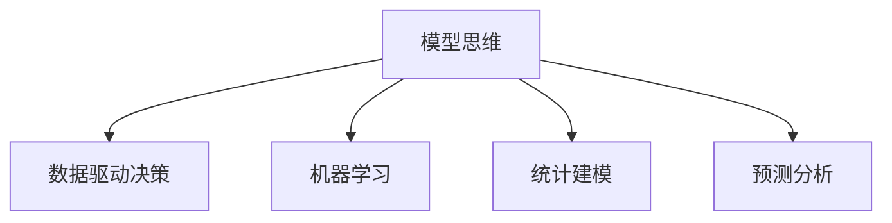

                 

# 模型思维对管理效率的提升

在当今这个快速变化、竞争激烈的时代，企业的管理效率直接影响着其市场竞争力。传统管理方法往往依赖于经验、直觉和简单的统计分析，难以应对复杂多变的市场环境。而模型思维（Model Thinking），即基于数据分析、统计建模和机器学习等方法的管理方式，能够帮助企业实现更加科学、系统、精确的管理决策，显著提升管理效率。本文将从模型思维的概念、核心算法原理、具体操作步骤等方面进行系统介绍，并结合实际案例，展示其在管理中的应用效果。

## 1. 背景介绍

### 1.1 问题由来
随着数据科学和人工智能技术的不断发展，企业开始逐渐意识到模型思维在管理中的应用潜力。传统管理方法主要依赖于经验法则和手工统计，容易受人为因素干扰，且难以适应复杂的市场变化。而模型思维通过数学模型和算法，可以从大量数据中提取规律和趋势，预测未来发展，辅助管理者做出更加明智的决策。

### 1.2 问题核心关键点
模型思维的核心在于将复杂的管理问题转化为数学模型，通过数据和算法求解模型的最优解，进而实现对管理活动的预测、优化和控制。其关键点包括：

- 问题建模：将管理问题抽象为数学模型，并选择合适的算法进行求解。
- 数据驱动：利用历史数据和实时数据，不断更新模型参数，提高模型预测的准确性。
- 可解释性：确保模型决策的透明性和可解释性，便于管理者理解和应用。
- 稳健性：模型应具有鲁棒性，能够应对各种异常和噪声数据，保证决策的可靠性。

## 2. 核心概念与联系

### 2.1 核心概念概述

为更好地理解模型思维在管理中的应用，本节将介绍几个密切相关的核心概念：

- 模型思维（Model Thinking）：基于数据分析、统计建模和机器学习等方法，将管理问题转化为数学模型，并通过数据和算法求解最优解，辅助管理决策。
- 数据驱动决策（Data-Driven Decision Making）：利用历史和实时数据，指导管理活动的决策过程，减少依赖经验和直觉的偏见。
- 机器学习（Machine Learning）：通过算法和模型从数据中学习规律和趋势，实现自动化的决策支持。
- 统计建模（Statistical Modeling）：运用统计学方法建立模型，描述数据之间的复杂关系，进行预测和推断。
- 预测分析（Predictive Analytics）：利用历史数据和模型，预测未来趋势和行为，为管理活动提供前瞻性指导。

这些概念之间的逻辑关系可以通过以下Mermaid流程图来展示：



这个流程图展示了几大概念之间的联系：

1. 模型思维基于数据驱动决策，通过机器学习和统计建模实现预测分析，为管理决策提供科学依据。
2. 数据驱动决策强调利用数据，而机器学习和统计建模是实现数据驱动的关键技术。
3. 预测分析是机器学习和统计建模的主要应用方向之一，旨在提高管理决策的前瞻性和准确性。

## 3. 核心算法原理 & 具体操作步骤

### 3.1 算法原理概述

模型思维的管理应用通常遵循以下步骤：

1. **问题建模**：将管理问题抽象为数学模型，选择合适的算法进行求解。
2. **数据准备**：收集历史数据和实时数据，清洗和预处理数据集。
3. **模型训练**：利用训练数据对模型进行训练，优化模型参数。
4. **模型评估**：使用验证数据集评估模型性能，选择最优模型。
5. **决策应用**：将模型应用到实际管理活动中，进行预测、优化和控制。

这些步骤通常使用统计学和机器学习算法来完成，常用的算法包括线性回归、逻辑回归、决策树、随机森林、深度学习等。

### 3.2 算法步骤详解

以下我们将详细介绍模型思维在管理中常用的算法步骤：

**Step 1: 问题建模**
- **业务问题抽象**：分析管理问题，明确其核心目标和关键因素。
- **数据需求识别**：确定需要收集哪些数据，以及数据的来源和类型。
- **模型选择**：根据问题的特点和数据类型，选择合适的数学模型。

**Step 2: 数据准备**
- **数据收集**：从企业内部和外部收集相关数据，包括历史数据、实时数据、外部市场数据等。
- **数据清洗**：清洗数据，去除异常值和噪声，处理缺失值。
- **数据转换**：对数据进行归一化、标准化、特征工程等处理，提升数据质量。

**Step 3: 模型训练**
- **模型建立**：使用训练数据集建立模型，选择合适的算法和参数。
- **模型优化**：使用梯度下降、遗传算法等优化算法，调整模型参数，最小化损失函数。
- **模型验证**：使用验证数据集评估模型性能，避免过拟合和欠拟合。

**Step 4: 模型评估**
- **性能指标**：定义模型评估的指标，如均方误差、精度、召回率等。
- **交叉验证**：使用交叉验证技术，评估模型的稳健性和泛化能力。
- **模型选择**：选择性能最优的模型，进行后续应用。

**Step 5: 决策应用**
- **模型部署**：将模型部署到实际管理系统中，进行预测、优化和控制。
- **决策制定**：根据模型的预测结果，制定相应的管理策略和行动计划。
- **效果监控**：实时监控模型效果，及时调整模型参数，确保决策的准确性和及时性。

### 3.3 算法优缺点

模型思维在管理中的应用，具有以下优点：

- **科学决策**：基于数据和算法，减少主观偏见，提高决策的科学性和客观性。
- **自动化优化**：通过模型优化和预测，实现自动化的管理优化，提升效率。
- **前瞻性指导**：利用历史数据和预测模型，提供前瞻性管理指导，应对市场变化。
- **可解释性强**：模型输出透明，便于管理者理解和应用。

同时，模型思维也存在一些局限性：

- **数据依赖性强**：模型性能受数据质量和数据量的影响，数据收集和处理成本高。
- **算法复杂度高**：高级算法可能需要较高的计算资源和时间成本。
- **模型更新慢**：模型更新周期长，难以快速适应快速变化的市场环境。
- **模型鲁棒性不足**：模型可能对异常数据和噪声敏感，影响决策的稳健性。

### 3.4 算法应用领域

模型思维在管理中的应用领域非常广泛，主要包括以下几个方面：

- **供应链管理**：预测市场需求，优化库存，控制物流成本。
- **人力资源管理**：预测人才需求，优化招聘流程，提高员工满意度。
- **金融风险管理**：预测市场风险，优化投资组合，控制金融风险。
- **市场营销**：分析市场趋势，优化广告投放，提升品牌影响力。
- **产品开发**：预测用户需求，优化产品设计，提升市场竞争力。

除了这些主要领域，模型思维还被应用于财务分析、客户关系管理、运营优化等多个方面，为企业的管理决策提供了科学、系统、精确的支持。

## 4. 数学模型和公式 & 详细讲解 & 举例说明

### 4.1 数学模型构建

本节将使用数学语言对模型思维在管理中的应用进行更加严格的刻画。

假设一个典型的管理问题可以抽象为一个回归问题，即预测目标变量 $y$ 与解释变量 $x$ 之间的关系。我们可以使用线性回归模型来表示这一关系，即：

$$ y = \beta_0 + \beta_1x_1 + \beta_2x_2 + \cdots + \beta_nx_n + \epsilon $$

其中，$y$ 为目标变量，$x$ 为解释变量，$\beta$ 为回归系数，$\epsilon$ 为误差项。

### 4.2 公式推导过程

根据线性回归模型的假设，我们可以使用最小二乘法求解模型参数 $\beta$，使得模型的预测值与实际值之间的误差最小化。具体推导如下：

1. **模型建立**：假设我们收集了 $m$ 个样本数据点 $(x_i, y_i)$，其中 $x_i = (x_{i1}, x_{i2}, \cdots, x_{in})$，$i=1,2,\cdots,m$。

2. **损失函数**：定义损失函数 $L(\beta)$ 为：

$$ L(\beta) = \frac{1}{m} \sum_{i=1}^{m} (y_i - \beta_0 - \beta_1x_{i1} - \beta_2x_{i2} - \cdots - \beta_nx_{in})^2 $$

3. **参数求解**：通过最小化损失函数 $L(\beta)$，求解模型参数 $\beta$。根据最小二乘法，求解过程如下：

$$ \beta = (\sum_{i=1}^{m}x_ix_i^T)^{-1}\sum_{i=1}^{m}x_iy_i $$

其中，$x_i^T$ 表示 $x_i$ 的转置矩阵，$(\cdot)^{-1}$ 表示矩阵的逆运算。

4. **模型验证**：使用验证集数据对模型进行验证，评估模型性能。常用的评估指标包括均方误差（MSE）、均方根误差（RMSE）、决定系数（R-squared）等。

### 4.3 案例分析与讲解

以某企业的供应链管理为例，我们希望预测某产品的需求量，以便优化库存和物流。假设我们收集了过去 $m$ 个月的历史数据，每个月的订单量和市场数据 $x$ 如下：

| 月份 | 订单量 | 市场指数 | 广告投放量 |
| --- | --- | --- | --- |
| 1 | 100 | 100 | 100 |
| 2 | 120 | 110 | 110 |
| ... | ... | ... | ... |
| m | 140 | 130 | 130 |

我们可以使用线性回归模型来预测下个月的需求量。具体步骤如下：

1. **问题建模**：将需求量 $y$ 与市场指数 $x_1$、广告投放量 $x_2$ 建模为线性回归模型。

2. **数据准备**：收集历史数据，去除异常值和噪声，进行数据清洗和转换。

3. **模型训练**：使用训练集数据建立模型，最小化损失函数 $L(\beta)$，求解参数 $\beta$。

4. **模型评估**：使用验证集数据评估模型性能，选择最优模型。

5. **决策应用**：根据模型预测结果，制定库存和物流计划，优化管理决策。

通过模型思维，我们能够科学地预测市场需求，优化库存和物流，降低管理成本，提升企业竞争力。

## 5. 项目实践：代码实例和详细解释说明

### 5.1 开发环境搭建

在进行模型思维的管理应用实践前，我们需要准备好开发环境。以下是使用Python进行Scikit-learn开发的环境配置流程：

1. 安装Anaconda：从官网下载并安装Anaconda，用于创建独立的Python环境。

2. 创建并激活虚拟环境：
```bash
conda create -n model-env python=3.8 
conda activate model-env
```

3. 安装Scikit-learn：使用pip命令安装Scikit-learn库。

```bash
pip install scikit-learn
```

4. 安装NumPy、Pandas等工具包：
```bash
pip install numpy pandas
```

5. 安装Jupyter Notebook：用于交互式编程和数据可视化。

```bash
pip install jupyter notebook
```

完成上述步骤后，即可在`model-env`环境中开始模型思维的管理应用实践。

### 5.2 源代码详细实现

下面以线性回归模型在供应链管理中的应用为例，给出使用Scikit-learn库的Python代码实现。

首先，定义线性回归模型：

```python
from sklearn.linear_model import LinearRegression
import pandas as pd
import numpy as np

# 加载数据
data = pd.read_csv('supply_chain.csv')

# 定义模型
model = LinearRegression()

# 分割数据集
X = data[['market_index', 'ad_spending']]
y = data['demand']

# 训练模型
model.fit(X, y)
```

然后，评估模型性能：

```python
from sklearn.metrics import mean_squared_error, r2_score

# 预测值
y_pred = model.predict(X)

# 评估指标
mse = mean_squared_error(y, y_pred)
rmse = np.sqrt(mse)
r2 = r2_score(y, y_pred)

print('MSE:', mse)
print('RMSE:', rmse)
print('R-squared:', r2)
```

最后，使用模型进行需求预测：

```python
# 定义新的市场指数和广告投放量
new_data = pd.DataFrame({'market_index': [135], 'ad_spending': [145]}, index=[0])

# 预测需求量
demand_pred = model.predict(new_data)
print('预测需求量:', demand_pred)
```

以上就是使用Scikit-learn库进行线性回归模型在供应链管理中的应用实践。可以看到，Scikit-learn库的强大封装使得模型的建立、训练和评估变得非常简洁高效。

### 5.3 代码解读与分析

让我们再详细解读一下关键代码的实现细节：

**模型定义**：
- `LinearRegression`类：定义线性回归模型，并实例化模型对象。
- `fit`方法：使用训练集数据拟合模型参数。

**数据加载与分割**：
- `pd.read_csv`方法：从CSV文件中加载数据，并将其转换为Pandas DataFrame格式。
- `X`和`y`：定义输入变量和目标变量，并使用`fit`方法拟合模型参数。

**模型评估**：
- `mean_squared_error`和`r2_score`方法：分别计算均方误差和决定系数，评估模型性能。
- `print`语句：输出评估指标，便于查看模型效果。

**需求预测**：
- `pd.DataFrame`：定义新的数据集，预测新市场指数和广告投放量。
- `predict`方法：使用模型进行预测，输出预测值。

可以看到，Scikit-learn库提供了丰富的模型选择和评估方法，使得模型思维在管理中的应用变得更加容易实现。

## 6. 实际应用场景

### 6.1 供应链管理

模型思维在供应链管理中的应用非常广泛，主要体现在以下几个方面：

1. **需求预测**：利用历史销售数据和市场指数等解释变量，预测未来需求量，优化库存管理。
2. **库存控制**：根据需求预测结果，调整库存水平，避免库存积压或缺货现象。
3. **物流优化**：通过优化运输路线和运输量，降低物流成本，提高配送效率。

通过模型思维，供应链管理者能够更加科学地管理库存和物流，提升企业运营效率和竞争力。

### 6.2 金融风险管理

金融风险管理是模型思维在管理中的重要应用之一。金融市场具有高度的不确定性和复杂性，传统方法难以应对。

1. **风险预测**：利用历史数据和模型，预测市场趋势和风险事件，提供前瞻性指导。
2. **投资组合优化**：根据预测结果，优化投资组合，降低风险和提高收益。
3. **信用评估**：利用信用记录和模型，评估客户的信用风险，制定相应的风险管理策略。

模型思维能够帮助金融机构更好地识别和管理金融风险，提升风险控制能力。

### 6.3 市场营销

市场营销是模型思维在管理中的另一个重要应用领域。企业需要精准定位目标客户，制定有效的市场策略，提升品牌影响力和市场份额。

1. **客户细分**：利用客户行为数据和模型，细分客户群体，实现精准营销。
2. **广告投放优化**：根据客户行为数据和模型，优化广告投放策略，提升广告效果。
3. **市场趋势分析**：利用市场数据和模型，分析市场趋势，制定相应的市场策略。

模型思维能够帮助企业更好地了解客户需求和市场趋势，制定有效的市场营销策略，提升市场竞争力。

## 7. 工具和资源推荐

### 7.1 学习资源推荐

为了帮助管理者系统掌握模型思维的理论基础和实践技巧，这里推荐一些优质的学习资源：

1. 《Python数据科学手册》：一本关于Python数据科学和机器学习的经典书籍，涵盖线性回归、决策树、随机森林等模型的详细介绍。

2. Coursera《数据科学专业》课程：由斯坦福大学教授讲授的在线课程，包含大量数据科学和机器学习的基础和高级内容。

3. Kaggle：一个数据科学竞赛平台，提供大量数据集和模型挑战，帮助你实践和提升数据建模技能。

4. Google Colab：谷歌推出的在线Jupyter Notebook环境，免费提供GPU和TPU算力，方便开发者快速上手实验最新模型。

通过这些资源的学习实践，相信管理者一定能够快速掌握模型思维的精髓，并应用于实际的管理决策中。

### 7.2 开发工具推荐

高效的模型思维管理应用开发离不开优秀的工具支持。以下是几款用于模型思维开发的常用工具：

1. Python：作为数据科学和机器学习的核心语言，Python提供了丰富的库和框架，适合快速迭代研究。

2. Scikit-learn：一个开源机器学习库，提供了大量常用的统计建模和机器学习算法，易于使用。

3. TensorFlow和PyTorch：深度学习框架，适合复杂模型和大规模数据的应用。

4. Jupyter Notebook：交互式编程环境，适合数据科学和模型思维的实践和分享。

5. Weights & Biases：模型训练的实验跟踪工具，记录和可视化模型训练过程中的各项指标。

6. TensorBoard：TensorFlow配套的可视化工具，实时监测模型训练状态，提供丰富的图表呈现方式。

合理利用这些工具，可以显著提升模型思维在管理中的应用效率，加快创新迭代的步伐。

### 7.3 相关论文推荐

模型思维在管理中的应用得益于数据科学和机器学习的不断进步。以下是几篇奠基性的相关论文，推荐阅读：

1. 《数据挖掘导论》：由Witten等人所著，详细介绍数据挖掘和机器学习的理论和算法，是数据科学领域的经典教材。

2. 《统计学习方法》：由李航等人所著，全面介绍统计学习方法的理论和应用，涵盖回归、分类、聚类等基本方法。

3. 《深度学习》：由Ian Goodfellow等人所著，详细介绍深度学习的理论和算法，涵盖神经网络、卷积神经网络、循环神经网络等。

这些论文代表了大数据和机器学习的发展脉络，为模型思维在管理中的应用提供了坚实的理论基础。

## 8. 总结：未来发展趋势与挑战

### 8.1 总结

本文对模型思维在管理中的应用进行了全面系统的介绍。首先阐述了模型思维的概念和核心算法原理，明确了模型思维在管理中的应用价值。其次，从原理到实践，详细讲解了模型思维的管理应用流程，给出了模型思维在供应链、金融风险、市场营销等多个领域的应用案例。最后，本文精选了模型思维的学习资源、开发工具和相关论文，力求为管理者提供全方位的技术指引。

通过本文的系统梳理，可以看到，模型思维在管理中的应用潜力巨大，能够帮助企业实现更加科学、系统、精确的管理决策，显著提升管理效率。未来，伴随数据科学和机器学习的不断进步，模型思维必将带来更多的创新应用，成为企业管理决策的重要手段。

### 8.2 未来发展趋势

展望未来，模型思维在管理中的应用将呈现以下几个发展趋势：

1. **多模态融合**：未来模型思维将更多地结合多模态数据，如图像、声音、文本等，提高决策的全面性和准确性。

2. **实时数据处理**：随着大数据技术的不断发展，模型思维将更加关注实时数据处理，实现动态管理和决策。

3. **智能决策支持**：结合人工智能技术和深度学习算法，模型思维将实现更加智能化的决策支持，提供前瞻性和精确性。

4. **跨领域应用**：模型思维将突破管理领域，应用于更多垂直行业，如医疗、教育、交通等，提升各行业的管理效率。

5. **可解释性增强**：模型思维将更加注重模型的可解释性，通过可视化、解释性分析等手段，提升模型的透明性和可信度。

6. **自动化和智能化**：随着自动化和智能化技术的进步，模型思维将进一步提升决策的自动化和智能化水平，减少人为干预。

以上趋势凸显了模型思维在管理中的广阔前景。这些方向的探索发展，必将进一步提升管理系统的效率和可靠性，为企业的创新和发展提供强大的技术支持。

### 8.3 面临的挑战

尽管模型思维在管理中的应用已经取得了显著成果，但在迈向更加智能化、普适化应用的过程中，仍面临诸多挑战：

1. **数据质量问题**：模型思维依赖于高质量的数据，数据收集和处理成本高，且数据质量问题难以避免。

2. **算法复杂性**：高级算法和模型需要较高的计算资源和时间成本，难以快速实现和部署。

3. **模型鲁棒性不足**：模型可能对异常数据和噪声敏感，影响决策的稳健性。

4. **模型可解释性不足**：模型输出通常缺乏可解释性，管理者难以理解和应用。

5. **市场变化快**：模型需要不断更新以适应市场变化，更新周期长，难以快速响应。

6. **技术门槛高**：模型思维需要一定的技术背景，难以被非技术管理者广泛应用。

正视模型思维面临的这些挑战，积极应对并寻求突破，将是大数据和机器学习在企业管理中的应用走向成熟的必由之路。相信随着数据科学和机器学习的不断发展，这些挑战终将一一被克服，模型思维必将在构建智能管理系统中扮演越来越重要的角色。

### 8.4 研究展望

面向未来，模型思维在管理中的应用研究需要从以下几个方向进行突破：

1. **多模态融合技术**：结合图像、声音、文本等多种数据源，提升模型的全面性和准确性。

2. **实时数据处理算法**：开发高效实时数据处理算法，实现动态管理和决策。

3. **可解释性增强技术**：开发可解释性增强技术，提高模型的透明性和可信度。

4. **自动化和智能化技术**：结合自动化和智能化技术，提升决策的自动化和智能化水平。

5. **跨领域应用研究**：探索模型思维在其他垂直行业中的应用，提升各行业的管理效率。

6. **模型鲁棒性提升**：开发鲁棒性增强技术，提高模型的稳健性和泛化能力。

这些研究方向将为模型思维在管理中的应用带来新的突破，为企业的管理决策提供更加科学、系统、精确的支持。

## 9. 附录：常见问题与解答

**Q1：模型思维是否适用于所有管理问题？**

A: 模型思维适用于大多数管理问题，特别是数据量较大、结构较清晰的问题。但对于需要深度理解和创造性的管理问题，如领导力、组织文化等，模型思维可能难以提供有效的解决方案。

**Q2：如何选择合适的模型和算法？**

A: 在选择模型和算法时，需要考虑问题的特点、数据类型和数据量。常用的模型包括线性回归、逻辑回归、决策树、随机森林、神经网络等。可以通过交叉验证和性能评估，选择最优的模型和算法。

**Q3：模型思维在数据隐私和安全方面需要注意哪些问题？**

A: 模型思维需要大量的数据支持，数据隐私和安全问题尤为关键。企业需要采取数据加密、匿名化、访问控制等措施，确保数据的安全性和隐私保护。同时，模型输出应透明，避免过度依赖模型结果，确保决策的合理性和可解释性。

**Q4：模型思维在模型更新和维护方面需要注意哪些问题？**

A: 模型思维的模型更新和维护是持续管理的重要环节。模型需要定期重新训练和验证，以适应市场变化和数据更新。同时，需要建立模型监控和报警机制，及时发现和纠正模型的异常行为。

**Q5：模型思维在应用中需要注意哪些伦理道德问题？**

A: 模型思维的应用需要考虑伦理道德问题，如偏见、歧视、隐私等。模型输出应公正、公平，避免对特定群体产生负面影响。同时，模型训练和应用过程应透明，便于监管和审查。

这些问题的解答可以帮助管理者更好地理解和应用模型思维，避免在实际应用中遇到问题。总之，模型思维在管理中的应用需要持续优化和改进，结合实际需求和数据特点，才能真正实现科学、系统、精确的管理决策。

