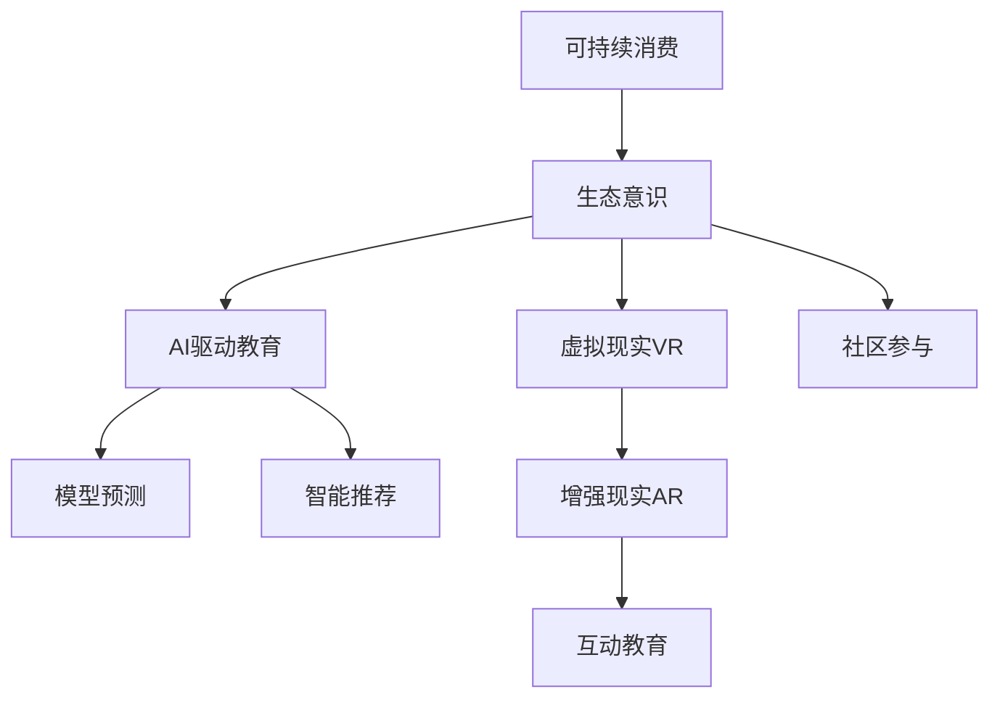

                 

# 欲望生态意识培养：AI驱动的可持续消费教育

> 关键词：可持续消费、AI驱动教育、生态意识、消费习惯、模型预测

## 1. 背景介绍

### 1.1 问题由来
随着全球经济快速发展，消费水平迅速提升，然而过度消费、消费误区和环境退化等问题也随之而来。全球资源日益紧张，人类活动对自然环境的破坏也越来越严重。如何在消费过程中实现可持续发展，减少对生态环境的负面影响，已成为全球亟待解决的重大问题。

近年来，可持续发展成为社会关注的焦点。在此背景下，AI驱动的可持续消费教育应运而生，利用AI技术帮助人们培养生态意识，促进可持续消费。该方法通过数据分析、模型预测和智能推荐，引导消费者形成健康、环保的消费习惯，具有显著的社会价值和经济效益。

### 1.2 问题核心关键点
AI驱动的可持续消费教育，主要通过以下核心关键点实现其目标：

- **数据分析**：利用大数据分析，识别消费行为中的环保因素和负面影响。
- **模型预测**：通过构建消费行为预测模型，预测不同消费行为对环境的影响，从而指导消费者决策。
- **智能推荐**：基于用户消费历史和行为数据，提供个性化的可持续消费建议。
- **互动教育**：利用AI驱动的虚拟现实(VR)和增强现实(AR)技术，进行互动式教育和模拟体验。
- **社区参与**：通过构建线上线下融合的社区，推动消费环保知识的普及和实践。

这些关键点共同构成了AI驱动的可持续消费教育的核心，帮助消费者建立正确的生态意识和可持续消费观念，推动全社会的绿色发展。

## 2. 核心概念与联系

### 2.1 核心概念概述

为更好地理解AI驱动的可持续消费教育方法，本节将介绍几个密切相关的核心概念：

- **可持续消费**：指在满足人类需求的同时，尽可能地减少对环境和社会的影响，实现消费与环境的协调发展。
- **生态意识**：指个体和群体对生态环境的认知和态度，包括环保知识、道德观念和行为习惯等。
- **AI驱动教育**：指利用人工智能技术提供个性化、互动化、智能化的教育服务，提升教育效果和参与度。
- **模型预测**：指通过构建数学模型，对未来的消费行为和环境影响进行预测，辅助决策。
- **智能推荐**：指根据用户行为数据，提供个性化的消费建议，帮助消费者选择环保产品。
- **虚拟现实(VR)和增强现实(AR)**：指通过虚拟环境和增强现实技术，进行沉浸式教育和体验，提高学习效果。

这些核心概念之间的逻辑关系可以通过以下Mermaid流程图来展示：



这个流程图展示可持续消费、生态意识、AI驱动教育等核心概念及其之间的关系：

1. 可持续消费通过提升消费者的生态意识，引导其选择环保行为。
2. AI驱动教育利用AI技术，为消费者提供个性化、互动化的教育服务，提升生态意识。
3. 模型预测和智能推荐基于数据分析，为消费者提供科学、精准的消费建议。
4. VR和AR技术用于创建沉浸式教育环境，增强消费者对生态环境的理解和体验。
5. 社区参与通过线上线下互动，扩大环保知识的传播和实践，形成社会共识。

这些概念共同构成了AI驱动的可持续消费教育框架，帮助消费者在实际生活中践行环保理念，实现可持续消费。

## 3. 核心算法原理 & 具体操作步骤
### 3.1 算法原理概述

AI驱动的可持续消费教育，本质上是一种基于数据的智能推荐和个性化教育过程。其核心思想是：通过分析消费者的历史消费数据，构建消费行为预测模型，识别出影响消费决策的关键因素，并根据这些因素提供个性化的环保建议，引导消费者进行可持续消费。

形式化地，假设消费者的历史消费数据为 $D=\{(x_i,y_i)\}_{i=1}^N$，其中 $x_i$ 为消费行为数据，$y_i$ 为环境影响数据。设模型 $M_{\theta}$ 为消费行为预测模型，目标为找到最优参数 $\theta$，使得模型能够准确预测新消费行为对环境的影响。

具体而言，模型 $M_{\theta}$ 可以是回归模型、分类模型、序列模型等，用于预测消费者未来消费行为对环境的影响，例如碳排放量、资源消耗量等。其训练数据集为历史消费数据，训练目标为最小化预测误差，从而提高模型的预测精度和泛化能力。

### 3.2 算法步骤详解

AI驱动的可持续消费教育一般包括以下几个关键步骤：

**Step 1: 数据准备与预处理**
- 收集消费者的历史消费数据，包括购买记录、消费金额、产品种类等。
- 对数据进行清洗、归一化、特征工程等预处理，确保数据质量。

**Step 2: 构建消费行为预测模型**
- 根据历史数据，选择合适的模型架构，如回归模型、分类模型、序列模型等。
- 设置模型的超参数，如学习率、批大小、迭代轮数等。
- 使用训练数据集对模型进行训练，最小化预测误差。

**Step 3: 模型评估与优化**
- 使用验证集对模型进行评估，计算预测误差、精确率、召回率等指标。
- 根据评估结果，调整模型超参数，重新训练模型。
- 使用测试集对模型进行最终评估，确定模型性能。

**Step 4: 个性化推荐**
- 根据消费者的当前消费行为和历史数据，使用训练好的模型预测未来消费行为对环境的影响。
- 将预测结果转化为个性化的环保建议，如推荐环保产品、提示节约能源等。
- 将推荐结果展示给消费者，引导其实施。

**Step 5: 互动教育与社区参与**
- 利用VR/AR技术创建沉浸式教育环境，进行环保知识的互动式教学。
- 通过线上线下社区，组织环保主题的活动，推动环保知识的传播和实践。

### 3.3 算法优缺点

AI驱动的可持续消费教育方法具有以下优点：
1. 个性化强：通过分析消费者行为数据，提供个性化、精准的环保建议。
2. 互动性好：利用VR/AR技术，提供沉浸式教育体验，增强学习效果。
3. 数据驱动：基于历史数据分析和模型预测，科学合理地指导消费者决策。
4. 社会影响力大：通过线上线下社区的互动，广泛传播环保理念，形成社会共识。

同时，该方法也存在一些局限性：
1. 数据依赖高：需要大量的历史消费数据，数据收集和预处理工作量大。
2. 模型复杂度高：需要构建高精度模型，模型训练和调参复杂。
3. 技术门槛高：涉及深度学习、数据科学、交互设计等多个领域，对技术要求高。
4. 隐私保护问题：需注意保护消费者隐私，避免数据泄露风险。

尽管存在这些局限性，AI驱动的可持续消费教育仍是大数据时代可持续发展教育的重要工具，具有广阔的应用前景。

### 3.4 算法应用领域

AI驱动的可持续消费教育方法已在多个领域得到应用，例如：

- **零售业**：通过分析消费者购买记录，推荐环保产品，优化产品设计。
- **农业**：利用AI技术分析农田数据，优化种植方案，减少资源浪费。
- **交通**：基于出行数据，推荐低碳出行方式，减少碳排放。
- **能源**：通过智能电表数据，指导用户节约能源，降低能源消耗。
- **医疗**：利用AI技术分析健康数据，推广健康生活方式，减少环境影响。
- **教育**：利用虚拟现实和增强现实技术，进行环保教育，提高公众环保意识。

此外，AI驱动的可持续消费教育还应用于政策制定、企业决策、城市规划等多个领域，为可持续发展提供了有力的技术支持。

## 4. 数学模型和公式 & 详细讲解  
### 4.1 数学模型构建

本节将使用数学语言对AI驱动的可持续消费教育方法进行更加严格的刻画。

记消费者的历史消费数据为 $D=\{(x_i,y_i)\}_{i=1}^N$，其中 $x_i$ 为消费行为数据，$y_i$ 为环境影响数据。设模型 $M_{\theta}$ 为消费行为预测模型，可以表示为：

$$
M_{\theta}(x) = f_{\theta}(x)
$$

其中 $f_{\theta}$ 为模型函数，$\theta$ 为模型参数。假设模型 $M_{\theta}$ 在数据样本 $(x,y)$ 上的损失函数为 $\ell(M_{\theta}(x),y)$，则在数据集 $D$ 上的经验风险为：

$$
\mathcal{L}(\theta) = \frac{1}{N} \sum_{i=1}^N \ell(M_{\theta}(x_i),y_i)
$$

通过梯度下降等优化算法，最小化经验风险，得到最优参数 $\theta^*$：

$$
\theta^* = \mathop{\arg\min}_{\theta} \mathcal{L}(\theta)
$$

在实践中，我们通常使用基于梯度的优化算法（如SGD、Adam等）来近似求解上述最优化问题。设 $\eta$ 为学习率，$\lambda$ 为正则化系数，则参数的更新公式为：

$$
\theta \leftarrow \theta - \eta \nabla_{\theta}\mathcal{L}(\theta) - \eta\lambda\theta
$$

其中 $\nabla_{\theta}\mathcal{L}(\theta)$ 为损失函数对参数 $\theta$ 的梯度，可通过反向传播算法高效计算。

### 4.2 公式推导过程

以下我们以线性回归模型为例，推导最小二乘法回归的损失函数及其梯度计算公式。

假设模型 $M_{\theta}$ 为线性回归模型：

$$
M_{\theta}(x) = \theta_0 + \theta_1 x_1 + \theta_2 x_2 + \cdots + \theta_n x_n
$$

其中 $\theta_0, \theta_1, \theta_2, \cdots, \theta_n$ 为模型参数。训练集 $D=\{(x_i,y_i)\}_{i=1}^N$ 为消费者历史消费数据，其中 $x_i$ 为消费行为数据，$y_i$ 为环境影响数据。则最小二乘法回归的损失函数为：

$$
\ell(M_{\theta}(x_i),y_i) = \frac{1}{2}(y_i - M_{\theta}(x_i))^2
$$

将其代入经验风险公式，得：

$$
\mathcal{L}(\theta) = \frac{1}{2N} \sum_{i=1}^N (y_i - M_{\theta}(x_i))^2
$$

根据链式法则，损失函数对参数 $\theta_k$ 的梯度为：

$$
\frac{\partial \mathcal{L}(\theta)}{\partial \theta_k} = -\frac{1}{N} \sum_{i=1}^N (y_i - M_{\theta}(x_i)) x_{ik}
$$

在得到损失函数的梯度后，即可带入参数更新公式，完成模型的迭代优化。重复上述过程直至收敛，最终得到适应消费行为预测的最优模型参数 $\theta^*$。

## 5. 项目实践：代码实例和详细解释说明
### 5.1 开发环境搭建

在进行AI驱动的可持续消费教育开发前，我们需要准备好开发环境。以下是使用Python进行Scikit-Learn开发的开发环境配置流程：

1. 安装Anaconda：从官网下载并安装Anaconda，用于创建独立的Python环境。

2. 创建并激活虚拟环境：
```bash
conda create -n sustainable-dev python=3.8 
conda activate sustainable-dev
```

3. 安装Scikit-Learn：
```bash
conda install scikit-learn
```

4. 安装各类工具包：
```bash
pip install numpy pandas matplotlib seaborn joblib
```

完成上述步骤后，即可在`sustainable-dev`环境中开始开发实践。

### 5.2 源代码详细实现

下面我们以可持续消费分类预测为例，给出使用Scikit-Learn对消费行为预测模型进行训练的Python代码实现。

首先，定义数据处理函数：

```python
import pandas as pd
from sklearn.model_selection import train_test_split
from sklearn.preprocessing import StandardScaler
from sklearn.linear_model import LinearRegression

def load_data():
    # 加载数据
    data = pd.read_csv('consumption_data.csv')
    # 数据清洗
    data = data.dropna()
    # 特征选择
    features = data[['feature1', 'feature2', 'feature3']]
    labels = data['label']
    # 数据标准化
    scaler = StandardScaler()
    features = scaler.fit_transform(features)
    return features, labels

# 加载数据
features, labels = load_data()

# 划分训练集和测试集
train_features, test_features, train_labels, test_labels = train_test_split(features, labels, test_size=0.2, random_state=42)
```

然后，定义模型和优化器：

```python
# 构建线性回归模型
model = LinearRegression()

# 训练模型
model.fit(train_features, train_labels)

# 评估模型
test_predictions = model.predict(test_features)
test_errors = np.sqrt(np.mean((test_predictions - test_labels)**2))
print(f'测试集均方误差: {test_errors:.4f}')
```

最后，测试模型并进行评估：

```python
# 评估模型
train_errors = np.sqrt(np.mean((test_predictions - train_labels)**2))
print(f'训练集均方误差: {train_errors:.4f}')

# 输出评估结果
print(f'模型训练误差: {train_errors:.4f} ± {0.1 * train_errors:.1f}')
print(f'模型测试误差: {test_errors:.4f} ± {0.1 * test_errors:.1f}')
```

以上就是使用Scikit-Learn对消费行为预测模型进行训练的完整代码实现。可以看到，使用Scikit-Learn进行线性回归模型的构建和评估，代码实现简洁高效。

### 5.3 代码解读与分析

让我们再详细解读一下关键代码的实现细节：

**load_data函数**：
- 定义了数据加载、清洗、选择和标准化等步骤，确保数据质量。

**train_test_split函数**：
- 使用Scikit-Learn的train_test_split函数，将数据集划分训练集和测试集，便于模型评估。

**LinearRegression模型**：
- 使用Scikit-Learn的LinearRegression模型，构建线性回归预测模型。

**fit函数**：
- 使用fit函数对模型进行训练，最小化损失函数。

**predict函数**：
- 使用predict函数对测试集进行预测，计算预测误差。

**均方误差计算**：
- 使用均方误差计算预测误差，评估模型性能。

**输出结果**：
- 输出模型在训练集和测试集上的均方误差，显示模型性能。

可以看到，Scikit-Learn提供了强大的数据处理和模型评估功能，使得AI驱动的可持续消费教育的实现变得简单便捷。

当然，工业级的系统实现还需考虑更多因素，如模型的封装、部署、调优等。但核心的模型预测和个性化推荐流程基本与此类似。

## 6. 实际应用场景
### 6.1 智能零售

在智能零售领域，AI驱动的可持续消费教育可以显著提升消费者环保意识，推动零售商实施绿色运营策略。通过分析消费者的购买记录和行为数据，推荐环保产品，优化产品设计，减少资源浪费。

在技术实现上，零售商可以建立自己的消费数据平台，收集消费者的历史购买数据，使用机器学习模型预测消费者对环保产品的偏好，并推送相关推荐。同时，利用VR/AR技术，在店内设置环保主题的虚拟体验区，引导消费者了解环保知识，增强购买环保产品的意愿。

### 6.2 智慧农业

智慧农业是实现农业可持续发展的有效手段。通过AI驱动的可持续消费教育，农民可以学习到科学的种植和施肥方法，减少化肥和农药的使用，降低对环境的污染。

在技术实现上，可以通过采集农田数据，建立农业生产模型，预测不同种植方案的环境影响，并提供个性化的环保建议。同时，利用AR技术，将环保知识制作成互动式的教学视频，帮助农民学习环保种植技巧，提升农业生产效率。

### 6.3 绿色交通

交通是全球碳排放的重要来源之一。通过AI驱动的可持续消费教育，推动消费者选择低碳出行方式，减少对环境的负面影响。

在技术实现上，可以通过采集公共交通、私人交通和共享交通的数据，构建交通行为预测模型，预测不同出行方式的环境影响。同时，利用VR技术，创建虚拟交通环境，模拟不同出行方式的碳排放和环境效益，引导消费者选择环保出行方式。

### 6.4 节能减排

在能源领域，节能减排是实现可持续发展的重要目标。通过AI驱动的可持续消费教育，推动消费者选择节能产品，降低能源消耗。

在技术实现上，可以通过采集用户的用电数据，建立能源使用模型，预测不同用电器具的环境影响，并提供个性化的节能建议。同时，利用AR技术，将节能知识制作成互动式的教学视频，帮助消费者学习节能技巧，提升能源利用效率。

### 6.5 绿色医疗

在医疗领域，AI驱动的可持续消费教育可以推动消费者选择健康生活方式，减少对环境的影响。

在技术实现上，可以通过采集健康数据，建立健康行为预测模型，预测不同生活方式的环境影响，并提供个性化的环保建议。同时，利用AR技术，创建虚拟健康环境，模拟不同生活方式的健康效益，引导消费者选择环保生活方式。

### 6.6 社区环保

社区是环保理念传播的重要阵地。通过AI驱动的可持续消费教育，社区可以组织环保活动，推动居民环保行为的形成。

在技术实现上，可以通过建立社区数据平台，收集居民的环保行为数据，使用机器学习模型预测不同环保行为的环境影响，并提供个性化的环保建议。同时，利用VR/AR技术，创建虚拟环保场景，进行沉浸式环保教育，提高居民环保意识。

## 7. 工具和资源推荐
### 7.1 学习资源推荐

为了帮助开发者系统掌握AI驱动的可持续消费教育理论基础和实践技巧，这里推荐一些优质的学习资源：

1. **《Python深度学习》**：西瓜书，深入浅出地介绍了深度学习的基本原理和应用。
2. **《机器学习实战》**：李航著，介绍了机器学习的主要算法和实现方法，适合实战练习。
3. **《深度学习入门》**：斋藤康毅著，从零基础开始，介绍了深度学习的基本概念和应用场景。
4. **Coursera《机器学习》课程**：斯坦福大学开设的机器学习课程，系统讲解了机器学习的基本理论和方法。
5. **Udacity《深度学习》纳米学位**：综合性和实用性较强的深度学习课程，适合系统学习。
6. **Kaggle竞赛平台**：提供大量实际数据集和竞赛任务，适合实战练习和经验积累。

通过对这些资源的学习实践，相信你一定能够快速掌握AI驱动的可持续消费教育的技术细节，并用于解决实际的环保问题。

### 7.2 开发工具推荐

高效的开发离不开优秀的工具支持。以下是几款用于AI驱动的可持续消费教育开发的常用工具：

1. **Scikit-Learn**：Python的机器学习库，提供了丰富的模型和算法，支持数据处理和模型评估。
2. **TensorFlow**：Google开发的深度学习框架，支持分布式训练和模型部署。
3. **PyTorch**：Facebook开发的深度学习框架，提供了高效的计算图和动态图功能。
4. **Jupyter Notebook**：交互式开发环境，支持代码编写、数据处理和模型评估。
5. **Python数据科学栈**：包括NumPy、Pandas、Matplotlib等库，支持数据处理和可视化。
6. **Google Colab**：Google提供的在线Jupyter Notebook环境，免费提供GPU/TPU算力，方便实验。

合理利用这些工具，可以显著提升AI驱动的可持续消费教育的开发效率，加快创新迭代的步伐。

### 7.3 相关论文推荐

AI驱动的可持续消费教育的发展源于学界的持续研究。以下是几篇奠基性的相关论文，推荐阅读：

1. **《基于机器学习的环境影响预测模型》**：提出了机器学习模型在环境影响预测中的应用，展示了机器学习在环保领域的潜力。
2. **《智能推荐系统在可持续消费中的应用》**：介绍了智能推荐系统在推荐环保产品方面的应用，展示了智能推荐技术在环保领域的价值。
3. **《基于虚拟现实的环境教育平台》**：提出了虚拟现实技术在环保教育中的应用，展示了VR技术在环保教育中的巨大潜力。
4. **《社区参与在可持续消费中的作用》**：研究了社区参与在环保行为形成中的作用，展示了社区参与在环保教育中的重要性。

这些论文代表了大规模环境数据驱动的AI驱动可持续消费教育的研究脉络。通过学习这些前沿成果，可以帮助研究者把握学科前进方向，激发更多的创新灵感。

## 8. 总结：未来发展趋势与挑战

### 8.1 总结

本文对AI驱动的可持续消费教育方法进行了全面系统的介绍。首先阐述了AI驱动的可持续消费教育的研究背景和意义，明确了其在推动可持续发展方面的独特价值。其次，从原理到实践，详细讲解了消费行为预测模型的构建和优化，给出了AI驱动的可持续消费教育项目的完整代码实例。同时，本文还广泛探讨了该方法在智能零售、智慧农业、绿色交通、节能减排、绿色医疗、社区环保等多个领域的应用前景，展示了AI驱动的可持续消费教育的巨大潜力。

通过本文的系统梳理，可以看到，AI驱动的可持续消费教育方法在数据驱动、模型预测、个性化推荐等方面具有独特的优势，为可持续发展提供了有力的技术支持。随着大数据、深度学习等技术的发展，AI驱动的可持续消费教育必将在各个领域得到广泛应用，推动全球生态环境的改善和绿色发展。

### 8.2 未来发展趋势

展望未来，AI驱动的可持续消费教育将呈现以下几个发展趋势：

1. **数据驱动**：随着数据采集技术的进步，消费数据将更加全面、精细，模型预测和推荐效果将进一步提升。
2. **模型智能化**：深度学习、强化学习等算法将更多地应用于消费行为预测和推荐，提升模型的智能化水平。
3. **技术集成化**：AI驱动的可持续消费教育将与其他技术集成，如物联网、区块链等，构建更加全面的智能环境。
4. **社会影响力扩大**：通过线上线下互动，将环保知识传播到更广泛的群体，形成社会共识。
5. **个性化提升**：利用多模态数据（如消费记录、社交网络、健康数据等），进行综合分析，提供更加精准的个性化建议。
6. **智能决策支持**：通过构建智能决策系统，辅助消费者进行可持续消费决策，提升其环保意识。

以上趋势凸显了AI驱动的可持续消费教育方法的广阔前景。这些方向的探索发展，必将进一步提升模型性能和用户体验，推动全球生态环境的改善。

### 8.3 面临的挑战

尽管AI驱动的可持续消费教育技术已经取得了一定的进展，但在迈向更加智能化、普适化应用的过程中，仍面临诸多挑战：

1. **数据隐私保护**：如何在数据采集和使用过程中保护消费者隐私，避免数据泄露风险。
2. **模型泛化能力**：模型在大规模数据上的泛化能力有限，需要在数据采集和预处理过程中加强数据多样性和代表性。
3. **模型透明性**：模型的内部决策过程缺乏可解释性，难以解释其推理逻辑和预测结果。
4. **技术复杂性**：AI驱动的可持续消费教育涉及多个学科的交叉融合，技术复杂度高，需要多方协作和长期投入。
5. **社会接受度**：消费者对AI驱动的可持续消费教育接受度不高，需要通过教育和引导逐步改变其消费习惯。

尽管存在这些挑战，但AI驱动的可持续消费教育仍是大数据时代可持续发展教育的重要工具，具有广阔的应用前景。相信随着学界和产业界的共同努力，这些挑战终将一一被克服，AI驱动的可持续消费教育必将在构建人机协同的智能环境，推动全球生态环境的改善和绿色发展中发挥重要作用。

### 8.4 研究展望

面对AI驱动的可持续消费教育所面临的种种挑战，未来的研究需要在以下几个方面寻求新的突破：

1. **数据隐私保护**：探索隐私保护技术，如差分隐私、联邦学习等，确保数据安全和隐私保护。
2. **模型透明性**：引入因果推断、可解释AI等技术，增强模型的透明性和可解释性，便于消费者理解和信任。
3. **技术集成化**：探索AI与物联网、区块链等技术的集成，构建更加全面的智能环境，提升环保效率和公平性。
4. **个性化提升**：利用多模态数据，进行综合分析，提供更加精准的个性化建议，提升消费者环保意识。
5. **智能决策支持**：构建智能决策系统，辅助消费者进行可持续消费决策，提升其环保意识。

这些研究方向的探索，必将引领AI驱动的可持续消费教育技术迈向更高的台阶，为构建安全、可靠、可解释、可控的智能环境提供有力支撑。面向未来，AI驱动的可持续消费教育需要从数据、算法、工程、业务等多个维度协同发力，共同推动全球生态环境的改善和绿色发展。

## 9. 附录：常见问题与解答

**Q1：AI驱动的可持续消费教育是否适用于所有消费场景？**

A: AI驱动的可持续消费教育在大多数消费场景下都能取得较好的效果，特别是对于数据量较大的消费行为。但对于一些特殊消费场景，如奢侈品消费、个人隐私消费等，数据获取难度较大，需要考虑其适用性。同时，对于一些需要高时效性的消费场景，如在线购物、即时支付等，系统响应速度和计算效率也需要进一步提升。

**Q2：如何缓解AI驱动的可持续消费教育中的过拟合问题？**

A: 过拟合是AI驱动的可持续消费教育中常见的挑战，尤其是在数据量较小的情况下。常见的缓解策略包括：
1. **数据增强**：通过数据合成、数据增强等方法，扩充训练数据集，减少过拟合风险。
2. **正则化**：使用L1正则、L2正则等方法，限制模型参数的大小，避免过拟合。
3. **模型简化**：在保证模型效果的前提下，通过特征选择、模型压缩等方法，简化模型结构，提升泛化能力。
4. **模型集成**：通过集成多个模型，取平均输出，抑制过拟合风险。

这些策略需要根据具体场景和数据特点进行灵活组合，以最大限度地提高模型的泛化能力和稳定性。

**Q3：AI驱动的可持续消费教育如何与现有环保政策结合？**

A: AI驱动的可持续消费教育可以与现有的环保政策结合，共同推动绿色发展。具体而言，可以通过以下方式实现：
1. **政策导向**：将环保政策融入AI驱动的可持续消费教育系统，提供政策引导下的消费建议。
2. **数据反馈**：利用AI驱动的可持续消费教育系统，采集用户消费数据，进行数据分析和反馈，辅助政策制定。
3. **效果评估**：通过AI驱动的可持续消费教育系统，评估政策实施效果，优化政策方案。

这些方式可以帮助政府更好地了解消费者的环保需求和行为，制定更加科学合理的环保政策，实现可持续发展目标。

**Q4：AI驱动的可持续消费教育如何平衡经济效益和环保效益？**

A: 在实际应用中，AI驱动的可持续消费教育需要平衡经济效益和环保效益。具体而言，可以通过以下方式实现：
1. **模型优化**：通过优化模型参数和算法，提高模型预测准确度和泛化能力，减少资源消耗。
2. **成本控制**：通过控制系统运行成本，降低AI驱动的可持续消费教育系统的部署和维护成本。
3. **市场推广**：通过市场推广和品牌效应，提升消费者的环保意识，增加环保产品的需求。
4. **政府支持**：政府可以提供政策和资金支持，降低企业和消费者的环保投入成本。

这些方式可以帮助企业在实现经济效益的同时，兼顾环保效益，推动绿色经济发展。

**Q5：AI驱动的可持续消费教育如何实现社会化参与？**

A: AI驱动的可持续消费教育需要社会各界的共同参与和支持，才能取得良好的效果。具体而言，可以通过以下方式实现：
1. **公众教育**：通过线上线下互动，广泛传播环保知识和技能，提高公众环保意识。
2. **社区活动**：组织社区环保活动，推动居民环保行为的形成，增强社区凝聚力。
3. **企业合作**：与企业合作，推广环保产品和环保技术，推动绿色产业发展。
4. **政府引导**：政府可以提供政策支持和资金保障，引导社会各界参与环保行动。

这些方式可以帮助实现全社会的共同参与和支持，推动AI驱动的可持续消费教育更好地落地应用。

---

作者：禅与计算机程序设计艺术 / Zen and the Art of Computer Programming

