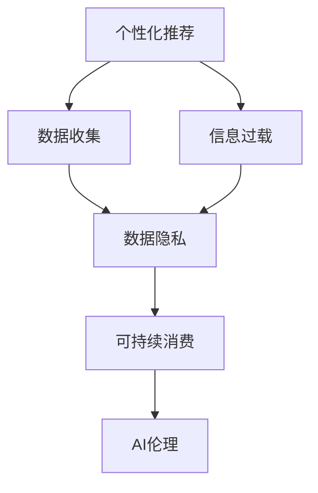

                 

# 欲望的可持续性：AI时代的消费伦理

## 1. 背景介绍

在快速发展的AI时代，人类对技术的依赖日益加深。一方面，AI技术极大地提升了生产效率，满足了人们日益增长的物质和精神需求；另一方面，它也带来了新的伦理问题和消费观念挑战。如何平衡技术发展与伦理道德，引导AI时代的消费走向可持续性，成为一个亟待解决的问题。

### 1.1 问题由来

随着AI技术的深入应用，消费行为也随之发生了显著变化：

1. **个性化定制**：AI技术通过分析消费者行为数据，能够精准推荐个性化商品，满足用户特定需求。但这也可能导致过度消费，如在电商平台上不断购买推荐产品。
2. **信息过载**：AI驱动的推荐算法不断推送新信息，用户容易陷入信息过载，难以做出明智消费决策。
3. **数据隐私**：在个性化推荐过程中，大量用户数据被收集和分析，数据隐私问题凸显。
4. **消费主义**：AI算法可能强化用户追求即时满足和物质积累的消费主义倾向，忽视了可持续发展的价值。

这些问题揭示了AI技术对消费行为的潜在负面影响，引发了关于消费伦理的深刻思考。

## 2. 核心概念与联系

### 2.1 核心概念概述

要深入理解AI时代消费伦理问题，首先需要明确几个核心概念：

1. **可持续消费**：指在满足当前需求的同时，不损害后代满足需求的能力。它强调资源的有效利用和环境保护。
2. **AI伦理**：涉及AI技术的开发、应用、管理等多个方面，确保技术应用符合道德标准，尊重人权，保障公平和透明。
3. **个性化推荐**：利用AI算法分析用户数据，提供定制化产品和服务。
4. **信息过载**：用户面临的信息量超出了其处理能力，导致决策困难。
5. **数据隐私**：在数据收集和分析过程中，确保用户数据的安全和隐私。

这些概念之间存在紧密联系。个性化推荐和信息过载问题涉及数据收集和使用，数据隐私则是数据处理中的核心伦理问题。而消费主义倾向和可持续消费则反映了技术与伦理之间的关系，对数据使用和信息消费行为提出了更高要求。

### 2.2 核心概念原理和架构的 Mermaid 流程图



该流程图展示了从个性化推荐到可持续消费的逻辑路径，反映了数据隐私、AI伦理和可持续消费之间的关系。

## 3. 核心算法原理 & 具体操作步骤

### 3.1 算法原理概述

个性化推荐的核心算法原理主要基于协同过滤和深度学习。协同过滤利用用户历史行为数据进行相似性计算，推荐相似用户喜欢的商品。深度学习模型如神经网络，则通过分析用户特征和商品属性，学习用户与商品的潜在关联，预测用户对商品的可能偏好。

信息过载问题则源于推荐算法中“推荐引擎的饥饿算法”，即不断推送新商品和信息，使用户面临过载。信息过载导致用户注意力分散，影响其决策能力。

### 3.2 算法步骤详解

#### 个性化推荐

1. **数据收集**：收集用户浏览、购买、评分等历史行为数据。
2. **用户画像建模**：使用协同过滤或深度学习模型，构建用户画像，描述用户的兴趣和偏好。
3. **商品画像建模**：构建商品特征向量，描述商品的属性和特点。
4. **相似性计算**：计算用户与商品之间的相似性得分，找出用户可能感兴趣的商品。
5. **推荐列表生成**：根据相似性得分，生成个性化的商品推荐列表。

#### 信息过载缓解

1. **模型集成**：使用多种推荐算法，如基于内容的推荐、基于协同过滤的推荐和基于深度学习的推荐，减少单一算法的过载风险。
2. **多样性增强**：在推荐列表中增加不同类别和属性的商品，以避免同质化。
3. **用户反馈收集**：收集用户对推荐结果的反馈，调整推荐策略，提高推荐准确性。
4. **知识注入**：利用领域知识，如季节性、节日等，指导推荐决策。

### 3.3 算法优缺点

#### 个性化推荐

**优点**：
1. 提高用户体验：个性化推荐能够根据用户历史行为提供更符合需求的商品。
2. 增加销量：通过精准推荐，有效提升商品的曝光率和销售量。
3. 数据分析：推荐算法能够收集大量用户行为数据，为进一步分析和挖掘用户需求提供支持。

**缺点**：
1. 数据隐私问题：用户历史数据被收集和分析，存在隐私泄露风险。
2. 过度消费：个性化推荐可能导致用户不断购买推荐商品，引发过度消费。
3. 选择偏差：个性化推荐算法可能根据历史行为强化用户偏好，限制用户尝试新商品的可能性。

#### 信息过载缓解

**优点**：
1. 提高决策质量：减少信息过载，帮助用户更清晰地进行消费决策。
2. 提升用户满意度：用户更可能对推荐结果感到满意，增加用户粘性。
3. 防止过度消费：降低信息过载带来的即时满足感，减少过度消费倾向。

**缺点**：
1. 算法复杂性增加：需要集成多种推荐算法，增加算法复杂度和计算负担。
2. 推荐多样性降低：为了缓解过载，推荐结果可能变得更为集中，减少多样性。
3. 反馈循环影响：用户反馈可能导致算法不断调整，可能导致推荐策略的波动和不稳定性。

### 3.4 算法应用领域

个性化推荐和信息过载缓解算法广泛应用于电商、社交媒体、视频平台等场景，推动了消费行为的深刻变革。

1. **电商**：如淘宝、亚马逊等电商平台，利用推荐算法向用户展示个性化商品，提升用户体验和销售转化率。
2. **社交媒体**：如微信、抖音等平台，通过算法推荐相关内容，增加用户粘性和互动性。
3. **视频平台**：如Netflix、YouTube等，推荐用户可能感兴趣的视频内容，提升用户满意度和留存率。

## 4. 数学模型和公式 & 详细讲解 & 举例说明

### 4.1 数学模型构建

为了构建个性化推荐模型，我们通常使用矩阵分解和深度学习模型，如矩阵分解模型和协同过滤模型。

设用户集合为 $U$，商品集合为 $I$，用户对商品的评分矩阵为 $R_{U \times I}$。推荐模型 $P$ 输入用户特征 $u$ 和商品特征 $i$，输出用户对商品 $i$ 的预测评分 $\hat{r}_{ui}$。

推荐模型的目标是最小化预测评分与实际评分之间的差异，即：

$$
\min_{P} \sum_{ui \in R} (r_{ui} - \hat{r}_{ui})^2
$$

### 4.2 公式推导过程

以矩阵分解模型为例，我们采用奇异值分解（SVD）方法，将用户-商品评分矩阵 $R$ 分解为三个矩阵 $U$、$V$ 和 $W$，其中 $R = UVW^T$。

$U$ 和 $W$ 分别表示用户和商品的潜在特征，$V$ 表示评分权重。通过最大化 $UVW^T$ 和 $R$ 的拟合程度，得到推荐模型：

$$
\hat{r}_{ui} = u_u^T v_i w_i^T
$$

其中 $u_u$ 和 $w_i$ 分别表示用户 $u$ 和商品 $i$ 的潜在特征向量，$v_i$ 表示评分权重。

### 4.3 案例分析与讲解

**案例**：电商平台推荐系统

**分析**：用户历史行为数据 $R$ 通过奇异值分解分解为 $U$、$V$ 和 $W$。模型通过训练学习用户和商品的潜在特征，预测用户对商品的评分 $\hat{r}_{ui}$，生成推荐列表。用户对推荐商品评分后，模型根据评分更新用户和商品特征，进一步优化推荐结果。

## 5. 项目实践：代码实例和详细解释说明

### 5.1 开发环境搭建

为了构建和测试推荐系统，我们需要以下环境：

1. Python 3.8 及以上版本
2. 安装 NumPy、Pandas、Scikit-Learn、SciPy 等数据处理和科学计算库
3. 安装 TensorFlow 或 PyTorch 等深度学习框架
4. 安装推荐算法相关的库，如 Surprise、LightFM 等

### 5.2 源代码详细实现

以下是一个简单的推荐系统实现，使用矩阵分解模型进行推荐：

```python
import numpy as np
from surprise import SVD
from surprise import Dataset
from surprise import Reader

# 读取用户行为数据
reader = Reader(line_format='user item rating', sep=',', rating_scale=(1, 5))
data = Dataset.load_from_file('data.csv', reader=reader)

# 构建用户-商品评分矩阵
R = np.array([data.raw_ratings[uid, iid] for uid, iid, r in data.ratings])

# 训练矩阵分解模型
algo = SVD()
algo.fit(R)

# 生成推荐结果
user_id = 12345
item_id = 67890
rating = algo.predict(user_id, item_id).est

print(f"推荐结果：{rating:.2f}")
```

**解释**：
1. 使用 Surprise 库加载用户行为数据，构建用户-商品评分矩阵 $R$。
2. 使用 SVD 算法训练模型，并预测用户对商品的评分。
3. 输出推荐结果。

### 5.3 代码解读与分析

上述代码实现了基于矩阵分解的推荐算法，核心在于构建用户-商品评分矩阵 $R$，并使用 SVD 算法训练模型。代码简洁明了，易于理解和实现。

## 6. 实际应用场景

### 6.1 电商推荐

电商平台利用推荐系统为用户提供个性化商品推荐，提升用户体验和销售转化率。通过分析用户浏览和购买历史，推荐系统能够识别用户兴趣，推荐符合需求的商品，同时减少信息过载。

### 6.2 内容推荐

社交媒体和视频平台通过推荐算法向用户展示相关内容，增加用户粘性和互动性。例如，抖音通过算法推荐用户可能感兴趣的视频，增加用户观看时间和互动率。

### 6.3 智能家居

智能家居系统利用推荐算法为用户推荐合适的产品和服务，提升用户生活质量。例如，通过分析用户的生活习惯和偏好，推荐合适的智能设备和服务。

### 6.4 未来应用展望

未来，随着AI技术的不断进步，推荐系统将更加智能和个性化。以下是一些可能的应用前景：

1. **跨域推荐**：结合不同数据源，进行跨域推荐，提升推荐效果。
2. **实时推荐**：利用实时数据进行动态推荐，增强用户体验。
3. **个性化内容创作**：结合自然语言处理技术，生成个性化内容，满足用户多样化需求。
4. **多模态推荐**：结合图像、视频等多模态数据，提升推荐效果。

## 7. 工具和资源推荐

### 7.1 学习资源推荐

为了深入理解AI时代的消费伦理，推荐以下学习资源：

1. **《AI伦理与隐私保护》**：深入讲解AI技术的伦理和隐私问题，提供实际案例和解决方案。
2. **《可持续消费与未来城市》**：探讨AI时代可持续消费的挑战与机遇，提供相关政策和实践指南。
3. **《推荐系统理论与实践》**：全面介绍推荐系统的理论基础和实践技巧，涵盖算法、数据处理、评估等方面。
4. **《个性化推荐技术与应用》**：详细讲解个性化推荐算法的原理和实现方法，提供代码示例和应用案例。
5. **《大数据与智能决策》**：分析大数据在智能决策中的作用，探讨数据隐私和伦理问题。

### 7.2 开发工具推荐

为了高效构建推荐系统，推荐以下开发工具：

1. **TensorFlow**：开源深度学习框架，适合构建复杂的推荐模型。
2. **PyTorch**：灵活的深度学习框架，易于实验和调整。
3. **Scikit-Learn**：用于数据处理和模型评估的工具库。
4. **Surprise**：推荐系统算法库，提供多种算法实现和评估方法。
5. **LightFM**：基于TensorFlow的推荐系统库，支持深度学习和协同过滤。

### 7.3 相关论文推荐

为了进一步了解AI时代的消费伦理，推荐以下相关论文：

1. **《推荐系统中的用户隐私保护》**：探讨推荐系统中的数据隐私问题，提出隐私保护策略。
2. **《个性化推荐系统中的过载缓解》**：分析推荐系统中的信息过载问题，提出缓解策略。
3. **《基于深度学习的个性化推荐》**：介绍深度学习在推荐系统中的应用，提出改进算法。
4. **《智能推荐系统中的伦理与公平性》**：分析推荐系统中的伦理问题，提出公平性设计和评估方法。
5. **《AI伦理与可持续发展》**：探讨AI技术在可持续发展中的作用，提出伦理和环境友好设计。

## 8. 总结：未来发展趋势与挑战

### 8.1 研究成果总结

AI时代的消费伦理研究取得了诸多进展，主要集中在以下几个方面：

1. **推荐算法优化**：通过改进推荐算法，提升推荐效果，减少信息过载。
2. **数据隐私保护**：采用匿名化和加密等技术，保护用户隐私。
3. **公平性和伦理设计**：设计和评估推荐系统中的公平性和伦理问题，避免歧视和偏见。
4. **跨域数据融合**：结合多源数据，提升推荐效果。
5. **多模态推荐**：结合图像、视频等多模态数据，增强推荐效果。

### 8.2 未来发展趋势

展望未来，AI时代的消费伦理研究将呈现以下几个趋势：

1. **智能化推荐**：推荐系统将更加智能和个性化，提升用户体验和满意度。
2. **多模态融合**：结合多模态数据，提升推荐效果和多样化。
3. **跨域推荐**：结合不同数据源，进行跨域推荐，提升推荐效果。
4. **实时推荐**：利用实时数据进行动态推荐，增强用户体验。
5. **伦理和公平性设计**：在设计推荐系统时，充分考虑伦理和公平性问题，避免歧视和偏见。

### 8.3 面临的挑战

尽管AI时代消费伦理研究取得了诸多进展，但仍面临以下挑战：

1. **数据隐私**：用户数据隐私保护仍然是一个难题，如何在提升推荐效果的同时保护用户隐私，需要进一步研究。
2. **公平性**：推荐系统可能存在歧视和偏见，如何在算法设计中避免这些问题，需要更多研究和实践。
3. **伦理问题**：AI技术的应用可能带来新的伦理问题，如算法黑箱和算法伦理，需要进一步研究和规范。
4. **信息过载**：推荐系统可能加剧信息过载，需要更多算法优化和用户界面设计。
5. **用户体验**：如何在提升推荐效果的同时，提升用户满意度和体验，需要更多研究和实践。

### 8.4 研究展望

未来，AI时代的消费伦理研究需要从以下几个方面进一步深入：

1. **跨领域研究**：结合经济学、心理学、社会学等学科，深入研究AI技术对消费行为的影响。
2. **跨学科合作**：促进计算机科学、心理学、社会学等多学科合作，共同研究AI时代的消费伦理问题。
3. **伦理和公平性设计**：设计和评估推荐系统中的伦理和公平性问题，避免歧视和偏见。
4. **技术创新**：推动推荐算法的技术创新，提升推荐效果和用户体验。
5. **政策引导**：制定相关政策和规范，引导AI技术在消费伦理方面的应用。

## 9. 附录：常见问题与解答

**Q1：如何平衡个性化推荐与用户隐私保护？**

A: 在推荐系统中，保护用户隐私是至关重要的。以下是几种常见的方法：
1. 数据匿名化：对用户数据进行匿名化处理，保护用户隐私。
2. 数据加密：对用户数据进行加密处理，防止数据泄露。
3. 隐私保护算法：使用差分隐私等隐私保护算法，减少对用户数据的依赖。

**Q2：如何缓解推荐系统中的信息过载问题？**

A: 缓解信息过载问题，可以考虑以下方法：
1. 多样性增强：在推荐结果中增加不同类别和属性的商品，避免同质化。
2. 知识注入：利用领域知识，如季节性、节日等，指导推荐决策。
3. 模型集成：使用多种推荐算法，如基于内容的推荐、基于协同过滤的推荐和基于深度学习的推荐，减少单一算法的过载风险。

**Q3：推荐系统中的公平性和伦理问题如何解决？**

A: 推荐系统中的公平性和伦理问题需要从算法设计和应用两方面入手：
1. 算法设计：在算法设计中考虑公平性问题，如避免歧视和偏见，确保推荐结果的公平性。
2. 应用实践：在实际应用中，对推荐结果进行监控和评估，及时发现和修正伦理问题。

**Q4：如何在推荐系统中实现跨域数据融合？**

A: 跨域数据融合可以通过以下步骤实现：
1. 数据预处理：对不同数据源的数据进行预处理，使其具有可比性。
2. 特征工程：设计合适的特征提取方法，融合不同数据源的特征。
3. 模型训练：结合不同数据源的特征，训练推荐模型，提升推荐效果。

**Q5：推荐系统中的实时推荐如何实现？**

A: 实时推荐可以通过以下方法实现：
1. 实时数据采集：实时采集用户行为数据，更新推荐系统。
2. 实时计算：利用流计算技术，实时计算推荐结果。
3. 缓存机制：采用缓存机制，提高推荐效率。

---

作者：禅与计算机程序设计艺术 / Zen and the Art of Computer Programming

