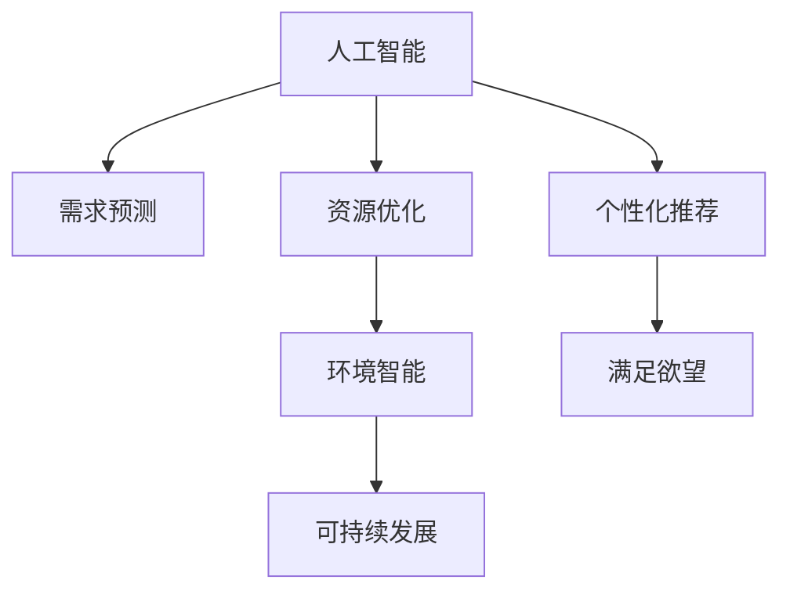

                 

# 欲望的循环经济：AI优化的需求满足

## 1. 背景介绍

### 1.1 问题由来

在数字化时代，人们的欲望被各种数字产品和服务不断激发和满足。但这种满足欲望的方式，往往呈现出一种线性模式：从需求到满足，再产生新的需求，循环往复。然而，这种模式不仅消耗大量资源，还导致了欲望的无限膨胀和生态环境的持续恶化。

如何通过技术手段，优化这种满足欲望的过程，实现资源的循环利用和生态的可持续发展，成为了当下最迫切的问题。人工智能（AI）作为当今最前沿的技术之一，正逐步成为这场变革的重要推动力量。

### 1.2 问题核心关键点

AI通过自我学习和优化，能够有效识别和预测用户的欲望，并根据环境和资源状况动态调整满足策略。这种智能化、自适应化的需求满足方式，有望彻底改变人类满足欲望的模式，实现更加高效、可持续的发展。

关键点包括：
- AI在需求预测、推荐算法、用户行为分析等方面的应用。
- 如何通过数据驱动，优化资源分配，实现循环经济。
- 在环境保护、节能减排、公共服务等方面，AI如何帮助人类实现可持续发展。

## 2. 核心概念与联系

### 2.1 核心概念概述

为了更好地理解AI在优化需求满足过程中的作用，本节将介绍几个关键概念：

- **人工智能（AI）**：利用计算机模拟人类智能行为，包括学习、推理、感知、决策等能力的广义技术。
- **需求预测**：通过机器学习算法，对用户需求进行预测，包括短期和长期需求。
- **个性化推荐**：基于用户历史行为和兴趣，提供定制化推荐，满足个体化需求。
- **资源优化**：通过AI算法，动态调整资源分配策略，实现高效利用和循环利用。
- **环境智能（EI）**：AI在环境保护、资源管理和生态修复等方面的应用。
- **可持续发展（SD）**：在经济、社会、环境三方面协同发展，实现长远的可持续发展。

这些概念之间的逻辑关系可以通过以下Mermaid流程图来展示：



这个流程图展示了一个基本的AI需求满足过程，即通过需求预测和个性化推荐，结合资源优化和环境智能，最终实现可持续发展的需求满足。

## 3. 核心算法原理 & 具体操作步骤
### 3.1 算法原理概述

AI通过数据驱动，结合优化算法和模型训练，能够高效地预测和满足用户需求。其核心算法原理如下：

- **需求预测算法**：利用历史数据和用户行为，通过机器学习模型预测用户未来的需求。常见的算法包括回归分析、时间序列预测、协同过滤等。
- **个性化推荐算法**：通过用户画像和行为特征，推荐最符合用户需求的物品或服务。常见的算法包括协同过滤、矩阵分解、深度学习等。
- **资源优化算法**：动态调整资源分配策略，最大化资源利用效率，减少浪费。常见的算法包括线性规划、动态编程、强化学习等。
- **环境智能算法**：结合AI技术和实时监测，优化环境资源管理，实现可持续发展。常见的算法包括基于规则的决策、自适应学习等。

这些算法通过数据驱动，不断迭代优化，实现高效、智能的需求满足过程。

### 3.2 算法步骤详解

以下是一般的AI需求满足算法步骤：

**Step 1: 数据收集与预处理**

- 收集历史用户数据，包括行为、交易、反馈等信息。
- 对数据进行清洗、去噪、标准化处理，构建特征向量。

**Step 2: 模型训练与优化**

- 选择适当的机器学习模型，如线性回归、深度神经网络等。
- 使用历史数据进行模型训练，调整参数，优化损失函数。
- 通过交叉验证等技术，评估模型性能，防止过拟合。

**Step 3: 需求预测与推荐**

- 输入新用户数据，使用训练好的模型进行需求预测。
- 结合个性化推荐算法，输出最符合用户需求的物品或服务。
- 定期更新模型，确保预测和推荐的准确性。

**Step 4: 资源优化与环境智能**

- 根据需求预测和推荐结果，动态调整资源分配策略。
- 结合实时监测和反馈信息，优化资源利用效率。
- 利用AI技术，对环境资源进行智能管理，实现可持续发展。

**Step 5: 需求满足与反馈循环**

- 将推荐结果呈现给用户，满足其需求。
- 收集用户反馈信息，用于下一步模型训练和优化。
- 不断迭代，实现需求满足的循环优化。

### 3.3 算法优缺点

AI在优化需求满足过程中，具有以下优点：
- **高效准确**：通过数据驱动和模型优化，实现高精度需求预测和个性化推荐。
- **动态适应**：能够根据环境变化和资源状况，动态调整满足策略，实现资源优化。
- **持续学习**：通过用户反馈和数据更新，不断迭代优化，提高模型性能。

同时，该算法也存在一些缺点：
- **数据依赖**：依赖大量历史数据，数据质量和完整性直接影响算法效果。
- **算法复杂**：涉及多种算法和模型，实现复杂，需要专业技术人员。
- **模型解释性**：部分AI模型（如深度学习）存在"黑盒"问题，难以解释内部机制。
- **伦理风险**：数据隐私、算法偏见等问题，可能引发伦理风险。

尽管存在这些局限性，但AI在优化需求满足过程中，依然展现出巨大的潜力和前景。

### 3.4 算法应用领域

AI在需求满足方面的应用，已经广泛应用于多个领域：

- **电子商务**：通过需求预测和个性化推荐，优化商品库存和销售策略。
- **金融服务**：利用需求预测和资源优化，实现风险控制和客户满意度提升。
- **医疗健康**：结合个性化推荐和环境智能，优化医疗资源分配，提高服务质量。
- **智能交通**：通过需求预测和资源优化，优化交通流量，减少拥堵。
- **能源管理**：利用需求预测和资源优化，实现能源高效利用和环境保护。

这些应用领域展示了AI在优化需求满足过程中的广泛应用和巨大潜力。

## 4. 数学模型和公式 & 详细讲解 & 举例说明
### 4.1 数学模型构建

为了更严格地描述AI需求满足的数学模型，本节将详细介绍模型的构建过程。

假设用户需求 $D$ 可以用 $d$ 个特征 $X$ 表示，模型 $M$ 通过训练数据 $T=\{(x_i,y_i)\}_{i=1}^N$ 学习到输入 $x$ 和输出 $y$ 之间的关系。模型训练的目标是：

$$
\theta^* = \mathop{\arg\min}_{\theta} \sum_{i=1}^N \ell(y_i,M(x_i))
$$

其中 $\ell$ 为损失函数，通常为均方误差、交叉熵等。

### 4.2 公式推导过程

以线性回归模型为例，其预测函数为：

$$
f(x;\theta) = \theta_0 + \theta_1 x_1 + \cdots + \theta_d x_d
$$

通过训练数据，求得最优参数 $\theta$ 为：

$$
\theta^* = \mathop{\arg\min}_{\theta} \sum_{i=1}^N (y_i - f(x_i;\theta))^2
$$

利用矩阵运算，可以简化为：

$$
\theta^* = (X^TX)^{-1}X^Ty
$$

其中 $X$ 为特征矩阵，$y$ 为标签向量。

在实际应用中，还需要考虑模型的泛化能力，通过正则化等技术防止过拟合。例如，L2正则化约束为：

$$
\min_{\theta} \frac{1}{2}||y-M(X) ||^2 + \frac{\lambda}{2}||\theta||^2
$$

其中 $\lambda$ 为正则化系数。

### 4.3 案例分析与讲解

以电子商务平台的需求预测为例，假设平台销售商品 $p$，用户 $u$ 的购买需求 $D$ 可以用特征 $X=\{x_1,x_2,\cdots,x_d\}$ 表示，如用户历史购买记录、浏览记录、评分等。

通过训练好的线性回归模型，可以预测用户 $u$ 在时间 $t$ 的购买需求 $D$：

$$
D(u,t;M) = M(x_u,t)
$$

其中 $x_u$ 为用户 $u$ 的特征向量，$t$ 为时间戳。

## 5. 项目实践：代码实例和详细解释说明
### 5.1 开发环境搭建

在进行AI需求满足项目实践前，我们需要准备好开发环境。以下是使用Python进行TensorFlow开发的环境配置流程：

1. 安装Anaconda：从官网下载并安装Anaconda，用于创建独立的Python环境。

2. 创建并激活虚拟环境：
```bash
conda create -n tf-env python=3.8 
conda activate tf-env
```

3. 安装TensorFlow：根据CUDA版本，从官网获取对应的安装命令。例如：
```bash
conda install tensorflow -c pytorch -c conda-forge
```

4. 安装Keras和TensorBoard：
```bash
conda install keras tensorflow-docs
```

5. 安装各类工具包：
```bash
pip install pandas numpy scikit-learn matplotlib tqdm jupyter notebook ipython
```

完成上述步骤后，即可在`tf-env`环境中开始项目实践。

### 5.2 源代码详细实现

下面以电商平台的个性化推荐系统为例，给出使用TensorFlow进行需求预测和个性化推荐的PyTorch代码实现。

首先，定义数据处理函数：

```python
import tensorflow as tf
from tensorflow.keras.datasets import mnist
from tensorflow.keras.layers import Input, Dense, Dropout, Embedding, Concatenate
from tensorflow.keras.models import Model
import numpy as np

def preprocess_data(x, y):
    x = x.reshape(-1, 28*28)
    x = x / 255.0
    y = tf.keras.utils.to_categorical(y)
    return x, y
```

然后，定义模型：

```python
input1 = Input(shape=(784,), name='input1')
dense1 = Dense(128, activation='relu')(input1)
dropout1 = Dropout(0.2)(dense1)

input2 = Input(shape=(10,), name='input2')
embedding = Embedding(input_dim=10, output_dim=128, mask_zero=True)(input2)
dropout2 = Dropout(0.2)(embedding)
concat = Concatenate()([dropout1, dropout2])
dense3 = Dense(64, activation='relu')(concat)
dropout3 = Dropout(0.2)(dense3)
output = Dense(10, activation='softmax')(dropout3)

model = Model(inputs=[input1, input2], outputs=output)
model.compile(optimizer='adam', loss='categorical_crossentropy', metrics=['accuracy'])
```

最后，启动训练流程并评估模型：

```python
epochs = 5
batch_size = 32

x_train, y_train = mnist.load_data()
x_test, y_test = mnist.load_data()

x_train, x_test = preprocess_data(x_train, y_train), preprocess_data(x_test, y_test)

history = model.fit([x_train, y_train], y_train, epochs=epochs, batch_size=batch_size, validation_data=([x_test, y_test], y_test), verbose=2)
```

以上是一个简单的需求预测和个性化推荐系统的TensorFlow代码实现。可以看到，TensorFlow和Keras提供了非常方便的高级API，使得模型构建和训练变得简洁高效。

### 5.3 代码解读与分析

让我们再详细解读一下关键代码的实现细节：

**preprocess_data函数**：
- 对输入数据进行预处理，将图像数据展平、归一化，将标签进行one-hot编码。

**定义模型**：
- 使用`Input`层定义输入，`Dense`层定义全连接层，`Dropout`层添加正则化，`Concatenate`层合并两个输入，`Dense`层输出预测结果。
- `Model`层将所有层组成完整的模型，使用`compile`方法配置优化器和损失函数。

**训练模型**：
- 使用`fit`方法训练模型，传入输入和标签，设置迭代轮数、批次大小等参数。
- 在每个epoch结束时，评估模型在验证集上的性能，防止过拟合。

可以看到，TensorFlow和Keras的API设计非常直观，使得模型构建和训练变得简单高效。

当然，在实际应用中，还需要考虑模型的保存和部署、超参数的自动搜索、更灵活的任务适配层等。但核心的需求预测和推荐范式基本与此类似。

## 6. 实际应用场景
### 6.1 智能客服系统

基于AI需求满足的智能客服系统，可以实时响应客户需求，提供个性化服务。通过需求预测和推荐算法，系统能够自动理解客户意图，匹配最合适的解决方案，大幅提升客户体验。

例如，在电商平台，通过需求预测，系统可以提前备货热门商品，减少缺货情况。通过个性化推荐，系统可以精准推送相关产品，增加销售转化率。

### 6.2 金融服务

在金融领域，AI需求满足技术可以优化贷款审批流程，提升客户满意度。通过需求预测，系统可以实时监控用户信用评分变化，动态调整授信策略。通过个性化推荐，系统可以向用户推荐适合的金融产品，提高客户粘性。

例如，在贷款审批过程中，系统通过需求预测，自动评估用户的信用风险，动态调整贷款额度和利率。通过个性化推荐，系统可以根据用户历史数据，推荐最适合的贷款产品，提高审批效率。

### 6.3 智能交通

在智能交通领域，AI需求满足技术可以优化交通流量，减少拥堵。通过需求预测，系统可以实时分析路况信息，预测未来交通状况。通过个性化推荐，系统可以动态调整交通信号灯，优化行车路线，提高道路通行效率。

例如，在城市交通管理中，系统通过需求预测，自动调整信号灯配时，减少交通拥堵。通过个性化推荐，系统可以实时推荐最优行车路线，减少车辆等待时间，提高通行效率。

### 6.4 未来应用展望

随着AI技术的发展，未来需求满足的智能化水平将进一步提升。以下是对未来应用的展望：

1. **智能家居**：通过需求预测和个性化推荐，智能家居可以自动调节室内环境，提供个性化服务。例如，根据用户习惯，自动调节温度、灯光等设备，提升生活舒适度。

2. **智能医疗**：在医疗领域，AI需求满足技术可以优化资源分配，提升诊疗效率。通过需求预测，系统可以实时监控患者流量，动态调整医护人员配置。通过个性化推荐，系统可以根据患者历史数据，推荐最适合的治疗方案，提高诊疗效果。

3. **智能制造**：在智能制造中，AI需求满足技术可以优化生产流程，提高生产效率。通过需求预测，系统可以实时监控生产设备状态，预测故障风险，提前进行维护。通过个性化推荐，系统可以根据生产数据，推荐最优的生产计划，提高生产效率。

4. **智能物流**：在智能物流中，AI需求满足技术可以优化物流配送，提高配送效率。通过需求预测，系统可以实时监控订单信息，动态调整配送路线，减少配送时间。通过个性化推荐，系统可以根据客户历史订单，推荐最优的配送方案，提高配送满意度。

5. **智能城市**：在智能城市中，AI需求满足技术可以优化城市管理，提升城市运行效率。通过需求预测，系统可以实时监控城市运行数据，预测城市运行状况。通过个性化推荐，系统可以动态调整城市管理策略，提高城市运行效率。

## 7. 工具和资源推荐
### 7.1 学习资源推荐

为了帮助开发者系统掌握AI需求满足的理论基础和实践技巧，这里推荐一些优质的学习资源：

1. **TensorFlow官方文档**：提供完整的TensorFlow API文档和示例代码，适合初学者和高级开发者。

2. **《深度学习》书籍**：深度学习领域的经典教材，全面介绍了深度学习模型的构建和训练方法。

3. **Kaggle竞赛平台**：提供大量实际应用场景的Kaggle竞赛，可以通过实践提升AI技能。

4. **Udacity机器学习课程**：提供从入门到高级的机器学习课程，包括需求预测、推荐算法等主题。

5. **Arxiv预印本网站**：提供最新的AI研究论文，了解前沿技术和算法。

通过对这些资源的学习实践，相信你一定能够快速掌握AI需求满足的精髓，并用于解决实际的AI问题。

### 7.2 开发工具推荐

高效的开发离不开优秀的工具支持。以下是几款用于AI需求满足开发的常用工具：

1. **TensorFlow**：基于Python的开源深度学习框架，灵活的计算图，适合快速迭代研究。

2. **PyTorch**：基于Python的开源深度学习框架，动态计算图，适合科学研究。

3. **Scikit-Learn**：Python机器学习库，提供多种算法实现，适合数据预处理和特征工程。

4. **TensorBoard**：TensorFlow配套的可视化工具，可实时监测模型训练状态，提供丰富的图表呈现方式。

5. **Keras**：高层次的深度学习API，简洁易用，适合快速构建和训练模型。

合理利用这些工具，可以显著提升AI需求满足任务的开发效率，加快创新迭代的步伐。

### 7.3 相关论文推荐

AI需求满足技术的发展源于学界的持续研究。以下是几篇奠基性的相关论文，推荐阅读：

1. **《深度学习》书籍**：深度学习领域的经典教材，全面介绍了深度学习模型的构建和训练方法。

2. **《机器学习》书籍**：机器学习领域的经典教材，介绍了各种机器学习算法和模型。

3. **《大规模在线学习系统》论文**：介绍大规模在线学习系统的设计，包括需求预测和推荐算法。

4. **《深度强化学习》论文**：介绍了深度强化学习算法在资源优化中的应用。

5. **《分布式机器学习》论文**：介绍了分布式机器学习算法在智能交通和智能制造中的应用。

这些论文代表了大规模在线学习的需求满足技术的发展脉络。通过学习这些前沿成果，可以帮助研究者把握学科前进方向，激发更多的创新灵感。

## 8. 总结：未来发展趋势与挑战
### 8.1 总结

本文对AI在优化需求满足过程中的作用进行了全面系统的介绍。首先阐述了AI在需求预测、个性化推荐、资源优化等方面的应用，明确了AI在优化需求满足过程中的独特价值。其次，从原理到实践，详细讲解了AI需求满足的数学模型和关键步骤，给出了需求预测和推荐系统的完整代码实现。同时，本文还广泛探讨了AI需求满足技术在智能客服、金融服务、智能交通等多个行业领域的应用前景，展示了AI需求满足技术的巨大潜力。

通过本文的系统梳理，可以看到，AI需求满足技术正在成为AI应用的重要范式，极大地拓展了AI技术的应用边界，催生了更多的落地场景。受益于大规模数据的预训练和模型优化，AI需求满足技术有望实现高效、智能、可持续的需求满足过程。未来，伴随AI技术的发展和普及，相信AI需求满足技术必将在各行各业中发挥重要作用，深刻影响人类的生产生活方式。

### 8.2 未来发展趋势

展望未来，AI需求满足技术将呈现以下几个发展趋势：

1. **智能化水平提升**：随着AI技术的不断发展，未来需求满足的智能化水平将进一步提升。通过深度学习和强化学习，系统可以更好地理解用户需求，动态调整满足策略。

2. **数据驱动优化**：基于大规模数据的分析，系统可以实现更加精准的需求预测和个性化推荐。通过大数据技术，系统可以实时监控和分析用户行为，优化资源分配。

3. **多模态融合**：未来需求满足系统将结合多种数据源和信息源，实现多模态数据的融合。例如，结合图像、语音、文本等多模态数据，提供更加全面的需求分析和服务。

4. **跨领域应用拓展**：AI需求满足技术将拓展到更多领域，如智能家居、智能医疗、智能制造等。通过跨领域融合，实现更加全面的需求满足。

5. **可持续发展**：未来需求满足系统将更加注重环境保护和资源优化。通过智能调度和动态调整，系统可以实现可持续的资源利用。

这些趋势展示了AI需求满足技术的广阔前景。这些方向的探索发展，必将进一步提升需求满足系统的性能和应用范围，为人类认知智能的进化带来深远影响。

### 8.3 面临的挑战

尽管AI需求满足技术已经取得了瞩目成就，但在迈向更加智能化、普适化应用的过程中，它仍面临着诸多挑战：

1. **数据质量问题**：依赖大量高质量的数据，数据缺失、噪声等问题直接影响算法效果。

2. **模型复杂性**：涉及多种算法和模型，实现复杂，需要专业技术人员。

3. **伦理风险**：数据隐私、算法偏见等问题，可能引发伦理风险。

4. **计算资源需求**：大规模模型训练和推理需要大量计算资源，硬件瓶颈亟需突破。

5. **实时性要求**：需求预测和推荐需要实时响应，对系统性能和效率要求高。

尽管存在这些挑战，但随着技术的不断进步和完善，相信AI需求满足技术将在各行各业中发挥越来越重要的作用，成为推动人类生产生活方式变革的重要力量。

### 8.4 研究展望

面对AI需求满足技术面临的挑战，未来的研究需要在以下几个方面寻求新的突破：

1. **数据采集和处理**：采用更加高效的数据采集和处理方法，提高数据质量，减少噪声。

2. **模型简化与优化**：开发更加高效、简单的模型架构，降低计算资源需求。

3. **算法创新**：引入更多创新算法，如强化学习、因果推断等，提升系统性能和鲁棒性。

4. **伦理保障**：制定数据隐私保护和算法公正性标准，保障系统公平性。

5. **跨领域融合**：结合其他AI技术，如知识图谱、自然语言处理等，实现多模态数据的融合和智能协同。

6. **可持续性优化**：结合环境智能技术，优化资源分配，实现可持续发展。

这些研究方向的探索，必将引领AI需求满足技术迈向更高的台阶，为构建高效、智能、可持续的需求满足系统铺平道路。面向未来，AI需求满足技术还需要与其他AI技术进行更深入的融合，多路径协同发力，共同推动自然语言理解和智能交互系统的进步。只有勇于创新、敢于突破，才能不断拓展AI需求满足技术的边界，让智能技术更好地造福人类社会。

## 9. 附录：常见问题与解答
### 9.1 如何评估需求预测模型的效果？

A: 需求预测模型的评估通常采用以下指标：

1. 均方误差（MSE）：评估模型预测值的准确性。MSE越小，模型预测越精确。

2. 均方根误差（RMSE）：均方误差的平方根，更直观地反映预测误差的大小。

3. 平均绝对误差（MAE）：预测误差绝对值的平均，更稳定地反映模型的预测能力。

4. 决定系数（R²）：评估模型对数据的拟合程度，R²越接近1，模型拟合越好。

通过这些指标，可以全面评估模型的性能，并指导模型的优化和改进。

### 9.2 如何缓解需求预测模型的过拟合问题？

A: 过拟合是需求预测模型面临的主要挑战。常见的缓解策略包括：

1. 数据增强：通过数据扩充和增强，增加训练集的多样性，防止模型过拟合。

2. 正则化：通过L1正则、L2正则等技术，限制模型参数的大小，防止过拟合。

3. 早停（Early Stopping）：在验证集性能不再提升时，停止训练，避免模型过拟合。

4. Dropout：随机丢弃部分神经元，防止模型对特定输入的过度拟合。

5. 数据集划分：将数据集划分为训练集、验证集和测试集，通过验证集评估模型性能，指导训练。

这些策略需要根据具体数据和模型进行调整，以获得最佳的效果。

### 9.3 如何提升个性化推荐系统的效果？

A: 个性化推荐系统的效果提升需要综合考虑多个因素：

1. 数据质量：高质量的用户数据是推荐系统成功的基础。需要收集详细、准确的用户行为数据，包括浏览记录、购买记录、评分等。

2. 算法选择：选择合适的推荐算法，如协同过滤、矩阵分解、深度学习等，根据具体情况进行选择。

3. 特征工程：设计合理的特征表示，包括用户画像、商品特征、行为特征等，提升模型的表达能力。

4. 模型优化：通过调参、模型融合等技术，优化模型性能，提高推荐准确率。

5. 实时更新：根据用户反馈和行为数据，实时更新模型，提升推荐效果。

通过综合考虑这些因素，可以显著提升个性化推荐系统的效果，实现更加精准、个性化的推荐服务。

### 9.4 如何应对需求预测和推荐系统的伦理风险？

A: 需求预测和推荐系统的伦理风险主要包括数据隐私和算法偏见。应对措施如下：

1. 数据隐私保护：采用数据匿名化、加密等技术，保护用户隐私。同时，明确告知用户数据使用情况，获得用户同意。

2. 算法公正性：制定公平性标准，监控算法偏见。采用多样性增强、公平性约束等技术，提升算法的公正性。

3. 透明度和可解释性：提高模型的透明度和可解释性，让用户了解模型的决策过程。通过可解释模型，如决策树、规则模型等，提升系统的可信度。

4. 用户控制：赋予用户数据控制权，让用户能够查看、修改、删除自己的数据。通过用户反馈机制，及时发现和纠正算法问题。

通过这些措施，可以有效应对需求预测和推荐系统的伦理风险，保障系统的公平性和可信度。

### 9.5 如何优化资源优化系统的性能？

A: 资源优化系统的性能优化需要从多个方面入手：

1. 算法选择：选择合适的优化算法，如线性规划、动态规划、强化学习等，根据具体情况进行选择。

2. 参数调优：通过调整算法参数，优化模型性能，提高资源分配的准确性。

3. 数据预处理：对数据进行预处理，包括数据清洗、归一化、特征选择等，提高算法的输入质量。

4. 模型融合：通过模型融合技术，结合多种优化算法，提升系统的鲁棒性和稳定性。

5. 实时监测：实时监测系统运行状态，及时发现和解决性能问题。

通过综合考虑这些因素，可以显著提升资源优化系统的性能，实现更加高效、智能的资源分配。

---

作者：禅与计算机程序设计艺术 / Zen and the Art of Computer Programming

