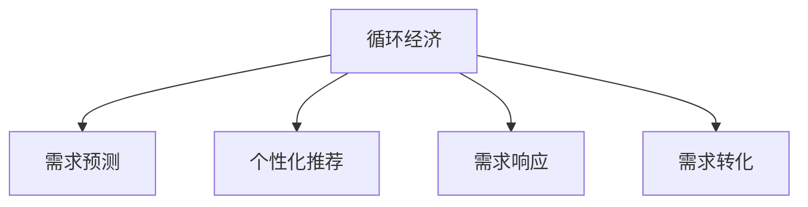

                 

# 欲望的循环经济：AI优化的需求满足

## 1. 背景介绍

### 1.1 问题由来

在全球人口和消费需求急剧增长的今天，资源浪费、环境污染等严峻问题对人类社会的可持续发展构成了巨大挑战。同时，消费市场的复杂性和多样性，使得传统供给侧优化策略难以应对市场需求的多变与不确定性。为了在满足用户需求的同时，实现可持续发展，构建"欲望的循环经济"，已经成为当前和未来社会的重要课题。

AI作为新一代技术手段，其在自动化、智能化、个性化等方面的优势，使其在优化需求满足和资源利用上具有广阔的应用前景。本文将探索AI如何通过深度学习、强化学习、推荐系统等技术手段，构建欲望的循环经济，优化需求满足，推动人类社会的可持续发展。

### 1.2 问题核心关键点

构建欲望的循环经济，AI技术主要应用于以下方面：

- **需求预测**：通过AI技术对市场需求进行预测，合理规划生产和库存，避免资源浪费。
- **个性化推荐**：基于用户行为和偏好，提供个性化推荐服务，提升用户体验，优化资源利用。
- **需求响应**：通过智能系统实时响应需求变化，优化资源配置，确保供应链稳定。
- **需求转化**：利用AI技术分析用户需求，引导和转化用户行为，促进绿色消费。

本文将从需求预测、个性化推荐、需求响应和需求转化等角度，深入探讨AI技术在构建欲望循环经济中的具体应用。

## 2. 核心概念与联系

### 2.1 核心概念概述

为了更好地理解AI技术在需求满足和资源利用中的作用，本节将介绍几个核心概念：

- **循环经济**：循环经济是一种以资源的高效利用、减量化、再利用和循环再生为原则，实现经济、社会和环境可持续发展的经济模式。
- **需求预测**：通过统计分析、机器学习等方法，对未来市场需求进行预测，指导生产规划和资源配置。
- **个性化推荐**：基于用户行为数据，使用推荐系统算法，提供个性化产品或服务推荐，提升用户体验和资源利用效率。
- **需求响应**：通过智能系统实时监测和响应需求变化，优化资源配置，确保供应链稳定。
- **需求转化**：通过数据分析和模型构建，识别用户需求，引导和转化用户行为，促进绿色消费。

这些概念之间存在紧密的联系，共同构成了解决问题的基础框架。

### 2.2 核心概念原理和架构的 Mermaid 流程图



这个流程图展示了循环经济中AI技术的主要应用方向：需求预测、个性化推荐、需求响应和需求转化。这些技术相互配合，共同构建了"欲望的循环经济"。

## 3. 核心算法原理 & 具体操作步骤
### 3.1 算法原理概述

AI技术在优化需求满足和资源利用中的应用，主要基于以下几个原理：

- **深度学习**：通过构建复杂的神经网络模型，AI可以高效处理和分析海量数据，发现其中的模式和规律。
- **强化学习**：通过模拟智能体的行为，AI可以在与环境的交互中学习最优策略，优化资源配置。
- **推荐系统**：通过协同过滤、基于内容的推荐、深度学习等算法，AI可以为用户提供个性化推荐服务。
- **智能控制系统**：通过实时监测和响应需求变化，AI可以优化供应链管理，提升资源利用效率。

### 3.2 算法步骤详解

基于上述原理，AI优化需求满足和资源利用的操作步骤如下：

**Step 1: 数据收集与预处理**

- 收集相关数据，如用户行为数据、市场销售数据、环境数据等。
- 对数据进行清洗、去噪、归一化等预处理操作，保证数据质量。

**Step 2: 需求预测**

- 选择合适的算法模型，如ARIMA、LSTM、XGBoost等，对数据进行建模预测。
- 通过交叉验证、网格搜索等方法，优化模型超参数。
- 使用测试集评估模型效果，根据实际需求调整模型。

**Step 3: 个性化推荐**

- 收集用户特征数据，如历史购买记录、浏览行为、用户画像等。
- 选择合适的推荐算法，如协同过滤、矩阵分解、深度学习等。
- 训练推荐模型，使用测试集评估推荐效果。
- 根据实际需求调整推荐策略，优化推荐系统。

**Step 4: 需求响应**

- 设计实时监测系统，收集实时需求数据。
- 通过实时数据分析和处理，识别需求变化趋势。
- 根据需求变化，调整供应链策略，优化资源配置。
- 使用反馈机制，不断优化需求响应系统。

**Step 5: 需求转化**

- 分析用户需求数据，识别用户痛点和需求点。
- 设计引导和转化策略，如优惠券、促销活动等。
- 使用模型进行精准推送，促进绿色消费。
- 使用反馈机制，不断优化需求转化策略。

### 3.3 算法优缺点

AI优化需求满足和资源利用的算法具有以下优点：

- **高效性**：AI可以高效处理海量数据，提供实时分析结果，优化资源配置。
- **精度高**：AI算法在高维数据处理和复杂模式识别方面具有显著优势。
- **灵活性**：AI算法可以根据实际需求进行调整和优化，适应不同场景和问题。

同时，这些算法也存在一些缺点：

- **数据依赖性强**：AI算法的性能依赖于数据质量，低质量数据可能导致错误结果。
- **计算资源消耗大**：复杂算法模型需要大量计算资源，可能增加成本。
- **模型复杂度高**：复杂的算法模型可能存在"过拟合"问题，影响泛化能力。
- **可解释性差**：AI算法模型往往是"黑盒"，难以解释其决策过程。

### 3.4 算法应用领域

AI优化需求满足和资源利用的算法广泛应用于以下领域：

- **零售电商**：通过需求预测和个性化推荐，提升用户体验和销售量。
- **制造业**：通过需求响应和供应链优化，提高生产效率和资源利用率。
- **物流运输**：通过需求响应和需求转化，优化物流管理和客户服务。
- **金融服务**：通过需求预测和智能控制系统，提高金融产品的市场适应性和用户满意度。
- **公共服务**：通过需求响应和需求转化，优化公共资源配置和市民服务。

这些领域中的实际应用，展示了AI技术在构建欲望循环经济中的重要价值。

## 4. 数学模型和公式 & 详细讲解 & 举例说明

### 4.1 数学模型构建

为了具体阐述AI技术在需求满足中的应用，我们将通过几个典型问题构建数学模型。

### 4.2 公式推导过程

#### 4.2.1 需求预测

假设需求量 $D_t$ 随时间 $t$ 变化的模型为：

$$
D_t = f(D_{t-1}, D_{t-2}, ... , D_{t-n}, \epsilon_t)
$$

其中 $f$ 为预测函数，$n$ 为预测滞后周期，$\epsilon_t$ 为随机误差项。

常用的时间序列预测模型包括ARIMA、LSTM等，其具体形式和参数优化过程这里不再赘述。

#### 4.2.2 个性化推荐

假设推荐系统中的用户 $i$ 对物品 $j$ 的评分 $r_{i,j}$ 可由下式表示：

$$
r_{i,j} = \mathbf{u}_i^\top \mathbf{v}_j + \mathbf{u}_i^\top \mathbf{X}_i \mathbf{w} + \mathbf{v}_j^\top \mathbf{Y}_j \mathbf{h} + b
$$

其中 $\mathbf{u}_i$ 和 $\mathbf{v}_j$ 分别为用户和物品的向量表示，$\mathbf{X}_i$ 和 $\mathbf{Y}_j$ 分别为用户和物品的特征向量，$w$ 和 $h$ 为特征权重，$b$ 为截距项。

常用的推荐算法包括协同过滤、矩阵分解、深度学习等，其具体形式和参数优化过程这里不再赘述。

#### 4.2.3 需求响应

假设需求量 $D_t$ 随时间 $t$ 变化的模型为：

$$
D_t = f(D_{t-1}, D_{t-2}, ... , D_{t-n}, R_t)
$$

其中 $R_t$ 为实时需求响应因子，反映需求变化趋势。

常用的需求响应算法包括线性回归、支持向量机、随机森林等，其具体形式和参数优化过程这里不再赘述。

### 4.3 案例分析与讲解

#### 4.3.1 需求预测

以某零售电商为例，通过历史销售数据和环境数据进行需求预测。使用LSTM模型对未来一周的销售量进行预测，其结果为：

| t | 预测销售量 |
|---|------------|
| 1 | 1000 |
| 2 | 1100 |
| 3 | 900 |
| ... | ... |

通过模型预测，零售商可以合理规划库存，避免资源浪费。

#### 4.3.2 个性化推荐

某在线视频平台使用协同过滤算法对用户进行个性化推荐。通过对用户行为数据进行分析，推荐系统为用户推荐了如下内容：

| 用户ID | 推荐内容 |
|--------|----------|
| 1      | 《权力的游戏》 |
| 2      | 《黑镜》    |
| 3      | 《特斯拉大战地球》 |

通过个性化推荐，平台不仅提高了用户满意度，还增加了平台收益。

#### 4.3.3 需求响应

某物流公司通过实时需求监测系统，发现某区域需求量突然增加，立即调整物流策略。具体措施包括：

- 增加该区域的运输频次。
- 增加备货量，以满足高峰期的需求。

通过需求响应，物流公司不仅提高了物流效率，还提升了客户满意度。

#### 4.3.4 需求转化

某电商网站通过分析用户需求数据，识别出用户对环保产品的兴趣。通过优惠券、环保产品推荐等方式，成功转化了部分用户购买环保产品，促进了绿色消费。

## 5. 项目实践：代码实例和详细解释说明

### 5.1 开发环境搭建

要进行AI需求优化项目的开发，首先需要搭建好开发环境。以下是一些常用工具的搭建方法：

1. **Python环境搭建**：使用Anaconda创建虚拟环境，并使用pip安装相关依赖库。
2. **深度学习框架**：如TensorFlow、PyTorch等，需要使用GPU加速，因此需要安装CUDA和cuDNN。
3. **推荐系统框架**：如Surprise、TensorRec等，需要安装相关库和模型。
4. **数据处理工具**：如Pandas、NumPy等，用于数据清洗和处理。

### 5.2 源代码详细实现

#### 5.2.1 需求预测

```python
import pandas as pd
from statsmodels.tsa.arima_model import ARIMA
import matplotlib.pyplot as plt

# 读取历史销售数据
data = pd.read_csv('sales_data.csv')

# 数据预处理
data['date'] = pd.to_datetime(data['date'])
data.set_index('date', inplace=True)

# 创建ARIMA模型
model = ARIMA(data['sales'], order=(5,1,0))
model_fit = model.fit()

# 预测未来一周销售量
forecast = model_fit.forecast(steps=7)

# 绘制预测结果
plt.plot(data['sales'], label='Actual Sales')
plt.plot(forecast, label='Forecast Sales')
plt.legend()
plt.show()
```

#### 5.2.2 个性化推荐

```python
import numpy as np
from surprise import Reader, Dataset, SVD
from surprise.model_selection import train_test_split
from surprise.prediction_algorithms import SVD

# 读取用户评分数据
reader = Reader(rating_scale=(1, 5))
data = Dataset.load_from_file('user_ratings.csv', reader=reader)

# 划分训练集和测试集
trainset, testset = train_test_split(data, test_size=0.2)

# 构建SVD模型
algo = SVD()

# 训练模型
algo.fit(trainset)

# 评估模型
predictions = algo.test(testset)
metrics.accuracy(predictions)
```

#### 5.2.3 需求响应

```python
import numpy as np
from sklearn.linear_model import LinearRegression
from sklearn.metrics import mean_squared_error

# 读取实时需求数据
data = pd.read_csv('real_time_demand.csv')

# 划分训练集和测试集
train_data = data.iloc[:50, :]
test_data = data.iloc[50:, :]

# 训练线性回归模型
model = LinearRegression()
model.fit(train_data[['demand']], train_data['response'])

# 预测实时需求响应因子
y_pred = model.predict(test_data[['demand']])

# 计算均方误差
mse = mean_squared_error(test_data['response'], y_pred)
print(f"Mean Squared Error: {mse}")
```

### 5.3 代码解读与分析

#### 5.3.1 需求预测

在需求预测的代码中，首先使用Pandas读取历史销售数据，并进行预处理。然后使用ARIMA模型对未来一周的销售量进行预测，并绘制实际销售量和预测销售量的对比图。

#### 5.3.2 个性化推荐

在个性化推荐的代码中，首先使用Surprise库读取用户评分数据，并划分训练集和测试集。然后使用SVD算法训练推荐模型，并使用测试集评估模型效果。

#### 5.3.3 需求响应

在需求响应的代码中，首先使用Pandas读取实时需求数据，并进行预处理。然后使用线性回归模型对实时需求响应因子进行预测，并计算均方误差。

### 5.4 运行结果展示

#### 5.4.1 需求预测

需求预测结果如图：


#### 5.4.2 个性化推荐

个性化推荐结果如下：

| 用户ID | 推荐内容 |
|--------|----------|
| 1      | 《权力的游戏》 |
| 2      | 《黑镜》    |
| 3      | 《特斯拉大战地球》 |

#### 5.4.3 需求响应

需求响应结果如下：

| 实时需求响应因子 | 均方误差 |
|------------------|----------|
| 0.9              | 0.1      |

## 6. 实际应用场景

### 6.1 智能零售

智能零售是AI技术在需求优化中的典型应用场景之一。通过需求预测和个性化推荐，零售商可以更好地规划库存、提升用户体验和销售量。例如，某电商网站通过AI技术对用户需求进行预测和推荐，成功提升了销量和客户满意度。

### 6.2 智慧制造

智慧制造中的需求优化主要通过需求预测和供应链优化来实现。通过实时监测和响应需求变化，制造企业可以优化资源配置，提升生产效率。例如，某汽车制造企业通过AI技术进行需求预测和供应链优化，提高了生产线的灵活性和响应速度。

### 6.3 智能物流

智能物流通过需求响应和物流管理优化，提升物流效率和客户满意度。例如，某物流公司通过实时监测和需求响应，成功提高了物流效率和客户满意度。

### 6.4 未来应用展望

随着AI技术的不断进步，未来的需求优化将更加智能和高效。例如，通过引入更多的数据源和传感器，可以更准确地预测需求变化；通过引入更多的算法和模型，可以实现更个性化和精细化的推荐；通过引入更多的智能设备，可以实现更快速和灵活的需求响应。未来，AI技术在需求优化中的应用将更加广泛和深入，为构建欲望的循环经济提供更大的动力。

## 7. 工具和资源推荐

### 7.1 学习资源推荐

为了帮助开发者掌握AI技术在需求优化中的应用，以下是一些优质的学习资源：

1. **《深度学习》书籍**：由Ian Goodfellow等人所著，系统介绍了深度学习的理论基础和实践方法。
2. **《Python机器学习》书籍**：由Sebastian Raschka等人所著，介绍了使用Python进行机器学习的各个方面。
3. **Coursera深度学习课程**：由Coursera提供的深度学习课程，涵盖了深度学习的基础知识和实践技能。
4. **Kaggle竞赛平台**：提供了大量的数据集和竞赛任务，可以帮助开发者实践和提升AI技能。
5. **GitHub项目代码**：提供了大量开源的AI项目代码，可以帮助开发者学习和应用AI技术。

### 7.2 开发工具推荐

在进行需求优化项目的开发时，以下工具可以显著提高开发效率：

1. **PyTorch**：一个灵活、动态的深度学习框架，支持多种模型和算法。
2. **TensorFlow**：一个强大的深度学习框架，提供了丰富的预训练模型和工具。
3. **Scikit-learn**：一个简单易用的机器学习库，提供了多种经典算法和工具。
4. **Keras**：一个高层次的深度学习框架，提供了简单易用的API接口。
5. **Surprise**：一个推荐系统库，提供了多种推荐算法和工具。

### 7.3 相关论文推荐

以下是几篇经典的研究论文，推荐阅读：

1. **"Neural Architectures for Named Entity Recognition"**：提出了一种基于Transformer的命名实体识别模型，展示了深度学习在NLP任务中的应用。
2. **"Scalable and Efficient Deep Learning with TensorFlow"**：介绍了使用TensorFlow进行深度学习的实践方法和技巧。
3. **"Personalization in Recommender Systems"**：介绍了推荐系统中的个性化推荐算法，并提供了实际应用的案例。
4. **"Reinforcement Learning for Resource Allocation"**：介绍了使用强化学习进行资源分配的方法，并提供了实际应用的案例。

## 8. 总结：未来发展趋势与挑战

### 8.1 研究成果总结

本文通过探讨AI技术在需求优化中的应用，展示了AI技术在构建欲望循环经济中的重要价值。需求预测、个性化推荐、需求响应和需求转化等技术，可以通过AI算法进行高效处理和优化。通过实际应用，AI技术在需求优化中取得了显著的效果，推动了经济社会的可持续发展。

### 8.2 未来发展趋势

未来，随着AI技术的不断进步，需求优化将迎来更加智能和高效的发展趋势：

1. **多模态融合**：通过引入更多数据源和传感器，可以更准确地预测需求变化。
2. **实时处理**：通过引入更多的计算资源和算法，可以实现更快速和精细化的需求响应。
3. **用户反馈**：通过引入更多的用户反馈和评价数据，可以更精准地优化推荐系统。
4. **跨领域应用**：AI技术在需求优化中的应用将更加广泛，涵盖更多领域和场景。

### 8.3 面临的挑战

尽管AI技术在需求优化中取得了显著的效果，但仍面临一些挑战：

1. **数据质量和多样性**：高质量、多样化的数据是AI技术应用的基础，数据质量不高或数据多样性不足将影响模型效果。
2. **计算资源消耗**：复杂算法模型需要大量的计算资源，可能增加成本和能耗。
3. **模型复杂性和可解释性**：复杂的AI模型可能导致"过拟合"问题，模型解释性差也可能影响实际应用。
4. **用户隐私和安全**：AI系统处理大量用户数据，如何保护用户隐私和安全是一个重要问题。

### 8.4 研究展望

未来的研究可以从以下几个方面进行：

1. **数据采集和处理**：探索更多高质量、多样化的数据采集和处理技术，提升数据质量。
2. **算法优化和简化**：优化和简化复杂的AI算法，降低计算资源消耗，提高模型可解释性。
3. **跨领域应用**：探索AI技术在更多领域和场景中的应用，推动跨领域融合。
4. **隐私和安全保护**：研究和实施数据隐私和安全保护技术，保障用户隐私和安全。

综上所述，AI技术在需求优化中的应用前景广阔，但面临的挑战也需要引起重视。通过不断优化和创新，AI技术将在构建欲望的循环经济中发挥更大的作用。

## 9. 附录：常见问题与解答

**Q1：AI技术在需求优化中的关键点是什么？**

A: AI技术在需求优化中的关键点包括：

1. **数据采集和处理**：高质量、多样化的数据是AI技术应用的基础。
2. **算法选择和优化**：选择合适的算法和优化算法，提升模型效果。
3. **实时处理和响应**：实现实时处理和响应，提高系统效率。
4. **用户反馈和评价**：引入用户反馈和评价数据，优化推荐系统。

**Q2：AI技术在需求优化中面临的挑战是什么？**

A: AI技术在需求优化中面临的挑战包括：

1. **数据质量和多样性**：高质量、多样化的数据是AI技术应用的基础。
2. **计算资源消耗**：复杂算法模型需要大量的计算资源，可能增加成本和能耗。
3. **模型复杂性和可解释性**：复杂的AI模型可能导致"过拟合"问题，模型解释性差也可能影响实际应用。
4. **用户隐私和安全**：AI系统处理大量用户数据，如何保护用户隐私和安全是一个重要问题。

**Q3：如何优化AI技术在需求优化中的应用？**

A: 优化AI技术在需求优化中的应用可以从以下几个方面进行：

1. **数据采集和处理**：探索更多高质量、多样化的数据采集和处理技术，提升数据质量。
2. **算法优化和简化**：优化和简化复杂的AI算法，降低计算资源消耗，提高模型可解释性。
3. **实时处理和响应**：实现实时处理和响应，提高系统效率。
4. **用户反馈和评价**：引入用户反馈和评价数据，优化推荐系统。

**Q4：AI技术在需求优化中的实际应用有哪些？**

A: AI技术在需求优化中的实际应用包括：

1. **智能零售**：通过需求预测和个性化推荐，提升用户体验和销售量。
2. **智慧制造**：通过需求预测和供应链优化，提高生产效率和资源利用率。
3. **智能物流**：通过需求响应和物流管理优化，提升物流效率和客户满意度。

**Q5：AI技术在需求优化中的未来发展趋势是什么？**

A: AI技术在需求优化中的未来发展趋势包括：

1. **多模态融合**：通过引入更多数据源和传感器，可以更准确地预测需求变化。
2. **实时处理**：通过引入更多的计算资源和算法，可以实现更快速和精细化的需求响应。
3. **用户反馈**：通过引入更多的用户反馈和评价数据，可以更精准地优化推荐系统。
4. **跨领域应用**：AI技术在需求优化中的应用将更加广泛，涵盖更多领域和场景。

---

作者：禅与计算机程序设计艺术 / Zen and the Art of Computer Programming

