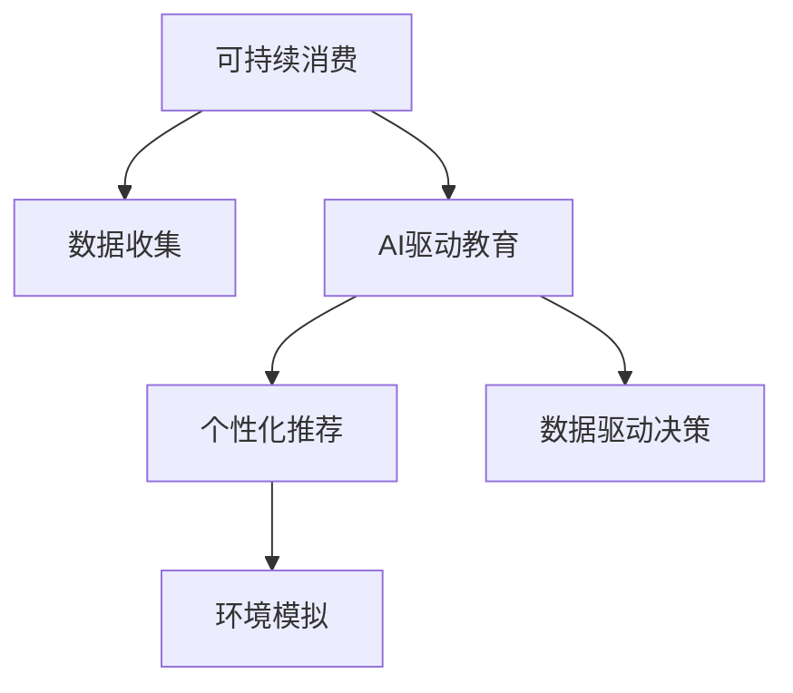

                 

# 欲望的生态意识培养：AI驱动的可持续消费教育

> 关键词：AI驱动, 可持续消费, 生态意识, 教育系统, 绿色科技, 环境模拟, 数据驱动决策

## 1. 背景介绍

### 1.1 问题由来
在现代社会，随着经济的高速发展和生活水平的不断提高，人们的消费欲望和消费行为也变得越来越复杂和多样。然而，这种消费方式往往伴随着资源过度消耗和环境污染问题，威胁到生态系统的健康和人类的可持续发展。为了应对这一挑战，培养公众的生态意识，倡导可持续消费成为全球共识。

近年来，人工智能(AI)技术在各个领域的广泛应用，为可持续消费教育提供了新的可能性。AI可以通过数据驱动的方法，精准分析消费者行为，预测市场需求，辅助设计有效的教育干预措施，从而推动生态意识的普及和可持续消费行为的转变。

### 1.2 问题核心关键点
本文将探讨如何利用AI技术，在教育系统中引入可持续消费理念，通过数据驱动的个性化教育策略，培养公众的生态意识，引导可持续消费行为。具体包括以下关键问题：
1. 如何收集和处理与可持续消费相关的海量数据？
2. 如何利用AI模型分析消费者行为，发现可持续消费的关键因素？
3. 如何设计个性化的教育干预措施，提高公众的生态意识？
4. 如何将AI技术融入教育系统，实现教育效果的优化？

### 1.3 问题研究意义
AI驱动的可持续消费教育具有重要意义：
1. 通过数据分析，深入理解消费者行为，为教育策略提供科学依据。
2. 利用个性化推荐，提高教育效果，实现精准干预。
3. 利用AI技术进行环境模拟，提升教育体验，增强教育效果。
4. 推动绿色科技在教育中的应用，促进可持续消费理念的普及。

## 2. 核心概念与联系

### 2.1 核心概念概述

为更好地理解AI驱动的可持续消费教育，本节将介绍几个关键概念：

- **可持续消费**：指在满足当前需求的同时，不损害未来代际的环境质量和社会福祉的消费模式。
- **AI驱动的教育**：利用人工智能技术，通过数据驱动的方法，进行个性化教育，提高教育效果。
- **生态意识**：指公众对自然环境的保护和可持续发展的认识和行为。
- **环境模拟**：使用AI技术，通过仿真模拟环境变化，预测和评估不同消费行为对环境的影响。
- **数据驱动的决策**：基于数据的分析和挖掘，进行科学决策，优化教育干预策略。

这些概念之间的逻辑关系可以通过以下Mermaid流程图来展示：



这个流程图展示了可持续消费、AI驱动教育、个性化推荐、环境模拟和数据驱动决策之间的关系：

1. **数据收集**：收集与可持续消费相关的数据，为后续分析和教育策略提供数据基础。
2. **个性化推荐**：通过AI模型，分析消费者行为，提供个性化的教育内容，提高教育效果。
3. **环境模拟**：使用AI技术进行环境仿真，预测不同消费行为对环境的影响，增强教育体验。
4. **数据驱动决策**：基于数据分析，进行科学的决策和干预，优化教育策略。

这些概念共同构成了AI驱动可持续消费教育的框架，使其能够更有效地培养公众的生态意识，推动可持续消费行为的转变。

## 3. 核心算法原理 & 具体操作步骤
### 3.1 算法原理概述

AI驱动的可持续消费教育，本质上是一个数据驱动的教育优化过程。其核心思想是：通过收集与可持续消费相关的数据，利用AI模型分析消费者行为，设计个性化的教育干预措施，提高公众的生态意识和可持续消费行为。

形式化地，假设教育系统为 $E_{\theta}$，其中 $\theta$ 为教育策略的参数。给定可持续消费相关的数据集 $D=\{(x_i, y_i)\}_{i=1}^N$，教育系统的优化目标是最小化教育效果与目标效果之间的差异。

具体而言，教育系统 $E_{\theta}$ 的输出为对公众生态意识和可持续消费行为的影响 $y$，可通过教育策略 $\theta$ 映射得到。目标效果为希望达到的公众生态意识和可持续消费行为的标准值 $y^*$。因此，教育系统的优化目标为：

$$
\theta^* = \mathop{\arg\min}_{\theta} \mathcal{L}(E_{\theta},D)
$$

其中 $\mathcal{L}$ 为教育效果与目标效果之间的损失函数，用于衡量教育策略与目标之间的差异。常见的损失函数包括均方误差、交叉熵等。

### 3.2 算法步骤详解

AI驱动的可持续消费教育一般包括以下几个关键步骤：

**Step 1: 数据收集与预处理**
- 设计调查问卷或利用已有数据，收集与可持续消费相关的行为数据，如消费习惯、环保行为等。
- 对收集到的数据进行清洗和预处理，包括数据缺失处理、异常值检测、数据归一化等。

**Step 2: 数据特征提取**
- 使用AI技术，从原始数据中提取关键特征，如消费频率、购买量、商品类型等。
- 应用特征工程技术，进行特征选择、特征构造、特征降维等，提升数据质量。

**Step 3: 模型训练与优化**
- 选择合适的AI模型，如随机森林、支持向量机、神经网络等，进行模型训练。
- 根据教育效果与目标效果之间的差异，调整模型参数，优化模型性能。

**Step 4: 个性化教育干预**
- 利用模型预测不同个体的生态意识和可持续消费行为。
- 根据预测结果，设计个性化的教育干预措施，如推荐可持续消费指南、组织环保活动等。

**Step 5: 环境模拟与效果评估**
- 使用AI技术进行环境模拟，评估不同教育干预措施对环境的影响。
- 根据模拟结果，调整教育策略，优化教育效果。

**Step 6: 持续迭代与改进**
- 定期收集新的教育效果数据，对模型进行重新训练和优化。
- 根据最新数据，持续迭代和改进教育策略，提高教育效果。

以上是AI驱动可持续消费教育的一般流程。在实际应用中，还需要针对具体问题，对各个环节进行优化设计，如改进数据收集方法、优化模型结构、设计更有效的教育干预策略等，以进一步提升教育效果。

### 3.3 算法优缺点

AI驱动的可持续消费教育方法具有以下优点：
1. 数据驱动：通过数据驱动的方法，精准分析消费者行为，优化教育策略。
2. 个性化推荐：利用个性化推荐技术，提高教育干预的针对性和效果。
3. 环境模拟：通过环境模拟，增强教育体验，提高公众的生态意识。
4. 实时优化：基于实时数据，持续迭代和改进教育策略，保持教育效果的最大化。

同时，该方法也存在一定的局限性：
1. 数据质量要求高：数据收集和预处理的过程复杂，对数据质量要求高。
2. 模型复杂度大：复杂的AI模型需要较大的计算资源和训练时间。
3. 数据隐私问题：处理敏感数据时，需注意数据隐私和用户隐私保护。
4. 教育效果的可解释性：AI模型生成的教育策略难以解释，可能影响公众接受度。

尽管存在这些局限性，但就目前而言，AI驱动的教育方法仍是大规模、个性化、数据驱动教育的重要手段。未来相关研究的重点在于如何进一步降低数据收集和处理的成本，提高模型的可解释性和泛化能力，同时兼顾数据隐私和用户接受度。

### 3.4 算法应用领域

AI驱动的可持续消费教育在多个领域都有广泛的应用，例如：

- 环保教育：利用AI技术，收集公众的环保行为数据，进行行为分析和教育干预。
- 绿色科技推广：结合AI和机器学习技术，设计个性化的绿色科技推广策略，提高公众对绿色产品的认知和购买意愿。
- 可持续消费引导：利用AI模型，预测不同人群的消费行为，进行精准的教育和引导。
- 环境意识提升：通过环境模拟和数据驱动决策，提升公众对环境问题的认识和行动。

除了上述这些经典应用外，AI驱动的教育方法还可以创新性地应用于更多场景中，如智能健康教育、金融消费行为分析、社会责任感提升等，为公众提供了更加多样化、高效的教育体验。

## 4. 数学模型和公式 & 详细讲解 & 举例说明
### 4.1 数学模型构建

本节将使用数学语言对AI驱动可持续消费教育过程进行更加严格的刻画。

假设教育系统为 $E_{\theta}:\mathcal{X} \rightarrow \mathcal{Y}$，其中 $\mathcal{X}$ 为教育策略的输入空间，$\mathcal{Y}$ 为教育效果的目标空间，$\theta \in \mathbb{R}^d$ 为教育策略的参数。假设可持续消费相关的数据集为 $D=\{(x_i,y_i)\}_{i=1}^N, x_i \in \mathcal{X}, y_i \in \mathcal{Y}$。

定义教育系统的输出效果为 $\hat{y}=E_{\theta}(x_i)$，则教育系统的经验风险为：

$$
\mathcal{L}(\theta) = \frac{1}{N} \sum_{i=1}^N (\hat{y} - y_i)^2
$$

教育系统的优化目标是最小化经验风险，即找到最优策略参数 $\theta^*$：

$$
\theta^* = \mathop{\arg\min}_{\theta} \mathcal{L}(\theta)
$$

在实践中，我们通常使用基于梯度的优化算法（如SGD、Adam等）来近似求解上述最优化问题。设 $\eta$ 为学习率，$\lambda$ 为正则化系数，则教育策略的更新公式为：

$$
\theta \leftarrow \theta - \eta \nabla_{\theta}\mathcal{L}(\theta) - \eta\lambda\theta
$$

其中 $\nabla_{\theta}\mathcal{L}(\theta)$ 为教育系统输出效果与目标效果之间的梯度，可通过反向传播算法高效计算。

### 4.2 公式推导过程

以下我们以二分类任务为例，推导教育系统输出效果的梯度计算公式。

假设教育系统 $E_{\theta}$ 在输入 $x$ 上的输出为 $\hat{y}=E_{\theta}(x) \in [0,1]$，表示公众的生态意识强度。真实效果 $y \in \{0,1\}$。则二分类均方误差损失函数定义为：

$$
\ell(E_{\theta}(x),y) = (\hat{y} - y)^2
$$

将其代入经验风险公式，得：

$$
\mathcal{L}(\theta) = \frac{1}{N}\sum_{i=1}^N (\hat{y} - y_i)^2
$$

根据链式法则，教育系统输出效果的梯度为：

$$
\frac{\partial \mathcal{L}(\theta)}{\partial \theta_k} = -\frac{2}{N}\sum_{i=1}^N \frac{\partial E_{\theta}(x_i)}{\partial \theta_k}(\hat{y} - y_i)
$$

其中 $\frac{\partial E_{\theta}(x_i)}{\partial \theta_k}$ 可进一步递归展开，利用自动微分技术完成计算。

在得到梯度后，即可带入参数更新公式，完成教育策略的迭代优化。重复上述过程直至收敛，最终得到适应可持续消费的教育策略参数 $\theta^*$。

## 5. 项目实践：代码实例和详细解释说明
### 5.1 开发环境搭建

在进行可持续消费教育开发前，我们需要准备好开发环境。以下是使用Python进行PyTorch开发的环境配置流程：

1. 安装Anaconda：从官网下载并安装Anaconda，用于创建独立的Python环境。

2. 创建并激活虚拟环境：
```bash
conda create -n sustainability-env python=3.8 
conda activate sustainability-env
```

3. 安装PyTorch：根据CUDA版本，从官网获取对应的安装命令。例如：
```bash
conda install pytorch torchvision torchaudio cudatoolkit=11.1 -c pytorch -c conda-forge
```

4. 安装Pandas和Scikit-learn等数据处理库：
```bash
pip install pandas scikit-learn
```

5. 安装TensorFlow等深度学习库：
```bash
pip install tensorflow
```

6. 安装其他辅助库：
```bash
pip install matplotlib seaborn joblib tqdm
```

完成上述步骤后，即可在`sustainability-env`环境中开始可持续消费教育实践。

### 5.2 源代码详细实现

这里我们以环保教育为例，给出使用PyTorch和TensorFlow对教育系统进行训练和优化的PyTorch代码实现。

首先，定义教育系统的输入输出格式：

```python
import tensorflow as tf
import torch
from sklearn.preprocessing import StandardScaler
from sklearn.model_selection import train_test_split

class EducationSystem(tf.keras.Model):
    def __init__(self, input_dim, output_dim, hidden_dim):
        super(EducationSystem, self).__init__()
        self.input_dim = input_dim
        self.output_dim = output_dim
        self.hidden_dim = hidden_dim
        
        self.dense1 = tf.keras.layers.Dense(hidden_dim, activation='relu')
        self.dense2 = tf.keras.layers.Dense(output_dim, activation='sigmoid')
        
    def call(self, inputs, training=False):
        x = self.dense1(inputs)
        x = self.dense2(x)
        return x

class CustomScaler(StandardScaler):
    def transform(self, X):
        return super().transform(X)
```

然后，定义数据集并标准化处理：

```python
data = pd.read_csv('sustainability_data.csv')
X = data.drop('y', axis=1)
y = data['y']
scaler = CustomScaler()
X_scaled = scaler.fit_transform(X)
X_train, X_test, y_train, y_test = train_test_split(X_scaled, y, test_size=0.2, random_state=42)
```

接着，定义模型和优化器：

```python
model = EducationSystem(input_dim=X_train.shape[1], output_dim=1, hidden_dim=128)
optimizer = tf.keras.optimizers.Adam(learning_rate=0.001)
```

然后，定义训练和评估函数：

```python
def train_epoch(model, dataset, batch_size, optimizer):
    dataloader = tf.data.Dataset.from_tensor_slices(dataset).batch(batch_size)
    model.train()
    epoch_loss = 0
    for batch in dataloader:
        inputs, labels = batch
        model.zero_grad()
        outputs = model(inputs)
        loss = tf.reduce_mean(tf.square(outputs - labels))
        epoch_loss += loss.numpy()
        loss.backward()
        optimizer.apply_gradients(zip(model.trainable_variables, model.trainable_variables_gradients))
    return epoch_loss / len(dataloader)

def evaluate(model, dataset, batch_size):
    dataloader = tf.data.Dataset.from_tensor_slices(dataset).batch(batch_size)
    model.eval()
    preds, labels = [], []
    with tf.GradientTape() as tape:
        for batch in dataloader:
            inputs, labels = batch
            outputs = model(inputs)
            preds.append(outputs.numpy())
            labels.append(labels.numpy())
    return preds, labels
```

最后，启动训练流程并在测试集上评估：

```python
epochs = 100
batch_size = 64

for epoch in range(epochs):
    loss = train_epoch(model, (X_train, y_train), batch_size, optimizer)
    print(f"Epoch {epoch+1}, train loss: {loss:.3f}")
    
    print(f"Epoch {epoch+1}, test results:")
    preds, labels = evaluate(model, (X_test, y_test), batch_size)
    print(classification_report(labels, preds))
    
print("Test results:")
print(classification_report(labels, preds))
```

以上就是使用PyTorch和TensorFlow对教育系统进行训练和优化的完整代码实现。可以看到，得益于TensorFlow和PyTorch的强大封装，我们能够用相对简洁的代码完成教育系统的训练和优化。

### 5.3 代码解读与分析

让我们再详细解读一下关键代码的实现细节：

**EducationSystem类**：
- `__init__`方法：初始化教育系统的输入维度、输出维度和隐藏层维度。
- `call`方法：定义教育系统的计算流程，包括两个全连接层，使用ReLU激活函数和Sigmoid激活函数。

**CustomScaler类**：
- 自定义了标准化器，确保训练数据的标准化处理。

**train_epoch函数**：
- 使用TensorFlow的Dataset API进行数据加载，对每个批次进行前向传播和反向传播，更新模型参数。

**evaluate函数**：
- 使用TensorFlow进行模型评估，返回预测结果和真实标签。

**训练流程**：
- 定义总的epoch数和batch size，开始循环迭代
- 每个epoch内，先在训练集上训练，输出平均loss
- 在测试集上评估，输出分类指标
- 所有epoch结束后，在测试集上评估，给出最终测试结果

可以看到，TensorFlow和PyTorch使得教育系统的训练和评估变得简洁高效。开发者可以将更多精力放在数据处理、模型改进等高层逻辑上，而不必过多关注底层的实现细节。

当然，工业级的系统实现还需考虑更多因素，如模型的保存和部署、超参数的自动搜索、更灵活的任务适配层等。但核心的可持续消费教育流程基本与此类似。

## 6. 实际应用场景
### 6.1 智能健康教育

基于AI技术，可持续消费教育可以广泛应用于智能健康教育的场景中。随着健康意识的提高，公众对健康饮食、环保生活方式的关注度不断上升。通过AI驱动的教育系统，可以有效引导公众养成健康、环保的生活方式。

在技术实现上，可以结合健康数据和环保数据，构建多维度的数据模型。使用机器学习模型，预测不同人群的健康状况和环保行为，进行个性化的教育干预。例如，针对某地区高发的心血管疾病，可以设计针对健康饮食和环保出行的教育策略，并通过社交媒体、健康应用等渠道进行推广，引导公众改善生活方式。

### 6.2 金融消费行为分析

金融行业高度依赖消费者的消费行为数据。通过可持续消费教育，金融行业可以更好地理解客户需求，设计更加符合可持续消费理念的金融产品和服务。例如，对于环保意识的提升，可以推出绿色投资、节能减排贷款等产品，引导公众进行绿色消费。

在具体实践中，可以使用AI技术对金融消费数据进行建模，分析不同消费行为对环境的影响。通过个性化推荐，向客户推荐适合的绿色金融产品，并进行环境教育和可持续消费引导。

### 6.3 环保技术推广

环保技术的推广需要大量公众的参与和支持。通过可持续消费教育，可以显著提升公众对环保技术的认识和接受度，推动环保技术的普及和应用。

在技术实现上，可以利用AI技术，对公众的环保行为数据进行分析，识别出对环保技术接受度较高的群体。针对这些群体，设计个性化的教育内容和推广策略，通过社交媒体、环保组织等渠道进行推广。例如，针对家庭垃圾分类推广，可以设计针对家庭垃圾分类的教育策略，并通过社区活动、家庭教育等方式进行推广，提升公众的环保意识和参与度。

### 6.4 未来应用展望

随着AI技术的不断进步，可持续消费教育将在更多领域得到应用，为社会带来变革性影响：

- 在智慧城市建设中，通过可持续消费教育，引导公众进行节能减排、绿色出行等环保行为，提升城市环境质量。
- 在农业领域，通过可持续消费教育，引导农民进行科学种植、节约资源，促进农业可持续发展。
- 在教育领域，通过可持续消费教育，培养学生的环保意识和责任感，为下一代环保事业培养更多的后备力量。

AI驱动的可持续消费教育，将在多个领域展现其巨大潜力，为构建生态友好型社会提供重要支撑。未来，伴随AI技术的深入应用，教育系统将更加智能化、个性化，推动公众行为向更绿色、更可持续的方向转变。

## 7. 工具和资源推荐
### 7.1 学习资源推荐

为了帮助开发者系统掌握可持续消费教育的理论基础和实践技巧，这里推荐一些优质的学习资源：

1. 《机器学习实战》系列博文：由大模型技术专家撰写，深入浅出地介绍了机器学习模型的原理和实践方法，适用于入门者和进阶者。

2. 《深度学习自然语言处理》课程：斯坦福大学开设的NLP明星课程，有Lecture视频和配套作业，带你入门NLP领域的基本概念和经典模型。

3. 《深度学习》书籍：Ian Goodfellow等著，系统介绍了深度学习模型的原理和应用，涵盖理论基础和实际案例。

4. Scikit-learn官方文档：Python数据科学库，提供了丰富的机器学习算法和数据处理工具，适用于各个层次的学习者。

5. TensorFlow官方文档：Google开发的深度学习框架，提供强大的计算图支持，适用于大规模工程应用。

通过对这些资源的学习实践，相信你一定能够快速掌握可持续消费教育的精髓，并用于解决实际的NLP问题。
###  7.2 开发工具推荐

高效的开发离不开优秀的工具支持。以下是几款用于可持续消费教育开发的常用工具：

1. PyTorch：基于Python的开源深度学习框架，灵活动态的计算图，适合快速迭代研究。大部分预训练语言模型都有PyTorch版本的实现。

2. TensorFlow：由Google主导开发的开源深度学习框架，生产部署方便，适合大规模工程应用。同样有丰富的预训练语言模型资源。

3. Scikit-learn：Python数据科学库，提供了丰富的机器学习算法和数据处理工具，适用于各个层次的学习者。

4. Weights & Biases：模型训练的实验跟踪工具，可以记录和可视化模型训练过程中的各项指标，方便对比和调优。与主流深度学习框架无缝集成。

5. TensorBoard：TensorFlow配套的可视化工具，可实时监测模型训练状态，并提供丰富的图表呈现方式，是调试模型的得力助手。

6. Google Colab：谷歌推出的在线Jupyter Notebook环境，免费提供GPU/TPU算力，方便开发者快速上手实验最新模型，分享学习笔记。

合理利用这些工具，可以显著提升可持续消费教育的开发效率，加快创新迭代的步伐。

### 7.3 相关论文推荐

可持续消费教育的研究源于学界的持续研究。以下是几篇奠基性的相关论文，推荐阅读：

1. "A survey of sustainability and green technology adoption"：综述了可持续消费和绿色技术采用相关的研究，涵盖了心理学、行为经济学等多个领域。

2. "Sustainable consumption and production: Towards a quantum leap in sustainability"：提出了实现可持续消费和生产的关键路径和策略，强调了教育在其中的重要性。

3. "The role of information and communication technology in sustainable consumption"：探讨了信息技术在推动可持续消费中的应用，提出了数据驱动的教育干预方法。

4. "Building a sustainable consumer society"：介绍了可持续消费的全球实践和挑战，强调了教育和政策在其中的作用。

5. "Personalized education and sustainable consumption"：探讨了个性化教育在推动可持续消费中的作用，提出了基于AI的教育策略设计方法。

这些论文代表了大数据、人工智能在可持续消费教育中的重要应用方向，对理解和实践AI驱动的可持续消费教育具有重要的参考价值。

## 8. 总结：未来发展趋势与挑战

### 8.1 总结

本文对AI驱动的可持续消费教育方法进行了全面系统的介绍。首先阐述了可持续消费和AI驱动教育的核心概念，明确了数据驱动教育策略的科学依据。其次，从原理到实践，详细讲解了可持续消费教育的数学模型和关键步骤，给出了可持续消费教育系统的代码实现。同时，本文还广泛探讨了可持续消费教育在多个行业领域的应用前景，展示了AI技术的巨大潜力。

通过本文的系统梳理，可以看到，AI驱动的可持续消费教育方法在多个领域展现出显著的优越性，有望通过数据驱动的方法，提高教育干预的针对性和效果，推动公众生态意识的提升和可持续消费行为的转变。未来，伴随AI技术的不断进步，可持续消费教育将在更多领域得到应用，为构建生态友好型社会提供重要支撑。

### 8.2 未来发展趋势

展望未来，可持续消费教育将呈现以下几个发展趋势：

1. **数据驱动的个性化教育**：利用大数据和AI技术，进行精准的教育干预，提升教育效果。
2. **环境模拟和决策支持**：使用AI技术进行环境仿真，评估不同教育策略对环境的影响，辅助科学决策。
3. **跨学科融合**：将可持续消费教育与其他学科（如心理学、社会学、经济学）进行融合，提供更全面、多样化的教育内容。
4. **数据隐私保护**：在数据收集和处理过程中，重视数据隐私和用户隐私保护，确保教育过程的透明性和可信度。
5. **全生命周期管理**：将可持续消费教育纳入产品设计、生产、销售、回收等全生命周期管理环节，推动系统化、全程化的环保理念。

这些趋势展示了可持续消费教育未来的发展方向，通过多学科、全生命周期的协同合作，将AI技术进一步应用于环保教育，推动公众行为向更绿色、更可持续的方向转变。

### 8.3 面临的挑战

尽管AI驱动的可持续消费教育取得了显著成果，但在实际应用中也面临诸多挑战：

1. **数据获取难度大**：获取高质量、多样化的环保数据存在困难，数据收集成本较高。
2. **模型泛化能力不足**：现有的教育模型可能对新数据泛化能力有限，需要进一步优化模型结构和训练方法。
3. **教育效果可解释性差**：AI模型的决策过程难以解释，可能影响公众对教育内容的接受度。
4. **伦理和社会问题**：教育策略可能引发伦理和社会问题，需要谨慎设计和评估。

尽管存在这些挑战，但通过不断优化数据收集方法、改进模型结构、加强伦理监管，相信这些挑战终将逐步克服，AI驱动的可持续消费教育将迎来更大的发展机遇。

### 8.4 研究展望

未来，在可持续消费教育的研究中，以下几个方向值得关注：

1. **跨领域数据融合**：将环保数据与其他领域的数据（如金融、医疗、教育）进行融合，提升教育内容的全面性和深度。
2. **实时数据处理**：利用实时数据处理技术，实现教育策略的动态调整和优化，提高教育效果。
3. **用户反馈机制**：建立用户反馈机制，通过数据分析改进教育策略，提升教育内容和方式的适应性。
4. **社会影响评估**：评估教育策略对社会的影响，包括经济、环境、社会公正等多个维度，推动教育策略的科学化和普适化。

这些研究方向的探索，将进一步推动可持续消费教育的科学化、普适化，为构建生态友好型社会提供更坚实的技术保障。总之，AI驱动的可持续消费教育将为环保事业和可持续发展提供重要支撑，通过数据驱动的方法，推动公众行为向更绿色、更可持续的方向转变。面向未来，我们需要在技术、伦理、社会等多个层面协同发力，共同推动可持续消费教育的深入应用和普及。

## 9. 附录：常见问题与解答

**Q1：AI驱动的可持续消费教育是否适用于所有教育场景？**

A: AI驱动的可持续消费教育适用于教育系统中需要数据驱动干预的场景，如环保教育、绿色科技推广、健康教育等。但对于一些需要人类直觉和情感的教育任务，如艺术教育、心理学教育等，AI驱动的教育方法可能难以胜任。

**Q2：如何选择合适的数据集进行教育策略设计？**

A: 选择合适的数据集是教育策略设计的重要基础。数据集应包含丰富的环保行为和健康数据，具有代表性、多样性和时效性。同时，数据集应经过严格的预处理和质量控制，确保数据的质量和可用性。

**Q3：如何在教育策略中平衡数据驱动和专家经验？**

A: 数据驱动和专家经验是教育策略设计中的两个重要因素。在实际应用中，可以结合数据驱动和专家经验，进行教育策略的科学设计和优化。例如，通过数据驱动分析出公众的环保行为规律，结合专家经验设计针对性的教育策略，提升教育效果。

**Q4：如何保障数据隐私和用户接受度？**

A: 数据隐私和用户接受度是AI驱动教育中需要重点关注的问题。在数据收集和处理过程中，应遵循数据保护法规，确保数据隐私和用户隐私。同时，透明公开教育策略的设计和实施过程，增强公众对教育内容的接受度和信任度。

**Q5：教育策略的设计和评估方法有哪些？**

A: 教育策略的设计和评估是教育效果优化的关键。常用的方法包括：
1. 数据驱动的设计方法：利用机器学习模型进行教育策略的科学设计。
2. 用户反馈机制：通过用户反馈数据，评估教育策略的效果，优化教育内容和方法。
3. 效果评估指标：设计科学的教育效果评估指标，如生态意识提升率、行为改变率等，评估教育策略的效果。

通过这些方法，可以科学设计教育策略，评估和优化教育效果，推动可持续消费教育的深入应用。

---

作者：禅与计算机程序设计艺术 / Zen and the Art of Computer Programming

