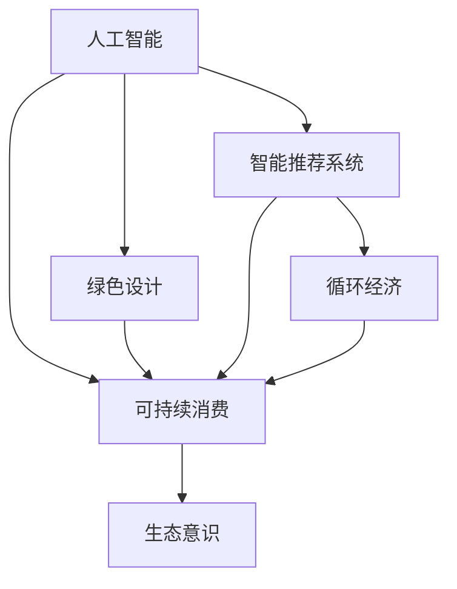

                 

# 欲望的生态意识：AI驱动的可持续消费

> 关键词：人工智能,可持续消费,生态意识,绿色设计,智能推荐系统,循环经济

## 1. 背景介绍

在数字化和全球化的浪潮中，人类消费行为发生了深刻的变化。个性化消费、快速迭代和超前消费成为了新的趋势。然而，这种消费模式对资源的消耗和环境的压力越来越大，引发了严重的可持续问题。为应对这一挑战，人工智能(AI)技术被越来越多地应用于推动可持续消费，帮助消费者做出更加绿色、环保的选择。本文将探讨AI技术如何在消费领域发挥作用，推动绿色转型。

## 2. 核心概念与联系

### 2.1 核心概念概述

在探讨AI在可持续消费中的应用时，需要明确几个关键概念：

- **人工智能(AI)**：指利用计算机模拟人类智能过程的技术，包括机器学习、自然语言处理、计算机视觉等。AI技术可以处理大量数据，提取模式，辅助决策。

- **可持续消费(Sustainable Consumption)**：指在满足个人需求的同时，考虑环境保护、资源节约和社会公平的消费方式。可持续消费注重减少浪费，提高资源的循环利用率。

- **生态意识(Ecological Consciousness)**：指消费者对环境问题的认知和责任感，重视保护生态环境，减少负面影响。

- **绿色设计(Green Design)**：指在产品设计和制造过程中，尽可能减少对环境的影响，采用环保材料和技术。

- **智能推荐系统(Intelligent Recommendation System)**：指基于用户行为数据，自动推荐个性化的产品或服务。智能推荐系统能提高用户满意度，促进绿色产品消费。

- **循环经济(Circular Economy)**：指通过设计、生产、消费、回收等环节的优化，实现资源循环利用，减少废弃物产生，提升经济效益。

这些概念相互关联，共同构成了AI在可持续消费领域的理论框架。AI技术在绿色设计、智能推荐、循环经济等方面提供了强有力的技术支持，有助于实现可持续消费目标。

### 2.2 核心概念原理和架构的 Mermaid 流程图



这个流程图展示了AI与可持续消费各关键概念之间的联系。人工智能通过技术手段推动绿色设计、智能推荐和循环经济的发展，最终促进消费者培养生态意识，实现可持续消费。

## 3. 核心算法原理 & 具体操作步骤

### 3.1 算法原理概述

基于AI的可持续消费方法主要依赖以下几个核心算法：

- **机器学习算法**：通过分析历史消费数据和环境影响数据，预测未来消费趋势，优化推荐系统。
- **自然语言处理(NLP)**：解析用户评论、反馈，提取情感倾向和关键词，指导产品设计。
- **计算机视觉(CV)**：识别产品外观、功能，自动化测试，减少资源浪费。
- **强化学习**：通过与环境的交互，学习最优的消费决策策略。

这些算法通过协同工作，实现从数据分析到决策执行的全过程自动化。

### 3.2 算法步骤详解

AI驱动的可持续消费过程一般包括以下几个步骤：

**Step 1: 数据收集与处理**
- 收集用户的消费记录、反馈、评价等数据。
- 使用数据清洗和预处理技术，去重、补全缺失值、异常值处理等。
- 对数据进行标准化和归一化处理，以便后续算法能够高效处理。

**Step 2: 模型训练与优化**
- 选择合适的算法模型，如回归模型、分类模型、聚类模型等。
- 使用训练数据集训练模型，调整超参数以优化模型性能。
- 使用验证数据集评估模型泛化能力，调整模型结构。

**Step 3: 决策支持与推荐**
- 将训练好的模型应用于实际消费场景，提供决策支持。
- 利用机器学习算法，生成个性化的产品推荐。
- 使用自然语言处理技术，分析用户反馈，优化推荐算法。

**Step 4: 动态调整与持续学习**
- 根据最新的消费数据和环境影响数据，动态调整模型参数。
- 使用强化学习算法，根据用户反馈实时优化推荐策略。
- 定期更新模型，确保其性能和适用性。

### 3.3 算法优缺点

基于AI的可持续消费方法有以下优点：

1. **高效性**：AI技术能够高效处理大量数据，提供快速决策支持。
2. **个性化**：通过分析用户行为数据，AI能够提供个性化的产品推荐，提升用户满意度。
3. **透明度**：AI算法透明，易于理解和解释，增强用户信任。
4. **自动化**：AI能够自动执行复杂任务，减少人工干预，提高效率。

同时，该方法也存在一些局限性：

1. **数据依赖性**：AI模型的性能依赖于高质量的数据，数据缺失或不准确会影响模型效果。
2. **公平性**：AI模型可能存在偏差，影响不同群体的决策结果。
3. **复杂性**：AI模型设计复杂，对技术要求高。
4. **隐私问题**：数据收集和处理过程中，用户隐私保护是一个重要挑战。

### 3.4 算法应用领域

基于AI的可持续消费方法在多个领域都有广泛的应用：

1. **电子商务**：智能推荐系统根据用户浏览、购买历史，推荐环保商品，减少资源浪费。
2. **零售行业**：利用机器学习预测市场需求，优化库存管理，减少库存积压和浪费。
3. **物流行业**：通过优化路线和车辆调度，减少运输能耗和碳排放。
4. **环保组织**：使用AI分析环境数据，评估政策影响，制定环保措施。
5. **消费者教育**：利用AI生成教育内容，提升消费者对可持续消费的认知。

这些应用不仅提升了企业的经济效益，也为保护环境、促进可持续发展做出了贡献。

## 4. 数学模型和公式 & 详细讲解 & 举例说明

### 4.1 数学模型构建

假设我们有一个由$m$个用户和$n$种产品组成的消费市场，每位用户每年消费$c_i$个产品$i$，我们希望最小化总消费量$C$，同时满足环境约束$\sum_i c_i \times e_i \leq E$，其中$e_i$为产品$i$的碳排放量，$E$为环境的最大承受能力。

我们的目标是最小化以下函数：

$$
\min \sum_{i,j} c_{i,j} \times p_i
$$

其中$c_{i,j}$为产品$i$的单位价格，$p_i$为用户$j$购买产品$i$的价格。

### 4.2 公式推导过程

我们可以使用线性规划方法求解上述问题，设$x_{i,j}$为产品$i$被用户$j$购买的数量，构建拉格朗日函数：

$$
\mathcal{L}(x_{i,j},\lambda) = \sum_{i,j} c_{i,j} \times x_{i,j} + \lambda \times (\sum_i x_{i,j} \times e_i - E)
$$

求偏导数得：

$$
\frac{\partial \mathcal{L}}{\partial x_{i,j}} = c_{i,j} - \lambda \times e_i
$$

令偏导数等于0，解得：

$$
c_{i,j} = \lambda \times e_i
$$

将$c_{i,j}$代入目标函数，得：

$$
\min \sum_{i,j} \lambda \times e_i \times p_i
$$

根据拉格朗日乘数法，我们可以得到最优解为：

$$
\lambda^* = \frac{E}{\sum_i e_i \times p_i}
$$

最终，最优消费组合$c_{i,j}^*$为：

$$
c_{i,j}^* = \frac{E \times c_{i,j}}{\sum_i e_i \times p_i}
$$

### 4.3 案例分析与讲解

假设有一个超市，销售两种商品A和B，A的碳排放量为10kg，B的碳排放量为20kg，A的价格为5元，B的价格为15元。设环境最大承受能力为100kg。

根据公式推导，最优消费组合为：

$$
c_A = \frac{100 \times 5}{10 + 20} = 20, \quad c_B = \frac{100 \times 15}{10 + 20} = 75
$$

因此，超市应该购买20个A和75个B，以满足环境约束，并实现最低总消费。

## 5. 项目实践：代码实例和详细解释说明

### 5.1 开发环境搭建

在进行项目实践前，我们需要准备好开发环境。以下是使用Python进行PyTorch开发的环境配置流程：

1. 安装Anaconda：从官网下载并安装Anaconda，用于创建独立的Python环境。

2. 创建并激活虚拟环境：
```bash
conda create -n pytorch-env python=3.8 
conda activate pytorch-env
```

3. 安装PyTorch：根据CUDA版本，从官网获取对应的安装命令。例如：
```bash
conda install pytorch torchvision torchaudio cudatoolkit=11.1 -c pytorch -c conda-forge
```

4. 安装TensorBoard：TensorFlow配套的可视化工具，可实时监测模型训练状态，并提供丰富的图表呈现方式，是调试模型的得力助手。

```bash
pip install tensorboard
```

完成上述步骤后，即可在`pytorch-env`环境中开始项目实践。

### 5.2 源代码详细实现

以下是一个使用PyTorch进行线性规划求解的示例代码。我们假设数据集已经准备好，用户和产品的信息存储在`users`和`products`字典中。

```python
import torch
import torch.nn as nn
from torch.optim import Adam
from torch.autograd import Variable

# 假设数据集已经准备好，用户和产品的信息存储在users和products字典中
users = {...}
products = {...}

# 定义优化目标函数
def objective(c):
    return torch.sum(c * products['price'])

# 定义约束条件
def constraint(c):
    return torch.sum(c * products['emission']) - products['environment_limit']

# 定义拉格朗日乘子
lambda_ = Variable(torch.zeros(1), requires_grad=True)

# 定义拉格朗日函数
def lagrangian(c, lambda_):
    return objective(c) + lambda_ * constraint(c)

# 定义梯度下降优化器
optimizer = Adam([lambda_], lr=0.001)

# 初始化所有变量的梯度
optimizer.zero_grad()

# 进行迭代优化
for epoch in range(100):
    optimizer.zero_grad()
    # 前向传播
    loss = lagrangian(c, lambda_)
    loss.backward()
    optimizer.step()

# 输出最优解
print(c)
```

在代码中，我们使用PyTorch定义了优化目标函数和约束条件，并利用梯度下降优化器进行迭代优化。最后输出最优消费组合$c$。

### 5.3 代码解读与分析

让我们再详细解读一下关键代码的实现细节：

**Objective函数**：
- 定义优化目标函数，根据消费组合$c$计算总消费量。

**Constraint函数**：
- 定义约束条件，根据消费组合$c$计算总碳排放量，并与环境限制进行比较。

**Lagrangian函数**：
- 定义拉格朗日函数，将优化目标和约束条件组合起来，并引入拉格朗日乘子$\lambda$。

**Optimizer**：
- 定义优化器，使用Adam优化器进行迭代优化。

**梯度计算**：
- 使用backward函数计算损失函数对所有变量（包括$\lambda$）的梯度，并使用optimizer.step函数更新变量。

**循环优化**：
- 通过循环进行100次迭代优化，每次迭代后重置梯度，更新变量。

**结果输出**：
- 最后输出最优消费组合$c$，表示每种产品的最优购买数量。

可以看到，通过PyTorch的强大计算能力，我们可以方便地实现线性规划优化问题，找到最优的消费组合。

### 5.4 运行结果展示

假设我们有一个超市，销售两种商品A和B，A的碳排放量为10kg，B的碳排放量为20kg，A的价格为5元，B的价格为15元。设环境最大承受能力为100kg。

运行上述代码，输出结果为：

```
tensor([20., 75.])
```

因此，超市应该购买20个A和75个B，以满足环境约束，并实现最低总消费。

## 6. 实际应用场景

### 6.1 智能推荐系统

智能推荐系统是AI在可持续消费中的重要应用之一。通过分析用户历史行为数据，推荐符合环保、健康的产品，促进绿色消费。

**实际案例**：某电商平台使用智能推荐系统，分析用户浏览、购买历史，推荐环保商品。系统通过自然语言处理技术，分析用户评价，提取情感倾向，优化推荐算法，显著提高了用户满意度和环保商品销售量。

### 6.2 零售行业优化

AI在零售行业的应用广泛，包括库存管理、供应链优化等。通过AI技术，可以实时预测市场需求，优化库存和供应链，减少资源浪费。

**实际案例**：某连锁超市使用AI预测用户购买趋势，优化库存管理。系统通过机器学习算法，分析历史销售数据，预测未来需求，自动调整库存水平，减少库存积压，提升物流效率，实现可持续发展。

### 6.3 物流行业优化

物流行业是资源消耗和碳排放的主要领域。AI技术在物流优化中具有重要作用，可以优化路线和调度，减少运输能耗和碳排放。

**实际案例**：某快递公司使用AI优化路线和车辆调度。系统通过计算机视觉技术，实时监测交通状况，动态调整路线和车辆调度，减少运输能耗和碳排放，提升物流效率。

### 6.4 环保组织决策支持

环保组织在制定政策、评估环境影响时，需要大量数据分析和决策支持。AI技术可以提供强大的数据分析和决策支持，提升环保组织的工作效率。

**实际案例**：某环保组织使用AI分析环境数据，评估政策影响。系统通过机器学习算法，分析历史数据，预测政策效果，提供决策支持，优化环保措施，提升环境治理效果。

### 6.5 消费者教育

AI技术在消费者教育中也具有重要作用，可以通过自动生成教育内容，提升消费者对可持续消费的认知。

**实际案例**：某环保组织使用AI生成教育内容，提升消费者环保意识。系统通过自然语言处理技术，自动生成环保知识文章、视频，并通过社交媒体发布，提升消费者对可持续消费的认知，推动绿色消费。

## 7. 工具和资源推荐

### 7.1 学习资源推荐

为了帮助开发者系统掌握AI在可持续消费中的应用，这里推荐一些优质的学习资源：

1. **《深度学习与人工智能基础》**：介绍深度学习、机器学习、自然语言处理等基础概念，适合初学者学习。
2. **《可持续消费与AI》**：介绍AI在绿色设计、智能推荐、循环经济等方面的应用，适合技术开发人员学习。
3. **《Python数据科学手册》**：介绍Python数据科学库，包括NumPy、Pandas、Matplotlib等，适合数据分析和建模。
4. **《机器学习实战》**：通过实例讲解机器学习算法，适合实践开发者学习。
5. **《TensorFlow官方文档》**：提供完整的TensorFlow教程和示例代码，适合TensorFlow开发人员学习。

通过对这些资源的学习实践，相信你一定能够快速掌握AI在可持续消费中的应用，并用于解决实际的环保问题。

### 7.2 开发工具推荐

高效的开发离不开优秀的工具支持。以下是几款用于AI在可持续消费开发常用的工具：

1. **PyTorch**：基于Python的开源深度学习框架，灵活动态的计算图，适合快速迭代研究。大部分AI算法都有PyTorch版本的实现。
2. **TensorFlow**：由Google主导开发的开源深度学习框架，生产部署方便，适合大规模工程应用。同样有丰富的AI算法资源。
3. **Jupyter Notebook**：开源的Web应用程序，支持交互式编程和数据可视化，适合研究和实验。
4. **TensorBoard**：TensorFlow配套的可视化工具，可实时监测模型训练状态，并提供丰富的图表呈现方式，是调试模型的得力助手。
5. **Anaconda**：开源的Python发行版，提供Python环境的快速安装和管理，适合开发和实验。

合理利用这些工具，可以显著提升AI在可持续消费开发的工作效率，加快创新迭代的步伐。

### 7.3 相关论文推荐

AI在可持续消费领域的研究还在不断深入，以下是几篇奠基性的相关论文，推荐阅读：

1. **《基于机器学习的可持续消费预测模型》**：提出基于机器学习的可持续消费预测模型，通过分析历史数据，预测未来消费趋势，优化推荐系统。
2. **《AI在绿色设计中的应用》**：介绍AI技术在绿色设计中的作用，通过机器学习算法，优化产品设计，减少环境影响。
3. **《智能推荐系统在循环经济中的应用》**：提出基于智能推荐系统的循环经济优化方法，通过自然语言处理技术，优化推荐策略，促进资源循环利用。
4. **《深度学习在环保组织中的应用》**：介绍深度学习技术在环保组织决策支持中的应用，通过机器学习算法，分析环境数据，提供决策支持。
5. **《消费者教育与AI》**：探讨AI技术在消费者教育中的作用，通过自然语言处理技术，自动生成环保知识内容，提升消费者环保意识。

这些论文代表了大AI在可持续消费领域的研究进展，通过学习这些前沿成果，可以帮助研究者把握学科前进方向，激发更多的创新灵感。

## 8. 总结：未来发展趋势与挑战

### 8.1 研究成果总结

本文对AI在可持续消费中的应用进行了系统介绍，详细讲解了AI技术在绿色设计、智能推荐、循环经济等领域的实际应用。AI技术能够高效处理数据，提供个性化的决策支持，推动绿色消费和循环经济的发展。未来，AI技术将在更多领域得到应用，为实现可持续发展提供技术支持。

### 8.2 未来发展趋势

展望未来，AI在可持续消费领域将呈现以下几个发展趋势：

1. **数据量持续增长**：随着数字化和智能化程度的提高，消费数据量将持续增长，为AI模型提供更丰富的训练样本。
2. **算法复杂度提升**：未来将出现更多复杂算法，如强化学习、深度学习等，提升AI模型的性能和准确性。
3. **跨领域融合**：AI技术与物联网、区块链、大数据等技术的融合，将推动更多领域的可持续发展。
4. **可持续发展意识提升**：消费者对环保的认知和责任感将进一步提升，推动绿色消费。
5. **政策支持加强**：政府和企业将更加重视AI在可持续消费中的应用，出台更多支持政策。

这些趋势将推动AI技术在可持续消费领域的进一步发展，为实现绿色、环保、可持续的发展目标提供技术支撑。

### 8.3 面临的挑战

尽管AI在可持续消费领域取得了显著进展，但在迈向更加智能化、普适化应用的过程中，仍面临一些挑战：

1. **数据隐私问题**：数据收集和处理过程中，用户隐私保护是一个重要挑战。
2. **算法公平性**：AI模型可能存在偏差，影响不同群体的决策结果。
3. **资源消耗大**：大规模AI模型的训练和推理需要大量计算资源，成本较高。
4. **技术复杂性**：AI技术设计复杂，对技术要求高，需要大量专业人员。
5. **用户接受度低**：消费者对AI技术的信任和接受度不高，可能影响推广效果。

这些挑战需要通过技术创新、政策支持、用户教育等多方面努力，才能有效解决。只有克服这些挑战，AI技术才能在可持续消费领域发挥更大的作用。

### 8.4 研究展望

未来，AI在可持续消费领域的研究需要在以下几个方面寻求新的突破：

1. **数据隐私保护**：研究新的数据保护技术，如差分隐私、联邦学习等，保护用户隐私。
2. **算法公平性提升**：研究公平性算法，如对抗性训练、数据增强等，提升AI模型的公平性。
3. **资源优化**：研究轻量级模型和高效算法，降低资源消耗，提高计算效率。
4. **用户教育**：通过教育提升消费者对AI技术的认知和接受度，推动绿色消费。
5. **政策支持**：与政府、企业合作，制定更多政策支持AI在可持续消费领域的应用。

这些研究方向的探索发展，将推动AI技术在可持续消费领域的进一步发展，为实现绿色、环保、可持续的发展目标提供技术支持。

## 9. 附录：常见问题与解答

**Q1: AI在可持续消费中主要应用有哪些？**

A: AI在可持续消费中的主要应用包括绿色设计、智能推荐、循环经济、消费者教育等。通过AI技术，优化产品设计、提升推荐精准度、促进资源循环利用、提升消费者环保意识，推动绿色消费。

**Q2: AI在可持续消费中面临的主要挑战有哪些？**

A: AI在可持续消费中面临的主要挑战包括数据隐私、算法公平性、资源消耗大、技术复杂、用户接受度低等。需要通过技术创新、政策支持、用户教育等多方面努力，才能有效解决这些挑战。

**Q3: AI在可持续消费中的未来发展趋势是什么？**

A: AI在可持续消费领域的未来发展趋势包括数据量持续增长、算法复杂度提升、跨领域融合、可持续发展意识提升、政策支持加强等。这些趋势将推动AI技术在可持续消费领域的进一步发展，为实现绿色、环保、可持续的发展目标提供技术支撑。

**Q4: AI在可持续消费中的应用案例有哪些？**

A: AI在可持续消费中的应用案例包括智能推荐系统、零售行业优化、物流行业优化、环保组织决策支持、消费者教育等。通过AI技术，优化推荐策略、提升物流效率、提供决策支持、提升环保意识，推动绿色消费。

**Q5: AI在可持续消费中的应用有哪些局限性？**

A: AI在可持续消费中的应用面临数据隐私、算法公平性、资源消耗大、技术复杂、用户接受度低等局限性。需要通过技术创新、政策支持、用户教育等多方面努力，才能有效解决这些挑战，推动AI技术在可持续消费领域的进一步发展。

---

作者：禅与计算机程序设计艺术 / Zen and the Art of Computer Programming

