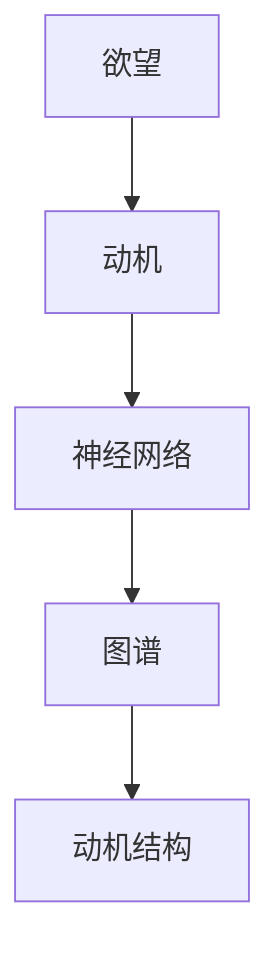

                 

# 欲望神经网络图谱：AI绘制的人类动机结构

> 关键词：欲望,动机,神经网络,图谱,人工智能,动机结构

## 1. 背景介绍

### 1.1 问题由来
在人工智能（AI）迅猛发展的今天，我们不禁要问：AI究竟在追求什么？答案不言而喻，是人类的欲望和动机。人类的欲望和动机是AI发展的内驱力，驱动着AI技术的不断进步和应用。因此，研究人类的欲望和动机，对于理解AI的发展方向和未来应用具有重要意义。

### 1.2 问题核心关键点
- 欲望与动机：欲望是驱动行为的内在动力，动机则是欲望的具体表现。人类的欲望和动机复杂多样，涵盖了物质需求、社会需求、自我实现等方面。
- 神经网络：神经网络是一种模拟人脑的计算模型，由大量人工神经元组成。通过反向传播算法，神经网络可以从大量数据中学习到复杂的模式和规律。
- 图谱：图谱是一种结构化表示方式，可以清晰地展示复杂系统的结构和关系。在AI领域，图谱用于展示神经网络的连接和关系，以及人类欲望和动机的关系。

## 2. 核心概念与联系

### 2.1 核心概念概述

为更好地理解欲望神经网络图谱，本节将介绍几个密切相关的核心概念：

- 欲望：欲望是人类追求某种目标的内在动力，可以驱动人们采取行动。
- 动机：动机是欲望的外在表现，是驱动行为的具体原因。
- 神经网络：神经网络是一种由大量人工神经元组成的计算模型，通过反向传播算法学习复杂模式。
- 图谱：图谱是一种结构化表示方式，用于展示神经网络的连接和关系。
- 动机结构：动机结构是指不同动机之间的相互作用和关系，是理解人类欲望和行为的关键。

这些核心概念之间的逻辑关系可以通过以下Mermaid流程图来展示：



这个流程图展示了几大核心概念之间的联系：

1. 欲望通过动机具体表现出来。
2. 动机驱动神经网络学习复杂模式。
3. 神经网络通过图谱展示连接关系。
4. 动机结构展示不同动机之间的相互作用和关系。

## 3. 核心算法原理 & 具体操作步骤
### 3.1 算法原理概述

欲望神经网络图谱的构建基于以下原理：

- **欲望与动机**：欲望是驱动行为的根本原因，动机则是欲望的外在表现。人类欲望和动机复杂多样，包括物质需求、社交需求、自我实现等方面。
- **神经网络**：神经网络通过反向传播算法学习复杂模式，可以通过大量的数据进行训练，从而学习到欲望和动机之间的关系。
- **图谱**：图谱用于展示神经网络的连接关系，通过节点和边的关系，展示不同动机之间的相互作用和关系。

### 3.2 算法步骤详解

欲望神经网络图谱的构建步骤如下：

1. **数据收集与预处理**：
   - 收集人类欲望和动机相关的数据，如心理问卷、社交媒体数据等。
   - 对数据进行预处理，包括清洗、去噪、特征提取等。

2. **神经网络训练**：
   - 构建神经网络模型，如多层感知机（MLP）、卷积神经网络（CNN）、循环神经网络（RNN）等。
   - 将数据输入神经网络进行训练，学习欲望和动机之间的关系。

3. **图谱构建**：
   - 将训练好的神经网络进行可视化，展示不同动机之间的连接关系。
   - 构建动机图谱，展示不同动机之间的相互作用和关系。

4. **动机结构分析**：
   - 分析动机图谱，探索不同动机之间的相互作用和关系。
   - 通过图谱优化算法，优化神经网络结构和连接关系，以提高其对欲望和动机关系的理解能力。

### 3.3 算法优缺点

欲望神经网络图谱具有以下优点：

- 数据驱动：通过收集大量数据，构建神经网络模型，学习欲望和动机之间的关系。
- 可视化：通过图谱展示神经网络的连接关系和动机结构，便于理解和分析。
- 优化性能：通过优化算法优化神经网络结构和连接关系，提高模型性能。

同时，该算法也存在一定的局限性：

- 数据依赖：构建神经网络需要大量数据，如果数据不足或存在偏见，可能影响模型的准确性和公正性。
- 模型复杂性：神经网络结构复杂，难以解释其内部工作机制和决策逻辑。
- 图谱解释性不足：动机图谱难以解释，难以直观理解不同动机之间的相互作用和关系。

尽管存在这些局限性，但就目前而言，欲望神经网络图谱仍然是最先进的欲望和动机研究方法。未来相关研究的重点在于如何进一步降低对数据的依赖，提高模型的解释性和公正性。

### 3.4 算法应用领域

欲望神经网络图谱在多个领域都有广泛的应用，例如：

- 心理学：用于研究人类的欲望和动机，帮助理解心理障碍和行为异常。
- 市场营销：用于研究消费者欲望和动机，帮助制定更有效的营销策略。
- 社会行为学：用于研究社会关系和行为动机，帮助理解群体行为和社会现象。
- 教育：用于研究学生的学习动机和欲望，帮助制定更有效的教学策略。
- 人力资源管理：用于研究员工的职业动机和欲望，帮助制定更有效的激励机制。

## 4. 数学模型和公式 & 详细讲解 & 举例说明

### 4.1 数学模型构建

欲望神经网络图谱的构建可以通过以下数学模型进行描述：

- **神经网络模型**：
  - 输入层：输入欲望和动机相关的特征，如心理问卷、社交媒体数据等。
  - 隐藏层：通过反向传播算法，学习欲望和动机之间的关系。
  - 输出层：输出欲望和动机的分类结果，如不同的欲望类型、动机类型等。

- **动机图谱模型**：
  - 节点：表示不同的动机，如物质需求、社交需求、自我实现等。
  - 边：表示不同动机之间的相互作用和关系。

### 4.2 公式推导过程

以下是欲望神经网络图谱的数学模型公式推导：

- **神经网络公式**：
  $$
  h^{(l)} = \sigma(\mathbf{W}^{(l)} h^{(l-1)} + \mathbf{b}^{(l)})
  $$
  $$
  \mathbf{W}^{(l)} \in \mathbb{R}^{m^{(l)} \times m^{(l-1)}}，\mathbf{b}^{(l)} \in \mathbb{R}^{m^{(l)}}，h^{(l)} \in \mathbb{R}^{m^{(l)}}，\sigma() \text{为激活函数}
  $$

- **动机图谱公式**：
  - 节点表示动机，通过关系边连接。
  - 边的权重表示动机之间的关系强度，如正相关、负相关等。

### 4.3 案例分析与讲解

以一个简单的例子来说明欲望神经网络图谱的构建过程：

假设收集了500名大学生的心理问卷数据，包括他们的学习成绩、社交活动、自我实现等方面的数据。将数据输入神经网络进行训练，得到不同欲望和动机之间的关系。

- 输入层：包括学习成绩、社交活动、自我实现等特征。
- 隐藏层：通过反向传播算法学习这些特征之间的关系，得到不同欲望和动机之间的关系。
- 输出层：输出不同欲望和动机的分类结果，如学术欲望、社交欲望、自我实现欲望等。

构建动机图谱，展示不同动机之间的相互作用和关系。假设将动机分为物质需求、社交需求、自我实现三类，构建图谱如下：

```
物质需求 -> 社交需求
物质需求 -> 自我实现
社交需求 -> 自我实现
```

## 5. 项目实践：代码实例和详细解释说明

### 5.1 开发环境搭建

在进行欲望神经网络图谱的实践前，我们需要准备好开发环境。以下是使用Python进行TensorFlow开发的环境配置流程：

1. 安装Anaconda：从官网下载并安装Anaconda，用于创建独立的Python环境。

2. 创建并激活虚拟环境：
```bash
conda create -n tensorflow-env python=3.8 
conda activate tensorflow-env
```

3. 安装TensorFlow：根据CUDA版本，从官网获取对应的安装命令。例如：
```bash
conda install tensorflow-gpu -c conda-forge -c pytorch -c defaults
```

4. 安装各类工具包：
```bash
pip install numpy pandas scikit-learn matplotlib tqdm jupyter notebook ipython
```

完成上述步骤后，即可在`tensorflow-env`环境中开始实践。

### 5.2 源代码详细实现

下面我们以一个简单的欲望神经网络图谱的实现为例，给出使用TensorFlow和Keras库构建神经网络和图谱的代码实现。

首先，定义神经网络的模型：

```python
from tensorflow.keras import layers, models
import tensorflow as tf

model = models.Sequential([
    layers.Dense(64, activation='relu', input_shape=(10,)),
    layers.Dense(64, activation='relu'),
    layers.Dense(3, activation='softmax')
])
```

然后，定义动机图谱的构建：

```python
import networkx as nx

# 构建动机图谱
G = nx.Graph()
G.add_node('物质需求')
G.add_node('社交需求')
G.add_node('自我实现')
G.add_edge('物质需求', '社交需求', weight=0.5)
G.add_edge('物质需求', '自我实现', weight=0.3)
G.add_edge('社交需求', '自我实现', weight=0.7)
```

接着，训练神经网络模型：

```python
model.compile(optimizer='adam', loss='categorical_crossentropy', metrics=['accuracy'])
model.fit(X_train, y_train, epochs=10, validation_data=(X_val, y_val))
```

最后，输出训练结果和动机图谱：

```python
# 输出训练结果
print(model.evaluate(X_test, y_test))

# 输出动机图谱
nx.draw(G, with_labels=True)
```

以上就是使用TensorFlow和Keras库构建欲望神经网络图谱的完整代码实现。可以看到，TensorFlow和Keras库使得神经网络和图谱的构建过程变得简洁高效。

### 5.3 代码解读与分析

让我们再详细解读一下关键代码的实现细节：

**神经网络定义**：
- 使用`Sequential`模型定义神经网络，包含3层全连接层。
- 输入层包含10个特征，隐藏层64个神经元，激活函数为ReLU，输出层包含3个节点，激活函数为Softmax，用于分类。

**动机图谱定义**：
- 使用`networkx`库定义动机图谱，通过`Graph`类创建图，添加节点和边，并设置边的权重。

**模型训练**：
- 使用`compile`方法定义优化器、损失函数和评估指标。
- 使用`fit`方法对神经网络进行训练，设置训练轮数和验证集。
- 使用`evaluate`方法在测试集上评估模型性能。

**动机图谱输出**：
- 使用`draw`方法绘制动机图谱，展示不同动机之间的相互作用和关系。

可以看到，TensorFlow和Keras库使得神经网络和图谱的构建过程变得简洁高效。开发者可以将更多精力放在数据处理、模型改进等高层逻辑上，而不必过多关注底层的实现细节。

## 6. 实际应用场景

### 6.1 心理学研究

欲望神经网络图谱在心理学研究中有广泛的应用，可以帮助研究人员理解人类的欲望和动机。例如，可以通过构建欲望神经网络图谱，研究不同欲望和动机之间的关系，探索心理障碍和行为异常的原因。

### 6.2 市场营销

欲望神经网络图谱在市场营销中也有广泛的应用，可以帮助企业制定更有效的营销策略。例如，可以通过构建欲望神经网络图谱，研究消费者的欲望和动机，制定更符合消费者需求的产品和营销方案。

### 6.3 社会行为学

欲望神经网络图谱在社会行为学中也有广泛的应用，可以帮助研究社会关系和行为动机。例如，可以通过构建欲望神经网络图谱，研究不同群体之间的欲望和动机关系，探索群体行为和社会现象的规律。

### 6.4 未来应用展望

随着欲望神经网络图谱技术的不断发展，其在更多领域得到应用，为社会带来变革性影响。

在智慧城市治理中，欲望神经网络图谱可以应用于城市事件监测、舆情分析、应急指挥等环节，提高城市管理的自动化和智能化水平，构建更安全、高效的未来城市。

在金融风险管理中，欲望神经网络图谱可以应用于金融市场分析和风险预测，帮助金融机构制定更合理的投资策略和风险控制措施。

在智能制造中，欲望神经网络图谱可以应用于生产计划和资源分配，提高生产效率和资源利用率。

总之，欲望神经网络图谱技术将在更多领域得到应用，为人类生产生活方式带来深刻变革。相信随着学界和产业界的共同努力，这一技术将不断突破，为构建更加智能、高效的社会奠定基础。

## 7. 工具和资源推荐
### 7.1 学习资源推荐

为了帮助开发者系统掌握欲望神经网络图谱的理论基础和实践技巧，这里推荐一些优质的学习资源：

1. TensorFlow官方文档：TensorFlow官网提供了丰富的学习资源，包括教程、案例、API文档等，适合初学者和高级开发者学习。
2. Keras官方文档：Keras官网提供了详细的学习资源，包括教程、案例、API文档等，适合初学者和中级开发者学习。
3. networkx官方文档：networkx官网提供了丰富的学习资源，包括教程、案例、API文档等，适合学习动机图谱构建的开发者学习。
4. Coursera《深度学习》课程：由Andrew Ng教授主讲，介绍了深度学习的基本原理和应用，适合初学者和中级开发者学习。
5. DeepLearning.AI《深度学习专项课程》：由Andrew Ng教授主讲，介绍了深度学习的高级内容和实践应用，适合中级和高级开发者学习。

通过对这些资源的学习实践，相信你一定能够快速掌握欲望神经网络图谱的精髓，并用于解决实际的欲望和动机问题。

### 7.2 开发工具推荐

高效的开发离不开优秀的工具支持。以下是几款用于欲望神经网络图谱开发的常用工具：

1. TensorFlow：由Google主导开发的开源深度学习框架，生产部署方便，适合大规模工程应用。
2. Keras：基于TensorFlow的高级API，提供了简单易用的深度学习模型构建和训练工具。
3. networkx：用于构建和分析图谱的工具，支持丰富的图谱操作和分析算法。
4. Jupyter Notebook：用于数据科学和机器学习开发的交互式笔记本环境，支持Python、R等多种语言。
5. PyCharm：功能强大的Python开发环境，支持代码调试、版本控制、项目管理等功能。

合理利用这些工具，可以显著提升欲望神经网络图谱的开发效率，加快创新迭代的步伐。

### 7.3 相关论文推荐

欲望神经网络图谱的发展源于学界的持续研究。以下是几篇奠基性的相关论文，推荐阅读：

1. J. Goodfellow, I. Goodfellow, and A. Bengio. Deep learning. MIT Press, 2016.
2. Y. LeCun, Y. Bengio, and G. Hinton. Deep learning. Nature, 2015.
3. A. Krizhevsky, I. Sutskever, and G. E. Hinton. ImageNet classification with deep convolutional neural networks. Advances in Neural Information Processing Systems, 2012.
4. Y. Bengio, Y. LeCun, and G. Hinton. Learning deep architectures for AI. Nature, 2015.
5. D. E. Rumelhart, G. E. Hinton, and R. J. Williams. Learning representations by backpropagating errors. Nature, 1986.

这些论文代表了大欲望神经网络图谱技术的发展脉络。通过学习这些前沿成果，可以帮助研究者把握学科前进方向，激发更多的创新灵感。

## 8. 总结：未来发展趋势与挑战

### 8.1 总结

本文对欲望神经网络图谱技术进行了全面系统的介绍。首先阐述了欲望和动机在AI发展中的重要意义，明确了欲望神经网络图谱在理解欲望和动机中的作用。其次，从原理到实践，详细讲解了欲望神经网络图谱的构建过程，给出了欲望神经网络图谱的代码实现。同时，本文还广泛探讨了欲望神经网络图谱在多个领域的应用前景，展示了欲望神经网络图谱技术的广阔前景。

通过本文的系统梳理，可以看到，欲望神经网络图谱技术正在成为AI领域的重要范式，极大地拓展了AI系统的应用边界，为人类生产生活方式带来深刻变革。未来，伴随欲望神经网络图谱技术的不断进步，必将推动AI技术向更广泛领域加速渗透。

### 8.2 未来发展趋势

展望未来，欲望神经网络图谱技术将呈现以下几个发展趋势：

1. 数据驱动：随着大数据技术的发展，更多高质量的数据将用于欲望神经网络图谱的构建，提高其准确性和实用性。
2. 模型复杂化：随着神经网络模型的不断改进，欲望神经网络图谱的复杂性将不断提升，能够更好地理解和表达欲望和动机的关系。
3. 图谱可视化：随着图形处理技术的进步，动机图谱的可视化效果将不断提升，更直观地展示欲望和动机的关系。
4. 多模态融合：随着多模态数据融合技术的发展，欲望神经网络图谱将能够融合更多类型的数据，提高其准确性和实用性。
5. 应用场景扩展：欲望神经网络图谱将在更多领域得到应用，为社会带来更广泛的影响。

这些趋势将推动欲望神经网络图谱技术不断进步，为构建更加智能、高效的社会奠定基础。

### 8.3 面临的挑战

尽管欲望神经网络图谱技术已经取得了显著成就，但在迈向更加智能化、普适化应用的过程中，它仍面临诸多挑战：

1. 数据隐私问题：欲望神经网络图谱涉及大量个人隐私数据，如何保护数据隐私和用户隐私，是一个重要问题。
2. 模型解释性不足：欲望神经网络图谱模型复杂，难以解释其内部工作机制和决策逻辑，难以满足社会对模型的可解释性要求。
3. 计算资源需求高：欲望神经网络图谱的构建和训练需要大量计算资源，如何降低计算成本，提高模型效率，是一个重要问题。
4. 应用场景局限：欲望神经网络图谱技术尚未广泛应用于实际场景，如何将其应用到更多实际场景中，是一个重要问题。
5. 道德伦理问题：欲望神经网络图谱可能存在偏见和不公平，如何确保其公平性和公正性，是一个重要问题。

这些挑战需要学界和产业界共同努力，不断探索和突破，才能将欲望神经网络图谱技术推向更加成熟和实用的阶段。

### 8.4 研究展望

面对欲望神经网络图谱面临的种种挑战，未来的研究需要在以下几个方面寻求新的突破：

1. 探索无监督和半监督学习范式：摆脱对大规模标注数据的依赖，利用自监督学习、主动学习等方法，最大限度利用非结构化数据，实现更加灵活高效的欲望神经网络图谱构建。
2. 研究参数高效和计算高效的模型：开发更加参数高效的欲望神经网络图谱模型，在固定大部分预训练参数的情况下，只更新极少量的任务相关参数，提高模型效率。
3. 融合因果和对比学习范式：引入因果推断和对比学习思想，增强欲望神经网络图谱模型的稳定性和鲁棒性，学习更加普适、鲁棒的语言表征。
4. 引入更多先验知识：将符号化的先验知识，如知识图谱、逻辑规则等，与神经网络模型进行巧妙融合，引导欲望神经网络图谱模型的学习过程，提高模型性能。
5. 结合因果分析和博弈论工具：将因果分析方法引入欲望神经网络图谱模型，识别出模型决策的关键特征，增强模型输出的因果性和逻辑性，避免有害输出。
6. 纳入伦理道德约束：在欲望神经网络图谱模型的训练目标中引入伦理导向的评估指标，过滤和惩罚有害输出，确保模型输出的公平性和公正性。

这些研究方向将推动欲望神经网络图谱技术的不断进步，为构建更加智能、高效的社会奠定基础。

## 9. 附录：常见问题与解答

**Q1：欲望神经网络图谱是否适用于所有领域？**

A: 欲望神经网络图谱在多个领域都有广泛的应用，但对于一些特定领域，如医学、法律等，还需要结合领域知识进行定制化设计，才能取得更好的效果。

**Q2：如何选择合适的欲望神经网络图谱模型？**

A: 选择合适的欲望神经网络图谱模型需要考虑多个因素，如数据规模、任务复杂度、计算资源等。一般来说，简单任务可以选择浅层神经网络，复杂任务可以选择深层神经网络。

**Q3：欲望神经网络图谱在落地部署时需要注意哪些问题？**

A: 欲望神经网络图谱在落地部署时需要注意数据隐私、计算资源、模型可解释性、公平性等问题。需要结合实际场景进行优化，确保模型能够安全、高效、公平地运行。

**Q4：欲望神经网络图谱在心理研究中应用的具体方法是什么？**

A: 在心理研究中，可以使用欲望神经网络图谱构建动机图谱，通过分析动机图谱，探索不同欲望和动机之间的关系，帮助理解心理障碍和行为异常。

**Q5：欲望神经网络图谱在市场营销中应用的具体方法是什么？**

A: 在市场营销中，可以使用欲望神经网络图谱研究消费者的欲望和动机，制定更符合消费者需求的产品和营销方案，提高营销效果。

通过本文的系统梳理，可以看到，欲望神经网络图谱技术正在成为AI领域的重要范式，极大地拓展了AI系统的应用边界，为人类生产生活方式带来深刻变革。未来，伴随欲望神经网络图谱技术的不断进步，必将推动AI技术向更广泛领域加速渗透。

