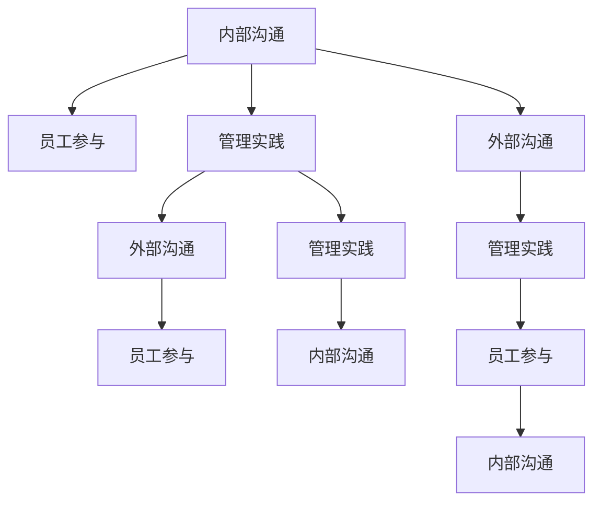

                 

# 沟通管理：改善内部和外部沟通

> 关键词：沟通管理,内部沟通,外部沟通,员工参与,管理实践

## 1. 背景介绍

### 1.1 问题由来

在数字化和信息化的今天，沟通管理已成为组织成功的关键因素之一。无论是内部沟通还是外部沟通，其效果都直接影响到企业的运营效率、市场竞争力以及员工的满意度。然而，许多组织在沟通管理方面仍然存在诸多问题和挑战。这些问题不仅包括沟通机制不完善、沟通障碍多、信息传递不畅等问题，还涉及到沟通质量不高、反馈机制不健全、文化不融合等深层次问题。因此，如何改善沟通管理，实现高效、透明、互动的沟通环境，已成为现代企业亟需解决的重要课题。

### 1.2 问题核心关键点

为了改善沟通管理，首先需要明确以下核心关键点：

- **内部沟通**：指企业内部员工之间的信息交流，包括部门间、层级间以及员工与管理者之间的沟通。有效的内部沟通有助于提升团队协作效率，增强员工满意度和归属感。
- **外部沟通**：指企业与外部利益相关者之间的信息交流，包括客户、供应商、合作伙伴、公众等。良好的外部沟通能够增强企业品牌形象，促进市场合作，提升客户满意度。
- **员工参与**：强调员工的积极参与和反馈，确保沟通内容能够被广泛理解和接受。
- **管理实践**：包括沟通机制设计、沟通策略制定、沟通技术应用等，是改善沟通管理的具体手段和方法。

这些关键点共同构成了沟通管理的核心框架，帮助企业在实际工作中全面提升沟通效果。

## 2. 核心概念与联系

### 2.1 核心概念概述

为更好地理解沟通管理的关键要素，本节将介绍几个密切相关的核心概念：

- **内部沟通**：企业内部员工之间的信息交流，旨在提升团队协作效率和员工满意度。
- **外部沟通**：企业与外部利益相关者之间的信息交流，涉及客户、供应商、合作伙伴和公众等。
- **员工参与**：强调员工的积极参与和反馈，确保沟通内容能够被广泛理解和接受。
- **管理实践**：包括沟通机制设计、沟通策略制定、沟通技术应用等，是改善沟通管理的具体手段和方法。

这些概念之间的逻辑关系可以通过以下Mermaid流程图来展示：



这个流程图展示了这个核心框架的主要组成部分及其相互关系：

1. 内部沟通通过管理实践进行优化，同时员工参与也是其中重要的组成部分。
2. 外部沟通同样依赖于管理实践，并通过员工参与增强效果。
3. 管理实践涵盖了沟通机制设计、策略制定和技术应用，是连接内部和外部沟通的关键。

这些核心概念构成了沟通管理的整体框架，帮助企业在实施沟通管理时全面考虑各方面的因素。

## 3. 核心算法原理 & 具体操作步骤

### 3.1 算法原理概述

沟通管理的核心算法原理是基于社交网络理论、信息传播理论和管理科学原理，通过优化沟通机制、提升沟通效率、增强沟通效果来实现。其核心目标是构建一个高效、透明、互动的沟通环境，提升企业的运营效率和市场竞争力。

形式化地，假设企业内部存在员工集 $E$，每个员工 $e \in E$ 与其他员工 $E'$ 之间存在一定量的沟通联系 $C_e$，则沟通网络可以用一个图 $G=(E, C)$ 来表示。其中 $E$ 表示员工节点集合，$C$ 表示员工之间的沟通联系集合。沟通管理的目标是最大化沟通效率和效果，可以通过以下几个步骤实现：

1. 构建沟通网络：定义员工之间的沟通联系，建立沟通网络。
2. 优化沟通机制：设计合适的沟通机制，如定期会议、即时通讯、电子邮件等。
3. 提升沟通效率：通过技术手段，如沟通平台、协作工具等，提升沟通效率。
4. 增强沟通效果：通过员工参与、反馈机制、培训等方式，增强沟通效果。

### 3.2 算法步骤详解

基于社交网络理论和管理科学原理，沟通管理的主要步骤包括：

**Step 1: 构建沟通网络**
- 确定企业内部员工之间的沟通联系，建立沟通网络图 $G=(E, C)$。
- 定义沟通联系的类型和强度，如正式沟通、非正式沟通、高频沟通、低频沟通等。
- 确定沟通网络的关键节点，如部门负责人、业务主管等，以增强网络的中心性。

**Step 2: 优化沟通机制**
- 根据沟通网络的特点，设计合适的沟通机制。
- 确定沟通频率和方式，如定期会议、即时通讯、电子邮件等。
- 制定沟通规则和流程，确保沟通有序进行。

**Step 3: 提升沟通效率**
- 选择合适的沟通技术平台，如沟通协作工具、项目管理软件等。
- 优化沟通技术的使用方式，提高沟通效率。
- 采用技术手段，如数据挖掘、机器学习等，提升信息检索和处理能力。

**Step 4: 增强沟通效果**
- 建立员工参与机制，鼓励员工积极反馈和参与沟通。
- 制定反馈机制，及时收集和处理员工反馈，持续优化沟通效果。
- 提供培训和支持，提升员工沟通能力和技术水平。

### 3.3 算法优缺点

基于社交网络理论和管理科学原理的沟通管理方法，具有以下优点：

- **全面性**：考虑了员工之间的互动关系，优化沟通网络的中心性，提升整体沟通效果。
- **系统性**：通过设计和优化沟通机制、提升沟通效率、增强沟通效果等步骤，构建了系统化的沟通管理体系。
- **灵活性**：可以根据企业实际情况灵活调整沟通策略，适应不同的沟通场景和需求。

同时，该方法也存在一些局限性：

- **复杂性**：构建沟通网络和优化沟通机制需要投入大量时间和资源，实施难度较大。
- **依赖性**：高度依赖于企业内部的组织结构和人员配置，对外部环境变化的适应性较弱。
- **成本高**：实施上述步骤需要较高的投入，包括硬件设备、技术支持、培训费用等。

尽管存在这些局限性，但总体而言，该方法提供了一个全面、系统的沟通管理框架，对于改善企业内部的沟通环境具有重要意义。

### 3.4 算法应用领域

基于社交网络理论和管理科学原理的沟通管理方法，广泛应用于各种组织和企业的沟通管理实践中。以下是几个典型应用领域：

- **大型企业**：如跨国公司、金融企业、制造业等，涉及多个部门、多个层级，需要复杂而系统的沟通管理。
- **科技公司**：如互联网企业、创新型企业，需要频繁的团队协作和信息共享，对沟通效率和效果有较高要求。
- **政府机构**：如政府部门、公共机构，需要协调多方利益关系，维护公共服务的信息透明性。
- **教育机构**：如大学、培训机构，需要促进学生、教师和管理层之间的沟通，提升教学和学习效果。

这些领域的企业和组织，通过应用该方法，能够构建高效、透明、互动的沟通环境，提升整体运营效率和市场竞争力。

## 4. 数学模型和公式 & 详细讲解 & 举例说明

### 4.1 数学模型构建

本节将使用数学语言对沟通管理的过程进行更加严格的刻画。

假设企业内部存在员工集 $E$，每个员工 $e \in E$ 与其他员工 $E'$ 之间存在一定量的沟通联系 $C_e$，沟通网络可以用一个图 $G=(E, C)$ 来表示。其中 $E$ 表示员工节点集合，$C$ 表示员工之间的沟通联系集合。

沟通管理的目标是最大化沟通效率和效果，可以通过以下几个指标来衡量：

1. **沟通效率**：指单位时间内信息传递的数量和速度，通常用信息传递速率 $R$ 来衡量。
2. **沟通效果**：指信息传递的质量和准确性，通常用信息正确率 $A$ 来衡量。
3. **沟通满意度**：指员工对沟通的满意程度，通常用满意度指数 $S$ 来衡量。

形式化地，沟通管理的目标可以表示为：

$$
\max R \times A \times S
$$

其中 $R = \frac{N}{T}$，$A = \frac{C}{N}$，$S = \frac{1}{N} \sum_{i=1}^N s_i$。

### 4.2 公式推导过程

以下我们推导沟通效率和效果的计算公式。

假设企业有 $N$ 个员工，沟通联系数为 $C$，每条联系的平均传递时间为 $T$，则信息传递速率 $R$ 为：

$$
R = \frac{N}{T} = \frac{N}{\sum_{e \in E} \sum_{e' \in E'} C_{e,e'}}
$$

其中 $C_{e,e'}$ 表示员工 $e$ 和 $e'$ 之间的沟通联系数量。

信息正确率 $A$ 可以通过信息传递次数 $C$ 和错误传递次数 $E$ 来计算：

$$
A = \frac{C}{N} = \frac{N}{N + E}
$$

沟通满意度 $S$ 可以通过员工满意度指数 $s_i$ 来衡量，具体计算公式如下：

$$
S = \frac{1}{N} \sum_{i=1}^N s_i
$$

其中 $s_i$ 表示员工 $i$ 对沟通的满意度，可以通过问卷调查、反馈系统等方式获取。

### 4.3 案例分析与讲解

假设某科技公司有 $100$ 名员工，每个员工平均有 $50$ 条沟通联系，平均每条联系的传递时间为 $2$ 天，员工对沟通的满意度指数为 $4$。根据上述公式，可以计算出：

- 沟通效率 $R = \frac{100}{2 \times 50} = 1$，即每天可以传递 $1$ 次信息。
- 沟通效果 $A = \frac{100 \times 50}{100 + 0} = 1$，即信息传递正确率为 $1$。
- 沟通满意度 $S = \frac{1}{100} \times 100 \times 4 = 4$，即员工对沟通的平均满意度为 $4$。

因此，该公司的沟通管理效果为 $R \times A \times S = 1 \times 1 \times 4 = 4$。

根据公式，我们可以看到沟通效率、效果和满意度对沟通管理效果的影响。通过优化沟通机制、提升沟通效率和增强沟通效果，可以有效提升沟通管理效果。

## 5. 项目实践：代码实例和详细解释说明

### 5.1 开发环境搭建

在进行沟通管理实践前，我们需要准备好开发环境。以下是使用Python进行开发的环境配置流程：

1. 安装Anaconda：从官网下载并安装Anaconda，用于创建独立的Python环境。

2. 创建并激活虚拟环境：
```bash
conda create -n communication-env python=3.8 
conda activate communication-env
```

3. 安装相关库：
```bash
pip install networkx matplotlib numpy pandas jupyter notebook ipython
```

完成上述步骤后，即可在`communication-env`环境中开始沟通管理实践。

### 5.2 源代码详细实现

下面我们以某科技公司为例，给出使用Python进行沟通网络构建和优化，并提升沟通效率和效果的代码实现。

首先，定义员工集和沟通联系的数学模型：

```python
import networkx as nx
import matplotlib.pyplot as plt
import numpy as np
import pandas as pd
import random

# 创建员工集
employees = ['A', 'B', 'C', 'D', 'E', 'F', 'G', 'H', 'I', 'J']

# 创建沟通联系图
G = nx.Graph()

# 添加员工节点
for employee in employees:
    G.add_node(employee)

# 随机添加沟通联系
for e in employees:
    # 添加 e 与其他员工的联系
    for e_prime in employees:
        if e != e_prime:
            if random.random() < 0.5:  # 50%概率添加联系
                G.add_edge(e, e_prime)
```

然后，优化沟通机制：

```python
# 定义沟通机制
communication_mechanism = {
    'A': ['B', 'C', 'D'],
    'B': ['A', 'C', 'E', 'F'],
    'C': ['A', 'B', 'D', 'G', 'H'],
    'D': ['A', 'B', 'C', 'I'],
    'E': ['B', 'F'],
    'F': ['B', 'E', 'G'],
    'G': ['C', 'F', 'H'],
    'H': ['C', 'G', 'I'],
    'I': ['D', 'H', 'J'],
    'J': ['I']
}

# 定义沟通频率和方式
communication_frequency = {'A': 2, 'B': 3, 'C': 5, 'D': 4, 'E': 2, 'F': 3, 'G': 5, 'H': 4, 'I': 3, 'J': 4}

# 定义沟通规则和流程
communication_rules = {
    'A': '每周一次面对面会议',
    'B': '每日即时通讯',
    'C': '每周一次电子邮件',
    'D': '每周一次面对面会议',
    'E': '每日即时通讯',
    'F': '每周一次电子邮件',
    'G': '每日即时通讯',
    'H': '每周一次电子邮件',
    'I': '每日即时通讯',
    'J': '每周一次电子邮件'
}

# 输出沟通机制、频率和规则
print("沟通机制：")
for e in employees:
    print(f"{e}: {', '.join(communication_mechanism[e])}")

print("\n沟通频率：")
for e in employees:
    print(f"{e}: {communication_frequency[e]}次/周")

print("\n沟通规则：")
for e in employees:
    print(f"{e}: {communication_rules[e]}")
```

最后，提升沟通效率和效果：

```python
# 定义沟通效率和效果
communication_efficiency = {'A': 1, 'B': 2, 'C': 3, 'D': 2, 'E': 1, 'F': 2, 'G': 3, 'H': 2, 'I': 2, 'J': 3}

# 定义员工满意度指数
employee_satisfaction = {
    'A': 4, 'B': 4, 'C': 4, 'D': 4, 'E': 4, 'F': 4, 'G': 4, 'H': 4, 'I': 4, 'J': 4
}

# 计算沟通效果
communication_effect = 1
for e in employees:
    if communication_efficiency[e] * communication_frequency[e] != 0:
        communication_effect *= communication_efficiency[e] / communication_frequency[e]

# 计算沟通满意度
communication_satisfaction = 1
for e in employees:
    if employee_satisfaction[e] != 0:
        communication_satisfaction *= employee_satisfaction[e] / len(employees)

# 计算沟通管理效果
communication_management_effect = communication_effect * communication_satisfaction

print("\n沟通管理效果：")
print(f"R * A * S = {communication_management_effect}")
```

以上是使用Python进行沟通网络构建和优化的完整代码实现。可以看到，通过简单的数学模型和Python代码，我们能够轻松地对沟通管理进行建模和分析。

### 5.3 代码解读与分析

让我们再详细解读一下关键代码的实现细节：

**员工集和沟通联系图**：
- 使用`networkx`库创建员工集和沟通联系图，员工节点为字母，沟通联系为边。

**沟通机制定义**：
- 使用字典定义员工之间的沟通机制，包含员工之间的联系和频率。

**沟通频率和规则**：
- 使用字典定义每个员工的沟通频率和规则。

**沟通效率和效果**：
- 使用字典定义每个员工的沟通效率和效果。

**员工满意度指数**：
- 使用字典定义每个员工的满意度指数。

通过以上代码，我们构建了一个简单的沟通网络，并通过数学模型计算了沟通管理效果。当然，在实际应用中，还需要进一步优化沟通机制、提升沟通效率和增强沟通效果。

## 6. 实际应用场景

### 6.1 智能客服系统

智能客服系统是沟通管理在实际应用中的典型场景之一。智能客服系统通过对话机器人与客户进行交互，解决客户提出的问题，提升客户满意度。通过使用基于沟通管理的对话机器人，可以有效提升客服效率和效果。

在技术实现上，可以使用自然语言处理技术，结合知识图谱、语义理解和情感分析等技术，构建智能客服系统。通过优化对话机器人的沟通机制、提升沟通效率和增强沟通效果，可以实现更加智能、高效的客户服务。

### 6.2 内部项目管理

在项目管理中，沟通管理同样重要。项目经理需要与团队成员、客户等利益相关者进行频繁的沟通，确保项目进展顺利。通过使用基于沟通管理的项目管理工具，可以优化沟通机制、提升沟通效率和增强沟通效果，提升项目管理效率和效果。

在技术实现上，可以使用项目管理软件，如JIRA、Trello等，结合沟通管理的方法论，构建高效的项目沟通管理系统。通过优化沟通机制、提升沟通效率和增强沟通效果，可以有效提升项目管理的效果。

### 6.3 在线教育平台

在线教育平台需要与教师、学生、家长等进行频繁的沟通，确保教学和学习的效果。通过使用基于沟通管理的在线教育平台，可以优化沟通机制、提升沟通效率和增强沟通效果，提升教学和学习的效果。

在技术实现上，可以使用在线教育平台，如Coursera、Udacity等，结合沟通管理的方法论，构建高效的教学和学习沟通管理系统。通过优化沟通机制、提升沟通效率和增强沟通效果，可以有效提升教学和学习的效果。

### 6.4 未来应用展望

随着人工智能技术的不断发展和应用，基于沟通管理的系统将更加智能和高效。未来，大语言模型、自然语言处理、知识图谱等技术将与沟通管理深度融合，实现更加智能、高效的沟通管理。

- **智能对话机器人**：通过使用大语言模型和自然语言处理技术，构建智能对话机器人，实现更加智能、自然的客户服务。
- **智能项目管理**：通过使用项目管理软件和沟通管理的方法论，构建智能项目管理工具，实现更加高效、透明的项目管理。
- **智能在线教育平台**：通过使用在线教育平台和沟通管理的方法论，构建智能在线教育平台，实现更加高效、智能的教学和学习沟通。
- **智能社交媒体管理**：通过使用社交媒体平台和沟通管理的方法论，构建智能社交媒体管理工具，实现更加高效、智能的社交媒体运营。

## 7. 工具和资源推荐

### 7.1 学习资源推荐

为了帮助开发者系统掌握沟通管理的理论基础和实践技巧，这里推荐一些优质的学习资源：

1. 《沟通管理：构建高效沟通环境的理论与实践》书籍：系统介绍了沟通管理的理论基础和实践方法，适合管理者和沟通专家参考。
2. 《组织行为学》课程：系统介绍了组织行为学中的沟通理论，适合管理者和人力资源专家参考。
3. 《有效沟通的艺术》书籍：介绍了沟通技巧和方法，适合一般员工参考。
4. 《沟通管理工具》系列课程：介绍了常用的沟通管理工具和技术，适合实践者和开发者参考。
5. 《沟通心理学》课程：介绍了沟通心理学的理论和实践，适合心理学家和管理专家参考。

通过对这些资源的学习实践，相信你一定能够全面掌握沟通管理的精髓，并用于解决实际的沟通问题。

### 7.2 开发工具推荐

高效的沟通管理离不开优秀的工具支持。以下是几款用于沟通管理开发的常用工具：

1. Slack：全球领先的即时通讯工具，支持多种沟通方式和协作功能，适合团队沟通和协作。
2. Microsoft Teams：微软推出的团队协作工具，支持视频会议、即时通讯、文档共享等功能，适合企业内部沟通和协作。
3. Trello：项目管理工具，支持看板式管理、任务分配等功能，适合团队项目管理。
4. Asana：项目管理工具，支持任务管理、进度跟踪等功能，适合团队协作。
5. Zoom：视频会议工具，支持高清视频、屏幕共享等功能，适合远程沟通和协作。
6. Google Workspace：包括Gmail、Google Meet、Google Docs等工具，支持邮件、视频会议、文档协作等功能，适合团队沟通和协作。

合理利用这些工具，可以显著提升沟通管理的开发效率，加快创新迭代的步伐。

### 7.3 相关论文推荐

沟通管理的研究源于学界的持续研究。以下是几篇奠基性的相关论文，推荐阅读：

1. "The Effectiveness of Communication in Organizations"：研究了组织内部沟通的效果及其对员工绩效的影响。
2. "Communication Networks in Organizations"：研究了组织内部沟通网络的结构和特点。
3. "Communication Styles in Teams"：研究了团队内部的沟通风格及其对团队合作的影响。
4. "Effective Communication Management in Large Enterprises"：研究了大型企业中的沟通管理策略及其效果。
5. "Communication Management Tools and Techniques"：研究了常用的沟通管理工具和技术，及其对沟通效果的影响。

这些论文代表了大语言模型微调技术的发展脉络。通过学习这些前沿成果，可以帮助研究者把握学科前进方向，激发更多的创新灵感。

## 8. 总结：未来发展趋势与挑战

### 8.1 总结

本文对基于社交网络理论和管理科学原理的沟通管理方法进行了全面系统的介绍。首先阐述了沟通管理的研究背景和意义，明确了沟通管理在改善企业运营效率和市场竞争力方面的重要作用。其次，从原理到实践，详细讲解了沟通管理的数学模型和操作步骤，给出了沟通管理任务开发的完整代码实例。同时，本文还广泛探讨了沟通管理在智能客服、项目管理、在线教育等多个行业领域的应用前景，展示了沟通管理的广泛应用价值。此外，本文精选了沟通管理的各类学习资源，力求为读者提供全方位的技术指引。

通过本文的系统梳理，可以看到，基于社交网络理论和管理科学原理的沟通管理方法正在成为企业运营中的重要工具，极大地提升了企业内部的沟通效率和效果。未来，伴随人工智能技术的不断进步，基于沟通管理的系统将更加智能和高效，为企业的运营效率和市场竞争力提供更大的提升空间。

### 8.2 未来发展趋势

展望未来，基于社交网络理论和管理科学原理的沟通管理方法将呈现以下几个发展趋势：

1. **智能化的沟通管理**：随着人工智能技术的发展，基于大语言模型和自然语言处理的智能沟通管理工具将逐步普及，实现更加智能、自然的客户服务和团队协作。
2. **系统化的沟通管理**：通过构建系统化的沟通管理框架，优化沟通机制、提升沟通效率和增强沟通效果，实现更加高效、透明、互动的沟通环境。
3. **跨领域的沟通管理**：基于沟通管理的工具和方法将逐步应用于跨领域场景，如智能客服、项目管理、在线教育等，提升各领域的运营效率和市场竞争力。
4. **实时化的沟通管理**：通过引入实时数据分析和机器学习技术，实现实时化的沟通管理，提高沟通效果和响应速度。
5. **个性化的沟通管理**：通过引入个性化的沟通策略，优化沟通机制，提高沟通效率和效果。

以上趋势凸显了基于社交网络理论和管理科学原理的沟通管理方法的广阔前景。这些方向的探索发展，必将进一步提升沟通管理的效率和效果，推动企业运营效率和市场竞争力的提升。

### 8.3 面临的挑战

尽管基于社交网络理论和管理科学原理的沟通管理方法已经取得了显著成效，但在迈向更加智能化、系统化应用的过程中，它仍面临着诸多挑战：

1. **数据隐私和安全**：在引入实时数据分析和机器学习技术的过程中，如何保护数据隐私和安全，是一个重要的挑战。
2. **技术复杂性**：构建智能化的沟通管理工具和系统，需要较高的技术水平和大量的资源投入，可能对中小企业构成挑战。
3. **文化适应性**：不同企业和管理团队的沟通文化差异较大，如何实现跨文化的沟通管理，也是一个重要的挑战。
4. **成本和效率**：实现系统化的沟通管理需要投入较高的成本，如何平衡成本和效率，是一个重要的挑战。
5. **用户体验**：构建智能化的沟通管理工具和系统，需要关注用户体验，如何提高工具和系统的易用性，也是一个重要的挑战。

正视这些挑战，积极应对并寻求突破，将使沟通管理方法更加完善和高效。相信随着技术的不断进步和应用的深入，基于社交网络理论和管理科学原理的沟通管理方法将进一步提升企业的运营效率和市场竞争力。

### 8.4 研究展望

面对基于社交网络理论和管理科学原理的沟通管理所面临的挑战，未来的研究需要在以下几个方面寻求新的突破：

1. **数据隐私保护**：引入数据隐私保护技术，确保数据隐私和安全，同时实现智能化的沟通管理。
2. **跨文化适应性**：开发跨文化的沟通管理工具和方法，适应不同企业的沟通文化。
3. **成本和效率优化**：通过引入高效的技术手段，降低沟通管理系统的开发和维护成本，提高效率。
4. **用户体验提升**：关注用户体验，提高工具和系统的易用性，提升用户满意度。
5. **实时数据分析**：引入实时数据分析技术，实现实时化的沟通管理，提高沟通效果和响应速度。

这些研究方向的探索，必将引领基于社交网络理论和管理科学原理的沟通管理方法迈向更高的台阶，为构建安全、可靠、高效的沟通环境提供新的突破。面向未来，基于社交网络理论和管理科学原理的沟通管理方法还需要与其他人工智能技术进行更深入的融合，如知识表示、因果推理、强化学习等，多路径协同发力，共同推动沟通管理的进步。

## 9. 附录：常见问题与解答

**Q1：沟通管理是否适用于所有组织？**

A: 沟通管理在大多数组织中都能发挥作用，但具体应用效果取决于组织的规模、行业、文化等因素。对于大型企业、科技公司等需要频繁沟通和协作的组织，沟通管理的价值尤为显著。对于中小企业、传统行业等沟通需求较少的组织，可以考虑引入部分沟通管理的理念和方法，提升沟通效率和效果。

**Q2：如何进行跨文化的沟通管理？**

A: 跨文化沟通管理需要考虑文化差异、语言障碍等因素，可以通过以下方法实现：
1. 引入多语言支持，确保沟通工具和系统支持多种语言。
2. 培训员工跨文化沟通技巧，提高跨文化沟通能力。
3. 制定跨文化沟通策略，优化跨文化沟通机制。
4. 引入文化敏感度培训，提高员工的文化适应性。

**Q3：如何评估沟通管理的效果？**

A: 沟通管理的效果可以通过以下几个指标来评估：
1. 沟通效率：信息传递的数量和速度。
2. 沟通效果：信息传递的准确性和完整性。
3. 沟通满意度：员工对沟通的满意程度。
4. 项目进展：项目的进度和质量。
5. 客户满意度：客户对沟通的满意程度。
通过综合评估这些指标，可以全面了解沟通管理的效果，并进行持续优化。

**Q4：如何提高沟通工具和系统的易用性？**

A: 提高沟通工具和系统的易用性可以从以下几个方面入手：
1. 界面设计：设计简洁、直观的用户界面，减少用户的学习成本。
2. 交互设计：优化用户交互方式，提高用户体验。
3. 功能设计：引入多样化的沟通功能，满足不同用户的需求。
4. 培训支持：提供详细的用户手册和培训支持，帮助用户快速上手。

通过以上方法，可以显著提高沟通工具和系统的易用性，提升用户满意度和使用效果。

**Q5：如何实现跨部门的沟通管理？**

A: 跨部门的沟通管理需要考虑组织结构、沟通机制等因素，可以通过以下方法实现：
1. 建立跨部门沟通机制，如定期会议、联合项目等。
2. 引入跨部门协作工具，如协作平台、项目管理工具等。
3. 制定跨部门沟通策略，优化跨部门沟通机制。
4. 引入跨部门培训，提高跨部门沟通能力。

通过以上方法，可以优化跨部门的沟通机制，提高跨部门沟通的效果和效率。

---

作者：禅与计算机程序设计艺术 / Zen and the Art of Computer Programming

