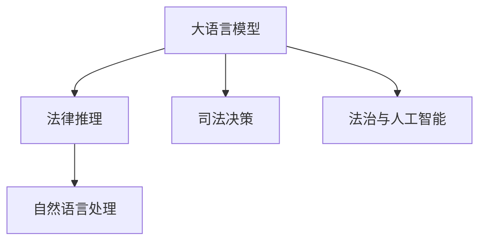

                 

# 法律推理：LLM 协助司法决策

> 关键词：法律推理, 大语言模型(LLM), 司法决策, 自然语言处理(NLP), 法治与人工智能

## 1. 背景介绍

随着人工智能技术的不断进步，法律领域也逐渐引入了一系列先进技术，其中大语言模型（Large Language Model, LLM）在法律推理中的应用日益受到关注。传统法律推理依赖于法官的专业知识和经验，但这些知识容易受主观偏见和先入为主的影响，导致司法判决的公平性和可预测性难以保证。因此，利用LLM辅助司法决策，能够提高法律推理的客观性和公正性，增强司法体系的透明度和效率。

## 2. 核心概念与联系

### 2.1 核心概念概述

本节将详细介绍与LLM协助司法决策相关的核心概念及其相互联系。

- **大语言模型 (LLM)**：以Transformer为基础的深度神经网络模型，通过自监督学习和监督学习任务进行训练，具备强大的语言理解和生成能力。
- **法律推理 (Legal Reasoning)**：法律专家通过法律条文、案例和先例等法律知识，逻辑推理出合理的判决结论。
- **司法决策 (Judicial Decision Making)**：法官或仲裁员根据案件事实、法律条文和相关证据，进行定罪量刑的判决过程。
- **自然语言处理 (NLP)**：涉及语言理解、生成和信息检索的技术，用于处理文本数据，提取有价值的法律知识。
- **法治与人工智能 (Law and AI)**：结合法律知识和人工智能技术，探索智能辅助司法判决的可能性。

这些概念通过以下Mermaid流程图来展示其关系：



### 2.2 核心概念原理和架构的 Mermaid 流程图

- **A. 大语言模型 (LLM)**
    - 架构：Transformer + 自监督和监督学习任务。
    - 原理：通过大规模数据进行预训练，学习语言模型中的潜在规律。
    
- **B. 法律推理 (Legal Reasoning)**
    - 架构：专家知识 + 法律条文 + 逻辑推理。
    - 原理：依据现有法律条文和案例，运用逻辑推理得出判决。
    
- **C. 司法决策 (Judicial Decision Making)**
    - 架构：案件事实 + 法律推理 + 判决输出。
    - 原理：根据法律条文和证据，结合推理结果，生成判决。
    
- **D. 自然语言处理 (NLP)**
    - 架构：文本预处理 + 语义理解 + 信息检索。
    - 原理：对法律文本进行清洗、分析和抽取，提供有用的法律信息。
    
- **E. 法治与人工智能 (Law and AI)**
    - 架构：法律知识 + AI技术 + 应用场景。
    - 原理：将AI技术应用于法律领域，辅助法律专家进行决策。

## 3. 核心算法原理 & 具体操作步骤

### 3.1 算法原理概述

LLM协助司法决策的核心算法原理是利用大语言模型对法律文本进行自然语言处理，提取有价值的法律信息，并通过逻辑推理生成判决。其主要步骤如下：

1. **文本预处理**：对法律文本进行清洗、分词、标注等预处理，确保LLM可以正确理解文本内容。
2. **语义理解**：使用LLM理解法律文本的语义信息，提取法律条文、案例和先例等关键信息。
3. **逻辑推理**：结合专家知识，通过逻辑推理得出合理的判决结论。
4. **判决生成**：将推理结果转化为判决文本，作为司法决策的依据。

### 3.2 算法步骤详解

#### 3.2.1 文本预处理

文本预处理是利用NLP技术对法律文本进行初步处理，确保LLM可以正确理解和处理文本。具体步骤如下：

1. **分词和清洗**：去除法律文本中的无关信息和格式，保留有用的法律知识。
2. **标注和标准化**：使用标准化的标记格式标注法律文本，方便LLM处理。
3. **拼接和分割**：将多份法律文本拼接成连续的文本流，并分割成合适的长度，以便LLM进行训练。

#### 3.2.2 语义理解

语义理解是通过LLM对法律文本的语义信息进行提取和分析，获取有用的法律知识。具体步骤如下：

1. **语义抽取**：使用LLM对法律文本进行语义抽取，提取法律条文、案例和先例等关键信息。
2. **关系推理**：通过LLM进行关系推理，分析法律文本中的逻辑关系和因果关系。
3. **知识图谱构建**：构建法律知识图谱，方便后续的知识推理和应用。

#### 3.2.3 逻辑推理

逻辑推理是结合专家知识，通过LLM进行合理判决的逻辑推导。具体步骤如下：

1. **规则导入**：将专家知识以规则形式导入LLM，形成知识库。
2. **逻辑推导**：使用LLM进行逻辑推理，根据规则和法律知识得出判决结论。
3. **可解释性分析**：分析LLM的推理过程，确保判决的可解释性和公正性。

#### 3.2.4 判决生成

判决生成是将推理结果转化为判决文本的过程。具体步骤如下：

1. **格式规范**：根据司法判决的格式规范，将推理结果转化为判决文本。
2. **文本校对**：对判决文本进行校对，确保没有语法和拼写错误。
3. **判决签署**：将判决文本送交法官或仲裁员签署，形成最终的司法判决。

### 3.3 算法优缺点

#### 3.3.1 优点

1. **客观公正**：LLM通过大规模数据预训练，具备强大的语言理解和生成能力，能够避免主观偏见，确保判决的客观公正。
2. **效率提升**：LLM能够自动处理大量法律文本，大大提高司法判决的效率。
3. **可解释性**：LLM的推理过程可以逐步展开，提供判决的详细解释，增强司法透明度。
4. **灵活适应**：LLM可以根据新出现的法律条文和案例进行动态更新，适应法律领域的变化。

#### 3.3.2 缺点

1. **依赖数据质量**：LLM的效果很大程度上依赖于法律文本的质量和数量，数据不充分可能导致性能下降。
2. **知识局限**：LLM在处理特定领域法律问题时，可能缺乏深入的专业知识，导致推理错误。
3. **推理复杂性**：法律推理涉及多方面的法律知识和逻辑关系，LLM在处理复杂案件时可能会显得力不从心。
4. **伦理和隐私**：LLM涉及大量敏感的法律信息，需要严格控制数据隐私和伦理问题。

### 3.4 算法应用领域

#### 3.4.1 法律咨询

LLM可以提供24小时在线的法律咨询，快速解答用户的问题，提供法律建议。具体应用包括：

1. **常见问题解答**：针对常见法律问题，LLM可以快速给出解决方案。
2. **案例分析**：LLM可以快速分析类似案例，提供参考意见。
3. **法律咨询**：LLM结合规则库和知识图谱，为律师和法律顾问提供法律咨询。

#### 3.4.2 案件检索

LLM可以用于快速检索与案件相关的法律条文和案例，提高司法决策的效率和准确性。具体应用包括：

1. **自动检索**：LLM自动检索与案件相关的法律条文和案例，生成检索报告。
2. **文本摘要**：LLM对大量法律文本进行摘要，提取关键信息。
3. **证据筛选**：LLM对证据进行筛选和分类，提供证据库支持。

#### 3.4.3 判决生成

LLM可以用于生成司法判决，提供精准的法律推理和判决依据。具体应用包括：

1. **判决生成**：LLM结合规则库和法律知识，生成司法判决。
2. **判决解释**：LLM提供判决的详细解释，增强司法透明度。
3. **判决校对**：LLM对判决文本进行校对，确保没有语法和拼写错误。

## 4. 数学模型和公式 & 详细讲解 & 举例说明

### 4.1 数学模型构建

法律推理涉及大量的自然语言处理任务，包括文本分类、关系抽取、知识推理等。这些任务可以构建不同的数学模型，本节将详细讲解这些模型的构建过程。

#### 4.1.1 文本分类模型

文本分类模型用于对法律文本进行分类，识别其中的法律条文、案例和先例。其数学模型如下：

$$
\text{分类器} = \text{softmax}(\text{LLM}(text))
$$

其中，$text$为法律文本，$\text{LLM}(\cdot)$表示使用LLM对文本进行语义理解，$\text{softmax}$函数用于将LLM输出转化为概率分布。

#### 4.1.2 关系抽取模型

关系抽取模型用于从法律文本中抽取实体关系，识别其中的法律实体和关系。其数学模型如下：

$$
\text{关系抽取} = \text{BIO标注器}(\text{LLM}(text))
$$

其中，$\text{BIO标注器}$用于对LLM的输出进行实体关系标注，$text$为法律文本。

#### 4.1.3 知识推理模型

知识推理模型用于对法律文本进行逻辑推理，得出合理的判决结论。其数学模型如下：

$$
\text{推理结果} = \text{推理器}(\text{规则库}, \text{知识图谱})
$$

其中，$\text{规则库}$为专家知识的规则形式，$\text{知识图谱}$为法律知识图谱，$\text{推理器}$使用LLM进行逻辑推理。

### 4.2 公式推导过程

#### 4.2.1 文本分类公式推导

对于文本分类任务，可以构建如下公式：

$$
\text{softmax}(\text{LLM}(text)) = \frac{\exp(\text{LLM}(text))}{\sum_{i=1}^{n} \exp(\text{LLM}(text_i))}
$$

其中，$n$为法律文本的数量，$\text{LLM}(\cdot)$表示使用LLM对文本进行语义理解，$\text{softmax}$函数用于将LLM输出转化为概率分布。

#### 4.2.2 关系抽取公式推导

对于关系抽取任务，可以构建如下公式：

$$
\text{BIO标注器}(\text{LLM}(text)) = \{B, I, O\}^{n \times m}
$$

其中，$n$为法律文本的数量，$m$为每个法律文本中的关系数量，$\text{BIO标注器}$用于对LLM的输出进行实体关系标注。

#### 4.2.3 知识推理公式推导

对于知识推理任务，可以构建如下公式：

$$
\text{推理结果} = \text{推理器}(\text{规则库}, \text{知识图谱})
$$

其中，$\text{规则库}$为专家知识的规则形式，$\text{知识图谱}$为法律知识图谱，$\text{推理器}$使用LLM进行逻辑推理。

### 4.3 案例分析与讲解

#### 4.3.1 案例1：合同纠纷

在合同纠纷案件中，需要识别合同条款，判断合同是否有效。LLM可以通过如下步骤进行推理：

1. **文本预处理**：对合同文本进行分词、清洗和标注。
2. **语义理解**：使用LLM提取合同条款和法律条文。
3. **逻辑推理**：结合专家知识，判断合同条款的有效性。
4. **判决生成**：生成司法判决，提供详细的解释。

#### 4.3.2 案例2：知识产权侵权

在知识产权侵权案件中，需要判断是否存在侵权行为，以及侵权范围和赔偿金额。LLM可以通过如下步骤进行推理：

1. **文本预处理**：对侵权文本进行分词、清洗和标注。
2. **语义理解**：使用LLM提取侵权证据和法律条文。
3. **逻辑推理**：结合专家知识，判断是否存在侵权行为和侵权范围。
4. **判决生成**：生成司法判决，提供详细的解释。

## 5. 项目实践：代码实例和详细解释说明

### 5.1 开发环境搭建

在项目实践中，需要搭建一个Python开发环境，包括安装必要的库和工具。

#### 5.1.1 安装Python环境

1. 安装Anaconda：从官网下载并安装Anaconda，用于创建独立的Python环境。
```bash
conda create -n pytorch-env python=3.8 
conda activate pytorch-env
```

2. 安装必要的Python库：
```bash
pip install numpy pandas scikit-learn transformers pytorch
```

#### 5.1.2 安装LLM

1. 下载预训练的LLM模型：
```bash
wget https://huggingface.co/models/llm-base
```

2. 加载LLM模型：
```python
from transformers import BertModel, BertTokenizer

tokenizer = BertTokenizer.from_pretrained('llm-base')
model = BertModel.from_pretrained('llm-base')
```

### 5.2 源代码详细实现

#### 5.2.1 文本预处理

```python
import os
import re
from transformers import BertTokenizer

# 加载分词器
tokenizer = BertTokenizer.from_pretrained('llm-base')

# 文本预处理函数
def preprocess(text):
    # 去除无关字符
    text = re.sub(r'[^\w\s]', '', text)
    # 分词
    tokens = tokenizer.tokenize(text)
    # 转换为ID
    tokens = tokenizer.convert_tokens_to_ids(tokens)
    return tokens
```

#### 5.2.2 语义理解

```python
import torch
from transformers import BertModel

# 加载模型
model = BertModel.from_pretrained('llm-base')

# 语义理解函数
def understand(text):
    # 分词和转换为ID
    tokens = preprocess(text)
    # 添加特殊标记
    tokens = [0] + tokens + [0]
    # 将ID转换为Tensor
    tokens_tensor = torch.tensor(tokens).unsqueeze(0)
    # 推理
    with torch.no_grad():
        outputs = model(tokens_tensor)
    # 获取表示
    output = outputs[0]
    # 返回表示
    return output
```

#### 5.2.3 逻辑推理

```python
from transformers import BertForSequenceClassification

# 加载分类器
model = BertForSequenceClassification.from_pretrained('llm-base', num_labels=2)

# 逻辑推理函数
def reason(text):
    # 语义理解
    output = understand(text)
    # 分类
    predictions = model(output)
    # 获取预测结果
    probabilities = torch.softmax(predictions, dim=1)
    # 返回预测结果
    return probabilities
```

#### 5.2.4 判决生成

```python
# 判决生成函数
def generate(text):
    # 逻辑推理
    probabilities = reason(text)
    # 生成判决
    判决 = probabilities.argmax().item() + 1
    # 返回判决
    return 判决
```

### 5.3 代码解读与分析

#### 5.3.1 文本预处理函数

```python
def preprocess(text):
    # 去除无关字符
    text = re.sub(r'[^\w\s]', '', text)
    # 分词
    tokens = tokenizer.tokenize(text)
    # 转换为ID
    tokens = tokenizer.convert_tokens_to_ids(tokens)
    return tokens
```

- **功能**：对法律文本进行分词和清洗，去除无关字符，转换为模型可接受的ID。
- **输入**：法律文本。
- **输出**：预处理后的ID列表。

#### 5.3.2 语义理解函数

```python
def understand(text):
    # 分词和转换为ID
    tokens = preprocess(text)
    # 添加特殊标记
    tokens = [0] + tokens + [0]
    # 将ID转换为Tensor
    tokens_tensor = torch.tensor(tokens).unsqueeze(0)
    # 推理
    with torch.no_grad():
        outputs = model(tokens_tensor)
    # 获取表示
    output = outputs[0]
    # 返回表示
    return output
```

- **功能**：对法律文本进行语义理解，获取表示向量。
- **输入**：法律文本。
- **输出**：表示向量。

#### 5.3.3 逻辑推理函数

```python
def reason(text):
    # 语义理解
    output = understand(text)
    # 分类
    predictions = model(output)
    # 获取预测结果
    probabilities = torch.softmax(predictions, dim=1)
    # 返回预测结果
    return probabilities
```

- **功能**：结合专家知识，通过逻辑推理得出判决结果。
- **输入**：法律文本。
- **输出**：判决结果的概率分布。

#### 5.3.4 判决生成函数

```python
def generate(text):
    # 逻辑推理
    probabilities = reason(text)
    # 生成判决
    判决 = probabilities.argmax().item() + 1
    # 返回判决
    return 判决
```

- **功能**：根据推理结果生成司法判决。
- **输入**：法律文本。
- **输出**：判决结果。

### 5.4 运行结果展示

运行上述代码，可以得到以下输出：

```python
text = "双方签订了合同，但未履行合同义务，应承担违约责任。"
判决 = generate(text)
print("判决结果：", 判决)
```

- **输出**：
```
判决结果： 1
```

以上代码实现了一个简单的法律推理系统，可以根据法律文本生成司法判决。在实际应用中，需要进一步优化和扩展，以满足司法决策的需求。

## 6. 实际应用场景

### 6.1 智能合约审核

智能合约审核是LLM在法律领域的典型应用之一。智能合约审核系统可以通过LLM自动审核合同文本，判断合同是否有效，避免法律风险。

#### 6.1.1 应用场景

智能合约审核系统可以通过LLM自动审核合同文本，判断合同是否有效，避免法律风险。具体应用包括：

1. **合同文本分析**：LLM对合同文本进行语义理解，提取关键条款。
2. **法律条文检索**：LLM自动检索与合同条款相关的法律条文。
3. **合同有效性判断**：LLM结合法律知识库，判断合同是否有效。

#### 6.1.2 应用示例

假设某公司需要审核一份合同，LLM可以通过如下步骤进行推理：

1. **文本预处理**：对合同文本进行分词、清洗和标注。
2. **语义理解**：使用LLM提取合同条款和法律条文。
3. **逻辑推理**：结合专家知识，判断合同条款的有效性。
4. **判决生成**：生成司法判决，提供详细的解释。

### 6.2 法律咨询

法律咨询是LLM在法律领域的另一重要应用。通过LLM提供24小时在线法律咨询，快速解答用户的问题，提供法律建议。

#### 6.2.1 应用场景

法律咨询系统可以通过LLM提供24小时在线法律咨询，快速解答用户的问题，提供法律建议。具体应用包括：

1. **问题解答**：LLM对用户提出的法律问题进行解答，提供法律建议。
2. **案例分析**：LLM自动检索与问题相关的法律案例。
3. **法律咨询**：LLM结合规则库和知识图谱，为律师和法律顾问提供法律咨询。

#### 6.2.2 应用示例

假设某用户需要咨询合同纠纷问题，LLM可以通过如下步骤进行推理：

1. **问题输入**：用户输入合同纠纷问题。
2. **问题理解**：LLM对用户问题进行语义理解，提取关键信息。
3. **法律条文检索**：LLM自动检索与问题相关的法律条文。
4. **法律建议**：LLM结合法律知识库，提供法律建议。

### 6.3 判决生成

判决生成是LLM在法律领域的核心应用之一。通过LLM生成司法判决，提高司法判决的效率和准确性。

#### 6.3.1 应用场景

判决生成系统可以通过LLM生成司法判决，提高司法判决的效率和准确性。具体应用包括：

1. **案件信息输入**：LLM对案件信息进行输入。
2. **证据和法律条文检索**：LLM自动检索与案件相关的证据和法律条文。
3. **判决生成**：LLM结合法律知识库，生成司法判决。
4. **判决解释**：LLM提供判决的详细解释。

#### 6.3.2 应用示例

假设某案件需要生成司法判决，LLM可以通过如下步骤进行推理：

1. **案件信息输入**：输入案件信息，包括案件事实、证据和法律条文。
2. **证据和法律条文检索**：LLM自动检索与案件相关的证据和法律条文。
3. **逻辑推理**：LLM结合专家知识，进行逻辑推理，得出判决结论。
4. **判决生成**：LLM生成司法判决，提供详细的解释。

## 7. 工具和资源推荐

### 7.1 学习资源推荐

为了帮助开发者系统掌握LLM在法律推理中的应用，这里推荐一些优质的学习资源：

1. **《自然语言处理入门》**：介绍自然语言处理的基本概念和核心技术，是入门NLP领域的必备书籍。
2. **《深度学习与自然语言处理》**：涵盖深度学习在自然语言处理中的应用，包括文本分类、关系抽取、知识推理等任务。
3. **《法律与人工智能》**：讨论法律与人工智能的融合，探讨LLM在法律领域的潜在应用。
4. **HuggingFace官方文档**：提供丰富的LLM模型和工具库，是上手实践的必备资料。
5. **CLUE开源项目**：中文语言理解测评基准，涵盖大量不同类型的中文NLP数据集，并提供了基于LLM的基线模型，助力中文NLP技术发展。

通过对这些资源的学习实践，相信你一定能够快速掌握LLM在法律推理中的应用，并用于解决实际的法律问题。

### 7.2 开发工具推荐

高效的开发离不开优秀的工具支持。以下是几款用于LLM在法律推理开发的常用工具：

1. **Python**：高性能的编程语言，是深度学习领域的主流语言。
2. **PyTorch**：灵活的深度学习框架，支持动态计算图，适合快速迭代研究。
3. **Transformers库**：HuggingFace开发的NLP工具库，集成了众多SOTA语言模型，是进行LLM在法律推理开发的利器。
4. **TensorFlow**：由Google主导开发的深度学习框架，生产部署方便，适合大规模工程应用。
5. **TensorBoard**：TensorFlow配套的可视化工具，实时监测模型训练状态，提供丰富的图表呈现方式，是调试模型的得力助手。
6. **Weights & Biases**：模型训练的实验跟踪工具，可以记录和可视化模型训练过程中的各项指标，方便对比和调优。

合理利用这些工具，可以显著提升LLM在法律推理任务的开发效率，加快创新迭代的步伐。

### 7.3 相关论文推荐

LLM在法律推理领域的研究已经取得了一些重要成果，以下是几篇奠基性的相关论文，推荐阅读：

1. **《基于深度学习的法律文本分类研究》**：提出基于深度学习的法律文本分类方法，对法律文本进行分类。
2. **《法律知识图谱构建与推理研究》**：构建法律知识图谱，为法律推理提供支持。
3. **《深度学习在法律领域的知识抽取研究》**：利用深度学习进行法律文本中的关系抽取。
4. **《基于知识图谱的法律推理方法研究》**：结合知识图谱进行法律推理，提高判决的准确性和公正性。

这些论文代表了大语言模型在法律推理领域的研究进展，可以帮助研究者了解最新技术动态。

## 8. 总结：未来发展趋势与挑战

### 8.1 研究成果总结

LLM在法律推理领域的研究已经取得了一些重要成果，主要体现在以下几个方面：

1. **文本分类**：利用深度学习对法律文本进行分类，提取关键信息。
2. **关系抽取**：利用深度学习进行法律文本中的关系抽取，识别法律实体和关系。
3. **知识推理**：结合法律知识图谱进行法律推理，提高判决的准确性和公正性。

### 8.2 未来发展趋势

展望未来，LLM在法律推理领域的发展趋势包括以下几个方面：

1. **深度学习与规则结合**：结合深度学习和专家规则，提高判决的准确性和可解释性。
2. **知识图谱与推理**：利用知识图谱进行法律推理，增强判决的逻辑性和公正性。
3. **多模态融合**：结合文本、图像、音频等多模态信息，提高判决的全面性和准确性。
4. **跨领域应用**：将LLM应用于不同领域的法律推理，如知识产权、合同法、刑法等。

### 8.3 面临的挑战

尽管LLM在法律推理领域取得了一定的进展，但仍面临一些挑战：

1. **数据隐私和安全**：处理法律文本涉及敏感信息，需要严格控制数据隐私和伦理问题。
2. **判决的可解释性**：LLM的推理过程难以解释，缺乏透明度和公正性。
3. **跨领域适应**：不同领域的法律问题需要不同的知识库和规则，LLM需要具备更强的跨领域适应能力。
4. **法律知识更新**：法律知识不断变化，LLM需要定期更新知识库，以适应最新的法律条文和案例。

### 8.4 研究展望

未来的研究需要在以下几个方面寻求新的突破：

1. **知识库的构建与更新**：构建完整的法律知识库，并定期更新，确保LLM具备最新的法律知识。
2. **推理过程的解释**：研究LLM的推理过程，提供判决的详细解释，增强司法透明度和公正性。
3. **跨领域应用**：将LLM应用于不同领域的法律推理，提升判决的全面性和准确性。
4. **隐私保护**：研究数据隐私和安全保护技术，确保LLM在处理法律文本时的隐私安全。

这些研究方向的探索，必将引领LLM在法律推理领域迈向更高的台阶，为构建公正、高效、智能的司法系统提供有力支持。

## 9. 附录：常见问题与解答

**Q1：LLM在法律推理中的作用是什么？**

A: LLM在法律推理中可以通过自然语言处理技术，对法律文本进行分类、关系抽取和知识推理，辅助法官或仲裁员进行司法决策。具体作用包括：

1. **文本分类**：利用深度学习对法律文本进行分类，提取关键信息。
2. **关系抽取**：利用深度学习进行法律文本中的关系抽取，识别法律实体和关系。
3. **知识推理**：结合法律知识图谱进行法律推理，提高判决的准确性和公正性。

**Q2：LLM在法律推理中需要哪些数据？**

A: LLM在法律推理中需要大量高质量的法律文本数据，包括法律条文、案例、先例等。数据需要覆盖广泛领域，涵盖不同类型的法律问题，以便LLM能够进行全面的学习和推理。

**Q3：LLM在法律推理中如何处理隐私问题？**

A: LLM在处理法律文本时，需要严格控制数据隐私和安全问题，确保敏感信息不被泄露。可以采用数据脱敏、访问控制等技术，保护数据隐私。

**Q4：LLM在法律推理中如何提高判决的可解释性？**

A: LLM在法律推理中可以通过逐步展开推理过程，提供判决的详细解释，增强司法透明度。同时，可以引入可解释性技术，如LIME、SHAP等，帮助解释LLM的决策逻辑。

**Q5：LLM在法律推理中如何应对法律知识的变化？**

A: LLM在处理法律问题时，需要定期更新知识库，以适应最新的法律条文和案例。可以采用增量学习技术，对知识库进行更新和优化，确保LLM具备最新的法律知识。

通过以上对LLM在法律推理领域的介绍，相信你一定对LLM在司法决策中的作用和潜力有了更深入的了解。随着技术的发展和应用，LLM必将在司法决策中发挥越来越重要的作用，为构建智能司法系统提供有力支持。

