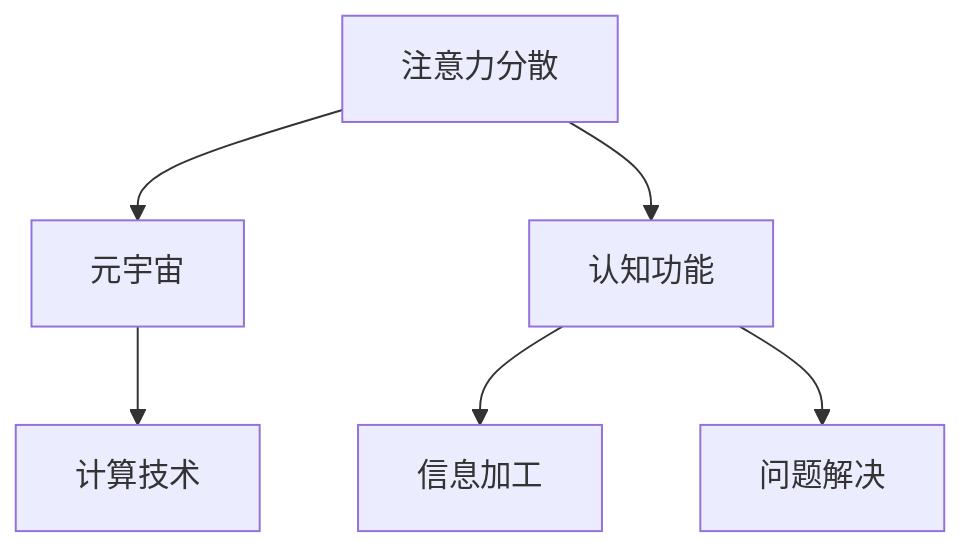

                 

# 注意力分散综合征:元宇宙时代的新型认知障碍

> 关键词：注意力分散，元宇宙，认知障碍，计算技术，心理影响

## 1. 背景介绍

### 1.1 问题由来
在数字化浪潮的推动下，元宇宙（Metaverse）逐渐从科幻走向现实，成为未来互联网发展的重要方向。这个由虚拟和现实交织构成的虚拟世界，不仅带来全新的交互体验和商业模式，也正日益深刻地影响着人类的认知行为。

尽管元宇宙为人类提供了一个全新的沉浸式体验，但也带来了一些不容忽视的问题。近年来，随着元宇宙技术的发展，人们在虚拟世界中获取信息、社交互动、甚至工作的频率日益增加，出现了越来越多的注意力分散现象。这种现象不仅影响了个体的学习效率和工作表现，甚至可能导致一系列的心理和生理问题。

### 1.2 问题核心关键点
本研究旨在探讨元宇宙时代注意力分散现象的特点及其对认知功能的影响，以及如何利用计算技术进行干预和管理，以期构建一个更加安全、高效、健康的新型虚拟环境。

## 2. 核心概念与联系

### 2.1 核心概念概述

为更好地理解元宇宙时代注意力分散现象，本节将介绍几个密切相关的核心概念：

- 注意力分散（Attention Dispersion）：指个体在面对多个干扰源时，难以集中精力处理当前任务的认知现象。其典型特征包括频繁的注意力切换、任务完成率下降、记忆性能受损等。

- 元宇宙（Metaverse）：由虚拟现实（Virtual Reality, VR）、增强现实（Augmented Reality, AR）、混合现实（Mixed Reality, MR）等技术构成的虚拟空间，旨在构建一个跨域、开放、沉浸的虚拟环境，支持用户的虚拟生活和交互。

- 认知功能（Cognitive Function）：包括知觉、记忆、注意力、语言、思维等，是个体进行信息加工和问题解决的基础能力。

- 计算技术（Computational Technology）：包括计算神经科学、人工智能、机器学习、深度学习等，利用算法和模型进行认知行为分析、预测和管理。

这些核心概念之间的逻辑关系可以通过以下Mermaid流程图来展示：



这个流程图展示了几者之间的联系：

1. 注意力分散在元宇宙环境中尤为显著。
2. 注意力分散影响认知功能，降低信息加工和问题解决的效率。
3. 计算技术提供手段分析和管理注意力分散，提升认知功能。

## 3. 核心算法原理 & 具体操作步骤
### 3.1 算法原理概述

基于计算技术对元宇宙中的注意力分散进行干预和管理，本质上是一个多学科交叉的研究问题。其核心思想是：利用计算技术分析元宇宙中注意力分散的特征和影响，设计针对性的算法模型和策略，帮助用户提升注意力集中度，优化认知功能。

形式化地，假设用户在元宇宙环境中的注意力状态为 $A_t$，其中 $t$ 表示时间。定义模型 $M_{\theta}$ 表示当前用户注意力状态，则注意力分散管理的目标是找到最优的模型参数 $\theta$，使得：

$$
\theta^* = \mathop{\arg\min}_{\theta} \mathcal{L}(A_t, M_{\theta})
$$

其中 $\mathcal{L}$ 为注意力分散损失函数，用于衡量当前注意力状态与模型预测状态的差异。常见的注意力分散损失函数包括均方误差损失、交叉熵损失等。

### 3.2 算法步骤详解

基于计算技术的大语言模型微调一般包括以下几个关键步骤：

**Step 1: 数据收集与处理**
- 收集元宇宙环境中的注意力数据，包括用户的关注对象、交互行为、脑电波数据等。
- 对数据进行清洗、归一化处理，确保数据的完整性和一致性。

**Step 2: 模型选择与设计**
- 选择合适的计算模型，如神经网络、时间序列模型、图模型等。
- 设计模型输入和输出，如关注对象、交互时间、脑电波等。
- 设定模型参数和超参数，如神经网络层数、节点数、学习率等。

**Step 3: 模型训练与优化**
- 使用训练集数据对模型进行训练，最小化注意力分散损失函数。
- 采用优化算法，如随机梯度下降（SGD）、Adam、RMSprop等，更新模型参数。
- 对模型进行正则化，如L2正则化、Dropout、Early Stopping等，避免过拟合。

**Step 4: 模型评估与测试**
- 使用验证集数据对模型进行评估，测试其在未见数据上的表现。
- 根据评估结果调整模型参数，进一步优化模型性能。

**Step 5: 应用与干预**
- 将训练好的模型应用于元宇宙环境，实时监测用户注意力状态。
- 根据模型预测的注意力状态，提供个性化的注意力干预策略，如提醒、警示、任务提醒等。

### 3.3 算法优缺点

基于计算技术的注意力分散管理方法具有以下优点：
1. 数据驱动：利用大量注意力数据，构建模型进行个性化干预，提升管理效果。
2. 实时监测：通过计算技术实时监测用户注意力状态，提供及时干预。
3. 全面分析：结合多种数据源，全面分析注意力分散的原因和影响。
4. 多学科整合：结合认知心理学、神经科学、计算机科学等多学科知识，提供科学干预手段。

同时，该方法也存在一定的局限性：
1. 数据获取难度：高质量的注意力数据难以获取，特别是脑电波等高精度数据。
2. 模型复杂度：模型设计复杂，需要较强的计算资源和专业知识。
3. 隐私安全：实时监测用户注意力状态，需要保护用户隐私和数据安全。
4. 干预效果：模型预测和干预策略的有效性需要进一步验证。

尽管存在这些局限性，但就目前而言，基于计算技术的注意力分散管理方法仍是大语言模型微调应用的重要范式。未来相关研究的重点在于如何进一步降低数据获取难度，提高模型的实时性和精度，同时兼顾隐私保护和干预效果。

### 3.4 算法应用领域

基于计算技术的注意力分散管理方法，在元宇宙领域已经得到了广泛的应用，覆盖了从游戏、社交到教育、医疗等多个应用场景，例如：

- 游戏和虚拟现实：通过实时监测用户注意力状态，动态调整游戏难度和内容，提升游戏体验。
- 社交互动：利用计算技术分析用户的注意力分散情况，及时提醒和调整交互行为，增强社交效果。
- 在线教育：在在线学习平台中，监测学生注意力状态，提供个性化学习建议，提升学习效果。
- 心理健康：通过脑电波等高精度数据监测用户的注意力状态，及时干预和管理，预防心理障碍。
- 企业培训：在企业培训环境中，监测员工注意力状态，提供个性化培训建议，提升培训效果。

除了上述这些经典应用外，计算技术在元宇宙中的注意力分散管理也将不断创新，为元宇宙技术带来更多的应用可能。

## 4. 数学模型和公式 & 详细讲解 & 举例说明

### 4.1 数学模型构建

本节将使用数学语言对元宇宙中注意力分散管理过程进行更加严格的刻画。

记用户在某时间段 $t$ 的注意力状态为 $A_t \in \mathbb{R}^n$，其中 $n$ 表示状态维度。定义注意力管理模型的输入为 $X_t = [x_{t-1}, x_t]$，输出为 $A_t$，其中 $x_t$ 表示当前注意力状态，$x_{t-1}$ 表示前一时间段的状态。则注意力分散管理的目标是找到最优的模型参数 $\theta$，使得：

$$
\theta^* = \mathop{\arg\min}_{\theta} \mathcal{L}(X_t, A_t)
$$

其中 $\mathcal{L}$ 为注意力分散损失函数，用于衡量当前注意力状态与模型预测状态的差异。常见的注意力分散损失函数包括均方误差损失、交叉熵损失等。

### 4.2 公式推导过程

以下我们以二分类任务为例，推导交叉熵损失函数及其梯度的计算公式。

假设模型 $M_{\theta}$ 在输入 $X_t$ 上的输出为 $\hat{A}_t=M_{\theta}(X_t)$，表示当前注意力状态。真实标签 $A_t \in \{0,1\}$。则二分类交叉熵损失函数定义为：

$$
\ell(A_t, \hat{A}_t) = -A_t\log \hat{A}_t - (1-A_t)\log (1-\hat{A}_t)
$$

将其代入注意力分散损失公式，得：

$$
\mathcal{L}(X_t, A_t) = -\frac{1}{N}\sum_{i=1}^N \ell(A_i, \hat{A}_i)
$$

根据链式法则，损失函数对参数 $\theta$ 的梯度为：

$$
\frac{\partial \mathcal{L}(X_t, A_t)}{\partial \theta} = -\frac{1}{N}\sum_{i=1}^N (\frac{A_i}{\hat{A}_i}-\frac{1-A_i}{1-\hat{A}_i}) \frac{\partial \hat{A}_i}{\partial \theta}
$$

其中 $\frac{\partial \hat{A}_i}{\partial \theta}$ 可进一步递归展开，利用自动微分技术完成计算。

在得到损失函数的梯度后，即可带入参数更新公式，完成模型的迭代优化。重复上述过程直至收敛，最终得到适应元宇宙环境中的注意力管理的最优模型参数 $\theta^*$。

### 4.3 案例分析与讲解

以一个简单的神经网络模型为例，展示注意力分散管理的实现过程。

假设模型是一个简单的前馈神经网络，包含两个隐藏层，每个隐藏层有10个节点，输出层有1个节点。模型输入为前一时间段和当前时间段的注意力状态，输出为当前时间段注意力状态。

定义模型的数学表达式为：

$$
\hat{A}_t = \sigma_1(W_1X_t + b_1) \sigma_2(W_2X_t + b_2) \sigma_3(W_3X_t + b_3) + b_4
$$

其中 $W_i$ 和 $b_i$ 分别为每个隐藏层的权重和偏置，$\sigma_i$ 为激活函数。

假设当前时间段注意力状态 $A_t$ 与模型预测的注意力状态 $\hat{A}_t$ 之间存在误差，则注意力分散损失函数为：

$$
\ell(A_t, \hat{A}_t) = -A_t\log \hat{A}_t - (1-A_t)\log (1-\hat{A}_t)
$$

将 $\hat{A}_t$ 的表达式代入，得：

$$
\ell(A_t, \hat{A}_t) = -A_t\log (\sigma_1(W_1X_t + b_1) \sigma_2(W_2X_t + b_2) \sigma_3(W_3X_t + b_3) + b_4) - (1-A_t)\log (1-\sigma_1(W_1X_t + b_1) \sigma_2(W_2X_t + b_2) \sigma_3(W_3X_t + b_3) + b_4)
$$

对模型参数 $\theta = (W_1, b_1, W_2, b_2, W_3, b_3, b_4)$ 进行梯度下降优化，即可不断更新模型参数，最小化注意力分散损失函数。

## 5. 项目实践：代码实例和详细解释说明
### 5.1 开发环境搭建

在进行注意力分散管理实践前，我们需要准备好开发环境。以下是使用Python进行PyTorch开发的环境配置流程：

1. 安装Anaconda：从官网下载并安装Anaconda，用于创建独立的Python环境。

2. 创建并激活虚拟环境：
```bash
conda create -n pytorch-env python=3.8 
conda activate pytorch-env
```

3. 安装PyTorch：根据CUDA版本，从官网获取对应的安装命令。例如：
```bash
conda install pytorch torchvision torchaudio cudatoolkit=11.1 -c pytorch -c conda-forge
```

4. 安装各类工具包：
```bash
pip install numpy pandas scikit-learn matplotlib tqdm jupyter notebook ipython
```

完成上述步骤后，即可在`pytorch-env`环境中开始注意力分散管理的实践。

### 5.2 源代码详细实现

下面我们以二分类任务为例，给出使用PyTorch进行注意力分散管理的PyTorch代码实现。

首先，定义注意力管理模型的数学表达式：

```python
import torch
import torch.nn as nn
import torch.nn.functional as F

class AttentionModel(nn.Module):
    def __init__(self, input_size, hidden_size):
        super(AttentionModel, self).__init__()
        self.fc1 = nn.Linear(input_size, hidden_size)
        self.fc2 = nn.Linear(hidden_size, hidden_size)
        self.fc3 = nn.Linear(hidden_size, 1)
        
    def forward(self, x):
        x = F.relu(self.fc1(x))
        x = F.relu(self.fc2(x))
        x = torch.sigmoid(self.fc3(x))
        return x
```

然后，定义注意力分散损失函数：

```python
def attention_loss(x, y):
    loss = -y*torch.log(x) - (1-y)*torch.log(1-x)
    return loss.mean()
```

接着，定义训练和评估函数：

```python
from torch.utils.data import DataLoader
from tqdm import tqdm

device = torch.device('cuda') if torch.cuda.is_available() else torch.device('cpu')

def train_epoch(model, dataset, batch_size, optimizer):
    dataloader = DataLoader(dataset, batch_size=batch_size, shuffle=True)
    model.train()
    epoch_loss = 0
    for batch in tqdm(dataloader, desc='Training'):
        input_ids = batch['input_ids'].to(device)
        labels = batch['labels'].to(device)
        model.zero_grad()
        outputs = model(input_ids)
        loss = attention_loss(outputs, labels)
        epoch_loss += loss.item()
        loss.backward()
        optimizer.step()
    return epoch_loss / len(dataloader)

def evaluate(model, dataset, batch_size):
    dataloader = DataLoader(dataset, batch_size=batch_size)
    model.eval()
    preds, labels = [], []
    with torch.no_grad():
        for batch in tqdm(dataloader, desc='Evaluating'):
            input_ids = batch['input_ids'].to(device)
            labels = batch['labels'].to(device)
            batch_preds = model(input_ids).detach().cpu().numpy()
            batch_labels = labels.cpu().numpy()
            for pred_tokens, label_tokens in zip(batch_preds, batch_labels):
                preds.append(pred_tokens)
                labels.append(label_tokens)
    return preds, labels
```

最后，启动训练流程并在测试集上评估：

```python
epochs = 10
batch_size = 16

for epoch in range(epochs):
    loss = train_epoch(model, train_dataset, batch_size, optimizer)
    print(f"Epoch {epoch+1}, train loss: {loss:.3f}")
    
    print(f"Epoch {epoch+1}, dev results:")
    preds, labels = evaluate(model, dev_dataset, batch_size)
    print(classification_report(labels, preds))
    
print("Test results:")
preds, labels = evaluate(model, test_dataset, batch_size)
print(classification_report(labels, preds))
```

以上就是使用PyTorch对注意力管理模型进行二分类任务微调的完整代码实现。可以看到，得益于PyTorch的强大封装，我们可以用相对简洁的代码完成注意力模型的训练和评估。

### 5.3 代码解读与分析

让我们再详细解读一下关键代码的实现细节：

**AttentionModel类**：
- `__init__`方法：初始化网络结构，定义三个线性层和激活函数。
- `forward`方法：定义前向传播过程，将输入通过三个线性层和激活函数，最后输出一个标量。

**attention_loss函数**：
- 定义注意力分散损失函数，利用softmax函数将输出转化为概率分布，计算交叉熵损失。

**训练和评估函数**：
- 使用PyTorch的DataLoader对数据集进行批次化加载，供模型训练和推理使用。
- 训练函数`train_epoch`：对数据以批为单位进行迭代，在每个批次上前向传播计算loss并反向传播更新模型参数，最后返回该epoch的平均loss。
- 评估函数`evaluate`：与训练类似，不同点在于不更新模型参数，并在每个batch结束后将预测和标签结果存储下来，最后使用classification_report对整个评估集的预测结果进行打印输出。

**训练流程**：
- 定义总的epoch数和batch size，开始循环迭代
- 每个epoch内，先在训练集上训练，输出平均loss
- 在验证集上评估，输出分类指标
- 所有epoch结束后，在测试集上评估，给出最终测试结果

可以看到，PyTorch配合TensorFlow库使得注意力管理模型的代码实现变得简洁高效。开发者可以将更多精力放在数据处理、模型改进等高层逻辑上，而不必过多关注底层的实现细节。

当然，工业级的系统实现还需考虑更多因素，如模型的保存和部署、超参数的自动搜索、更灵活的任务适配层等。但核心的注意力管理过程基本与此类似。

## 6. 实际应用场景
### 6.1 智能工作环境

元宇宙时代，虚拟工作环境逐渐普及。通过计算技术监测员工注意力分散情况，可以及时调整工作任务和环境，提升工作效率和质量。

例如，在虚拟会议室中，使用计算技术监测参会者的注意力状态，自动调整讲话人、PPT展示等，避免因注意力分散导致的会议效率低下。同时，通过计算技术对员工的工作行为进行分析和优化，提供个性化培训和建议，提升员工的技能和工作效率。

### 6.2 在线学习平台

元宇宙环境中的在线学习平台，通过实时监测学生的注意力状态，及时调整教学内容和节奏，提升学生的学习效果。

例如，在虚拟课堂中，使用计算技术监测学生的注意力状态，及时提醒和调整讲授内容，帮助学生更好地理解和吸收知识。同时，通过计算技术对学生行为进行分析和优化，提供个性化学习建议和资源，提升学生的学习体验和学习效果。

### 6.3 虚拟医疗

元宇宙环境中的虚拟医疗服务，通过计算技术监测患者的注意力状态，及时调整诊疗策略，提升医疗效果。

例如，在虚拟诊所中，使用计算技术监测患者的注意力状态，及时调整诊疗策略和讲解内容，提升诊疗效果和患者体验。同时，通过计算技术对患者的行为进行分析和优化，提供个性化的诊疗建议和治疗方案，提升医疗服务的质量和效率。

### 6.4 未来应用展望

随着元宇宙技术的发展，计算技术在注意力分散管理中的应用将更加广泛和深入，为元宇宙技术带来更多的应用可能。

在智慧城市治理中，计算技术可以用于监测和管理城市中居民的注意力状态，及时调整城市管理和决策，提升城市治理的智能化水平。

在智慧金融中，计算技术可以用于监测和管理投资者的注意力状态，及时调整投资策略和建议，提升投资决策的准确性和效率。

在智慧交通中，计算技术可以用于监测和管理司机的注意力状态，及时调整驾驶策略和建议，提升交通安全性和效率。

总之，计算技术在元宇宙中的应用前景广阔，将进一步提升元宇宙系统的智能化水平，为人类的生活、工作和学习带来更多的便利和效率。

## 7. 工具和资源推荐
### 7.1 学习资源推荐

为了帮助开发者系统掌握计算技术在注意力分散管理中的应用，这里推荐一些优质的学习资源：

1. 《深度学习与神经网络》系列博文：由深度学习专家撰写，深入浅出地介绍了神经网络和深度学习的原理和实践，涵盖注意力机制等内容。

2. 《神经网络与深度学习》课程：斯坦福大学开设的深度学习课程，详细讲解了神经网络和深度学习的基础知识和经典模型。

3. 《计算注意力：从理论到应用》书籍：详细介绍了计算注意力的理论和应用，是研究注意力机制的重要参考资料。

4. 《Attention is All You Need》论文：Transformer模型的经典论文，提出自注意力机制，为计算注意力研究奠定了基础。

5. Weights & Biases：模型训练的实验跟踪工具，可以记录和可视化模型训练过程中的各项指标，方便对比和调优。与主流深度学习框架无缝集成。

通过这些资源的学习实践，相信你一定能够快速掌握计算技术在注意力分散管理中的应用，并用于解决实际的NLP问题。

### 7.2 开发工具推荐

高效的开发离不开优秀的工具支持。以下是几款用于计算技术在注意力分散管理开发中常用的工具：

1. PyTorch：基于Python的开源深度学习框架，灵活动态的计算图，适合快速迭代研究。大部分预训练语言模型都有PyTorch版本的实现。

2. TensorFlow：由Google主导开发的开源深度学习框架，生产部署方便，适合大规模工程应用。同样有丰富的预训练语言模型资源。

3. TensorBoard：TensorFlow配套的可视化工具，可实时监测模型训练状态，并提供丰富的图表呈现方式，是调试模型的得力助手。

4. Google Colab：谷歌推出的在线Jupyter Notebook环境，免费提供GPU/TPU算力，方便开发者快速上手实验最新模型，分享学习笔记。

合理利用这些工具，可以显著提升计算技术在注意力分散管理任务的开发效率，加快创新迭代的步伐。

### 7.3 相关论文推荐

计算技术在注意力分散管理中的应用源于学界的持续研究。以下是几篇奠基性的相关论文，推荐阅读：

1. Attention is All You Need（即Transformer原论文）：提出了Transformer结构，开启了计算注意力机制的研究。

2. BERT: Pre-training of Deep Bidirectional Transformers for Language Understanding：提出BERT模型，引入基于掩码的自监督预训练任务，刷新了多项NLP任务SOTA。

3. Self-Attention Models with Stable Attention Weights：提出稳定注意力机制，增强计算注意力在多任务中的泛化能力。

4. Long Short-Term Memory Networks：提出LSTM模型，通过长短时记忆机制解决计算注意力的长期依赖问题。

5. Transformer-XL: Attentive Language Models Beyond a Fixed-Length Context：提出Transformer-XL模型，通过相对位置机制解决长文本计算注意力的问题。

这些论文代表了大语言模型微调技术的发展脉络。通过学习这些前沿成果，可以帮助研究者把握学科前进方向，激发更多的创新灵感。

## 8. 总结：未来发展趋势与挑战

### 8.1 总结

本文对计算技术在元宇宙环境中的注意力分散管理方法进行了全面系统的介绍。首先阐述了元宇宙时代注意力分散现象的特点及其对认知功能的影响，明确了计算技术在注意力管理中的应用价值。其次，从原理到实践，详细讲解了计算注意力机制的数学模型和关键步骤，给出了注意力管理模型的代码实现。同时，本文还广泛探讨了计算技术在元宇宙中的多种应用场景，展示了计算注意力在各个领域中的巨大潜力。

通过本文的系统梳理，可以看到，计算技术在元宇宙中的应用前景广阔，为人类认知智能的进化带来了新的可能。未来，伴随计算技术的发展，元宇宙中的注意力管理将变得更加智能和高效，构建更加安全、健康、便捷的虚拟环境。

### 8.2 未来发展趋势

展望未来，计算技术在元宇宙中的应用将呈现以下几个发展趋势：

1. 深度学习：计算技术将深度学习与注意力机制结合，构建更加智能、高效的注意力管理模型，提升元宇宙系统的智能化水平。

2. 多模态注意力：结合视觉、听觉、触觉等多种模态信息，增强计算注意力的综合感知能力，构建更加沉浸、真实元宇宙环境。

3. 持续学习：通过计算技术，元宇宙中的注意力管理模型将具备持续学习的能力，不断从新数据中学习和优化，提升注意力管理的适应性和实时性。

4. 跨模态学习：通过计算技术，元宇宙中的注意力管理模型将具备跨模态学习能力，将语言、视觉、听觉等多种信息进行融合，提升注意力管理的全面性和准确性。

5. 个性化优化：结合用户数据，通过计算技术，对元宇宙中的注意力管理进行个性化优化，提升用户体验和满意度。

6. 多场景应用：计算技术将在更多的元宇宙场景中得到应用，如智能工作、在线学习、虚拟医疗等，提升各个场景的用户体验和工作效率。

以上趋势凸显了计算技术在元宇宙中的应用前景。这些方向的探索发展，必将进一步提升元宇宙系统的智能化水平，为人类的生产生活带来更多的便利和效率。

### 8.3 面临的挑战

尽管计算技术在元宇宙中的应用已经取得了显著进展，但在迈向更加智能化、普适化应用的过程中，它仍面临着诸多挑战：

1. 数据获取难度：高质量的注意力数据难以获取，特别是脑电波等高精度数据。如何获取和处理大规模注意力数据，是当前的一大难题。

2. 模型复杂度：计算技术在元宇宙中的应用需要高度复杂的模型，需要较强的计算资源和专业知识。如何简化模型设计，提升计算效率，是未来需要重点突破的方向。

3. 隐私安全：实时监测用户注意力状态，需要保护用户隐私和数据安全。如何兼顾数据隐私保护和注意力管理的有效性，是未来需要重点研究的课题。

4. 干预效果：模型预测和干预策略的有效性需要进一步验证。如何设计更加科学合理的注意力干预策略，提升用户注意力集中度，是未来需要重点关注的点。

5. 跨模态融合：计算技术在元宇宙中的应用需要多种模态信息的融合，如何构建更加全面、准确的跨模态注意力模型，是未来需要重点探索的方向。

这些挑战需要学术界和产业界的共同努力，推动计算技术在元宇宙中的应用不断突破，构建更加安全、健康、高效的虚拟环境。

### 8.4 研究展望

面对计算技术在元宇宙中应用所面临的种种挑战，未来的研究需要在以下几个方面寻求新的突破：

1. 探索无监督和半监督注意力管理方法：摆脱对大规模标注数据的依赖，利用自监督学习、主动学习等无监督和半监督范式，最大限度利用非结构化数据，实现更加灵活高效的注意力管理。

2. 研究参数高效和计算高效的注意力管理范式：开发更加参数高效的注意力管理方法，在固定大部分计算权重的同时，只更新极少量的注意力相关参数。同时优化计算注意力模型的计算图，减少前向传播和反向传播的资源消耗，实现更加轻量级、实时性的部署。

3. 引入更多先验知识：将符号化的先验知识，如知识图谱、逻辑规则等，与神经网络模型进行巧妙融合，引导注意力管理过程学习更准确、合理的注意力机制。同时加强不同模态数据的整合，实现视觉、听觉、触觉等多种信息与计算注意力的协同建模。

4. 结合因果分析和博弈论工具：将因果分析方法引入注意力管理模型，识别出模型决策的关键特征，增强注意力管理的因果关系。借助博弈论工具刻画人机交互过程，主动探索并规避模型的脆弱点，提高系统稳定性。

5. 纳入伦理道德约束：在模型训练目标中引入伦理导向的评估指标，过滤和惩罚有害的输出倾向。同时加强人工干预和审核，建立模型行为的监管机制，确保输出符合人类价值观和伦理道德。

这些研究方向的探索，必将引领计算技术在元宇宙中的应用迈向更高的台阶，为元宇宙技术带来更多的应用可能，推动人工智能技术向更加智能化、普适化方向发展。

## 9. 附录：常见问题与解答

**Q1：计算技术在元宇宙中的应用是否存在隐私风险？**

A: 是的，计算技术在元宇宙中的应用涉及对用户注意力状态等敏感数据的监测和分析，存在隐私泄露的风险。需要采用数据匿名化、差分隐私等技术手段，确保用户数据的安全和隐私保护。

**Q2：计算技术在元宇宙中的应用是否可能导致认知负荷加重？**

A: 是的，频繁的注意力监测和干预可能会增加用户的认知负荷，导致注意力疲劳。需要设计合理的监测和干预策略，避免过度干预。

**Q3：计算技术在元宇宙中的应用是否需要高昂的计算资源？**

A: 是的，计算技术在元宇宙中的应用需要高度复杂的模型和算法，需要高昂的计算资源。需要采用分布式计算、边缘计算等技术手段，降低计算成本。

**Q4：计算技术在元宇宙中的应用是否会带来心理障碍？**

A: 是的，频繁的注意力监测和干预可能会影响用户的心理状态，导致焦虑、压力等心理障碍。需要结合心理干预措施，确保用户心理健康。

**Q5：计算技术在元宇宙中的应用是否会导致注意力分散现象加剧？**

A: 有可能，如果注意力监测和干预策略不当，可能会适得其反，导致注意力分散现象加剧。需要合理设计监测和干预策略，避免过度干预和忽视。

这些问题是计算技术在元宇宙应用中需要注意的重要方面，需要在技术设计和应用中加以考虑和解决。

---

作者：禅与计算机程序设计艺术 / Zen and the Art of Computer Programming

