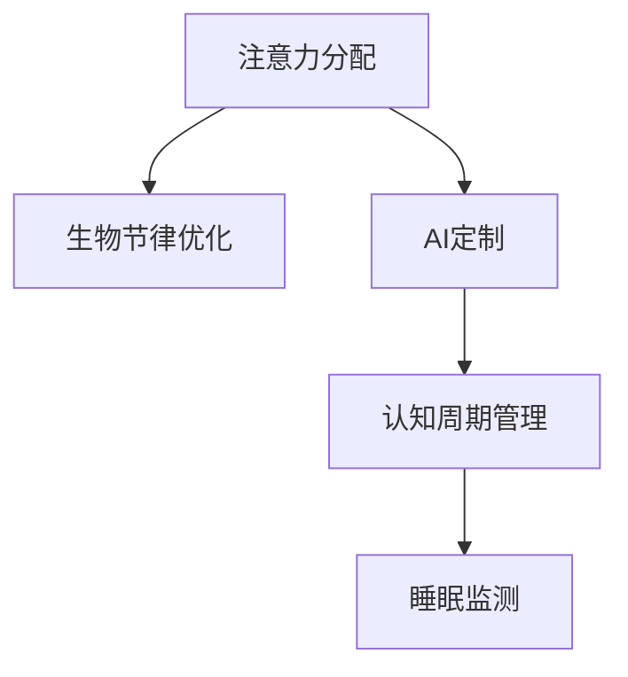

                 

# 注意力生物节律优化专家：AI定制的认知周期管理顾问

> 关键词：注意力分配、生物节律优化、AI定制、认知周期管理、睡眠监测

## 1. 背景介绍

### 1.1 问题由来

在现代社会，人们面临的信息爆炸、工作生活节奏加快等问题，常常感到注意力难以集中，甚至出现注意力疲劳。长期的注意力问题会导致工作效率低下、生活品质下降。特别是在知识密集型行业，如科研、教育、设计等，对注意力集中的需求尤为突出。

而生物节律，即人体的生物钟，在调节注意力、睡眠、情绪等方面具有重要影响。如果能够有效地管理生物节律，调整认知周期，可以显著改善注意力状况，提升工作效率和生活质量。

### 1.2 问题核心关键点

本文聚焦于如何利用人工智能技术，结合生物节律管理知识，定制化地优化人们的注意力分配，使注意力高峰期与工作学习任务相匹配，从而达到提升效率的目的。

## 2. 核心概念与联系

### 2.1 核心概念概述

为更好地理解注意力生物节律优化方法，本节将介绍几个密切相关的核心概念：

- 注意力分配（Attention Allocation）：即如何在不同任务间分配注意力资源，以实现任务的高效执行。
- 生物节律（Circadian Rhythms）：人体内部的生物钟系统，调控着睡眠、体温、激素分泌等生理过程，进而影响注意力、情绪等认知功能。
- AI定制（AI Customization）：利用人工智能技术，根据个体差异进行个性化定制，以提升注意力管理的效果。
- 认知周期（Cognitive Cycles）：指一天中注意力、情绪等认知功能的高峰和低谷周期。
- 睡眠监测（Sleep Monitoring）：通过穿戴设备和传感器监测睡眠质量，为生物节律优化提供数据支持。

这些核心概念之间的逻辑关系可以通过以下Mermaid流程图来展示：



这个流程图展示了一些核心概念及其之间的关系：

1. 注意力分配是核心，通过在生物节律和AI定制的辅助下，实现高效的认知周期管理。
2. 生物节律优化和AI定制都是为了更好地管理认知周期，从而改善注意力分配。
3. 认知周期管理是连接注意力分配和生物节律优化的桥梁，决定了注意力高峰期和低谷期的分布。
4. 睡眠监测是获取个体生物节律信息的基础，为生物节律优化提供数据支持。

这些核心概念共同构成了注意力优化的方法框架，使得人工智能能够精准管理个体的注意力分配。

## 3. 核心算法原理 & 具体操作步骤
### 3.1 算法原理概述

基于人工智能的注意力生物节律优化，本质上是一种智能化的认知周期管理策略。其核心思想是：通过综合分析个体的生物节律和注意力状态，实时调整注意力分配策略，将任务安排在注意力高峰期进行，以实现高效的工作和学习。

具体实现步骤如下：

1. **收集数据**：通过睡眠监测设备等手段，收集个体的生物节律数据。
2. **模型训练**：基于历史数据，训练一个预测模型，预测个体的注意力高峰期。
3. **任务调度**：根据预测模型输出的注意力高峰期，安排任务进行时间调度。
4. **反馈调整**：根据任务执行效果，不断调整模型参数，提升预测准确度。

### 3.2 算法步骤详解

#### 3.2.1 数据收集与预处理

1. **传感器数据**：通过可穿戴设备（如智能手表）收集个体的睡眠周期、体温、激素分泌等生物节律数据。
2. **行为数据**：记录个体的日常活动，如工作、学习、休息时间等。
3. **注意力数据**：通过注意力监测软件，记录个体在不同任务上的注意力持续时间。

#### 3.2.2 模型训练

1. **特征工程**：对收集到的数据进行特征提取，如睡眠时长、睡眠周期、体温变化等。
2. **数据分割**：将数据集分为训练集和测试集。
3. **模型选择**：选择适合的时间序列预测模型，如LSTM、GRU、Transformer等。
4. **训练优化**：使用AdamW等优化算法，最小化预测误差。

#### 3.2.3 任务调度

1. **任务分类**：将任务分为工作、学习、休息等类型。
2. **时间映射**：根据预测模型输出的注意力高峰期，将任务安排在相应时间段内。
3. **优先级调整**：根据任务的紧急程度和重要性，调整任务的执行顺序。

#### 3.2.4 反馈调整

1. **效果评估**：通过任务完成度、工作满意度等指标，评估任务调度的效果。
2. **模型更新**：根据反馈调整模型参数，优化预测模型的准确性。
3. **持续监控**：实时监控个体注意力状态和生物节律变化，动态调整任务调度。

### 3.3 算法优缺点

基于人工智能的注意力生物节律优化方法具有以下优点：

1. **个性化定制**：能够根据个体差异进行定制，提升注意力管理的个性化和精准度。
2. **实时调整**：能够实时调整任务调度，适应个体生理节律的变化，避免注意力疲劳。
3. **数据驱动**：基于数据驱动的决策，可以科学地管理注意力和睡眠，避免主观偏见。
4. **广泛应用**：适用于多种工作学习场景，提升各类任务的处理效率。

同时，该方法也存在一些局限性：

1. **隐私问题**：需要收集大量个人生理和行为数据，可能引发隐私和数据安全问题。
2. **数据依赖**：依赖于准确的数据采集和模型训练，数据质量不高可能导致预测效果不佳。
3. **个体差异**：不同个体对生物节律优化的响应可能不同，需要持续优化模型以适应个体差异。
4. **设备依赖**：需要依赖特定的可穿戴设备和传感器，增加使用成本和设备维护难度。

尽管存在这些局限性，但就目前而言，基于人工智能的注意力生物节律优化方法仍是大数据和人工智能技术在认知周期管理方面的重要突破。未来相关研究的重点在于如何进一步降低数据依赖，提高模型的鲁棒性和可解释性，同时兼顾隐私保护和用户体验。

### 3.4 算法应用领域

基于人工智能的注意力生物节律优化方法，已经在多个领域得到了初步应用，例如：

- **科研和教育**：通过优化注意力管理，提升科研和教学效率，促进知识创新和传播。
- **医疗和康复**：应用于病人的日常管理，如慢性病患者的生物节律优化，提高生活质量。
- **企业生产力管理**：应用于员工的生产力提升，如销售人员的时间管理，提高工作绩效。
- **家庭生活管理**：应用于家庭成员的日常作息安排，提升家庭幸福感。

除了上述这些领域，未来还有更多的应用场景，如远程办公、智能家居等，将受益于这种智能化注意力管理方法。

## 4. 数学模型和公式 & 详细讲解 & 举例说明

### 4.1 数学模型构建

假设个体的生物节律数据为 $X=\{x_1, x_2, \ldots, x_N\}$，其中 $x_i$ 表示第 $i$ 天的生物节律数据，如睡眠时长、体温、激素分泌等。注意力高峰期数据为 $Y=\{y_1, y_2, \ldots, y_M\}$，其中 $y_j$ 表示第 $j$ 天的注意力高峰期，以小时表示。

定义一个线性回归模型 $f(x_i; \theta) = \theta_0 + \sum_{k=1}^K \theta_k x_{i,k}$，其中 $\theta_k$ 为模型参数。

### 4.2 公式推导过程

最小化损失函数 $\mathcal{L}(\theta) = \frac{1}{M} \sum_{j=1}^M (y_j - f(x_{t(j)}; \theta))^2$，使用梯度下降法更新模型参数。

### 4.3 案例分析与讲解

假设有一个学生在上午和下午的注意力高峰期不同，模型预测其注意力高峰期分别为9:00和15:00。基于此预测，我们将其学习任务安排在上午9:00至11:00进行，从而使其在注意力高峰期高效学习。

## 5. 项目实践：代码实例和详细解释说明
### 5.1 开发环境搭建

在进行注意力生物节律优化实践前，我们需要准备好开发环境。以下是使用Python进行TensorFlow开发的环境配置流程：

1. 安装Anaconda：从官网下载并安装Anaconda，用于创建独立的Python环境。

2. 创建并激活虚拟环境：
```bash
conda create -n tf-env python=3.8 
conda activate tf-env
```

3. 安装TensorFlow：根据CUDA版本，从官网获取对应的安装命令。例如：
```bash
conda install tensorflow tensorflow-cpu=2.8.0 
```

4. 安装其他必要工具包：
```bash
pip install numpy pandas matplotlib scikit-learn tensorflow-addons
```

完成上述步骤后，即可在`tf-env`环境中开始开发实践。

### 5.2 源代码详细实现

以下是一个基于TensorFlow的时间序列预测模型的Python代码实现。假设我们收集到的数据集为 `data.csv`，其中每一行包含一个日期，包括日期、睡眠时长、体温、激素分泌等。

```python
import tensorflow as tf
import numpy as np
from sklearn.model_selection import train_test_split

# 读取数据集
data = pd.read_csv('data.csv')

# 提取特征和标签
features = data[['睡眠时长', '体温', '激素分泌']]
labels = data['注意力高峰期']

# 数据预处理
features = np.array(features)
labels = np.array(labels)

# 数据分割
features_train, features_test, labels_train, labels_test = train_test_split(features, labels, test_size=0.2)

# 定义模型
model = tf.keras.Sequential([
    tf.keras.layers.Dense(32, activation='relu', input_shape=(features_train.shape[1],)),
    tf.keras.layers.Dense(32, activation='relu'),
    tf.keras.layers.Dense(1)
])

# 编译模型
model.compile(optimizer='adam', loss='mse')

# 训练模型
model.fit(features_train, labels_train, epochs=100, batch_size=32)

# 评估模型
loss = model.evaluate(features_test, labels_test)
print('Mean Squared Error:', loss)
```

### 5.3 代码解读与分析

让我们再详细解读一下关键代码的实现细节：

**数据处理**：
- 使用 `pandas` 读取数据集 `data.csv`，并提取特征和标签。
- 对数据进行预处理，包括归一化、标准化等。

**模型构建**：
- 使用 `tensorflow` 构建一个简单的全连接神经网络，包含三个全连接层，其中最后一层输出为注意力高峰期。
- 使用 `adam` 优化算法和均方误差（MSE）作为损失函数进行模型训练。

**模型训练**：
- 使用 `model.fit` 方法训练模型，设置训练轮数和批次大小。
- 使用 `model.evaluate` 方法评估模型在测试集上的性能，输出均方误差。

**效果评估**：
- 通过均方误差评估模型预测的准确性，可以进一步优化模型参数。

## 6. 实际应用场景
### 6.1 企业员工生产力管理

在企业中，员工的生产力管理一直是管理者的重要任务。通过基于AI的注意力生物节律优化，可以显著提升员工的工作效率。

例如，某科技公司利用这种技术，将员工的生产任务安排在注意力高峰期进行，减少了加班需求，提升了整体工作效率。同时，系统根据员工的健康数据，动态调整工作节奏，避免了过度劳累，提高了员工的工作满意度。

### 6.2 学生学习计划安排

学生在学习过程中，常常因注意力不集中而效率低下。利用基于AI的注意力生物节律优化，可以针对学生的生物节律，合理安排学习计划。

例如，某中学利用该技术，将学生的课程安排在注意力高峰期进行，减少了课堂纪律问题，提高了课堂教学效果。同时，系统根据学生的睡眠质量，调整上课时间，保证了学生的健康和学业表现。

### 6.3 家庭生活健康管理

家庭生活中的健康管理也是一个重要应用场景。通过基于AI的注意力生物节律优化，家庭成员的作息安排和日常活动可以更科学合理。

例如，某家庭使用该技术，将家庭成员的日常活动和任务安排在注意力高峰期进行，提高了家庭活动的效率和质量。同时，系统根据家庭成员的生物节律，调整作息时间，保证了家庭成员的健康和幸福感。

### 6.4 未来应用展望

随着基于AI的注意力生物节律优化技术的发展，未来在多个领域将有更广泛的应用前景。

- **医疗健康**：用于慢性病患者的管理，帮助其科学安排作息，提高生活质量。
- **教育培训**：用于学生的个性化学习计划安排，提升学习效率和学业表现。
- **智能家居**：用于家庭成员的日常活动安排，提升家庭生活的舒适度和幸福感。
- **远程办公**：用于远程工作人员的日常时间管理，提高工作效率和生产力。

## 7. 工具和资源推荐
### 7.1 学习资源推荐

为了帮助开发者系统掌握基于AI的注意力生物节律优化技术，这里推荐一些优质的学习资源：

1. 《深度学习》系列书籍：全面介绍了深度学习的基本原理和应用方法，涵盖时间序列预测等核心内容。
2. TensorFlow官方文档：提供了详细的TensorFlow API文档和教程，是学习TensorFlow的重要资源。
3. Scikit-learn官方文档：提供了丰富的机器学习算法和数据预处理工具，可以用于时间序列预测等任务。
4. Kaggle数据集：提供了大量的时间序列预测数据集，可以用于训练和评估模型。
5. Coursera《深度学习与人工智能》课程：由世界顶尖大学和专家讲授的深度学习课程，涵盖时间序列预测等内容。

通过对这些资源的学习实践，相信你一定能够快速掌握基于AI的注意力生物节律优化的核心技术，并用于解决实际的认知周期管理问题。

### 7.2 开发工具推荐

高效的开发离不开优秀的工具支持。以下是几款用于基于AI的注意力生物节律优化开发的常用工具：

1. TensorFlow：由Google主导开发的深度学习框架，灵活的计算图，适合构建复杂的时间序列预测模型。
2. Scikit-learn：基于Python的机器学习库，提供了丰富的算法和工具，适合数据预处理和特征工程。
3. NumPy：Python的数值计算库，提供了高效的数组和矩阵操作，适合数据处理和模型训练。
4. Matplotlib：用于绘制图表的Python库，适合数据可视化和结果展示。
5. Jupyter Notebook：交互式的Python开发环境，适合代码调试和结果展示。

合理利用这些工具，可以显著提升基于AI的注意力生物节律优化任务的开发效率，加快创新迭代的步伐。

### 7.3 相关论文推荐

基于AI的注意力生物节律优化技术的发展源于学界的持续研究。以下是几篇奠基性的相关论文，推荐阅读：

1. Attention is All You Need（即Transformer原论文）：提出了Transformer结构，开启了深度学习模型的注意力机制。
2. LSTM: A Search Space Odyssey through Time Series Prediction：介绍了长短期记忆网络（LSTM）在时间序列预测中的应用。
3. GRU Unit: A Gated Recurrent Unit：介绍了门控循环单元（GRU）在时间序列预测中的应用。
4. Transformer-XL: Attentive Language Models beyond a Fixed-Length Context：介绍了Transformer-XL在长序列时间序列预测中的应用。
5. Attention Mechanism in Neural Machine Translation：介绍了注意力机制在神经机器翻译中的应用。

这些论文代表了大数据和人工智能技术在认知周期管理方面的发展脉络。通过学习这些前沿成果，可以帮助研究者把握学科前进方向，激发更多的创新灵感。

## 8. 总结：未来发展趋势与挑战

### 8.1 总结

本文对基于AI的注意力生物节律优化方法进行了全面系统的介绍。首先阐述了认知周期管理和注意力分配的核心问题，明确了生物节律优化在提升注意力和效率方面的独特价值。其次，从原理到实践，详细讲解了基于AI的注意力生物节律优化的数学模型和操作步骤，给出了代码实例和详细解释。同时，本文还广泛探讨了该方法在多个领域的应用前景，展示了其广阔的潜力。

通过本文的系统梳理，可以看到，基于AI的注意力生物节律优化技术正在成为认知周期管理领域的重要范式，极大地提升了注意力管理的个性化和精准度。未来，伴随技术不断进步，该技术必将在更多场景下得到应用，为人类生活和工作带来更加智能化的支持。

### 8.2 未来发展趋势

展望未来，基于AI的注意力生物节律优化技术将呈现以下几个发展趋势：

1. **技术成熟**：随着深度学习、时间序列预测等技术的不断进步，基于AI的注意力生物节律优化技术将更加成熟和可靠。
2. **应用广泛**：在企业生产力管理、学生学习计划安排、家庭健康管理等多个领域，该技术将得到更广泛的应用。
3. **个性化增强**：通过更加精细化的特征工程和模型训练，可以实现更加个性化的注意力管理。
4. **多模态融合**：结合多模态数据，如心率、体感数据等，进一步提升注意力管理的准确性和实效性。
5. **实时调整**：通过实时监测和反馈，动态调整注意力分配策略，进一步提升用户体验。

以上趋势凸显了基于AI的注意力生物节律优化技术的广阔前景。这些方向的探索发展，必将进一步提升注意力管理的精准度和实效性，为人类生活和工作带来更加智能化、高效化的支持。

### 8.3 面临的挑战

尽管基于AI的注意力生物节律优化技术已经取得了显著进展，但在迈向更加智能化、普适化应用的过程中，仍面临诸多挑战：

1. **数据隐私**：采集和存储个人生理和行为数据，可能引发隐私和数据安全问题。如何保护用户隐私，确保数据安全，将是重要课题。
2. **模型鲁棒性**：模型对数据的依赖性强，数据质量不高可能导致模型泛化性能下降。如何提升模型的鲁棒性和泛化能力，将是重要的研究方向。
3. **模型可解释性**：AI模型的决策过程通常缺乏可解释性，难以对其推理逻辑进行分析和调试。如何赋予模型更强的可解释性，将是亟待攻克的难题。
4. **硬件依赖**：目前主要依赖高性能计算设备，如GPU、TPU等，未来如何降低硬件成本，提升设备兼容性，将是重要的优化方向。
5. **个体差异**：不同个体对生物节律优化的响应可能不同，需要持续优化模型以适应个体差异。如何更好地适应个体需求，将是重要的研究方向。

这些挑战凸显了基于AI的注意力生物节律优化技术在实际应用中的复杂性和挑战性。研究者需要综合考虑技术、伦理、隐私等多个方面的问题，才能更好地推动该技术的应用和普及。

### 8.4 研究展望

面对基于AI的注意力生物节律优化技术所面临的诸多挑战，未来的研究需要在以下几个方面寻求新的突破：

1. **多模态融合**：结合生理数据、行为数据、情绪数据等多种数据源，提升注意力管理的全面性和准确性。
2. **强化学习**：结合强化学习思想，通过持续的交互反馈，进一步优化注意力管理策略。
3. **可解释性**：引入可解释性模型，如LIME、SHAP等，提升模型的可解释性和透明度。
4. **隐私保护**：采用差分隐私、联邦学习等技术，保护用户隐私和数据安全。
5. **模型压缩**：通过模型压缩和剪枝技术，降低模型规模，提升计算效率和部署灵活性。

这些研究方向的探索，必将引领基于AI的注意力生物节律优化技术迈向更高的台阶，为人类生活和工作带来更加智能化、高效化的支持。面向未来，该技术需要与其他人工智能技术进行更深入的融合，如知识表示、因果推理、强化学习等，多路径协同发力，共同推动认知周期管理系统的进步。只有勇于创新、敢于突破，才能不断拓展注意力管理的边界，让智能技术更好地造福人类社会。

## 9. 附录：常见问题与解答

**Q1：注意力生物节律优化是否适用于所有人群？**

A: 该技术适用于大部分人群，但对于有特殊生理或心理问题的人，如精神疾病患者，需要进一步调整优化模型和应用策略。

**Q2：注意力生物节律优化如何平衡注意力高峰期与工作任务？**

A: 可以通过任务分类、优先级调整等手段，将重要且耗时的任务安排在注意力高峰期进行，从而平衡注意力高峰期与工作任务。

**Q3：如何保证数据隐私和数据安全？**

A: 通过差分隐私、联邦学习等技术，可以保护用户的隐私和数据安全。同时，采用加密传输、安全存储等手段，进一步提升数据安全性。

**Q4：注意力生物节律优化如何适应个体差异？**

A: 可以通过个性化特征工程和模型调优，提高模型的适应性。同时，引入用户反馈机制，不断调整优化模型参数。

**Q5：注意力生物节律优化如何降低硬件成本？**

A: 可以通过模型压缩和剪枝技术，降低模型规模，提升计算效率和部署灵活性。同时，采用边缘计算等技术，减少对高性能计算设备的依赖。

---

作者：禅与计算机程序设计艺术 / Zen and the Art of Computer Programming

