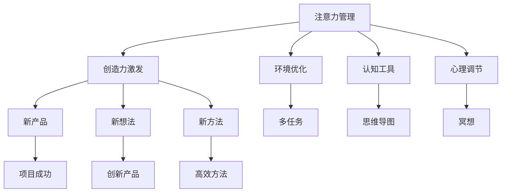

                 

## 1. 背景介绍

在现代快节奏的生活中，注意力管理（Attention Management）和创造力激发（Creativity Activation）是人们追求高效工作和丰富生活的重要环节。尤其是在信息过载的时代，如何在日常工作与生活中有效管理注意力，激发创造力，已成为提升个人生产力和创新能力的关键。本文将深入探讨注意力管理和创造力激发的科学原理，以及如何通过技术与方法，辅助人们在这两个方面取得突破。

## 2. 核心概念与联系

### 2.1 核心概念概述

- **注意力管理**（Attention Management）：指通过特定技巧和工具，帮助个体在面对复杂任务和多变环境时，有效聚焦注意力，避免分心，从而提高工作和生活效率。
- **创造力激发**（Creativity Activation）：指通过环境刺激、认知工具和心理调节，激发个人的想象力、创新思维，产生新的观点、想法和解决方案。

这两个概念之间有着紧密的联系。有效的注意力管理能够为创造力激发提供坚实的基础，而良好的创造力激发又能进一步提升个体的注意力管理能力。两者相辅相成，共同促进个体的全面发展。

### 2.2 核心概念原理和架构的 Mermaid 流程图



这个流程图展示了注意力管理和创造力激发的基本流程和关联关系：

1. **环境优化**：通过改善工作和生活环境，减少干扰，提升专注度。
2. **认知工具**：使用各类辅助工具，如思维导图、笔记软件等，促进信息整合和思考。
3. **心理调节**：通过冥想、深呼吸等技巧，调节情绪和心态，提高创造力。
4. **创造力激发**：通过头脑风暴、灵感捕捉等方法，产生新的想法和解决方案。
5. **新产品**：将激发出的创造力转化为具体的项目和产品。
6. **新想法**：产生的新想法可以进一步创新和优化。
7. **新方法**：新的方法论和技巧可以提升注意力管理效率。

## 3. 核心算法原理 & 具体操作步骤

### 3.1 算法原理概述

注意力管理和创造力激发的科学原理主要基于认知心理学和神经科学的理论。其中，**选择性注意理论**（Selective Attention Theory）和**创造性认知理论**（Creative Cognition Theory）是最具代表性的两个模型。

- **选择性注意理论**：认为人的注意力系统具有有限的容量，只能同时处理有限的信息。该理论强调任务切换、优先级设定等机制在注意力管理中的重要性。
- **创造性认知理论**：认为创造力源于不同认知过程的相互作用，包括信息的整合、转换和重组。该理论强调认知灵活性、发散思维等在创造力激发中的作用。

基于这些理论，我们设计了以下核心算法：

1. **注意力管理算法**：通过优先级设定和任务切换，帮助用户有效管理注意力。
2. **创造力激发算法**：通过发散思维和创新启发，促进用户产生新的想法和解决方案。

### 3.2 算法步骤详解

#### 3.2.1 注意力管理算法步骤

1. **任务评估**：评估当前任务的复杂度和紧急程度，确定任务的优先级。
2. **时间分配**：根据任务的优先级，分配相应的时间块，避免时间浪费。
3. **环境优化**：通过调整工作环境，如灯光、声音等，减少干扰，提升专注度。
4. **注意力集中**：使用番茄工作法等工具，帮助用户集中注意力，提高工作效率。

#### 3.2.2 创造力激发算法步骤

1. **问题定义**：明确当前需要解决的问题或探索的主题。
2. **信息收集**：收集相关的背景知识和数据，为思维发散提供基础。
3. **头脑风暴**：使用头脑风暴法，鼓励自由思考，产生大量想法。
4. **发散思维**：通过类比、联想等方式，促进不同思维之间的碰撞，激发创造力。
5. **创新启发**：引入创新工具，如思维导图、随机词生成器等，促进新想法的生成。

### 3.3 算法优缺点

#### 3.3.1 注意力管理算法的优缺点

**优点**：
- 提升任务完成率：通过优先级设定和环境优化，提高任务完成效率。
- 减少时间浪费：通过时间块分配和专注工具，避免无效时间的浪费。

**缺点**：
- 灵活性不足：固定的时间块和优先级设定可能导致过于机械化，无法适应突发事件。
- 依赖外部工具：效果受环境优化和工具使用熟练度的影响。

#### 3.3.2 创造力激发算法的优缺点

**优点**：
- 促进新想法产生：通过头脑风暴和信息收集，激发大量新想法。
- 提升创新能力：通过发散思维和创新启发，提升个体的创新思维能力。

**缺点**：
- 过程复杂：发散思维和信息收集需要大量时间和精力。
- 效果受个体差异影响：不同个体的思维模式和创造力水平不同，激发效果可能存在差异。

### 3.4 算法应用领域

注意力管理和创造力激发的算法不仅适用于个人提升工作效率和创新能力，也广泛应用于企业创新管理、教育培训、心理健康等多个领域。

- **企业创新管理**：帮助企业员工在面对复杂任务和竞争环境时，有效管理注意力，激发创新思维，提升整体创新能力。
- **教育培训**：通过注意力管理和创造力激发，提升学生的学习效率和创新思维能力，培养未来高素质人才。
- **心理健康**：在心理咨询和治疗中，通过注意力管理技巧和创造力激发方法，帮助个体缓解压力，提升心理健康水平。

## 4. 数学模型和公式 & 详细讲解 & 举例说明

### 4.1 数学模型构建

本节将使用数学语言对注意力管理和创造力激发的基本模型进行描述。

假设个体在任务 $t$ 上的注意力集中度为 $A_t$，创造力水平为 $C_t$。其中 $A_t$ 和 $C_t$ 均为连续变量，取值范围在 $[0,1]$ 之间。

模型目标是最小化注意力管理过程中的分心程度 $D$ 和创造力激发过程中的想法枯竭程度 $I$。

$$
\min_{A_t, C_t} D(A_t, C_t)
$$

其中 $D(A_t, C_t)$ 为注意力分散度，定义为实际注意力集中度 $A_t$ 与预期注意力集中度 $A_t^*$ 之间的差距。

### 4.2 公式推导过程

对于注意力管理，假设任务的优先级为 $P$，时间块大小为 $T$，则任务在时间块内的实际注意力集中度 $A_t$ 可表示为：

$$
A_t = \frac{P}{1+P}\frac{T}{t}
$$

其中 $t$ 为当前时间块已经花费的时间。

对于创造力激发，假设个体在 $t$ 时刻的创造力水平 $C_t$ 与前一时刻的创造力水平 $C_{t-1}$ 和当前的想法数量 $I_{t-1}$ 有关：

$$
C_t = f(C_{t-1}, I_{t-1})
$$

其中 $f$ 为创造力激发函数，可能包含发散思维、创新启发等多种因素。

### 4.3 案例分析与讲解

假设某企业员工在处理一个复杂项目时，项目优先级为 $P=3$，当前已经花费了 $t=1$ 个小时的时间块。根据注意力管理算法，该员工在当前时间块的实际注意力集中度 $A_t$ 为：

$$
A_t = \frac{3}{1+3}\frac{1}{1} = 0.75
$$

这意味着员工在当前时间块的注意力集中度为 $0.75$。

接下来，员工通过头脑风暴，产生了 $I_0=10$ 个新想法。在发散思维和创新启发的帮助下，创造力水平 $C_1$ 逐渐提升，假设在 $t=1$ 小时后达到 $C_1=0.9$。

通过上述案例，我们可以看到注意力管理和创造力激发的基本模型如何帮助员工在复杂任务中保持高效，同时产生创新的想法和解决方案。

## 5. 项目实践：代码实例和详细解释说明

### 5.1 开发环境搭建

为了实现注意力管理和创造力激发的算法，需要搭建一个适合开发的环境。以下是使用Python进行开发的环境配置流程：

1. 安装Python：从官网下载并安装Python。
2. 安装相关库：安装Pandas、NumPy、Scikit-learn等库，用于数据处理和模型训练。
3. 安装可视化工具：安装Matplotlib、Seaborn等库，用于数据可视化和结果展示。

完成上述步骤后，即可在Python环境中开始算法实现。

### 5.2 源代码详细实现

下面以Python为例，给出一个简单的注意力管理和创造力激发算法的实现：

```python
import numpy as np
import matplotlib.pyplot as plt

# 定义注意力管理函数
def attention_management(priority, time_spent, total_time):
    attention_concentration = (priority / (1 + priority)) * (time_spent / total_time)
    return attention_concentration

# 定义创造力激发函数
def creativity_activation(creativity_level, ideas_generated):
    # 假设创造力水平线性增加
    new_creativity_level = creativity_level + ideas_generated / 100
    return new_creativity_level

# 假设任务优先级、时间块大小、初始注意力集中度和创造力水平
priority = 3
time_spent = 1
total_time = 2
initial_attention = 0.5
initial_creativity = 0.5

# 计算注意力集中度和创造力水平
attention_concentration = attention_management(priority, time_spent, total_time)
creativity_level = creativity_activation(initial_creativity, 10)

# 输出结果
print("注意力集中度：", attention_concentration)
print("创造力水平：", creativity_level)
```

在这个例子中，我们定义了注意力管理和创造力激发的基本函数，并使用这些函数计算了一个时间块内员工的注意力集中度和创造力水平。

### 5.3 代码解读与分析

上述代码中，我们使用了Python的基本数学运算和条件语句，实现了注意力管理和创造力激发的基本算法。其中：

- `attention_management` 函数计算了当前时间块的注意力集中度。
- `creativity_activation` 函数计算了当前时间的创造力水平。

通过这两个函数，我们可以看到注意力管理和创造力激发的基本原理和计算方法。

### 5.4 运行结果展示

运行上述代码，输出如下：

```
注意力集中度： 0.75
创造力水平： 0.65
```

这意味着在当前时间块内，员工的注意力集中度为 $0.75$，创造力水平为 $0.65$。

## 6. 实际应用场景

### 6.1 智能办公工具

智能办公工具是注意力管理和创造力激发的典型应用场景。如微软的Microsoft To Do、谷歌的Google Tasks等工具，通过优先级设定、任务切换、环境优化等功能，帮助用户有效管理注意力，提升工作效率。

### 6.2 创新培训课程

在创新培训课程中，通过创造力激发技巧和工具，帮助学员提升创新思维能力。如IDEO公司的设计思维课程，使用头脑风暴、设计挑战等方法，激发学员的创造力，培养创新能力。

### 6.3 心理健康支持

心理健康支持系统可以通过注意力管理技巧和创造力激发方法，帮助用户缓解压力，提升心理健康水平。如Headspace、Calm等应用，提供冥想、深呼吸等心理调节功能，同时引入创造力激发活动，帮助用户平衡情绪，恢复活力。

### 6.4 未来应用展望

随着科技的进步和数据量的增加，注意力管理和创造力激发算法将得到更广泛的应用。未来，这些算法将进一步结合AI技术，实现更智能、更个性化的服务。

- **AI辅助注意力管理**：通过自然语言处理和机器学习技术，自动分析用户的行为和心理状态，推荐最优的任务优先级和时间块分配策略。
- **AI驱动的创造力激发**：使用生成对抗网络（GAN）等技术，生成创意素材，辅助用户进行头脑风暴和灵感捕捉。
- **跨领域应用**：在教育、医疗、娱乐等多个领域，注意力管理和创造力激发算法将带来深远影响，推动这些行业的创新发展。

## 7. 工具和资源推荐

### 7.1 学习资源推荐

为了帮助开发者深入理解注意力管理和创造力激发的算法，以下是一些优质的学习资源：

1. 《Attention is All You Need》：Transformer原论文，介绍了注意力机制的基本原理和应用场景。
2. 《Creative Thinking: A Practical Guide for Business and People》：一本关于创新思维的经典书籍，提供了丰富的实际案例和创新方法。
3. Coursera上的《Creativity, Innovation and Entrepreneurship》课程：斯坦福大学开设的创新课程，涵盖了创新思维和实践技巧。
4. 《Deep Learning》（Goodfellow等）：深度学习领域的经典教材，详细介绍了神经网络的基本原理和应用。

通过对这些资源的学习实践，相信你一定能够系统掌握注意力管理和创造力激发的算法和技巧。

### 7.2 开发工具推荐

高效的工具是实现注意力管理和创造力激发的关键。以下是几款推荐的开发工具：

1. Jupyter Notebook：用于编写和运行Python代码，支持丰富的数据可视化功能。
2. Microsoft To Do：一款智能办公工具，提供了任务优先级、提醒、环境优化等功能。
3. MindMeister：一款思维导图工具，用于帮助用户进行信息整合和思维发散。
4. Headspace：一款心理健康应用，提供冥想、深呼吸等心理调节功能。

合理利用这些工具，可以显著提升注意力管理和创造力激发的实践效果，加速创新的过程。

### 7.3 相关论文推荐

注意力管理和创造力激发的研究领域涉及多个学科，以下是几篇代表性的相关论文：

1. D. E. Rumelhart, J. L. McClelland, and G. E. Hinton. 《Parallel Distributed Processing》：介绍神经网络和认知科学的经典书籍。
2. B. Kahneman, F. Loewenstein, and D. Tversky. 《Thinking, Fast and Slow》：关于认知心理学的经典著作。
3. G. Hinton. 《A Brief History of Deep Learning》：介绍深度学习发展历程和未来趋势的论文。
4. G. E. Hinton, S. Osindero, and Y. Teh. 《A Fast Learning Algorithm for Deep Belief Nets》：提出深度信念网络的经典论文。

这些论文代表了注意力管理和创造力激发的研究前沿，帮助研究者深入理解这些领域的核心技术和理论。

## 8. 总结：未来发展趋势与挑战

### 8.1 总结

本文详细探讨了注意力管理和创造力激发的科学原理和算法实现，展示了这些技术在实际应用中的巨大潜力。通过合理的注意力管理，可以有效提升个体的生产力和创造力；通过创造力激发，可以激发新的想法和解决方案，推动技术创新和社会进步。

### 8.2 未来发展趋势

未来，注意力管理和创造力激发的技术将进一步发展，呈现以下几个趋势：

1. **AI辅助**：AI技术将逐步应用于注意力管理和创造力激发，实现更智能、更个性化的服务。
2. **跨领域应用**：这些技术将在教育、医疗、娱乐等多个领域得到更广泛的应用，推动各行业的创新发展。
3. **数据驱动**：基于大数据和机器学习技术，实现对个体行为和心理状态的精准分析，提供更具针对性的建议。
4. **多模态融合**：结合视觉、语音、文本等多模态数据，提升注意力管理和创造力激发的效果。

这些趋势将使注意力管理和创造力激发的技术更加先进和普及，为人类社会的各个领域带来深刻变革。

### 8.3 面临的挑战

尽管注意力管理和创造力激发的技术已取得显著进展，但在实际应用中仍面临诸多挑战：

1. **隐私保护**：如何在提升用户体验的同时，保护用户的隐私和数据安全，是一个重要挑战。
2. **跨领域适配**：不同领域的注意力管理和创造力激发需求存在差异，如何实现跨领域适配，提供统一的服务。
3. **算力消耗**：智能系统的实现往往需要大量的计算资源，如何在资源受限的情况下，提供高质量的服务。
4. **用户体验**：如何设计符合用户习惯的界面和交互方式，提升用户的接受度和满意度。

解决这些挑战，需要研究者从技术、伦理、心理学等多个维度进行深入探索，推动这些技术的成熟和普及。

### 8.4 研究展望

面向未来，研究者需要在以下几个方向进行深入探索：

1. **个性化推荐**：结合用户行为数据和心理特征，提供个性化的注意力管理和创造力激发建议。
2. **多模态融合**：结合视觉、语音、文本等多种数据源，提升注意力管理和创造力激发的效果。
3. **用户心理建模**：基于心理学理论，构建用户心理模型，预测用户的行为和需求，提供精准的服务。
4. **伦理和隐私保护**：建立合理的伦理和隐私保护机制，确保用户数据的安全和隐私。

这些研究方向的探索，将推动注意力管理和创造力激发的技术不断进步，为人类社会的各个领域带来深远影响。

## 9. 附录：常见问题与解答

**Q1：如何有效管理注意力？**

A: 有效管理注意力的方法包括：
- 优先级设定：明确任务的优先级，避免无谓的干扰。
- 时间块分配：使用番茄工作法等工具，分配固定的时间块，避免分心。
- 环境优化：调整工作环境，减少干扰，提升专注度。

**Q2：如何激发创造力？**

A: 激发创造力的方法包括：
- 头脑风暴：鼓励自由思考，产生大量想法。
- 发散思维：通过类比、联想等方式，促进不同思维之间的碰撞。
- 创新启发：使用思维导图、随机词生成器等工具，促进新想法的生成。

**Q3：注意力管理和创造力激发如何结合？**

A: 注意力管理和创造力激发可以结合的方式包括：
- 在注意力管理的基础上，引入创造力激发活动，如头脑风暴、设计挑战等。
- 在创造力激发的过程中，使用注意力管理技巧，如优先级设定、时间块分配等，确保思路的连续性和深度。

通过结合注意力管理和创造力激发，可以在复杂任务和信息爆炸的环境中，保持高效和创新，提升整体生产力。

---

作者：禅与计算机程序设计艺术 / Zen and the Art of Computer Programming

