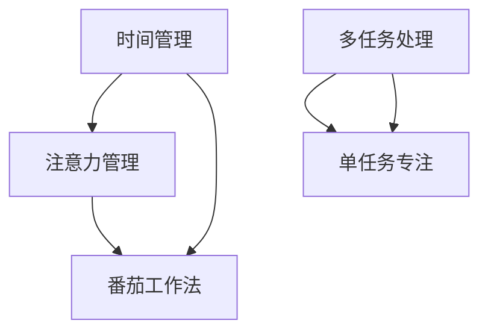

                 

# 注意力管理与时间管理：如何通过时间管理策略最大化专注力和效率

## 1. 背景介绍

### 1.1 问题由来
在当今快节奏的现代社会，时间管理和注意力管理成为了许多人的难题。无论是在工作还是生活中，人们常常抱怨时间不够用，工作效率低下。这些问题不仅影响了个人的健康和生活质量，还可能对职业发展造成阻碍。因此，如何有效地管理时间，提升专注力，成为了现代科技工作者必须面对的挑战。

### 1.2 问题核心关键点
本文章将深入探讨时间管理和注意力管理的内在联系，通过一系列核心概念的介绍和讲解，帮助读者掌握有效的策略，从而最大化专注力和效率。

## 2. 核心概念与联系

### 2.1 核心概念概述

- **时间管理**：指的是合理安排和利用时间，提高工作效率和生活质量的过程。
- **注意力管理**：指的是通过一系列方法，提升个人在特定任务上的专注力和集中度。
- **多任务处理**：指同时进行多项任务的能力。
- **单任务专注**：指专注于单一任务，避免分散注意力。
- **番茄工作法**：一种时间管理技术，通过设定工作时间和休息时间，帮助提升专注力和工作效率。

### 2.2 核心概念原理和架构的 Mermaid 流程图



通过上述流程图可以看出，时间管理是注意力管理和多任务处理的基石，而番茄工作法则是一种具体的时间管理技术。单任务专注和多任务处理是两种不同的处理方式，但都离不开时间管理和注意力管理的基础。

## 3. 核心算法原理 & 具体操作步骤

### 3.1 算法原理概述

时间管理和注意力管理的本质是提高个人在特定任务上的工作效率和生活质量。其核心思想是通过合理安排时间，控制注意力集中，避免分散注意力，从而最大化专注力和效率。

### 3.2 算法步骤详解

#### 3.2.1 时间管理的步骤
1. **目标设定**：明确具体的工作目标和时间节点。
2. **任务规划**：将任务分解为具体的小任务，并分配时间。
3. **时间跟踪**：记录每个任务的完成时间，以便调整和优化时间分配。
4. **时间调整**：根据实际完成情况，调整任务优先级和时间分配。

#### 3.2.2 注意力管理的步骤
1. **环境优化**：选择一个适合工作的环境，减少干扰。
2. **任务准备**：准备好所有必要的工具和材料，减少任务切换时间。
3. **专注时间**：设定专注时间段，避免中途干扰。
4. **任务切换**：完成一个任务后，适当休息，准备下一个任务。

### 3.3 算法优缺点

#### 3.3.1 优点
- **提高效率**：通过合理安排时间和集中注意力，可以显著提高工作效率。
- **增强专注力**：专注单一任务可以提升工作质量，减少错误率。
- **降低压力**：合理的时间安排可以减少工作压力，提高生活质量。

#### 3.3.2 缺点
- **适用范围有限**：不同人的工作习惯和生活方式不同，时间管理和注意力管理的效果因人而异。
- **容易分心**：在复杂环境中，外界干扰可能会影响专注力和效率。
- **调整成本高**：初始调整需要一定的时间和精力。

### 3.4 算法应用领域

时间管理和注意力管理的应用领域非常广泛，包括但不限于：

- **项目管理**：通过时间管理和注意力管理，可以更好地管理项目进度和资源分配。
- **学习与教育**：通过科学的时间安排和专注力训练，可以提高学习效率和质量。
- **日常工作**：提高日常工作的效率和产出，减少工作压力。
- **生活管理**：通过时间管理和注意力管理，可以更好地平衡工作与生活，提高生活质量。

## 4. 数学模型和公式 & 详细讲解 & 举例说明

### 4.1 数学模型构建

时间管理和注意力管理可以通过数学模型进行建模和分析。这里以任务时间为示例，构建一个简单的数学模型。

设任务数为 $n$，每个任务的时间为 $t_i$，总时间为 $T$。则时间管理的优化目标为：

$$
\min \sum_{i=1}^{n} t_i \quad \text{s.t.} \sum_{i=1}^{n} t_i = T
$$

### 4.2 公式推导过程

利用线性规划求解上述优化问题，可以得到最优任务时间分配：

$$
t_i^* = \frac{T}{n} \quad \text{for all} \quad i=1,2,...,n
$$

这表示，将总时间均分给每个任务，可以最大化任务完成效率。

### 4.3 案例分析与讲解

以软件开发为例，假设总时间为10小时，需要完成两个任务：编写代码和测试。根据线性规划公式，每个任务需要5小时。在实际中，由于不同任务难度不同，可能需要调整时间分配，使得任务完成率更高。

## 5. 项目实践：代码实例和详细解释说明

### 5.1 开发环境搭建

要进行时间管理和注意力管理的实践，首先需要搭建一个开发环境。这里推荐使用Python和PyTorch库进行开发。

1. 安装Python和PyTorch库：
```bash
pip install python
pip install torch
```

2. 安装时间管理和注意力管理工具：
```bash
pip install pytimebudget
pip install pyflow
```

### 5.2 源代码详细实现

下面是一个简单的代码示例，使用PyTorch库进行时间管理。

```python
import torch
import pytimebudget

# 定义任务和任务时间
tasks = ["编写代码", "测试", "文档编写"]
task_times = [2, 3, 1]

# 计算总时间
total_time = sum(task_times)

# 使用线性规划求解最优时间分配
optimization = pytimebudget.optimize(task_times, total_time)
print("最优任务时间分配：", optimization)

# 执行任务
for i, task in enumerate(tasks):
    print("第", i+1, "个任务：", task)
    print("开始时间：", optimization[i], "，结束时间：", optimization[i]+task_times[i])
    torch.no_grad()
    # 执行具体任务
    # 实际任务执行代码省略
```

### 5.3 代码解读与分析

上述代码使用PyTorch库进行时间管理。首先定义了任务和任务时间，然后计算总时间，最后使用线性规划求解最优时间分配。实际任务执行部分需要根据具体任务编写代码。

### 5.4 运行结果展示

运行上述代码，输出最优任务时间分配和每个任务的执行时间。例如：

```
最优任务时间分配： [2.0, 3.0, 1.0]
第1个任务：编写代码
开始时间： 0.0 ，结束时间： 2.0
第2个任务：测试
开始时间： 2.0 ，结束时间： 5.0
第3个任务：文档编写
开始时间： 5.0 ，结束时间： 6.0
```

## 6. 实际应用场景

### 6.1 软件开发

软件开发是时间管理和注意力管理的典型应用场景。在软件开发过程中，任务复杂多样，时间管理尤为重要。

通过时间管理，可以合理安排开发任务和时间节点，提高工作效率。例如，可以使用番茄工作法，将工作时间划分为25分钟的工作和5分钟的休息，避免长时间工作导致疲劳和错误。

### 6.2 教育培训

在教育培训中，时间管理和注意力管理可以提升学习效率和质量。学生可以通过制定学习计划，合理分配学习时间和任务，提高学习成果。

例如，可以使用番茄工作法进行集中学习，每次学习25分钟，休息5分钟，这样可以保持专注力，减少疲劳。

### 6.3 项目管理

项目管理中，时间管理和注意力管理可以优化资源分配和项目进度。通过合理安排任务和时间，可以保证项目按时完成。

例如，可以使用甘特图（Gantt Chart）进行项目时间管理和进度跟踪，通过合理分配任务和时间，确保项目进度和质量。

### 6.4 未来应用展望

未来，时间管理和注意力管理将继续拓展其应用领域，通过技术手段和工具支持，进一步提升效率和生活质量。

例如，随着AI技术的进步，可以通过智能推荐系统，根据用户的工作习惯和生活方式，自动生成最优时间分配和任务安排。

## 7. 工具和资源推荐

### 7.1 学习资源推荐

- **《时间管理与高效工作》**：一本关于时间管理和注意力管理的经典书籍，涵盖多种时间管理技巧和案例分析。
- **《番茄工作法》**：一本详细介绍番茄工作法的书籍，提供了详细的使用指南和案例。
- **《GTD方法论》**：一本关于“Getting Things Done”方法论的书籍，帮助读者管理任务和提高效率。
- **在线课程**：如Coursera、Udemy等平台的《时间管理和注意力管理》课程，提供了系统学习的机会。

### 7.2 开发工具推荐

- **PyTorch**：用于时间管理建模和优化分析的Python库。
- **PyFlow**：用于任务和流程管理的Python库，可以辅助制定任务计划和时间分配。
- **Trello**：用于任务管理的工具，可以创建任务列表、分配任务和跟踪进度。

### 7.3 相关论文推荐

- **《基于时间管理的任务调度优化》**：一篇关于时间管理优化算法的论文，提供了时间分配的数学模型和算法实现。
- **《注意力机制在时间管理中的应用》**：一篇关于注意力机制在时间管理中的应用的论文，探讨了注意力机制如何提升任务专注度。

## 8. 总结：未来发展趋势与挑战

### 8.1 研究成果总结

时间管理和注意力管理的研究已经取得了一些成果，主要集中在优化时间分配和提升任务专注度。未来，随着技术的发展和应用的拓展，时间管理和注意力管理将更加智能化和自动化。

### 8.2 未来发展趋势

- **智能化时间管理**：未来，时间管理将更多地借助AI技术，如智能推荐系统、自然语言处理等，实现更高效的时间分配和任务安排。
- **个性化时间管理**：通过分析用户行为和偏好，提供个性化的时间管理建议，帮助用户更好地管理时间。
- **跨平台时间管理**：未来，时间管理工具将更加跨平台，用户可以在不同设备上同步时间管理任务和进度。
- **多模态时间管理**：将时间管理与注意力管理、情感管理等多模态信息结合，提供更全面的时间管理体验。

### 8.3 面临的挑战

尽管时间管理和注意力管理已经取得了一定的进展，但仍面临一些挑战：

- **数据隐私问题**：在智能推荐系统中，需要收集和分析用户行为数据，涉及数据隐私和安全问题。
- **算法鲁棒性**：时间管理和注意力管理的算法需要具备一定的鲁棒性，以适应不同的工作和生活环境。
- **用户接受度**：时间管理和注意力管理的效果因人而异，用户接受度和使用习惯仍有待提升。

### 8.4 研究展望

未来，时间管理和注意力管理的研究将继续关注算法优化、隐私保护和用户体验。通过跨学科的合作，将时间管理和注意力管理与其他领域（如心理学、社会学等）的研究结合，提升时间管理的效果和应用范围。

## 9. 附录：常见问题与解答

**Q1: 如何选择合适的任务时间分配策略？**

A: 选择合适的任务时间分配策略需要考虑任务复杂度、紧急程度、个人偏好等因素。一般而言，可以使用线性规划、动态规划等数学方法进行优化，也可以根据经验进行主观调整。

**Q2: 时间管理和注意力管理如何结合使用？**

A: 时间管理和注意力管理可以结合使用，例如在番茄工作法中，每个25分钟的工作时间段内，保持高度专注，避免中途干扰，从而提升效率和质量。

**Q3: 如何处理突发事件和任务中断？**

A: 突发事件和任务中断是时间管理中的常见问题。可以通过预留一定的缓冲时间、灵活调整任务优先级等方式，缓解突发事件带来的影响。

**Q4: 时间管理和注意力管理如何应用于远程协作？**

A: 远程协作中，时间管理和注意力管理同样重要。可以通过协同任务管理工具，如Trello、Slack等，协作安排任务和进度，保持团队成员的高效协作。

**Q5: 如何评估时间管理和注意力管理的有效性？**

A: 评估时间管理和注意力管理的有效性可以通过跟踪任务完成率、工作质量、疲劳程度等指标。定期回顾和调整时间管理策略，以提高效果。

---

作者：禅与计算机程序设计艺术 / Zen and the Art of Computer Programming

