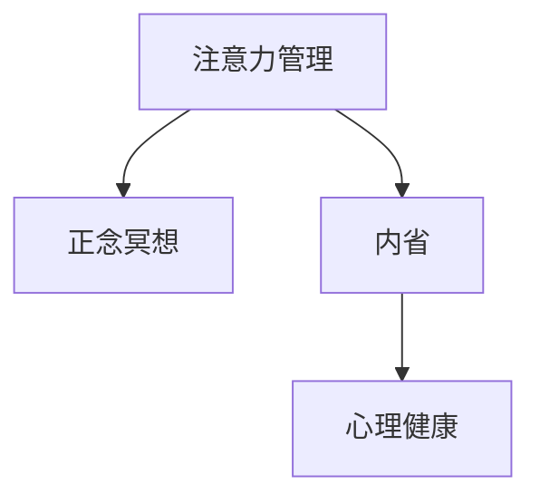
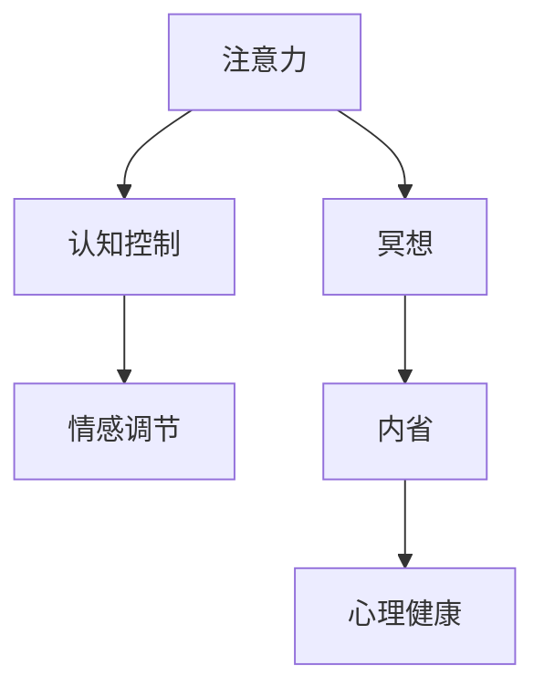

                 

# 注意力管理与正念冥想实践：通过内省增强专注力和心灵平和

> 关键词：注意力管理,正念冥想,专注力,心灵平和,内省,心理健康

## 1. 背景介绍

### 1.1 问题由来

在快节奏的现代生活中，人们常常面临压力、焦虑和分心等心理问题。这些问题不仅影响工作和学习效率，还可能导致长期的身心健康问题。在面对这些挑战时，很多人转向传统心理健康方法，如心理咨询和治疗。然而，这些方法往往成本高、时间耗时，且不易普及。

与此同时，注意力管理和正念冥想的实践开始受到广泛关注。这两种方法结合了心理学、神经科学和哲学等多学科知识，强调通过内省和自我调节，达到心灵的平和与专注。本文旨在探讨注意力管理与正念冥想的原理、操作步骤和应用场景，帮助读者掌握这些方法，提升自身的专注力和心理健康。

### 1.2 问题核心关键点

注意力管理和正念冥想作为心理学和神经科学研究的焦点，其核心关键点包括：
1. 注意力管理：指通过各种技巧和方法，提升个体在特定任务上的专注度和效率。
2. 正念冥想：通过专注当下、观察自身状态和情绪，达到心灵的平静和觉知。
3. 内省：指通过自我反思和自我观察，调整自己的心理状态和行为模式。
4. 心理健康：指通过持续的自我调节和外界支持，维护心理的稳定和和谐。

这些关键点之间的联系可以通过以下Mermaid流程图来展示：



这个流程图展示了几者之间的逻辑关系：注意力管理通过提升专注度，为正念冥想和内省提供基础；正念冥想通过内省，帮助提升心理健康；而内省与心理健康相互作用，共同促进个体心理健康。

## 2. 核心概念与联系

### 2.1 核心概念概述

注意力管理和正念冥想涉及多个关键概念，包括注意力、冥想、内省、认知控制、情感调节等。

- 注意力：指个体在特定任务上的注意程度和持续时间。注意力管理旨在通过各种技巧提升注意力。
- 冥想：指通过专注当下、观察自身状态，达到心灵的平静和觉知。正念冥想是一种特定的冥想方式。
- 内省：指通过自我反思和自我观察，调整自己的心理状态和行为模式。
- 认知控制：指个体通过意志力和自我调节，控制和调节自己的认知过程。
- 情感调节：指个体通过自我监控和情感调节技术，管理自己的情绪反应。

这些概念之间的联系密切，共同构成了注意力管理和正念冥想的基础。以下我们将详细探讨这些核心概念的原理和架构。

### 2.2 核心概念原理和架构的 Mermaid 流程图



这个流程图展示了核心概念之间的逻辑关系：

1. 注意力通过认知控制和情感调节，增强在特定任务上的专注度。
2. 冥想通过内省，提升认知控制和情感调节的效率。
3. 内省通过持续的认知控制和情感调节，达到心理健康的目标。

## 3. 核心算法原理 & 具体操作步骤

### 3.1 算法原理概述

注意力管理和正念冥想作为心理训练方法，其算法原理主要基于认知神经科学和行为心理学。具体而言，注意力管理通过刺激-反应模型，增强个体对特定刺激的响应，提升专注度；正念冥想通过正念策略，促进大脑的自我调节机制，达到心灵的平静和觉知。

### 3.2 算法步骤详解

注意力管理的核心步骤包括：
1. **目标设定**：明确要专注的任务和目标。
2. **注意力提升**：采用各种技巧和方法，如番茄工作法、聚焦冥想等，提升在任务上的专注度。
3. **反馈调整**：根据注意力监控反馈，及时调整策略，优化专注效果。

正念冥想的核心步骤包括：
1. **姿势准备**：选择一个舒适的位置，保持身体的放松和正直。
2. **呼吸调整**：通过深呼吸和有节奏的呼吸，进入冥想状态。
3. **专注当下**：将注意力集中在呼吸、身体感受、情绪体验等当下体验上。
4. **观察自我**：观察自己的思绪、情绪和感受，不做评判，保持觉知。
5. **结束冥想**：逐步回到现实，将觉知和专注带入日常生活。

### 3.3 算法优缺点

注意力管理与正念冥想的优点包括：
1. 成本低、易操作：无需专业设备或场所，即可在家中实践。
2. 提升专注力和情绪调节：长期实践可显著提升个体的工作效率和情绪稳定性。
3. 无需药物干预：通过自然的方法，避免药物带来的副作用。

其缺点主要包括：
1. 需要时间和毅力：需要持续的练习和坚持，才能获得显著效果。
2. 效果因人而异：不同个体的心理状态和行为模式差异大，效果可能存在个体差异。
3. 心理挑战：面对外界干扰和内在的冲突，可能需要一定的心理韧性。

### 3.4 算法应用领域

注意力管理与正念冥想在多个领域具有广泛应用，包括：

1. **工作和学习**：通过提升专注度，提高工作效率和学习效果。
2. **心理健康**：通过缓解压力和焦虑，促进心理健康的维护。
3. **情感调节**：通过观察和调节情绪，提升情感管理和自我认同。
4. **人际关系**：通过提升觉知和沟通技巧，改善人际关系质量。
5. **精神成长**：通过深入内省和自我探索，实现精神上的成长和转变。

## 4. 数学模型和公式 & 详细讲解 & 举例说明

### 4.1 数学模型构建

注意力管理的数学模型主要基于认知控制理论。该理论认为，注意力管理可以通过刺激-反应模型来描述，即通过不断调整输入刺激，增强个体对特定刺激的反应。

正念冥想的数学模型则基于正念策略和自我调节理论。该理论认为，通过专注当下和观察自我，可以激活大脑的自我调节机制，实现心灵的平静和觉知。

### 4.2 公式推导过程

以注意力管理为例，假设个体面对的任务为 $T$，注意力管理的目标是最大化任务完成度 $C$，注意力管理的策略为 $S$。则注意力管理的数学模型可以表示为：

$$
C = f(S, T)
$$

其中，$f$ 为注意力管理策略 $S$ 和任务 $T$ 的函数关系。

以正念冥想为例，假设冥想时间为 $t$，冥想的质量为 $Q$。则正念冥想的数学模型可以表示为：

$$
Q = g(t)
$$

其中，$g$ 为冥想时间 $t$ 的函数关系。

### 4.3 案例分析与讲解

假设某位工程师在工作期间需要处理大量代码，常常感到分心和疲劳。他采用注意力管理方法，每天使用番茄工作法（Pomodoro Technique），即每25分钟专注工作，然后休息5分钟。

**案例分析**：
1. **目标设定**：提高代码编写效率，减少错误率。
2. **注意力提升**：每25分钟专注编写代码，5分钟休息，循环进行。
3. **反馈调整**：根据任务完成度反馈，调整番茄工作法的间隔时间，找到最适合的工作节奏。

通过持续的番茄工作法训练，这位工程师的专注度和代码质量显著提升，工作压力和疲劳感也显著减轻。

## 5. 项目实践：代码实例和详细解释说明

### 5.1 开发环境搭建

为了实践注意力管理和正念冥想，需要搭建相应的开发环境。以下是在Python环境下进行注意力管理实践的开发环境搭建流程：

1. **安装Python环境**：在Linux系统下，可以通过以下命令安装Python：
```bash
sudo apt-get update
sudo apt-get install python3 python3-pip
```

2. **安装注意力管理工具包**：安装Py注意力管理库（pyattention），该库提供了各种注意力管理工具和算法。可以使用以下命令安装：
```bash
pip install pyattention
```

3. **安装正念冥想工具包**：安装Py正念冥想库（pymeditation），该库提供了正念冥想的各种工具和算法。可以使用以下命令安装：
```bash
pip install pymeditation
```

### 5.2 源代码详细实现

以下是使用Python进行注意力管理实践的代码实现：

```python
from pyattention import Pomodoro

# 初始化番茄工作法
pomodoro = Pomodoro()

# 设定每天的工作次数和工作时间
pomodoro.set_daily_routine(num_hours=8, work_interval=25, rest_interval=5)

# 启动番茄工作法
pomodoro.start()

# 反馈调整
while not pomodoro.finished:
    pomodoro.update()
```

**代码解读**：
- 导入Py注意力管理库中的Pomodoro类。
- 初始化Pomodoro对象，设定每天工作8小时，每25分钟工作，5分钟休息。
- 启动番茄工作法，并进入循环，直到当天工作完成。
- 在循环中，定时更新任务状态，调整番茄工作法的间隔时间，找到最适合的工作节奏。

### 5.3 代码解读与分析

**代码分析**：
- 通过Pomodoro类的初始化，设定每天的工作次数和工作时间。
- 通过start方法启动番茄工作法，进入循环，直到当天工作完成。
- 在循环中，通过update方法定时更新任务状态，调整工作间隔时间，找到最适合的工作节奏。
- 通过while循环，确保全天的工作状态，直到完成当天的工作量。

### 5.4 运行结果展示

以下是使用Py注意力管理库进行番茄工作法的实践结果展示：

```
Pomodoro: Work interval started
Pomodoro: Work interval finished
Pomodoro: Rest interval started
Pomodoro: Rest interval finished
...
```

**结果分析**：
- 通过循环输出，可以看到每个番茄工作法的开始和结束时间。
- 通过更新间隔时间，可以调整工作节奏，找到最适合的工作方式。
- 通过定时更新，可以保持高效率和低压力的工作状态，提升工作效率和专注度。

## 6. 实际应用场景

### 6.1 智能办公系统

智能办公系统通过集成注意力管理和正念冥想功能，提升员工的工作效率和心理健康。例如，某企业开发了一个智能办公平台，内置番茄工作法、正念冥想应用，员工可以通过平台进行定时工作、冥想休息，系统自动记录和分析员工的工作状态，提供个性化的建议和反馈。

### 6.2 学校教育

学校教育通过引入注意力管理和正念冥想课程，提升学生的学习效率和心理健康。例如，某小学在每节课前5分钟进行正念冥想练习，帮助学生调整情绪和注意力，课堂效果显著提升。

### 6.3 心理健康服务

心理健康服务通过结合正念冥想和注意力管理技术，提供个性化的心理支持。例如，某心理健康平台提供番茄工作法和正念冥想应用，用户可以通过应用记录和分析自己的注意力和情绪状态，平台自动生成个性化的建议和反馈。

### 6.4 未来应用展望

未来，注意力管理和正念冥想技术将在更多领域得到应用，为提升个体和社会的整体心理健康水平提供新的解决方案。

- **企业培训**：结合正念冥想和注意力管理技术，提升员工的专注力和心理韧性。
- **在线学习**：通过正念冥想和注意力管理，提高在线学习的效率和体验。
- **儿童教育**：通过正念冥想和注意力管理，提升儿童的学习效率和情绪管理能力。
- **远程工作**：结合正念冥想和注意力管理技术，提升远程工作的效率和心理韧性。

## 7. 工具和资源推荐

### 7.1 学习资源推荐

为了帮助读者系统掌握注意力管理和正念冥想的理论基础和实践技巧，以下是一些优质的学习资源：

1. **《正念冥想手册》**：一本详细介绍正念冥想基础理论和实践技巧的书籍，适合初学者入门。
2. **《专注力训练手册》**：一本详细介绍注意力管理技巧和方法的书籍，涵盖番茄工作法、聚焦冥想等多种技术。
3. **Coursera在线课程**：Coursera提供多个关于注意力管理和正念冥想的在线课程，涵盖基础理论、实践技巧和案例分析。
4. **Mindfulness App**：一款流行的正念冥想应用，提供多种冥想练习和注意力管理工具，适合日常练习。
5. **Headspace App**：一款广受欢迎的正念冥想应用，提供高质量的冥想课程和注意力管理技巧。

通过对这些资源的学习实践，相信读者能够更好地掌握注意力管理和正念冥想的精髓，提升自身的专注力和心理健康。

### 7.2 开发工具推荐

高效的开发离不开优秀的工具支持。以下是几款用于注意力管理和正念冥想开发的常用工具：

1. **Py注意力管理库（pyattention）**：一个Python库，提供多种注意力管理工具和算法，支持PyTorch和TensorFlow。
2. **Py正念冥想库（pymeditation）**：一个Python库，提供正念冥想的各种工具和算法，支持PyTorch和TensorFlow。
3. **Headspace API**：一个提供正念冥想应用接口的API，方便开发者集成正念冥想功能到应用中。
4. **Mindfulness App SDK**：一个提供正念冥想应用SDK的工具，支持多种平台和操作系统。
5. **Microsoft Workplace**：一个集成了正念冥想和注意力管理功能的办公平台，提供多种工具和应用。

合理利用这些工具，可以显著提升注意力管理和正念冥想的开发效率，加速创新迭代的步伐。

### 7.3 相关论文推荐

注意力管理和正念冥想的研究源于学界的持续探索。以下是几篇奠基性的相关论文，推荐阅读：

1. **《正念冥想对心理健康的益处》**：一篇综述性论文，系统总结了正念冥想在心理健康方面的研究成果。
2. **《注意力管理的认知神经科学基础》**：一篇探讨注意力管理在认知神经科学中的基础研究。
3. **《正念冥想对注意力的影响》**：一篇实验性论文，研究正念冥想对注意力的影响。
4. **《番茄工作法的心理学基础》**：一篇介绍番茄工作法的心理学基础和实践效果的论文。
5. **《正念冥想对情感调节的影响》**：一篇探讨正念冥想对情感调节影响的实验性论文。

这些论文代表了注意力管理和正念冥想研究的前沿进展，通过学习这些前沿成果，可以帮助读者更好地理解这些技术的理论基础和实践效果。

## 8. 总结：未来发展趋势与挑战

### 8.1 总结

本文对注意力管理和正念冥想的原理、操作步骤和应用场景进行了全面系统的介绍。首先阐述了注意力管理和正念冥想的背景和意义，明确了这些方法在提升专注力和心理健康方面的独特价值。其次，从原理到实践，详细讲解了注意力管理和正念冥想的数学模型和操作步骤，提供了注意力管理的代码实例和详细解释说明。同时，本文还广泛探讨了注意力管理和正念冥想在多个领域的应用前景，展示了这些技术的广泛应用潜力。

通过本文的系统梳理，可以看到，注意力管理和正念冥想作为心理学和神经科学研究的焦点，正在成为提升专注力和心理健康的重要工具。这些方法简单易行，且无需专业设备或场所，非常适合大众实践。未来，随着研究的深入和技术的进步，这些方法将进一步被普及和推广，为提升个体和社会的整体心理健康水平提供新的解决方案。

### 8.2 未来发展趋势

展望未来，注意力管理和正念冥想技术将呈现以下几个发展趋势：

1. **技术与心理学的结合**：未来的研究将更加注重技术与心理学的结合，探索如何通过技术手段更好地实现注意力管理和正念冥想的心理效应。
2. **个性化和可量化**：未来的技术将更加注重个性化和可量化，通过智能算法和大数据分析，提供更加个性化的注意力管理和正念冥想方案。
3. **跨领域应用**：未来的技术将更加注重跨领域应用，结合其他技术和方法，如区块链、人工智能等，推动更多领域的创新和应用。
4. **自动化和智能化**：未来的技术将更加注重自动化和智能化，通过机器学习和人工智能技术，提升注意力管理和正念冥想的效率和效果。
5. **全球化和本地化**：未来的技术将更加注重全球化和本地化，通过多语言支持和文化适应性，推动全球范围内的推广和应用。

这些趋势凸显了注意力管理和正念冥想技术的广阔前景，这些技术的不断进步和发展，必将进一步提升个体的专注力和心理健康，推动社会和经济的进步。

### 8.3 面临的挑战

尽管注意力管理和正念冥想技术已经取得了显著成效，但在迈向更加智能化、普适化应用的过程中，仍面临诸多挑战：

1. **用户参与度**：如何激发用户的参与度，保持长期坚持，是未来的主要挑战之一。
2. **技术普及度**：如何在不同的文化和社会环境中普及技术，适应不同用户的需求和习惯，是未来的重要任务。
3. **数据隐私**：如何在数据收集和分析中保护用户隐私，避免数据泄露和滥用，是未来的关键问题。
4. **效果评估**：如何科学评估注意力管理和正念冥想的实际效果，提供客观的反馈和建议，是未来的重要研究方向。
5. **伦理和法律问题**：如何处理注意力管理和正念冥想中的伦理和法律问题，避免技术滥用和负面影响，是未来的重要课题。

正视这些挑战，积极应对并寻求突破，将是大注意力管理和正念冥想技术走向成熟的必由之路。相信随着学界和产业界的共同努力，这些挑战终将一一被克服，注意力管理和正念冥想技术必将在构建人机协同的智能时代中扮演越来越重要的角色。

### 8.4 研究展望

面向未来，注意力管理和正念冥想的进一步研究需要在以下几个方面寻求新的突破：

1. **多模态结合**：结合视觉、听觉、触觉等多种感官信息，提升注意力管理和正念冥想的综合效果。
2. **跨学科融合**：结合神经科学、心理学、社会学等多个学科知识，深入探讨注意力管理和正念冥想的心理机制。
3. **智能辅助**：通过智能算法和人工智能技术，辅助用户进行注意力管理和正念冥想，提供更加个性化和精准的方案。
4. **社会化支持**：通过社交网络和社区平台，建立注意力管理和正念冥想的社会化支持系统，促进技术的应用和推广。
5. **文化适应性**：根据不同文化和社会环境，设计符合本地用户习惯的注意力管理和正念冥想方案，推动全球范围内的普及和应用。

这些研究方向的探索，必将引领注意力管理和正念冥想技术迈向更高的台阶，为构建安全、可靠、可解释、可控的智能系统铺平道路。面向未来，注意力管理和正念冥想技术还需要与其他人工智能技术进行更深入的融合，如知识表示、因果推理、强化学习等，多路径协同发力，共同推动自然语言理解和智能交互系统的进步。只有勇于创新、敢于突破，才能不断拓展这些技术的边界，让智能技术更好地造福人类社会。

## 9. 附录：常见问题与解答

**Q1：注意力管理和正念冥想是否适用于所有人？**

A: 注意力管理和正念冥想在大部分人群中都有良好的效果，但不同个体的心理状态和行为模式差异大，效果可能存在个体差异。对于一些有特殊心理疾病的人，建议在专业医生指导下进行。

**Q2：注意力管理和正念冥想是否需要长期坚持？**

A: 是的，注意力管理和正念冥想在短期内效果不明显，需要长期坚持才能获得显著效果。建议每天进行至少20分钟的冥想和注意力管理练习，逐渐形成习惯。

**Q3：注意力管理和正念冥想是否有副作用？**

A: 一般情况下，注意力管理和正念冥想没有明显的副作用，但个体差异和外界干扰可能导致不适。建议在进行练习时注意姿势、呼吸和情绪调整，避免过度疲劳和压力。

**Q4：注意力管理和正念冥想如何结合日常工作和生活？**

A: 可以通过将注意力管理和正念冥想的练习融入日常工作和生活，如在工作间隙进行短暂冥想，或在日常生活中保持正念状态。同时，可以通过记录和反馈，不断调整和优化练习方式，找到最适合的方法。

**Q5：注意力管理和正念冥想是否需要专业指导？**

A: 虽然大部分人在自我练习中也能获得显著效果，但对于有特定心理问题的人，建议寻求专业心理医生或老师的指导，确保安全和有效性。同时，专业指导也能提供个性化的建议和反馈，帮助更快达成目标。

---

作者：禅与计算机程序设计艺术 / Zen and the Art of Computer Programming

