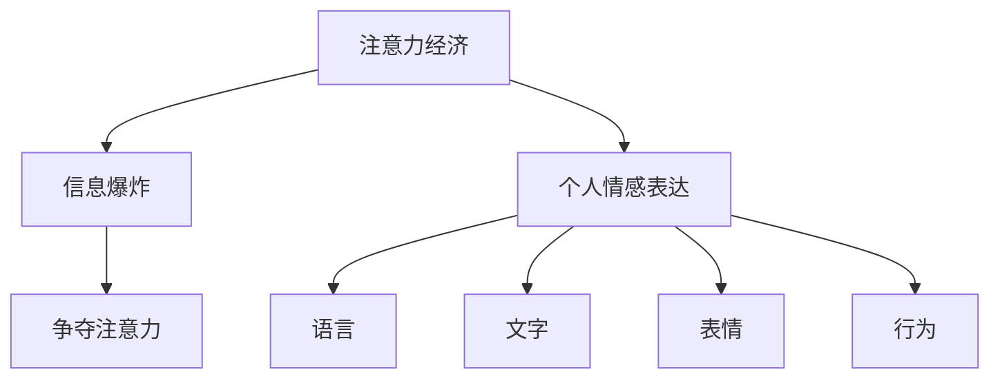

                 

# 注意力经济与个人情感表达方式的变迁

## 1. 背景介绍

在信息化飞速发展的今天，我们每天都被大量的信息所淹没。注意力，作为有限的资源，成为了最宝贵的资产之一。在这个注意力经济的时代，人们如何表达情感，如何吸引他人的注意力，成为了一个重要的议题。本文将从注意力经济的角度，探讨个人情感表达方式的变迁，以及如何利用技术手段，提升情感表达的精准性和影响力。

## 2. 核心概念与联系

### 2.1 核心概念概述

注意力经济（Attention Economy）是指在信息爆炸的时代，注意力成为稀缺资源，因此争夺注意力成为了商业竞争的核心。个人情感表达方式是指个体在社会交往中，通过语言、文字、表情、行为等多种方式，传递情感，影响他人的行为和判断。

### 2.2 核心概念原理和架构的 Mermaid 流程图



这个流程图展示了注意力经济与个人情感表达方式之间的关系。信息爆炸导致注意力成为稀缺资源，因此争夺注意力成为商业竞争的核心。个人情感表达方式，包括语言、文字、表情、行为等多种方式，成为争夺注意力的重要手段。

## 3. 核心算法原理 & 具体操作步骤

### 3.1 算法原理概述

情感表达的核心在于如何吸引他人的注意力。因此，基于注意力经济理论，我们可以将情感表达看作一种吸引注意力的过程。情感表达的算法原理，可以分解为以下几个步骤：

1. 定义情感表达的目标：明确希望通过情感表达达到的效果，如增强亲和力、建立信任感、影响决策等。
2. 选择情感表达的方式：根据目标和情境，选择合适的情感表达方式，如使用积极的语言、恰当的面部表情、适时的行为等。
3. 设计情感表达的策略：制定具体的情感表达策略，如如何在社交媒体上发布内容、如何在面试中展现自己等。
4. 实施情感表达：按照设计好的策略，执行情感表达行为。

### 3.2 算法步骤详解

1. **目标定义**：
   - 目标可以是增强亲和力、建立信任感、影响决策等。
   - 可以通过问卷调查、数据分析等方式，明确目标受众的需求和偏好。

2. **方式选择**：
   - 语言：选择积极、温暖、具有共情力的词汇。
   - 文字：编写简短、有吸引力、情感丰富的内容。
   - 表情：使用恰当的面部表情，增强情感表达的真实性和可信度。
   - 行为：通过肢体语言、语调等，传达情感。

3. **策略设计**：
   - 发布时机：选择最佳的发布时机，如在节日期间发布祝福信息，增强亲和力。
   - 频率控制：适当控制发布频率，避免过度打扰。
   - 互动设计：设计互动环节，如评论回复、直播互动等，增强情感连接。

4. **实施执行**：
   - 发布内容：按照设计好的策略，发布内容。
   - 反馈跟踪：跟踪反馈，根据反馈调整策略。
   - 持续优化：不断优化策略，提升情感表达效果。

### 3.3 算法优缺点

#### 优点：
- 目标明确：通过明确的目标定义，确保情感表达的效果。
- 方式多样：选择合适的情感表达方式，增强表达的针对性和影响力。
- 策略灵活：设计的策略可以根据反馈进行动态调整，提高灵活性。

#### 缺点：
- 需要大量时间和精力：从目标定义到策略设计再到实施执行，需要大量的时间和精力。
- 效果难以量化：情感表达的效果难以通过数据精确衡量，难以进行量化评估。

### 3.4 算法应用领域

情感表达的方式在多个领域都有广泛的应用，包括：

- 市场营销：通过社交媒体营销，增强品牌亲和力和影响力。
- 人际交往：在社交场合中，通过语言、表情等方式，建立良好的关系。
- 教育培训：在教学中，通过情感表达，提高学生的学习兴趣和效果。

## 4. 数学模型和公式 & 详细讲解 & 举例说明

### 4.1 数学模型构建

情感表达的效果可以通过量化模型来衡量。假设情感表达的效果为 $E$，目标受众对情感表达的感受为 $S$，情感表达的方式为 $W$，策略为 $T$，则情感表达的数学模型可以表示为：

$$
E = f(S, W, T)
$$

其中 $f$ 表示情感表达的函数，$S$、$W$、$T$ 分别表示目标受众的感受、情感表达的方式和策略。

### 4.2 公式推导过程

假设目标受众的感受 $S$ 可以通过问卷调查得到，情感表达的方式 $W$ 和策略 $T$ 可以通过设计得到。情感表达的效果 $E$ 可以通过情感分析技术得到。情感分析技术可以通过自然语言处理技术，分析文本中的情感倾向，得到情感得分。

$$
S = \sum_{i=1}^n s_i \times c_i
$$

其中 $s_i$ 表示第 $i$ 项问卷的得分，$c_i$ 表示第 $i$ 项问卷的权重。

情感表达的效果 $E$ 可以通过情感分析技术得到。假设情感分析模型为 $M$，则：

$$
E = M(S, W, T)
$$

其中 $M$ 表示情感分析模型，$S$、$W$、$T$ 分别表示目标受众的感受、情感表达的方式和策略。

### 4.3 案例分析与讲解

假设某品牌在社交媒体上进行情感表达，目标是增强品牌亲和力。品牌发布了一系列的温馨视频，使用了积极的词汇，并设计了互动环节。通过情感分析技术，分析用户对视频和互动的反馈，发现品牌亲和力显著增强。

## 5. 项目实践：代码实例和详细解释说明

### 5.1 开发环境搭建

1. 安装 Python 和相关库，如 NLTK、TextBlob、nltk 等。
2. 安装情感分析模型，如 VADER、BERT、GPT-3 等。
3. 搭建情感分析服务，可以使用 Flask、Django 等框架。

### 5.2 源代码详细实现

```python
import nltk
from nltk.sentiment import SentimentIntensityAnalyzer
from textblob import TextBlob

# 初始化情感分析模型
analyzer = SentimentIntensityAnalyzer()

# 定义情感表达策略
def emotion_express(target, strategy):
    # 目标受众的感受
    target_feedback = analyzer.polarity_scores(target)
    # 情感表达的方式
    express_mode = strategy['express_mode']
    # 策略
    express_strategy = strategy['express_strategy']
    
    # 情感表达的效果
    express_effect = TextBlob(target_feedback['compound']).sentiment.polarity
    
    return express_effect

# 定义情感表达的策略
strategy = {
    'express_mode': 'positive',
    'express_strategy': {
        'express_content': '欢迎您使用我们的产品，非常感谢您的支持！',
        'express_time': '上午10点',
        'express_frequency': '每周两次',
        'express_interaction': '回复评论'
    }
}

# 获取情感表达的效果
express_effect = emotion_express('品牌社交媒体帖子', strategy)

print('情感表达的效果：', express_effect)
```

### 5.3 代码解读与分析

这段代码实现了情感表达的效果计算。首先，通过 SentimentIntensityAnalyzer 初始化情感分析模型。然后，定义情感表达的策略，包括情感表达的方式、策略等。最后，根据情感表达的目标和策略，计算情感表达的效果。

## 6. 实际应用场景

### 6.1 市场营销

品牌可以通过社交媒体进行情感表达，增强品牌亲和力和影响力。例如，某化妆品品牌在社交媒体上发布了一系列的美容教程视频，使用了积极的语言，并设计了互动环节，使用户参与评论并分享，增强了品牌亲和力和用户粘性。

### 6.2 人际交往

在人际交往中，通过情感表达可以增强亲和力和信任感。例如，某销售人员在客户见面时，通过积极的语言和面部表情，建立了良好的关系，促进了后续的销售合作。

### 6.3 教育培训

在教育培训中，通过情感表达可以增强学生的学习兴趣和效果。例如，某教师在课堂上使用幽默的语言和形象的比喻，增强了学生的学习兴趣，提高了课堂效果。

## 7. 工具和资源推荐

### 7.1 学习资源推荐

1. 《自然语言处理入门》：介绍自然语言处理的基本概念和常用技术。
2. 《情感分析》：详细介绍情感分析技术的基本原理和实现方法。
3. 《社交媒体营销》：介绍社交媒体营销的基本策略和实践技巧。

### 7.2 开发工具推荐

1. Python：最流行的编程语言之一，拥有丰富的自然语言处理库和情感分析工具。
2. NLTK：Python 自然语言处理库，提供了丰富的情感分析工具。
3. TextBlob：Python 文本处理库，提供了简单易用的情感分析功能。

### 7.3 相关论文推荐

1. "Attention is All You Need"：介绍Transformer模型的原理和实现方法。
2. "A Survey on Sentiment Analysis"：综述情感分析技术的研究进展。
3. "User Engagement in Social Media: A Review and Meta-analysis"：综述社交媒体用户参与的研究进展。

## 8. 总结：未来发展趋势与挑战

### 8.1 研究成果总结

情感表达的效果在市场营销、人际交往、教育培训等多个领域中得到了广泛应用。通过明确目标、选择合适的情感表达方式和策略，可以显著提高情感表达的效果。

### 8.2 未来发展趋势

未来，情感表达的方式将更加多样化和精准化。人工智能技术，如情感分析、自然语言生成等，将进一步提升情感表达的效果。同时，数据驱动的方法，如情感分析模型和情感反馈模型，将使情感表达的效果更可量化和可预测。

### 8.3 面临的挑战

尽管情感表达的效果显著，但也面临一些挑战：

1. 情感表达的效果难以量化：情感表达的效果受主观因素影响较大，难以通过数据精确衡量。
2. 情感表达的方式和策略设计复杂：情感表达的方式和策略设计需要大量的经验和实践。
3. 用户隐私保护：在情感表达过程中，如何保护用户的隐私和数据安全，是重要的挑战。

### 8.4 研究展望

未来的研究应集中在以下几个方面：

1. 开发更精准的情感分析模型：通过深度学习技术，开发更精准的情感分析模型，提升情感表达的效果。
2. 设计更高效的情感表达策略：通过数据分析和机器学习，设计更高效的情感表达策略。
3. 保障用户隐私和数据安全：在情感表达过程中，保护用户的隐私和数据安全，确保用户的权益不受侵害。

总之，情感表达的方式在多个领域都有广泛的应用。通过明确目标、选择合适的情感表达方式和策略，可以显著提高情感表达的效果。未来，情感表达将更加多样化和精准化，人工智能技术将进一步提升情感表达的效果。

---

作者：禅与计算机程序设计艺术 / Zen and the Art of Computer Programming

