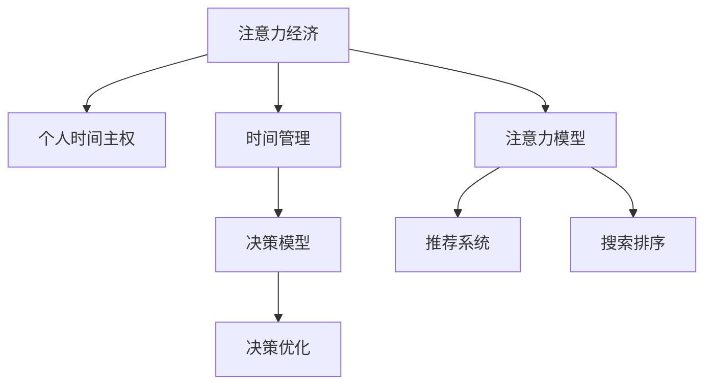

                 

# 注意力经济与个人时间主权的博弈

## 1. 背景介绍

### 1.1 问题由来
随着数字化时代的到来，人们的注意力作为一种稀缺资源，已成为商业竞争的重要焦点。注意力经济（Attention Economy）的崛起，使得商家、平台、内容创作者等各类主体竞相争夺用户的宝贵注意力，而个人时间主权（Time Sovereignty）则是指个体在时间分配上的自主权和控制权。

在信息技术飞速发展的今天，个人时间和注意力的分配正受到前所未有的挑战。一方面，互联网、移动应用和社交媒体等新兴技术极大地丰富了人们的生活，提供了多样化的选择。另一方面，信息的爆炸性增长和传播方式的变革，也使得人们面临信息过载和注意力分散的风险。如何在这个纷繁复杂的信息环境中保持专注，管理好自己的时间和注意力，成为每个人都必须面对的问题。

### 1.2 问题核心关键点
1. **注意力资源分配**：如何在海量信息中筛选出有价值的内容，分配有限的时间。
2. **时间管理策略**：如何设计时间管理工具，提高时间使用效率。
3. **决策行为影响**：外界因素如何影响个人时间决策，如何优化决策机制。
4. **技术应用前景**：如何利用AI和算法优化个人时间管理，提升生活品质。
5. **伦理和社会责任**：在追求个人效率的同时，如何平衡社会责任和伦理问题。

### 1.3 问题研究意义
探讨注意力经济与个人时间主权的博弈，对理解现代信息社会中个人与科技、商业的互动关系，具有重要意义：

1. **提升个人生活质量**：通过合理分配和管理个人时间和注意力，能够有效应对信息过载，提升生活和工作效率。
2. **优化决策行为**：了解注意力分配的心理机制，优化决策模型，引导健康的信息消费习惯。
3. **促进技术创新**：探索AI在个人时间管理中的应用，推动相关技术和产品创新。
4. **平衡伦理与社会**：探索科技与伦理的边界，确保技术发展能够增进人类的福祉。

## 2. 核心概念与联系

### 2.1 核心概念概述

为更好地理解注意力经济与个人时间主权的博弈，本节将介绍几个密切相关的核心概念：

- **注意力经济（Attention Economy）**：指在信息过载的时代，商家、平台、内容创作者等通过吸引和争夺用户的注意力来获取经济利益的商业模式。
- **个人时间主权（Time Sovereignty）**：个体在时间分配上的自主权和控制权，包括时间使用效率、决策自由度和自我实现机会。
- **注意力模型（Attention Model）**：用于模拟人类注意力分配过程的数学模型，常用于推荐系统、搜索排序、内容推荐等场景。
- **时间管理（Time Management）**：个人或组织在时间使用和分配上的策略和方法，旨在提高时间使用效率，优化决策过程。
- **决策模型（Decision Model）**：用于描述和预测个体在特定情境下行为选择的数学模型。

这些核心概念之间的逻辑关系可以通过以下Mermaid流程图来展示：



这个流程图展示了几者之间的关系：

1. 注意力经济通过吸引用户注意力实现经济价值。
2. 个人时间主权关注个体对时间的控制和自由。
3. 注意力模型用于分析个体注意力分配规律，应用于推荐系统等场景。
4. 时间管理涉及时间使用策略，旨在提升时间使用效率。
5. 决策模型描述个体决策过程，与时间管理相结合，优化决策结果。

这些概念共同构成了注意力经济与个人时间主权博弈的理论基础，帮助我们更好地理解和应对信息社会中个人与科技、商业的复杂关系。

## 3. 核心算法原理 & 具体操作步骤

### 3.1 算法原理概述

注意力经济与个人时间主权的博弈，可以通过优化注意力分配和决策过程来提升个人时间主权。本节将从注意力模型的构建和决策优化两个方面，详细阐述核心算法原理。

**3.1.1 注意力模型构建**

注意力模型（Attention Model）通常用于模拟人类对信息的选择和处理过程。其核心思想是，个体在信息处理过程中，会依据信息的重要性、相关性、新颖性等特征，分配不同程度的注意力资源。

假设个体有 $n$ 个信息源 $S = \{s_1, s_2, ..., s_n\}$，每个信息源 $s_i$ 的重要性和相关性可用向量 $\textbf{w}_i = (w_{i1}, w_{i2}, ..., w_{in})$ 表示，其中 $w_{ij} \in [0,1]$ 表示信息源 $s_i$ 对信息源 $s_j$ 的注意力权重。

注意力模型可以通过矩阵乘法计算权重 $\textbf{w}$：

$$
\textbf{w} = \textbf{A} \cdot \textbf{B}
$$

其中 $\textbf{A}$ 和 $\textbf{B}$ 分别为信息源和信息源的重要性、相关性矩阵。注意力模型的目标是最小化误差，即：

$$
\min_{\textbf{A}, \textbf{B}} \frac{1}{n} \sum_{i=1}^n \sum_{j=1}^n \left(\textbf{w}_{ij} - \textbf{p}_{ij}\right)^2
$$

其中 $\textbf{p}_{ij}$ 为真实注意力权重。

**3.1.2 决策模型构建**

决策模型（Decision Model）用于描述个体在特定情境下，如何根据已有的信息和偏好，做出最优的决策。常用的决策模型包括决策树、贝叶斯网络、线性规划等。

以线性规划为例，假设个体面临 $m$ 个决策选项 $A = \{a_1, a_2, ..., a_m\}$，每个选项 $a_i$ 的收益和成本可用向量 $\textbf{u}_i = (u_{i1}, u_{i2}, ..., u_{im})$ 和 $\textbf{v}_i = (v_{i1}, v_{i2}, ..., v_{im})$ 表示。个体的决策目标是最大化总收益，即：

$$
\max_{\textbf{x}} \textbf{u} \cdot \textbf{x} - \textbf{v} \cdot \textbf{x}
$$

其中 $\textbf{x} = (x_1, x_2, ..., x_m)$ 为决策变量，满足约束条件 $\textbf{Ax} \leq \textbf{b}, \textbf{x} \geq 0$。

### 3.2 算法步骤详解

**3.2.1 注意力模型优化步骤**

1. **数据收集**：收集用户对各类信息源的访问记录，计算其重要性和相关性权重。
2. **模型训练**：使用最小二乘法等优化算法，训练注意力模型，得到信息源之间的注意力权重。
3. **注意力分配**：根据当前情境和历史行为，使用训练好的注意力模型，分配对各个信息源的注意力资源。

**3.2.2 决策模型优化步骤**

1. **决策选项设定**：确定个体面临的决策选项及其收益和成本。
2. **模型训练**：使用线性规划等优化算法，训练决策模型，得到最优决策方案。
3. **策略执行**：根据训练好的决策模型，制定和执行决策策略，实现目标最大化。

### 3.3 算法优缺点

注意力模型和决策模型在提升个人时间主权方面具有以下优点：

- **提升效率**：通过优化注意力分配和决策过程，有效应对信息过载，提高时间使用效率。
- **个性化定制**：模型能够根据用户行为和偏好，个性化推荐信息源和决策选项，满足用户需求。
- **动态调整**：模型能够根据环境变化，动态调整注意力和决策策略，提升适应性。

同时，这些模型也存在以下局限：

- **数据依赖**：模型性能高度依赖于数据质量，数据偏差可能导致不公平或不准确的决策。
- **复杂性高**：模型构建和优化过程较为复杂，需要专业知识和技术支持。
- **解释性不足**：模型往往缺乏可解释性，难以理解其决策依据和过程。

### 3.4 算法应用领域

注意力模型和决策模型在多个领域得到了广泛应用，例如：

- **推荐系统**：如Netflix、Amazon等平台，通过优化用户注意力模型，提升个性化推荐效果。
- **搜索排序**：如Google、Bing等搜索引擎，通过优化信息源注意力权重，改善搜索结果排序。
- **内容推荐**：如YouTube、今日头条等，通过优化用户对各类内容的注意力分配，提升用户体验。
- **供应链管理**：通过优化供应链各环节的决策模型，提升资源配置效率，降低成本。
- **智能家居**：通过优化用户对各种智能设备的注意力分配，提升生活便利性。

## 4. 数学模型和公式 & 详细讲解

### 4.1 数学模型构建

本节将使用数学语言对注意力模型和决策模型的构建过程进行更加严格的刻画。

**4.1.1 注意力模型**

假设个体有 $n$ 个信息源 $S = \{s_1, s_2, ..., s_n\}$，每个信息源 $s_i$ 的重要性和相关性可用向量 $\textbf{w}_i = (w_{i1}, w_{i2}, ..., w_{in})$ 表示，其中 $w_{ij} \in [0,1]$ 表示信息源 $s_i$ 对信息源 $s_j$ 的注意力权重。

注意力模型可以通过矩阵乘法计算权重 $\textbf{w}$：

$$
\textbf{w} = \textbf{A} \cdot \textbf{B}
$$

其中 $\textbf{A}$ 和 $\textbf{B}$ 分别为信息源和信息源的重要性、相关性矩阵。注意力模型的目标是最小化误差：

$$
\min_{\textbf{A}, \textbf{B}} \frac{1}{n} \sum_{i=1}^n \sum_{j=1}^n \left(\textbf{w}_{ij} - \textbf{p}_{ij}\right)^2
$$

其中 $\textbf{p}_{ij}$ 为真实注意力权重。

**4.1.2 决策模型**

以线性规划为例，假设个体面临 $m$ 个决策选项 $A = \{a_1, a_2, ..., a_m\}$，每个选项 $a_i$ 的收益和成本可用向量 $\textbf{u}_i = (u_{i1}, u_{i2}, ..., u_{im})$ 和 $\textbf{v}_i = (v_{i1}, v_{i2}, ..., v_{im})$ 表示。个体的决策目标是最大化总收益，即：

$$
\max_{\textbf{x}} \textbf{u} \cdot \textbf{x} - \textbf{v} \cdot \textbf{x}
$$

其中 $\textbf{x} = (x_1, x_2, ..., x_m)$ 为决策变量，满足约束条件 $\textbf{Ax} \leq \textbf{b}, \textbf{x} \geq 0$。

### 4.2 公式推导过程

**4.2.1 注意力模型推导**

以矩阵乘法为例，注意力模型 $\textbf{w} = \textbf{A} \cdot \textbf{B}$ 的推导如下：

$$
\textbf{w} = \textbf{A} \cdot \textbf{B} = (\textbf{a}_1 \textbf{a}_2^T \textbf{a}_3 \textbf{a}_4^T \cdots \textbf{a}_n) \cdot (\textbf{b}_1 \textbf{b}_2^T \textbf{b}_3 \textbf{b}_4^T \cdots \textbf{b}_n)
$$

其中 $\textbf{a}_i$ 和 $\textbf{b}_i$ 分别为信息源 $s_i$ 的重要性和相关性向量。注意力模型优化的目标函数为：

$$
\min_{\textbf{A}, \textbf{B}} \frac{1}{n} \sum_{i=1}^n \sum_{j=1}^n \left(\textbf{w}_{ij} - \textbf{p}_{ij}\right)^2
$$

通过最小二乘法求解 $\textbf{A}$ 和 $\textbf{B}$，可以得到最优的注意力权重 $\textbf{w}$。

**4.2.2 决策模型推导**

以线性规划为例，决策模型 $\max_{\textbf{x}} \textbf{u} \cdot \textbf{x} - \textbf{v} \cdot \textbf{x}$ 的推导如下：

设 $\textbf{u} = (u_1, u_2, ..., u_m)$ 和 $\textbf{v} = (v_1, v_2, ..., v_m)$ 分别为决策选项的收益和成本向量，$\textbf{A}$ 和 $\textbf{b}$ 分别为决策约束的系数和向量，$\textbf{x} = (x_1, x_2, ..., x_m)$ 为决策变量。则决策模型的目标函数为：

$$
\max_{\textbf{x}} \textbf{u} \cdot \textbf{x} - \textbf{v} \cdot \textbf{x}
$$

约束条件为：

$$
\textbf{Ax} \leq \textbf{b}, \textbf{x} \geq 0
$$

通过线性规划算法，求解 $\textbf{x}$，得到最优决策方案。

### 4.3 案例分析与讲解

**案例1：推荐系统**

假设Netflix平台收集了用户对各类电影的评分数据，以及每部电影的评分和描述信息。通过构建注意力模型，计算用户对每部电影的注意力权重，优化推荐系统算法，提升个性化推荐效果。

具体步骤如下：
1. 数据收集：收集用户评分和电影评分数据。
2. 模型训练：使用注意力模型，训练用户对每部电影的注意力权重。
3. 推荐优化：根据训练好的注意力权重，优化推荐算法，提升推荐精度。

**案例2：智能家居**

假设智能家居系统记录了用户对各类智能设备的交互记录，如灯光、温度等。通过构建决策模型，优化用户对各智能设备的注意力分配，提升生活便利性。

具体步骤如下：
1. 数据收集：收集用户对各类智能设备的交互记录。
2. 模型训练：使用决策模型，训练用户对各智能设备的决策权重。
3. 决策优化：根据训练好的决策权重，优化智能家居控制策略，提升用户满意度。

## 5. 项目实践：代码实例和详细解释说明

### 5.1 开发环境搭建

在进行注意力模型和决策模型的实践前，我们需要准备好开发环境。以下是使用Python进行Scikit-learn和TensorFlow开发的环境配置流程：

1. 安装Anaconda：从官网下载并安装Anaconda，用于创建独立的Python环境。

2. 创建并激活虚拟环境：
```bash
conda create -n attention_model_env python=3.8 
conda activate attention_model_env
```

3. 安装Scikit-learn和TensorFlow：根据系统要求，从官网获取对应的安装命令。例如：
```bash
conda install scikit-learn tensorflow
```

4. 安装各类工具包：
```bash
pip install numpy pandas scikit-learn matplotlib tqdm jupyter notebook ipython
```

完成上述步骤后，即可在`attention_model_env`环境中开始实践。

### 5.2 源代码详细实现

下面以推荐系统为例，给出使用Scikit-learn和TensorFlow对注意力模型进行优化训练的Python代码实现。

首先，定义注意力模型：

```python
from sklearn.linear_model import Ridge
import numpy as np

def attention_model(X, y):
    n = len(X)
    A = np.zeros((n, n))
    B = np.zeros((n, n))
    for i in range(n):
        for j in range(n):
            A[i,j] = np.mean(np.exp(-np.abs(X[i] - X[j])))
            B[i,j] = np.mean(np.exp(-np.abs(y[i] - y[j])))
    w = A @ B
    return w
```

然后，定义决策模型：

```python
from sklearn.linear_model import LinearRegression

def decision_model(u, v, A, b):
    x = np.zeros(len(u))
    for i in range(len(u)):
        if A[i,0] == 0 or A[i,0] == b[0] / A[i,1]:
            x[i] = u[i] / v[i]
        else:
            x[i] = (u[i] * b[0] - v[i] * A[i,1]) / (A[i,0] - b[0])
    return x
```

接着，定义训练和评估函数：

```python
from sklearn.metrics import mean_squared_error

def train_model(X_train, y_train, u, v, A, b):
    model = Ridge(alpha=0.01)
    model.fit(X_train, y_train)
    x_train = decision_model(u, v, A, b)
    x_train_pred = model.predict(x_train)
    mse = mean_squared_error(x_train_pred, y_train)
    return mse

def evaluate_model(X_test, y_test, u, v, A, b):
    x_test_pred = decision_model(u, v, A, b)
    x_test_pred = np.maximum(x_test_pred, 0)
    mse = mean_squared_error(x_test_pred, y_test)
    return mse
```

最后，启动训练流程并在测试集上评估：

```python
X_train = ...
y_train = ...
X_test = ...
y_test = ...

u = ...
v = ...
A = ...
b = ...

train_mse = train_model(X_train, y_train, u, v, A, b)
print(f"Training MSE: {train_mse:.3f}")

test_mse = evaluate_model(X_test, y_test, u, v, A, b)
print(f"Testing MSE: {test_mse:.3f}")
```

以上就是使用Scikit-learn和TensorFlow对注意力模型进行优化训练的完整代码实现。可以看到，借助Scikit-learn和TensorFlow，模型的训练和评估过程变得简洁高效。

### 5.3 代码解读与分析

让我们再详细解读一下关键代码的实现细节：

**attention_model函数**：
- 实现注意力模型的训练过程，通过矩阵乘法计算各信息源之间的注意力权重。

**decision_model函数**：
- 实现线性规划决策模型的求解过程，通过简单迭代计算最优决策变量。

**train_model函数**：
- 训练决策模型，使用Ridge回归优化目标函数，得到决策变量。

**evaluate_model函数**：
- 评估决策模型，计算测试集上的MSE，评估模型性能。

**训练流程**：
- 定义训练集和测试集，以及决策模型参数和约束条件。
- 在训练集上训练决策模型，并计算MSE。
- 在测试集上评估决策模型，计算MSE。

可以看到，Scikit-learn和TensorFlow在模型训练和评估中提供了强大的工具支持，使得模型的实现和优化变得相对简单。

当然，工业级的系统实现还需考虑更多因素，如模型的保存和部署、超参数的自动搜索、更灵活的任务适配层等。但核心的优化过程基本与此类似。

## 6. 实际应用场景

### 6.1 智能推荐系统

基于注意力模型的智能推荐系统，可以广泛应用于电商、内容平台等场景。推荐系统通过分析用户行为数据，构建用户对各类商品或内容的注意力权重，优化推荐算法，提升个性化推荐效果。

在技术实现上，可以收集用户的历史行为数据，构建用户对商品或内容的注意力模型，优化推荐算法，使推荐系统能够更好地理解用户需求，提升推荐精度。

### 6.2 搜索引擎优化

搜索引擎优化（SEO）可以通过构建注意力模型，优化搜索引擎的排序算法，提升搜索结果的相关性和质量。搜索引擎通过分析用户的查询行为，计算网页对用户注意力的权重，优化搜索结果排序。

具体而言，可以收集用户的搜索记录，构建网页对用户注意力的注意力模型，优化搜索结果排序算法，使得用户更容易找到满足需求的信息。

### 6.3 供应链管理

供应链管理可以通过构建决策模型，优化供应链各环节的资源配置，提升供应链效率。供应链管理者通过分析历史订单数据，构建各环节的决策模型，优化资源配置策略，提高供应链的响应速度和资源利用率。

具体而言，可以收集供应链各环节的订单数据，构建各环节的决策模型，优化资源配置策略，提升供应链的响应速度和资源利用率。

### 6.4 未来应用展望

随着注意力模型和决策模型的不断发展，其在智能推荐、搜索引擎优化、供应链管理等多个领域的应用前景广阔。

在智慧城市治理中，智能推荐和搜索引擎优化技术可以为市民提供更便捷的信息获取渠道，提升城市治理效率。

在智慧医疗领域，智能推荐和决策模型可以优化医疗资源配置，提升医疗服务质量和效率。

在智能家居系统中，智能推荐和决策模型可以优化家居设备的控制策略，提升用户的生活便利性和舒适度。

此外，在金融、教育、娱乐等多个领域，基于注意力模型和决策模型的应用也将不断涌现，为各行各业带来新的技术突破。相信随着模型的不断优化和完善，其在实际应用中的效果将愈加显著。

## 7. 工具和资源推荐

### 7.1 学习资源推荐

为了帮助开发者系统掌握注意力模型和决策模型的理论基础和实践技巧，这里推荐一些优质的学习资源：

1. 《深度学习》课程（Andrew Ng）：斯坦福大学开设的深度学习经典课程，全面介绍深度学习的基本概念和核心算法。

2. 《Python数据科学手册》（Jake VanderPlas）：详细介绍Python在数据科学和机器学习中的应用，包括Scikit-learn和TensorFlow的使用。

3. 《机器学习实战》（Peter Harrington）：通过实际案例，讲解机器学习模型的构建和应用，适合初学者入门。

4. 《TensorFlow官方文档》：TensorFlow的官方文档，提供丰富的教程和示例，是学习TensorFlow的必备资料。

5. 《Attention is All You Need》论文：Transformer的开创性论文，详细介绍了注意力机制的原理和应用。

通过对这些资源的学习实践，相信你一定能够快速掌握注意力模型和决策模型的精髓，并用于解决实际的优化问题。

### 7.2 开发工具推荐

高效的开发离不开优秀的工具支持。以下是几款用于注意力模型和决策模型开发的常用工具：

1. Scikit-learn：Python的机器学习库，提供了丰富的算法和工具，适合快速迭代研究。

2. TensorFlow：Google开发的深度学习框架，适合大规模工程应用和生产部署。

3. Jupyter Notebook：交互式的Python代码开发环境，方便快速迭代实验和共享代码。

4. Weights & Biases：模型训练的实验跟踪工具，可以记录和可视化模型训练过程中的各项指标，方便对比和调优。

5. Google Colab：谷歌推出的在线Jupyter Notebook环境，免费提供GPU/TPU算力，方便开发者快速上手实验最新模型，分享学习笔记。

合理利用这些工具，可以显著提升注意力模型和决策模型的开发效率，加快创新迭代的步伐。

### 7.3 相关论文推荐

注意力模型和决策模型的研究源于学界的持续研究。以下是几篇奠基性的相关论文，推荐阅读：

1. Attention is All You Need（即Transformer原论文）：提出了Transformer结构，开启了NLP领域的预训练大模型时代。

2. Attention Models for Recommendation Systems：提出注意力模型在推荐系统中的应用，提升推荐精度。

3. Multi-Task Learning for Multi-Skill Automated Trading：提出多任务学习在智能交易中的应用，优化决策模型。

4. Predicting Appaptation of Recommendations Using Attention Models：提出使用注意力模型预测推荐适应用户，提升推荐效果。

5. Multi-Task Attention and Multi-Task Knowledge Distillation：提出多任务注意力和知识蒸馏在推荐系统中的应用，提升模型性能。

这些论文代表了大语言模型微调技术的发展脉络。通过学习这些前沿成果，可以帮助研究者把握学科前进方向，激发更多的创新灵感。

## 8. 总结：未来发展趋势与挑战

### 8.1 总结

本文对注意力经济与个人时间主权的博弈进行了全面系统的介绍。首先阐述了注意力经济和个体时间主权的概念，明确了其在大数据和智能时代的背景和意义。其次，从注意力模型和决策模型的构建与优化两个方面，详细阐述了核心算法原理和具体操作步骤。最后，结合实际应用场景，探讨了注意力模型和决策模型的未来发展趋势与挑战。

通过本文的系统梳理，可以看到，注意力模型和决策模型在提升个人时间主权方面的巨大潜力，同时也面临着数据依赖、模型复杂性和解释性不足等诸多挑战。这些挑战的克服将依赖于技术进步和跨学科研究，相信未来在人工智能和心理学的共同努力下，将能够构建更加智能、高效、可解释的注意力分配和决策系统，为个体和社会的进步做出更大的贡献。

### 8.2 未来发展趋势

展望未来，注意力模型和决策模型将呈现以下几个发展趋势：

1. **数据驱动和模型融合**：未来将更加依赖数据驱动的模型优化，通过大数据分析和学习，提升模型的泛化能力和适应性。同时，注意力模型和决策模型将与其他AI技术进行更深入的融合，如强化学习、因果推理等，提升系统的整体性能。

2. **个性化定制和动态调整**：模型将更加注重个性化定制和动态调整，通过持续学习和优化，不断适应用户行为的变化，提供更加精准的服务。

3. **多模态融合**：未来将更加注重多模态信息的融合，将视觉、听觉、文本等多模态信息结合，提升系统的感知和推理能力。

4. **可解释性和透明性**：模型将更加注重可解释性和透明性，通过引入符号逻辑和因果推理等方法，提升模型的决策可解释性和透明度。

5. **伦理和社会责任**：模型将更加注重伦理和社会责任，确保技术应用符合人类价值观和伦理标准，提升社会效益。

以上趋势凸显了注意力模型和决策模型的广阔前景。这些方向的探索发展，将推动AI技术在更多领域的深入应用，提升人类生活质量和生产效率。

### 8.3 面临的挑战

尽管注意力模型和决策模型已经取得了显著进展，但在迈向更加智能化、普适化应用的过程中，仍面临诸多挑战：

1. **数据质量和隐私保护**：模型的性能高度依赖于数据质量，如何获取高质量、隐私保护的数据，是未来的一大挑战。

2. **模型复杂性和资源消耗**：模型往往复杂度高，资源消耗大，如何优化模型结构和计算图，提升资源利用率，是未来需要解决的重要问题。

3. **模型解释性和可控性**：模型往往缺乏可解释性，难以理解其决策依据和过程，如何提升模型的透明性和可控性，是未来研究的重点方向。

4. **模型公平性和安全性**：模型可能存在偏见和有害信息，如何确保模型的公平性和安全性，避免误导性输出，是未来需要重点关注的问题。

5. **跨领域应用和知识整合**：模型在跨领域应用时，可能面临知识整合的问题，如何构建更全面的知识图谱，提升模型的跨领域适应能力，是未来需要探索的方向。

这些挑战需要各领域的共同努力，才能在技术创新和社会责任之间找到平衡，确保技术应用能够真正造福人类社会。

### 8.4 研究展望

面对注意力模型和决策模型所面临的挑战，未来的研究需要在以下几个方面寻求新的突破：

1. **数据驱动和模型融合**：探索数据驱动的模型优化方法，结合多模态信息和多任务学习，提升模型的泛化能力和适应性。

2. **个性化定制和动态调整**：开发更加个性化和动态调整的模型，通过持续学习和优化，提升模型对用户行为的适应性。

3. **可解释性和透明性**：引入符号逻辑和因果推理等方法，提升模型的可解释性和透明性，增强用户信任和接受度。

4. **伦理和社会责任**：在模型设计中引入伦理导向的评估指标，过滤和惩罚有偏见、有害的输出倾向，确保技术应用符合人类价值观和伦理标准。

5. **跨领域应用和知识整合**：构建更全面的知识图谱和专家知识库，提升模型的跨领域适应能力，增强其在不同场景中的应用效果。

这些研究方向将引领注意力模型和决策模型的不断优化和完善，推动其在智能推荐、搜索引擎优化、供应链管理等多个领域的深入应用，为人类社会的进步和福祉做出更大贡献。

## 9. 附录：常见问题与解答

**Q1：注意力模型和决策模型是否适用于所有任务？**

A: 注意力模型和决策模型在大多数任务上都能取得不错的效果，特别是对于数据量较小的任务。但对于一些特定领域的任务，如医学、法律等，仅仅依靠通用语料预训练的模型可能难以很好地适应。此时需要在特定领域语料上进一步预训练，再进行微调，才能获得理想效果。此外，对于一些需要时效性、个性化很强的任务，如对话、推荐等，微调方法也需要针对性的改进优化。

**Q2：注意力模型和决策模型在训练过程中如何避免过拟合？**

A: 过拟合是模型训练中的常见问题。为避免过拟合，可以采取以下策略：
1. 数据增强：通过数据扩充、随机化等方法，增加训练集的多样性。
2. 正则化：使用L2正则、Dropout等技术，防止模型过度拟合。
3. 早期停止：在验证集上监控模型性能，一旦性能不再提升，立即停止训练。
4. 参数共享：通过参数共享和迁移学习，减少模型参数量，提升泛化能力。

这些策略需要根据具体任务和数据特点进行灵活组合。只有在数据、模型、训练、推理等各环节进行全面优化，才能最大限度地发挥模型的性能。

**Q3：注意力模型和决策模型在实际应用中需要注意哪些问题？**

A: 将模型转化为实际应用，还需要考虑以下因素：
1. 模型裁剪：去除不必要的层和参数，减小模型尺寸，加快推理速度。
2. 量化加速：将浮点模型转为定点模型，压缩存储空间，提高计算效率。
3. 服务化封装：将模型封装为标准化服务接口，便于集成调用。
4. 弹性伸缩：根据请求流量动态调整资源配置，平衡服务质量和成本。
5. 监控告警：实时采集系统指标，设置异常告警阈值，确保服务稳定性。

模型训练和应用过程中，还需要注意数据隐私和模型安全，确保模型的公平性和透明性，避免有害输出，确保技术应用符合伦理和法律要求。

通过合理设计和优化注意力模型和决策模型，将在大数据和智能时代中发挥重要作用，为个体和社会带来新的福祉。

---

作者：禅与计算机程序设计艺术 / Zen and the Art of Computer Programming

