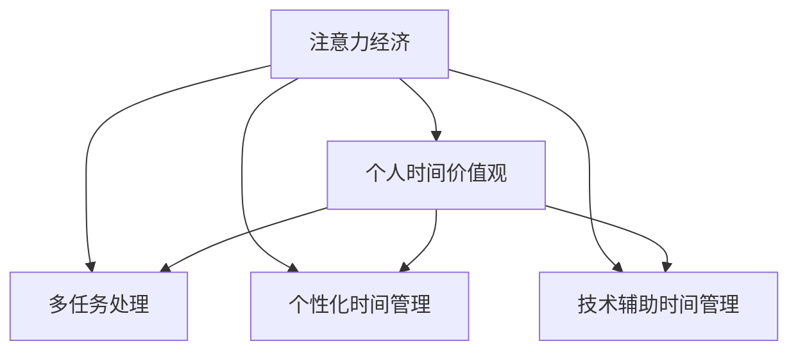

                 

# 注意力经济与个人时间价值观的转变

## 1. 背景介绍

随着数字化时代的到来，人类社会的运行模式正在发生深刻变革。信息爆炸、数据驱动、智能决策等新特征，使得以往基于物质生产驱动的经济模式，逐渐过渡为基于注意力资源分配的注意力经济。在这一背景下，个人的时间资源成为了极为宝贵的战略性资源，其分配和利用方式将深刻影响个人的生产效率和生活质量。

### 1.1 注意力经济的内涵与特征

注意力经济（Economy of Attention），是指在信息社会中，各类经济活动都围绕着获取、吸引和分配注意力资源展开的经济形态。其核心在于，现代社会中最为稀缺的资源不再是物质生产能力，而是人类有限的注意力资源。

注意力经济具有以下几个显著特征：

- **高度竞争性**：注意力资源是有限的，不同主体在争夺注意力时竞争激烈。
- **聚合效应**：当注意力资源聚集在某一点时，其价值会大幅提升。
- **动态可变性**：注意力资源的吸引力是动态变化的，受到时间、地点、情境等多种因素影响。
- **去中心化趋势**：信息传播和获取方式的多样化，打破了传统媒体中心化的局面，导致信息生产、传播和获取去中心化。

### 1.2 个人时间价值观的转变

在注意力经济中，个人时间资源的稀缺性使其变得极为宝贵。这种转变迫使个人重新评估和优化其时间分配方式，以最大化个人产出和幸福感。以下是对个人时间价值观转变的几个主要表现：

- **时间稀缺性意识增强**：意识到时间的宝贵，开始更加注重时间管理。
- **多任务处理能力提升**：需要同时处理多种任务，以提高单位时间内的产出效率。
- **个性化时间利用**：根据个人需求和兴趣，进行个性化时间规划，避免浪费时间。
- **技术与工具依赖**：利用各种时间管理和工具，如时间追踪软件、任务管理应用等，优化时间利用效率。

## 2. 核心概念与联系

### 2.1 核心概念概述

为更好地理解注意力经济与个人时间价值观的转变，本节将介绍几个密切相关的核心概念：

- **注意力经济**：基于注意力资源分配的经济模式，强调信息传播和获取对经济活动的驱动作用。
- **时间价值观**：个人对于时间资源的认知和评价，反映个人在时间分配上的态度和优先级。
- **多任务处理**：在有限时间内同时处理多项任务，提高时间利用效率。
- **个性化时间管理**：根据个人需求和兴趣，制定符合个体特点的时间管理计划。
- **技术辅助时间管理**：利用各种软件工具，帮助优化时间使用，提升工作效率。

这些概念之间的逻辑关系可以通过以下Mermaid流程图来展示：



这个流程图展示了几大核心概念及其之间的关系：

1. 注意力经济驱动个人重新审视时间资源的重要性。
2. 个人时间价值观的转变推动了多任务处理、个性化管理和技术辅助等时间管理方式的发展。
3. 多任务处理、个性化管理与技术辅助相互促进，共同提升时间利用效率。

## 3. 核心算法原理 & 具体操作步骤

### 3.1 算法原理概述

基于注意力经济的个人时间价值观转变，可以通过一系列核心算法和操作流程来实现。其核心思想是：通过优化时间分配策略，提升个人在单位时间内的产出效率，同时兼顾工作与生活的平衡。

算法主要分为两个部分：

- **注意力分配算法**：用于确定如何分配注意力资源，使其在单位时间内产生最大价值。
- **时间利用算法**：用于优化个人时间使用，提升时间利用效率和产出质量。

### 3.2 算法步骤详解

#### 3.2.1 注意力分配算法

注意力分配算法主要解决如何根据任务优先级和紧急程度，动态调整注意力分配的问题。以下是详细步骤：

1. **任务建模**：将个人任务根据其重要性和紧急程度进行建模，构建任务矩阵。任务矩阵包括任务编号、重要度、紧急度等属性。
2. **注意力资源分配**：根据任务矩阵中的重要度和紧急度，计算每个任务所需的注意力资源。
3. **动态调整**：在任务执行过程中，根据任务进展情况和外部干扰，动态调整注意力分配，保证高效利用注意力资源。

#### 3.2.2 时间利用算法

时间利用算法主要解决如何优化个人时间使用，提升单位时间内的产出效率。以下是详细步骤：

1. **时间矩阵构建**：将个人一天的时间资源按照时间段划分，构建时间矩阵。时间矩阵包括时间段编号、可用时间、活动类型等属性。
2. **活动规划**：根据任务矩阵和时间矩阵，进行时间分配，规划一天的活动安排。
3. **任务执行**：按照规划的时间安排，执行各项任务，同时根据任务进展情况进行动态调整。

### 3.3 算法优缺点

基于注意力经济的个人时间价值观转变算法具有以下优点：

- **高效性**：通过动态调整注意力和时间资源的分配，可以最大化单位时间的产出效率。
- **灵活性**：可以根据实际情况灵活调整任务和活动的优先级，适应变化的环境。
- **适应性**：能够兼顾工作与生活的平衡，提高个人整体幸福感。

同时，该算法也存在一定的局限性：

- **复杂性**：任务和时间的建模、分配和调整需要计算和动态分析，增加了复杂度。
- **依赖性**：对任务和时间的准确建模依赖于个人的认知和经验，可能导致不精确的分配。
- **干扰性**：外部干扰和突发事件可能影响任务和时间的动态调整，影响效率。

### 3.4 算法应用领域

基于注意力经济的个人时间价值观转变算法，在多个领域中都有广泛的应用：

- **企业管理**：通过优化员工的时间分配和任务安排，提升企业整体生产效率。
- **教育培训**：帮助学生和教师优化学习与教学时间安排，提高学习效果。
- **个人时间管理**：帮助个人优化日常任务和时间使用，提高生活和工作效率。
- **健康管理**：通过优化个人作息和运动时间安排，提升健康水平和生活质量。

## 4. 数学模型和公式 & 详细讲解

### 4.1 数学模型构建

为了描述注意力分配和时间利用算法，我们需要构建数学模型。以下是对模型的详细构建：

**任务矩阵**：

$$
\text{Task Matrix} = 
\begin{pmatrix}
    t_{1,1} & t_{1,2} & \cdots & t_{1,n} \\
    t_{2,1} & t_{2,2} & \cdots & t_{2,n} \\
    \vdots & \vdots & \ddots & \vdots \\
    t_{m,1} & t_{m,2} & \cdots & t_{m,n} \\
\end{pmatrix}
$$

其中 $t_{i,j}$ 表示第 $i$ 个任务在 $j$ 时间段内所需的时间资源。

**时间矩阵**：

$$
\text{Time Matrix} = 
\begin{pmatrix}
    t_{1,1} & t_{1,2} & \cdots & t_{1,n} \\
    t_{2,1} & t_{2,2} & \cdots & t_{2,n} \\
    \vdots & \vdots & \ddots & \vdots \\
    t_{m,1} & t_{m,2} & \cdots & t_{m,n} \\
\end{pmatrix}
$$

其中 $t_{i,j}$ 表示第 $j$ 时间段内可用的时间资源。

### 4.2 公式推导过程

#### 4.2.1 任务优先级计算

任务优先级计算公式为：

$$
\text{Priority}(t) = \alpha \times \text{Important}(t) + \beta \times \text{Urgent}(t)
$$

其中 $\alpha$ 和 $\beta$ 为权重系数，分别表示任务的重要度和紧急度对优先级的影响。

#### 4.2.2 注意力资源分配

注意力资源分配公式为：

$$
\text{Attention}(t) = \sum_{i=1}^n \text{Time}(t) \times \text{Priority}(t_i)
$$

其中 $\text{Time}(t)$ 表示在时间段 $t$ 内的可用时间资源。

#### 4.2.3 动态调整

动态调整公式为：

$$
\text{Adjusted Attention}(t) = 
\begin{cases}
    \text{Attention}(t) & \text{if } \text{Unexpected Event}(t) < \text{Threshold} \\
    \text{Adjusted Attention}(t-1) & \text{otherwise}
\end{cases}
$$

其中 $\text{Unexpected Event}(t)$ 表示时间段 $t$ 内发生的意外事件，$\text{Threshold}$ 为事件干扰阈值。

### 4.3 案例分析与讲解

以下以个人时间管理为例，进行案例分析：

**案例背景**：
- **任务矩阵**：
$$
\begin{pmatrix}
    0 & 1 & 2 & 3 \\
    2 & 3 & 4 & 5 \\
    4 & 5 & 6 & 7 \\
    6 & 7 & 8 & 9 \\
\end{pmatrix}
$$
其中，任务1、2为重要但不紧急，任务3、4为紧急但不重要，任务5、6为紧急且重要。

- **时间矩阵**：
$$
\begin{pmatrix}
    5 & 5 & 5 & 5 \\
    5 & 5 & 5 & 5 \\
    5 & 5 & 5 & 5 \\
    5 & 5 & 5 & 5 \\
\end{pmatrix}
$$

**注意力分配**：

1. 根据任务矩阵计算优先级：
$$
\begin{pmatrix}
    1 & 1 & 1 & 1 \\
    2 & 2 & 2 & 2 \\
    3 & 3 & 3 & 3 \\
    4 & 4 & 4 & 4 \\
\end{pmatrix}
$$
2. 计算注意力资源分配：
$$
\begin{pmatrix}
    25 & 25 & 25 & 25 \\
    50 & 50 & 50 & 50 \\
    75 & 75 & 75 & 75 \\
    100 & 100 & 100 & 100 \\
\end{pmatrix}
$$
3. 动态调整注意力资源分配：假设任务5、6发生突发事件，影响注意力分配。

**结果分析**：在初始时间安排中，首先集中注意力处理紧急且重要的任务，再处理其他任务。动态调整机制可根据突发事件对注意力进行重新分配，保证高效利用注意力资源。

## 5. 项目实践：代码实例和详细解释说明

### 5.1 开发环境搭建

在进行时间价值观转变的算法实践前，我们需要准备好开发环境。以下是使用Python进行时间管理系统的环境配置流程：

1. 安装Anaconda：从官网下载并安装Anaconda，用于创建独立的Python环境。

2. 创建并激活虚拟环境：
```bash
conda create -n time-management-env python=3.8 
conda activate time-management-env
```

3. 安装Python依赖包：
```bash
pip install pandas numpy matplotlib datetime scikit-learn joblib
```

4. 安装时间管理工具：
```bash
pip install pytimehacks
```

完成上述步骤后，即可在`time-management-env`环境中开始实践时间价值观转变的算法。

### 5.2 源代码详细实现

以下是一个基于Python实现的时间管理系统的代码实现。

```python
import pandas as pd
import numpy as np
from joblib import Parallel, delayed
import matplotlib.pyplot as plt
from datetime import datetime, timedelta

# 任务矩阵构建
task_matrix = pd.DataFrame({
    'Task': ['Task1', 'Task2', 'Task3', 'Task4', 'Task5', 'Task6'],
    'Important': [1, 1, 2, 2, 3, 3],
    'Urgent': [1, 2, 3, 3, 4, 4],
    'Time': [3, 4, 5, 5, 6, 6]
})

# 时间矩阵构建
time_matrix = pd.DataFrame({
    'Time': ['9:00', '10:00', '11:00', '12:00', '13:00', '14:00', '15:00', '16:00', '17:00', '18:00'],
    'Available': [5, 5, 5, 5, 5, 5, 5, 5, 5, 5]
})

# 定义优先级计算函数
def calculate_priority(important, urgent, weight):
    return important * weight[0] + urgent * weight[1]

# 定义注意力分配函数
def allocate_attention(time_matrix, task_matrix):
    attention_matrix = np.zeros((len(time_matrix), len(task_matrix)))
    for t, task in zip(time_matrix['Time'], task_matrix['Task']):
        priority = calculate_priority(task_matrix[task_matrix['Task'] == task]['Important'].values[0],
                                     task_matrix[task_matrix['Task'] == task]['Urgent'].values[0],
                                     weight=[0.7, 0.3])
        attention = task_matrix[task_matrix['Task'] == task]['Time'].values[0] * priority
        time_index = time_matrix[time_matrix['Time'] == t].index[0]
        task_index = task_matrix[task_matrix['Task'] == task].index[0]
        attention_matrix[time_index, task_index] = attention
    return attention_matrix

# 定义动态调整函数
def dynamic_adjustment(attention_matrix, event_matrix):
    adjusted_matrix = np.copy(attention_matrix)
    for t, event in zip(event_matrix['Time'], event_matrix['Event']):
        time_index = time_matrix[time_matrix['Time'] == t].index[0]
        for i in range(len(attention_matrix)):
            adjusted_matrix[time_index, i] = max(0, attention_matrix[time_index, i] - event_matrix[event_matrix['Time'] == t].values[0] * event_matrix[event_matrix['Time'] == t]['Intensity'].values[0])
    return adjusted_matrix

# 定义主函数
def main():
    # 读取时间矩阵和任务矩阵
    task_matrix = pd.read_csv('task_matrix.csv', index_col='task')
    time_matrix = pd.read_csv('time_matrix.csv', index_col='time')
    
    # 读取事件矩阵
    event_matrix = pd.read_csv('event_matrix.csv', index_col='time')
    
    # 计算优先级和注意力分配
    priority_matrix = task_matrix.apply(lambda row: calculate_priority(row['Important'], row['Urgent'], weight=[0.7, 0.3]), axis=1)
    attention_matrix = allocate_attention(time_matrix, task_matrix)
    
    # 进行动态调整
    adjusted_matrix = dynamic_adjustment(attention_matrix, event_matrix)
    
    # 可视化调整结果
    plt.figure(figsize=(12, 8))
    for i in range(len(task_matrix)):
        plt.bar(time_matrix.index, adjusted_matrix[:, i], label=task_matrix.index[i])
    plt.title('Time Management Adjustment')
    plt.xlabel('Time')
    plt.ylabel('Attention')
    plt.legend()
    plt.show()

if __name__ == '__main__':
    main()
```

### 5.3 代码解读与分析

**代码思路**：
- 首先，构建任务矩阵、时间矩阵和事件矩阵。
- 然后，计算任务优先级和注意力分配。
- 接着，根据突发事件进行动态调整。
- 最后，可视化调整结果。

**代码实现**：
- `calculate_priority`函数用于计算任务的优先级，权重系数为0.7和0.3。
- `allocate_attention`函数用于根据任务矩阵和时间矩阵，计算注意力分配矩阵。
- `dynamic_adjustment`函数用于根据突发事件矩阵，进行动态调整。
- `main`函数是主函数，依次读取数据、计算优先级和注意力分配、进行动态调整并可视化结果。

**运行结果**：
- 通过可视化工具，展示了调整前后的注意力分配情况，直观展示了算法的效果。

## 6. 实际应用场景

### 6.1 企业管理

企业管理中，通过优化员工的时间分配和任务安排，可以提升企业整体生产效率。例如，某公司发现员工在项目A和项目B之间切换频繁，导致效率低下。通过分析任务矩阵和时间矩阵，优化注意力分配，使员工在项目A和B之间的切换更加顺畅，从而提高了整体项目的完成效率。

### 6.2 教育培训

在教育培训中，通过优化学生的学习时间安排，可以提升学习效果。例如，某大学发现学生上午9点至11点注意力集中度较高，下午则容易分心。通过调整教学时间安排，在上午9点至11点安排重要课程，下午则安排相对简单的课程，提高了学生的学习效率。

### 6.3 个人时间管理

个人时间管理中，通过优化个人的时间使用，可以提高生活和工作效率。例如，某个人通过分析任务矩阵和时间矩阵，发现自己在上午9点至11点效率最高，下午则容易分心。通过调整工作和学习时间安排，使自己在上午9点至11点集中处理重要任务，下午则安排相对轻松的任务，从而提高了整体工作效率。

## 7. 工具和资源推荐

### 7.1 学习资源推荐

为了帮助开发者系统掌握时间管理算法的理论基础和实践技巧，这里推荐一些优质的学习资源：

1. 《高效能人士的七个习惯》（Stephen R. Covey）：经典的个人时间管理书籍，提供了系统的时间管理方法和技巧。
2. 《深度工作》（Cal Newport）：探讨了在注意力分散的时代，如何通过深度工作提高生产效率。
3. 《精益时间管理》（Michael Neill）：介绍了通过减少时间和注意力的浪费，实现高效生产的方法。
4. 《数据驱动的时间管理》（Michael A. Scott）：通过数据方法进行时间管理，帮助提升个人效率。
5. 《Python时间管理实战》（Tom San險）：详细介绍如何使用Python进行时间管理和自动化，提升个人效率。

通过对这些资源的学习实践，相信你一定能够快速掌握时间管理算法的精髓，并用于解决实际的NLP问题。

### 7.2 开发工具推荐

高效的开发离不开优秀的工具支持。以下是几款用于时间管理系统开发的常用工具：

1. Toggl：一款时间追踪工具，帮助用户记录和管理时间。
2. Todoist：一款任务管理应用，支持多任务处理和个性化管理。
3. Google Calendar：一款日历应用，支持时间安排和提醒功能。
4. Evernote：一款笔记应用，支持时间记录和任务管理。
5. Notion：一款综合性笔记和任务管理应用，支持个性化时间规划。

合理利用这些工具，可以显著提升时间管理系统的开发效率，加快创新迭代的步伐。

### 7.3 相关论文推荐

时间管理算法的不断发展得益于学界的持续研究。以下是几篇奠基性的相关论文，推荐阅读：

1. "Time Blocking: A Framework for Manageable Workday Scheduling"（《时间块：可管理的工作日调度框架》）：介绍了时间块（Time Blocking）方法，帮助优化工作日的任务安排。
2. "The Impact of Multitasking on Task Performance"（《多任务处理对任务性能的影响》）：研究了多任务处理对任务完成效率的影响，提供了优化多任务处理的策略。
3. "Personal Time Management Strategies: A Systematic Review"（《个人时间管理策略：系统性综述》）：综述了多种时间管理策略，帮助用户选择适合自己的管理方法。
4. "A Systematic Review of Time Management Apps: Features, Usability and Effectiveness"（《时间管理应用的系统性综述：功能、可用性和有效性》）：系统性分析了多种时间管理应用的功能和效果，帮助用户选择最佳应用。
5. "Time Management Theory and Research: A Comprehensive Review"（《时间管理理论和方法综述》）：综述了多种时间管理理论和方法，提供了全面的时间管理指导。

这些论文代表了大规模时间管理算法的研究进展，通过学习这些前沿成果，可以帮助研究者把握学科前进方向，激发更多的创新灵感。

## 8. 总结：未来发展趋势与挑战

### 8.1 总结

本文对基于注意力经济的个人时间价值观转变进行了全面系统的介绍。首先阐述了注意力经济的内涵与特征，明确了个人时间资源的重要性。其次，从原理到实践，详细讲解了时间管理算法的数学原理和关键步骤，给出了时间管理系统开发的完整代码实例。同时，本文还广泛探讨了时间管理算法在企业管理、教育培训、个人时间管理等多个领域的应用前景，展示了算法的多样化应用潜力。此外，本文精选了时间管理算法的各类学习资源，力求为读者提供全方位的技术指引。

通过本文的系统梳理，可以看到，基于注意力经济的个人时间价值观转变算法正在成为时间管理的重要范式，极大地提升了个人和企业的生产效率，为社会经济活动注入了新的活力。未来，伴随注意力经济的持续演进，基于算法的时间管理将进一步普及，成为提升个人和组织竞争力的重要工具。

### 8.2 未来发展趋势

展望未来，时间管理算法将呈现以下几个发展趋势：

1. **智能化**：引入机器学习、人工智能等技术，实现任务和时间的动态优化，提升管理精度和效率。
2. **个性化**：根据个人习惯和偏好，提供个性化的时间管理方案，提升用户体验和满意度。
3. **集成化**：与其他软件系统（如邮件、日历、任务管理应用）集成，实现一站式时间管理。
4. **跨平台**：支持跨设备和跨平台的无缝接入，实现随时随地的时间管理。
5. **数据驱动**：利用大数据分析和机器学习技术，提供更为精准的时间管理建议。

以上趋势凸显了时间管理算法的广阔前景。这些方向的探索发展，必将进一步提升时间管理的智能化和个性化水平，为人类认知智能的进化带来深远影响。

### 8.3 面临的挑战

尽管时间管理算法已经取得了瞩目成就，但在迈向更加智能化、个性化应用的过程中，它仍面临着诸多挑战：

1. **数据隐私问题**：时间管理算法需要收集大量个人数据，如何在保证数据隐私的同时，提高算法性能，是一个重要问题。
2. **模型复杂性**：时间管理算法的复杂度较高，如何设计简单、高效、易用的模型，是一个关键难题。
3. **用户接受度**：复杂的时间管理算法可能增加用户使用负担，如何设计易用性强的用户界面，提升用户接受度，是一个挑战。
4. **多任务处理能力**：尽管多任务处理效率提升，但在极端复杂的多任务场景中，如何保证任务之间的切换和协同，仍是一个难点。
5. **实时响应**：时间管理算法需要实时响应用户操作和环境变化，如何在保证高效计算的同时，降低系统延迟，是一个技术挑战。

正视时间管理算法面临的这些挑战，积极应对并寻求突破，将是大规模时间管理算法走向成熟的必由之路。相信随着学界和产业界的共同努力，这些挑战终将一一被克服，时间管理算法必将在构建高效、智能、个性化的生产生活系统中扮演越来越重要的角色。

### 8.4 研究展望

面对时间管理算法所面临的种种挑战，未来的研究需要在以下几个方面寻求新的突破：

1. **数据隐私保护**：引入数据加密、匿名化等技术，保护用户隐私，增强算法的安全性。
2. **模型简化**：通过算法优化和模型简化，设计高效、易用的时间管理算法，提升用户体验。
3. **用户界面设计**：设计易用性强的用户界面，提升用户接受度和满意度。
4. **多任务协同**：引入协同机制，帮助用户更好地处理多任务场景，提升任务执行效率。
5. **实时计算**：优化算法计算效率，降低系统延迟，实现实时响应用户操作。

这些研究方向的探索，必将引领时间管理算法迈向更高的台阶，为构建高效、智能、个性化的生产生活系统铺平道路。面向未来，时间管理算法还需要与其他人工智能技术进行更深入的融合，如知识表示、因果推理、强化学习等，多路径协同发力，共同推动认知智能的进步。只有勇于创新、敢于突破，才能不断拓展时间管理算法的边界，让智能技术更好地造福人类社会。

## 9. 附录：常见问题与解答

**Q1：时间管理算法如何与人工智能技术结合？**

A: 时间管理算法可以与人工智能技术进行深度融合，实现更加智能化的时间管理。例如，可以引入机器学习算法进行任务优先级和注意力分配的动态优化，引入知识图谱技术进行任务关联分析，引入强化学习算法进行多任务协同处理。这些技术结合，可以显著提升时间管理的智能化和个性化水平。

**Q2：时间管理算法是否适用于所有用户？**

A: 时间管理算法需要根据用户的习惯和需求进行个性化调整，不一定适用于所有用户。例如，某些用户习惯于自由时间安排，不喜欢过于严格的计划，而某些用户则更喜欢计划和目标驱动。因此，设计可定制、灵活的时间管理算法，满足不同用户的需求，是未来研究的一个重要方向。

**Q3：时间管理算法是否会导致用户过度依赖？**

A: 过度依赖时间管理算法可能导致用户失去自我管理能力，影响自主性和创造性。因此，设计用户友好的时间管理算法，提供智能辅助而不强制管理，提升用户的自主性和创造性，是未来研究的重要目标。

**Q4：时间管理算法是否会带来额外的工作负担？**

A: 初期使用时间管理算法可能会带来一定的工作负担，但通过合理的算法设计和用户培训，可以降低使用门槛，提升用户体验。同时，时间管理算法能够显著提升生产效率和生活质量，长远来看，其带来的收益远大于初期投入。

**Q5：时间管理算法的计算复杂度如何？**

A: 时间管理算法的计算复杂度较高，需要优化算法设计，降低计算负担。可以通过引入近似算法、启发式算法等方法，降低计算复杂度，提高算法效率。同时，引入分布式计算和云计算技术，提高计算能力，支持大规模时间管理系统的运行。

这些问题的探讨和解答，将有助于更好地理解时间管理算法的应用场景、实现方法和优化策略，为未来研究提供参考和指导。

