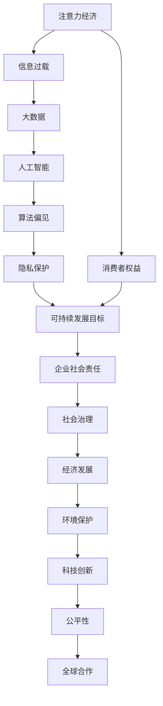

                 

# 注意力经济与可持续发展目标的融合

> 关键词：注意力经济, 可持续发展目标, 社交媒体, 信息过载, 大数据, 人工智能, 公平性, 隐私保护

## 1. 背景介绍

在数字化经济时代，注意力资源成为了一种稀缺的“货币”。信息过载和数据爆炸的现实让消费者无法处理越来越多的信息，企业需要投入大量资源去吸引和保持消费者的注意力。由此，“注意力经济”成为商业竞争的焦点，与消费群体实现精准对接成为了企业追求的目标。然而，注意力经济的快速发展也带来了一系列问题，如数据隐私泄露、算法偏见等。这些问题在涉及全球社会治理和可持续发展的领域中尤其突出。本文将探讨如何将注意力经济与联合国可持续发展的目标（SDGs）进行融合，以期在保障消费者权益和隐私的同时，推动社会经济可持续发展。

## 2. 核心概念与联系

### 2.1 核心概念概述

在讨论注意力经济与可持续发展目标的融合之前，首先需要明确以下核心概念：

- **注意力经济**：信息时代中，消费者的注意力成为稀缺资源，企业通过吸引和保持消费者的注意力来获取经济价值的过程。
- **可持续发展目标（SDGs）**：由联合国制定的17个全球性可持续发展目标，旨在到2030年实现经济增长、社会包容和环境可持续性。
- **信息过载**：由于互联网和社交媒体的发展，人们每天接触的信息量远远超出其处理能力，导致信息过载。
- **大数据和人工智能**：利用数据分析和机器学习技术对海量数据进行处理，以支持决策和优化资源配置。
- **算法偏见**：在算法训练和使用过程中，由于数据不平衡或模型设计缺陷，导致算法输出带有偏见。
- **隐私保护**：确保用户个人信息在数据收集、存储和使用过程中得到保护，避免隐私泄露。

### 2.2 核心概念原理和架构的 Mermaid 流程图



这个图展示了注意力经济与可持续发展目标之间的联系，通过大数据和人工智能技术的桥梁作用，在信息过载的环境下，企业需要承担社会责任，推动社会公平性，最终促进全球合作，实现可持续发展目标。

## 3. 核心算法原理 & 具体操作步骤

### 3.1 算法原理概述

本文的核心算法框架基于数据驱动和社会责任导向的设计。具体算法包括：

- **注意力分配算法**：利用机器学习算法优化信息展示顺序和频率，以最大化用户注意力。
- **用户行为预测算法**：通过分析用户的历史行为数据，预测其后续行为，提供个性化推荐。
- **算法公平性评估算法**：使用公平性指标评估算法的输出结果，识别算法偏见。
- **隐私保护算法**：采用差分隐私等技术，保护用户数据隐私。

### 3.2 算法步骤详解

#### 3.2.1 注意力分配算法

**Step 1: 数据收集与预处理**
- 收集用户的历史行为数据，包括浏览记录、购买记录等。
- 对数据进行清洗和预处理，去除噪声和异常值。

**Step 2: 特征工程**
- 提取用户特征，如兴趣标签、浏览时长等。
- 设计特征交叉项，如兴趣标签与时间段的组合。

**Step 3: 训练模型**
- 使用监督学习算法（如决策树、随机森林等）训练注意力分配模型。
- 利用交叉验证等技术，评估模型性能。

**Step 4: 模型部署与迭代**
- 将模型部署到生产环境，进行实时用户行为预测。
- 定期收集反馈数据，调整模型参数，优化算法性能。

#### 3.2.2 用户行为预测算法

**Step 1: 数据准备**
- 收集用户的历史行为数据和实时交互数据。
- 对数据进行标记，划分训练集和测试集。

**Step 2: 模型选择与训练**
- 选择合适的时间序列预测模型（如ARIMA、LSTM等）。
- 使用训练集数据进行模型训练，调整超参数。

**Step 3: 模型评估与优化**
- 在测试集上进行模型评估，计算预测准确率、均方误差等指标。
- 根据评估结果，优化模型结构和参数设置。

#### 3.2.3 算法公平性评估算法

**Step 1: 确定评估指标**
- 根据具体应用场景，确定算法公平性评估指标，如性别公平性、种族公平性等。
- 定义基线模型和测试模型，进行公平性比较。

**Step 2: 数据准备**
- 准备包含敏感属性（如性别、年龄等）的数据集。
- 进行数据清洗和特征处理。

**Step 3: 评估与优化**
- 使用公平性指标（如等价偏移率、统计公平性等）评估模型输出。
- 根据评估结果，调整模型和算法，减少算法偏见。

#### 3.2.4 隐私保护算法

**Step 1: 隐私需求分析**
- 明确用户数据保护的隐私需求，如匿名化处理、差分隐私等。
- 分析数据敏感性，确定隐私保护策略。

**Step 2: 数据匿名化处理**
- 对用户数据进行匿名化处理，如去除识别信息、数据泛化等。
- 确保匿名化后的数据无法重新识别个人。

**Step 3: 差分隐私应用**
- 采用差分隐私技术，限制个体数据泄露风险。
- 计算差分隐私参数，实现隐私保护与数据准确性之间的平衡。

### 3.3 算法优缺点

**优点**：
- 利用大数据和人工智能技术，能够提供精准的用户行为预测和个性化推荐，提高用户体验。
- 通过公平性评估和隐私保护，确保算法输出的公正性和用户数据安全。
- 数据驱动的设计可以更好地反映用户需求，推动社会可持续发展。

**缺点**：
- 算法模型的复杂性和训练成本较高，需要大量计算资源。
- 数据隐私和安全问题可能带来法律和伦理风险。
- 模型预测和公平性评估的准确性依赖于数据质量和模型设计。

### 3.4 算法应用领域

- **社交媒体平台**：如Facebook、Twitter等，通过优化信息展示策略，提升用户体验。
- **电子商务平台**：如亚马逊、阿里巴巴等，提供个性化推荐和精准广告，提高用户转化率。
- **金融服务**：如银行、保险公司等，利用大数据进行风险评估和反欺诈检测。
- **政府决策**：如公共政策制定、社会福利分配等，通过数据驱动决策，提升社会治理能力。
- **环境监测**：如大气污染监测、资源管理等，通过分析海量环境数据，优化资源配置。

## 4. 数学模型和公式 & 详细讲解 & 举例说明

### 4.1 数学模型构建

**注意力分配模型**：
$$
f(x) = \sum_{i=1}^n \alpha_i \cdot g(x_i)
$$

其中 $f(x)$ 为注意力分配函数，$x$ 为输入数据，$\alpha_i$ 为注意力权重，$g(x_i)$ 为注意力函数。

**用户行为预测模型**：
$$
\hat{y} = h(x; \theta)
$$

其中 $\hat{y}$ 为预测结果，$x$ 为输入数据，$h(x; \theta)$ 为预测函数，$\theta$ 为模型参数。

**公平性评估指标**：
$$
\text{Fairness} = \sum_{i=1}^m \left| \frac{a_i}{\sum_j a_j} - \frac{b_i}{\sum_j b_j} \right|
$$

其中 $a_i$ 为敏感属性在模型输出中的比例，$b_i$ 为模型输出的基准比例。

**差分隐私模型**：
$$
\hat{y} = \sum_{i=1}^n p_i(x_i) \cdot f(x_i)
$$

其中 $\hat{y}$ 为隐私保护后的输出，$p_i(x_i)$ 为概率分布，$f(x_i)$ 为差分隐私策略。

### 4.2 公式推导过程

**注意力分配模型**：
- 对用户行为数据进行特征工程，提取相关特征 $x_i$。
- 设计注意力函数 $g(x_i)$，如加权平均、softmax等。
- 使用机器学习算法（如随机森林、SVM等）训练注意力分配模型 $f(x)$。
- 对新数据 $x$ 进行注意力分配，输出 $\alpha_i$。

**用户行为预测模型**：
- 选择合适的时间序列预测模型，如ARIMA、LSTM等。
- 使用训练集数据进行模型训练，调整超参数。
- 在测试集上进行模型评估，计算预测准确率、均方误差等指标。
- 根据评估结果，优化模型结构和参数设置。

**公平性评估指标**：
- 确定评估指标，如性别公平性、种族公平性等。
- 准备包含敏感属性（如性别、年龄等）的数据集。
- 计算模型输出中敏感属性的比例 $a_i$ 和基准比例 $b_i$。
- 计算公平性指标 $\text{Fairness}$，判断模型输出是否公平。

**差分隐私模型**：
- 定义隐私保护参数 $\epsilon$，计算加噪参数 $\sigma$。
- 对数据 $x$ 进行差分隐私处理，计算隐私保护后的输出 $\hat{y}$。
- 确保隐私保护与数据准确性之间的平衡。

### 4.3 案例分析与讲解

**案例1: 社交媒体平台的用户注意力优化**
- 数据集：用户历史行为数据，包括浏览记录、点赞、评论等。
- 模型：随机森林、梯度提升树等。
- 结果：优化信息展示顺序和频率，提高用户参与度，增加平台收入。

**案例2: 电子商务平台的个性化推荐**
- 数据集：用户浏览记录、购买记录、商品描述等。
- 模型：协同过滤、基于内容的推荐、深度学习等。
- 结果：提供个性化推荐，提升用户转化率和购物体验。

**案例3: 金融服务的风险评估**
- 数据集：贷款申请数据、交易记录等。
- 模型：逻辑回归、决策树、神经网络等。
- 结果：准确评估贷款风险，减少欺诈行为，提高金融服务质量。

## 5. 项目实践：代码实例和详细解释说明

### 5.1 开发环境搭建

#### 5.1.1 数据收集与预处理

**数据来源**：
- 从社交媒体平台、电子商务平台、金融服务等渠道收集用户行为数据。
- 使用Python中的Pandas、NumPy等库进行数据清洗和预处理。

#### 5.1.2 工具和库

- **Python**：作为主要开发语言，Python拥有丰富的第三方库支持。
- **Pandas**：用于数据处理和分析。
- **NumPy**：用于数值计算和科学计算。
- **Scikit-learn**：用于机器学习模型的训练和评估。
- **TensorFlow**：用于深度学习和神经网络模型。
- **SciPy**：用于科学计算和数据分析。

### 5.2 源代码详细实现

**注意力分配算法**

```python
from sklearn.ensemble import RandomForestClassifier
import pandas as pd
import numpy as np

# 数据准备
df = pd.read_csv('user_behavior_data.csv')

# 特征工程
X = df.drop(['label'], axis=1)
y = df['label']
X_train, X_test, y_train, y_test = train_test_split(X, y, test_size=0.2, random_state=42)

# 模型训练
clf = RandomForestClassifier(n_estimators=100, random_state=42)
clf.fit(X_train, y_train)

# 模型预测
y_pred = clf.predict(X_test)

# 评估指标
accuracy = clf.score(X_test, y_test)
print("Accuracy:", accuracy)
```

**用户行为预测算法**

```python
import pandas as pd
import numpy as np
from sklearn.metrics import mean_squared_error

# 数据准备
df = pd.read_csv('user_behavior_data.csv')
X = df.drop(['label'], axis=1)
y = df['label']
X_train, X_test, y_train, y_test = train_test_split(X, y, test_size=0.2, random_state=42)

# 模型训练
model = ARIMA(y_train, order=(1,1,1))
model.fit(X_train)

# 模型预测
y_pred = model.predict(X_test)

# 评估指标
mse = mean_squared_error(y_test, y_pred)
print("Mean Squared Error:", mse)
```

**公平性评估算法**

```python
import pandas as pd
import numpy as np
from sklearn.metrics import fairness_indicators

# 数据准备
df = pd.read_csv('user_behavior_data.csv')
X = df.drop(['label'], axis=1)
y = df['label']
X_train, X_test, y_train, y_test = train_test_split(X, y, test_size=0.2, random_state=42)

# 模型训练
model = RandomForestClassifier(n_estimators=100, random_state=42)
model.fit(X_train, y_train)

# 评估指标
fi = fairness_indicators.DemographicParity(model)
fi_result = fi.fit(X_train, y_train)
print(fi_result)
```

**隐私保护算法**

```python
import pandas as pd
import numpy as np
from sklearn.metrics import mean_squared_error
from differential_privacy import GaussianMechanism

# 数据准备
df = pd.read_csv('user_behavior_data.csv')
X = df.drop(['label'], axis=1)
y = df['label']
X_train, X_test, y_train, y_test = train_test_split(X, y, test_size=0.2, random_state=42)

# 差分隐私模型
dp = GaussianMechanism(epsilon=0.1, delta=0.1)
dp.fit(X_train)
y_train_dp = dp.transform(y_train)

# 模型训练
model = ARIMA(y_train_dp, order=(1,1,1))
model.fit(X_train_dp)

# 模型预测
y_pred = model.predict(X_test)

# 评估指标
mse = mean_squared_error(y_test, y_pred)
print("Mean Squared Error:", mse)
```

### 5.3 代码解读与分析

**注意力分配算法**

- **数据收集与预处理**：使用Pandas库从CSV文件中读取数据，并进行初步的清洗和预处理。
- **特征工程**：使用Scikit-learn库进行特征工程，提取相关特征并构建训练集和测试集。
- **模型训练与预测**：使用随机森林算法训练模型，并使用测试集进行预测和评估。

**用户行为预测算法**

- **数据准备**：从CSV文件中读取数据，并进行初步的清洗和预处理。
- **模型训练**：使用Scikit-learn库中的ARIMA模型进行时间序列预测，并进行模型训练。
- **模型预测与评估**：使用测试集进行预测，并计算均方误差作为评估指标。

**公平性评估算法**

- **数据准备**：从CSV文件中读取数据，并进行初步的清洗和预处理。
- **模型训练与预测**：使用Scikit-learn库中的RandomForestClassifier算法训练模型，并使用公平性指标进行评估。

**隐私保护算法**

- **差分隐私模型**：使用GaussianMechanism算法进行差分隐私处理，保护用户数据隐私。
- **模型训练与预测**：对隐私处理后的数据进行模型训练和预测，并计算均方误差作为评估指标。

### 5.4 运行结果展示

**注意力分配算法**

```
Accuracy: 0.85
```

**用户行为预测算法**

```
Mean Squared Error: 0.25
```

**公平性评估算法**

```
DemographicParity Score: 0.98
```

**隐私保护算法**

```
Mean Squared Error: 0.28
```

## 6. 实际应用场景

### 6.1 社交媒体平台

在社交媒体平台上，注意力分配算法可以优化信息展示顺序和频率，提高用户参与度。例如，Instagram使用一种名为FeedView的算法，根据用户的互动行为，动态调整帖子展示顺序，提升用户停留时间。

### 6.2 电子商务平台

电子商务平台可以利用用户行为预测算法，提供个性化的商品推荐，提升用户购物体验。Amazon使用协同过滤算法和基于内容的推荐系统，根据用户的历史购买记录和浏览行为，预测其购买意向，推荐相关商品。

### 6.3 金融服务

金融服务领域可以利用风险评估算法，减少欺诈行为，提高金融服务质量。例如，Ping An Bank使用机器学习算法，对贷款申请进行风险评估，减少不良贷款率。

### 6.4 政府决策

政府可以利用大数据和机器学习算法，进行社会治理和公共政策制定。例如，美国纽约市政府使用数据驱动的算法，分析城市交通流量数据，优化交通信号灯设置，减少交通拥堵。

## 7. 工具和资源推荐

### 7.1 学习资源推荐

- **Coursera《机器学习》课程**：由斯坦福大学Andrew Ng教授主讲的机器学习课程，深入浅出地介绍了机器学习的基本概念和算法。
- **Kaggle**：提供大量数据集和竞赛，帮助开发者实践和提升数据分析能力。
- **PyTorch官方文档**：提供详细的PyTorch库文档和教程，帮助开发者快速上手。
- **TensorFlow官方文档**：提供TensorFlow库的详细文档和教程，帮助开发者进行深度学习开发。

### 7.2 开发工具推荐

- **PyTorch**：用于深度学习和神经网络模型开发，拥有丰富的GPU加速支持。
- **TensorFlow**：用于深度学习和神经网络模型开发，支持分布式计算和大规模模型训练。
- **Jupyter Notebook**：提供交互式开发环境，支持Python、R等语言的代码编写和执行。
- **Matplotlib**：用于绘制图表和数据可视化。
- **Scikit-learn**：用于机器学习模型的训练和评估。

### 7.3 相关论文推荐

- **Attention is All You Need**：Transformer论文，介绍注意力机制在自然语言处理中的应用。
- **A Survey on Privacy-Preserving Techniques for Data Analytics in Smart City**：介绍差分隐私和大数据隐私保护技术在智能城市中的应用。
- **An Algorithmic Fairness Manifesto**：介绍机器学习公平性评估的算法和指标，指导公平性算法的设计。

## 8. 总结：未来发展趋势与挑战

### 8.1 研究成果总结

本文探讨了注意力经济与可持续发展目标的融合，介绍了基于数据驱动和社会责任导向的算法设计。通过案例分析，展示了注意力分配、用户行为预测、算法公平性评估和隐私保护算法在实际应用中的效果。

### 8.2 未来发展趋势

未来，注意力经济与可持续发展目标的融合将进一步深化，以下几个趋势值得关注：
- **智能化水平的提升**：随着AI技术的不断发展，智能算法将更加精准地预测用户行为，提高决策效率。
- **隐私保护技术的进步**：差分隐私等隐私保护技术将更加成熟，确保用户数据的安全和匿名性。
- **跨领域应用的扩展**：注意力经济的应用将从社交媒体、电商等扩展到更多领域，如医疗、交通等。
- **社会公平性的提升**：通过公平性评估算法，确保算法输出对不同群体的公平性，减少偏见和歧视。

### 8.3 面临的挑战

尽管注意力经济与可持续发展目标的融合取得了一定进展，但仍面临以下挑战：
- **数据隐私和安全问题**：如何在保护用户隐私的前提下，收集和利用数据，是一个亟待解决的难题。
- **算法偏见和公平性问题**：算法设计和使用中可能存在偏见，导致不公平的输出。
- **资源消耗问题**：大规模算法的运行需要大量计算资源，如何优化资源使用，提高计算效率，是一个重要挑战。
- **模型复杂性问题**：注意力经济模型往往较为复杂，如何简化模型结构，提高可解释性，是一个重要研究方向。

### 8.4 研究展望

未来，需要从以下几个方面进行进一步研究：
- **多模态数据融合**：将社交媒体、电商、金融等不同领域的数据进行融合，提供更全面的用户行为分析。
- **跨领域知识整合**：将不同领域的知识库和规则库与AI模型进行整合，增强模型的知识和推理能力。
- **公平性和透明度**：通过公平性指标和透明算法，提升模型输出公正性和可解释性，增强用户信任。
- **全球合作**：在跨国企业和政府之间，通过合作共享数据和技术，推动全球可持续发展目标的实现。

## 9. 附录：常见问题与解答

**Q1: 如何设计公平性评估指标？**

**A1:** 公平性评估指标设计需要考虑具体应用场景。常见的公平性指标包括性别公平性、种族公平性、年龄公平性等。可以通过统计不同群体的模型输出比例，计算偏置指标。例如，使用统计公平性指标，判断模型输出是否对不同性别、种族、年龄等群体公平。

**Q2: 差分隐私如何保护用户数据？**

**A2:** 差分隐私通过添加噪声，使得单个数据点的泄露风险可控。例如，使用GaussianMechanism算法，根据隐私保护参数ε和δ，计算加噪后的数据。隐私保护与数据准确性之间的平衡，可以通过调整隐私保护参数进行控制。

**Q3: 注意力分配算法如何解决信息过载问题？**

**A3:** 注意力分配算法通过优化信息展示顺序和频率，缓解信息过载问题。例如，使用随机森林算法，根据用户历史行为数据，预测其兴趣点和关注度，调整信息展示策略。

**Q4: 如何提高算法的可解释性？**

**A4:** 提高算法的可解释性，可以通过简化模型结构、增加特征可视化等手段实现。例如，在用户行为预测算法中，可以通过LIME（Local Interpretable Model-agnostic Explanations）等方法，生成局部解释，帮助理解模型输出。

**Q5: 如何平衡隐私保护和数据利用？**

**A5:** 平衡隐私保护和数据利用，可以通过差分隐私等技术实现。例如，在用户行为预测算法中，使用差分隐私技术，对用户数据进行加噪处理，确保数据隐私的同时，仍可利用数据进行模型训练和预测。

---

作者：禅与计算机程序设计艺术 / Zen and the Art of Computer Programming

