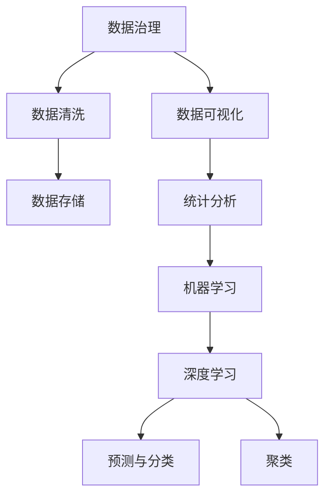

                 

# 注意力经济与数据分析洞察力：利用数据理解受众行为和市场

在数字化时代的浪潮中，数据成为推动经济增长的核心资源。如何利用数据洞察受众行为，挖掘市场机遇，成为众多企业面临的共同课题。本文将深入探讨注意力经济与数据分析的原理，揭示其如何在商业决策中发挥关键作用。通过详细阐述核心概念、算法原理和实践技巧，本文旨在为数据分析领域的研究者和实践者提供深入的指导，助力企业在数据驱动的时代中稳步前行。

## 1. 背景介绍

### 1.1 问题由来

随着互联网的飞速发展，信息量呈爆炸式增长，如何有效筛选、利用数据成为企业运营的关键。注意力经济（Economies of Attention）的概念应运而生，强调在信息过载的环境下，如何集中注意力，提升信息价值。数据分析洞察力则是指通过数据挖掘、统计分析等方法，揭示数据背后的潜在模式和趋势，为企业决策提供科学依据。

当前，大数据、人工智能等技术迅猛发展，使得注意力经济和数据分析洞察力在商业应用中得以广泛实践。企业纷纷利用这些技术手段，提升市场竞争力，探索新的增长点。然而，由于数据量大、维度高、处理复杂，数据分析工作面临诸多挑战。如何高效利用数据，提升数据分析洞察力，成为亟待解决的问题。

### 1.2 问题核心关键点

利用数据理解受众行为和市场的关键点包括：

- **数据质量**：数据的准确性、完整性、一致性直接影响到数据分析的成果。
- **数据处理**：数据清洗、预处理、特征工程等技术手段，对提高数据分析的准确性至关重要。
- **模型选择**：选择合适的统计模型、机器学习模型、深度学习模型等，能够显著提升数据分析的效率和精度。
- **算法优化**：通过调参、集成学习等方法，优化算法性能，减少过拟合风险。
- **结果解释**：利用可视化和自然语言生成等技术，将数据分析结果转化为易于理解的图表和报告。

### 1.3 问题研究意义

研究注意力经济与数据分析洞察力的核心意义在于：

- 提升企业决策的科学性：通过数据驱动的方法，帮助企业准确把握市场趋势，做出更优的商业决策。
- 降低运营成本：利用数据洞察力，提高资源配置的效率，降低运营成本。
- 增强市场竞争力：通过数据驱动的产品设计和市场策略，提升企业的产品竞争力。
- 促进创新：数据分析洞察力有助于揭示创新机会，加速产品迭代和业务模式创新。

## 2. 核心概念与联系

### 2.1 核心概念概述

注意力经济和数据分析洞察力涉及多个关键概念，包括：

- **数据治理**：涉及数据收集、存储、清洗、处理、质量控制等环节，确保数据的可靠性和可用性。
- **数据可视化**：将复杂的数据信息通过图表、地图等形式展示出来，帮助人们更好地理解数据。
- **统计分析**：利用描述性统计、推断性统计等方法，发现数据背后的规律和趋势。
- **机器学习**：通过构建模型，进行预测、分类、聚类等任务，提升数据分析的自动化和智能化。
- **深度学习**：利用深度神经网络模型，处理高维数据，挖掘数据中的复杂关系。

这些概念通过数据链路紧密相连，共同构成了数据分析洞察力的生态系统。

### 2.2 核心概念原理和架构的 Mermaid 流程图



### 2.3 核心概念联系

- **数据治理与数据清洗**：数据治理是数据处理的基础，数据清洗则是确保数据质量的关键步骤。
- **数据存储与数据可视化**：高质量的数据存储，使得数据可视化更加高效、直观。
- **统计分析与机器学习**：统计分析提供数据的基础理解，机器学习则在此基础上提升数据分析的自动化和智能化。
- **深度学习与预测分类**：深度学习模型能够处理更加复杂的数据结构，提高预测和分类的准确性。

## 3. 核心算法原理 & 具体操作步骤

### 3.1 算法原理概述

数据分析洞察力算法原理主要包括以下几个方面：

- **描述性统计**：通过计算均值、方差、中位数等统计量，描述数据的集中趋势和离散程度。
- **推断性统计**：通过样本统计量推断总体参数，如t检验、卡方检验等。
- **回归分析**：通过线性回归、多元回归等方法，探索变量之间的线性关系。
- **聚类分析**：利用k-means、层次聚类等算法，将数据分为不同的群组。
- **分类算法**：利用逻辑回归、决策树、支持向量机等模型，进行样本分类。
- **预测模型**：通过时间序列分析、随机森林等模型，进行未来趋势预测。

### 3.2 算法步骤详解

1. **数据收集与清洗**：
   - 从不同数据源收集数据，进行初步清洗，去除噪声和异常值。
   - 使用ETL工具（Extract, Transform, Load）对数据进行标准化处理，确保数据的一致性和完整性。

2. **特征工程**：
   - 选择合适的特征，并进行特征选择、特征变换、特征提取等操作。
   - 通过主成分分析、因子分析等方法，降低特征维度，提升模型训练效率。

3. **模型构建与训练**：
   - 根据数据类型和任务需求，选择合适的模型。
   - 利用交叉验证、网格搜索等方法，优化模型参数，提升模型性能。
   - 通过随机森林、梯度提升树等集成学习算法，提高模型泛化能力。

4. **结果评估与优化**：
   - 使用准确率、召回率、F1分数等指标，评估模型性能。
   - 利用混淆矩阵、ROC曲线等工具，进行模型性能分析。
   - 通过超参数调整、模型融合等方法，优化模型性能。

### 3.3 算法优缺点

**优点**：

- 提升决策准确性：数据分析洞察力能够提供更科学的数据支持，减少决策偏差。
- 提高运营效率：通过数据驱动的方法，优化资源配置，降低运营成本。
- 增强市场竞争力：利用数据洞察力，提升产品设计和市场策略的精准度。

**缺点**：

- 数据质量依赖度高：数据的准确性和完整性直接影响分析结果。
- 算法复杂度较高：模型构建和调参工作量大，需要专业知识。
- 结果解释性不足：复杂模型难以解释，需要额外的技术手段支持。

### 3.4 算法应用领域

数据分析洞察力广泛应用于多个领域：

- **金融领域**：利用数据分析洞察力，进行风险评估、投资预测、客户行为分析等。
- **电商领域**：通过数据分析洞察力，进行用户画像构建、商品推荐、库存优化等。
- **医疗领域**：利用数据分析洞察力，进行疾病预测、治疗方案优化、患者行为分析等。
- **营销领域**：通过数据分析洞察力，进行市场细分、广告投放优化、销售预测等。
- **人力资源**：利用数据分析洞察力，进行人才流失预测、招聘效果评估、员工绩效分析等。

## 4. 数学模型和公式 & 详细讲解 & 举例说明

### 4.1 数学模型构建

在数据分析洞察力的实践中，常用的数学模型包括：

- **回归模型**：通过最小二乘法求解线性回归方程，公式为：
  $$
  \hat{y} = \beta_0 + \sum_{i=1}^{n} \beta_i x_i
  $$
- **分类模型**：通过最大似然估计求解逻辑回归模型，公式为：
  $$
  \hat{p(y|x)} = \frac{1}{1+e^{-\sum_{i=1}^{n} \beta_i x_i}}
  $$
- **聚类模型**：通过k-means算法，将数据分为k个群组，公式为：
  $$
  \min_{\mu_i, \sigma_i} \sum_{x \in C_i} ||x-\mu_i||^2 + \lambda ||\sigma_i||^2
  $$
- **预测模型**：通过ARIMA模型进行时间序列预测，公式为：
  $$
  y_t = c + \sum_{i=1}^{p} \alpha_i y_{t-i} + \sum_{i=1}^{q} \beta_i \epsilon_{t-i}
  $$

### 4.2 公式推导过程

**线性回归模型推导**：

线性回归模型通过最小二乘法求解最优参数，使得预测值与真实值之间的误差最小。设$y_i$为样本真实值，$\hat{y_i}$为预测值，则误差平方和为：
$$
\sum_{i=1}^{n} (y_i - \hat{y_i})^2
$$
对误差平方和求导，并令导数为0，即可得到最优参数$\beta$。推导过程如下：
$$
\frac{\partial}{\partial \beta} \sum_{i=1}^{n} (y_i - \hat{y_i})^2 = -2\sum_{i=1}^{n} (y_i - \hat{y_i}) = 0
$$
化简得：
$$
\sum_{i=1}^{n} (y_i - \hat{y_i}) = 0
$$
进一步推导，可得：
$$
\beta = (X^TX)^{-1}X^Ty
$$
其中$X$为自变量矩阵，$y$为因变量向量。

**逻辑回归模型推导**：

逻辑回归模型通过最大似然估计求解最优参数，使得预测结果与真实结果的概率最大。设$y_i$为样本真实标签（0或1），$\hat{p(y_i|x_i)}$为预测概率，则似然函数为：
$$
\prod_{i=1}^{n} \hat{p(y_i|x_i)}^{y_i} (1-\hat{p(y_i|x_i)})^{1-y_i}
$$
对似然函数取对数，得：
$$
\sum_{i=1}^{n} [y_i \log \hat{p(y_i|x_i)} + (1-y_i) \log (1-\hat{p(y_i|x_i)})]
$$
对$\beta$求导，并令导数为0，即可得到最优参数。推导过程如下：
$$
\frac{\partial}{\partial \beta} \sum_{i=1}^{n} [y_i \log \hat{p(y_i|x_i)} + (1-y_i) \log (1-\hat{p(y_i|x_i)})] = 0
$$
化简得：
$$
\hat{p(y_i|x_i)} = \frac{1}{1+e^{-\sum_{i=1}^{n} \beta_i x_i}}
$$

### 4.3 案例分析与讲解

以电商领域的产品推荐系统为例，分析如何利用数据分析洞察力提升推荐效果：

**问题描述**：电商平台上有很多商品，用户浏览、点击、购买行为复杂多变，如何根据用户的历史行为和偏好，推荐他们可能感兴趣的商品？

**数据收集与清洗**：
- 收集用户的历史浏览记录、点击记录、购买记录等数据。
- 对数据进行初步清洗，去除噪声和异常值。

**特征工程**：
- 选择用户ID、商品ID、浏览时间、点击次数、购买金额等特征。
- 利用PCA降维，降低特征维度，提升模型训练效率。

**模型构建与训练**：
- 构建协同过滤模型，利用用户-商品评分矩阵，进行相似度计算。
- 使用梯度下降法，优化模型参数。

**结果评估与优化**：
- 使用准确率、召回率、F1分数等指标，评估推荐效果。
- 利用A/B测试，对比不同推荐策略的效果，优化推荐模型。

## 5. 项目实践：代码实例和详细解释说明

### 5.1 开发环境搭建

在进行数据分析洞察力实践前，需要先准备好开发环境。以下是使用Python进行PyTorch开发的环境配置流程：

1. 安装Anaconda：从官网下载并安装Anaconda，用于创建独立的Python环境。

2. 创建并激活虚拟环境：
```bash
conda create -n pytorch-env python=3.8 
conda activate pytorch-env
```

3. 安装PyTorch：根据CUDA版本，从官网获取对应的安装命令。例如：
```bash
conda install pytorch torchvision torchaudio cudatoolkit=11.1 -c pytorch -c conda-forge
```

4. 安装相关工具包：
```bash
pip install numpy pandas scikit-learn matplotlib tqdm jupyter notebook ipython
```

完成上述步骤后，即可在`pytorch-env`环境中开始数据分析洞察力实践。

### 5.2 源代码详细实现

以下是一个基于线性回归模型的电商推荐系统实现示例：

```python
import pandas as pd
import numpy as np
from sklearn.linear_model import LinearRegression
from sklearn.metrics import mean_squared_error, r2_score

# 读取数据
data = pd.read_csv('recommendation_data.csv')

# 数据清洗
data = data.dropna()

# 特征工程
X = data[['user_id', 'item_id', 'browsing_time', 'click_count', 'purchase_amount']]
y = data['purchase_flag']

# 模型构建与训练
model = LinearRegression()
X_train, X_test, y_train, y_test = train_test_split(X, y, test_size=0.2, random_state=42)
model.fit(X_train, y_train)

# 结果评估
y_pred = model.predict(X_test)
mse = mean_squared_error(y_test, y_pred)
r2 = r2_score(y_test, y_pred)
print('Mean Squared Error:', mse)
print('R2 Score:', r2)
```

### 5.3 代码解读与分析

**代码解释**：

- **数据读取**：使用pandas库读取电商推荐系统数据。
- **数据清洗**：通过dropna方法去除缺失数据。
- **特征工程**：选择用户ID、商品ID、浏览时间、点击次数、购买金额等特征。
- **模型构建与训练**：使用scikit-learn库的LinearRegression模型进行回归分析。
- **结果评估**：使用均方误差和R2得分评估模型性能。

**代码分析**：

- **数据清洗**：在数据分析中，数据清洗是关键步骤，确保数据的准确性和完整性。
- **特征选择**：选择合适的特征，能够提升模型的预测能力。
- **模型选择**：根据数据类型和任务需求，选择合适的模型。
- **结果评估**：通过评估指标，了解模型的预测效果，进行模型优化。

## 6. 实际应用场景

### 6.1 智能客服系统

基于数据分析洞察力的智能客服系统，能够通过用户的历史行为数据，预测其可能的咨询需求，提供个性化的服务。例如，某用户经常咨询关于退货政策的问题，系统可以主动推送相关的FAQ和指导信息，提升用户体验。

### 6.2 金融舆情监测

金融机构利用数据分析洞察力，实时监测市场舆情，识别潜在风险。通过分析新闻、评论、社交媒体等数据，构建舆情分析模型，提前预警可能出现的金融风险。

### 6.3 个性化推荐系统

电商、视频、音乐等平台利用数据分析洞察力，构建个性化推荐系统。通过分析用户的历史行为数据，推荐其可能感兴趣的内容，提升用户体验和平台粘性。

### 6.4 未来应用展望

未来，数据分析洞察力将在更多领域得到应用，为各行各业带来变革性影响。例如：

- **医疗领域**：利用数据分析洞察力，进行疾病预测、治疗方案优化、患者行为分析等，提升医疗服务的智能化水平。
- **教育领域**：通过数据分析洞察力，进行学情分析、教学效果评估、个性化推荐等，提升教育质量。
- **城市管理**：利用数据分析洞察力，进行城市事件监测、舆情分析、应急指挥等，提升城市管理的智能化水平。

## 7. 工具和资源推荐

### 7.1 学习资源推荐

为了帮助开发者系统掌握数据分析洞察力的理论基础和实践技巧，这里推荐一些优质的学习资源：

1. 《Python数据科学手册》系列博文：由知名数据科学家撰写，深入浅出地介绍了Python在数据分析中的应用。
2. Coursera《数据科学导论》课程：由斯坦福大学开设的课程，涵盖数据清洗、统计分析、机器学习等基本概念和实践方法。
3. 《利用Python进行数据分析》书籍：讲解了如何使用Python进行数据分析的各个步骤，包括数据清洗、数据可视化、模型构建等。
4. Kaggle数据科学竞赛：参与Kaggle数据科学竞赛，能够积累实战经验，提升数据分析技能。
5. Scikit-learn官方文档：Scikit-learn库的官方文档，提供了丰富的模型和算法示例，是数据分析实践的必备资料。

### 7.2 开发工具推荐

高效的开发离不开优秀的工具支持。以下是几款用于数据分析洞察力开发的常用工具：

1. Jupyter Notebook：免费、开源的交互式开发环境，支持Python、R等多种编程语言。
2. Matplotlib和Seaborn：数据可视化工具，支持绘制各种图表。
3. Pandas：数据处理和分析工具，提供高效的数据操作功能。
4. Scikit-learn：机器学习库，提供丰富的模型和算法支持。
5. TensorBoard：TensorFlow配套的可视化工具，实时监测模型训练状态。

### 7.3 相关论文推荐

数据分析洞察力的发展源于学界的持续研究。以下是几篇奠基性的相关论文，推荐阅读：

1. "Wikipedia Citation Networks: Modeling the Web-Graph"：介绍了利用社交网络模型进行数据分析的方法。
2. "Feature Engineering for Predictive Modeling: Methods, Practices and Experience"：讨论了特征工程在预测模型中的重要性。
3. "An Introduction to Statistical Learning"：提供了机器学习模型的基础知识和实现方法。
4. "Big Data: Principles and Best Practices of Scalable Real-time Data Systems"：介绍了大规模数据处理和分析的技术。
5. "A Survey of Deep Learning in Recommendation Systems"：综述了深度学习在推荐系统中的应用。

## 8. 总结：未来发展趋势与挑战

### 8.1 研究成果总结

数据分析洞察力在商业决策中的应用已经取得了显著成果，但仍然面临诸多挑战：

- 数据隐私和安全：如何保护用户隐私，避免数据泄露。
- 数据质量和可靠性：如何确保数据的准确性和完整性。
- 模型复杂度：如何提升模型的简单性和可解释性。
- 实时性：如何提高数据分析的实时性，满足业务需求。

### 8.2 未来发展趋势

未来，数据分析洞察力将呈现以下几个发展趋势：

- 数据处理自动化：自动化数据清洗、特征工程等步骤，提升数据分析效率。
- 实时数据分析：利用流处理技术，实现数据的实时分析。
- 联邦学习：通过数据联邦的方式，保护数据隐私的同时，提升分析效果。
- 混合分析：结合符号计算和深度学习，提升数据分析的准确性和可解释性。

### 8.3 面临的挑战

尽管数据分析洞察力已经取得了显著成果，但在迈向更加智能化、普适化应用的过程中，它仍面临诸多挑战：

- 数据隐私和安全：如何保护用户隐私，避免数据泄露。
- 数据质量和可靠性：如何确保数据的准确性和完整性。
- 模型复杂度：如何提升模型的简单性和可解释性。
- 实时性：如何提高数据分析的实时性，满足业务需求。

### 8.4 研究展望

未来的研究方向在于：

- 探索更多高效的数据处理和分析算法，提升数据分析的自动化和智能化水平。
- 利用大数据和云计算技术，提升数据分析的实时性和可扩展性。
- 结合符号计算和深度学习，提升数据分析的可解释性和准确性。
- 探索更多应用场景，拓展数据分析洞察力的应用边界。

总之，数据分析洞察力在数字化时代的浪潮中，将扮演越来越重要的角色，为企业决策提供科学依据，推动经济社会的发展。只有勇于创新、敢于突破，才能不断拓展数据分析洞察力的边界，为各行各业带来深远的影响。

## 9. 附录：常见问题与解答

**Q1：数据分析洞察力在实际应用中面临哪些挑战？**

A: 数据分析洞察力在实际应用中面临以下挑战：

- 数据质量问题：数据的准确性、完整性、一致性直接影响分析结果，需要仔细清洗和处理。
- 数据隐私和安全问题：如何在保护用户隐私的前提下进行数据分析，是一个关键挑战。
- 模型复杂度问题：复杂的模型难以解释，需要更多的技术手段支持。
- 实时性问题：如何在实时数据流中进行高效分析，是一个需要解决的重要问题。

**Q2：如何提升数据分析洞察力的准确性？**

A: 提升数据分析洞察力的准确性，需要从多个方面进行优化：

- 数据质量：确保数据的准确性和完整性，进行数据清洗和预处理。
- 特征工程：选择和提取合适的特征，降低特征维度。
- 模型选择：选择合适的统计模型、机器学习模型、深度学习模型等。
- 算法优化：通过调参、集成学习等方法，优化算法性能。
- 结果验证：利用交叉验证、A/B测试等方法，验证分析结果的准确性。

**Q3：如何利用数据分析洞察力提升业务决策？**

A: 利用数据分析洞察力提升业务决策，可以遵循以下步骤：

- 数据收集：收集业务相关的数据，进行初步清洗和处理。
- 数据探索：通过数据可视化等方法，发现数据中的规律和趋势。
- 模型构建：选择合适的模型，进行数据建模。
- 模型验证：利用评估指标，评估模型性能，进行模型优化。
- 决策支持：将分析结果转化为业务决策依据，提升业务决策的科学性和精准性。

**Q4：数据分析洞察力如何应用于不同领域？**

A: 数据分析洞察力可以应用于多个领域，例如：

- 金融领域：进行风险评估、投资预测、客户行为分析等。
- 电商领域：构建推荐系统、优化库存管理、提升用户体验等。
- 医疗领域：进行疾病预测、治疗方案优化、患者行为分析等。
- 营销领域：进行市场细分、广告投放优化、销售预测等。
- 人力资源：进行人才流失预测、招聘效果评估、员工绩效分析等。

总之，数据分析洞察力在各个领域都有广泛的应用前景，需要根据具体业务需求进行定制化设计。

