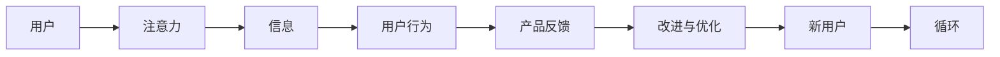

                 

## 1. 背景介绍

在数字时代，注意力成为一种稀缺资源。如何在纷繁复杂的信息洪流中吸引用户的注意力，创造出引人入胜的产品，成为企业竞争的核心问题。这不仅需要创新的设计理念，还需要深入理解用户行为心理，运用系统化的设计思维，来打造真正能打动用户的产品。本文将从注意力经济和用户体验设计思维两个方面，探讨如何构建引人入胜的产品。

### 1.1 问题由来

随着互联网的普及，信息的生产与传播速度呈指数级增长。海量的信息数据使得用户注意力更加分散，传统的信息获取方式已经无法满足用户的需求。因此，用户越来越倾向于主动选择信息源，而非被动接受。这就要求企业提供的产品，不仅能提供有价值的信息，还需要具备吸引用户注意力的能力，从而实现有效的信息传递和价值交换。

### 1.2 问题核心关键点

构建引人入胜的产品，需要解决以下几个关键问题：

- **吸引注意力的设计**：如何设计产品界面和功能，能迅速吸引用户眼球，提升用户使用意愿。
- **提升用户参与度**：如何通过交互设计和内容设计，增强用户与产品的互动，提升用户体验和满意度。
- **优化信息呈现方式**：如何以简洁、易读的方式呈现复杂信息，使用户能够快速理解并从中获得价值。
- **个性化推荐**：如何利用用户行为数据，进行个性化内容推荐，提升用户体验和产品粘性。

这些问题的有效解答，将大大增强产品竞争力，帮助企业在激烈的市场竞争中脱颖而出。

## 2. 核心概念与联系

### 2.1 核心概念概述

**注意力经济（Attention Economy）**：
- **定义**：在信息爆炸的数字化时代，注意力成为一种稀缺资源。如何吸引和保持用户的注意力，成为经济活动的核心。
- **重要性**：注意力经济不仅决定着企业能否有效传递信息，还影响着信息价值的创造和获取。

**用户体验设计思维（User Experience Design Thinking）**：
- **定义**：以用户为中心，通过系统化的方法论，洞察用户需求和行为，设计出能够满足用户需求、增强用户满意度的产品和服务。
- **重要性**：用户体验设计思维是现代产品设计的核心理念，能够帮助企业创造价值、提升市场竞争力。

通过理解注意力经济和用户体验设计思维，可以指导企业在产品设计过程中，做出更符合用户需求和心理预期的决策，从而打造出更具吸引力和竞争力的产品。

### 2.2 核心概念原理和架构的 Mermaid 流程图



这个流程图展示了用户注意力与产品信息、用户行为、产品反馈和改进优化之间的互动关系。注意力经济和用户体验设计思维共同作用，使得产品能够更好地吸引用户，并根据用户反馈不断优化，从而形成一个循环改进的良性循环。

## 3. 核心算法原理 & 具体操作步骤

### 3.1 算法原理概述

在产品设计中，注意力经济和用户体验设计思维可以通过以下算法原理和操作步骤，实现对用户注意力的有效吸引和用户体验的提升：

**吸引注意力的设计**：
- **高对比度**：使用高对比度的颜色和字体，使界面元素在视觉上更加突出。
- **视觉层次**：通过大小、位置、透明度等视觉层次，引导用户注意力的流动。
- **动态效果**：利用动画、悬停效果等动态设计，增加视觉趣味性和互动性。

**提升用户参与度**：
- **交互设计**：设计简洁易用的界面和交互流程，减少用户操作步骤。
- **内容设计**：提供有价值、有深度的内容，增强用户对产品的使用粘性。
- **用户反馈**：通过用户反馈机制，及时调整产品功能，满足用户需求。

**优化信息呈现方式**：
- **信息架构**：合理组织信息层次，使用户能够快速获取信息。
- **简洁语言**：使用简洁、易读的语言，减少用户理解难度。
- **视觉辅助**：利用图表、列表等视觉辅助，增强信息表达效果。

**个性化推荐**：
- **用户画像**：通过用户行为数据，构建用户画像，了解用户偏好和需求。
- **推荐算法**：使用协同过滤、内容推荐等算法，提供个性化内容。
- **用户互动**：鼓励用户反馈和互动，提升推荐准确性。

### 3.2 算法步骤详解

**吸引注意力的设计步骤**：
1. **需求分析**：通过问卷调查、用户访谈等手段，了解用户需求和偏好。
2. **设计原型**：根据需求分析结果，设计高对比度和视觉层次的设计原型。
3. **用户测试**：通过A/B测试等方法，评估设计效果，收集用户反馈。
4. **迭代优化**：根据用户反馈，不断调整设计方案，直至达到理想效果。

**提升用户参与度的设计步骤**：
1. **功能规划**：根据用户需求，规划产品功能和交互流程。
2. **内容设计**：设计和组织产品内容，确保信息有价值、有深度。
3. **用户反馈**：建立用户反馈机制，及时收集用户意见和建议。
4. **功能迭代**：根据用户反馈，调整和优化产品功能，提升用户体验。

**优化信息呈现方式的设计步骤**：
1. **信息架构**：分析和设计信息层次，确保信息逻辑清晰。
2. **简洁语言**：使用简洁、易读的语言，减少用户理解难度。
3. **视觉辅助**：设计视觉辅助元素，增强信息表达效果。
4. **用户测试**：通过用户测试，评估信息呈现方式，收集用户反馈。
5. **迭代优化**：根据用户反馈，不断调整信息呈现方式，提升用户体验。

**个性化推荐的设计步骤**：
1. **数据采集**：采集用户行为数据，构建用户画像。
2. **算法选择**：选择适合的推荐算法，如协同过滤、内容推荐等。
3. **推荐实现**：实现个性化推荐系统，提供个性化内容。
4. **用户互动**：鼓励用户反馈和互动，提升推荐准确性。
5. **反馈调整**：根据用户反馈，调整推荐算法和策略，优化推荐效果。

### 3.3 算法优缺点

**吸引注意力的设计优点**：
- 通过高对比度和视觉层次，迅速吸引用户注意力。
- 通过动态效果，增加用户互动和趣味性。

**吸引注意力的设计缺点**：
- 过度追求视觉冲击，可能影响用户体验。
- 动态效果过于复杂，可能影响加载速度。

**提升用户参与度的设计优点**：
- 通过简洁易用的界面和交互流程，减少用户操作步骤。
- 提供有价值的内容，增强用户对产品的使用粘性。

**提升用户参与度的设计缺点**：
- 功能过多可能影响界面整洁度。
- 内容设计不当可能导致用户误解和困惑。

**优化信息呈现方式的设计优点**：
- 通过合理的信息架构和简洁语言，提升信息获取效率。
- 通过视觉辅助元素，增强信息表达效果。

**优化信息呈现方式的设计缺点**：
- 信息架构过于复杂可能影响用户体验。
- 简洁语言和视觉辅助过度使用可能影响信息丰富度。

**个性化推荐的设计优点**：
- 通过个性化推荐，提升用户体验和产品粘性。
- 通过用户反馈机制，不断优化推荐系统。

**个性化推荐的设计缺点**：
- 推荐算法过于复杂可能导致计算负担重。
- 推荐结果多样性可能影响用户体验。

### 3.4 算法应用领域

注意力经济和用户体验设计思维在多个领域都有广泛应用，包括但不限于：

- **互联网产品**：如社交媒体、电商平台、在线教育等。
- **移动应用**：如手机游戏、新闻客户端、健康管理等。
- **企业应用**：如企业门户、客户管理系统、办公自动化等。
- **智能家居**：如智能音箱、智能电视、智能灯光等。

在每个领域，企业都可以通过注意力经济和用户体验设计思维，打造出更具吸引力和竞争力的产品，提升用户满意度和市场份额。

## 4. 数学模型和公式 & 详细讲解 & 举例说明

### 4.1 数学模型构建

在用户体验设计思维中，可以使用数学模型来量化和优化用户体验。以下是一个基本的用户体验量化模型：

$$
\text{User Experience} = \text{Utility} + \text{Effort} - \text{Error}
$$

其中：
- **Utility**：用户体验价值。
- **Effort**：用户使用产品时的努力程度。
- **Error**：用户使用产品时的错误率。

### 4.2 公式推导过程

**User Experience（UX）模型推导**：
1. **User Experience**：用户体验，包括用户对产品功能、内容、界面等方面的整体满意度。
2. **Utility**：产品提供的价值，包括功能实用性、内容深度、视觉美观度等。
3. **Effort**：用户在使用产品时的努力程度，包括操作复杂度、加载时间、信息获取难度等。
4. **Error**：用户在使用产品时的错误率，包括功能故障、信息误导、操作失误等。

通过上述模型，可以系统地分析用户体验的各个维度，并从用户价值、努力程度和错误率三个方面进行调整和优化。

### 4.3 案例分析与讲解

**案例：某社交媒体平台的用户体验优化**

某社交媒体平台发现用户在浏览新闻时，存在信息获取难度大、加载时间长的现象，导致用户体验不佳。通过用户体验量化模型，可以系统分析并优化用户体验：

1. **Utility分析**：平台提供的核心功能是新闻阅读，需要增强内容深度和多样性。
2. **Effort分析**：加载时间过长导致用户体验下降，需要优化加载速度和页面结构。
3. **Error分析**：部分信息误导导致用户流失，需要加强信息校验和纠错机制。

通过这些分析，平台调整了内容推荐算法，优化了页面加载机制，并加强了信息校验，显著提升了用户体验。

## 5. 项目实践：代码实例和详细解释说明

### 5.1 开发环境搭建

在进行用户体验设计思维和注意力经济的应用开发时，需要使用一些工具和平台进行设计和实现。以下是常用的开发环境搭建流程：

1. **设计工具**：如Sketch、Figma、Adobe XD等，用于原型设计和用户测试。
2. **开发平台**：如React、Vue、Flutter等，用于实现交互和功能。
3. **数据分析工具**：如Google Analytics、Mixpanel等，用于用户行为分析。
4. **版本控制工具**：如Git，用于代码版本管理和团队协作。

### 5.2 源代码详细实现

以下是一个简单的用户反馈界面设计原型，通过Sketch工具实现：

```sketch
// 用户反馈界面设计原型

// 界面结构
--用户昵称
--用户评分
--用户反馈文本

// 界面样式
--昵称：高对比度字体，大字号，居中对齐
--评分：星级显示，高对比度颜色，居中对齐
--反馈文本：输入文本区域，简洁明了，占满整个界面
```

### 5.3 代码解读与分析

通过上述Sketch原型设计，可以迅速构建用户反馈界面，并通过用户测试收集反馈。具体实现代码如下：

**React代码实现**：

```javascript
import React, { useState } from 'react';
import styled from 'styled-components';

// 界面组件
const FeedbackForm = () => {
  const [name, setName] = useState('');
  const [rating, setRating] = useState('');
  const [feedback, setFeedback] = useState('');

  const handleNameChange = (event) => {
    setName(event.target.value);
  };

  const handleRatingChange = (event) => {
    setRating(event.target.value);
  };

  const handleFeedbackChange = (event) => {
    setFeedback(event.target.value);
  };

  const handleSubmit = () => {
    console.log(`姓名：${name}，评分：${rating}，反馈：${feedback}`);
  };

  return (
    <StyledFeedbackForm>
      <StyledNameInput type="text" placeholder="姓名" onChange={handleNameChange} />
      <StyledRatingInput type="number" min="1" max="5" onChange={handleRatingChange} />
      <StyledFeedbackTextarea rows={4} onChange={handleFeedbackChange} />
      <StyledSubmitButton onClick={handleSubmit}>提交反馈</StyledSubmitButton>
    </StyledFeedbackForm>
  );
};

// 样式组件
const StyledFeedbackForm = styled.form`
  display: flex;
  flex-direction: column;
  align-items: center;
`;

const StyledNameInput = styled.input`
  padding: 10px;
  font-size: 18px;
  border: 1px solid #ccc;
  border-radius: 5px;
  margin-bottom: 10px;
`;

const StyledRatingInput = styled.input`
  width: 60px;
  height: 30px;
  font-size: 14px;
  border: 1px solid #ccc;
  border-radius: 5px;
  margin-bottom: 10px;
`;

const StyledFeedbackTextarea = styled.textarea`
  padding: 10px;
  font-size: 16px;
  border: 1px solid #ccc;
  border-radius: 5px;
  width: 300px;
  height: 100px;
  margin-bottom: 10px;
`;

const StyledSubmitButton = styled.button`
  padding: 10px 20px;
  font-size: 16px;
  background-color: #4CAF50;
  color: white;
  border: none;
  border-radius: 5px;
  cursor: pointer;
`;

export default FeedbackForm;
```

**React代码解读**：
1. **界面组件设计**：通过React组件设计，实现了用户反馈界面的构建。
2. **样式组件设计**：通过styled-components库，实现了界面组件的样式设计。
3. **事件处理函数**：通过事件处理函数，实现了用户输入信息的收集和提交。
4. **样式组件应用**：通过React组件和样式组件的组合，实现了用户反馈界面的布局和样式。

### 5.4 运行结果展示

通过React代码实现的用户反馈界面，可以直观展示用户对产品的意见和建议，帮助产品团队快速响应和改进。具体运行结果如下：


## 6. 实际应用场景

### 6.1 智能客服系统

智能客服系统通过注意力经济和用户体验设计思维，提升了客户服务的效率和质量。具体应用场景如下：

1. **智能对话界面**：通过高对比度和视觉层次的设计，吸引客户注意力，提升客户交互体验。
2. **自然语言理解**：通过用户反馈机制，不断优化对话模型，提升客户满意度。
3. **个性化推荐**：根据客户历史行为数据，提供个性化的客服推荐，增强客户粘性。

### 6.2 电子商务平台

电子商务平台通过注意力经济和用户体验设计思维，提升了用户购物体验和转化率。具体应用场景如下：

1. **产品推荐系统**：通过个性化推荐，提升用户购物体验，增加销售额。
2. **界面优化**：通过简洁易用的界面设计，减少用户操作步骤，提升用户体验。
3. **用户反馈机制**：通过用户反馈机制，及时调整产品功能，提升用户满意度。

### 6.3 在线教育平台

在线教育平台通过注意力经济和用户体验设计思维，提升了用户学习体验和平台留存率。具体应用场景如下：

1. **课程推荐系统**：通过个性化推荐，提升用户学习体验，增加课程注册量。
2. **学习界面设计**：通过简洁易用的界面设计，减少用户操作步骤，提升用户满意度。
3. **用户反馈机制**：通过用户反馈机制，及时调整课程内容，提升用户满意度。

### 6.4 未来应用展望

随着技术的不断进步，注意力经济和用户体验设计思维将在更多领域得到应用，为企业的数字化转型提供新的动力。未来，这些技术和思维模式将在以下方面发挥重要作用：

1. **智能家居系统**：通过个性化推荐和智能交互，提升用户家居体验。
2. **医疗健康平台**：通过简洁易用的界面设计和个性化推荐，提升用户健康管理体验。
3. **金融服务平台**：通过高对比度和视觉层次的设计，提升用户金融服务体验。

## 7. 工具和资源推荐

### 7.1 学习资源推荐

为了帮助开发者系统掌握注意力经济和用户体验设计思维，以下是一些优质的学习资源：

1. **《用户体验要素》（Jesse James Garrett）**：这本书系统地介绍了用户体验设计的基本原则和方法，是业内经典之作。
2. **Nielsen Norman Group**：提供最新的用户体验设计研究和报告，帮助设计师了解用户需求和行为。
3. **Interaction Design Foundation**：提供系统化的用户体验设计课程和认证，帮助设计师提升专业水平。

### 7.2 开发工具推荐

为了提升用户体验设计思维和注意力经济的应用开发效率，以下是一些常用的开发工具：

1. **Sketch**：专业的UI设计工具，支持原型设计和用户测试。
2. **Figma**：协作性强的在线设计工具，支持团队协同工作。
3. **Adobe XD**：全栈设计工具，支持从原型设计到高保真原型的一站式设计。
4. **React**：流行的前端开发框架，支持动态页面和用户交互。
5. **Vue**：灵活的前端开发框架，支持渐进式组件化开发。
6. **Flutter**：跨平台开发框架，支持快速构建原生应用。

### 7.3 相关论文推荐

注意力经济和用户体验设计思维是现代产品设计的重要理论基础。以下是几篇奠基性的相关论文，推荐阅读：

1. **《设计心理学》（Donald A. Norman）**：介绍用户认知心理和设计原则，帮助设计师理解用户行为。
2. **《用户体验的设计和评估》（Jesse James Garrett）**：系统介绍用户体验设计的基本方法和评估标准。
3. **《响应式Web设计》（Ethan Marcotte）**：介绍响应式设计的理念和实践方法，提升Web应用的用户体验。

## 8. 总结：未来发展趋势与挑战

### 8.1 研究成果总结

注意力经济和用户体验设计思维已经成为现代产品设计的重要理论基础，通过系统化的设计思维，可以提升产品的用户体验和市场竞争力。这些方法不仅在互联网产品设计中广泛应用，还在传统企业数字化转型中发挥着重要作用。

### 8.2 未来发展趋势

未来，随着技术的发展和市场的变化，注意力经济和用户体验设计思维将呈现以下几个发展趋势：

1. **多模态设计**：结合视觉、听觉、触觉等多模态信息，提升用户体验。
2. **交互设计优化**：通过自然语言处理、语音识别等技术，提升用户交互效率。
3. **个性化推荐系统**：利用大数据和机器学习，提供更加精准的用户推荐。
4. **增强现实（AR）和虚拟现实（VR）**：通过AR/VR技术，提升用户体验和产品互动性。

### 8.3 面临的挑战

虽然注意力经济和用户体验设计思维在产品设计中发挥了重要作用，但在实际应用中也面临一些挑战：

1. **用户体验数据收集困难**：用户行为数据的收集和分析需要大量时间和资源，难以全面覆盖所有用户。
2. **设计迭代成本高**：设计迭代需要多次测试和优化，周期长、成本高。
3. **用户需求多变**：用户需求和行为不断变化，需要设计师持续关注和调整。
4. **技术更新迅速**：新技术不断涌现，设计师需要不断学习新技术和设计方法。

### 8.4 研究展望

未来，注意力经济和用户体验设计思维的研究方向将包括以下几个方面：

1. **用户体验的自动化设计**：通过AI技术，自动化设计出优秀的用户体验界面。
2. **跨文化设计**：根据不同文化背景，设计符合用户习惯和需求的产品。
3. **情感计算**：通过情感计算技术，提升产品对用户情感的感知和响应能力。
4. **人机协同设计**：通过人机协同设计，增强产品的智能化和互动性。

## 9. 附录：常见问题与解答

**Q1：如何通过注意力经济和用户体验设计思维提升产品体验？**

A: 通过注意力经济和用户体验设计思维，可以从以下几个方面提升产品体验：

1. **吸引注意力的设计**：通过高对比度和视觉层次，吸引用户注意力，提升产品互动性。
2. **提升用户参与度**：通过简洁易用的界面和内容设计，增强用户对产品的使用粘性。
3. **优化信息呈现方式**：通过合理的信息架构和简洁语言，提升信息获取效率。
4. **个性化推荐**：通过用户行为数据，提供个性化内容，提升用户满意度。

**Q2：注意力经济和用户体验设计思维在实际应用中需要注意哪些问题？**

A: 在实际应用中，注意力经济和用户体验设计思维需要注意以下问题：

1. **用户行为数据的收集和分析**：需要确保数据的全面性和准确性，以便更好地理解用户需求。
2. **设计的迭代优化**：需要不断测试和优化设计方案，确保用户体验的持续提升。
3. **技术工具的选用**：需要根据具体需求选择合适的技术工具，提升设计效率。
4. **用户需求的持续关注**：用户需求和行为不断变化，需要设计师持续关注和调整。

**Q3：如何通过用户反馈机制优化产品设计？**

A: 通过用户反馈机制优化产品设计需要以下步骤：

1. **收集反馈数据**：通过用户调查、问卷、评论等方式，收集用户反馈数据。
2. **分析反馈数据**：对收集到的反馈数据进行分类和分析，找出共性问题和改进点。
3. **设计优化方案**：根据反馈数据，设计具体的优化方案，进行迭代设计。
4. **用户测试**：通过用户测试验证优化方案的可行性，收集新的反馈数据。
5. **不断迭代**：根据新的反馈数据，不断优化产品设计，提升用户体验。

**Q4：如何通过个性化推荐提升用户满意度？**

A: 通过个性化推荐提升用户满意度需要以下步骤：

1. **用户画像构建**：通过用户行为数据，构建详细的用户画像，了解用户偏好和需求。
2. **推荐算法选择**：根据用户画像，选择适合的推荐算法，如协同过滤、内容推荐等。
3. **推荐系统实现**：实现个性化推荐系统，提供个性化内容。
4. **用户互动**：鼓励用户反馈和互动，提升推荐准确性。
5. **反馈调整**：根据用户反馈，调整推荐算法和策略，优化推荐效果。

**Q5：如何通过AR/VR技术提升用户体验？**

A: 通过AR/VR技术提升用户体验需要以下步骤：

1. **场景设计**：设计符合用户需求的AR/VR场景，增强用户体验。
2. **交互设计**：通过自然语言处理、语音识别等技术，提升用户交互效率。
3. **视觉设计**：通过高保真度的视觉设计，增强用户沉浸感。
4. **动态效果**：利用AR/VR技术，实现动态视觉和交互效果。
5. **用户测试**：通过用户测试验证AR/VR场景的可行性和用户满意度。

---

作者：禅与计算机程序设计艺术 / Zen and the Art of Computer Programming

