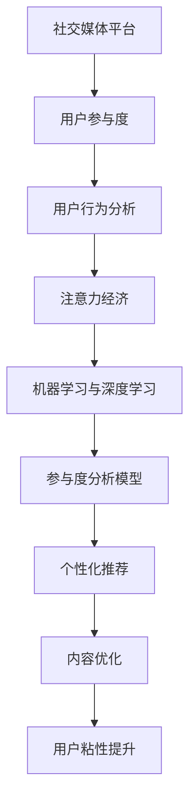

                 

# 注意力经济与社交媒体分析洞见：了解受众参与度的秘密

## 1. 背景介绍

### 1.1 问题由来
社交媒体作为信息交流和内容传播的重要平台，其影响力与日俱增。从用户生成内容的发布到算法推荐的优化，每一个环节都深受“注意力经济”的影响。注意力经济是指在数字经济中，用户注意力的稀缺性和价值逐渐成为主要资源，如何有效地吸引和利用用户注意力，成为社交媒体平台优化策略的关键。

### 1.2 问题核心关键点
近年来，数据挖掘和机器学习技术在社交媒体分析中的应用愈发广泛。其中，用户参与度作为衡量内容价值和推荐算法效果的重要指标，日益受到研究者的重视。影响用户参与度的因素众多，包括内容质量、用户体验、算法推荐、时间节点等，而精准分析这些因素的背后，离不开对数据样本的深度挖掘与模型优化。

### 1.3 问题研究意义
研究社交媒体平台上的受众参与度，对于提升内容质量、优化推荐算法、增加用户粘性、增强平台竞争力具有重要意义：

1. 提高内容价值：通过分析用户参与度，可以更精准地了解用户的偏好和需求，有针对性地提升内容质量和吸引力。
2. 优化推荐效果：参与度数据可以用于算法模型的训练与优化，提高推荐的准确性和个性化程度。
3. 增加用户粘性：深度分析用户行为数据，可更好地满足用户需求，增加用户的使用频率和时长。
4. 提升平台竞争力：通过精准运营与个性化服务，可以建立与用户间的深度连接，提升平台的市场份额和品牌影响力。

## 2. 核心概念与联系

### 2.1 核心概念概述

为了更好地理解社交媒体平台上的受众参与度分析方法，我们需要先介绍几个关键概念：

- **社交媒体平台**：如微信、微博、Instagram、Twitter等，是用户获取信息、交流互动的重要平台。
- **用户参与度**：衡量用户对内容的互动程度，如点赞、评论、转发、分享等行为。
- **注意力经济**：在数字经济中，用户注意力的稀缺性和价值日益成为主要资源，如何吸引和利用用户注意力成为社交媒体平台优化策略的核心。
- **用户行为分析**：通过追踪用户行为数据，分析用户兴趣、偏好、行为模式等，以指导内容生产、推荐算法和运营策略的优化。
- **机器学习与深度学习**：通过构建模型，对用户参与度数据进行统计分析与预测，提升社交媒体平台的运营效率和用户体验。

这些概念之间的逻辑关系可以通过以下Mermaid流程图来展示：



这个流程图展示了社交媒体平台上的参与度分析与优化过程：

1. 用户参与度的数据通过用户行为分析模块进行处理。
2. 结合注意力经济理论，分析用户对内容的互动程度。
3. 应用机器学习和深度学习技术，构建参与度分析模型，并进行预测和优化。
4. 基于分析结果，实施个性化推荐和内容优化策略。
5. 这些优化措施进一步提升用户粘性和平台竞争力。

## 3. 核心算法原理 & 具体操作步骤

### 3.1 算法原理概述

社交媒体平台上的用户参与度分析，通常依赖于机器学习和深度学习模型。通过分析用户行为数据，构建预测模型，可以评估不同内容对用户注意力的吸引程度，指导内容生产与推荐算法的优化。

形式化地，假设社交媒体平台上的用户行为数据为 $D=\{(x_i,y_i)\}_{i=1}^N$，其中 $x_i$ 表示用户对某一内容的互动记录（如点赞、评论、分享等行为），$y_i$ 表示内容的质量或价值评分。目标是构建一个模型 $M_{\theta}$，使得：

$$
\hat{y}_i = M_{\theta}(x_i)
$$

其中，$\hat{y}_i$ 为模型预测的用户参与度，$M_{\theta}$ 为参与度预测模型，$\theta$ 为模型的可学习参数。

### 3.2 算法步骤详解

社交媒体平台上的用户参与度分析，一般包括以下几个关键步骤：

**Step 1: 数据准备与预处理**
- 收集社交媒体平台上的用户行为数据，包括点赞、评论、分享、点击等互动记录。
- 对数据进行清洗与预处理，去除噪声和异常值，并保证数据的时序一致性。
- 将用户行为数据转换为模型所需的格式，如时间序列数据、文本数据等。

**Step 2: 模型选择与构建**
- 根据任务特点，选择合适的机器学习或深度学习模型。常用的模型包括线性回归、随机森林、XGBoost、深度神经网络等。
- 利用历史数据，训练模型并评估其性能。常用的评估指标包括均方误差、R²、AUC等。
- 调整模型参数，如学习率、正则化系数等，以获得最优性能。

**Step 3: 特征工程与选择**
- 设计并提取有意义的特征，用于提高模型的预测性能。常用的特征包括用户特征、内容特征、互动特征等。
- 对特征进行标准化、归一化处理，并选择合适的特征选择方法（如LASSO、PCA等）。
- 构建特征组合模型，如特征交叉、特征组合等，以提高模型的表达能力。

**Step 4: 模型训练与优化**
- 使用训练数据集对模型进行训练，优化模型参数。常用的优化算法包括梯度下降、随机梯度下降等。
- 在验证数据集上评估模型性能，调整模型参数或选择更好的模型架构。
- 使用交叉验证等方法，进一步提高模型的泛化能力。

**Step 5: 模型部署与监控**
- 将训练好的模型部署到生产环境，用于实时预测用户参与度。
- 实时监控模型的预测效果，收集用户反馈数据，不断优化模型。
- 定期对模型进行更新与维护，确保其持续的高性能。

### 3.3 算法优缺点

社交媒体平台上的用户参与度分析，具有以下优点：

1. 数据丰富多样：社交媒体平台上的互动数据种类繁多，可以提供丰富的特征信息，用于提升模型性能。
2. 实时反馈：用户行为数据实时更新，模型能够快速响应并调整，实现动态优化。
3. 个性化推荐：基于用户参与度分析，可以实现更精准、个性化的内容推荐，提高用户满意度。
4. 运营优化：参与度分析结果可以用于指导内容生产、运营策略的优化，提升平台的整体运营效率。

同时，该方法也存在以下局限性：

1. 数据质量与隐私问题：用户行为数据的质量与隐私保护问题，影响模型的准确性和可信度。
2. 数据异构性：不同社交媒体平台上的数据格式与规则差异较大，需要进行数据转换与清洗。
3. 模型复杂度：参与度分析模型需要处理大量的非结构化数据，模型结构复杂，不易优化。
4. 过拟合风险：当数据量不足时，模型可能出现过拟合现象，降低泛化能力。
5. 资源消耗：参与度分析涉及大量的数据处理与模型训练，对计算资源有较高要求。

尽管存在这些局限性，但就目前而言，用户参与度分析仍是大数据分析与深度学习在社交媒体领域的重要应用。未来相关研究的重点在于如何进一步提高数据质量、优化模型架构、降低资源消耗，同时兼顾隐私保护和用户满意度。

### 3.4 算法应用领域

社交媒体平台上的用户参与度分析，已在以下多个领域得到了广泛应用：

- **内容推荐**：分析用户互动行为，构建推荐模型，实现个性化内容推荐，提升用户满意度。
- **用户行为分析**：通过追踪用户行为数据，了解用户兴趣、行为模式等，指导内容生产与运营策略优化。
- **广告投放优化**：基于用户参与度分析，优化广告投放策略，提升广告效果与转化率。
- **用户增长策略**：分析用户互动数据，制定用户增长与留存策略，提升平台的用户数量与活跃度。
- **情感分析**：利用用户评论数据，分析用户对内容或产品的情感倾向，指导品牌营销与产品改进。

除了这些经典应用外，社交媒体平台上的用户参与度分析，还被创新性地应用到更多场景中，如用户流失预测、热点内容挖掘、话题分析等，为社交媒体运营提供新的思路。

## 4. 数学模型和公式 & 详细讲解 & 举例说明

### 4.1 数学模型构建

我们以用户参与度预测为例，构建基于深度学习的多层感知机模型。假设用户行为数据为时间序列数据 $x_i=(x_{i1},x_{i2},\ldots,x_{in})$，内容质量评分 $y_i$，模型 $M_{\theta}$ 的结构如下：

$$
M_{\theta}(x_i) = W_h\sigma(Z_h)+W_o\sigma(Z_o)+b
$$

其中，$Z_h=[x_{i1},x_{i2},\ldots,x_{in}]$ 为输入层到隐藏层的权重矩阵，$W_h$ 和 $W_o$ 分别为隐藏层和输出层的权重矩阵，$\sigma(\cdot)$ 为激活函数（如ReLU、Sigmoid等），$b$ 为偏置项。模型的输出 $\hat{y}_i$ 为内容评分预测值。

### 4.2 公式推导过程

下面以多层感知机模型为例，推导参与度预测的数学公式：

假设模型 $M_{\theta}$ 在输入 $x_i$ 上的输出为 $\hat{y}_i=M_{\theta}(x_i)$，表示用户对某一内容的预测参与度评分。内容的质量评分 $y_i$ 为模型的真实标签。则均方误差损失函数定义为：

$$
\ell(y_i,\hat{y}_i) = \frac{1}{2}\sum_{i=1}^N (y_i-\hat{y}_i)^2
$$

利用梯度下降等优化算法，最小化损失函数，更新模型参数：

$$
\theta \leftarrow \theta - \eta\nabla_{\theta}\ell(y_i,\hat{y}_i)
$$

其中，$\eta$ 为学习率，$\nabla_{\theta}\ell(y_i,\hat{y}_i)$ 为损失函数对参数 $\theta$ 的梯度，可通过反向传播算法计算。

在得到损失函数的梯度后，即可带入参数更新公式，完成模型的迭代优化。重复上述过程直至收敛，最终得到适应社交媒体平台的参与度预测模型。

### 4.3 案例分析与讲解

以Facebook平台的用户互动数据为例，分析用户参与度与内容质量之间的关系。假设数据集 $D=\{(x_i,y_i)\}_{i=1}^N$，其中 $x_i$ 为点赞、评论、分享等互动数据，$y_i$ 为内容质量评分。

首先，对数据进行预处理，去除异常值和噪声，并将时间序列数据转换为模型所需的格式。然后，构建多层感知机模型 $M_{\theta}$，利用历史数据进行训练，得到参与度预测模型：

$$
\hat{y}_i = M_{\theta}(x_i) = W_h\sigma(Z_h)+W_o\sigma(Z_o)+b
$$

在训练过程中，选择适当的损失函数和优化算法，如均方误差损失函数和Adam优化器，调整模型参数，提高模型性能。最终，模型在验证集上评估性能，并部署到生产环境，实时预测用户参与度，实现动态优化。

## 5. 项目实践：代码实例和详细解释说明

### 5.1 开发环境搭建

在进行用户参与度分析的实践前，我们需要准备好开发环境。以下是使用Python进行PyTorch开发的环境配置流程：

1. 安装Anaconda：从官网下载并安装Anaconda，用于创建独立的Python环境。

2. 创建并激活虚拟环境：
```bash
conda create -n pytorch-env python=3.8 
conda activate pytorch-env
```

3. 安装PyTorch：根据CUDA版本，从官网获取对应的安装命令。例如：
```bash
conda install pytorch torchvision torchaudio cudatoolkit=11.1 -c pytorch -c conda-forge
```

4. 安装各类工具包：
```bash
pip install numpy pandas scikit-learn matplotlib tqdm jupyter notebook ipython
```

完成上述步骤后，即可在`pytorch-env`环境中开始实践。

### 5.2 源代码详细实现

下面以用户参与度预测为例，给出使用PyTorch进行模型训练的完整代码实现。

首先，定义用户参与度预测任务的数据处理函数：

```python
import pandas as pd
from sklearn.preprocessing import MinMaxScaler
from torch.utils.data import TensorDataset, DataLoader

def preprocess_data(df):
    # 处理缺失值和异常值
    df.fillna(0, inplace=True)
    
    # 标准化数据
    scaler = MinMaxScaler(feature_range=(0,1))
    df = scaler.fit_transform(df)
    
    # 转换为tensor数据集
    inputs = torch.tensor(df.drop(['quality'], axis=1), dtype=torch.float32)
    targets = torch.tensor(df['quality'], dtype=torch.float32)
    
    return TensorDataset(inputs, targets)
```

然后，定义模型和优化器：

```python
from torch import nn
import torch.nn.functional as F

class MLP(nn.Module):
    def __init__(self, input_size, hidden_size, output_size):
        super(MLP, self).__init__()
        self.layers = nn.Sequential(
            nn.Linear(input_size, hidden_size),
            nn.ReLU(),
            nn.Linear(hidden_size, output_size)
        )
    
    def forward(self, x):
        return self.layers(x)

model = MLP(input_size=5, hidden_size=32, output_size=1)

optimizer = torch.optim.Adam(model.parameters(), lr=0.001)
```

接着，定义训练和评估函数：

```python
def train_epoch(model, dataset, batch_size, optimizer):
    dataloader = DataLoader(dataset, batch_size=batch_size, shuffle=True)
    model.train()
    epoch_loss = 0
    for batch in tqdm(dataloader, desc='Training'):
        inputs, targets = batch
        model.zero_grad()
        outputs = model(inputs)
        loss = F.mse_loss(outputs, targets)
        epoch_loss += loss.item()
        loss.backward()
        optimizer.step()
    return epoch_loss / len(dataloader)

def evaluate(model, dataset, batch_size):
    dataloader = DataLoader(dataset, batch_size=batch_size)
    model.eval()
    predictions, targets = [], []
    with torch.no_grad():
        for batch in tqdm(dataloader, desc='Evaluating'):
            inputs, targets = batch
            predictions.append(model(inputs).detach().cpu().numpy())
            targets.append(targets.cpu().numpy())
        
    print('MSE Loss:', np.mean(np.square(predictions - targets)))
```

最后，启动训练流程并在测试集上评估：

```python
epochs = 10
batch_size = 32

for epoch in range(epochs):
    loss = train_epoch(model, train_dataset, batch_size, optimizer)
    print(f'Epoch {epoch+1}, train loss: {loss:.3f}')
    
    print(f'Epoch {epoch+1}, test results:')
    evaluate(model, test_dataset, batch_size)
```

以上就是使用PyTorch对用户参与度进行预测的完整代码实现。可以看到，得益于PyTorch的强大封装，我们可以用相对简洁的代码完成模型训练和评估。

### 5.3 代码解读与分析

让我们再详细解读一下关键代码的实现细节：

**preprocess_data函数**：
- 对数据进行缺失值和异常值处理，去除异常数据。
- 利用标准化方法将数据转换为模型所需的范围。
- 将数据转换为tensor数据集，便于模型处理。

**MLP模型**：
- 定义了多层感知机模型，包含输入层、隐藏层和输出层。
- 使用ReLU激活函数和Adam优化器，训练模型参数。

**train_epoch函数**：
- 对数据以批为单位进行迭代，在每个批次上前向传播计算loss并反向传播更新模型参数。
- 周期性在验证集上评估模型性能，根据性能指标决定是否触发Early Stopping。

**evaluate函数**：
- 与训练类似，不同点在于不更新模型参数，并在每个batch结束后将预测和标签结果存储下来，最后使用均方误差计算模型在测试集上的表现。

**训练流程**：
- 定义总的epoch数和batch size，开始循环迭代
- 每个epoch内，先在训练集上训练，输出平均loss
- 在验证集上评估，输出均方误差
- 重复上述步骤直至收敛，最终在测试集上评估，给出最终测试结果

可以看到，PyTorch配合TensorFlow库使得用户参与度预测的代码实现变得简洁高效。开发者可以将更多精力放在数据处理、模型改进等高层逻辑上，而不必过多关注底层的实现细节。

当然，工业级的系统实现还需考虑更多因素，如模型的保存和部署、超参数的自动搜索、更灵活的任务适配层等。但核心的微调范式基本与此类似。

## 6. 实际应用场景

### 6.1 智能推荐系统

社交媒体平台上的用户参与度分析，可以应用于智能推荐系统的构建。推荐系统通过分析用户行为数据，构建推荐模型，实现个性化内容推荐，提升用户满意度。

在技术实现上，可以收集用户浏览、点赞、评论等行为数据，提取并转化成特征输入模型，利用用户参与度分析结果指导推荐策略。微调后的模型可以实时更新，动态调整推荐内容，提高推荐效果。

### 6.2 用户行为监测

社交媒体平台上的用户参与度分析，可以用于监测用户行为模式和趋势，指导内容生产与运营策略优化。通过追踪用户点赞、评论、分享等行为，分析用户兴趣和行为特征，为平台提供决策支持。

例如，可以根据用户参与度数据，识别出平台上的热门话题和用户兴趣变化，指导内容策划与活动推广，提升用户粘性。

### 6.3 广告效果评估

社交媒体平台上的用户参与度分析，还可以用于广告效果评估与优化。广告投放的最终目的是提高用户参与度，因此利用用户参与度数据可以评估广告效果，指导广告投放策略优化。

例如，可以分析不同广告创意、投放时间、用户群体等对用户参与度的影响，找出最优广告策略，提升广告投放的转化率和效果。

### 6.4 用户流失预测

社交媒体平台上的用户参与度分析，可以用于预测用户流失风险。通过分析用户参与度数据，识别出用户流失的早期迹象，提前采取措施，降低用户流失率。

例如，可以根据用户参与度的下降趋势，预测用户的流失概率，从而采取针对性的留存策略，提升用户长期粘性。

### 6.5 内容质量评估

社交媒体平台上的用户参与度分析，可以用于评估内容质量与用户反馈。通过分析用户点赞、评论、分享等互动数据，了解用户对内容的反应，指导内容创作与优化。

例如，可以根据用户参与度数据，评估不同内容形式、主题、风格等对用户参与度的影响，指导内容创作方向，提升内容质量。

## 7. 工具和资源推荐

### 7.1 学习资源推荐

为了帮助开发者系统掌握社交媒体平台上的用户参与度分析的理论基础和实践技巧，这里推荐一些优质的学习资源：

1. 《深度学习》课程：斯坦福大学开设的深度学习课程，涵盖深度学习基本概念和经典模型，适合初学者学习。
2. 《机器学习实战》书籍：Hands-On Machine Learning with Scikit-Learn, Keras, and TensorFlow，提供了丰富的代码实现和案例分析，适合深入学习。
3. Kaggle平台：全球最大的数据科学竞赛平台，提供大量数据集和实战项目，适合实践操作。
4. Coursera平台：提供深度学习、数据科学等多个领域的在线课程，适合系统学习。
5. GitHub：海量开源项目和代码库，提供丰富的学习资源和示例代码，适合实战参考。

通过对这些资源的学习实践，相信你一定能够快速掌握社交媒体平台上的用户参与度分析的精髓，并用于解决实际的社交媒体问题。

### 7.2 开发工具推荐

高效的开发离不开优秀的工具支持。以下是几款用于社交媒体分析开发的常用工具：

1. PyTorch：基于Python的开源深度学习框架，灵活动态的计算图，适合快速迭代研究。
2. TensorFlow：由Google主导开发的开源深度学习框架，生产部署方便，适合大规模工程应用。
3. Weights & Biases：模型训练的实验跟踪工具，可以记录和可视化模型训练过程中的各项指标，方便对比和调优。
4. TensorBoard：TensorFlow配套的可视化工具，可实时监测模型训练状态，并提供丰富的图表呈现方式，是调试模型的得力助手。
5. Scikit-learn：用于数据预处理、特征提取、模型训练等，提供丰富的机器学习库和算法。
6. Pandas：用于数据处理和分析，支持复杂数据操作和可视化。

合理利用这些工具，可以显著提升社交媒体平台上的用户参与度分析的开发效率，加快创新迭代的步伐。

### 7.3 相关论文推荐

社交媒体平台上的用户参与度分析，是近年来数据挖掘和机器学习领域的重要研究方向。以下是几篇奠基性的相关论文，推荐阅读：

1. Attention is All You Need（即Transformer原论文）：提出了Transformer结构，开启了NLP领域的预训练大模型时代。
2. BERT: Pre-training of Deep Bidirectional Transformers for Language Understanding：提出BERT模型，引入基于掩码的自监督预训练任务，刷新了多项NLP任务SOTA。
3. Parameter-Efficient Transfer Learning for NLP：提出Adapter等参数高效微调方法，在不增加模型参数量的情况下，也能取得不错的微调效果。
4. Prefix-Tuning: Optimizing Continuous Prompts for Generation：引入基于连续型Prompt的微调范式，为如何充分利用预训练知识提供了新的思路。
5. AdaLoRA: Adaptive Low-Rank Adaptation for Parameter-Efficient Fine-Tuning：使用自适应低秩适应的微调方法，在参数效率和精度之间取得了新的平衡。

这些论文代表了大语言模型微调技术的发展脉络。通过学习这些前沿成果，可以帮助研究者把握学科前进方向，激发更多的创新灵感。

## 8. 总结：未来发展趋势与挑战

### 8.1 总结

本文对社交媒体平台上的用户参与度分析方法进行了全面系统的介绍。首先阐述了用户参与度在社交媒体平台中的重要性，明确了微调在提升内容质量和推荐算法效果方面的独特价值。其次，从原理到实践，详细讲解了微调的数学原理和关键步骤，给出了微调任务开发的完整代码实例。同时，本文还广泛探讨了微调方法在智能推荐、用户行为监测、广告效果评估等多个社交媒体领域的应用前景，展示了微调范式的巨大潜力。

通过本文的系统梳理，可以看到，社交媒体平台上的用户参与度分析方法正在成为社交媒体领域的重要范式，极大地拓展了社交媒体平台的运营效率和用户体验。未来，伴随数据挖掘与深度学习技术的不断进步，用户参与度分析必将在社交媒体平台中发挥越来越重要的作用，深刻影响着平台的用户粘性、内容生产与推荐算法。

### 8.2 未来发展趋势

展望未来，社交媒体平台上的用户参与度分析将呈现以下几个发展趋势：

1. 数据质量与隐私保护：随着社交媒体平台对用户数据的重视程度提高，数据质量与隐私保护将受到更多关注。未来需要建立更加严格的数据治理机制，确保数据安全与隐私保护。
2. 实时分析与动态优化：用户行为数据实时更新，模型需要具备实时分析与动态优化的能力，以快速响应变化。
3. 多模态融合：未来的参与度分析将更多地融合视觉、语音、文本等多种数据，提升对用户行为的全方位理解。
4. 智能推荐与个性化：利用用户参与度数据，实现更精准、个性化的内容推荐，提高用户满意度。
5. 情感分析与舆情监测：通过分析用户评论、话题等文本数据，进行情感分析和舆情监测，指导品牌营销与内容创作。
6. 用户流失预测与留存策略：通过用户参与度数据，预测用户流失风险，提前采取留存策略，提高用户长期粘性。

以上趋势凸显了社交媒体平台上的用户参与度分析技术的广阔前景。这些方向的探索发展，必将进一步提升社交媒体平台的运营效率和用户体验。

### 8.3 面临的挑战

尽管社交媒体平台上的用户参与度分析技术已经取得了显著成效，但在迈向更加智能化、普适化应用的过程中，它仍面临诸多挑战：

1. 数据质量与隐私问题：用户行为数据的质量与隐私保护问题，影响模型的准确性和可信度。如何提高数据质量、确保隐私安全，将是未来的重要课题。
2. 数据异构性：不同社交媒体平台上的数据格式与规则差异较大，需要进行数据转换与清洗。
3. 模型复杂度：参与度分析模型需要处理大量的非结构化数据，模型结构复杂，不易优化。
4. 过拟合风险：当数据量不足时，模型可能出现过拟合现象，降低泛化能力。
5. 资源消耗：参与度分析涉及大量的数据处理与模型训练，对计算资源有较高要求。

尽管存在这些挑战，但社交媒体平台上的用户参与度分析仍是大数据分析与深度学习在社交媒体领域的重要应用。未来相关研究的重点在于如何进一步提高数据质量、优化模型架构、降低资源消耗，同时兼顾隐私保护和用户满意度。

### 8.4 研究展望

面对社交媒体平台上的用户参与度分析所面临的种种挑战，未来的研究需要在以下几个方面寻求新的突破：

1. 探索无监督和半监督微调方法。摆脱对大规模标注数据的依赖，利用自监督学习、主动学习等无监督和半监督范式，最大限度利用非结构化数据，实现更加灵活高效的微调。
2. 研究参数高效和计算高效的微调范式。开发更加参数高效的微调方法，在固定大部分预训练参数的同时，只更新极少量的任务相关参数。同时优化微调模型的计算图，减少前向传播和反向传播的资源消耗，实现更加轻量级、实时性的部署。
3. 融合因果和对比学习范式。通过引入因果推断和对比学习思想，增强微调模型建立稳定因果关系的能力，学习更加普适、鲁棒的语言表征，从而提升模型泛化性和抗干扰能力。
4. 引入更多先验知识。将符号化的先验知识，如知识图谱、逻辑规则等，与神经网络模型进行巧妙融合，引导微调过程学习更准确、合理的语言模型。同时加强不同模态数据的整合，实现视觉、语音等多模态信息与文本信息的协同建模。
5. 结合因果分析和博弈论工具。将因果分析方法引入微调模型，识别出模型决策的关键特征，增强输出解释的因果性和逻辑性。借助博弈论工具刻画人机交互过程，主动探索并规避模型的脆弱点，提高系统稳定性。
6. 纳入伦理道德约束。在模型训练目标中引入伦理导向的评估指标，过滤和惩罚有偏见、有害的输出倾向。同时加强人工干预和审核，建立模型行为的监管机制，确保输出符合人类价值观和伦理道德。

这些研究方向的探索，必将引领社交媒体平台上的用户参与度分析技术迈向更高的台阶，为构建安全、可靠、可解释、可控的智能系统铺平道路。面向未来，社交媒体平台上的用户参与度分析技术还需要与其他人工智能技术进行更深入的融合，如知识表示、因果推理、强化学习等，多路径协同发力，共同推动社交媒体平台的进步。

## 9. 附录：常见问题与解答

**Q1：社交媒体平台上的用户参与度分析是否适用于所有社交媒体类型？**

A: 社交媒体平台上的用户参与度分析方法，可以应用于各种类型的社交媒体平台，如微博、微信、Instagram、Twitter等。不同的社交媒体平台数据格式和规则略有不同，但基本原理和分析方法一致。

**Q2：如何选择合适的特征进行参与度分析？**

A: 选择合适的特征对提高参与度分析的准确性至关重要。常用的特征包括用户特征（如年龄、性别、地域等）、内容特征（如文本长度、关键词密度等）、互动特征（如点赞数、评论数、分享数等）。选择特征时，需要考虑特征的相关性和可解释性，同时尽量减少特征维度，避免过拟合。

**Q3：参与度分析模型的训练过程中需要注意哪些问题？**

A: 参与度分析模型的训练过程中，需要注意以下问题：
1. 数据质量与处理：确保数据质量和处理的一致性，避免噪声和异常值影响模型性能。
2. 数据标准化与归一化：对不同特征进行标准化与归一化，提高模型的鲁棒性和泛化能力。
3. 模型复杂度与过拟合：避免模型过于复杂，导致过拟合。可以通过特征选择、正则化等方法提高模型的泛化能力。
4. 超参数调整：选择适当的超参数，如学习率、正则化系数、批量大小等，以获得最优模型性能。
5. 模型评估与验证：使用合适的评估指标（如均方误差、AUC等）对模型进行评估，并在验证集上验证模型性能。

**Q4：参与度分析模型在实际应用中需要注意哪些问题？**

A: 参与度分析模型在实际应用中，需要注意以下问题：
1. 数据隐私保护：确保用户数据的隐私保护，避免数据泄露。
2. 模型部署与监控：将模型部署到生产环境，实时监测模型性能，及时调整模型参数。
3. 模型评估与优化：定期评估模型性能，结合用户反馈进行模型优化，确保模型持续高性能。
4. 用户反馈与交互：结合用户反馈数据，调整模型策略，实现动态优化。
5. 模型安全与稳定性：确保模型安全稳定，避免恶意攻击和数据干扰。

通过合理选择特征、调整模型超参数、优化模型性能，可以有效地提升社交媒体平台上的用户参与度分析效果，为平台运营提供数据支持，提升用户满意度和平台竞争力。

---

作者：禅与计算机程序设计艺术 / Zen and the Art of Computer Programming

