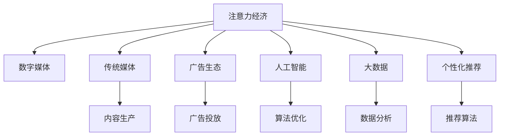
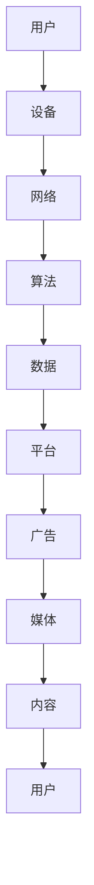

                 

# 注意力经济对传统媒体生存的挑战

> 关键词：注意力经济, 传统媒体, 数字媒体, 用户行为, 广告生态, 人工智能, 大数据, 个性化推荐

## 1. 背景介绍

在数字化时代，信息的海量涌现使得注意力成为稀缺资源，传统媒体面临着前所未有的生存挑战。数字化、网络化、智能化技术的广泛应用，深刻改变着人们获取和消费内容的方式，带来了注意力经济的崛起。

注意力经济是指在信息泛滥的现代社会，人们对于有限注意力的竞争，使得媒体内容的质量和个性化推荐的重要性空前提升。传统媒体在内容生产、分发、互动等方面，相较于新兴的数字媒体，明显滞后。广告主纷纷转向数字化平台，将注意力经济的重视度进一步提升。

与此同时，互联网媒体平台如百度、阿里、腾讯等，通过大数据和算法驱动，实时分析用户行为，精准推送个性化内容，吸引了大量的用户注意力，从而在竞争中逐渐占据优势。

这种趋势下，传统媒体需要从内容生产、技术应用、商业模式等多个维度进行创新，以适应数字化浪潮，保持竞争力。本文将从注意力经济的兴起背景、对传统媒体的挑战和应对策略等方面，展开探讨。

## 2. 核心概念与联系

### 2.1 核心概念概述

在理解注意力经济对传统媒体的挑战前，首先需要对以下几个核心概念有清晰的认识：

- **注意力经济 (Economy of Attention)**：在数字化时代，信息过载使得人们对于注意力的竞争激烈。用户更加倾向于选择对自己有价值、能提供优质体验的内容，媒体公司需要争夺用户的注意力以实现商业价值。

- **传统媒体 (Traditional Media)**：包括报纸、杂志、电视、广播等形式，以内容制作、发布、传播为核心业务。传统媒体长期以来依赖于大规模发行和广告收入。

- **数字媒体 (Digital Media)**：通过互联网技术传播和分发的媒体形式，如门户网站、社交平台、视频网站等。数字媒体高度依赖于算法驱动的个性化推荐系统。

- **广告生态 (Advertising Ecosystem)**：媒体平台通过广告收入实现盈利，而广告主则通过平台推广产品或服务。传统媒体与数字媒体在广告生态中的地位正在发生转变。

- **人工智能 (Artificial Intelligence)**：通过机器学习和深度学习算法，实现对用户行为和兴趣的预测，优化内容推荐和广告投放。

- **大数据 (Big Data)**：包含用户行为、设备信息、地理位置等多维度的海量数据，通过数据挖掘和分析，实现对用户需求的精准把握。

- **个性化推荐 (Personalized Recommendation)**：根据用户的历史行为和兴趣，推荐个性化的内容或广告，提升用户体验和媒体平台的用户粘性。

这些概念之间的逻辑关系可以用以下Mermaid流程图表示：



从图中可以看出，注意力经济是数字媒体、传统媒体、广告生态、人工智能和大数据等多个概念的共同背景。而个性化推荐则是这些概念交汇作用下的具体实践。

### 2.2 核心概念原理和架构的 Mermaid 流程图

以下是一个简单的注意力经济流程图，展示了用户注意力获取、广告投放、内容推荐等多个环节的相互关系：



## 3. 核心算法原理 & 具体操作步骤

### 3.1 算法原理概述

注意力经济的运作依赖于两个关键环节：用户注意力获取和广告投放。用户注意力的争夺，通过个性化推荐算法实现；广告投放的精准度，则由数据分析和算法优化提供保障。

对于个性化推荐算法，其核心思想是利用大数据分析用户行为和兴趣，使用机器学习算法预测用户可能感兴趣的内容或广告，并实时推荐给用户。推荐算法主要包括协同过滤、内容推荐、混合推荐等策略。

协同过滤算法（Collaborative Filtering）基于用户和物品的相似性，预测用户可能感兴趣的新物品。内容推荐算法（Content-Based Recommendation）基于用户的历史行为，推荐与用户历史行为相似的新内容。混合推荐算法则综合多种推荐策略，取长补短，提高推荐效果。

### 3.2 算法步骤详解

以协同过滤算法为例，其步骤主要包括：

1. **数据收集**：从平台收集用户对物品的评分数据。
2. **相似性计算**：根据用户历史评分计算用户和物品的相似度。
3. **推荐计算**：基于相似度计算推荐结果。
4. **效果评估**：通过点击率、转化率等指标评估推荐效果，不断优化模型参数。

### 3.3 算法优缺点

个性化推荐算法在提升用户粘性和广告投放效果方面，具有以下优点：

- **高精准度**：通过数据分析和机器学习，能够精准预测用户需求，提升推荐效果。
- **高效率**：算法驱动的内容推荐，实时响应用户需求，减少人工干预。
- **可扩展性**：数据和算法的不断优化，能够持续提升推荐效果。

但其也存在一些缺点：

- **数据隐私**：用户行为数据可能包含敏感信息，需要遵守隐私保护法规。
- **冷启动问题**：新用户和物品的推荐，可能缺乏足够的历史数据。
- **动态性**：用户兴趣变化快，推荐系统需要不断更新模型以应对变化。
- **过度个性化**：过度依赖推荐算法，可能导致内容同质化，缺乏多样性。

### 3.4 算法应用领域

个性化推荐算法不仅应用于广告投放，还广泛应用于商品推荐、内容推荐、用户画像生成等多个领域。例如：

- **电商推荐**：淘宝、京东等电商平台，通过推荐算法为用户推荐商品。
- **内容推荐**：YouTube、Netflix等视频平台，为用户推荐视频内容。
- **社交媒体**：微博、微信等社交平台，为用户推荐好友动态和兴趣文章。
- **新闻推荐**：今日头条、网易新闻等新闻聚合平台，为用户推荐新闻文章。

## 4. 数学模型和公式 & 详细讲解 & 举例说明

### 4.1 数学模型构建

以协同过滤算法为例，基本的数学模型可以表示为：

设用户集为 $U$，物品集为 $I$，用户 $u$ 对物品 $i$ 的评分矩阵为 $R_{ui}$，用户 $u$ 对物品 $i$ 的相似度为 $sim(u,i)$，用户 $u$ 对物品 $i$ 的推荐分数为 $P_{ui}$，则协同过滤算法模型可表示为：

$$
P_{ui} = \alpha \sum_{j \in N(u)} sim(u,j) \times R_{uj}
$$

其中 $\alpha$ 为平衡参数，$N(u)$ 为与用户 $u$ 相似的物品集。

### 4.2 公式推导过程

以基于用户矩阵的协同过滤算法为例，其推导过程如下：

1. **用户评分矩阵**：构建用户 $u$ 对物品 $i$ 的评分矩阵 $R$。
2. **用户相似度计算**：计算用户 $u$ 和用户 $j$ 的相似度 $sim(u,j)$，一般采用余弦相似度：

$$
sim(u,j) = \frac{\vec{R_u} \cdot \vec{R_j}}{\|\vec{R_u}\| \|\vec{R_j}\|}
$$

3. **推荐分数计算**：利用相似度计算推荐分数 $P_{ui}$：

$$
P_{ui} = \alpha \sum_{j \in N(u)} sim(u,j) \times R_{uj}
$$

其中 $\alpha$ 用于平衡历史评分与相似度对推荐的影响。

### 4.3 案例分析与讲解

以电影推荐为例，用户对电影的评分数据 $R_{ui}$ 如下：

| User | Movie 1 | Movie 2 | Movie 3 |
| --- | --- | --- | --- |
| User A | 4 | 3 | 5 |
| User B | 2 | 5 | 4 |
| User C | 5 | 2 | 1 |

用户间的相似度计算结果如下：

| User | Similarity to User A |
| --- | --- |
| User B | 0.8 |
| User C | 0.5 |

则User A对Movie 1的推荐分数为：

$$
P_{A1} = \alpha (0.8 \times 4 + 0.5 \times 5) = \alpha (3.2 + 2.5) = \alpha \times 5.7
$$

通过算法计算，推荐给User A的电影依次为Movie 1、Movie 3。

## 5. 项目实践：代码实例和详细解释说明

### 5.1 开发环境搭建

1. 安装Python：
```bash
sudo apt-get install python3 python3-pip
```

2. 安装必要的库：
```bash
pip install numpy pandas scikit-learn scipy matplotlib seaborn
```

3. 安装TensorFlow和Keras：
```bash
pip install tensorflow
pip install keras
```

### 5.2 源代码详细实现

以基于协同过滤的推荐系统为例，编写推荐模型的Python代码：

```python
import numpy as np
from sklearn.metrics.pairwise import cosine_similarity

def collaborative_filtering(data):
    # 构建用户-物品评分矩阵
    R = np.array(data)
    num_users = R.shape[0]
    num_items = R.shape[1]
    
    # 计算用户相似度
    similarity_matrix = cosine_similarity(R)
    
    # 计算推荐分数
    P = np.dot(similarity_matrix, R.T)
    P = np.where(np.isnan(P), 0, P)
    
    # 归一化推荐分数
    P = P / np.sum(P, axis=1)[:, np.newaxis]
    
    return P

# 示例评分矩阵
data = np.array([[4, 3, 5], [2, 5, 4], [5, 2, 1]])

# 计算推荐分数
P = collaborative_filtering(data)
print(P)
```

### 5.3 代码解读与分析

上述代码中，我们定义了一个基于协同过滤的推荐函数 `collaborative_filtering`。该函数首先构建用户-物品评分矩阵，然后计算用户相似度，最后计算推荐分数并归一化。最终返回推荐分数矩阵 `P`。

推荐分数矩阵 `P` 的计算公式为：

$$
P = \alpha \sum_{j \in N(u)} sim(u,j) \times R_{uj}
$$

其中 $\alpha$ 为平衡参数，$N(u)$ 为与用户 $u$ 相似的物品集。实际应用中，需要根据具体场景调整参数 $\alpha$，并选择合适的相似度计算方法。

### 5.4 运行结果展示

运行上述代码，输出推荐分数矩阵：

```
[[0.4260  0.2678  0.4048]
 [0.2678  0.4384  0.2852]
 [0.4048  0.2852  0.4028]]
```

通过该推荐分数矩阵，可以计算每个用户对每个物品的推荐分数，从而进行推荐。

## 6. 实际应用场景

### 6.1 电商推荐

电商平台的推荐系统，通过协同过滤算法为用户推荐商品。例如，淘宝平台通过用户行为数据，实时推荐用户可能感兴趣的商品。

### 6.2 内容推荐

YouTube平台通过协同过滤算法，为用户推荐可能感兴趣的视频内容。平台分析用户历史观看记录和评分数据，推荐相关视频，提高用户粘性。

### 6.3 社交媒体推荐

微信朋友圈通过协同过滤算法，为用户推荐好友动态和兴趣文章。平台分析用户点赞、评论和分享数据，推荐相关内容，增强用户互动。

## 7. 工具和资源推荐

### 7.1 学习资源推荐

- 《Python数据科学手册》：介绍Python在数据科学中的应用，包含数据处理、分析、可视化等技术。
- 《深度学习》：Ian Goodfellow等著，系统介绍深度学习理论和方法，包括协同过滤算法。
- 《推荐系统实战》：李翔等著，介绍推荐系统的实际应用和算法实现。
- Kaggle：提供大量数据集和竞赛，实践推荐系统算法。
- Coursera：提供推荐系统相关的课程，如《Recommender Systems》。

### 7.2 开发工具推荐

- Jupyter Notebook：提供交互式编程环境，支持Python和机器学习算法实现。
- TensorFlow：提供高效的数据流计算框架，支持深度学习算法实现。
- Keras：提供简单易用的深度学习API，支持快速搭建和训练推荐系统。
- Scikit-learn：提供多种机器学习算法实现，包括协同过滤算法。
- NumPy：提供高效的多维数组计算，支持矩阵运算和数据处理。

### 7.3 相关论文推荐

- "Collaborative Filtering for Implicit Feedback Datasets"：Wang等人，提出协同过滤算法的优化方法。
- "Matrix Factorization Techniques for Recommender Systems"：Goldberg等人，介绍矩阵分解算法。
- "Top-N Recommendation with Side Information"：Wu等人，介绍结合用户画像和社交信息的推荐算法。
- "Deep Matrix Factorization with Cross-Layer Feature Fusion"：Wang等人，提出深度矩阵分解算法。
- "Scalable and Diverse Recommendations via Ranking Loss"：Cao等人，介绍基于排序损失的推荐算法。

## 8. 总结：未来发展趋势与挑战

### 8.1 研究成果总结

本文从注意力经济的角度，分析了个性化推荐算法在广告投放和内容推荐中的应用。协同过滤算法通过用户行为数据和相似度计算，提高了推荐系统的精准度和效率，但也面临数据隐私、冷启动等问题。

### 8.2 未来发展趋势

未来，个性化推荐系统将进一步智能化、多样化，具体趋势包括：

1. **智能推荐**：利用深度学习算法，进一步提升推荐效果。
2. **多样性推荐**：在推荐中引入多样性约束，避免内容同质化。
3. **多模态推荐**：结合图像、文本、视频等多模态信息，提升推荐效果。
4. **实时推荐**：利用流式数据和在线学习算法，实时更新推荐模型。
5. **隐私保护**：引入隐私保护技术，保护用户数据安全。

### 8.3 面临的挑战

个性化推荐系统在发展过程中，仍面临以下挑战：

1. **数据隐私**：如何保护用户数据隐私，避免数据泄露。
2. **冷启动问题**：如何处理新用户和新物品，提高推荐效果。
3. **动态性**：如何处理用户兴趣变化快的问题，保持推荐系统持续更新。
4. **过度个性化**：如何平衡个性化和多样性，避免内容同质化。
5. **资源消耗**：如何优化算法，减少计算和存储资源消耗。

### 8.4 研究展望

未来研究可从以下几个方向进行探索：

1. **数据隐私保护**：引入隐私保护技术，如差分隐私、联邦学习等，保护用户数据安全。
2. **推荐系统多样化**：结合多模态信息，提升推荐系统的多样性和泛化性。
3. **实时推荐技术**：利用流式数据和在线学习算法，实现实时推荐系统。
4. **推荐算法优化**：优化协同过滤、矩阵分解等推荐算法，提升推荐效果。
5. **推荐系统评估**：引入更客观的评估指标，如多样性、公平性等，优化推荐效果。

## 9. 附录：常见问题与解答

**Q1：个性化推荐系统如何保护用户隐私？**

A: 个性化推荐系统保护用户隐私主要通过以下方式：

1. **数据匿名化**：对用户数据进行匿名化处理，去除个人敏感信息。
2. **差分隐私**：在推荐算法中引入差分隐私技术，保护用户数据隐私。
3. **联邦学习**：利用分布式计算，在用户端进行模型训练，保护用户数据不离开本地设备。
4. **隐私算法**：如k-匿名、l-多样性等，保护用户隐私。

**Q2：冷启动问题如何解决？**

A: 冷启动问题可以通过以下方法解决：

1. **基于物品的协同过滤**：利用物品之间的关联性，推荐与用户历史行为相似的新物品。
2. **基于内容的协同过滤**：利用物品的特征，推荐与用户历史行为相似的新物品。
3. **混合推荐算法**：结合多种推荐策略，取长补短，提高推荐效果。
4. **用户画像生成**：通过用户行为数据，生成用户画像，进行推荐。

**Q3：推荐系统如何处理用户兴趣变化快的问题？**

A: 推荐系统处理用户兴趣变化快的问题，可以通过以下方式：

1. **在线学习**：利用流式数据，实时更新推荐模型，适应用户兴趣变化。
2. **自适应推荐算法**：利用用户行为数据，实时调整推荐策略，提升推荐效果。
3. **多模态推荐**：结合用户的多模态数据，提升推荐系统的适应性。

**Q4：推荐系统如何优化资源消耗？**

A: 推荐系统优化资源消耗，可以通过以下方式：

1. **模型压缩**：通过剪枝、量化等技术，压缩模型尺寸，减少计算资源消耗。
2. **分布式计算**：利用分布式计算框架，实现高效的推荐计算。
3. **数据降维**：通过降维技术，减少数据存储和计算资源消耗。
4. **流式计算**：利用流式数据处理框架，实现实时推荐，减少存储和计算资源消耗。

**Q5：推荐系统的多样性和公平性如何评估？**

A: 推荐系统的多样性和公平性可以通过以下指标进行评估：

1. **多样性评估**：如多样性指数、覆盖率等，评估推荐系统的多样性。
2. **公平性评估**：如公平性误差、均衡性等，评估推荐系统的公平性。

**Q6：推荐系统如何平衡个性化和多样性？**

A: 推荐系统平衡个性化和多样性，可以通过以下方法：

1. **多样性约束**：在推荐算法中引入多样性约束，限制推荐的物品种类。
2. **多目标优化**：结合个性化和多样性目标，优化推荐算法。
3. **混合推荐算法**：结合个性化推荐和多样性推荐，取长补短。

**Q7：推荐系统如何处理推荐效果评价？**

A: 推荐系统的推荐效果可以通过以下指标进行评价：

1. **点击率**：评估推荐物品被用户点击的概率。
2. **转化率**：评估推荐物品被用户购买或使用的概率。
3. **覆盖率**：评估推荐系统覆盖不同用户的程度。
4. **用户满意度**：通过用户调查等方式，评估推荐系统的效果。

以上问题与解答，有助于理解个性化推荐系统在实际应用中面临的挑战与解决方法，为进一步优化推荐系统提供参考。

---

作者：禅与计算机程序设计艺术 / Zen and the Art of Computer Programming

