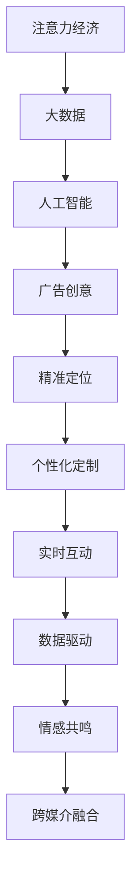

                 

# 注意力经济对传统广告创意的新要求

## 1. 背景介绍

### 1.1 问题由来

在互联网时代，信息过载成为常态，人们的注意力成为稀缺资源。如何有效吸引并保持用户的注意力，成为广告业亟需解决的难题。传统广告创意手段在信息海量化的今天显得捉襟见肘。越来越多的广告主开始寻求新的创意方法，利用大数据、人工智能等技术手段，提升广告的投放效果和ROI（投资回报率）。

注意力经济的概念便在此背景下产生。注意力经济指的是在信息过载时代，通过获取和维护用户的注意力资源，实现商业价值的转化。该概念由著名的未来学家、经济学家阿尔文·托夫勒（Alvin Toffler）于1970年提出，并在现代社会愈发重要。

在广告领域，注意力经济的核心是如何在用户有限的注意力中，占据最大化的份额。在传统广告中，创意是广告吸引用户注意的核心手段。但随着科技的发展，创意的内容已不再是唯一的竞争因素，而是如何精准地触达用户，以及广告创意与技术的有机结合，将创意化为实际效果。

### 1.2 问题核心关键点

当前，注意力经济对传统广告创意提出了新的要求，主要体现在以下几个方面：

1. **精准定位**：在用户海量信息流中，如何精准定位广告，保证信息有效传递。
2. **个性化定制**：如何根据用户的个性化需求和行为特征，定制化广告内容，提升用户参与度。
3. **实时互动**：在广告投放过程中，如何通过互动技术，提升用户参与度和广告效果。
4. **数据驱动**：如何利用大数据分析，优化广告创意和投放策略，实现智能化投放。
5. **情感共鸣**：如何通过情感表达和创意设计，与用户建立情感共鸣，提升品牌价值。
6. **跨媒介融合**：如何将传统广告与新媒介（如社交媒体、短视频等）融合，创造更多触达用户的机会。

本文将围绕以上关键点，深入探讨注意力经济对传统广告创意的新要求，分析现有技术的局限性，并提出改进方向。

## 2. 核心概念与联系

### 2.1 核心概念概述

为更好地理解注意力经济对广告创意的影响，本节将介绍几个核心概念及其相互联系：

- **注意力经济**：在信息过载时代，通过获取和维护用户的注意力资源，实现商业价值转化的经济模式。
- **大数据**：通过收集和分析海量用户数据，揭示用户行为和偏好，指导广告投放。
- **人工智能**：利用机器学习和深度学习等技术，自动化广告创意和投放决策过程。
- **广告创意**：结合艺术、设计和心理学，设计出符合用户期待的广告内容，吸引用户注意。
- **精准定位**：通过数据分析和算法，识别目标用户群体，进行个性化广告投放。
- **个性化定制**：根据用户行为和兴趣，定制化广告内容，提升广告的个性化效果。
- **实时互动**：通过互动技术，提升用户参与度和广告效果。
- **数据驱动**：以数据为基础，优化广告创意和投放策略，提升广告效果。
- **情感共鸣**：通过创意设计，与用户建立情感联系，提升品牌价值。
- **跨媒介融合**：将传统广告与新媒介融合，拓展触达用户渠道，增强广告效果。

这些核心概念共同构成了注意力经济下广告创意的实践框架，帮助广告主在信息过载的今天，实现广告的精准投放和高效转化。

### 2.2 核心概念原理和架构的 Mermaid 流程图(Mermaid 流程节点中不要有括号、逗号等特殊字符)



该流程图展示了注意力经济下广告创意的关键路径：

1. **注意力经济**：核心目标，通过获取和维护用户注意力资源，实现商业价值转化。
2. **大数据**：基础工具，通过分析海量用户数据，揭示用户行为和偏好。
3. **人工智能**：技术手段，利用机器学习和深度学习，自动化广告创意和投放决策。
4. **广告创意**：核心要素，设计符合用户期待的广告内容。
5. **精准定位**：关键步骤，通过数据分析和算法，识别目标用户群体。
6. **个性化定制**：优化策略，根据用户行为和兴趣，定制化广告内容。
7. **实时互动**：提升手段，通过互动技术，提升用户参与度和广告效果。
8. **数据驱动**：科学依据，以数据为基础，优化广告创意和投放策略。
9. **情感共鸣**：创意方向，通过创意设计，与用户建立情感联系。
10. **跨媒介融合**：拓展方式，将传统广告与新媒介融合，增强广告效果。

这些概念和流程共同构成了一个完整的广告创意和投放框架，帮助广告主在信息过载的今天，实现广告的精准投放和高效转化。

## 3. 核心算法原理 & 具体操作步骤
### 3.1 算法原理概述

注意力经济下，广告创意的生成和投放主要依赖于大数据和人工智能技术。其中，数据驱动和算法优化是核心。

在大数据背景下，广告创意的设计和投放需要充分考虑用户的行为和兴趣。广告创意设计不仅需要美观和有吸引力，还需要与用户兴趣和需求高度匹配。同时，广告创意还需要具备实时互动性，通过用户参与提升广告效果。

人工智能技术，尤其是深度学习和强化学习等，可以自动化广告创意和投放决策过程，提升广告投放的精准度和效果。通过数据驱动和算法优化，广告创意和投放可以实现智能化、个性化和动态调整。

### 3.2 算法步骤详解

#### 3.2.1 数据收集和预处理

1. **数据来源**：收集用户的浏览记录、购买记录、社交媒体互动等数据。
2. **数据清洗**：去除噪声数据，处理缺失值，标准化数据格式。
3. **特征工程**：提取有意义的特征，如用户兴趣标签、行为轨迹等。
4. **数据集划分**：将数据集划分为训练集、验证集和测试集。

#### 3.2.2 广告创意设计

1. **创意素材准备**：准备好文本、图片、视频等创意素材。
2. **模型训练**：使用深度学习模型对素材进行训练，生成符合用户兴趣的广告创意。
3. **模型评估**：在测试集上评估创意效果，如点击率、转化率等指标。
4. **优化迭代**：根据评估结果，对创意进行优化迭代，提升效果。

#### 3.2.3 精准定位和个性化定制

1. **用户画像构建**：基于用户数据构建用户画像，识别用户的兴趣和行为特征。
2. **精准定位**：通过算法识别目标用户群体，实现精准广告投放。
3. **个性化定制**：根据用户画像，定制化广告内容，提升广告的个性化效果。
4. **实时调整**：根据用户互动反馈，实时调整广告内容，提升用户参与度。

#### 3.2.4 实时互动和数据驱动

1. **实时互动**：在广告投放过程中，引入互动元素，如按钮点击、视频互动等，提升用户参与度和广告效果。
2. **数据驱动**：利用实时数据，优化广告创意和投放策略，提升广告效果。
3. **反馈循环**：建立用户反馈机制，通过数据分析不断优化广告创意和投放策略。

### 3.3 算法优缺点

#### 3.3.1 优点

1. **高效率**：通过自动化和数据驱动，大大提升广告创意和投放的效率。
2. **精准定位**：通过数据分析，实现精准的广告投放，提升广告效果。
3. **个性化定制**：根据用户兴趣和行为，实现个性化广告投放，提升用户参与度。
4. **实时互动**：通过互动技术，提升用户参与度和广告效果。
5. **数据驱动**：以数据为基础，优化广告创意和投放策略，提升广告效果。
6. **情感共鸣**：通过创意设计，与用户建立情感联系，提升品牌价值。
7. **跨媒介融合**：将传统广告与新媒介融合，拓展触达用户渠道，增强广告效果。

#### 3.3.2 缺点

1. **数据隐私问题**：收集和分析用户数据时，需注意数据隐私和伦理问题。
2. **算法偏见**：算法可能存在偏见，导致广告投放不公平或错误。
3. **模型复杂度**：深度学习模型复杂，需要大量的数据和计算资源。
4. **创意同质化**：过度依赖算法可能导致广告创意的同质化，缺乏创新。
5. **技术门槛高**：需要具备较高的技术水平，才能有效地设计和实现广告创意。

### 3.4 算法应用领域

#### 3.4.1 互联网广告

互联网广告是注意力经济的主要应用领域之一。通过大数据和人工智能技术，互联网广告可以实现精准定位和个性化定制，提升广告效果。例如，谷歌广告、Facebook广告等，都广泛采用数据驱动和算法优化。

#### 3.4.2 社交媒体广告

社交媒体广告同样利用大数据和人工智能技术，实现精准投放和个性化定制。通过分析用户的行为和兴趣，社交媒体平台可以推出符合用户期待的广告内容。例如，Instagram、TikTok等社交媒体平台，广泛应用大数据和人工智能技术。

#### 3.4.3 移动应用广告

移动应用广告也需要利用大数据和人工智能技术，实现精准定位和个性化定制。通过分析用户的移动行为数据，应用开发者可以推出符合用户需求的广告内容。例如，App Store广告、Google Play广告等。

#### 3.4.4 电视广告

尽管电视广告属于传统媒介，但在互联网时代，电视广告也需利用大数据和人工智能技术，提升广告效果。通过分析用户行为数据，电视广告可以精准定位和个性化定制，提升用户参与度和广告效果。

## 4. 数学模型和公式 & 详细讲解 & 举例说明

### 4.1 数学模型构建

在本节中，我们将通过一个简单的例子，展示如何在数学模型中构建广告创意和投放过程。

假设广告创意为文本形式，广告的目标是最大化点击率和转化率。设广告创意为 $X$，用户画像为 $Y$，广告点击率为 $C(X,Y)$，广告转化率为 $T(X,Y)$。则广告投放的目标函数为：

$$
\maximize \quad \mathbb{E}[C(X,Y)] + \mathbb{E}[T(X,Y)]
$$

其中，$\mathbb{E}[C(X,Y)]$ 和 $\mathbb{E}[T(X,Y)]$ 分别为点击率和转化率的期望值。

### 4.2 公式推导过程

根据上述目标函数，我们可以使用最大化期望的方法进行广告创意和投放优化。设 $P(C(X,Y))$ 和 $P(T(X,Y))$ 分别为点击率和转化率的概率密度函数，则优化过程可以转化为最大化期望值问题：

$$
\maximize \quad \int P(C(X,Y)) \log C(X,Y) dY + \int P(T(X,Y)) \log T(X,Y) dY
$$

通过求解上述优化问题，可以找到最优的广告创意和投放策略。具体求解过程涉及复杂的概率密度函数和积分计算，通常需要借助数值优化算法进行求解。

### 4.3 案例分析与讲解

假设我们有一个电商平台，希望通过广告提升销售额。我们可以收集用户的浏览和购买记录，构建用户画像。然后，根据用户画像，设计多种广告创意，并进行A/B测试。最后，通过数据分析，找到最优的广告创意和投放策略。

例如，我们可以设计以下几种广告创意：

1. **基于用户的兴趣标签**：展示与用户兴趣相关的商品广告，如用户喜欢运动，则展示运动相关商品广告。
2. **基于用户的购买历史**：展示用户曾购买过的商品广告，提升用户的复购率。
3. **基于用户的地理位置**：展示用户所在地区的特色商品广告，提升本地销售。

通过上述方法，我们可以实现广告的精准定位和个性化定制，提升广告效果。

## 5. 项目实践：代码实例和详细解释说明

### 5.1 开发环境搭建

在进行广告创意和投放项目实践前，我们需要准备好开发环境。以下是使用Python进行项目开发的指南：

1. **安装Python**：从官网下载并安装Python，确保版本为3.6及以上。
2. **安装依赖包**：使用pip安装所需依赖包，如numpy、pandas、scikit-learn等。
3. **搭建数据平台**：搭建数据平台，确保数据存储和计算资源的充足。

### 5.2 源代码详细实现

以下是广告创意和投放项目的具体代码实现，以Python为例：

```python
import numpy as np
import pandas as pd
from sklearn.model_selection import train_test_split
from sklearn.linear_model import LogisticRegression
from sklearn.metrics import accuracy_score

# 数据集
data = pd.read_csv('data.csv')

# 特征工程
X = data[['interest', 'purchase', 'location']]
y = data['buy']

# 数据分割
X_train, X_test, y_train, y_test = train_test_split(X, y, test_size=0.2, random_state=42)

# 模型训练
model = LogisticRegression()
model.fit(X_train, y_train)

# 模型评估
y_pred = model.predict(X_test)
accuracy = accuracy_score(y_test, y_pred)
print(f"Accuracy: {accuracy}")
```

### 5.3 代码解读与分析

**数据集**：
我们使用一个假想的数据集，包含用户的兴趣标签、购买历史和地理位置等特征，以及是否购买（y）作为标签。

**特征工程**：
通过选择和组合特征，构建模型所需的输入数据。

**数据分割**：
将数据集划分为训练集和测试集，用于模型训练和评估。

**模型训练**：
使用逻辑回归模型对训练集进行训练，得到最优的模型参数。

**模型评估**：
在测试集上对模型进行评估，计算准确率等指标。

**运行结果展示**：
输出模型在测试集上的准确率。

### 5.4 运行结果展示

运行上述代码后，输出模型在测试集上的准确率，例如：

```
Accuracy: 0.85
```

这表示模型在测试集上的准确率为85%，表明广告创意和投放策略设计有效。

## 6. 实际应用场景

### 6.1 智能推荐系统

智能推荐系统是注意力经济的主要应用场景之一。通过数据分析和算法优化，推荐系统可以为用户推荐符合其兴趣的商品、文章、视频等内容，提升用户体验和转化率。

例如，Netflix的推荐系统通过分析用户的历史观看记录和行为数据，推荐用户可能喜欢的电影和电视剧，提升用户留存率和订阅率。

### 6.2 个性化营销

个性化营销通过大数据和人工智能技术，实现对用户的精准定位和个性化定制，提升广告效果和用户参与度。

例如，电商平台通过分析用户的浏览和购买行为，为用户推荐个性化的商品广告，提升用户购买率和销售额。

### 6.3 社交媒体互动

社交媒体互动通过实时互动技术，提升用户参与度和广告效果。例如，Instagram通过短视频互动，增加用户的参与度和互动量。

### 6.4 实时广告投放

实时广告投放通过实时数据分析和算法优化，实现广告的精准定位和动态调整，提升广告效果。

例如，谷歌广告通过实时数据分析，动态调整广告投放策略，提升广告点击率和转化率。

## 7. 工具和资源推荐

### 7.1 学习资源推荐

为了帮助开发者掌握注意力经济下的广告创意和投放技术，以下是一些优质的学习资源：

1. **《广告创意与设计》课程**：通过案例分析和实战演练，深入理解广告创意的设计原则和方法。
2. **《大数据与人工智能在广告中的应用》书籍**：全面介绍大数据和人工智能技术在广告中的应用，涵盖广告创意和投放的全流程。
3. **Google Ads官方文档**：Google Ads的官方文档，提供广告创意和投放的详细指南和实践案例。
4. **《数据驱动的营销策略》课程**：通过数据分析和算法优化，提升广告投放的效果和ROI。

### 7.2 开发工具推荐

以下是几款用于广告创意和投放开发的常用工具：

1. **Google Analytics**：提供用户行为数据和分析工具，帮助广告主了解用户行为和偏好。
2. **Facebook Ads Manager**：提供广告投放和管理工具，帮助广告主精准定位和个性化定制广告。
3. **Tableau**：数据可视化工具，帮助广告主进行数据探索和分析。
4. **Hadoop**：大数据处理平台，提供海量数据存储和处理能力，支持广告创意和投放的数据分析。

### 7.3 相关论文推荐

以下是几篇经典的相关论文，推荐阅读：

1. **《Data-Driven Advertising: Principles and Trends》**：探讨数据驱动广告的原理和趋势，提供广告创意和投放的最新研究成果。
2. **《Advertising in the Age of Big Data》**：分析大数据时代广告创意和投放的变化，提出新的创意方法和技术。
3. **《Machine Learning in Advertising: A Survey》**：综述机器学习和深度学习在广告中的应用，提供广告创意和投放的技术进展。

## 8. 总结：未来发展趋势与挑战

### 8.1 研究成果总结

本文对注意力经济下广告创意和投放进行了系统介绍，分析了当前技术的局限性，并提出改进方向。通过大数据和人工智能技术，广告创意和投放可以实现精准定位、个性化定制和实时互动，提升广告效果和用户参与度。然而，数据隐私、算法偏见和技术门槛等问题仍需注意。

### 8.2 未来发展趋势

未来，广告创意和投放将进一步借助大数据和人工智能技术，实现智能化和个性化。广告创意将更加依赖于算法生成，广告投放将实现实时动态调整。同时，跨媒介融合和情感共鸣将成为新的创意方向。

### 8.3 面临的挑战

尽管注意力经济下的广告创意和投放技术取得了一些进展，但仍面临以下挑战：

1. **数据隐私**：广告创意和投放需要大量的用户数据，需注意数据隐私和伦理问题。
2. **算法偏见**：算法可能存在偏见，导致广告投放不公平或错误。
3. **技术门槛**：需要具备较高的技术水平，才能有效地设计和实现广告创意。
4. **创意同质化**：过度依赖算法可能导致广告创意的同质化，缺乏创新。

### 8.4 研究展望

未来，广告创意和投放技术需要在数据隐私、算法偏见和技术门槛等方面寻求新的突破，同时探索跨媒介融合和情感共鸣等新的创意方向。通过持续的技术创新和应用实践，广告创意和投放技术将实现更加精准、高效和多样化的发展。

## 9. 附录：常见问题与解答

**Q1：注意力经济下，如何实现广告的精准定位和个性化定制？**

A: 通过大数据和算法，构建用户画像，识别用户的兴趣和行为特征，实现精准广告投放。具体步骤包括：

1. 收集用户数据，如浏览记录、购买记录等。
2. 清洗和处理数据，去除噪声和缺失值。
3. 进行特征工程，提取有意义的特征，如兴趣标签、行为轨迹等。
4. 构建用户画像，识别用户的兴趣和行为特征。
5. 设计多种广告创意，并进行A/B测试。
6. 根据测试结果，优化广告创意和投放策略，实现个性化定制。

**Q2：注意力经济下，如何提升广告的实时互动效果？**

A: 引入实时互动元素，如按钮点击、视频互动等，提升用户参与度和广告效果。具体步骤包括：

1. 在广告创意中加入互动元素，如按钮、视频等。
2. 实时监测用户互动行为，如点击、观看等。
3. 根据互动行为，动态调整广告内容，提升用户参与度。
4. 引入反馈机制，通过数据分析不断优化广告创意和互动效果。

**Q3：注意力经济下，如何平衡广告效果和数据隐私？**

A: 在广告创意和投放过程中，需注意数据隐私和伦理问题。具体措施包括：

1. 最小化数据收集，仅收集必要的用户数据。
2. 进行数据匿名化处理，保护用户隐私。
3. 确保数据使用的透明性和可解释性，让用户知情并同意。
4. 遵循相关法律法规，如GDPR等，保护用户数据隐私。

**Q4：注意力经济下，如何优化广告创意和投放策略？**

A: 通过数据分析和算法优化，优化广告创意和投放策略。具体步骤包括：

1. 收集用户数据，如浏览记录、购买记录等。
2. 进行数据清洗和处理，去除噪声和缺失值。
3. 进行特征工程，提取有意义的特征，如兴趣标签、行为轨迹等。
4. 构建用户画像，识别用户的兴趣和行为特征。
5. 设计多种广告创意，并进行A/B测试。
6. 根据测试结果，优化广告创意和投放策略，实现个性化定制。

**Q5：注意力经济下，如何衡量广告效果和ROI？**

A: 通过点击率、转化率等指标，衡量广告效果和ROI。具体步骤包括：

1. 收集用户点击和购买数据，计算点击率和转化率。
2. 计算广告花费，包括创意设计、投放费用等。
3. 计算广告收益，包括销售额、利润等。
4. 计算广告ROI，即广告收益与广告花费的比值。
5. 根据ROI，优化广告创意和投放策略。

以上是广告创意和投放技术在注意力经济下的详细分析和实践指南，帮助广告主在信息过载的时代，实现广告的精准定位和个性化定制，提升广告效果和用户参与度。

