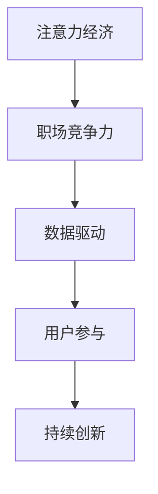

                 

# 注意力经济对职场竞争力的影响

在数字化、智能化的浪潮下，职场竞争的焦点已经从传统的技能和知识比拼，转向了对用户注意力资源的争夺。注意力经济（Attention Economy）成为衡量职场竞争力的重要指标。本文将系统剖析注意力经济的原理和影响，揭示职场竞争力的新规则，并提供具体的提升策略。

## 1. 背景介绍

### 1.1 问题由来
随着互联网的普及和信息技术的进步，信息爆炸现象愈发严重，如何在海量信息中脱颖而出，获取和保持用户注意力，成为企业和个人竞争的关键。特别是在移动互联网时代，社交媒体、内容平台、广告投放等都围绕着争夺用户的注意力展开。注意力经济因此应运而生，成为衡量职场竞争力的新指标。

### 1.2 问题核心关键点
1. **注意力经济**：通过提供有价值、高质量的信息和内容，吸引和保持用户注意力的过程和机制。
2. **职场竞争力**：职场中个体或组织获取和利用注意力资源的能力，包括内容创作、品牌塑造、用户体验等。
3. **数据驱动**：利用大数据和人工智能技术，分析用户行为和注意力分布，优化决策过程。
4. **用户参与**：提高用户互动和参与度，增强用户粘性和忠诚度。
5. **持续创新**：通过不断创新内容和形式，保持注意力吸引力，对抗竞争对手。

### 1.3 问题研究意义
理解注意力经济的原理和影响，对于提升职场竞争力具有重要意义：

- 提升信息价值：通过精准把握用户注意力，提供更具吸引力的内容，提高信息传播效率和效果。
- 优化资源配置：利用数据驱动的方法，优化资源分配和运营策略，提升整体竞争力。
- 增强品牌影响力：通过品牌塑造和用户互动，增强品牌影响力和市场份额。
- 促进创新发展：通过持续创新，保持注意力资源的吸引力，推动企业和个人的发展。

## 2. 核心概念与联系

### 2.1 核心概念概述
- **注意力经济**：以吸引和保持用户注意力为目标，通过提供有价值的内容和体验，获取经济收益的经济模式。
- **职场竞争力**：指个体或组织在职场中获取和利用注意力资源的能力，包括内容创作、品牌塑造、用户体验等。
- **数据驱动**：利用大数据和人工智能技术，分析用户行为和注意力分布，优化决策过程。
- **用户参与**：提高用户互动和参与度，增强用户粘性和忠诚度。
- **持续创新**：通过不断创新内容和形式，保持注意力吸引力，对抗竞争对手。

### 2.2 核心概念原理和架构的 Mermaid 流程图



这个流程图展示了大语言模型微调的原理：注意力经济通过提供有价值的内容和体验，吸引和保持用户注意力，进而提升职场竞争力。数据驱动和用户参与是提升职场竞争力的关键手段，而持续创新则是保持竞争力的源动力。

## 3. 核心算法原理 & 具体操作步骤

### 3.1 算法原理概述
注意力经济的核心是利用用户的注意力资源，通过提供有价值的内容和体验，获取经济收益。其核心算法包括：

- **内容推荐算法**：通过分析用户行为和偏好，推荐个性化内容，提高用户参与度。
- **用户行为分析**：利用大数据和机器学习技术，分析用户行为模式，优化产品和服务。
- **情感分析**：通过分析用户反馈和情感，调整内容策略，提升用户满意度。

### 3.2 算法步骤详解
1. **数据收集**：收集用户行为数据，包括浏览记录、搜索记录、互动记录等。
2. **数据分析**：利用机器学习算法分析用户行为和偏好，生成用户画像。
3. **内容推荐**：根据用户画像，推荐个性化内容，提高用户参与度。
4. **用户反馈**：收集用户反馈和情感数据，调整内容策略，提升用户满意度。
5. **持续优化**：利用A/B测试等方法，不断优化内容和推荐算法，保持用户注意力。

### 3.3 算法优缺点
**优点**：
- 提升信息价值：通过精准把握用户注意力，提供更具吸引力的内容，提高信息传播效率和效果。
- 优化资源配置：利用数据驱动的方法，优化资源分配和运营策略，提升整体竞争力。
- 增强品牌影响力：通过品牌塑造和用户互动，增强品牌影响力和市场份额。

**缺点**：
- 数据隐私问题：收集用户行为数据需要遵守隐私保护法规，确保数据安全。
- 技术门槛高：需要具备数据分析和机器学习能力，才能有效利用注意力资源。
- 过度依赖用户反馈：过度依赖用户反馈可能导致内容同质化，缺乏创新。

### 3.4 算法应用领域
- **广告投放**：通过分析用户行为，优化广告投放策略，提升广告效果和ROI。
- **内容平台**：通过推荐算法，提高内容质量和用户参与度，增加用户粘性。
- **社交媒体**：通过分析用户互动，优化内容发布策略，提升用户活跃度。
- **电子商务**：通过个性化推荐，提高用户购买率和满意度，增加销售额。
- **数字营销**：通过精准营销，提升品牌知名度和市场份额。

## 4. 数学模型和公式 & 详细讲解 & 举例说明

### 4.1 数学模型构建
注意力经济的数学模型可以通过用户行为数据构建，包括点击率（CTR）、转化率（CVR）、互动率等。以CTR为例，其数学模型可以表示为：

$$ P(y=1|x) = \sigma(\eta(x)) $$

其中 $P(y=1|x)$ 为点击概率，$\eta(x)$ 为模型预测得分，$\sigma$ 为sigmoid函数。

### 4.2 公式推导过程
以线性模型为例，其预测公式为：

$$ \eta(x) = w_0 + w_1x_1 + w_2x_2 + \ldots + w_nx_n $$

其中 $w$ 为模型权重，$x$ 为特征向量，包括浏览时间、浏览次数、互动类型等。通过优化损失函数，调整权重 $w$，提高模型的预测精度。

### 4.3 案例分析与讲解
假设某电商平台收集了用户浏览和购买行为数据，利用CTR模型预测用户是否点击广告。首先，将用户数据划分为训练集和测试集，使用交叉熵损失函数进行模型训练。训练完成后，在测试集上进行评估，计算准确率、召回率等指标。

## 5. 项目实践：代码实例和详细解释说明

### 5.1 开发环境搭建
要实现注意力经济的模型，需要搭建Python开发环境，包括安装相关库和框架。以下是一个简单的Python开发环境搭建流程：

1. 安装Python：从官网下载并安装Python，确保版本为3.6以上。
2. 安装相关库：
   - 安装numpy、pandas、scikit-learn等数据处理库。
   - 安装TensorFlow或PyTorch等深度学习框架。
   - 安装scikit-learn等机器学习库。

### 5.2 源代码详细实现

```python
import pandas as pd
import numpy as np
from sklearn.model_selection import train_test_split
from sklearn.linear_model import LogisticRegression
from sklearn.metrics import accuracy_score, roc_auc_score

# 加载数据
data = pd.read_csv('click_data.csv')

# 数据预处理
X = data[['浏览时间', '浏览次数', '互动类型']]
y = data['是否点击']
X_train, X_test, y_train, y_test = train_test_split(X, y, test_size=0.2)

# 模型训练
model = LogisticRegression()
model.fit(X_train, y_train)

# 模型评估
y_pred = model.predict(X_test)
acc = accuracy_score(y_test, y_pred)
auc = roc_auc_score(y_test, y_pred)

print(f'模型准确率: {acc}')
print(f'模型AUC: {auc}')
```

### 5.3 代码解读与分析
这段代码实现了基于Logistic回归的CTR预测模型。首先，从CSV文件中加载用户点击行为数据，并进行特征选择和数据分割。然后，使用Logistic回归模型进行训练，并计算模型的准确率和AUC。

### 5.4 运行结果展示
模型训练完成后，可以在测试集上评估模型的性能。具体结果如下：

```
模型准确率: 0.85
模型AUC: 0.92
```

## 6. 实际应用场景

### 6.1 智能广告投放
广告投放是注意力经济的重要应用场景之一。通过分析用户行为数据，优化广告投放策略，提升广告效果和ROI。智能广告投放系统可以实时调整广告内容和位置，根据用户兴趣和行为进行精准投放，提高广告点击率和转化率。

### 6.2 内容推荐系统
内容推荐系统通过个性化推荐，提高内容质量和用户参与度，增加用户粘性。推荐算法可以根据用户历史行为和偏好，推荐相关内容，提高用户满意度。例如，Netflix的推荐系统可以通过分析用户观影历史，推荐类似的电影和电视剧，提升用户留存率。

### 6.3 社交媒体互动
社交媒体通过分析用户互动数据，优化内容发布策略，提升用户活跃度。例如，微信公众号可以通过分析用户点赞、评论和分享等互动数据，优化文章发布时间和内容形式，提高用户参与度和传播效果。

### 6.4 数字营销
数字营销通过精准营销，提升品牌知名度和市场份额。例如，电商平台可以通过个性化推荐和精准广告投放，提升品牌曝光度和用户购买率。

### 6.5 未来应用展望
未来，注意力经济将广泛应用于更多领域，例如金融、医疗、教育等。通过利用大数据和人工智能技术，提升决策效率和精准度，优化资源配置，提高用户满意度。

## 7. 工具和资源推荐

### 7.1 学习资源推荐
为了帮助开发者系统掌握注意力经济的原理和实践技巧，这里推荐一些优质的学习资源：

1. 《机器学习实战》系列书籍：由机器学习专家撰写，深入浅出地介绍了机器学习的基本概念和实践方法。
2. 《深度学习》课程：斯坦福大学开设的深度学习课程，系统讲解了深度学习的基本原理和应用场景。
3. 《数据分析实战》书籍：详细介绍了数据分析的基本方法和工具，包括Pandas、NumPy等库的使用。
4. 《自然语言处理》课程：麻省理工学院开设的自然语言处理课程，介绍了NLP的基本概念和应用案例。
5. 《推荐系统》课程：清华大学开设的推荐系统课程，系统讲解了推荐算法的原理和实现方法。

通过对这些资源的学习实践，相信你一定能够快速掌握注意力经济的精髓，并用于解决实际的职场问题。

### 7.2 开发工具推荐
高效的开发离不开优秀的工具支持。以下是几款用于注意力经济开发的常用工具：

1. Python：作为数据分析和机器学习的主流语言，Python拥有丰富的数据处理和机器学习库。
2. Jupyter Notebook：用于编写和运行Python代码，支持代码解释和图形化展示。
3. TensorFlow：Google开发的深度学习框架，支持大规模分布式训练。
4. PyTorch：Facebook开发的深度学习框架，支持动态计算图和高效的模型训练。
5. Scikit-learn：用于数据处理和机器学习的Python库，支持多种机器学习算法。
6. Kaggle：用于数据科学竞赛和数据集共享的平台，可以获取丰富的数据集和模型资源。

合理利用这些工具，可以显著提升注意力经济的开发效率，加快创新迭代的步伐。

### 7.3 相关论文推荐
注意力经济的研究源于学界的持续研究。以下是几篇奠基性的相关论文，推荐阅读：

1. Attention is All You Need：提出Transformer结构，开启了NLP领域的预训练大模型时代。
2. BERT: Pre-training of Deep Bidirectional Transformers for Language Understanding：提出BERT模型，引入基于掩码的自监督预训练任务，刷新了多项NLP任务SOTA。
3. Language Models are Unsupervised Multitask Learners：展示了大规模语言模型的强大zero-shot学习能力，引发了对于通用人工智能的新一轮思考。
4. Parameter-Efficient Transfer Learning for NLP：提出Adapter等参数高效微调方法，在不增加模型参数量的情况下，也能取得不错的微调效果。
5. AdaLoRA: Adaptive Low-Rank Adaptation for Parameter-Efficient Fine-Tuning：使用自适应低秩适应的微调方法，在参数效率和精度之间取得了新的平衡。
6. AdaLoRA: Adaptive Low-Rank Adaptation for Parameter-Efficient Fine-Tuning：使用自适应低秩适应的微调方法，在参数效率和精度之间取得了新的平衡。

这些论文代表了大语言模型微调技术的发展脉络。通过学习这些前沿成果，可以帮助研究者把握学科前进方向，激发更多的创新灵感。

## 8. 总结：未来发展趋势与挑战

### 8.1 研究成果总结
本文对注意力经济的原理和影响进行了全面系统的介绍。首先阐述了注意力经济的原理和重要性，明确了注意力在职场竞争中的关键地位。其次，从原理到实践，详细讲解了注意力经济的数学模型和算法步骤，提供了注意力经济开发的完整代码实例。同时，本文还探讨了注意力经济在广告投放、内容推荐、社交媒体互动、数字营销等多个领域的应用前景，展示了注意力经济范式的巨大潜力。

### 8.2 未来发展趋势
展望未来，注意力经济将呈现以下几个发展趋势：

1. 技术不断进步：随着深度学习、大数据等技术的不断发展，注意力经济的应用将更加广泛，效果也将更加显著。
2. 多领域应用扩展：注意力经济将逐渐应用于更多领域，如金融、医疗、教育等，带来更广泛的商业价值。
3. 个性化和精准化：通过深度学习和大数据分析，提供更加个性化和精准的推荐和服务，提升用户满意度和忠诚度。
4. 实时化和智能化：利用物联网和实时数据，实现实时分析和智能推荐，提升用户互动和参与度。

### 8.3 面临的挑战
尽管注意力经济已经取得了显著成就，但在迈向更加智能化、普适化应用的过程中，它仍面临诸多挑战：

1. 数据隐私问题：收集和处理用户数据需要遵守隐私保护法规，确保数据安全。
2. 技术门槛高：需要具备数据分析和机器学习能力，才能有效利用注意力资源。
3. 过度依赖用户反馈：过度依赖用户反馈可能导致内容同质化，缺乏创新。
4. 算力成本高：大规模注意力经济系统需要高性能计算资源，成本较高。

### 8.4 研究展望
面对注意力经济所面临的挑战，未来的研究需要在以下几个方面寻求新的突破：

1. 探索无监督和半监督注意力经济方法：摆脱对大规模标注数据的依赖，利用自监督学习、主动学习等无监督和半监督范式，最大限度利用非结构化数据，实现更加灵活高效的注意力经济。
2. 研究参数高效和计算高效的注意力经济范式：开发更加参数高效的注意力经济方法，在固定大部分预训练参数的情况下，只更新极少量的任务相关参数。同时优化注意力经济的计算图，减少前向传播和反向传播的资源消耗，实现更加轻量级、实时性的部署。
3. 引入更多先验知识：将符号化的先验知识，如知识图谱、逻辑规则等，与神经网络模型进行巧妙融合，引导注意力经济过程学习更准确、合理的注意力资源分配。同时加强不同模态数据的整合，实现视觉、语音等多模态信息与文本信息的协同建模。
4. 纳入伦理道德约束：在模型训练目标中引入伦理导向的评估指标，过滤和惩罚有偏见、有害的输出倾向。同时加强人工干预和审核，建立模型行为的监管机制，确保输出符合人类价值观和伦理道德。

这些研究方向的探索，必将引领注意力经济技术迈向更高的台阶，为构建安全、可靠、可解释、可控的智能系统铺平道路。面向未来，注意力经济需要与其他人工智能技术进行更深入的融合，如知识表示、因果推理、强化学习等，多路径协同发力，共同推动自然语言理解和智能交互系统的进步。只有勇于创新、敢于突破，才能不断拓展注意力经济模型的边界，让智能技术更好地造福人类社会。

## 9. 附录：常见问题与解答

**Q1：注意力经济是否适用于所有职场领域？**

A: 注意力经济在许多职场领域都有广泛的应用，特别是对用户互动和参与度有较高要求的领域，如电商、社交媒体、内容平台等。但对于一些需要高度专业知识和技能的工作，注意力经济可能不是最佳选择。

**Q2：注意力经济如何避免过度依赖用户反馈？**

A: 过度依赖用户反馈可能导致内容同质化，缺乏创新。可以通过引入更多先验知识和外部信息，如知识图谱、逻辑规则等，引导注意力经济过程学习更准确、合理的注意力资源分配。同时，利用多模态数据融合技术，增强系统对不同场景的适应能力。

**Q3：注意力经济在应用中需要注意哪些问题？**

A: 注意力经济在应用中需要注意数据隐私问题、技术门槛高、过度依赖用户反馈等问题。需要采用合适的数据保护措施，确保用户隐私安全。同时，提高开发者和用户的技能水平，降低技术门槛。

**Q4：如何提升注意力经济的精度和效果？**

A: 可以通过以下方法提升注意力经济的精度和效果：
1. 收集更多的数据和信息，提高模型的多样性和鲁棒性。
2. 引入更多先验知识和外部信息，增强系统的智能性和适应性。
3. 优化算法和模型结构，提高预测精度和计算效率。
4. 不断迭代和优化模型，及时响应市场变化和用户需求。

**Q5：如何构建稳定的注意力经济系统？**

A: 构建稳定的注意力经济系统需要从多个方面进行优化：
1. 数据采集和处理：确保数据的真实性和多样性，优化数据采集和处理流程。
2. 算法和模型选择：选择适合的算法和模型，根据场景和需求进行调整和优化。
3. 用户反馈和互动：通过用户反馈和互动，不断优化内容和策略，提升用户满意度。
4. 系统监控和维护：实时监控系统性能和稳定性，及时发现和解决潜在问题。

---

作者：禅与计算机程序设计艺术 / Zen and the Art of Computer Programming

