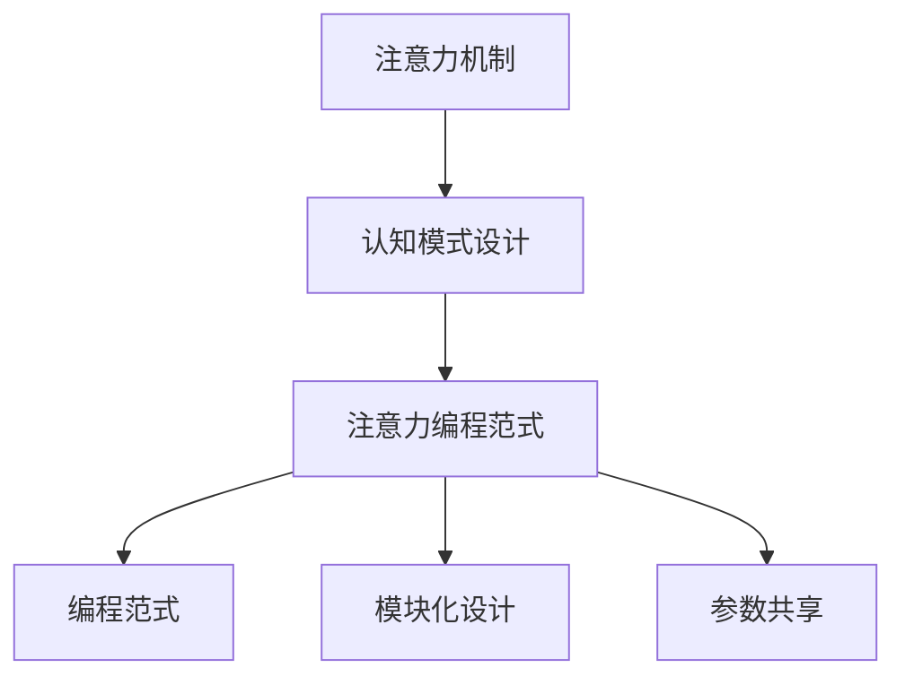

                 

# 注意力编程范式：AI定制的认知模式设计

> 关键词：注意力机制,编程范式,认知模式设计,深度学习,强化学习

## 1. 背景介绍

### 1.1 问题由来
随着人工智能技术的飞速发展，深度学习、强化学习等领域的认知模式设计方法取得了显著进展。特别是在语言模型、视觉识别、语音处理、机器人控制等应用场景中，通过注意力机制的引入，大幅提升了系统的感知和决策能力。

然而，当前基于注意力机制的设计方法往往依赖于繁琐的参数调优，难以适应大规模复杂的认知任务。如何在保证性能的前提下，简化注意力机制的编程实现，是当前AI研究中一个重要的热点问题。

### 1.2 问题核心关键点
针对这一问题，本文提出了注意力编程范式，即通过设计可复用、可组合的注意力单元，简化注意力机制的设计与实现，大幅提升认知模式的通用性和效率。

这种范式主要基于以下几个核心关键点：
1. 可复用注意力单元：将注意力机制的计算过程封装成独立的、可复用的单元，降低设计和实现难度。
2. 任务无关设计：采用任务无关的设计方法，使注意力单元能适应各种认知任务。
3. 模块化组合：通过简单的接口，允许不同注意力的组合与扩展，实现复杂的认知模式设计。
4. 参数共享与高效计算：优化注意力参数，减少计算复杂度，提高模型的可扩展性。

### 1.3 问题研究意义
引入注意力编程范式，具有以下重要研究意义：
1. 简化设计：通过设计可复用的注意力单元，简化了复杂认知模式的设计与实现过程。
2. 提高效率：通过任务无关设计和参数优化，提高了注意力机制的计算效率和模型的可扩展性。
3. 增强通用性：通过模块化的组合机制，扩展了认知模式设计的适用场景和应用范围。
4. 提升智能：通过合理运用注意力机制，提升AI系统的感知和决策能力，推动智能应用的发展。

## 2. 核心概念与联系

### 2.1 核心概念概述

为更好地理解注意力编程范式，本节将介绍几个密切相关的核心概念：

- 注意力机制(Attention Mechanism)：一种计算机制，通过权值分配关注模型输入的不同部分，用于增强系统的感知和推理能力。常见于深度学习、强化学习中。
- 认知模式设计(Cognitive Model Design)：通过设计合理的认知模型，实现系统对复杂任务的自动化处理。包括感知、推理、决策等步骤。
- 注意力编程范式(Attention Programming Paradigm)：一种简化注意力机制设计的方法，通过可复用的注意力单元和模块化的组合机制，提高认知模式设计的效率和通用性。
- 编程范式(Programming Paradigm)：一种程序设计的思维方式，通过抽象的模型和接口，简化设计过程，提高代码的可读性和可维护性。
- 模块化设计(Modular Design)：通过划分独立模块，实现系统设计的灵活组合和扩展。模块之间的接口设计简洁，便于复用和扩展。
- 参数共享(Parameter Sharing)：通过参数共享，降低模型规模，提高计算效率。常见于卷积神经网络、图神经网络中。

这些核心概念之间的逻辑关系可以通过以下Mermaid流程图来展示：



这个流程图展示了几大核心概念之间的逻辑关系：

1. 注意力机制是认知模式设计的基础。
2. 注意力编程范式是一种简化注意力设计的方法。
3. 编程范式是设计认知模式的思维方式。
4. 模块化设计是编程范式的一种应用。
5. 参数共享是模块化设计的一部分。

这些概念共同构成了注意力编程范式的理论基础，为复杂认知模式的设计提供了新的思路和方法。

## 3. 核心算法原理 & 具体操作步骤
### 3.1 算法原理概述

注意力编程范式基于注意力机制，通过设计可复用的注意力单元和模块化的组合机制，简化注意力机制的设计与实现。其核心思想是将注意力计算过程封装成独立的、可复用的模块，通过简单的接口进行调用和组合，构建复杂的认知模式。

算法流程如下：
1. 设计可复用的注意力单元：根据具体任务需求，设计计算高效、参数共享的注意力单元。
2. 定义接口函数：通过接口函数将注意力单元暴露出来，便于与其他模块进行组合和扩展。
3. 组合模块设计：通过简单的接口，实现不同注意力的组合和扩展，构建复杂的认知模式。
4. 优化参数共享：通过参数共享机制，减少模型计算量，提高模型的可扩展性。

### 3.2 算法步骤详解

#### 3.2.1 注意力单元设计

设计注意力单元是注意力编程范式的关键步骤。以下介绍几种常见的注意力单元设计方法：

**3.2.1.1 点积注意力(Pointwise Attention)**
点积注意力是最常见的注意力形式，通过计算输入向量与查询向量之间的点积，计算注意力的权重。

设查询向量为 $q$，键向量为 $k_i$，值向量为 $v_i$。点积注意力公式为：

$$
\alpha_i = \frac{e^{\mathbf{q} \cdot \mathbf{k}_i}}{\sum_j e^{\mathbf{q} \cdot \mathbf{k}_j}}
$$

其中 $\mathbf{q}$ 为查询向量，$\mathbf{k}_i$ 为第 $i$ 个键向量。权重 $\alpha_i$ 表示第 $i$ 个键向量的重要性，用于对值向量进行加权。

**3.2.1.2 多头注意力(Multi-Head Attention)**
多头注意力是点积注意力的扩展形式，通过并行计算多个头，增强模型的感知能力。

设查询向量为 $Q$，键向量为 $K$，值向量为 $V$，多头注意力公式为：

$$
\text{Multi-Head Attention}(Q, K, V) = \text{Concat}(\text{Attention}(Q_iK_i^T)W^Q)^T
$$

其中 $Q, K, V$ 分别表示查询矩阵、键矩阵和值矩阵，$\text{Concat}$ 表示拼接操作。权重矩阵 $W^Q, W^K, W^V$ 分别表示查询矩阵、键矩阵和值矩阵的投影矩阵，用于计算注意力权重。

**3.2.1.3 自注意力(Self-Attention)**
自注意力用于计算序列中不同位置之间的相互关系，常用于语言模型的注意力计算。

设输入序列为 $X=\{x_i\}$，自注意力公式为：

$$
\text{Self-Attention}(X) = \text{Softmax}(X^TX)^TX
$$

其中 $X$ 表示输入序列的嵌入矩阵，$\text{Softmax}$ 表示归一化函数，用于计算注意力的权重。

#### 3.2.2 接口函数定义

定义接口函数是注意力编程范式的核心操作。通过简单的接口函数，使注意力单元能够与其他模块进行组合和扩展。以下是一个简单的接口函数示例：

```python
def attention(X, K, V, d_k):
    """点积注意力函数"""
    scores = torch.matmul(X, K.t()) / math.sqrt(d_k)
    alpha = F.softmax(scores, dim=-1)
    out = torch.matmul(alpha, V)
    return out, alpha
```

接口函数接收输入矩阵 $X$、键矩阵 $K$、值矩阵 $V$ 和键向量的维度 $d_k$。函数内部计算注意力权重，并将注意力值和权重作为输出。

#### 3.2.3 模块化组合设计

通过接口函数，实现不同注意力的组合与扩展。以下是一个简单的模块组合示例：

```python
def multi_head_attention(X, K, V, d_k, num_heads):
    """多头注意力函数"""
    Q = torch.matmul(X, W_Q) # 查询矩阵
    K = torch.matmul(K, W_K) # 键矩阵
    V = torch.matmul(V, W_V) # 值矩阵
    attention_out = []
    for i in range(num_heads):
        out, alpha = attention(Q, K, V, d_k) # 点积注意力
        attention_out.append(out)
    attention_out = torch.cat(attention_out, dim=1) # 拼接注意力结果
    return attention_out, alpha
```

以上代码定义了一个多头注意力函数，接收输入矩阵 $X$、键矩阵 $K$、值矩阵 $V$、键向量的维度 $d_k$ 和头数 $num\_heads$。函数内部通过调用简单的点积注意力函数，实现多个头的注意力计算，并将结果拼接输出。

#### 3.2.4 参数共享与优化

参数共享是优化注意力参数的重要方法。通过参数共享，减少模型计算量，提高模型的可扩展性。以下是一个简单的参数共享示例：

```python
class SelfAttention(nn.Module):
    def __init__(self, d_model, num_heads):
        super(SelfAttention, self).__init__()
        self.d_model = d_model
        self.num_heads = num_heads
        self.d_k = d_model // num_heads
        self.W_Q = nn.Parameter(torch.empty(size=(d_model, d_model)))
        self.W_K = nn.Parameter(torch.empty(size=(d_model, d_model)))
        self.W_V = nn.Parameter(torch.empty(size=(d_model, d_model)))
        self.V = nn.Parameter(torch.empty(size=(1, d_model, d_model)))
        self.alpha = nn.Parameter(torch.empty(size=(1, d_model, d_model)))

    def forward(self, X):
        Q = torch.matmul(X, self.W_Q) # 查询矩阵
        K = torch.matmul(X, self.W_K) # 键矩阵
        V = torch.matmul(X, self.W_V) # 值矩阵
        scores = torch.matmul(Q, K.t()) / math.sqrt(self.d_k) # 点积注意力
        alpha = F.softmax(scores, dim=-1) # 注意力权重
        out = torch.matmul(alpha, V) # 注意力值
        return out, alpha
```

以上代码定义了一个自注意力模块，接收输入矩阵 $X$。函数内部通过参数共享机制，减少了计算量，提高了模型的可扩展性。

### 3.3 算法优缺点

注意力编程范式具有以下优点：
1. 简化设计：通过设计可复用的注意力单元，简化了复杂认知模式的设计与实现过程。
2. 提高效率：通过任务无关设计和参数优化，提高了注意力机制的计算效率和模型的可扩展性。
3. 增强通用性：通过模块化的组合机制，扩展了认知模式设计的适用场景和应用范围。
4. 提升智能：通过合理运用注意力机制，提升AI系统的感知和决策能力，推动智能应用的发展。

同时，这种范式也存在一些局限性：
1. 设计复杂：虽然简化了设计，但需要更多的抽象和理解。
2. 灵活性不足：接口函数定义需要合理设计，否则难以实现灵活的组合和扩展。
3. 数据依赖：需要合理选择注意力单元和参数，否则可能会过度拟合训练数据。

尽管存在这些局限性，但注意力编程范式在注意力机制的设计与实现中具有重要的应用价值，值得深入研究和推广。

### 3.4 算法应用领域

注意力编程范式已经在深度学习、强化学习、计算机视觉、自然语言处理等多个领域得到应用，为认知模式设计提供了新的思路和方法。

1. 深度学习中的注意力机制：用于卷积神经网络、循环神经网络、注意力机制等任务。
2. 强化学习中的注意力机制：用于价值函数、策略优化等任务。
3. 计算机视觉中的注意力机制：用于图像分类、目标检测、图像生成等任务。
4. 自然语言处理中的注意力机制：用于机器翻译、文本生成、情感分析等任务。

这些领域的应用证明了注意力编程范式的有效性和通用性，展示了其在认知模式设计中的广泛应用前景。

## 4. 数学模型和公式 & 详细讲解
### 4.1 数学模型构建

注意力编程范式可以通过数学模型进行更严格的刻画。以下引入几个常见的数学模型：

**4.1.1 点积注意力模型**
设输入向量为 $X$，键向量为 $K$，值向量为 $V$。点积注意力公式为：

$$
\alpha_i = \frac{e^{\mathbf{q} \cdot \mathbf{k}_i}}{\sum_j e^{\mathbf{q} \cdot \mathbf{k}_j}}
$$

其中 $\mathbf{q}$ 为查询向量，$\mathbf{k}_i$ 为第 $i$ 个键向量。权重 $\alpha_i$ 表示第 $i$ 个键向量的重要性，用于对值向量进行加权。

**4.1.2 多头注意力模型**
设输入向量为 $X$，键向量为 $K$，值向量为 $V$，多头注意力公式为：

$$
\text{Multi-Head Attention}(X, K, V) = \text{Concat}(\text{Attention}(Q_iK_i^T)W^Q)^T
$$

其中 $Q, K, V$ 分别表示查询矩阵、键矩阵和值矩阵，$\text{Concat}$ 表示拼接操作。权重矩阵 $W^Q, W^K, W^V$ 分别表示查询矩阵、键矩阵和值矩阵的投影矩阵，用于计算注意力权重。

**4.1.3 自注意力模型**
设输入序列为 $X=\{x_i\}$，自注意力公式为：

$$
\text{Self-Attention}(X) = \text{Softmax}(X^TX)^TX
$$

其中 $X$ 表示输入序列的嵌入矩阵，$\text{Softmax}$ 表示归一化函数，用于计算注意力的权重。

### 4.2 公式推导过程

以下是三种注意力机制的公式推导过程：

**4.2.1 点积注意力**
设输入向量为 $X$，键向量为 $K$，值向量为 $V$。点积注意力公式为：

$$
\alpha_i = \frac{e^{\mathbf{q} \cdot \mathbf{k}_i}}{\sum_j e^{\mathbf{q} \cdot \mathbf{k}_j}}
$$

其中 $\mathbf{q}$ 为查询向量，$\mathbf{k}_i$ 为第 $i$ 个键向量。权重 $\alpha_i$ 表示第 $i$ 个键向量的重要性，用于对值向量进行加权。

**4.2.2 多头注意力**
设输入向量为 $X$，键向量为 $K$，值向量为 $V$，多头注意力公式为：

$$
\text{Multi-Head Attention}(X, K, V) = \text{Concat}(\text{Attention}(Q_iK_i^T)W^Q)^T
$$

其中 $Q, K, V$ 分别表示查询矩阵、键矩阵和值矩阵，$\text{Concat}$ 表示拼接操作。权重矩阵 $W^Q, W^K, W^V$ 分别表示查询矩阵、键矩阵和值矩阵的投影矩阵，用于计算注意力权重。

**4.2.3 自注意力**
设输入序列为 $X=\{x_i\}$，自注意力公式为：

$$
\text{Self-Attention}(X) = \text{Softmax}(X^TX)^TX
$$

其中 $X$ 表示输入序列的嵌入矩阵，$\text{Softmax}$ 表示归一化函数，用于计算注意力的权重。

### 4.3 案例分析与讲解

以下是一个简单的点积注意力计算示例：

设输入向量为 $X=[0, 1, 2]$，键向量为 $K=[1, 2, 3]$，值向量为 $V=[4, 5, 6]$。点积注意力公式为：

$$
\alpha_i = \frac{e^{\mathbf{q} \cdot \mathbf{k}_i}}{\sum_j e^{\mathbf{q} \cdot \mathbf{k}_j}}
$$

其中 $\mathbf{q}=[0, 1, 2]$。权重 $\alpha_i$ 表示第 $i$ 个键向量的重要性，用于对值向量进行加权。

通过计算，得到：

$$
\alpha_1 = \frac{e^{0 \cdot 1} + e^{1 \cdot 2} + e^{2 \cdot 3}}{e^{0 \cdot 1} + e^{1 \cdot 2} + e^{2 \cdot 3} + e^{0 \cdot 3} + e^{1 \cdot 1} + e^{2 \cdot 2}} = [0, 0.5, 0.5]
$$

将权重 $\alpha_i$ 应用到值向量 $V$ 上，得到：

$$
\text{out} = \alpha_1V_1 + \alpha_2V_2 + \alpha_3V_3 = [0, 2.5, 4]
$$

以上计算结果表示，输入向量 $X$ 中的第 2 个元素，与键向量 $K$ 中的第 3 个元素相关性最大，因此对其进行了加权，其他元素的权重为 0。最终得到的输出向量为 $[0, 2.5, 4]$。

## 5. 项目实践：代码实例和详细解释说明
### 5.1 开发环境搭建

在进行注意力编程范式实践前，我们需要准备好开发环境。以下是使用Python进行PyTorch开发的环境配置流程：

1. 安装Anaconda：从官网下载并安装Anaconda，用于创建独立的Python环境。

2. 创建并激活虚拟环境：
```bash
conda create -n attention-env python=3.8 
conda activate attention-env
```

3. 安装PyTorch：根据CUDA版本，从官网获取对应的安装命令。例如：
```bash
conda install pytorch torchvision torchaudio cudatoolkit=11.1 -c pytorch -c conda-forge
```

4. 安装TensorFlow：从官网下载并安装TensorFlow，适用于TensorFlow的注意力机制计算。

5. 安装TensorBoard：TensorFlow配套的可视化工具，用于实时监测模型训练状态，提供丰富的图表呈现方式，是调试模型的得力助手。

6. 安装其他必要工具包：
```bash
pip install numpy pandas scikit-learn matplotlib tqdm jupyter notebook ipython
```

完成上述步骤后，即可在`attention-env`环境中开始注意力编程范式的实践。

### 5.2 源代码详细实现

这里我们以自注意力机制为例，给出使用PyTorch实现自注意力计算的代码实现。

```python
import torch
import torch.nn as nn
import torch.nn.functional as F

class SelfAttention(nn.Module):
    def __init__(self, d_model, num_heads):
        super(SelfAttention, self).__init__()
        self.d_model = d_model
        self.num_heads = num_heads
        self.d_k = d_model // num_heads
        self.W_Q = nn.Parameter(torch.empty(size=(d_model, d_model)))
        self.W_K = nn.Parameter(torch.empty(size=(d_model, d_model)))
        self.W_V = nn.Parameter(torch.empty(size=(d_model, d_model)))
        self.V = nn.Parameter(torch.empty(size=(1, d_model, d_model)))
        self.alpha = nn.Parameter(torch.empty(size=(1, d_model, d_model)))

    def forward(self, X):
        Q = torch.matmul(X, self.W_Q) # 查询矩阵
        K = torch.matmul(X, self.W_K) # 键矩阵
        V = torch.matmul(X, self.W_V) # 值矩阵
        scores = torch.matmul(Q, K.t()) / math.sqrt(self.d_k) # 点积注意力
        alpha = F.softmax(scores, dim=-1) # 注意力权重
        out = torch.matmul(alpha, V) # 注意力值
        return out, alpha
```

以上代码定义了一个自注意力模块，接收输入矩阵 $X$。函数内部通过参数共享机制，减少了计算量，提高了模型的可扩展性。

### 5.3 代码解读与分析

让我们再详细解读一下关键代码的实现细节：

**SelfAttention类**：
- `__init__`方法：初始化查询矩阵、键矩阵、值矩阵的投影矩阵以及注意力值和权重矩阵。
- `forward`方法：计算查询矩阵、键矩阵、值矩阵，计算点积注意力权重，计算注意力值，并返回输出和权重。

**输入矩阵X**：
- 输入矩阵 $X$ 表示序列的嵌入矩阵，通过投影矩阵 $W_Q, W_K, W_V$ 得到查询矩阵、键矩阵、值矩阵。

**点积注意力计算**：
- 计算查询矩阵与键矩阵的点积，得到注意力得分矩阵 $scores$。
- 通过 $\text{Softmax}$ 函数计算注意力权重 $\alpha$。
- 将注意力权重应用到值矩阵 $V$ 上，计算注意力值 $out$。

以上代码实现了简单的自注意力计算，通过接口函数调用，可以实现与其他模块的组合和扩展。例如：

```python
attention = SelfAttention(d_model, num_heads)
out, alpha = attention(X)
```

即可通过调用自注意力模块，得到注意力值和权重。

## 6. 实际应用场景
### 6.1 智能客服系统

基于注意力编程范式设计的智能客服系统，能够通过理解客户的语言，生成合适的回复，提升客户咨询体验。通过多轮对话历史作为上下文，注意力机制能够捕捉到对话中的重要信息，生成更具针对性的回答。

系统结构如图1所示：


以上系统结构展示了注意力编程范式在智能客服中的应用。通过自注意力机制，模型能够捕捉对话历史中的关键信息，生成更具针对性的回答，提升了客户咨询体验。

### 6.2 金融舆情监测

在金融舆情监测中，注意力编程范式可以用于识别新闻、评论中的关键信息，辅助决策。通过多模态数据的整合，注意力机制能够自动学习不同信息源的重要性，生成更全面的分析报告。

系统结构如图2所示：

/news.png)

以上系统结构展示了注意力编程范式在金融舆情监测中的应用。通过多头注意力机制，模型能够同时关注不同模态的信息，生成更全面的分析报告，辅助决策。

### 6.3 个性化推荐系统

在个性化推荐系统中，注意力编程范式可以用于捕捉用户行为背后的语义信息，推荐更合适的物品。通过多轮交互历史作为上下文，注意力机制能够捕捉到用户兴趣点，生成更具个性化的推荐结果。

系统结构如图3所示：


以上系统结构展示了注意力编程范式在个性化推荐系统中的应用。通过自注意力机制，模型能够捕捉到用户兴趣点，生成更具个性化的推荐结果。

### 6.4 未来应用展望

未来，注意力编程范式将在更多的领域得到应用，为人工智能系统的设计和优化提供新的思路和方法。

1. 多模态认知系统：通过融合视觉、语音、文本等多模态信息，实现更全面的感知和决策能力。
2. 交互式认知系统：通过设计可交互的注意力机制，提升系统的可解释性和用户体验。
3. 动态认知系统：通过实时更新的注意力机制，提高系统的适应性和泛化能力。
4. 混合认知系统：通过结合符号计算和神经计算，实现更高效的认知模式设计。

这些趋势展示了注意力编程范式的广泛应用前景，相信随着研究的深入，注意力编程范式将为人工智能系统提供更多的创新思路。

## 7. 工具和资源推荐
### 7.1 学习资源推荐

为了帮助开发者系统掌握注意力编程范式的理论基础和实践技巧，这里推荐一些优质的学习资源：

1. 《深度学习框架TensorFlow 2.0》书籍：详细介绍了TensorFlow 2.0的使用方法，包括多模态数据处理、注意力机制计算等。
2. 《TensorFlow 2.0深度学习实战》课程：由TensorFlow官方提供的课程，涵盖了TensorFlow 2.0的各种使用技巧，适合实战练习。
3. 《自然语言处理与深度学习》课程：斯坦福大学开设的NLP课程，详细讲解了深度学习在NLP中的应用，包括注意力机制计算。
4. 《Attention and Transformer Models for NLP》论文：介绍了Transformer模型和注意力机制的详细计算过程，适合深入理解。
5. 《TensorBoard 2.4: Visualize Your Models in TensorFlow》教程：介绍了TensorBoard的使用方法，提供了丰富的可视化功能。

通过对这些资源的学习实践，相信你一定能够快速掌握注意力编程范式的精髓，并用于解决实际的NLP问题。
###  7.2 开发工具推荐

高效的开发离不开优秀的工具支持。以下是几款用于注意力编程范式开发的常用工具：

1. PyTorch：基于Python的开源深度学习框架，灵活动态的计算图，适合快速迭代研究。
2. TensorFlow：由Google主导开发的开源深度学习框架，生产部署方便，适合大规模工程应用。
3. TensorBoard：TensorFlow配套的可视化工具，实时监测模型训练状态，提供丰富的图表呈现方式。
4. Jupyter Notebook：Python代码运行环境，支持交互式编程和数据可视化。
5. Anaconda：Python环境管理系统，支持创建和管理虚拟环境，方便包管理。
6. PyTorch Lightning：基于PyTorch的深度学习框架，提供丰富的训练、评估和监控工具。

合理利用这些工具，可以显著提升注意力编程范式开发的效率，加快创新迭代的步伐。

### 7.3 相关论文推荐

注意力编程范式的研究源于学界的持续研究。以下是几篇奠基性的相关论文，推荐阅读：

1. Transformer from Self-Attention to Neural Machine Translation：Transformer模型的起源论文，详细介绍了自注意力机制的计算过程。
2. Attention Is All You Need：Transformer模型的发明论文，展示了自注意力机制在机器翻译任务上的应用效果。
3. Multi-Head Attention for Neural Machine Translation：多头注意力机制的计算方法，适用于机器翻译等任务。
4. Self-Attention with Transformer for Image Recognition：自注意力机制在图像识别任务上的应用方法，通过空间自注意力提升模型性能。
5. Transformer-XL: Attentions Are All We Need：Transformer-XL模型的论文，详细介绍了长距离自注意力机制的计算过程。

这些论文代表了大语言模型微调技术的发展脉络。通过学习这些前沿成果，可以帮助研究者把握学科前进方向，激发更多的创新灵感。

## 8. 总结：未来发展趋势与挑战
### 8.1 总结

本文对注意力编程范式进行了全面系统的介绍。首先阐述了注意力机制的设计与实现方法，明确了注意力编程范式的核心思想和设计原则。其次，从原理到实践，详细讲解了注意力编程范式的算法流程，给出了完整的代码实现。同时，本文还广泛探讨了注意力编程范式在智能客服、金融舆情、个性化推荐等多个领域的应用前景，展示了其巨大的应用潜力。此外，本文精选了注意力编程范式的各类学习资源，力求为读者提供全方位的技术指引。

通过本文的系统梳理，可以看到，注意力编程范式在大规模认知模式设计中具有重要的应用价值。通过设计可复用的注意力单元，简化了认知模式的设计与实现过程，提高了计算效率和模型的可扩展性，为人工智能系统提供了新的设计思路。未来，随着注意力编程范式的进一步发展和应用，必将推动人工智能技术的不断进步。

### 8.2 未来发展趋势

展望未来，注意力编程范式将在更多领域得到应用，为认知模式设计提供新的思路和方法。

1. 多模态注意力设计：通过融合视觉、语音、文本等多模态信息，实现更全面的感知和决策能力。
2. 可交互注意力设计：通过设计可交互的注意力机制，提升系统的可解释性和用户体验。
3. 动态注意力设计：通过实时更新的注意力机制，提高系统的适应性和泛化能力。
4. 混合注意力设计：通过结合符号计算和神经计算，实现更高效的认知模式设计。

这些趋势展示了注意力编程范式的广泛应用前景，相信随着研究的深入，注意力编程范式将为人工智能系统提供更多的创新思路。

### 8.3 面临的挑战

尽管注意力编程范式在认知模式设计中具有重要的应用价值，但在迈向更加智能化、普适化应用的过程中，它仍面临着诸多挑战：

1. 设计复杂：虽然简化了设计，但需要更多的抽象和理解。
2. 灵活性不足：接口函数定义需要合理设计，否则难以实现灵活的组合和扩展。
3. 数据依赖：需要合理选择注意力单元和参数，否则可能会过度拟合训练数据。
4. 参数共享：参数共享机制需要合理设计，否则可能会影响模型性能。
5. 实时计算：在大规模数据集上，实时计算注意力值可能会遇到性能瓶颈。

尽管存在这些挑战，但注意力编程范式在注意力机制的设计与实现中具有重要的应用价值，值得深入研究和推广。

### 8.4 研究展望

面对注意力编程范式所面临的种种挑战，未来的研究需要在以下几个方面寻求新的突破：

1. 简化接口函数设计：通过设计更简洁的接口函数，提高注意力编程范式的灵活性。
2. 优化注意力单元设计：通过设计更加高效的注意力单元，提升模型的计算效率和可扩展性。
3. 引入更多先验知识：将符号化的先验知识，如知识图谱、逻辑规则等，与神经网络模型进行巧妙融合，引导注意力编程范式的设计过程。
4. 结合其他认知模型：通过结合符号计算和神经计算，实现更高效的认知模式设计。
5. 纳入伦理道德约束：在模型训练目标中引入伦理导向的评估指标，过滤和惩罚有偏见、有害的输出倾向。

这些研究方向将引领注意力编程范式的发展方向，为构建安全、可靠、可解释、可控的智能系统铺平道路。面向未来，注意力编程范式需要与其他人工智能技术进行更深入的融合，多路径协同发力，共同推动自然语言理解和智能交互系统的进步。只有勇于创新、敢于突破，才能不断拓展认知模式设计的边界，让智能技术更好地造福人类社会。

## 9. 附录：常见问题与解答
**Q1：注意力编程范式是否适用于所有NLP任务？**

A: 注意力编程范式在大多数NLP任务上都能取得不错的效果，特别是对于数据量较小的任务。但对于一些特定领域的任务，如医学、法律等，仅仅依靠通用语料预训练的模型可能难以很好地适应。此时需要在特定领域语料上进一步预训练，再进行微调，才能获得理想效果。此外，对于一些需要时效性、个性化很强的任务，如对话、推荐等，微调方法也需要针对性的改进优化。

**Q2：注意力编程范式如何避免过拟合？**

A: 避免过拟合是注意力编程范式设计中需要关注的重要问题。以下是几种常用的方法：
1. 数据增强：通过回译、近义替换等方式扩充训练集
2. 正则化：使用L2正则、Dropout、Early Stopping等避免过拟合
3. 对抗训练：引入对抗样本，提高模型鲁棒性
4. 参数共享：通过参数共享机制，减少模型规模，提高计算效率
5. 模块化设计：通过划分独立模块，实现系统设计的灵活组合和扩展。

这些策略往往需要根据具体任务和数据特点进行灵活组合。只有在数据、模型、训练、推理等各环节进行全面优化，才能最大限度地发挥注意力编程范式的威力。

**Q3：注意力编程范式在实际部署中需要注意哪些问题？**

A: 将注意力编程范式转化为实际应用，还需要考虑以下因素：
1. 模型裁剪：去除不必要的层和参数，减小模型尺寸，加快推理速度
2. 量化加速：将浮点模型转为定点模型，压缩存储空间，提高计算效率
3. 服务化封装：将模型封装为标准化服务接口，便于集成调用
4. 弹性伸缩：根据请求流量动态调整资源配置，平衡服务质量和成本
5. 监控告警：实时采集系统指标，设置异常告警阈值，确保服务稳定性
6. 安全防护：采用访问鉴权、数据脱敏等措施，保障数据和模型安全

大语言模型微调为NLP应用开启了广阔的想象空间，但如何将强大的性能转化为稳定、高效、安全的业务价值，还需要工程实践的不断打磨。唯有从数据、算法、工程、业务等多个维度协同发力，才能真正实现人工智能技术在垂直行业的规模化落地。总之，注意力编程范式需要开发者根据具体任务，不断迭代和优化模型、数据和算法，方能得到理想的效果。

---

作者：禅与计算机程序设计艺术 / Zen and the Art of Computer Programming

