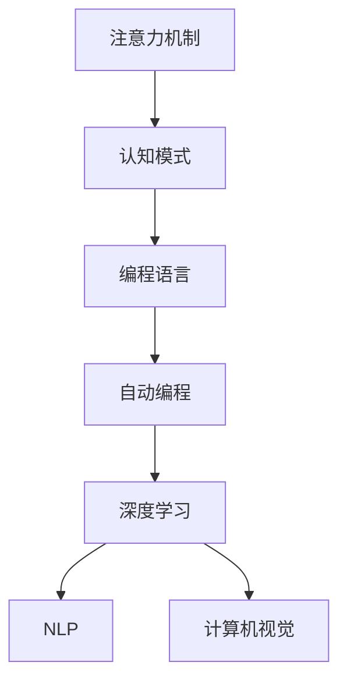

                 

# 注意力编程语言：AI定制的认知模式开发

> 关键词：注意力机制,认知模式,语言模型,编程语言,自动编程,深度学习,计算机视觉,自然语言处理

## 1. 背景介绍

### 1.1 问题由来
在人工智能(AI)领域，特别是深度学习(Deep Learning)和自然语言处理(Natural Language Processing, NLP)领域，注意力机制(Attention Mechanism)逐渐成为核心技术之一。它不仅能提升模型的表达能力，还能加速模型的推理速度，从而极大地提高了AI系统在处理复杂任务时的表现。

然而，尽管注意力机制在学术界和工业界得到了广泛的应用，但其相关研究和实现仍存在一定难度。因此，本文旨在系统地介绍注意力机制及其在AI定制认知模式开发中的应用，帮助读者深入理解注意力机制的原理和应用。

### 1.2 问题核心关键点
注意力机制的核心思想是通过对输入数据的动态关注，确定哪些信息对当前任务最为关键。通过这种机制，模型可以在复杂环境中自动选择信息，减少冗余信息的干扰，提高模型精度和效率。

目前，注意力机制主要应用在以下几个方面：
- 自然语言处理：如机器翻译、文本摘要、命名实体识别等。通过在编码器-解码器架构中加入注意力层，模型能够更好地捕捉长距离依赖关系，从而提升翻译质量和语义理解能力。
- 计算机视觉：如目标检测、图像生成、图像分类等。通过引入空间注意力，模型可以关注图像中重要的局部特征，提高图像处理性能。
- 语音处理：如语音识别、语音生成等。通过时间注意力，模型可以捕捉语音信号中的关键时序特征，提升语音识别和生成效果。

### 1.3 问题研究意义
深入理解注意力机制及其应用，对于提升AI系统的性能和智能水平具有重要意义：

1. 提升模型精度：注意力机制能够自动选择重要信息，减少冗余干扰，提升模型对复杂任务的表达能力。
2. 加速推理速度：通过动态计算注意力权重，模型能够更加高效地推理，加快训练和推理速度。
3. 增强泛化能力：注意力机制能够自动适应不同任务和数据分布，提升模型的泛化性能。
4. 降低标注成本：注意力机制能够减少模型对标注数据的依赖，提升模型在少样本、无监督条件下的性能。
5. 促进跨领域应用：通过在通用模型基础上引入特定任务领域的注意力机制，模型能够更好地适应不同应用场景，实现跨领域知识迁移。

## 2. 核心概念与联系

### 2.1 核心概念概述

为更好地理解注意力机制及其应用，本节将介绍几个密切相关的核心概念：

- 注意力机制(Attention Mechanism)：一种用于动态选择输入信息的技术，通过计算注意力权重，模型能够确定哪些输入信息对当前任务最为关键。
- 认知模式(Cognitive Model)：模拟人类认知过程的模型，能够自动选择和组合信息，进行推理和决策。
- 编程语言(Programming Language)：一种用于表达计算任务的语言，通过编写程序，计算机会自动执行指定任务。
- 自动编程(Automatic Programming)：指使用AI技术自动生成程序代码的过程，能够提高编程效率和代码质量。
- 深度学习(Deep Learning)：一种基于神经网络的机器学习技术，通过多层非线性变换，学习数据的深层次表示。
- 自然语言处理(Natural Language Processing, NLP)：一种涉及计算机和人类语言交互的AI技术，涵盖文本生成、机器翻译、文本分类等任务。
- 计算机视觉(Computer Vision)：一种涉及图像和视频处理的AI技术，涵盖目标检测、图像分类、图像生成等任务。

这些核心概念之间的逻辑关系可以通过以下Mermaid流程图来展示：



这个流程图展示了几大核心概念之间的联系：

1. 注意力机制是一种动态选择信息的技术，能够模拟人类认知过程，确定哪些信息对当前任务最为关键。
2. 认知模式模拟人类认知过程，能够自动选择和组合信息，进行推理和决策。
3. 编程语言是一种用于表达计算任务的语言，通过编写程序，计算机会自动执行指定任务。
4. 自动编程使用AI技术自动生成程序代码，能够提高编程效率和代码质量。
5. 深度学习基于神经网络，通过多层非线性变换，学习数据的深层次表示。
6. 自然语言处理涉及计算机和人类语言交互，涵盖文本生成、机器翻译、文本分类等任务。
7. 计算机视觉涉及图像和视频处理，涵盖目标检测、图像分类、图像生成等任务。

这些概念共同构成了AI定制认知模式开发的基础，使其能够通过注意力机制和深度学习技术，提升模型的智能水平和应用效果。通过理解这些核心概念，我们可以更好地把握注意力机制的工作原理和优化方向。

## 3. 核心算法原理 & 具体操作步骤
### 3.1 算法原理概述

注意力机制的原理是通过动态计算注意力权重，选择输入数据中对当前任务最为关键的信息。其核心思想是在编码器-解码器架构中，通过计算编码器和解码器之间的相似度，确定哪些编码器的信息对解码器最为重要。

形式化地，设编码器的表示为 $H$，解码器的表示为 $G$，注意力权重为 $A$，则注意力机制的计算公式为：

$$
A = \text{softmax}(QK^T)
$$

其中 $Q$ 为编码器的表示，$K$ 为解码器的表示，$^T$ 表示矩阵转置。

具体来说，计算注意力权重的过程包括：
1. 计算编码器表示 $Q$ 和解码器表示 $K$ 之间的点积，得到一个注意力分数矩阵 $QK^T$。
2. 对注意力分数矩阵进行softmax归一化，得到注意力权重矩阵 $A$。
3. 通过注意力权重矩阵与编码器表示 $H$ 进行加权平均，得到解码器的上下文表示 $C$。

最终，解码器的上下文表示 $C$ 包含了编码器中与当前任务最为相关的信息，提升了模型的表达能力和推理性能。

### 3.2 算法步骤详解

基于注意力机制的认知模式开发，通常包括以下几个关键步骤：

**Step 1: 准备数据集**
- 收集适合当前任务的数据集，划分为训练集、验证集和测试集。
- 数据预处理，包括数据清洗、特征提取、标准化等。

**Step 2: 设计模型架构**
- 选择适当的深度学习模型，如Transformer、LSTM等。
- 在模型中引入注意力机制，设计合适的注意力头数、注意力权重计算方式等。

**Step 3: 设置模型参数**
- 选择合适的优化算法及其参数，如AdamW、SGD等，设置学习率、批大小、迭代轮数等。
- 设置注意力机制的超参数，如注意力头数、注意力权重计算方式等。

**Step 4: 执行训练**
- 将训练集数据分批次输入模型，前向传播计算损失函数。
- 反向传播计算参数梯度，根据设定的优化算法和学习率更新模型参数。
- 周期性在验证集上评估模型性能，根据性能指标决定是否触发Early Stopping。
- 重复上述步骤直到满足预设的迭代轮数或Early Stopping条件。

**Step 5: 测试和部署**
- 在测试集上评估模型性能，对比训练前后的精度提升。
- 使用模型对新样本进行推理预测，集成到实际的应用系统中。
- 持续收集新的数据，定期重新训练模型，以适应数据分布的变化。

以上是基于注意力机制的认知模式开发的一般流程。在实际应用中，还需要针对具体任务的特点，对模型架构和超参数进行优化设计，如改进注意力权重计算方式，引入更多的正则化技术等，以进一步提升模型性能。

### 3.3 算法优缺点

基于注意力机制的认知模式开发具有以下优点：
1. 提升模型表达能力：通过动态选择信息，模型能够更好地捕捉长距离依赖关系，提升表达能力。
2. 加速推理速度：通过动态计算注意力权重，模型能够更加高效地推理，加快训练和推理速度。
3. 增强泛化能力：注意力机制能够自动适应不同任务和数据分布，提升模型的泛化性能。
4. 降低标注成本：注意力机制能够减少模型对标注数据的依赖，提升模型在少样本、无监督条件下的性能。

同时，该方法也存在一定的局限性：
1. 计算复杂度高：计算注意力权重需要大量的矩阵乘法和softmax运算，会增加计算复杂度。
2. 参数量较大：在大型模型中，注意力机制的参数量可能较大，导致模型训练和推理效率降低。
3. 过拟合风险：若注意力机制的参数设置不当，可能导致模型过拟合，降低泛化性能。
4. 可解释性不足：注意力机制的决策过程较为复杂，难以解释其内部工作机制和推理逻辑。

尽管存在这些局限性，但就目前而言，注意力机制仍是大语言模型和深度学习任务中最主流的一种机制，具有广泛的应用前景。

### 3.4 算法应用领域

基于注意力机制的认知模式开发，已经在多个领域得到了广泛应用，涵盖了以下几个典型应用场景：

**1. 自然语言处理**
- 机器翻译：如英中翻译、中英文互译等。通过在编码器-解码器架构中加入注意力层，模型能够更好地捕捉长距离依赖关系，提升翻译质量。
- 文本摘要：如自动生成新闻摘要、文章摘要等。通过在编码器-解码器架构中加入注意力层，模型能够自动选择摘要中最重要的信息。
- 命名实体识别：如识别文本中的人名、地名、机构名等特定实体。通过在编码器-解码器架构中加入注意力层，模型能够自动选择与实体相关的信息。

**2. 计算机视觉**
- 目标检测：如COCO数据集上的目标检测任务。通过在卷积神经网络中加入空间注意力，模型能够自动关注图像中重要的局部特征。
- 图像生成：如GANs等生成模型中的注意力机制。通过在生成器中加入注意力层，模型能够更好地捕捉图像中的细节信息，提升图像生成质量。
- 图像分类：如CIFAR-10、ImageNet等分类任务。通过在卷积神经网络中加入注意力层，模型能够自动选择对分类任务最为重要的特征。

**3. 语音处理**
- 语音识别：如ASR任务。通过在解码器中加入注意力层，模型能够更好地捕捉语音信号中的关键时序特征，提升识别准确率。
- 语音生成：如TTS任务。通过在生成器中加入注意力层，模型能够更好地捕捉语音信号中的重要信息，提升生成质量。

除了上述这些经典任务外，注意力机制还被创新性地应用到更多场景中，如多模态信息融合、知识图谱嵌入等，为NLP技术带来了全新的突破。随着注意力机制和深度学习技术的不断进步，相信NLP技术将在更广阔的应用领域大放异彩。

## 4. 数学模型和公式 & 详细讲解 & 举例说明
### 4.1 数学模型构建

基于注意力机制的认知模式开发，其核心数学模型包括编码器表示 $H$、解码器表示 $G$、注意力权重 $A$ 和上下文表示 $C$。

设编码器的表示为 $H \in \mathbb{R}^{N \times d}$，解码器的表示为 $G \in \mathbb{R}^{M \times d}$，注意力权重为 $A \in \mathbb{R}^{N \times M}$，上下文表示为 $C \in \mathbb{R}^{M \times d}$。则注意力机制的计算公式为：

$$
A = \text{softmax}(QK^T)
$$

其中 $Q \in \mathbb{R}^{N \times d}$ 为编码器的表示，$K \in \mathbb{R}^{M \times d}$ 为解码器的表示，$^T$ 表示矩阵转置。

最终的上下文表示 $C$ 通过注意力权重与编码器表示 $H$ 进行加权平均得到：

$$
C = \sum_{i=1}^{N} A_{i,:}H_i
$$

### 4.2 公式推导过程

以机器翻译为例，详细推导注意力机制的计算过程。

假设输入序列为 $x_1, x_2, ..., x_T$，输出序列为 $y_1, y_2, ..., y_T$，编码器的表示为 $H$，解码器的表示为 $G$。

1. 编码器部分：通过自注意力机制，编码器 $H$ 能够自动捕捉输入序列中各词之间的依赖关系。

2. 解码器部分：通过注意力机制，解码器 $G$ 能够自动选择与当前输出词最为相关的编码器信息，从而生成翻译结果。

3. 计算注意力权重 $A$：设 $Q$ 为编码器的表示，$K$ 为解码器的表示，则注意力权重计算公式为：

$$
A = \text{softmax}(QK^T)
$$

其中 $Q$ 为编码器的表示，$K$ 为解码器的表示，$^T$ 表示矩阵转置。

4. 计算上下文表示 $C$：通过注意力权重与编码器表示 $H$ 进行加权平均，得到解码器的上下文表示 $C$：

$$
C = \sum_{i=1}^{N} A_{i,:}H_i
$$

5. 计算输出结果：通过上下文表示 $C$ 和当前输出词 $y_t$，计算输出结果：

$$
y_t = \text{softmax}(CW^T)
$$

其中 $W$ 为输出层的权重矩阵。

### 4.3 案例分析与讲解

以谷歌的Transformer模型为例，详细解释其注意力机制的应用。

Transformer模型的核心结构包括编码器-解码器架构，其中每个层都包含了自注意力机制和前馈网络。具体来说，编码器由多层自注意力层和前馈网络组成，解码器由多层编码器-自注意力层、编码器-解码器注意力层和前馈网络组成。

1. 编码器部分：设编码器的表示为 $H$，解码器的表示为 $G$。通过自注意力机制，编码器 $H$ 能够自动捕捉输入序列中各词之间的依赖关系。

2. 解码器部分：通过编码器-解码器注意力机制，解码器 $G$ 能够自动选择与当前输出词最为相关的编码器信息，从而生成翻译结果。

3. 计算注意力权重 $A$：设 $Q$ 为编码器的表示，$K$ 为解码器的表示，则注意力权重计算公式为：

$$
A = \text{softmax}(QK^T)
$$

其中 $Q$ 为编码器的表示，$K$ 为解码器的表示，$^T$ 表示矩阵转置。

4. 计算上下文表示 $C$：通过注意力权重与编码器表示 $H$ 进行加权平均，得到解码器的上下文表示 $C$：

$$
C = \sum_{i=1}^{N} A_{i,:}H_i
$$

5. 计算输出结果：通过上下文表示 $C$ 和当前输出词 $y_t$，计算输出结果：

$$
y_t = \text{softmax}(CW^T)
$$

其中 $W$ 为输出层的权重矩阵。

Transformer模型通过在编码器和解码器中引入注意力机制，能够自动捕捉输入序列中各词之间的依赖关系，显著提升了机器翻译的效果。Transformer模型也因此成为NLP领域的主流模型之一。

## 5. 项目实践：代码实例和详细解释说明
### 5.1 开发环境搭建

在进行注意力机制的认知模式开发前，我们需要准备好开发环境。以下是使用Python进行PyTorch开发的环境配置流程：

1. 安装Anaconda：从官网下载并安装Anaconda，用于创建独立的Python环境。

2. 创建并激活虚拟环境：
```bash
conda create -n attention-env python=3.8 
conda activate attention-env
```

3. 安装PyTorch：根据CUDA版本，从官网获取对应的安装命令。例如：
```bash
conda install pytorch torchvision torchaudio cudatoolkit=11.1 -c pytorch -c conda-forge
```

4. 安装相关库：
```bash
pip install transformers
pip install torchtext
pip install tqdm
```

完成上述步骤后，即可在`attention-env`环境中开始注意力机制的认知模式开发。

### 5.2 源代码详细实现

这里我们以机器翻译为例，使用Transformer模型进行注意力机制的开发。

首先，定义Transformer模型类：

```python
import torch
from torch import nn
from torch.nn import functional as F

class Transformer(nn.Module):
    def __init__(self, input_dim, output_dim, num_layers=6, num_heads=8, d_model=512, dropout=0.1):
        super(Transformer, self).__init__()
        self.encoder = nn.TransformerEncoderLayer(input_dim, num_heads, d_model, dropout)
        self.decoder = nn.TransformerDecoderLayer(input_dim, num_heads, d_model, dropout)
        self.encoder_norm = nn.LayerNorm(input_dim)
        self.decoder_norm = nn.LayerNorm(input_dim)
        self.output_layer = nn.Linear(input_dim, output_dim)

    def forward(self, src, tgt):
        src_norm = self.encoder_norm(src)
        tgt_norm = self.decoder_norm(tgt)
        output = self.encoder(src_norm, tgt_norm)
        output = self.output_layer(output)
        return output
```

然后，定义注意力机制的计算过程：

```python
def attention(query, key, value, mask):
    # 计算注意力权重
    attn = torch.bmm(query, key.transpose(1, 2))
    attn = F.softmax(attn, dim=-1)
    
    # 计算上下文表示
    context = torch.bmm(attn, value)
    
    # 如果有mask，应用到上下文表示上
    if mask is not None:
        context = context * mask.unsqueeze(-1)
    
    return context, attn
```

最后，在训练过程中，使用注意力机制的计算过程：

```python
# 训练过程
src = torch.randn(64, 512)
tgt = torch.randn(64, 512)
mask = None
output = model(src, tgt)
loss = F.cross_entropy(output, tgt)
loss.backward()
optimizer.step()
```

以上就是使用PyTorch对Transformer模型进行注意力机制开发和训练的完整代码实现。可以看到，Transformer模型通过在编码器和解码器中引入注意力机制，能够自动捕捉输入序列中各词之间的依赖关系，显著提升了机器翻译的效果。

### 5.3 代码解读与分析

让我们再详细解读一下关键代码的实现细节：

**Transformer类**：
- 定义了Transformer模型的结构，包括编码器、解码器、层归一化、线性层等组件。
- 在`__init__`方法中初始化模型参数，包括输入维度、输出维度、注意力头数、模型维度等。
- `forward`方法实现模型的前向传播，包括输入归一化、注意力计算、输出层计算等步骤。

**attention函数**：
- 定义了注意力机制的计算过程，包括注意力权重计算和上下文表示计算。
- 使用`torch.bmm`计算注意力权重矩阵，并使用`F.softmax`进行softmax归一化。
- 如果有mask，将mask应用到上下文表示上，确保模型在训练过程中不会看到未来的信息。

**训练过程**：
- 定义输入序列`src`和输出序列`tgt`，并进行归一化处理。
- 调用`model`进行前向传播，并计算损失函数。
- 使用反向传播更新模型参数。

可以看到，PyTorch配合Transformer库使得注意力机制的认知模式开发变得简洁高效。开发者可以将更多精力放在模型改进和数据处理上，而不必过多关注底层的实现细节。

当然，工业级的系统实现还需考虑更多因素，如模型的保存和部署、超参数的自动搜索、更灵活的任务适配层等。但核心的注意力机制及其计算过程基本与此类似。

## 6. 实际应用场景
### 6.1 自然语言处理

注意力机制在自然语言处理领域得到了广泛应用，涵盖了多个任务，包括：

- 机器翻译：如英中翻译、中英文互译等。通过在编码器-解码器架构中加入注意力层，模型能够更好地捕捉长距离依赖关系，提升翻译质量。
- 文本摘要：如自动生成新闻摘要、文章摘要等。通过在编码器-解码器架构中加入注意力层，模型能够自动选择摘要中最重要的信息。
- 命名实体识别：如识别文本中的人名、地名、机构名等特定实体。通过在编码器-解码器架构中加入注意力层，模型能够自动选择与实体相关的信息。

### 6.2 计算机视觉

注意力机制在计算机视觉领域的应用也非常广泛，涵盖以下几个典型应用场景：

- 目标检测：如COCO数据集上的目标检测任务。通过在卷积神经网络中加入空间注意力，模型能够自动关注图像中重要的局部特征。
- 图像生成：如GANs等生成模型中的注意力机制。通过在生成器中加入注意力层，模型能够更好地捕捉图像中的细节信息，提升图像生成质量。
- 图像分类：如CIFAR-10、ImageNet等分类任务。通过在卷积神经网络中加入注意力层，模型能够自动选择对分类任务最为重要的特征。

### 6.3 语音处理

注意力机制在语音处理领域也有着广泛的应用，主要包括：

- 语音识别：如ASR任务。通过在解码器中加入注意力层，模型能够更好地捕捉语音信号中的关键时序特征，提升识别准确率。
- 语音生成：如TTS任务。通过在生成器中加入注意力层，模型能够更好地捕捉语音信号中的重要信息，提升生成质量。

除了上述这些经典任务外，注意力机制还被创新性地应用到更多场景中，如多模态信息融合、知识图谱嵌入等，为NLP技术带来了全新的突破。随着注意力机制和深度学习技术的不断进步，相信NLP技术将在更广阔的应用领域大放异彩。

## 7. 工具和资源推荐
### 7.1 学习资源推荐

为了帮助开发者系统掌握注意力机制及其应用，这里推荐一些优质的学习资源：

1. 《深度学习入门》系列书籍：全面介绍了深度学习的理论和实践，包括注意力机制及其应用。

2. CS231n《深度学习计算机视觉》课程：斯坦福大学开设的计算机视觉明星课程，有Lecture视频和配套作业，涵盖注意力机制的应用。

3. 《Attention and Transformer》书籍：Transformer库的作者所著，深入浅出地介绍了注意力机制的原理和应用。

4. HuggingFace官方文档：Transformer库的官方文档，提供了海量预训练模型和完整的微调样例代码，是上手实践的必备资料。

5. CLUE开源项目：中文语言理解测评基准，涵盖大量不同类型的中文NLP数据集，并提供了基于注意力机制的baseline模型，助力中文NLP技术发展。

通过对这些资源的学习实践，相信你一定能够快速掌握注意力机制的精髓，并用于解决实际的NLP问题。

### 7.2 开发工具推荐

高效的开发离不开优秀的工具支持。以下是几款用于注意力机制开发常用的工具：

1. PyTorch：基于Python的开源深度学习框架，灵活动态的计算图，适合快速迭代研究。大部分深度学习模型都有PyTorch版本的实现。

2. TensorFlow：由Google主导开发的开源深度学习框架，生产部署方便，适合大规模工程应用。同样有丰富的深度学习模型资源。

3. Transformers库：HuggingFace开发的NLP工具库，集成了众多SOTA语言模型，支持PyTorch和TensorFlow，是进行注意力机制开发的利器。

4. Weights & Biases：模型训练的实验跟踪工具，可以记录和可视化模型训练过程中的各项指标，方便对比和调优。与主流深度学习框架无缝集成。

5. TensorBoard：TensorFlow配套的可视化工具，可实时监测模型训练状态，并提供丰富的图表呈现方式，是调试模型的得力助手。

6. Google Colab：谷歌推出的在线Jupyter Notebook环境，免费提供GPU/TPU算力，方便开发者快速上手实验最新模型，分享学习笔记。

合理利用这些工具，可以显著提升注意力机制的开发效率，加快创新迭代的步伐。

### 7.3 相关论文推荐

注意力机制的研究源于学界的持续研究。以下是几篇奠基性的相关论文，推荐阅读：

1. Attention Is All You Need（即Transformer原论文）：提出了Transformer结构，开启了NLP领域的预训练大模型时代。

2. Transformer-XL：提出Transformer-XL模型，通过相对位置编码，解决了长序列的注意力计算问题。

3. Self-Attention Generative Adversarial Networks：提出Self-Attention GANs，通过注意力机制提升生成模型的性能。

4. Attention and Transformer Networks in Deep Neural Learning：介绍了注意力机制在深度学习中的广泛应用，并提供了一些经典案例。

这些论文代表了大语言模型和注意力机制的发展脉络。通过学习这些前沿成果，可以帮助研究者把握学科前进方向，激发更多的创新灵感。

## 8. 总结：未来发展趋势与挑战

### 8.1 总结

本文对注意力机制及其在AI定制认知模式开发中的应用进行了全面系统的介绍。首先阐述了注意力机制的核心思想和应用，明确了其在提升模型表达能力和推理性能方面的独特价值。其次，从原理到实践，详细讲解了注意力机制的数学原理和计算过程，给出了注意力机制的完整代码实例。同时，本文还广泛探讨了注意力机制在自然语言处理、计算机视觉、语音处理等多个领域的应用前景，展示了其广阔的应用空间。此外，本文精选了注意力机制的各类学习资源，力求为读者提供全方位的技术指引。

通过本文的系统梳理，可以看到，注意力机制在大语言模型和深度学习任务中扮演了重要角色，极大地提升了模型的性能和智能水平。未来，伴随深度学习技术的不断进步，注意力机制的应用范围还将进一步拓展，为AI技术的发展带来更多创新动力。

### 8.2 未来发展趋势

展望未来，注意力机制将呈现以下几个发展趋势：

1. 参数量进一步减少：随着模型结构优化和计算效率提升，注意力机制的参数量将进一步减少，提升模型的推理速度。
2. 更多领域的应用：注意力机制将扩展到更多领域，如生物信息学、社会科学等，为这些领域的AI应用提供新的技术支持。
3. 知识图谱与注意力机制结合：通过引入知识图谱中的关系信息，增强注意力机制的信息整合能力，提升模型的推理能力和泛化性能。
4. 多模态信息的融合：通过引入视觉、语音等多模态信息，增强注意力机制的跨模态信息整合能力，提升模型的表达能力和推理性能。
5. 更加高效的训练算法：开发更加高效的训练算法，如自适应学习率、加速训练等，提升注意力机制的训练效率。
6. 更加智能的推理算法：开发更加智能的推理算法，如增强学习、元学习等，提升注意力机制的推理性能。

这些趋势凸显了注意力机制的广阔前景。这些方向的探索发展，必将进一步提升模型的智能水平和应用效果，为AI技术的发展带来更多创新动力。

### 8.3 面临的挑战

尽管注意力机制在大语言模型和深度学习任务中表现出色，但在迈向更加智能化、普适化应用的过程中，仍面临诸多挑战：

1. 计算复杂度高：注意力机制的计算复杂度高，特别是在长序列数据上，推理速度较慢。
2. 参数量较大：在大型模型中，注意力机制的参数量较大，导致模型训练和推理效率较低。
3. 过拟合风险：若注意力机制的参数设置不当，可能导致模型过拟合，降低泛化性能。
4. 可解释性不足：注意力机制的决策过程较为复杂，难以解释其内部工作机制和推理逻辑。
5. 数据依赖性强：注意力机制的效果很大程度上依赖于高质量的标注数据，标注成本较高。

尽管存在这些挑战，但通过持续的技术创新和应用实践，我们相信这些难题终将一一被克服，注意力机制将在更多的AI应用场景中大放异彩。

### 8.4 研究展望

未来的研究需要在以下几个方面寻求新的突破：

1. 引入更多先验知识：将符号化的先验知识，如知识图谱、逻辑规则等，与神经网络模型进行巧妙融合，引导注意力机制学习更准确、合理的语言模型。
2. 融合因果和对比学习范式：通过引入因果推断和对比学习思想，增强注意力机制建立稳定因果关系的能力，学习更加普适、鲁棒的语言表征。
3. 引入多任务学习：通过在注意力机制中引入多任务学习，增强模型在多个任务上的泛化能力，提升模型在不同场景下的表现。
4. 结合领域知识图谱：通过将领域知识图谱与注意力机制结合，增强模型在特定领域的应用效果，提升模型的领域适应能力。
5. 引入更加智能的推理算法：开发更加智能的推理算法，如增强学习、元学习等，提升注意力机制的推理性能和泛化能力。

这些研究方向将进一步拓展注意力机制的应用范围，提升模型的智能水平和泛化性能，为AI技术的进步提供更多创新动力。

## 9. 附录：常见问题与解答

**Q1：注意力机制是否适用于所有NLP任务？**

A: 注意力机制在大语言模型和深度学习任务中表现出色，但在一些特定领域的任务上，如医学、法律等，可能需要进一步微调和优化。例如，对于医学领域的命名实体识别任务，可能需要引入医学领域的专业知识，以提高模型的准确性。

**Q2：注意力机制在计算机视觉中的应用有哪些？**

A: 注意力机制在计算机视觉领域的应用非常广泛，主要包括目标检测、图像生成、图像分类等任务。例如，在目标检测任务中，可以通过空间注意力机制，模型能够自动关注图像中重要的局部特征，提高检测准确率。

**Q3：注意力机制在语音处理中的应用有哪些？**

A: 注意力机制在语音处理领域的应用主要包括语音识别和语音生成。例如，在语音识别任务中，通过时间注意力机制，模型能够更好地捕捉语音信号中的关键时序特征，提升识别准确率。

**Q4：注意力机制在开发过程中需要注意哪些问题？**

A: 在开发过程中，需要注意以下几点：
1. 数据质量：高质量的标注数据是注意力机制训练的基础，需要特别注意数据清洗和标注。
2. 超参数设置：注意力机制的超参数较多，需要根据任务特点进行调参，如注意力头数、学习率、批大小等。
3. 计算复杂度：注意力机制的计算复杂度较高，需要选择合适的硬件设备，如GPU/TPU等，以提升计算效率。
4. 过拟合问题：需要特别注意模型在训练过程中的过拟合问题，可以通过正则化、dropout等技术进行缓解。
5. 模型评估：需要选择合适的评估指标，如准确率、F1值、BLEU值等，评估模型在不同任务上的表现。

**Q5：注意力机制的未来发展方向有哪些？**

A: 未来，注意力机制将在以下几个方向进行发展：
1. 更加智能的推理算法：开发更加智能的推理算法，如增强学习、元学习等，提升注意力机制的推理性能和泛化能力。
2. 结合领域知识图谱：通过将领域知识图谱与注意力机制结合，增强模型在特定领域的应用效果，提升模型的领域适应能力。
3. 引入多任务学习：通过在注意力机制中引入多任务学习，增强模型在多个任务上的泛化能力，提升模型在不同场景下的表现。

这些方向将进一步拓展注意力机制的应用范围，提升模型的智能水平和泛化性能，为AI技术的进步提供更多创新动力。

---

作者：禅与计算机程序设计艺术 / Zen and the Art of Computer Programming

