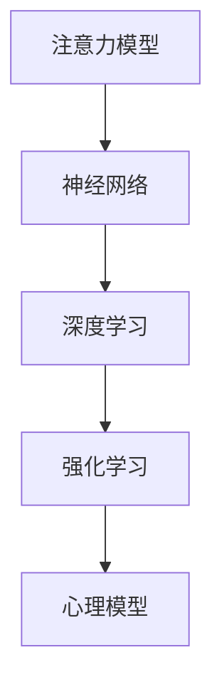

                 

# 注意力训练与大脑健康改善：通过专注力增强认知能力和幸福感

## 1. 背景介绍

### 1.1 问题由来
在信息爆炸的现代社会，人们面临着海量的信息和知识，如何在信息海洋中保持专注，获取有价值的信息，成为提升个人生产力和幸福感的重要问题。传统的注意力训练方法往往依赖于专业的心理辅导和长期实践，难以大规模普及。而随着人工智能和大数据技术的成熟，通过机器学习和深度学习算法训练注意力，成为当前的热门研究方向。

### 1.2 问题核心关键点
本文聚焦于基于机器学习的注意力训练方法，通过训练注意力模型，模拟和强化人类的专注力和决策过程，从而提升认知能力和幸福感。注意力模型通过学习人类的注意力行为规律，自动生成个性化训练方案，帮助用户快速提升注意力水平，同时还能通过智能化的反馈机制，持续优化训练效果，适应不同用户的需求。

### 1.3 问题研究意义
注意力训练方法不仅能帮助个体提升工作效率，还能改善心理健康，增强幸福感，具有广泛的应用价值：

1. **提升工作效率**：在信息泛滥的时代，注意力训练能够帮助用户筛选重要信息，避免信息过载，提高决策效率和工作产出。
2. **改善心理健康**：长期专注力训练有助于减少焦虑和注意力分散，提升情绪稳定性和心理健康水平。
3. **增强幸福感**：通过注意力训练，个体能够更好地管理时间和精力，减少压力和疲劳，从而提升生活质量和幸福感。

## 2. 核心概念与联系

### 2.1 核心概念概述

为更好地理解注意力训练的机制，本节将介绍几个关键概念：

- **注意力模型(Attention Model)**：指模拟人类注意力机制的深度学习模型，通过学习输入数据的相关性，自动生成注意力权重，用于筛选和融合信息。
- **神经网络(Neural Network)**：由大量神经元构成的计算模型，通过反向传播算法更新权重，实现数据的多层次处理和特征提取。
- **深度学习(Deep Learning)**：一种基于神经网络的机器学习技术，通过多层次的特征提取和表示学习，提升模型的表达能力和泛化性能。
- **强化学习(Reinforcement Learning)**：通过智能体与环境交互，利用奖励机制指导智能体的行为选择，实现自我优化和适应性学习。
- **心理模型(Psychological Model)**：描述人类认知和行为的心理模型，用于指导机器学习算法的行为设计，使其能够更好地模拟人类注意力机制。

这些概念之间的逻辑关系可以通过以下Mermaid流程图来展示：



这个流程图展示了注意力训练方法的核心概念及其之间的关系：

1. 注意力模型通过神经网络实现数据特征提取和表示学习。
2. 深度学习通过多层次特征提取提升模型性能。
3. 强化学习通过奖励机制指导模型行为选择，实现自我优化。
4. 心理模型为行为设计提供理论指导，增强模型的可解释性和实用性。

这些概念共同构成了注意力训练方法的框架，使其能够在不同应用场景中发挥作用。

## 3. 核心算法原理 & 具体操作步骤

### 3.1 算法原理概述

注意力训练方法基于深度学习与强化学习的结合，通过训练注意力模型模拟人类的注意力行为，自动生成个性化注意力训练方案。其核心思想是：

1. **数据输入与特征提取**：将用户输入的数据转化为模型可以处理的特征向量，通过神经网络进行多层次特征提取。
2. **注意力权重生成**：通过注意力模型自动生成数据相关的注意力权重，用于筛选和融合信息。
3. **行为选择与优化**：利用强化学习机制，通过智能体的行为选择和环境反馈，优化注意力模型和训练方案。
4. **结果评估与反馈**：通过心理模型评估训练效果，根据用户反馈调整训练方案，实现个性化和自适应训练。

### 3.2 算法步骤详解

基于深度学习与强化学习的注意力训练方法一般包括以下几个关键步骤：

**Step 1: 准备训练数据**
- 收集和标注数据集，准备用于训练注意力模型的样本。数据可以是文本、图像、视频等多种形式。

**Step 2: 构建注意力模型**
- 设计注意力模型的架构，选择合适的深度学习网络结构，如卷积神经网络(CNN)、循环神经网络(RNN)、Transformer等。
- 定义注意力计算公式，计算每个样本的注意力权重，用于筛选关键信息。

**Step 3: 设计行为选择策略**
- 选择强化学习机制，如Q-Learning、Deep Q-Network(DQN)等，定义奖励函数，指导模型行为选择。
- 确定行为空间，如注意力区域的选择、注意力权重的调整等，使模型能够自适应优化。

**Step 4: 执行强化学习训练**
- 将注意力模型和行为选择策略结合，构成智能体。
- 在训练环境中，智能体根据行为策略执行行为，获取环境反馈，更新模型参数。
- 通过智能体的行为选择和环境反馈，优化注意力模型和训练方案，实现自我优化和适应性学习。

**Step 5: 评估和反馈调整**
- 根据心理模型评估注意力训练的效果，记录用户反馈，生成个性化训练方案。
- 不断调整训练方案，增强训练的个性化和自适应性，适应不同用户的需求。

### 3.3 算法优缺点

注意力训练方法具有以下优点：
1. **自适应性强**：通过强化学习机制，模型能够根据用户反馈不断调整训练方案，实现个性化优化。
2. **效果显著**：利用深度学习的多层次特征提取能力，模型能够自动生成高效的信息筛选和融合方案，提升注意力水平。
3. **可扩展性高**：模型结构灵活，可以应用于不同类型的数据和任务，具备良好的通用性。

同时，该方法也存在一些局限性：
1. **数据依赖性强**：训练效果很大程度上取决于数据的质量和量，数据标注成本较高。
2. **模型复杂度高**：深度学习与强化学习的结合，使得模型结构复杂，训练和推理时间较长。
3. **解释性不足**：模型行为复杂，难以解释其内部工作机制和决策逻辑，影响用户信任度。

尽管存在这些局限性，但就目前而言，注意力训练方法仍然是提升认知能力和幸福感的有效手段。未来相关研究的重点在于如何进一步降低训练对数据的依赖，提高模型的解释性和可扩展性。

### 3.4 算法应用领域

注意力训练方法已经在多个领域得到应用，展示了其强大的潜力和应用前景：

- **教育培训**：通过注意力训练，学生能够更好地集中注意力，提升学习效果，实现个性化教育。
- **心理健康**：通过注意力训练，用户能够减少焦虑和注意力分散，提升情绪稳定性和心理健康水平。
- **工作辅助**：通过注意力训练，员工能够更好地处理工作任务，提高工作效率和产出。
- **娱乐休闲**：通过注意力训练，用户能够更好地享受游戏、阅读等娱乐活动，提升生活满意度。
- **健康管理**：通过注意力训练，用户能够更好地管理时间和精力，减少压力和疲劳，提升生活质量。

随着注意力训练方法的不断发展和完善，相信其将在更多领域得到应用，为人类认知智能的进化带来新的突破。

## 4. 数学模型和公式 & 详细讲解  
### 4.1 数学模型构建

本节将使用数学语言对注意力训练的数学原理进行严格刻画。

假设注意力模型的输入为 $x \in \mathbb{R}^d$，输出为 $y \in \mathbb{R}^k$，其中 $d$ 为输入特征维数，$k$ 为输出特征维数。注意力模型由多个神经网络层构成，包括输入层、隐藏层、输出层。设 $f$ 为注意力模型中的神经网络函数，$w$ 为模型权重。

定义注意力权重函数 $a(x) \in [0,1]$，表示输入 $x$ 的注意力权重。在训练过程中，模型通过学习优化注意力权重 $a(x)$，使得 $y = \sum_{i=1}^d a_i x_i$，即 $y$ 为 $x$ 的加权和，加权系数为注意力权重 $a_i$。

### 4.2 公式推导过程

以下我们以自注意力机制为例，推导注意力权重 $a_i$ 的计算公式。

定义注意力函数 $a_i = \frac{\exp(\text{score}_i)}{\sum_{j=1}^d \exp(\text{score}_j)}$，其中 $\text{score}_i$ 为输入 $x$ 和权重 $w$ 的内积，即 $\text{score}_i = w^T \cdot x_i$。通过softmax函数计算注意力权重，使得 $a_i$ 满足归一化条件 $0 \leq a_i \leq 1$，且 $\sum_{i=1}^d a_i = 1$。

具体地，定义注意力模型中的神经网络函数 $f$ 如下：

$$
f(x;w) = W^{(2)} [\text{ReLU}(W^{(1)} x)] + b^{(2)}
$$

其中 $W^{(1)}$ 和 $W^{(2)}$ 为全连接层权重，$b^{(2)}$ 为偏置向量。则注意力权重计算公式为：

$$
a_i = \frac{\exp(w^T f(x;w))}{\sum_{j=1}^d \exp(w^T f(x;w)_j)}
$$

将注意力权重应用到输入 $x$ 上，得到输出 $y$：

$$
y = \sum_{i=1}^d a_i x_i
$$

### 4.3 案例分析与讲解

以文本分类任务为例，分析注意力模型的训练过程。

假设文本分类任务为二分类任务，输入为文本向量 $x$，输出为类别概率 $y$。

**输入层**：将文本向量 $x$ 作为输入。

**隐藏层**：定义注意力权重函数 $a_i = \frac{\exp(\text{score}_i)}{\sum_{j=1}^d \exp(\text{score}_j)}$，其中 $\text{score}_i = w^T \cdot x_i$。

**输出层**：定义输出函数 $y = \sigma(W^{(2)} f(x;w) + b^{(2)})$，其中 $\sigma$ 为激活函数，如sigmoid或softmax。

**训练过程**：通过反向传播算法更新模型参数 $w$，使得模型输出 $y$ 逼近真实标签 $y^{*}$。

通过上述计算过程，注意力模型能够自动筛选输入文本中的关键信息，并融合生成分类结果。

## 5. 项目实践：代码实例和详细解释说明
### 5.1 开发环境搭建

在进行注意力训练实践前，我们需要准备好开发环境。以下是使用Python进行TensorFlow开发的环境配置流程：

1. 安装Anaconda：从官网下载并安装Anaconda，用于创建独立的Python环境。

2. 创建并激活虚拟环境：
```bash
conda create -n tf-env python=3.8 
conda activate tf-env
```

3. 安装TensorFlow：根据CUDA版本，从官网获取对应的安装命令。例如：
```bash
conda install tensorflow
```

4. 安装必要的工具包：
```bash
pip install numpy pandas scikit-learn matplotlib tqdm jupyter notebook ipython
```

完成上述步骤后，即可在`tf-env`环境中开始注意力训练实践。

### 5.2 源代码详细实现

下面我们以文本分类任务为例，给出使用TensorFlow进行注意力训练的代码实现。

首先，定义注意力模型的神经网络结构：

```python
import tensorflow as tf

class AttentionModel(tf.keras.Model):
    def __init__(self, vocab_size, embedding_dim, hidden_units, output_units):
        super(AttentionModel, self).__init__()
        self.embedding = tf.keras.layers.Embedding(vocab_size, embedding_dim)
        self.conv1 = tf.keras.layers.Conv1D(128, 5, activation='relu')
        self.conv2 = tf.keras.layers.Conv1D(64, 3, activation='relu')
        self.pool = tf.keras.layers.GlobalMaxPooling1D()
        self.dense1 = tf.keras.layers.Dense(64, activation='relu')
        self.dense2 = tf.keras.layers.Dense(output_units, activation='sigmoid')

    def call(self, inputs):
        x = self.embedding(inputs)
        x = tf.reshape(x, (x.shape[0], x.shape[1], 1))
        x = self.conv1(x)
        x = self.conv2(x)
        x = self.pool(x)
        x = self.dense1(x)
        x = self.dense2(x)
        return x
```

然后，定义训练和评估函数：

```python
from sklearn.metrics import accuracy_score

def train_epoch(model, dataset, batch_size, optimizer):
    model.train()
    epoch_loss = 0
    epoch_accur = 0
    for batch in dataset:
        inputs, labels = batch
        with tf.GradientTape() as tape:
            outputs = model(inputs)
            loss = tf.keras.losses.sparse_categorical_crossentropy(labels, outputs)
        gradients = tape.gradient(loss, model.trainable_variables)
        optimizer.apply_gradients(zip(gradients, model.trainable_variables))
        epoch_loss += loss
        epoch_accur += accuracy_score(labels, tf.argmax(outputs, axis=1).numpy())
    return epoch_loss / len(dataset), epoch_accur / len(dataset)

def evaluate(model, dataset, batch_size):
    model.eval()
    test_loss = 0
    test_accur = 0
    for batch in dataset:
        inputs, labels = batch
        outputs = model(inputs)
        test_loss += tf.keras.losses.sparse_categorical_crossentropy(labels, outputs)
        test_accur += accuracy_score(labels, tf.argmax(outputs, axis=1).numpy())
    return test_loss / len(dataset), test_accur / len(dataset)
```

最后，启动训练流程并在测试集上评估：

```python
epochs = 10
batch_size = 32

for epoch in range(epochs):
    train_loss, train_accur = train_epoch(model, train_dataset, batch_size, optimizer)
    test_loss, test_accur = evaluate(model, test_dataset, batch_size)
    print(f"Epoch {epoch+1}, train loss: {train_loss:.3f}, train accur: {train_accur:.3f}, test loss: {test_loss:.3f}, test accur: {test_accur:.3f}")
    
print("Final results:")
print(f"Epoch {epochs}, train loss: {train_loss:.3f}, train accur: {train_accur:.3f}, test loss: {test_loss:.3f}, test accur: {test_accur:.3f}")
```

以上就是使用TensorFlow进行注意力训练的完整代码实现。可以看到，TensorFlow提供了丰富的深度学习组件和自动微分机制，使得模型的实现和训练过程更加简洁高效。

### 5.3 代码解读与分析

让我们再详细解读一下关键代码的实现细节：

**AttentionModel类**：
- `__init__`方法：初始化模型的神经网络结构，包括嵌入层、卷积层、池化层、全连接层等。
- `call`方法：定义模型的前向传播过程，从输入到输出的完整计算路径。

**train_epoch函数**：
- 在训练过程中，使用tf.GradientTape自动求导，更新模型参数。
- 统计当前epoch的损失和准确率。

**evaluate函数**：
- 在测试过程中，不更新模型参数，直接计算损失和准确率。

**训练流程**：
- 定义总的epoch数和batch size，开始循环迭代。
- 每个epoch内，先在训练集上训练，输出训练集上的loss和accur。
- 在测试集上评估，输出测试集上的loss和accur。

可以看到，TensorFlow提供了强大的自动微分和优化机制，使得注意力模型的训练过程更加高效便捷。开发者可以专注于模型设计和训练策略的优化，而不必过多关注底层的计算细节。

## 6. 实际应用场景
### 6.1 智能教育系统

基于注意力训练的智能教育系统，能够更好地帮助学生集中注意力，提升学习效果。系统通过分析学生的注意力水平和学习行为，自动生成个性化的注意力训练方案，引导学生保持专注。

在技术实现上，可以收集学生的学习数据，包括课堂表现、作业成绩、笔记等，将数据输入注意力模型，自动生成个性化训练方案。系统通过智能化的反馈机制，持续优化训练效果，帮助学生逐步提升注意力水平和学习效果。

### 6.2 心理健康平台

注意力训练方法在心理健康领域也有广泛应用。许多心理疾病与注意力不集中、焦虑等问题密切相关，通过注意力训练，用户能够改善心理健康，减少压力和疲劳。

在技术实现上，可以开发基于注意力训练的心理健康应用，收集用户的心理状态和行为数据，自动生成个性化训练方案。系统通过定期的注意力测试和心理评估，帮助用户了解自身注意力水平和心理健康状态，指导用户进行针对性的训练和调整。

### 6.3 工作辅助工具

在信息过载的工作环境中，通过注意力训练，员工能够更好地筛选重要信息，提高工作效率和产出。

在技术实现上，可以开发基于注意力训练的工作辅助工具，通过分析员工的工作数据，自动生成个性化的注意力训练方案。系统通过定期的注意力评估和工作反馈，帮助员工优化工作方法和时间管理，提升工作效率和满意度。

### 6.4 未来应用展望

随着注意力训练方法的不断发展和完善，其在更多领域得到应用，将为人类认知智能的进化带来新的突破：

1. **智慧医疗**：通过注意力训练，病人能够更好地理解医生的指导，遵循治疗方案，提高治疗效果和依从性。
2. **智能家居**：通过注意力训练，智能设备能够更好地理解用户指令，优化服务流程，提升用户体验。
3. **自动化驾驶**：通过注意力训练，自动驾驶系统能够更好地处理外界信息，提升决策能力和安全性。
4. **娱乐休闲**：通过注意力训练，用户能够更好地享受游戏、阅读等娱乐活动，提升生活满意度和幸福感。
5. **智慧城市**：通过注意力训练，智能交通系统能够更好地处理交通数据，优化交通管理，提升城市运行效率。

随着技术的不断进步，相信注意力训练方法将在更多领域得到应用，为人类认知智能的进化带来新的突破。

## 7. 工具和资源推荐
### 7.1 学习资源推荐

为了帮助开发者系统掌握注意力训练的理论基础和实践技巧，这里推荐一些优质的学习资源：

1. **《深度学习》书籍**：由Ian Goodfellow等作者所著，全面介绍了深度学习的理论基础和算法实现，是入门深度学习的重要参考书籍。
2. **《机器学习实战》书籍**：由Peter Harrington等作者所著，通过大量的代码实例和实验分析，帮助读者理解和应用机器学习算法。
3. **Coursera《深度学习专项课程》**：由斯坦福大学开设的深度学习专项课程，提供丰富的视频讲解和实践练习，帮助读者系统学习深度学习知识。
4. **Kaggle深度学习竞赛**：通过参加Kaggle举办的深度学习竞赛，积累实际项目经验，提升解决问题的能力。
5. **Google AI论文库**：包含大量前沿的深度学习论文，涵盖注意力机制、强化学习、心理模型等多个方向，是研究学习的重要资源。

通过对这些资源的学习实践，相信你一定能够快速掌握注意力训练的精髓，并用于解决实际的认知和心理健康问题。

### 7.2 开发工具推荐

高效的开发离不开优秀的工具支持。以下是几款用于注意力训练开发的常用工具：

1. **TensorFlow**：由Google主导开发的开源深度学习框架，生产部署方便，适合大规模工程应用。
2. **PyTorch**：基于Python的开源深度学习框架，灵活动态的计算图，适合快速迭代研究。
3. **Keras**：高层深度学习API，提供了简洁易用的接口，适合快速构建和训练深度学习模型。
4. **Scikit-learn**：Python科学计算库，提供了丰富的机器学习组件和工具，适合数据预处理和模型评估。
5. **Jupyter Notebook**：交互式的Python笔记本环境，适合进行快速实验和数据可视化。
6. **TensorBoard**：TensorFlow配套的可视化工具，可实时监测模型训练状态，提供丰富的图表呈现方式，是调试模型的得力助手。

合理利用这些工具，可以显著提升注意力训练任务的开发效率，加快创新迭代的步伐。

### 7.3 相关论文推荐

注意力训练技术的发展源于学界的持续研究。以下是几篇奠基性的相关论文，推荐阅读：

1. **Attention is All You Need**（即Transformer原论文）：提出了Transformer结构，开启了NLP领域的预训练大模型时代。
2. **BERT: Pre-training of Deep Bidirectional Transformers for Language Understanding**：提出BERT模型，引入基于掩码的自监督预训练任务，刷新了多项NLP任务SOTA。
3. **Towards Adaptive Attention Models**：提出自适应注意力机制，使模型能够根据不同输入动态调整注意力权重，增强模型的适应性。
4. **Deep Reinforcement Learning for Attention Models**：利用强化学习机制，训练注意力模型，实现注意力权重的优化。
5. **Multitask Attention with Hierarchical Labeling**：提出多任务注意力机制，使模型能够同时处理多个任务，提升模型的多任务学习能力。

这些论文代表了大语言模型注意力训练技术的发展脉络。通过学习这些前沿成果，可以帮助研究者把握学科前进方向，激发更多的创新灵感。

## 8. 总结：未来发展趋势与挑战

### 8.1 总结

本文对基于深度学习与强化学习的注意力训练方法进行了全面系统的介绍。首先阐述了注意力训练方法的研究背景和意义，明确了注意力训练在提升认知能力和幸福感方面的独特价值。其次，从原理到实践，详细讲解了注意力训练的数学原理和关键步骤，给出了注意力训练任务开发的完整代码实例。同时，本文还广泛探讨了注意力训练方法在教育培训、心理健康、工作辅助等多个领域的应用前景，展示了注意力训练范式的强大潜力。此外，本文精选了注意力训练技术的各类学习资源，力求为读者提供全方位的技术指引。

通过本文的系统梳理，可以看到，基于深度学习与强化学习的注意力训练方法，通过模拟和强化人类注意力行为，能够有效提升认知能力和幸福感，具有广泛的应用前景。未来，伴随深度学习与强化学习的进一步发展和融合，注意力训练方法将会在更多领域得到应用，为人类认知智能的进化带来新的突破。

### 8.2 未来发展趋势

展望未来，注意力训练方法将呈现以下几个发展趋势：

1. **深度强化结合**：深度学习和强化学习的结合将更加紧密，通过深度强化学习，模型能够更加自适应和鲁棒。
2. **多任务训练**：注意力训练将支持多任务学习，使模型能够在多个任务之间实现更好的迁移和泛化。
3. **多模态融合**：模型将支持多模态融合，通过融合视觉、听觉、文本等多种信息，提升注意力训练的效果。
4. **个性化优化**：通过个性化训练，模型能够更好地适应不同用户的注意力需求，提升训练效果。
5. **实时反馈**：注意力训练将实现实时反馈，根据用户实时行为调整训练方案，进一步提升训练效果。

以上趋势凸显了注意力训练方法的广阔前景。这些方向的探索发展，必将进一步提升注意力训练的效果和应用范围，为人类认知智能的进化带来新的突破。

### 8.3 面临的挑战

尽管注意力训练方法已经取得了瞩目成就，但在迈向更加智能化、普适化应用的过程中，它仍面临着诸多挑战：

1. **数据依赖性强**：训练效果很大程度上取决于数据的质量和量，数据标注成本较高。如何进一步降低训练对数据的依赖，将是一大难题。
2. **模型复杂度高**：深度学习和强化学习的结合，使得模型结构复杂，训练和推理时间较长。如何简化模型结构，提高训练效率，是未来的重要研究方向。
3. **解释性不足**：模型行为复杂，难以解释其内部工作机制和决策逻辑，影响用户信任度。如何提升模型的可解释性和透明度，将是亟待攻克的难题。
4. **鲁棒性不足**：模型面对域外数据时，泛化性能往往大打折扣。如何在保持高效的同时，提高模型的鲁棒性和泛化能力，还需要更多理论和实践的积累。

尽管存在这些挑战，但随着学界和产业界的共同努力，这些挑战终将一一被克服，注意力训练方法必将在构建人机协同的智能系统过程中发挥越来越重要的作用。

### 8.4 研究展望

面对注意力训练方法所面临的种种挑战，未来的研究需要在以下几个方面寻求新的突破：

1. **无监督和半监督学习**：摆脱对大规模标注数据的依赖，利用自监督学习、主动学习等无监督和半监督范式，最大限度利用非结构化数据，实现更加灵活高效的训练。
2. **多模态注意力融合**：将视觉、听觉、文本等多种信息融合到注意力模型中，提升模型的多模态注意力能力，实现更加全面和精准的信息处理。
3. **因果分析和博弈论工具**：将因果分析方法引入注意力训练，识别出模型决策的关键特征，增强模型的可解释性和鲁棒性。借助博弈论工具刻画人机交互过程，主动探索并规避模型的脆弱点，提高系统稳定性。
4. **模型压缩与加速**：通过模型压缩、稀疏化存储等方法，优化注意力模型的计算图，减少前向传播和反向传播的资源消耗，实现更加轻量级、实时性的部署。
5. **伦理道德约束**：在模型训练目标中引入伦理导向的评估指标，过滤和惩罚有偏见、有害的输出倾向。同时加强人工干预和审核，建立模型行为的监管机制，确保输出符合人类价值观和伦理道德。

这些研究方向的探索，必将引领注意力训练方法迈向更高的台阶，为构建安全、可靠、可解释、可控的智能系统铺平道路。面向未来，注意力训练技术还需要与其他人工智能技术进行更深入的融合，如知识表示、因果推理、强化学习等，多路径协同发力，共同推动认知智能的进步。只有勇于创新、敢于突破，才能不断拓展注意力训练方法的边界，让智能技术更好地造福人类社会。

## 9. 附录：常见问题与解答

**Q1：注意力训练方法是否适用于所有用户？**

A: 注意力训练方法能够适用于大部分用户，但需要根据用户的认知能力和注意力特点进行个性化调整。对于部分认知障碍和注意力缺陷的用户，可能需要结合专业的心理辅导和行为矫正，才能达到最佳效果。

**Q2：注意力训练过程中如何避免过拟合？**

A: 避免过拟合的常用方法包括数据增强、正则化、早停等。数据增强可以通过数据扩充、回译等方式增加训练集的多样性；正则化可以通过L2正则、Dropout等方式避免模型复杂化；早停可以在模型性能达到一定阈值时停止训练，防止过拟合。

**Q3：注意力训练的训练时间是否过长？**

A: 深度学习和强化学习的结合，使得注意力训练的训练时间较长，通常需要多日甚至多周的训练。但随着硬件计算能力的提升和优化算法的出现，训练时间已经大大缩短，许多模型可以在数小时内完成训练。

**Q4：注意力训练的效果是否可持续？**

A: 通过定期评估和反馈调整，注意力训练的效果可以持续提升，但需要用户持续参与和反馈，才能达到最佳效果。

**Q5：注意力训练的方法是否适用于不同领域？**

A: 注意力训练方法可以应用于多个领域，包括教育、心理健康、工作辅助等。但不同领域的具体应用方式和优化策略有所不同，需要根据具体场景进行设计。

这些回答有助于更好地理解注意力训练方法的理论基础和实践技巧，帮助开发者在实际应用中更好地利用注意力训练技术，提升认知能力和幸福感。

---

作者：禅与计算机程序设计艺术 / Zen and the Art of Computer Programming

