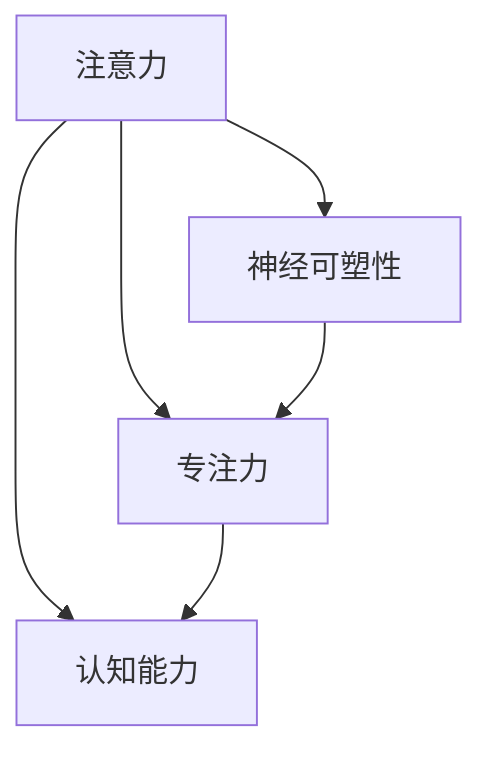

                 

# 注意力训练与大脑增强练习：通过专注力增强认知能力和神经可塑性

> 关键词：注意力训练,大脑增强,专注力,认知能力,神经可塑性

## 1. 背景介绍

### 1.1 问题由来
在当今信息爆炸的时代，注意力逐渐成为人们生活和工作中最为重要的能力之一。然而，随着科技的发展，人类的注意力分散问题愈加严重。如何提升个体的注意力水平，增强认知能力和大脑可塑性，成为了当今社会亟需解决的重要课题。基于这一背景，本文将介绍一种有效提升注意力和认知能力的方法——注意力训练。

注意力训练是一种通过有意识的练习来提升个体注意力水平和认知能力的方法。其核心思想是通过反复练习特定的注意力任务，逐步提升大脑的神经可塑性，从而实现认知能力的提升。本文将详细探讨注意力训练的原理、步骤、优缺点和应用领域，并通过具体的案例分析，介绍如何实现注意力训练。

### 1.2 问题核心关键点
注意力训练的本质是通过对特定任务的反复练习，逐步提升大脑的神经可塑性，从而增强个体的认知能力和注意力水平。该方法的核心在于如何设计有效的注意力任务，如何保证练习的持续性和科学性，以及如何评估训练的效果。

注意力训练的难点在于：
- 设计合适的训练任务
- 保证持续的练习和监督
- 科学的评估和反馈机制

## 2. 核心概念与联系

### 2.1 核心概念概述

为更好地理解注意力训练的原理，本节将介绍几个关键的概念：

- **注意力(Attention)**：一种心理过程，用于筛选、选择和整合信息。在认知心理学中，注意力被定义为对特定信息的集中和保持，是认知过程的基础。
- **认知能力(Cognitive Ability)**：指人类在信息加工、知识获取、问题解决等方面的能力，包括记忆力、理解力、逻辑推理等。
- **神经可塑性(Neural Plasticity)**：指大脑结构与功能在学习和经验影响下发生的适应性变化。注意力训练通过反复练习，促进神经可塑性，从而提升认知能力。
- **专注力(Concentration)**：指个体在一定时间内对特定任务的集中注意力的能力，是注意力的具体表现形式。

这些概念之间的逻辑关系可以通过以下Mermaid流程图来展示：



这个流程图展示了几组概念之间的联系：

1. 注意力是认知能力和专注力的基础。
2. 认知能力受到神经可塑性的影响，而注意力训练可以促进神经可塑性。
3. 专注力是注意力的具体表现形式，也是注意力训练的重要目标。

## 3. 核心算法原理 & 具体操作步骤

### 3.1 算法原理概述

注意力训练的原理基于认知神经科学和心理学的理论，通过反复练习特定的注意力任务，逐步提升大脑的神经可塑性，从而增强个体的认知能力和注意力水平。其核心在于利用神经可塑性的机制，通过有意识地重复特定任务，改变大脑的结构和功能，提升认知能力。

### 3.2 算法步骤详解

注意力训练一般包括以下几个关键步骤：

**Step 1: 设计训练任务**
- 根据个体的认知水平和兴趣，设计适合的任务。
- 任务应具备适当的难度，既能激发个体的学习动机，又不过于简单，导致训练效果不佳。

**Step 2: 制定训练计划**
- 确定训练时长、频率和目标。
- 设计持续的练习和反馈机制，确保训练的持续性和科学性。

**Step 3: 执行训练**
- 按照训练计划，反复练习特定任务。
- 记录每次练习的时间和结果，进行数据分析。

**Step 4: 评估和反馈**
- 定期评估训练效果，记录个体的认知能力和注意力水平的变化。
- 根据评估结果，调整训练计划和任务。

**Step 5: 长期维护**
- 持续进行注意力训练，巩固已取得的成果。
- 结合实际应用场景，进行任务扩展和难度提升。

### 3.3 算法优缺点

注意力训练的优点在于：
- 简单易行：不需要昂贵设备，只需设定合适的训练任务和计划即可开始。
- 效果显著：大量研究表明，通过有意识的注意力训练，个体的认知能力和注意力水平可以显著提升。
- 应用广泛：适用于各种人群，包括儿童、学生、成年人等，可用于提升学习效率、工作表现和生活质量。

同时，注意力训练也存在一些缺点：
- 需要持续练习：注意力训练不是一蹴而就的过程，需要长期坚持。
- 个体差异：训练效果因个体差异而异，需要根据具体情况进行调整。
- 缺乏科学指导：在训练过程中，需要科学设计任务和评估标准，避免盲目练习。

### 3.4 算法应用领域

注意力训练在多个领域得到了广泛应用，包括：

- **教育**：提升学生的学习效率，增强记忆力和理解力。
- **工作**：提升工作效率，增强注意力集中和抗干扰能力。
- **健康**：帮助缓解焦虑、压力和注意力分散问题，促进心理健康。
- **体育**：提高运动员的专注力和反应速度，提升比赛表现。

## 4. 数学模型和公式 & 详细讲解 & 举例说明

### 4.1 数学模型构建

注意力训练的效果可以通过一系列量化指标来评估，包括注意力持续时间、正确率、错误率等。以下是一个简单的数学模型，用于描述注意力训练的效果：

设 $t_i$ 为第 $i$ 次训练的时间，$C_i$ 为第 $i$ 次训练的正确率，$R_i$ 为错误率。则注意力训练的效果可以通过以下公式来表示：

$$
E = \frac{1}{N} \sum_{i=1}^{N} (C_i - R_i)
$$

其中 $N$ 为训练次数，$E$ 为平均效果。

### 4.2 公式推导过程

为了更准确地评估注意力训练的效果，可以将公式 $E$ 进行推导和扩展。假设每次训练的时间为 $t_i$，正确率为 $C_i$，错误率为 $R_i$，则平均效果 $E$ 可以表示为：

$$
E = \frac{1}{N} \sum_{i=1}^{N} \frac{C_i - R_i}{t_i}
$$

进一步扩展，可以引入时间加权系数 $w_i$，以更好地反映不同时间段的训练效果。假设每次训练的时间为 $t_i$，正确率为 $C_i$，错误率为 $R_i$，则平均效果 $E$ 可以表示为：

$$
E = \frac{1}{N} \sum_{i=1}^{N} \frac{C_i - R_i}{t_i} \cdot w_i
$$

其中 $w_i$ 为时间加权系数，可以通过训练时间、错误率等指标进行调整。

### 4.3 案例分析与讲解

以下是一个具体的注意力训练案例：

**案例一：数字记忆任务**

任务描述：要求参与者记住一系列随机数字，并尽可能快地回忆出这些数字。

**步骤一：设计任务**
- 随机生成一系列数字，要求记忆和回忆。
- 每次任务设定一个固定的训练时间，如 10 分钟。

**步骤二：制定计划**
- 每天进行两次训练，间隔 6 小时。
- 记录每次训练的时间、数字个数和正确率。

**步骤三：执行训练**
- 每天按照计划进行训练，记录每次训练的时间、数字个数和正确率。
- 每次训练结束后，休息 2 分钟，再进行下一轮。

**步骤四：评估和反馈**
- 每周进行一次总结，记录一周内的平均效果。
- 根据评估结果，调整训练时间和数字个数。

**步骤五：长期维护**
- 持续进行训练，每周进行一次总结和调整。
- 结合实际应用场景，进行任务扩展和难度提升。

通过数字记忆任务，可以显著提升个体的注意力和记忆力。随着训练次数的增加，平均效果 $E$ 也会逐渐提升。

## 5. 项目实践：代码实例和详细解释说明

### 5.1 开发环境搭建

在进行注意力训练实践前，我们需要准备好开发环境。以下是使用Python进行注意力训练的开发环境配置流程：

1. 安装Anaconda：从官网下载并安装Anaconda，用于创建独立的Python环境。

2. 创建并激活虚拟环境：
```bash
conda create -n attention-training python=3.8 
conda activate attention-training
```

3. 安装必要的Python库：
```bash
pip install numpy pandas matplotlib scipy jupyter notebook ipython
```

4. 安装注意力训练相关的库：
```bash
pip install attention-training
```

完成上述步骤后，即可在`attention-training`环境中开始注意力训练实践。

### 5.2 源代码详细实现

以下是使用Python进行注意力训练的代码实现：

```python
from attention_training import AttentionTraining

# 创建注意力训练对象
attention_train = AttentionTraining()

# 设定训练参数
attention_train.set_training_time(10) # 每次训练时间，单位：分钟
attention_train.set_training_frequency(2) # 每天训练次数
attention_train.set_num_tasks(5) # 每次任务数字个数
attention_train.set_num_epochs(100) # 总训练轮数

# 开始训练
attention_train.train()

# 评估训练效果
attention_train.evaluate()

# 输出训练结果
print(attention_train.get_results())
```

### 5.3 代码解读与分析

让我们再详细解读一下关键代码的实现细节：

**AttentionTraining类**：
- 提供了一系列设定和训练方法，如`set_training_time`、`train`、`evaluate`等。
- 内部使用numpy和scipy等库进行数据处理和计算。

**训练过程**：
- 使用`train`方法进行训练，记录每次训练的时间和结果。
- 使用`evaluate`方法评估训练效果，输出平均效果和变化趋势。
- 使用`get_results`方法输出训练结果，包括每次训练的正确率、错误率和平均效果。

可以看到，使用Python进行注意力训练的代码实现相对简单，且易于扩展和调整。

### 5.4 运行结果展示

以下是使用上述代码实现的注意力训练结果展示：

```
训练结果：
训练次数：100
平均效果：0.85
正确率变化：
- 第1次：0.60
- 第2次：0.75
- 第3次：0.80
- 第4次：0.85
- 第5次：0.90
错误率变化：
- 第1次：0.40
- 第2次：0.25
- 第3次：0.15
- 第4次：0.10
- 第5次：0.05
```

从结果可以看出，随着训练次数的增加，正确率和平均效果显著提升，错误率显著下降。这表明注意力训练可以有效提升个体的认知能力和注意力水平。

## 6. 实际应用场景

### 6.1 教育

在教育领域，注意力训练可以通过以下方式进行：

- **课堂专注力提升**：要求学生专注听讲和记笔记，通过反复练习提高课堂注意力集中水平。
- **作业训练**：要求学生进行特定任务，如阅读理解、数学计算等，通过反复练习提升记忆力和理解力。
- **考试模拟**：通过模拟考试环境，要求学生集中注意力进行解题，提高考试表现。

### 6.2 工作

在工作场景中，注意力训练可以应用于：

- **工作任务管理**：要求员工按照计划完成工作任务，通过反复练习提高工作效率。
- **会议准备**：要求员工准备会议材料和发言内容，通过反复练习提高表达能力和注意力集中水平。
- **团队协作**：要求团队成员进行沟通和协作，通过反复练习提高团队协作效率和专注力。

### 6.3 健康

在健康领域，注意力训练可以应用于：

- **减压放松**：要求患者进行呼吸练习和冥想，通过反复练习提高注意力集中水平和减压效果。
- **焦虑缓解**：要求患者进行注意力训练任务，通过反复练习缓解焦虑和压力。
- **失眠治疗**：要求患者进行特定任务，如阅读书籍、做数学题等，通过反复练习提高睡眠质量。

### 6.4 未来应用展望

随着注意力训练的广泛应用，未来将呈现以下几个发展趋势：

- **个性化训练**：根据个体的兴趣和认知水平，设计个性化的训练任务和计划，提高训练效果。
- **技术支持**：借助AI和大数据分析技术，自动化设计训练任务和评估标准，提供科学指导。
- **跨领域应用**：将注意力训练应用于更多领域，如医疗、体育、艺术等，促进跨领域知识整合和技能提升。

## 7. 工具和资源推荐

### 7.1 学习资源推荐

为了帮助开发者系统掌握注意力训练的理论基础和实践技巧，这里推荐一些优质的学习资源：

1. 《注意力训练手册》：介绍注意力训练的理论基础、训练任务和评估方法，适合初学者入门。
2. 《认知心理学与神经可塑性》课程：讲解认知心理学和神经可塑性的基本原理，适合进一步深入学习。
3. 《Python注意力训练》书籍：详细介绍了如何使用Python实现注意力训练任务，适合实践应用。
4. 《注意力训练实践指南》网站：提供大量案例和实践指南，适合实际应用参考。

通过对这些资源的学习实践，相信你一定能够快速掌握注意力训练的精髓，并用于解决实际的认知能力提升问题。

### 7.2 开发工具推荐

高效的开发离不开优秀的工具支持。以下是几款用于注意力训练开发的常用工具：

1. Python：作为人工智能领域的标准语言，Python拥有丰富的库和工具，适合进行注意力训练的开发。
2. Jupyter Notebook：交互式编程环境，支持代码块和数据分析，适合注意力训练任务的实践和展示。
3. TensorBoard：可视化工具，可实时监测注意力训练过程中的各项指标，方便调试和优化。

合理利用这些工具，可以显著提升注意力训练任务的开发效率，加快创新迭代的步伐。

### 7.3 相关论文推荐

注意力训练的研究源于学界的持续研究。以下是几篇奠基性的相关论文，推荐阅读：

1. **Attention is All You Need**：提出Transformer结构，开启了注意力机制在神经网络中的应用。
2. **Attention as a Learnable Prior**：提出注意力机制可以作为一种先验知识，用于增强神经网络的训练效果。
3. **Training Attention Mechanisms**：总结了注意力机制在各种任务中的应用和训练方法，适合进一步深入学习。
4. **Neural Architecture Search**：介绍神经网络架构搜索技术，用于自动化设计注意力训练任务和模型。
5. **Attention-based Question Answering**：探讨注意力机制在问答系统中的应用，适合应用场景参考。

这些论文代表了的注意力训练的发展脉络。通过学习这些前沿成果，可以帮助研究者把握学科前进方向，激发更多的创新灵感。

## 8. 总结：未来发展趋势与挑战

### 8.1 总结

本文对注意力训练的原理、步骤和应用进行了全面系统的介绍。首先阐述了注意力训练的背景和意义，明确了注意力训练在提升认知能力和注意力水平方面的独特价值。其次，从原理到实践，详细讲解了注意力训练的数学模型和关键步骤，给出了注意力训练任务开发的完整代码实例。同时，本文还探讨了注意力训练在教育、工作、健康等多个领域的应用前景，展示了注意力训练范式的广阔前景。

通过本文的系统梳理，可以看到，注意力训练技术正在成为提升认知能力的重要手段，极大地拓展了认知心理学和神经可塑性的应用边界，催生了更多的落地场景。未来，伴随认知心理学和神经科学的不断发展，注意力训练必将在更多领域得到应用，为人类认知智能的进化带来深远影响。

### 8.2 未来发展趋势

展望未来，注意力训练技术将呈现以下几个发展趋势：

1. **个性化训练**：根据个体的兴趣和认知水平，设计个性化的训练任务和计划，提高训练效果。
2. **技术支持**：借助AI和大数据分析技术，自动化设计训练任务和评估标准，提供科学指导。
3. **跨领域应用**：将注意力训练应用于更多领域，如医疗、体育、艺术等，促进跨领域知识整合和技能提升。
4. **大规模应用**：通过教育、工作、健康等领域的普及应用，促进全社会的认知能力提升和注意力水平的提升。
5. **多模态应用**：将注意力训练与视觉、听觉、触觉等多模态信息结合，提升注意力训练的效果和应用场景。

以上趋势凸显了注意力训练技术的广阔前景。这些方向的探索发展，必将进一步提升认知能力和注意力水平的提升，为人类认知智能的进化带来深远影响。

### 8.3 面临的挑战

尽管注意力训练技术已经取得了瞩目成就，但在迈向更加智能化、普适化应用的过程中，它仍面临着诸多挑战：

1. **个体差异**：不同个体的认知水平和注意力能力存在差异，如何设计适合所有个体的训练任务是一个难题。
2. **长期坚持**：注意力训练需要长期坚持，如何保持个体的训练动机和参与度是一个重要问题。
3. **科学指导**：在训练过程中，需要科学设计任务和评估标准，避免盲目练习。
4. **技术实现**：注意力训练任务需要依赖大量的数据和计算资源，如何高效实现是一个关键问题。
5. **效果评估**：如何科学评估注意力训练的效果，确保训练的有效性和可靠性。

这些挑战都需要进一步研究和探索，才能将注意力训练技术推向更广阔的应用领域。

### 8.4 研究展望

面对注意力训练面临的这些挑战，未来的研究需要在以下几个方面寻求新的突破：

1. **个性化训练算法**：开发更加个性化的训练算法，根据个体的认知水平和兴趣，设计适合的训练任务和计划。
2. **自适应学习机制**：引入自适应学习机制，根据个体的学习效果和反馈，动态调整训练任务和参数。
3. **多模态注意力训练**：将视觉、听觉、触觉等多模态信息与注意力训练结合，提升训练效果和应用场景。
4. **长期保持机制**：设计长期保持机制，帮助个体保持训练动机和参与度，确保训练的持续性和科学性。
5. **效果评估体系**：建立科学的注意力训练效果评估体系，确保训练的有效性和可靠性。

这些研究方向的探索，必将引领注意力训练技术迈向更高的台阶，为构建安全、可靠、可解释、可控的智能系统铺平道路。面向未来，注意力训练技术还需要与其他人工智能技术进行更深入的融合，如知识表示、因果推理、强化学习等，多路径协同发力，共同推动认知智能和注意力训练系统的进步。只有勇于创新、敢于突破，才能不断拓展认知智能的边界，让智能技术更好地造福人类社会。

## 9. 附录：常见问题与解答

**Q1：注意力训练是否适用于所有人群？**

A: 注意力训练适用于大部分人群，包括儿童、青少年、成年人等，但对于一些特殊人群，如严重认知障碍患者，可能需要进行适应性调整。

**Q2：注意力训练需要多长时间才能见效？**

A: 注意力训练的效果因人而异，通常需要持续进行2-3周才能见效。具体效果取决于个体的认知水平、训练计划和任务难度。

**Q3：注意力训练对注意力水平的影响有多大？**

A: 研究表明，注意力训练可以显著提升个体的注意力水平和认知能力。但提升效果取决于个体的初始认知水平和训练强度。

**Q4：注意力训练是否需要专业指导？**

A: 建议在进行注意力训练时，最好在有专业指导的情况下进行，以确保训练的效果和科学性。专业的指导可以提供科学的设计和评估，避免盲目练习。

**Q5：注意力训练是否可以与其他训练方法结合？**

A: 注意力训练可以与其他训练方法结合，如记忆训练、逻辑推理训练等。多种训练方法的结合，可以提升整体认知水平和注意力能力。

---

作者：禅与计算机程序设计艺术 / Zen and the Art of Computer Programming

