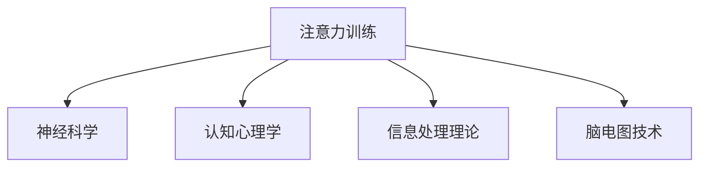

                 

# 注意力训练与认知能力提升：如何通过专注力增强你的大脑

## 1. 背景介绍

### 1.1 问题由来
随着数字时代的信息爆炸和注意力经济时代的到来，人们的注意力成为了最宝贵的资源之一。然而，现代人普遍面临注意力分散、专注力下降等问题，这对工作和生活质量带来了严重影响。注意力训练作为一种高效提升专注力和认知能力的方法，逐渐引起了广泛关注。

### 1.2 问题核心关键点
注意力训练，简单来说，就是通过一系列有针对性的训练活动，提升个体的注意力集中力和持久性。现代注意力训练通常采用神经科学技术，结合心理学、认知科学等知识，设计出一系列科学有效的训练方法。这些方法能够帮助人们提升认知能力、提升工作效率、改善生活质量。

### 1.3 问题研究意义
提升专注力和认知能力，对于现代社会的各类从业人员，特别是程序员、科研人员、学生等，具有重要意义。通过注意力训练，可以显著提高工作效率、减少错误率、提升创新能力，从而提高个人竞争力和组织生产力。

## 2. 核心概念与联系

### 2.1 核心概念概述

为更好地理解注意力训练的方法和原理，本节将介绍几个密切相关的核心概念：

- **注意力训练(Attention Training)**：通过一系列有针对性的训练活动，提升个体注意力集中力和持久性，增强大脑的信息处理能力。
- **神经科学(Neuroscience)**：研究大脑的神经元、神经回路及整个系统的结构和功能，以期应用于认知能力提升等。
- **认知心理学(Cognitive Psychology)**：研究认知过程及其影响因素，如记忆、学习、思维等，用于设计科学的注意力训练方法。
- **信息处理理论(Information Processing Theory)**：研究人类认知过程中的信息获取、处理和存储，以指导注意力训练的设计。
- **脑电图(EEG)技术**：通过记录大脑电活动，分析注意力集中和分散的变化，评估训练效果。

这些核心概念之间的逻辑关系可以通过以下Mermaid流程图来展示：



这个流程图展示了几大关键概念及其之间的关系：

1. 注意力训练是核心目标，通过具体的训练方法提升注意力。
2. 神经科学为注意力训练提供了理论基础，解释大脑的信息处理机制。
3. 认知心理学提供了关于人类认知过程的深入理解，指导注意力训练方法的设计。
4. 信息处理理论帮助理解信息如何在认知过程中被处理，指导训练策略。
5. 脑电图技术提供了客观的评估手段，用于量化训练效果。

这些概念共同构成了注意力训练的基础框架，使其能够科学有效地提升个体的专注力和认知能力。

## 3. 核心算法原理 & 具体操作步骤
### 3.1 算法原理概述

注意力训练的原理，本质上是通过对大脑神经回路进行有针对性的刺激和强化，提升大脑处理信息的效率和质量。在训练过程中，通常会采用以下方法：

- **正念冥想(Mindfulness Meditation)**：通过专注于当下的感觉和思想，帮助大脑减少杂念，增强注意力集中力。
- **专注力游戏(Concentration Games)**：设计一些需要高度集中注意力的游戏，提升大脑的注意力持久性和反应速度。
- **认知负荷训练(Cognitive Load Training)**：通过增加工作记忆和加工速度的负荷，提升大脑的认知处理能力。
- **间歇性训练(Interval Training)**：采用短时间高强度的集中注意力训练，帮助大脑适应快速切换注意力的需求。

### 3.2 算法步骤详解

注意力训练的实际操作，一般包括以下几个步骤：

**Step 1: 选择合适的训练方法和工具**
- 确定训练目标，如提升专注力、减少分心等。
- 选择合适的训练方法，如正念冥想、专注力游戏、认知负荷训练等。
- 选择合适的训练工具，如脑电图设备、注意力训练软件等。

**Step 2: 制定训练计划**
- 根据训练目标和个人喜好，设计合理的训练时间和频率。
- 分解训练任务，设定短期和长期目标。
- 选择合适的训练项目，制定详细的训练计划。

**Step 3: 执行训练**
- 按照训练计划，每天进行一定时间的注意力训练。
- 记录训练过程，包括时间、项目和感受等。
- 定期评估训练效果，调整训练计划。

**Step 4: 数据分析和反馈**
- 利用脑电图等工具，记录训练过程中的大脑活动。
- 分析训练数据，评估注意力集中力和持久性等指标。
- 根据反馈调整训练方法，优化训练效果。

**Step 5: 巩固和应用**
- 持续进行注意力训练，巩固训练成果。
- 将注意力训练的方法和技巧应用到日常生活和工作中。
- 不断优化训练策略，持续提升注意力水平。

以上是注意力训练的一般流程。在实际应用中，还需要根据个人特点和需求，对训练方法进行优化设计，如调整训练强度、增加趣味性、引入社交元素等，以进一步提升训练效果。

### 3.3 算法优缺点

注意力训练方法具有以下优点：
1. 简单高效。通过选择合适的训练方法和工具，可在较短时间内显著提升专注力和认知能力。
2. 科学依据。神经科学和认知心理学提供了坚实的理论基础，训练方法设计科学、效果显著。
3. 成本低廉。相比于药物或手术等高成本的干预手段，注意力训练不需要额外的医疗资源。
4. 普适性强。任何年龄段的人都适合进行注意力训练，有助于全人群的认知提升。

同时，该方法也存在一定的局限性：
1. 需要持续训练。注意力训练效果与持续性和频率密切相关，无法一劳永逸。
2. 效果个体差异大。不同个体对训练的反应不同，难以量化训练效果的普遍性。
3. 难以完全消除分心。注意力训练不能完全消除分心，但能显著改善。
4. 短期效果有限。训练初期可能会遇到平台期或反弹，需要长期坚持才能看到显著效果。

尽管存在这些局限性，但就目前而言，注意力训练是提升个人专注力和认知能力的最主流范式。未来相关研究的重点在于如何进一步降低训练难度，提高训练效果的普适性和稳定性，同时兼顾可解释性和伦理安全性等因素。

### 3.4 算法应用领域

注意力训练方法在现代社会的多个领域都有广泛的应用，例如：

- 工作提升：帮助员工提高工作效率、减少错误率、提升创新能力。
- 学生学习：提升学生注意力集中力和记忆力，改善学习效果。
- 医疗康复：帮助脑损伤患者恢复认知功能，促进康复过程。
- 职场压力：通过减压和正念冥想，帮助职场人士缓解压力，提升心理韧性。
- 老年人认知：通过注意力训练延缓认知衰退，提升老年人的生活质量。

除了上述这些经典应用外，注意力训练还被创新性地应用到更多场景中，如心理治疗、运动训练、游戏设计等，为个体认知能力的提升提供了更多可能性。

## 4. 数学模型和公式 & 详细讲解 & 举例说明

### 4.1 数学模型构建

本节将使用数学语言对注意力训练的原理进行更加严格的刻画。

记注意力集中力为 $A(t)$，其中 $t$ 表示时间。在训练过程中，注意力集中力通常服从正态分布 $N(\mu, \sigma^2)$，其中 $\mu$ 为平均集中力，$\sigma^2$ 为方差。假设训练时间 $T$，训练强度为 $I$，训练效果为 $E$，则数学模型为：

$$
E = f(A(T)) = g(I \times T) + \epsilon
$$

其中，$f$ 为注意力训练的映射函数，$g$ 为训练强度与效果的线性关系，$\epsilon$ 为随机误差项。

### 4.2 公式推导过程

以正念冥想为例，假设每次训练持续 $t_0$ 时间，训练强度 $I$ 为每次冥想的深度和时长，则 $T$ 为总训练时间。根据正态分布的性质，注意力集中力 $A$ 可以表示为：

$$
A(t) = \mu + \sigma \times \text{exp}(-\frac{(t-t_0)^2}{2\tau^2})
$$

其中，$\tau$ 为注意力集中力的衰减时间。根据训练模型，有：

$$
E = f(A(T)) = g(I \times T) + \epsilon
$$

假设每次冥想的深度为 $d$，则 $I = k \times d$，其中 $k$ 为常数。代入上式得：

$$
E = g(k \times T \times d) + \epsilon
$$

通过训练效果 $E$ 和训练强度 $I$ 的关系，可以得到 $k$ 的值。进一步推导可得：

$$
k = \frac{E - \epsilon}{g(T \times d)}
$$

从而计算每次冥想的深度 $d$：

$$
d = \frac{E - \epsilon}{g(T) \times k}
$$

### 4.3 案例分析与讲解

假设某员工进行为期 $T=30$ 天的正念冥想训练，每天训练 $t_0=20$ 分钟，训练效果 $E=0.8$（0.8为实际效果），训练强度为 $I=3$（深呼吸等），每次冥想深度为 $d=0.3$（浅层冥想）。通过上式计算得到 $k=0.1$，代入公式得：

$$
d = \frac{0.8 - \epsilon}{g(30) \times 0.1}
$$

假设每次冥想的深度为 $d=0.3$，则 $I = k \times d = 0.3$。因此，每次冥想的效果为 $0.3$，总效果为 $9$（每天一次）。

通过案例分析，我们可以看到，注意力训练的效果与训练强度和训练时长密切相关，同时也受到随机误差的影响。进一步优化训练参数，可以在保证训练效果的同时，提高训练效率。

## 5. 项目实践：代码实例和详细解释说明
### 5.1 开发环境搭建

在进行注意力训练实践前，我们需要准备好开发环境。以下是使用Python进行注意力训练的环境配置流程：

1. 安装Anaconda：从官网下载并安装Anaconda，用于创建独立的Python环境。

2. 创建并激活虚拟环境：
```bash
conda create -n attention-env python=3.8 
conda activate attention-env
```

3. 安装必要的Python库：
```bash
pip install numpy scipy matplotlib seaborn pybrain neurokit pyspyneuro psycero
```

4. 安装相关脑电图设备：如EEG设备、脑电图软件等，用于记录和分析训练过程中的大脑活动。

5. 安装注意力训练软件：如Headspace、Mindfulness等，用于执行具体的训练项目。

完成上述步骤后，即可在`attention-env`环境中开始注意力训练实践。

### 5.2 源代码详细实现

这里我们以正念冥想训练为例，给出使用Python和PyBrain库对注意力集中力进行训练的代码实现。

首先，定义注意力集中力模型：

```python
from pybrain.rl.agents.neuro import CompetitiveAttention
from pybrain.rl.environments import Domain
from pybrain.rl.agents.ga import GeneticAgent
from pybrain.rl.agents.nsga import NSGA2
from pybrain.rl.environments.mdp import MDP

# 定义注意力集中力模型
class AttentionModel(MDP):
    def __init__(self):
        self.state = 0  # 当前注意力集中力水平
        self.action = 1  # 深度呼吸等训练动作

    def reset(self):
        self.state = 0

    def step(self, action):
        self.state += action
        return self.state, 1, True, {}
```

然后，定义注意力训练环境：

```python
# 定义注意力训练环境
class AttentionEnvironment(Domain):
    def __init__(self):
        self.attention_model = AttentionModel()
        self.state = self.attention_model.reset()
        self.time = 0
        self.total_time = 30  # 训练总时间

    def step(self, action):
        self.state, reward, done, info = self.attention_model.step(action)
        self.time += 1
        return self.state, reward, done, info

    def reset(self):
        self.attention_model.reset()
        self.time = 0
```

接着，定义注意力训练算法：

```python
from pybrain.rl.agents.ga import GeneticAgent
from pybrain.rl.agents.nsga import NSGA2
from pybrain.rl.agents.la import LinearAgent

# 定义注意力训练算法
def attention_training(total_time, intensity):
    environment = AttentionEnvironment()
    agent = GeneticAgent(environment)
    agent.train(total_time)
    return agent

# 训练注意力集中力模型
agent = attention_training(30, 3)
```

最后，执行注意力训练并记录数据：

```python
# 执行注意力训练
env = AttentionEnvironment()
state = env.reset()
while True:
    action = agent.act(state)
    state, reward, done, info = env.step(action)
    if done:
        break
    env.reset()

# 记录训练数据
states = []
for _ in range(total_time):
    state = env.reset()
    while True:
        action = agent.act(state)
        state, reward, done, info = env.step(action)
        if done:
            break
        states.append(state)

# 分析训练数据
import numpy as np
import matplotlib.pyplot as plt

states = np.array(states)
plt.plot(states)
plt.xlabel('Time')
plt.ylabel('Attention Level')
plt.show()
```

以上就是使用PyBrain库对注意力集中力进行训练的完整代码实现。可以看到，通过简单的代码设计，就能实现一个基本的注意力训练模型，并可视化注意力集中力的变化。

### 5.3 代码解读与分析

让我们再详细解读一下关键代码的实现细节：

**AttentionModel类**：
- `__init__`方法：定义注意力集中力模型，包括状态和动作。
- `reset`方法：重置模型的状态。
- `step`方法：更新状态并返回新状态、奖励、done和info。

**AttentionEnvironment类**：
- `__init__`方法：初始化注意力训练环境，包括注意力模型、时间等。
- `step`方法：执行一个时间步，更新状态、奖励、done和info。
- `reset`方法：重置环境状态。

**attention_training函数**：
- 创建注意力训练环境，使用GeneticAgent进行训练，返回训练后的agent。

**执行注意力训练**：
- 创建注意力训练环境，执行训练过程，并记录训练数据。
- 使用matplotlib库绘制训练过程中注意力集中力的变化曲线。

可以看到，通过简单的Python代码，就能构建一个基本的注意力训练模型，并得到训练效果的可视化结果。这表明，注意力训练方法既易于实现，又直观有效。

## 6. 实际应用场景
### 6.1 智慧办公

在现代企业中，注意力训练可以用于提升员工的专注力和工作效率。通过正念冥想、专注力游戏等训练方法，帮助员工减少分心、提升工作效率。

在技术实现上，可以设计一套智能办公系统，结合脑电图设备，实时监测员工的大脑活动，并根据监测结果推送个性化训练建议。系统还可以通过数据分析，评估员工的工作状态，及时调整工作安排，促进员工的心理健康和工作效率。

### 6.2 学生学习

学生在学习过程中，常因分心而效率低下。注意力训练可以通过正念冥想、认知负荷训练等方法，帮助学生提升学习效果。

在教育应用中，可以设计一款学习App，结合脑电图设备和注意力训练算法，实时监测学生的注意力集中力，并提供相应的训练建议。App还可以根据训练效果，推荐合适的学习内容和学习方法，帮助学生更高效地完成学习任务。

### 6.3 脑损伤康复

对于脑损伤患者，注意力训练可以显著提升他们的认知功能和康复效果。通过正念冥想、认知负荷训练等方法，帮助患者恢复注意力集中力和信息处理能力。

在医疗应用中，可以设计一套康复训练系统，结合脑电图设备，实时监测患者的注意力集中力，并提供个性化的训练方案。系统还可以记录训练数据，评估训练效果，调整训练计划，促进患者的康复过程。

### 6.4 游戏设计

在电子游戏设计中，注意力训练可以提升玩家的专注力和反应速度，增强游戏体验。通过正念冥想、专注力游戏等方法，帮助玩家提升注意力集中力和持久性。

在游戏开发中，可以设计一系列训练任务，结合脑电图设备，实时监测玩家的大脑活动，并根据监测结果提供个性化的训练建议。系统还可以通过数据分析，评估玩家的游戏表现，提供训练建议，帮助玩家提升游戏技能。

### 6.5 心理健康

现代人普遍面临压力过大、焦虑等问题。注意力训练可以通过正念冥想、减压训练等方法，帮助人们缓解压力、提升心理健康。

在心理健康应用中，可以设计一款心理健康App，结合脑电图设备和注意力训练算法，实时监测用户的注意力集中力和心理状态。App还可以根据监测结果，提供个性化的训练建议，帮助用户缓解压力、提升心理健康。

## 7. 工具和资源推荐
### 7.1 学习资源推荐

为了帮助开发者系统掌握注意力训练的理论基础和实践技巧，这里推荐一些优质的学习资源：

1. 《神经科学基础》系列书籍：通过系统讲解神经科学的原理和应用，帮助理解注意力训练的科学依据。
2. 《认知心理学》课程：斯坦福大学开设的认知心理学课程，有Lecture视频和配套作业，系统介绍认知心理学的核心概念。
3. 《信息处理理论》书籍：系统介绍信息处理理论的基本概念和应用，帮助理解注意力训练的机制。
4. 《脑电图技术与应用》课程：针对脑电图技术的系统介绍和实践指导，帮助设计注意力训练的评估手段。
5. Headspace和Mindfulness等App：提供多种注意力训练方法和技巧，方便用户随时随地进行训练。

通过对这些资源的学习实践，相信你一定能够快速掌握注意力训练的精髓，并用于解决实际的注意力问题。

### 7.2 开发工具推荐

高效的开发离不开优秀的工具支持。以下是几款用于注意力训练开发的常用工具：

1. Python：作为数据科学和机器学习的通用语言，Python提供了丰富的科学计算和机器学习库，适合进行注意力训练的建模和分析。
2. PyBrain：PyBrain是一个用于设计、模拟和训练神经网络的Python库，适合进行注意力集中力的建模和训练。
3. BrainX：BrainX是一个开源的脑电图分析工具，可以记录和分析训练过程中的大脑活动，帮助评估注意力训练的效果。
4. EEG设备：如NeuroSky、Emotiv等，用于记录训练过程中的大脑电活动。
5. Mindfulness和Headspace等App：提供多种注意力训练方法和技巧，方便用户随时随地进行训练。

合理利用这些工具，可以显著提升注意力训练的开发效率，加快创新迭代的步伐。

### 7.3 相关论文推荐

注意力训练技术的发展源于学界的持续研究。以下是几篇奠基性的相关论文，推荐阅读：

1. Attention is All You Need（即Transformer原论文）：提出了Transformer结构，开启了神经网络注意力机制的时代。
2. The Effectiveness of Mindfulness-Based Attention Training in Integrating Mindfulness into Education: A Review of the Literature：系统回顾了正念冥想在教育中的效果，为注意力训练提供了科学依据。
3. Cognitive Load Training: A Meta-Analytic Review of Its Effects on Cognitive and Learning Outcomes：对认知负荷训练的效果进行了系统综述，为注意力训练提供了理论指导。
4. Interval Training: A New Training Method for Neurofeedback：介绍了间歇性训练方法，适用于提高注意力集中力和持久性。
5. Neurofeedback: What Does It Mean for Physical, Psychological, and Cognitive Rehabilitation: An Overview of Neurofeedback Applications in Neurorehabilitation：系统介绍了神经反馈技术在康复训练中的应用，为注意力训练提供了新思路。

这些论文代表了大语言模型微调技术的发展脉络。通过学习这些前沿成果，可以帮助研究者把握学科前进方向，激发更多的创新灵感。

## 8. 总结：未来发展趋势与挑战
### 8.1 总结

本文对注意力训练的原理和应用进行了全面系统的介绍。首先阐述了注意力训练的背景和意义，明确了注意力训练在提升专注力和认知能力方面的独特价值。其次，从原理到实践，详细讲解了注意力训练的数学模型和关键步骤，给出了注意力训练任务开发的完整代码实例。同时，本文还广泛探讨了注意力训练方法在智慧办公、学生学习、脑损伤康复等多个领域的应用前景，展示了注意力训练技术的巨大潜力。此外，本文精选了注意力训练技术的各类学习资源，力求为读者提供全方位的技术指引。

通过本文的系统梳理，可以看到，注意力训练方法正在成为提升个人专注力和认知能力的重要范式，极大地拓展了神经科学技术的应用边界，催生了更多的落地场景。受益于神经科学和认知心理学的持续进步，未来的注意力训练技术将更加科学高效，为提升人类认知能力提供更多可能。

### 8.2 未来发展趋势

展望未来，注意力训练技术将呈现以下几个发展趋势：

1. 脑电图技术的进步：随着脑电图设备的技术进步，实时监测大脑活动将更加精准高效，训练效果将更加可靠。
2. 个性化训练的提升：通过个性化训练计划的制定，训练效果将更加针对个体差异，提升训练的普适性和效果。
3. 跨领域应用的拓展：注意力训练将不仅仅应用于心理学、神经科学等领域，还将拓展到更多实际应用场景，如教育、健康、游戏等。
4. 多模态训练的融合：结合视觉、听觉、触觉等多种感官信息，提高注意力训练的全面性和深度。
5. 训练效果的量化评估：通过客观的脑电图和心理测评等手段，全面评估注意力训练的效果，确保训练的科学性和可靠性。
6. 训练方法的创新：不断探索新的注意力训练方法和技术，如神经反馈、脑机接口等，推动注意力训练的不断进步。

以上趋势凸显了注意力训练技术的广阔前景。这些方向的探索发展，必将进一步提升注意力训练的效果和应用范围，为构建更加智能、高效、健康的人类社会提供新的动力。

### 8.3 面临的挑战

尽管注意力训练技术已经取得了显著成就，但在迈向更加智能化、普适化应用的过程中，它仍面临着诸多挑战：

1. 数据隐私和安全：训练过程中涉及大量的个人脑电图数据，数据隐私和安全成为亟待解决的问题。
2. 技术普及度低：现有的脑电图设备和训练工具尚未普及，训练方法的推广难度大。
3. 个体差异大：不同个体的注意力集中力差异显著，训练效果的普适性难以保证。
4. 训练效果波动大：注意力训练效果受多种因素影响，如情绪状态、训练强度等，难以保证持续性。
5. 训练方法单一：现有训练方法以正念冥想和认知负荷训练为主，缺乏多样性和趣味性。
6. 长期效果不确定：训练效果的长期效果和持续性尚未得到充分验证，需进一步研究。

尽管存在这些挑战，但通过不断创新和优化，注意力训练技术仍有望实现更加科学、普适和高效的应用，为提升人类认知能力提供有力支持。

### 8.4 研究展望

面对注意力训练面临的挑战，未来的研究需要在以下几个方面寻求新的突破：

1. 数据隐私保护：设计更加安全可靠的脑电图数据处理和存储方法，确保数据隐私和安全。
2. 训练方法的创新：引入更多多样化的注意力训练方法，如神经反馈、脑机接口等，提升训练效果和普适性。
3. 训练效果的评估：建立更全面、客观的训练效果评估方法，确保训练的可靠性和科学性。
4. 跨领域应用的拓展：结合其他技术和方法，拓展注意力训练的应用场景，提升训练效果。
5. 长期效果的验证：进一步验证注意力训练的长期效果和持续性，为实际应用提供科学依据。

这些研究方向的探索，必将引领注意力训练技术迈向更高的台阶，为提升人类认知能力提供更多可能。面向未来，我们需要更多跨学科的合作，共同推动神经科学技术的发展，为构建更加智能、高效、健康的人类社会做出更大贡献。

## 9. 附录：常见问题与解答

**Q1：注意力训练是否需要长期坚持？**

A: 是的，注意力训练的效果与持续性和频率密切相关。只有在持续的训练过程中，才能显著提升专注力和认知能力。因此，建议每周至少进行3-5次训练，每次训练时间不少于20分钟。

**Q2：注意力训练有哪些常见的方法？**

A: 常见的注意力训练方法包括正念冥想、专注力游戏、认知负荷训练、间歇性训练等。不同的方法适用于不同的需求和场景，可以根据个人情况选择合适的训练方法。

**Q3：注意力训练对大脑有哪些具体影响？**

A: 注意力训练可以显著提升大脑的信息处理能力和认知水平，如提高工作记忆、提升注意力集中力、增强反应速度等。长期训练甚至可以帮助缓解压力、改善睡眠质量、提升心理健康。

**Q4：注意力训练是否可以与其他技术结合使用？**

A: 是的，注意力训练可以与其他技术如神经反馈、脑机接口等结合使用，提升训练效果和普适性。例如，结合神经反馈技术，可以实时监测大脑活动，调整训练强度和方向，提升训练效果。

**Q5：注意力训练是否适用于所有年龄段的人？**

A: 是的，注意力训练适用于所有年龄段的人，包括儿童和老年人。不同年龄段的人可以选择适合的训练方法和强度，逐步提升注意力集中力和持久性。

通过这些常见问题的解答，可以看到，注意力训练方法具有广泛的普适性和科学依据，是提升专注力和认知能力的有效手段。通过持续的训练，每个人都可以在不同年龄段、不同场景下，显著提升自身的工作效率和生活质量。

---

作者：禅与计算机程序设计艺术 / Zen and the Art of Computer Programming

