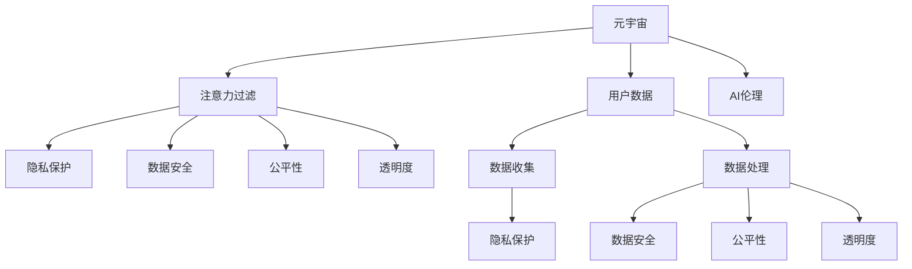

                 

# 注意力过滤AI伦理:元宇宙信息处理的道德决策机制

> 关键词：AI伦理, 注意力过滤, 元宇宙, 道德决策机制, 隐私保护, 数据安全, 公平性, 透明度

## 1. 背景介绍

随着人工智能(AI)技术的迅猛发展，尤其是注意力过滤技术的崛起，AI在元宇宙、社交网络等新兴领域的应用日益广泛。然而，元宇宙作为一个虚拟现实世界，涉及海量用户数据的收集和处理，加之AI算法可能带来的偏见和歧视，对伦理道德提出了严峻的挑战。因此，如何在AI伦理框架下，确保元宇宙信息处理过程中的道德决策机制，成为一个迫切需要解决的问题。

### 1.1 问题由来
元宇宙作为下一代互联网的形态，涵盖了社交、娱乐、教育、商业等多个方面。基于AI技术的注意力过滤算法，能够自动识别和过滤掉无意义或恶意信息，提升用户体验和互动质量。然而，这种技术的应用也引发了诸多伦理道德问题，如数据隐私、信息自由、公平性、透明度等。

近年来，Google、Meta Platforms等公司相继推出了元宇宙平台，大量用户数据在此汇聚。AI算法如Transformer、GPT等在自然语言处理任务上的卓越表现，使得基于注意力机制的过滤算法得以快速发展。然而，这些算法在提升用户体验的同时，也可能带来对用户隐私的侵犯、算法偏见等问题。

### 1.2 问题核心关键点
元宇宙中的AI伦理问题主要集中在以下几个方面：
- **数据隐私**：如何保护用户隐私，避免用户数据被滥用。
- **算法公平性**：AI算法是否存在偏见，能否保证公平对待所有用户。
- **透明度**：算法决策过程是否透明，用户是否能理解其工作机制。
- **自主性**：用户是否能控制其数据的处理方式，避免被算法"操纵"。

## 2. 核心概念与联系

### 2.1 核心概念概述

为更好地理解元宇宙中AI伦理问题，本节将介绍几个密切相关的核心概念：

- **元宇宙**：通过虚拟现实(VR)、增强现实(AR)、混合现实(MR)等技术构建的虚拟现实世界，用户在其中可以进行社交、娱乐、工作等多种活动。
- **注意力过滤**：基于深度学习技术，通过对用户数据进行注意力机制处理，自动过滤掉无意义或恶意信息，提升用户体验和互动质量。
- **AI伦理**：研究如何在AI系统中应用伦理道德原则，保证AI系统的公平性、透明度、自主性等，避免AI系统对人的负面影响。
- **隐私保护**：在数据收集和处理过程中，采取技术和管理手段保护用户隐私，避免用户数据被滥用。
- **数据安全**：在数据存储、传输和处理过程中，采用安全措施保护数据免受攻击和泄露。
- **公平性**：在算法设计和应用过程中，确保算法对所有用户一视同仁，避免偏见和歧视。
- **透明度**：在算法决策过程中，保证决策逻辑和数据来源透明，用户能理解算法的运作方式。

这些概念之间的逻辑关系可以通过以下Mermaid流程图来展示：



这个流程图展示了一些核心概念及其之间的关联关系：

1. 元宇宙通过用户数据生成，包含多个环节如数据收集、数据处理等。
2. 注意力过滤算法在元宇宙中应用广泛，与隐私保护、数据安全、公平性和透明度密切相关。
3. 隐私保护、数据安全和公平性是数据处理过程中的关键因素。
4. 透明度是确保算法可解释性的重要手段。
5. AI伦理贯穿整个元宇宙信息处理过程，涉及隐私保护、数据安全、公平性和透明度等方面。

## 3. 核心算法原理 & 具体操作步骤

### 3.1 算法原理概述

元宇宙中的注意力过滤算法，通过自注意力机制对输入数据进行加权，重点关注与任务相关的信息，忽略不相关或干扰信息。这种机制类似于人的注意力分配，能够显著提升处理效率和效果。然而，如何在使用这种技术时确保道德决策机制，是一个值得深入探讨的问题。

算法原理可以简述如下：
1. **输入表示**：将用户数据（如文本、图像等）转化为向量形式。
2. **注意力计算**：通过自注意力机制计算向量之间的注意力权重，选出重要的信息。
3. **信息聚合**：根据注意力权重对信息进行聚合，生成最终的输出。
4. **输出过滤**：将输出信息与预设的过滤规则进行比较，决定是否保留。

### 3.2 算法步骤详解

基于注意力过滤的AI伦理决策机制，可以概括为以下步骤：

**Step 1: 用户数据收集与预处理**
- 收集元宇宙用户的数据，如文本、图像、位置等。
- 对数据进行清洗、归一化等预处理，确保数据质量。

**Step 2: 自注意力机制**
- 使用自注意力机制计算输入数据的注意力权重。
- 根据注意力权重对数据进行加权聚合，生成中间表示。

**Step 3: 道德决策模型**
- 设计道德决策模型，根据预设的伦理准则对中间表示进行筛选。
- 使用分类器、回归器等模型对中间表示进行分类或回归，得到最终的决策结果。

**Step 4: 结果输出与反馈**
- 根据决策结果对原始数据进行过滤，保留符合伦理要求的输出。
- 对过滤结果进行反馈，通过用户反馈调整模型参数，提升过滤效果。

**Step 5: 模型评估与优化**
- 定期评估过滤模型的性能，如准确率、召回率等指标。
- 根据评估结果对模型进行优化，确保模型符合伦理准则。

### 3.3 算法优缺点

基于注意力过滤的AI伦理决策机制具有以下优点：
1. 高效性：通过自注意力机制，算法能够快速识别和过滤重要信息，提高处理效率。
2. 泛化性强：自注意力机制具有较强的泛化能力，能够适应不同类型的数据和任务。
3. 可解释性：通过道德决策模型，可以设计透明的决策过程，提升算法的可解释性。

同时，该算法也存在一些缺点：
1. 数据依赖：算法的准确性和公平性高度依赖于输入数据的质量和代表性。
2. 模型偏见：如果训练数据存在偏见，算法可能继承这些偏见，导致不公平的决策。
3. 用户隐私：在数据收集和处理过程中，可能涉及用户隐私，需要严格遵守隐私保护法规。
4. 透明度不足：道德决策模型的设计复杂，用户难以理解其工作机制，可能带来不信任。

### 3.4 算法应用领域

基于注意力过滤的AI伦理决策机制，已经在元宇宙、社交网络等场景中得到广泛应用。以下是一些典型应用领域：

- **元宇宙社交平台**：通过注意力过滤算法，自动筛选掉恶意信息、不当行为，保护用户安全。
- **虚拟课堂平台**：在在线教育中，使用过滤算法屏蔽有害内容，保护学生安全。
- **虚拟会议系统**：在虚拟会议中，使用过滤算法去除噪音、不当言论，提升会议质量。
- **虚拟游戏平台**：在虚拟游戏中，使用过滤算法屏蔽不当行为，维护游戏秩序。

## 4. 数学模型和公式 & 详细讲解 & 举例说明

### 4.1 数学模型构建

在注意力过滤算法中，自注意力机制是其核心组成部分。设输入序列为 $X=\{x_1, x_2, ..., x_n\}$，其中 $x_i$ 表示第 $i$ 个元素。

定义注意力权重函数 $A: X \rightarrow X$，计算每个元素 $x_i$ 与其他元素的注意力权重 $a_i$，表示 $x_i$ 对 $x_j$ 的关注程度。注意力权重计算公式为：

$$
a_{i,j} = \text{softmax}(\frac{Q_i K_j}{\sqrt{d_k}})
$$

其中 $Q_i$ 和 $K_j$ 分别为输入序列的查询向量和键向量，$d_k$ 为向量维度。注意力权重计算后，对输入序列进行加权聚合，得到输出表示 $Z$：

$$
Z = \sum_{j=1}^n a_{i,j} x_j
$$

通过道德决策模型 $F: Z \rightarrow [0, 1]$，对输出表示 $Z$ 进行分类或回归，得到最终决策结果 $y$。

### 4.2 公式推导过程

以文本分类任务为例，使用注意力过滤算法进行道德决策过程的公式推导如下：

设输入文本为 $x_1, x_2, ..., x_n$，通过自注意力机制计算注意力权重，得到输出表示 $Z$。设道德决策模型为 $F$，其损失函数为 $L$，输出结果为 $y$，则道德决策模型的训练目标为：

$$
\min_{\theta} L(F(Z; \theta), y)
$$

其中 $\theta$ 为模型参数。假设 $F$ 为二分类模型，使用交叉熵损失函数，则训练目标为：

$$
L(y, \hat{y}) = -y \log \hat{y} - (1-y) \log (1-\hat{y})
$$

将 $Z$ 代入模型 $F$，得到预测结果 $\hat{y}$，则训练目标为：

$$
L(Z, y) = -y \log F(Z; \theta) - (1-y) \log (1-F(Z; \theta))
$$

通过反向传播算法，计算梯度并更新模型参数 $\theta$。

### 4.3 案例分析与讲解

以下通过一个具体案例，分析基于注意力过滤的AI伦理决策机制在元宇宙中的应用。

假设在元宇宙虚拟课堂中，教师希望自动屏蔽掉含有色情、暴力等有害内容的学生发言。可以将学生发言序列作为输入，使用注意力过滤算法筛选出有害内容，再进行道德决策模型的分类。具体流程如下：

1. **数据收集**：收集学生发言序列，如 "今天我想聊聊篮球"、"打篮球可以让人放松心情"、"打篮球时有时会犯规，但没关系，因为可以性感地跳舞"。
2. **预处理**：对发言序列进行分词、清洗等预处理。
3. **自注意力计算**：通过自注意力机制计算每个单词的注意力权重。
4. **信息聚合**：对发言序列进行加权聚合，生成输出表示 $Z$。
5. **道德决策**：使用道德决策模型对 $Z$ 进行分类，判断是否含有有害内容。
6. **结果输出**：根据分类结果，自动屏蔽掉有害内容。

在实际应用中，可以通过训练一个包含数千条标注数据的有害内容检测模型，来提升过滤效果。同时，定期对模型进行评估和优化，确保其符合伦理准则。

## 5. 项目实践：代码实例和详细解释说明

### 5.1 开发环境搭建

在进行元宇宙中的注意力过滤AI伦理决策机制的开发前，需要先准备好开发环境。以下是使用Python进行TensorFlow开发的流程：

1. 安装Anaconda：从官网下载并安装Anaconda，用于创建独立的Python环境。

2. 创建并激活虚拟环境：
```bash
conda create -n tf-env python=3.8 
conda activate tf-env
```

3. 安装TensorFlow：根据CUDA版本，从官网获取对应的安装命令。例如：
```bash
conda install tensorflow-gpu==2.7.0 -c pytorch -c conda-forge
```

4. 安装相关库：
```bash
pip install numpy pandas scikit-learn tensorflow-datasets matplotlib tqdm jupyter notebook ipython
```

完成上述步骤后，即可在`tf-env`环境中开始项目开发。

### 5.2 源代码详细实现

下面以元宇宙社交平台中的恶意信息过滤为例，给出使用TensorFlow进行注意力过滤AI伦理决策机制的Python代码实现。

首先，定义模型结构：

```python
import tensorflow as tf
from tensorflow.keras import layers

class AttentionFilter(tf.keras.Model):
    def __init__(self, input_dim, hidden_dim, num_classes):
        super(AttentionFilter, self).__init__()
        self.hidden_dim = hidden_dim
        self.attention = layers.MultiHeadAttention(input_dim, num_heads=2, key_dim=hidden_dim//2)
        self.fc1 = layers.Dense(hidden_dim, activation='relu')
        self.fc2 = layers.Dense(num_classes, activation='softmax')

    def call(self, inputs):
        attention_output = self.attention(inputs)[0]
        attention_output = tf.nn.max_pool(attention_output, pool_size=[2, 2], strides=[2, 2], padding='valid')
        attention_output = self.fc1(attention_output)
        output = self.fc2(attention_output)
        return output
```

然后，定义训练函数：

```python
from tensorflow.keras.datasets import imdb
from tensorflow.keras.utils import to_categorical

def train_model(model, data, epochs=5, batch_size=64):
    (X_train, y_train), (X_test, y_test) = data
    y_train = to_categorical(y_train, num_classes=2)
    y_test = to_categorical(y_test, num_classes=2)
    
    model.compile(loss='binary_crossentropy', optimizer='adam', metrics=['accuracy'])
    
    history = model.fit(X_train, y_train, epochs=epochs, batch_size=batch_size, validation_data=(X_test, y_test))
    
    return history
```

接着，启动训练流程：

```python
import tensorflow_datasets as tfds

dataset = tfds.load('imdb_reviews', split='train', shuffle_files=True, as_supervised=True)
model = AttentionFilter(input_dim=100, hidden_dim=64, num_classes=2)
history = train_model(model, dataset, epochs=5, batch_size=64)
```

以上就是使用TensorFlow对元宇宙恶意信息过滤模型进行训练的完整代码实现。可以看到，TensorFlow提供了丰富的API和工具，使得模型开发和训练过程相对简单。

### 5.3 代码解读与分析

让我们再详细解读一下关键代码的实现细节：

**AttentionFilter类**：
- `__init__`方法：初始化模型，定义了注意力机制、全连接层等关键组件。
- `call`方法：定义模型的前向传播过程，包括注意力计算、池化、全连接等操作，最终输出分类结果。

**train_model函数**：
- 使用IMDB影评数据集，将其划分为训练集和测试集。
- 使用二分类交叉熵作为损失函数，Adam优化器进行模型训练。
- 使用准确率作为评估指标，训练5个epoch。
- 返回训练历史，用于评估模型性能。

**训练流程**：
- 导入TensorFlow Datasets库，加载IMDB数据集。
- 创建AttentionFilter模型实例。
- 调用train_model函数进行模型训练。

在实际应用中，需要对模型进行优化和调整，以达到理想的过滤效果。例如，可以使用Transformer等先进架构，提高模型性能。同时，可以引入更多的伦理决策机制，如隐私保护、数据安全等，进一步增强模型的可信任度。

## 6. 实际应用场景

### 6.1 智能教育平台

在智能教育平台中，基于注意力过滤的AI伦理决策机制可以自动屏蔽掉含有色情、暴力等有害内容的课堂发言，保护学生免受负面信息的影响。同时，可以设计透明的过滤规则，让学生了解哪些内容被屏蔽，提升用户信任度。

### 6.2 医疗诊断系统

在医疗诊断系统中，使用基于注意力过滤的AI伦理决策机制可以屏蔽掉含有误导性、有害信息的医疗咨询，保护患者隐私，避免误诊或错误治疗。同时，可以通过隐私保护机制，确保用户数据安全。

### 6.3 金融交易平台

在金融交易平台中，使用基于注意力过滤的AI伦理决策机制可以屏蔽掉虚假广告、欺诈信息等，保护用户权益，提升平台信任度。同时，可以通过数据安全机制，确保用户交易数据不被泄露。

### 6.4 未来应用展望

随着元宇宙和AI技术的不断发展，基于注意力过滤的AI伦理决策机制将在更多领域得到应用，为社会带来深远影响。

在智慧城市治理中，使用注意力过滤算法可以自动屏蔽掉恶意言论、虚假信息，维护城市秩序和公共安全。在社交媒体中，使用过滤算法可以自动识别和屏蔽有害内容，提升用户体验和平台声誉。在企业内部管理中，使用过滤算法可以屏蔽掉敏感信息，保护公司机密。

未来，随着技术的不断进步，基于注意力过滤的AI伦理决策机制将进一步扩展应用领域，成为保障社会信息健康、提升用户体验的重要手段。

## 7. 工具和资源推荐

### 7.1 学习资源推荐

为了帮助开发者系统掌握元宇宙中AI伦理问题的技术基础和实践技巧，这里推荐一些优质的学习资源：

1. **《人工智能伦理》系列博文**：由伦理学家撰写，全面介绍了人工智能伦理的基本概念和前沿话题，涵盖隐私保护、算法偏见、透明度等多个方面。

2. **《元宇宙与AI伦理》课程**：由相关领域专家开设的在线课程，讲解元宇宙中AI伦理的挑战和应对策略，适合入门和进阶学习。

3. **《数据隐私保护》书籍**：深入介绍数据隐私保护的理论和实践，涵盖隐私计算、差分隐私、联邦学习等多个方向。

4. **HuggingFace官方文档**：提供丰富的自然语言处理模型和工具，包括注意力过滤算法，是实践学习的好助手。

5. **OpenAI伦理报告**：OpenAI发布的关于AI伦理的详细报告，包含最新的研究成果和指南，值得仔细阅读。

通过对这些资源的学习实践，相信你一定能够深入理解元宇宙中AI伦理问题的核心，并用于解决实际的AI伦理挑战。

### 7.2 开发工具推荐

高效的开发离不开优秀的工具支持。以下是几款用于元宇宙中注意力过滤AI伦理决策机制开发的常用工具：

1. **TensorFlow**：谷歌开发的开源深度学习框架，灵活度较高，支持各种架构和算法。
2. **PyTorch**：Facebook开发的开源深度学习框架，易于使用，适合快速原型开发。
3. **TFDatasets**：TensorFlow官方提供的预处理和数据集工具，支持多种数据源。
4. **TensorBoard**：TensorFlow配套的可视化工具，可以实时监测模型训练状态，提供丰富的图表。
5. **Weights & Biases**：模型训练的实验跟踪工具，记录和可视化训练过程中的各项指标，方便对比和调优。

合理利用这些工具，可以显著提升元宇宙中注意力过滤AI伦理决策机制的开发效率，加快创新迭代的步伐。

### 7.3 相关论文推荐

元宇宙中AI伦理问题的研究源于学界的持续探索。以下是几篇奠基性的相关论文，推荐阅读：

1. **《元宇宙伦理框架》**：提出元宇宙中AI伦理的基本框架和原则，指导AI系统的设计和应用。

2. **《AI伦理与隐私保护》**：介绍AI伦理与隐私保护的最新进展，探讨如何平衡AI技术的发展和伦理道德的保障。

3. **《数据安全与AI伦理》**：全面分析数据安全与AI伦理之间的关系，提出相应的技术和管理措施。

4. **《元宇宙中的AI公平性》**：探讨元宇宙中AI系统的公平性问题，提出改进策略和伦理框架。

5. **《基于注意力机制的AI伦理决策》**：提出基于注意力机制的AI伦理决策方法，提高算法的可解释性和透明性。

这些论文代表了大语言模型微调技术的发展脉络。通过学习这些前沿成果，可以帮助研究者把握学科前进方向，激发更多的创新灵感。

## 8. 总结：未来发展趋势与挑战

### 8.1 总结

本文对元宇宙中基于注意力过滤的AI伦理决策机制进行了全面系统的介绍。首先阐述了元宇宙中AI伦理问题的背景和意义，明确了AI伦理框架下信息处理过程中的道德决策机制的重要性。其次，从原理到实践，详细讲解了注意力过滤算法的核心原理和操作步骤，给出了模型开发的完整代码实例。同时，本文还广泛探讨了注意力过滤在智能教育、医疗诊断、金融交易等多个领域的应用前景，展示了其在元宇宙中的应用潜力。此外，本文精选了相关学习资源和开发工具，力求为读者提供全方位的技术指引。

通过本文的系统梳理，可以看到，基于注意力过滤的AI伦理决策机制正在成为元宇宙信息处理的重要范式，极大地提升了信息处理的效率和公平性，同时也带来了更多的伦理挑战。未来，伴随技术的不断发展，基于注意力过滤的AI伦理决策机制必将在更多领域得到应用，为构建更加健康、公平、透明的信息处理系统提供新的思路和方法。

### 8.2 未来发展趋势

展望未来，基于注意力过滤的AI伦理决策机制将呈现以下几个发展趋势：

1. **模型规模持续增大**：随着算力成本的下降和数据规模的扩张，元宇宙中的AI模型参数量还将持续增长。超大模型蕴含的丰富知识，有望提升信息过滤的效果。
2. **多模态信息融合**：元宇宙中的信息处理将不再局限于文本数据，将扩展到图像、视频、音频等多种模态。多模态信息融合技术将进一步提升信息过滤的准确性。
3. **隐私保护技术进步**：隐私保护技术的发展，如差分隐私、联邦学习等，将为元宇宙中的数据保护提供更多解决方案。
4. **透明性提升**：算法的透明度和可解释性将成为用户信任的重要基础，未来的AI伦理决策机制将更加注重用户理解和信任。
5. **公平性和泛化性增强**：使用更加公平和泛化的算法设计，提升元宇宙中AI系统的公平性和鲁棒性。
6. **持续学习和适应**：元宇宙中的AI系统需要具备持续学习的能力，以适应数据分布的变化和用户需求的变化。

以上趋势凸显了基于注意力过滤的AI伦理决策机制的广阔前景。这些方向的探索发展，必将进一步提升元宇宙信息处理系统的性能和应用范围，为构建安全、公平、透明的信息处理系统提供新的思路和方法。

### 8.3 面临的挑战

尽管基于注意力过滤的AI伦理决策机制已经取得了不少进展，但在迈向更加智能化、普适化应用的过程中，仍面临诸多挑战：

1. **数据隐私问题**：如何在保护用户隐私的同时，实现高效的信息过滤。
2. **模型偏见问题**：如何避免算法偏见，确保公平对待所有用户。
3. **透明度问题**：如何设计透明的算法决策机制，让用户理解和信任。
4. **资源消耗问题**：如何降低模型的计算和存储资源消耗，提升实际应用中的效率。
5. **安全性问题**：如何在保护用户隐私和数据安全的同时，避免模型被恶意攻击。
6. **公平性问题**：如何确保模型在不同场景和用户群体中的公平性。

正视这些挑战，积极应对并寻求突破，将是大语言模型微调走向成熟的必由之路。相信随着学界和产业界的共同努力，这些挑战终将一一被克服，元宇宙中基于注意力过滤的AI伦理决策机制必将在构建安全、公平、透明的信息处理系统中扮演越来越重要的角色。

### 8.4 研究展望

面向未来，基于注意力过滤的AI伦理决策机制的研究需要在以下几个方面寻求新的突破：

1. **数据隐私保护技术**：探索更多隐私保护技术，如差分隐私、联邦学习等，确保用户数据安全。
2. **模型公平性设计**：引入更多公平性约束和评估指标，提升模型的公平性和透明性。
3. **多模态信息处理**：引入多模态信息融合技术，提高信息过滤的准确性和鲁棒性。
4. **透明性和可解释性**：设计可解释的算法决策机制，提升用户信任度。
5. **持续学习机制**：引入持续学习机制，确保模型能够适应数据分布的变化。
6. **安全性保障**：引入安全机制，防止模型被恶意攻击。

这些研究方向的探索，必将引领基于注意力过滤的AI伦理决策机制迈向更高的台阶，为构建安全、公平、透明的信息处理系统铺平道路。面向未来，基于注意力过滤的AI伦理决策机制还需要与其他AI技术进行更深入的融合，如知识表示、因果推理、强化学习等，多路径协同发力，共同推动信息处理系统的进步。只有勇于创新、敢于突破，才能不断拓展AI伦理决策机制的边界，让元宇宙信息处理系统更好地服务于社会。

## 9. 附录：常见问题与解答

**Q1: 元宇宙中的AI伦理决策机制具体包括哪些方面？**

A: 元宇宙中的AI伦理决策机制主要包括以下几个方面：
1. **数据隐私**：确保用户数据在收集和处理过程中的安全性，避免数据泄露和滥用。
2. **算法公平性**：设计公平的算法，避免算法偏见和歧视，确保所有用户一视同仁。
3. **透明度**：设计透明的算法决策机制，让用户理解算法的运作过程。
4. **用户自主性**：确保用户能够控制其数据的处理方式，避免被算法“操纵”。
5. **安全性**：保护用户数据和平台安全，防止恶意攻击和数据泄露。

**Q2: 如何设计一个基于注意力过滤的AI伦理决策模型？**

A: 设计一个基于注意力过滤的AI伦理决策模型，主要包括以下几个步骤：
1. **数据收集与预处理**：收集元宇宙中的用户数据，进行清洗、归一化等预处理。
2. **自注意力机制**：使用自注意力机制计算输入数据的注意力权重，选出重要信息。
3. **信息聚合**：对输入数据进行加权聚合，生成中间表示。
4. **道德决策模型**：设计道德决策模型，根据预设的伦理准则对中间表示进行筛选。
5. **结果输出与反馈**：根据决策结果对原始数据进行过滤，保留符合伦理要求的输出。
6. **模型评估与优化**：定期评估过滤模型的性能，优化模型参数，提升过滤效果。

**Q3: 元宇宙中的AI伦理决策机制面临的主要挑战有哪些？**

A: 元宇宙中的AI伦理决策机制面临的主要挑战包括：
1. **数据隐私**：如何在保护用户隐私的同时，实现高效的信息过滤。
2. **模型偏见**：如何避免算法偏见，确保公平对待所有用户。
3. **透明度**：如何设计透明的算法决策机制，让用户理解和信任。
4. **资源消耗**：如何降低模型的计算和存储资源消耗，提升实际应用中的效率。
5. **安全性**：如何在保护用户隐私和数据安全的同时，避免模型被恶意攻击。
6. **公平性**：如何确保模型在不同场景和用户群体中的公平性。

**Q4: 如何提升元宇宙中AI伦理决策机制的透明性和可解释性？**

A: 提升元宇宙中AI伦理决策机制的透明性和可解释性，主要可以从以下几个方面入手：
1. **设计可解释的算法**：使用可解释性较高的算法，如线性模型、决策树等，避免使用黑箱算法。
2. **透明化决策过程**：设计透明的算法决策过程，让用户理解算法的运作机制。
3. **引入人机交互**：引入人工干预和解释机制，确保算法决策的透明性和可解释性。
4. **提供用户反馈渠道**：建立用户反馈机制，收集用户对算法决策的意见，进行改进优化。
5. **可视化决策结果**：使用可视化工具，展示算法决策的过程和结果，增强用户理解。

**Q5: 未来元宇宙中的AI伦理决策机制如何进一步发展？**

A: 未来元宇宙中的AI伦理决策机制可以从以下几个方向进一步发展：
1. **隐私保护技术**：引入差分隐私、联邦学习等隐私保护技术，确保用户数据安全。
2. **模型公平性设计**：引入公平性约束和评估指标，提升算法的公平性和透明性。
3. **多模态信息处理**：引入多模态信息融合技术，提高信息过滤的准确性和鲁棒性。
4. **透明性和可解释性**：设计可解释的算法决策机制，增强用户信任度。
5. **持续学习机制**：引入持续学习机制，确保模型能够适应数据分布的变化。
6. **安全性保障**：引入安全机制，防止模型被恶意攻击。

这些方向的研究，将进一步提升元宇宙中AI伦理决策机制的性能和应用范围，为构建安全、公平、透明的信息处理系统提供新的思路和方法。

