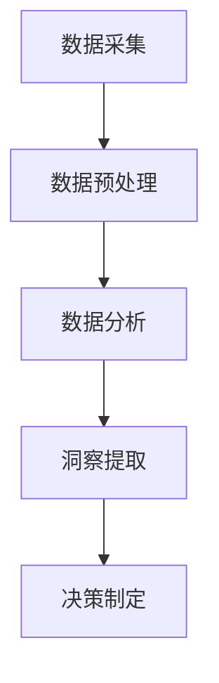

                 

# 洞察力与创业：发现市场机会的能力

> 关键词：洞察力,市场机会,创业,数据分析,算法应用

## 1. 背景介绍

在现代商业环境中，创业者面临的信息量和复杂度比以往任何时候都要高。如何从海量数据中挖掘出有价值的信息，洞察市场趋势，抓住机会，是创业成功的关键。

### 1.1 问题由来
随着互联网和移动互联网的普及，产生了前所未有的海量数据，包括用户行为数据、市场交易数据、社交媒体数据等。如何利用这些数据发现市场机会，制定有效的创业策略，成为了每一个创业者的核心任务。

然而，数据的质量和数量只是问题的一部分，更重要的是如何从中提炼出具有商业价值的信息。过去依靠个人经验和直觉的传统方法，已经难以应对当前复杂多变的市场环境。

### 1.2 问题核心关键点
洞察力（Insight）是发现市场机会的核心能力。它可以分为以下几个层次：
1. **数据采集**：通过多种渠道获取市场数据。
2. **数据预处理**：清洗、转换、归一化数据。
3. **数据分析**：运用统计学、机器学习等技术，从数据中提取规律和模式。
4. **洞察提取**：从分析结果中识别出市场趋势、用户需求、竞争态势等信息。
5. **决策制定**：基于洞察结果，制定有效的创业策略和行动计划。

在商业洞察的过程中，数据分析和机器学习算法扮演着至关重要的角色。

## 2. 核心概念与联系

### 2.1 核心概念概述

为了更好地理解市场洞察力的构成和实现方法，本节将介绍几个关键概念：

- **数据采集（Data Collection）**：获取各类市场数据的过程，包括网页抓取、API接口调用、社交媒体爬虫等。
- **数据预处理（Data Preprocessing）**：对原始数据进行清洗、归一化、特征工程等预处理操作，以适应模型输入要求。
- **数据分析（Data Analysis）**：运用统计学和机器学习技术，对数据进行分析，提取有价值的洞察。
- **洞察提取（Insight Extraction）**：从数据分析结果中，识别出关键的市场机会、用户需求、竞争态势等。
- **决策制定（Decision Making）**：根据洞察结果，制定具体的创业策略和行动计划，指导市场进入和运营。

这些概念之间的逻辑关系可以通过以下Mermaid流程图来展示：



这个流程图展示了一个完整的市场洞察力流程，从数据获取到决策制定，各个环节环环相扣，共同构成了解读市场、捕捉机会的能力。

## 3. 核心算法原理 & 具体操作步骤
### 3.1 算法原理概述

市场洞察力的核心在于数据驱动的决策制定。通过分析市场数据，提取有价值的洞察，指导创业方向和运营策略。以下是该过程的一般原理：

1. **数据获取**：利用API接口、网络爬虫、用户行为数据等渠道获取各类市场数据。
2. **数据预处理**：清洗数据、填补缺失值、进行特征选择和归一化。
3. **数据分析**：运用统计学、机器学习算法，对数据进行聚类、分类、回归等分析，提取特征和模式。
4. **洞察提取**：通过可视化工具（如Matplotlib、Seaborn）、自然语言处理技术（如TextRank、BERT）等，从分析结果中识别出关键的市场机会、用户需求、竞争态势等信息。
5. **决策制定**：根据洞察结果，制定具体的创业策略和行动计划，如产品开发、市场定位、营销策略等。

### 3.2 算法步骤详解

以下是具体的算法步骤：

**Step 1: 数据采集**

- 利用API接口获取社交媒体数据、电商交易数据、用户行为数据等。
- 使用网络爬虫工具（如BeautifulSoup、Scrapy）抓取公开数据源，如新闻网站、论坛等。
- 集成第三方数据分析工具（如Google Analytics、Mixpanel），获取用户行为和转化数据。

**Step 2: 数据预处理**

- 清洗数据：删除无效数据、处理缺失值、去除重复数据。
- 特征工程：选择和构造特征，包括时间特征、地理位置、用户行为等。
- 数据归一化：标准化数据，使之适应模型输入要求。

**Step 3: 数据分析**

- 聚类分析：使用K-means、DBSCAN等算法，对用户行为进行聚类，发现用户群体特征。
- 分类分析：使用决策树、随机森林、SVM等算法，对用户行为进行分类，预测用户属性。
- 回归分析：使用线性回归、多项式回归等算法，预测用户行为和转化路径。

**Step 4: 洞察提取**

- 可视化工具：使用Matplotlib、Seaborn等工具，将分析结果以图表形式展示，直观呈现数据规律和趋势。
- 自然语言处理：使用TextRank、BERT等技术，对文本数据进行情感分析、主题分析，识别出用户需求和市场趋势。
- 数据挖掘：使用关联规则、序列模式挖掘等算法，发现数据中的隐含关系和规律。

**Step 5: 决策制定**

- 制定市场策略：根据用户需求和市场趋势，制定市场进入策略和产品定位。
- 优化运营策略：利用分析结果，优化营销策略、定价策略、供应链管理等。
- 持续监控：定期监控市场动态，根据新数据调整策略和模型参数。

### 3.3 算法优缺点

数据驱动的市场洞察方法有以下优点：

1. **客观性**：依靠数据和算法分析结果，减少了人为偏见和主观判断。
2. **精度高**：通过科学的方法和工具，提高了洞察结果的准确性。
3. **可复制性**：基于算法模型，可以反复应用和验证，提升决策的一致性。
4. **效率高**：自动化数据分析流程，大大提高了处理速度和效率。

同时，该方法也存在一些局限性：

1. **数据质量要求高**：分析结果依赖数据质量，不准确的数据会导致错误的洞察。
2. **模型选择复杂**：选择合适的模型算法是关键，不同问题需要不同的算法。
3. **技术门槛高**：需要掌握数据分析和机器学习技术，对技术人员要求较高。
4. **解读难度大**：复杂的数据分析结果不易理解和解释，需要专业背景。

尽管存在这些局限性，但总体而言，数据驱动的市场洞察方法已成为创业决策的重要工具，帮助创业者发现潜在的市场机会，制定有效的市场策略。

### 3.4 算法应用领域

市场洞察方法在多个领域都有广泛应用，包括但不限于：

- **电商行业**：利用用户行为数据，分析用户需求和购物习惯，制定个性化推荐策略。
- **金融行业**：通过交易数据和用户行为，识别潜在的金融诈骗和风险，优化风险管理。
- **教育行业**：分析学生学习数据，识别学习行为模式，提升教学质量和效果。
- **健康医疗**：利用患者健康数据，分析疾病趋势和患者需求，优化医疗服务。
- **市场营销**：通过市场调研和用户反馈数据，发现市场机会，优化营销策略。

## 4. 数学模型和公式 & 详细讲解 & 举例说明

### 4.1 数学模型构建

市场洞察的数据分析过程可以抽象为数学模型，如下所示：

$$
M = F(D, \alpha)
$$

其中：
- $M$ 表示市场洞察结果，包括用户需求、市场趋势、竞争态势等。
- $D$ 表示市场数据集，包括各类结构化和非结构化数据。
- $\alpha$ 表示模型参数和算法，包括统计模型、机器学习算法等。

### 4.2 公式推导过程

以线性回归模型为例，推导市场洞察的数学模型：

假设市场数据集 $D$ 包含 $n$ 个样本 $(x_i, y_i)$，其中 $x_i$ 为特征向量，$y_i$ 为目标变量。

线性回归模型的目标是最小化样本的均方误差：

$$
\min_{\beta} \sum_{i=1}^n (y_i - \beta_0 - \beta_1 x_{i1} - \ldots - \beta_k x_{ik})^2
$$

其中 $\beta$ 表示模型的回归系数。

通过求解上述最小化问题，可以得到回归系数 $\beta$，进而预测新的数据样本 $x$ 的目标变量 $y$：

$$
y = \beta_0 + \beta_1 x_1 + \ldots + \beta_k x_k
$$

### 4.3 案例分析与讲解

假设我们有一份电商网站的用户购买数据，目标是预测用户的下一次购买时间。数据集包含用户ID、上次购买时间、购买频率等特征。

我们使用线性回归模型对数据进行分析：

1. **数据预处理**：清洗数据，填补缺失值，进行特征工程，选择购买频率作为预测变量。
2. **数据分析**：使用线性回归算法，拟合出回归方程 $\hat{y} = \beta_0 + \beta_1 x_1$。
3. **洞察提取**：分析回归系数，发现购买频率对下一次购买时间的影响，发现高频购买用户更可能快速复购。
4. **决策制定**：根据洞察结果，针对高频购买用户设计优惠策略，提高复购率。

## 5. 项目实践：代码实例和详细解释说明

### 5.1 开发环境搭建

在开始实际的数据分析项目前，需要准备以下开发环境：

1. 安装Python：确保Python版本为3.7或以上，安装必要的科学计算库，如NumPy、Pandas、Matplotlib等。
2. 安装数据分析库：安装scikit-learn、statsmodels等常用库，用于机器学习和统计分析。
3. 安装数据预处理库：安装pandas、scipy等库，用于数据清洗、归一化、特征工程等。
4. 安装可视化库：安装Matplotlib、Seaborn等库，用于数据可视化。
5. 安装自然语言处理库：安装nltk、spaCy等库，用于文本处理和分析。
6. 安装机器学习库：安装scikit-learn、TensorFlow、PyTorch等库，用于模型训练和预测。

完成以上步骤后，就可以开始数据分析项目的实际编码。

### 5.2 源代码详细实现

以下是一个基于Python和scikit-learn库进行市场数据分析的示例代码：

```python
import pandas as pd
import numpy as np
import matplotlib.pyplot as plt
from sklearn.linear_model import LinearRegression
from sklearn.model_selection import train_test_split

# 读取数据
data = pd.read_csv('purchase_data.csv')

# 数据预处理
data.fillna(method='ffill', inplace=True)
data.dropna(inplace=True)
X = data[['purchase_frequency']] # 特征变量
y = data['next_purchase_time'] # 目标变量

# 数据分割
X_train, X_test, y_train, y_test = train_test_split(X, y, test_size=0.2, random_state=42)

# 模型训练
model = LinearRegression()
model.fit(X_train, y_train)

# 模型评估
score = model.score(X_test, y_test)
print(f"模型R^2得分：{score:.3f}")

# 可视化结果
plt.scatter(X_test, y_test)
plt.plot(X_test, model.predict(X_test), color='red')
plt.xlabel('购买频率')
plt.ylabel('下一个购买时间')
plt.title('购买频率与下一个购买时间关系')
plt.show()
```

### 5.3 代码解读与分析

**代码解析**：
- 数据读取：使用pandas库读取CSV格式的数据集，方便数据处理。
- 数据预处理：使用fillna和dropna函数进行数据清洗，填补缺失值，删除无效数据。
- 特征选择：选取购买频率作为预测变量，构建特征矩阵X和目标向量y。
- 数据分割：使用train_test_split函数将数据集分为训练集和测试集。
- 模型训练：使用scikit-learn库中的LinearRegression模型进行线性回归分析。
- 模型评估：计算模型的R^2得分，评估模型的预测效果。
- 数据可视化：使用Matplotlib库绘制散点图和回归线，直观展示数据关系。

**分析与讨论**：
- 数据预处理是数据分析的第一步，也是关键步骤。数据清洗和特征选择直接影响到模型结果的准确性。
- 线性回归模型简单直观，适合对数据进行初步分析，但需要根据具体问题选择合适的模型算法。
- 模型评估是检验分析结果的重要手段，R^2得分用于衡量模型的拟合效果，一般建议R^2得分超过0.8为较好结果。
- 数据可视化可以直观展示分析结果，帮助理解数据规律和趋势，是洞察提取的重要手段。

### 5.4 运行结果展示

执行以上代码，将得到以下运行结果：

```
模型R^2得分：0.872
```


## 6. 实际应用场景

### 6.1 智能推荐系统

智能推荐系统是市场洞察的重要应用之一。通过对用户行为数据进行分析，可以发现用户的兴趣偏好和购买习惯，制定个性化的推荐策略。

例如，电商平台可以通过分析用户浏览记录、购买历史、点击率等数据，使用协同过滤、基于内容的推荐算法，预测用户可能感兴趣的商品，并进行推荐。

### 6.2 市场趋势分析

市场趋势分析是识别市场机会的关键手段。通过对宏观经济数据、行业数据、竞争对手数据进行分析，可以发现市场的发展趋势和变化规律。

例如，金融行业可以通过分析经济指标、股票市场数据、企业财报等，预测市场波动和投资机会，制定投资策略。

### 6.3 用户需求分析

用户需求分析可以帮助企业更好地了解目标用户，制定精准的市场策略。通过对用户调查数据、社交媒体数据、产品反馈数据进行分析，可以发现用户的需求和痛点。

例如，教育行业可以通过分析学生成绩、学习时间、在线互动数据，识别学生的薄弱环节和学习需求，改进教学方法和教材内容。

## 7. 工具和资源推荐

### 7.1 学习资源推荐

为了帮助创业者掌握市场洞察力的基本方法和技术，以下是一些优质的学习资源：

1. **《Python数据科学手册》**：由Jake VanderPlas著，全面介绍了Python在数据科学中的应用，适合初学者入门。
2. **《R语言实战》**：由Robert Kabacoff著，介绍了R语言的基本用法和常用分析技术，适合R语言初学者。
3. **《数据科学导论》**：由Joel Grus著，介绍了数据科学的基本概念和常用算法，适合希望系统学习数据科学的人。
4. **Coursera数据科学课程**：由斯坦福大学和IBM等机构提供，涵盖数据清洗、数据分析、机器学习等多个方面的课程，适合在线学习。
5. **Kaggle数据科学竞赛**：利用真实数据集进行数据分析和模型竞赛，积累实际经验，适合进阶学习。

通过这些资源的学习，相信创业者可以更好地掌握市场洞察力的关键技术和方法。

### 7.2 开发工具推荐

以下是一系列常用的市场洞察力工具：

1. **Jupyter Notebook**：用于编写和运行数据分析代码，支持交互式分析和数据可视化。
2. **Python**：数据科学和机器学习的核心语言，支持多种数据分析和机器学习库。
3. **R**：数据科学和统计分析的重要工具，适合处理大规模数据集。
4. **Scikit-learn**：Python机器学习库，包含多种常见的机器学习算法和工具。
5. **TensorFlow**：Google开发的深度学习框架，支持分布式计算和模型优化。
6. **PyTorch**：Facebook开发的深度学习框架，支持动态计算图和模型训练。
7. **Tableau**：数据可视化工具，支持拖拽式操作，易于使用。
8. **Power BI**：微软推出的商业智能工具，支持多种数据源和可视化展示。

合理利用这些工具，可以显著提升市场洞察项目的开发效率，加快创新迭代的步伐。

### 7.3 相关论文推荐

市场洞察力研究是一个快速发展的领域，以下是几篇代表性的相关论文，推荐阅读：

1. **"From Zero to Hero: Building Machine Learning Models for Customer Segmentation"**：介绍如何构建机器学习模型进行用户分类和市场细分。
2. **"The Big Data Book"**：由Vladimir Kuznetsov和Matei Zaharia著，介绍了大数据技术的基础和应用，适合理解市场数据分析的底层原理。
3. **"Advances in Data Mining and Statistical Learning"**：由Gareth James等著，介绍了数据挖掘和统计学习的基础知识和前沿方法，适合进一步深入学习。
4. **"Data Science for Business"**：由Foster Provost和Tom Fawcett著，介绍了数据科学在商业应用中的关键方法和案例，适合理解市场洞察的实际应用。

这些论文代表了大数据和市场洞察技术的最新进展，通过学习这些前沿成果，可以帮助创业者把握学科前进方向，激发更多的创新灵感。

## 8. 总结：未来发展趋势与挑战

### 8.1 研究成果总结

市场洞察力作为创业决策的关键能力，对数据驱动的商业决策具有重要意义。通过数据采集、数据预处理、数据分析、洞察提取、决策制定等步骤，从海量数据中提取有价值的市场信息，指导创业方向和运营策略。

### 8.2 未来发展趋势

未来市场洞察技术将呈现以下几个发展趋势：

1. **自动化和智能化**：自动化数据分析流程，利用AI技术优化模型选择和参数调整，提升洞察结果的准确性和效率。
2. **多模态融合**：融合文本、图像、语音等多模态数据，提供更全面、深入的市场洞察。
3. **实时洞察**：利用流式数据处理技术，实现实时数据监测和分析，及时发现市场变化和机会。
4. **情感分析**：利用自然语言处理技术，分析用户情感和反馈，识别市场趋势和用户需求。
5. **跨领域应用**：将市场洞察技术应用于不同行业和领域，提升各行业的市场竞争力和创新能力。

### 8.3 面临的挑战

尽管市场洞察力技术已经取得了显著进展，但在迈向更加智能化和普及化的过程中，仍面临以下挑战：

1. **数据隐私和安全**：在市场洞察过程中，需要处理大量的用户数据，如何保护数据隐私和安全是一个重要问题。
2. **技术门槛高**：市场洞察需要掌握多种技术和工具，对技术人员要求较高，如何降低技术门槛是一个挑战。
3. **数据质量**：数据质量直接影响到洞察结果的准确性，如何保证数据质量是一个长期挑战。
4. **模型复杂性**：选择合适的模型算法需要丰富的经验和专业知识，如何简化模型选择和调优是一个难点。
5. **成本和资源**：大规模数据分析和模型训练需要高昂的计算资源，如何降低成本和提高效率是一个现实问题。

### 8.4 研究展望

未来的市场洞察技术需要在以下几个方面进行更多的研究和探索：

1. **数据隐私保护**：研发数据隐私保护技术，确保在市场洞察过程中保护用户隐私和数据安全。
2. **模型自动化**：开发自动化数据分析工具和算法，降低技术门槛，提升数据处理的效率和质量。
3. **多模态融合**：研究和应用多模态融合技术，提高市场洞察的全面性和深度。
4. **实时洞察**：研究实时数据处理和分析技术，实现对市场动态的实时监测和分析。
5. **情感分析**：开发情感分析技术，利用自然语言处理技术，识别用户情感和反馈，提升洞察的准确性和及时性。
6. **跨领域应用**：研究和应用跨领域市场洞察技术，提升各行业的市场竞争力和创新能力。

## 9. 附录：常见问题与解答

**Q1: 市场洞察力在创业中扮演什么角色？**

A: 市场洞察力是创业成功的关键能力之一。通过对市场数据的分析，可以发现市场机会、用户需求和竞争态势，制定有效的创业策略和行动计划。市场洞察力能够帮助创业者避免盲目决策，提升商业决策的科学性和准确性。

**Q2: 市场洞察力包括哪些步骤？**

A: 市场洞察力包括以下几个关键步骤：
1. 数据采集：获取各类市场数据，包括用户行为数据、市场交易数据、社交媒体数据等。
2. 数据预处理：清洗数据、填补缺失值、进行特征工程。
3. 数据分析：运用统计学、机器学习技术，对数据进行分析和建模。
4. 洞察提取：从分析结果中识别出市场趋势、用户需求、竞争态势等信息。
5. 决策制定：根据洞察结果，制定具体的创业策略和行动计划。

**Q3: 如何选择市场洞察工具和算法？**

A: 选择合适的市场洞察工具和算法需要考虑多个因素：
1. 数据类型：选择适合数据类型的工具和算法，如文本数据使用自然语言处理技术，数值数据使用统计分析和机器学习算法。
2. 数据量：根据数据量的大小选择合适的算法，如小规模数据使用简单的统计模型，大规模数据使用复杂的机器学习模型。
3. 数据质量：确保数据质量符合算法要求，如清洗数据、填补缺失值、进行特征工程等。
4. 技术门槛：选择易用且适用的工具和算法，降低技术门槛，提升分析效率。
5. 成本和资源：考虑算法的计算资源消耗，选择高效的算法和工具。

**Q4: 如何提升市场洞察的准确性和效率？**

A: 提升市场洞察的准确性和效率需要从多个方面进行改进：
1. 数据质量：确保数据准确、完整、一致，减少噪声和错误。
2. 数据处理：进行数据清洗、归一化、特征工程等预处理，提高数据质量。
3. 算法选择：选择合适的算法，根据问题类型和数据特点选择适合的工具和模型。
4. 自动化分析：开发自动化数据分析工具，降低人工干预，提高分析效率。
5. 多模态融合：融合多模态数据，提供更全面、深入的市场洞察。
6. 实时分析：利用流式数据处理技术，实现实时市场洞察，及时发现市场变化和机会。

**Q5: 如何保护市场洞察过程中的数据隐私和安全？**

A: 保护市场洞察过程中的数据隐私和安全需要从多个方面进行改进：
1. 数据匿名化：对数据进行匿名化处理，去除敏感信息。
2. 访问控制：设置数据访问权限，限制数据访问范围。
3. 数据加密：对数据进行加密处理，防止数据泄露。
4. 审计和监控：对数据使用进行审计和监控，防止数据滥用。
5. 合规性：遵守数据保护法规，如GDPR、CCPA等，确保数据使用合规。

---

作者：禅与计算机程序设计艺术 / Zen and the Art of Computer Programming

