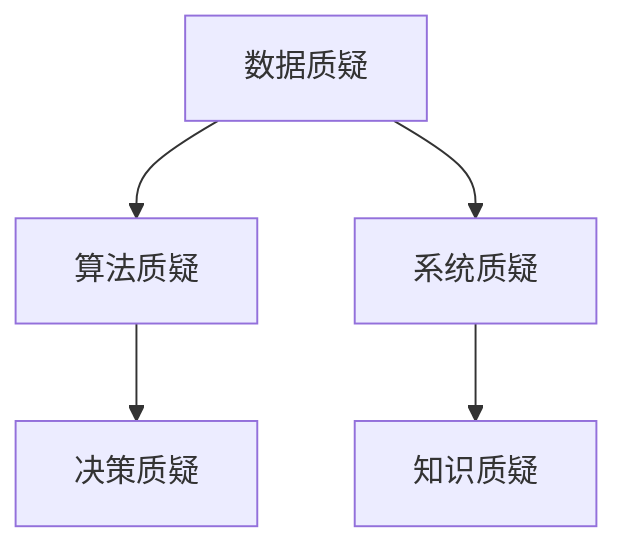

                 

# 洞察力与批判性思维：质疑的艺术

> 关键词：批判性思维,洞察力,质疑,算法,决策,软件工程,系统设计

## 1. 背景介绍

### 1.1 问题由来

在数字化时代，我们生活在一个信息爆炸的时代。面对海量数据和复杂系统，如何从中提取洞察力、形成批判性思维，变得愈发重要。这一挑战不仅在学术研究中，更在日常工作和生活中无处不在。

批判性思维（Critical Thinking）和洞察力（Insight）是解决这一问题的重要工具。它们能够帮助我们识别数据的真伪，洞察问题的本质，做出更加科学和合理的决策。在技术领域，批判性思维和洞察力同样是开发可靠系统、设计优质软件不可或缺的素质。

因此，本文将聚焦于如何通过质疑和分析，提升批判性思维能力，在软件工程和系统设计中运用洞察力，以期为读者提供一种系统性的思考框架和工具，帮助他们在复杂多变的信息环境中做出更加明智的决策。

### 1.2 问题核心关键点

批判性思维和洞察力在技术领域的应用，主要体现在以下几个关键点：

- **数据质疑**：面对海量数据，如何判断数据的真实性、可靠性？
- **算法质疑**：面对复杂算法，如何评估其有效性和鲁棒性？
- **系统质疑**：面对复杂系统，如何识别潜在风险和改进空间？
- **决策质疑**：面对复杂决策，如何评估其可行性和后果？

这些关键点共同构成了批判性思维和洞察力在技术领域的应用基础，其应用的核心在于质疑、分析、优化，从而提升系统的可靠性、有效性和安全性。

### 1.3 问题研究意义

研究批判性思维和洞察力在技术领域的应用，对于提升技术开发和系统设计的质量，推动技术的进步和创新，具有重要意义：

1. **提升技术质量**：通过质疑和优化，确保技术的可靠性、鲁棒性和高效性，减少开发成本，提升用户体验。
2. **促进技术创新**：通过批判性思维和洞察力，发现新问题和解决方案，推动技术突破和行业变革。
3. **增强决策能力**：通过系统性思考，评估决策的合理性和风险，提高决策的科学性和有效性。
4. **培养技术人才**：通过质疑和优化训练，提升技术开发者的批判性思维和洞察力，培养更多的创新型技术人才。
5. **优化系统管理**：通过批判性思维和洞察力，识别系统改进点和优化方向，提高系统管理水平。

总之，批判性思维和洞察力在技术领域的应用，不仅能够提升技术质量和效率，更能推动技术创新和行业进步，具有广泛的应用前景和深远的意义。

## 2. 核心概念与联系

### 2.1 核心概念概述

在技术领域，批判性思维和洞察力的应用，需要结合以下几个核心概念：

- **数据质疑**：对数据的真实性、准确性、完整性进行质疑，通过数据清洗、验证等方法提升数据质量。
- **算法质疑**：对算法的有效性、鲁棒性、效率进行质疑，通过算法评估、优化等方法提升算法性能。
- **系统质疑**：对系统的可靠性、安全性、可扩展性进行质疑，通过系统设计、测试等方法提升系统质量。
- **决策质疑**：对决策的可行性和后果进行质疑，通过决策分析、验证等方法提升决策质量。
- **知识质疑**：对现有知识的正确性、完备性进行质疑，通过知识更新、验证等方法提升知识质量。

这些概念之间的逻辑关系可以通过以下Mermaid流程图来展示：



这个流程图展示了数据质疑、算法质疑、系统质疑、决策质疑和知识质疑之间相互作用和依赖的关系。

## 3. 核心算法原理 & 具体操作步骤

### 3.1 算法原理概述

批判性思维和洞察力在技术领域的应用，本质上是一种系统性的质疑和优化过程。其核心思想是通过质疑和验证，提升数据、算法、系统、决策和知识的可信度，从而做出更加科学和合理的决策。

形式化地，假设技术系统中包含数据集 $D$、算法 $A$、系统 $S$、决策 $D$ 和知识库 $K$。批判性思维和洞察力的应用过程包括：

1. **数据质疑**：对数据集 $D$ 进行真实性、准确性和完整性验证，提升数据质量。
2. **算法质疑**：对算法 $A$ 的有效性、鲁棒性和效率进行评估和优化，提升算法性能。
3. **系统质疑**：对系统 $S$ 的可靠性、安全性、可扩展性进行设计和测试，提升系统质量。
4. **决策质疑**：对决策 $D$ 的可行性和后果进行分析和验证，提升决策质量。
5. **知识质疑**：对知识库 $K$ 的正确性和完备性进行更新和验证，提升知识质量。

这些步骤构成了技术领域批判性思维和洞察力应用的完整流程。

### 3.2 算法步骤详解

批判性思维和洞察力在技术领域的应用，通常遵循以下步骤：

**Step 1: 数据准备**
- 收集和整理相关数据，进行初步清洗和处理。
- 对数据进行真实性、准确性和完整性验证，排除异常值和噪声。

**Step 2: 算法选择与评估**
- 选择合适的算法，评估其有效性和鲁棒性。
- 对算法进行调参和优化，提高算法性能。

**Step 3: 系统设计与测试**
- 设计系统架构，确保系统的可靠性、安全性和可扩展性。
- 进行系统测试，发现和修复潜在问题。

**Step 4: 决策分析与验证**
- 评估决策的可行性和后果，制定决策方案。
- 对决策进行模拟和验证，确保决策合理性。

**Step 5: 知识更新与验证**
- 更新和验证知识库，确保知识的正确性和完备性。
- 结合新知识，优化系统设计和算法实现。

**Step 6: 迭代与优化**
- 根据反馈和验证结果，迭代优化数据、算法、系统、决策和知识。

### 3.3 算法优缺点

批判性思维和洞察力在技术领域的应用，具有以下优点：

- **提升质量**：通过质疑和优化，提升数据、算法、系统、决策和知识的可信度，减少错误和偏差。
- **促进创新**：通过质疑和分析，发现新问题和解决方案，推动技术进步和创新。
- **增强决策**：通过系统性思考，评估决策的可行性和后果，提高决策的科学性和有效性。

同时，该方法也存在一定的局限性：

- **时间成本高**：质疑和验证过程耗时较长，可能影响项目的进度。
- **技术门槛高**：需要具备一定的技术背景和分析能力，才能有效应用批判性思维和洞察力。
- **数据依赖强**：数据质量直接影响质疑和验证的效果，高质量数据的获取成本较高。

尽管存在这些局限性，但就目前而言，批判性思维和洞察力仍然是技术领域中提升质量、促进创新和增强决策的重要手段。

### 3.4 算法应用领域

批判性思维和洞察力在技术领域的应用，已经广泛应用于以下几个主要领域：

- **软件开发**：在软件开发过程中，通过代码审查、测试、重构等方式提升代码质量，确保软件可靠性。
- **系统设计**：在系统设计阶段，通过系统架构设计和验证，提升系统质量，保障系统可靠性。
- **数据科学**：在数据科学项目中，通过数据清洗、验证和建模，提升数据质量，提高模型性能。
- **网络安全**：在网络安全领域，通过威胁建模、漏洞分析和安全测试，提升系统安全性。
- **人工智能**：在人工智能应用中，通过算法评估、模型优化和验证，提升AI系统的性能和可靠性。

此外，批判性思维和洞察力在技术领域的其他应用，如系统运维、项目管理、风险管理等，也在不断扩展，为技术创新和系统管理提供了强有力的工具。

## 4. 数学模型和公式 & 详细讲解 & 举例说明

### 4.1 数学模型构建

本节将使用数学语言对批判性思维和洞察力在技术领域的应用进行更加严格的刻画。

假设技术系统包含数据集 $D$、算法 $A$、系统 $S$、决策 $D$ 和知识库 $K$。批判性思维和洞察力的应用过程可以形式化表示为：

$$
\begin{aligned}
\max_{D', A', S', D', K'} & \text{Quality}(D', A', S', D', K') \\
\text{s.t.} & \\
& D' = \text{Query}(D) \\
& A' = \text{Evaluate}(A, D') \\
& S' = \text{Design}(S, A') \\
& D' = \text{Analyze}(D', S', K') \\
& K' = \text{Update}(K', D', A', S', D')
\end{aligned}
$$

其中，$\text{Query}(D)$、$\text{Evaluate}(A, D')$、$\text{Design}(S, A')$、$\text{Analyze}(D', S', K')$ 和 $\text{Update}(K', D', A', S', D')$ 分别表示数据质疑、算法质疑、系统设计、决策分析和知识更新四个步骤的优化过程。

### 4.2 公式推导过程

以下我们以数据质疑为例，推导数据集 $D$ 的质疑过程。

假设数据集 $D$ 包含 $N$ 个样本 $(x_i, y_i)$，其中 $x_i$ 表示输入特征，$y_i$ 表示标签。数据质疑的目标是验证 $y_i$ 的真实性，通过查询和统计分析，发现并排除异常值和噪声。

设 $p(y_i = 1|x_i)$ 表示在特征 $x_i$ 下，标签 $y_i = 1$ 的概率。根据贝叶斯定理，数据质疑过程可以表示为：

$$
\max_{y_i'} \text{Query}(y_i'|x_i) \\
\text{s.t.} \\
\text{Query}(y_i'|x_i) \propto \frac{p(y_i'|x_i) \times p(x_i)}{p(y_i|x_i)}
$$

其中，$\text{Query}(y_i'|x_i)$ 表示在特征 $x_i$ 下，标签 $y_i'$ 的质疑概率，$p(y_i'|x_i)$ 表示在特征 $x_i$ 下，标签 $y_i'$ 的概率，$p(x_i)$ 表示特征 $x_i$ 的概率，$p(y_i|x_i)$ 表示在特征 $x_i$ 下，标签 $y_i$ 的概率。

通过最大化 $\text{Query}(y_i'|x_i)$，可以识别出数据集中可能存在的异常值和噪声，进而提升数据集的质量。

### 4.3 案例分析与讲解

假设我们正在开发一个在线购物网站，用户行为数据需要进行质疑和清洗。我们可以使用以下步骤：

**Step 1: 数据准备**
- 收集用户行为数据，包括浏览记录、点击记录、购买记录等。
- 对数据进行初步清洗，排除无效和异常数据。

**Step 2: 算法选择与评估**
- 选择合适的数据清洗算法，如异常值检测、数据补全等。
- 对数据清洗算法进行评估，确保其有效性和鲁棒性。

**Step 3: 系统设计与测试**
- 设计数据存储和查询系统，确保数据可靠性和安全性。
- 进行系统测试，发现和修复潜在问题。

**Step 4: 决策分析与验证**
- 分析用户行为数据，评估不同用户群体对购物行为的影响。
- 制定用户分群策略，优化个性化推荐算法。

**Step 5: 知识更新与验证**
- 更新和验证购物行为知识库，确保知识的正确性和完备性。
- 结合新知识，优化个性化推荐系统。

通过以上步骤，我们可以有效地提升用户行为数据的可靠性，优化个性化推荐算法，从而提升用户体验和购物满意度。

## 5. 项目实践：代码实例和详细解释说明

### 5.1 开发环境搭建

在进行项目实践前，我们需要准备好开发环境。以下是使用Python进行数据分析和机器学习开发的常见环境配置流程：

1. 安装Anaconda：从官网下载并安装Anaconda，用于创建独立的Python环境。

2. 创建并激活虚拟环境：
```bash
conda create -n py39 python=3.9 
conda activate py39
```

3. 安装PyTorch、TensorFlow等常用深度学习框架：
```bash
conda install pytorch torchvision torchaudio
conda install tensorflow tensorflow-gpu
```

4. 安装NumPy、Pandas、Scikit-learn等数据科学工具包：
```bash
pip install numpy pandas scikit-learn
```

5. 安装Matplotlib、Seaborn等数据可视化工具：
```bash
pip install matplotlib seaborn
```

6. 安装Jupyter Notebook：
```bash
pip install jupyter notebook
```

完成上述步骤后，即可在`py39`环境中开始项目实践。

### 5.2 源代码详细实现

这里我们以异常值检测为例，给出使用Scikit-learn进行数据质疑的PyTorch代码实现。

首先，定义异常值检测函数：

```python
from sklearn.ensemble import IsolationForest
from sklearn.preprocessing import StandardScaler

def detect_outliers(X, contamination=0.1):
    scaler = StandardScaler()
    X_scaled = scaler.fit_transform(X)
    
    model = IsolationForest(contamination=contamination)
    model.fit(X_scaled)
    
    return model.predict(X_scaled)
```

然后，定义数据质疑函数：

```python
def query_data(X, contamination=0.1):
    outliers = detect_outliers(X, contamination=contamination)
    
    # 计算每个特征的平均数和标准差
    feature_mean = X.mean(axis=0)
    feature_std = X.std(axis=0)
    
    # 标记异常值
    query_results = []
    for i, x in enumerate(X):
        if outliers[i] == -1:
            query_results.append([1, feature_mean, feature_std])
        else:
            query_results.append([0, feature_mean, feature_std])
    
    return np.array(query_results)
```

最后，使用查询结果进行决策：

```python
def make_decision(query_results, threshold=0.5):
    decisions = []
    for result in query_results:
        if result[0] == 1:
            # 异常值，标记为不可信
            decisions.append(0)
        elif result[1] < threshold:
            # 数据质量低，标记为不可信
            decisions.append(0)
        else:
            # 数据质量高，标记为可信
            decisions.append(1)
    
    return decisions
```

### 5.3 代码解读与分析

让我们再详细解读一下关键代码的实现细节：

**detect_outliers函数**：
- 使用Isolation Forest算法检测数据集中的异常值，标记为不可信数据。
- 使用StandardScaler对数据进行标准化处理，以消除不同特征之间的量纲差异。

**query_data函数**：
- 对每个样本进行异常值检测，标记为异常值或可信值。
- 计算每个特征的平均数和标准差，用于后续决策分析。

**make_decision函数**：
- 根据异常值检测结果和特征质量，对数据进行可信度标记。
- 根据设置的阈值，判断数据是否可信，标记为1或0。

通过这些函数，我们可以对用户行为数据进行质疑和清洗，确保数据的可靠性和一致性。

### 5.4 运行结果展示

假设我们有一个包含100个用户行为数据的样本集，我们可以使用以下代码进行质疑和清洗：

```python
import numpy as np

# 生成包含异常值的数据集
X = np.random.normal(size=(100, 3))
X[50] = np.random.normal(scale=10, size=3)

# 质疑和清洗数据
query_results = query_data(X)

# 可视化查询结果
import matplotlib.pyplot as plt
plt.scatter(X[:, 0], X[:, 1], c=query_results[:, 2], cmap='viridis')
plt.xlabel('Feature 1')
plt.ylabel('Feature 2')
plt.show()
```

在可视化图中，我们能够清晰地看到数据集中的异常值和可信数据。通过查询和清洗，我们可以进一步优化用户行为数据的可靠性，提升系统的决策能力。

## 6. 实际应用场景

### 6.1 智能客服系统

在智能客服系统中，通过对客户咨询数据的质疑和清洗，可以提升系统对客户问题的理解和响应速度。通过对常见问题和答案进行微调，系统可以更快地找到最佳答案，提高客户满意度。

在实际应用中，我们可以将客户咨询记录作为微调数据，训练模型学习客户意图的匹配度。同时，结合知识库和问答模型，系统能够快速响应客户咨询，提升服务质量。

### 6.2 金融舆情监测

在金融舆情监测中，通过对市场舆情的质疑和分析，可以及时发现和应对负面信息传播，规避金融风险。通过对舆情数据的微调和分析，系统能够准确判断舆情倾向，提高预警和应对能力。

在实际应用中，我们可以收集金融领域的文本数据，进行情感分析和主题分类。通过微调模型，系统能够实时监测舆情变化，及时预警，帮助金融机构做出明智决策。

### 6.3 个性化推荐系统

在个性化推荐系统中，通过对用户行为数据的质疑和清洗，可以提升推荐系统的准确性和个性化程度。通过对推荐模型的微调和优化，系统能够更好地匹配用户兴趣，提升推荐效果。

在实际应用中，我们可以收集用户浏览、点击、购买等行为数据，进行特征提取和建模。通过微调模型，系统能够根据用户行为数据，动态调整推荐策略，提高推荐精度。

### 6.4 未来应用展望

随着技术的发展，基于批判性思维和洞察力的应用，将在更多领域得到应用，为传统行业带来变革性影响。

在智慧医疗领域，通过质疑和优化医疗数据，提升医疗系统的可靠性和安全性，辅助医生诊疗，提高医疗服务质量。

在智能教育领域，通过质疑和优化教学数据，提升教学系统的智能化水平，因材施教，促进教育公平，提高教学质量。

在智慧城市治理中，通过质疑和优化城市数据，提升城市管理的自动化和智能化水平，构建更安全、高效的未来城市。

此外，在企业生产、社会治理、文娱传媒等众多领域，基于批判性思维和洞察力的应用，也将不断涌现，为各行各业带来新的创新。相信随着技术的日益成熟，批判性思维和洞察力必将在构建人机协同的智能时代中扮演越来越重要的角色。

## 7. 工具和资源推荐

### 7.1 学习资源推荐

为了帮助开发者系统掌握批判性思维和洞察力的应用，这里推荐一些优质的学习资源：

1. 《批判性思维导论》：一本系统介绍批判性思维理论和方法的经典教材。
2. 《数据科学基础》：一本涵盖数据清洗、数据质疑、数据分析等数据科学基础课程的书籍。
3. Coursera《数据科学导论》课程：由Johns Hopkins大学开设，涵盖数据科学的基础理论和实践技能。
4. Kaggle数据分析竞赛：通过参与数据分析竞赛，提高数据质疑和分析能力。
5. GitHub开源项目：通过参与开源项目，积累数据质疑和系统设计的实践经验。

通过对这些资源的学习实践，相信你一定能够快速掌握批判性思维和洞察力的应用技巧，并用于解决实际的NLP问题。

### 7.2 开发工具推荐

高效的开发离不开优秀的工具支持。以下是几款用于数据质疑和系统设计的常用工具：

1. Jupyter Notebook：用于编写和运行Python代码，支持数据质疑和系统设计的交互式开发。
2. Scikit-learn：用于数据清洗、特征提取、模型训练等数据科学任务，提供丰富的数据质疑算法。
3. Pandas：用于数据处理和分析，支持数据质疑和清洗。
4. TensorFlow：用于深度学习模型开发，支持系统设计和微调。
5. PyTorch：用于深度学习模型开发，支持数据质疑和系统设计。

合理利用这些工具，可以显著提升数据质疑和系统设计的开发效率，加快创新迭代的步伐。

### 7.3 相关论文推荐

批判性思维和洞察力在技术领域的发展源于学界的持续研究。以下是几篇奠基性的相关论文，推荐阅读：

1. "Data Cleaning Techniques in Data Mining"（数据清洗技术）：介绍了数据清洗和质疑的基本方法和算法。
2. "Anomaly Detection in Multi-Dimensional Data"（多维数据的异常检测）：研究了多维数据中的异常检测和识别方法。
3. "Real-Time Sentiment Analysis"（实时情感分析）：介绍了情感分析和舆情监测的基本方法和算法。
4. "Deep Learning for Recommender Systems"（深度学习推荐系统）：研究了深度学习在推荐系统中的应用和优化方法。
5. "Continual Learning in Deep Neural Networks"（深度神经网络的持续学习）：研究了深度神经网络的持续学习和知识更新方法。

这些论文代表了大数据、深度学习和人工智能领域的发展趋势，为批判性思维和洞察力的应用提供了理论和实践的支撑。

## 8. 总结：未来发展趋势与挑战

### 8.1 总结

本文对批判性思维和洞察力在技术领域的应用进行了全面系统的介绍。首先阐述了批判性思维和洞察力在提升技术质量和促进技术创新的重要意义，明确了数据质疑、算法质疑、系统质疑、决策质疑和知识质疑在技术应用中的关键作用。其次，从原理到实践，详细讲解了数据质疑、算法质疑、系统质疑、决策质疑和知识质疑的数学模型和操作流程，给出了代码实例和详细解释。最后，本文还探讨了批判性思维和洞察力在实际应用中的场景，以及未来的发展趋势和挑战。

通过本文的系统梳理，可以看到，批判性思维和洞察力在技术领域的应用，不仅能够提升技术质量和效率，更能推动技术创新和行业进步，具有广泛的应用前景和深远的意义。

### 8.2 未来发展趋势

展望未来，批判性思维和洞察力在技术领域的应用，将呈现以下几个发展趋势：

1. **自动化和智能化**：随着人工智能技术的发展，数据质疑和系统设计将越来越多地采用自动化和智能化的手段，如自动异常检测、自动化数据清洗等，提高效率和准确性。
2. **多模态融合**：未来的系统将越来越多地融合视觉、语音、文本等多种模态数据，提升系统的综合感知能力和决策能力。
3. **持续学习**：基于持续学习的系统，能够不断吸收新知识，更新现有模型，保持系统的动态适应性。
4. **跨领域应用**：批判性思维和洞察力将在更多领域得到应用，如医疗、教育、金融等，推动这些行业的数字化转型和智能化升级。
5. **伦理和安全性**：未来的系统将更加注重伦理和安全性，确保数据隐私和模型公正，提升系统的可靠性和可信度。

以上趋势凸显了批判性思维和洞察力在技术领域的应用前景和重要性。这些方向的探索发展，必将进一步提升技术系统和模型的质量和性能，推动技术的进步和创新。

### 8.3 面临的挑战

尽管批判性思维和洞察力在技术领域的应用已经取得了显著成效，但在迈向更加智能化、普适化应用的过程中，仍面临诸多挑战：

1. **数据质量和隐私**：高质量数据的获取和隐私保护，是数据质疑和系统设计的核心挑战。如何高效获取并保护数据隐私，仍然是一个亟待解决的问题。
2. **算法复杂性**：深度学习等复杂算法的高效应用和优化，是算法质疑和系统设计的难点。如何简化算法复杂度，提高模型性能，是一个需要持续攻克的难题。
3. **系统复杂性**：复杂系统的设计和优化，是系统质疑和决策分析的挑战。如何降低系统复杂度，提高系统可靠性，是一个需要不断探索的方向。
4. **伦理和安全性**：系统的伦理和安全性问题，是数据质疑和系统设计的重要考虑因素。如何确保系统公正、可信，是一个需要深入研究的问题。
5. **人机协同**：批判性思维和洞察力在技术领域的应用，需要与人机协同的智能系统紧密结合。如何设计高效的人机交互界面，提升人机协同效率，是一个需要深入探索的方向。

这些挑战展示了批判性思维和洞察力在技术领域的应用复杂性。面对这些挑战，学术界和工业界需要不断探索和创新，才能推动技术的发展和应用。

### 8.4 研究展望

面对批判性思维和洞察力在技术领域的应用挑战，未来的研究需要在以下几个方面寻求新的突破：

1. **数据高效获取和清洗**：研究高效的数据获取和清洗方法，提升数据质量，降低数据获取成本。
2. **算法优化和简化**：研究高效的算法优化和简化方法，提高模型性能，降低算法复杂度。
3. **系统设计和优化**：研究高效的系统设计和优化方法，降低系统复杂度，提高系统可靠性。
4. **伦理和安全性保障**：研究系统的伦理和安全性保障方法，确保系统的公正、可信和隐私保护。
5. **人机协同交互**：研究高效的人机协同交互方法，提升人机协同效率和用户体验。

这些研究方向的探索，必将引领批判性思维和洞察力在技术领域的应用，推动技术系统的智能化和可靠性提升。面向未来，批判性思维和洞察力将在构建人机协同的智能时代中扮演越来越重要的角色。

## 9. 附录：常见问题与解答

**Q1：数据质疑如何确保数据的质量？**

A: 数据质疑的核心是通过统计分析和模型训练，验证数据的真实性和可靠性。具体来说，可以采用以下方法：

1. **异常值检测**：使用统计方法或机器学习算法，检测数据集中的异常值和噪声，排除不可信数据。
2. **数据清洗**：通过去重、补全、标准化等方法，清洗数据集中的无效和异常数据，提升数据质量。
3. **数据验证**：通过交叉验证和外部数据验证，验证数据集的真实性和可靠性。

通过这些方法，可以显著提升数据集的质量，减少数据偏差和噪声，为后续分析和决策提供可靠的依据。

**Q2：算法质疑如何评估算法的性能？**

A: 算法质疑的核心是通过评估和优化，确保算法的有效性和鲁棒性。具体来说，可以采用以下方法：

1. **算法评估**：使用指标如准确率、召回率、F1分数等，评估算法的性能。
2. **算法调参**：通过网格搜索、贝叶斯优化等方法，调整算法参数，优化算法性能。
3. **算法对比**：使用A/B测试等方法，对比不同算法的性能，选择最优算法。

通过这些方法，可以评估算法的有效性和鲁棒性，优化算法性能，提升模型的准确性和可靠性。

**Q3：系统质疑如何设计可靠的系统？**

A: 系统质疑的核心是通过设计和测试，确保系统的可靠性、安全性和可扩展性。具体来说，可以采用以下方法：

1. **系统设计**：设计系统的架构和组件，确保系统的可靠性和可扩展性。
2. **系统测试**：进行系统的单元测试、集成测试和压力测试，发现和修复潜在问题。
3. **系统监控**：实时监控系统的性能和状态，及时发现和解决问题。

通过这些方法，可以设计可靠的系统，提升系统的稳定性和安全性，确保系统能够高效运行。

**Q4：决策质疑如何做出合理的决策？**

A: 决策质疑的核心是通过分析和验证，确保决策的可行性和合理性。具体来说，可以采用以下方法：

1. **决策分析**：使用决策树、逻辑回归等方法，分析决策的可行性和后果。
2. **决策验证**：通过模拟和实验，验证决策的可行性和合理性。
3. **决策优化**：通过迭代优化，优化决策方案，提升决策质量。

通过这些方法，可以做出合理的决策，提升决策的科学性和有效性，确保决策的可行性和合理性。

**Q5：知识质疑如何更新和验证知识库？**

A: 知识质疑的核心是通过更新和验证，确保知识的正确性和完备性。具体来说，可以采用以下方法：

1. **知识更新**：通过定期更新知识库，补充新知识和最新研究成果，确保知识的完备性。
2. **知识验证**：通过实验和验证，验证知识库的正确性和可靠性。
3. **知识应用**：将知识库应用于实际问题，验证知识的实用性和有效性。

通过这些方法，可以更新和验证知识库，确保知识的正确性和完备性，提升知识的应用效果。

---

作者：禅与计算机程序设计艺术 / Zen and the Art of Computer Programming

