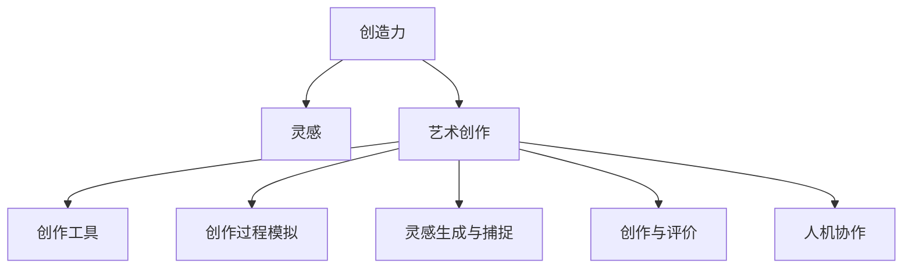

                 

# 洞察力与艺术：创作中的灵感与智慧

> 关键词：创造力, 创作过程, 灵感, 艺术实践, 智慧, 技术应用

## 1. 背景介绍

### 1.1 问题由来
创作和艺术实践是人类文明的重要组成部分，自古以来就深受人们的关注和研究。随着科技的发展，人工智能（AI）技术逐渐进入艺术创作和创作过程研究领域，为人类创作的无限可能提供了新的探索空间。

特别是近年来，基于深度学习的创作工具和技术，如生成对抗网络（GAN）、变分自编码器（VAE）、语言模型等，在图像生成、音乐创作、文本生成等领域都取得了令人瞩目的成果。这些技术不仅极大地拓展了人类创作的边界，也在艺术创作和艺术鉴赏的实践中带来了新的可能性。

然而，无论是传统的艺术创作还是新兴的AI创作，如何激发创作灵感，提升艺术表现力，仍然是一个值得深入探索的问题。

### 1.2 问题核心关键点
创作灵感和艺术智慧的激发，涉及到复杂的心理、认知、神经科学以及哲学等多个领域。特别是在AI技术应用的背景下，如何利用技术手段提升人类的创造力，使机器能够理解和模仿人类的创作行为，成为了当下艺术和技术领域的一个重要研究方向。

核心关键点包括：
1. 灵感生成和捕捉：如何利用算法模型捕捉艺术创作中的随机性和创意，激发创作灵感。
2. 创作过程模拟：通过建模模拟人类艺术创作的心理和行为过程，提升AI创作工具的创作效果。
3. 创作与评价：如何将创作过程和结果与艺术评价标准相结合，评价AI创作的艺术价值。
4. 人机协作：如何设计人机协作机制，使AI创作工具与人类创作者协同工作，提升创作效率和艺术表现力。

## 2. 核心概念与联系

### 2.1 核心概念概述

为更好地理解AI技术在艺术创作中的作用，本节将介绍几个关键概念：

- **创造力**：指的是人类或机器产生新颖、独特、有价值的作品的能力。创造力是艺术创作的本质属性。

- **灵感**：是创造过程中的一种心理状态，指个体在特定情境下突然涌现的创造性想法或解决方案。灵感是创作灵感的关键要素。

- **艺术创作**：包括从构思、设计到完成作品的全过程。艺术创作依赖于创作者的想象力、技巧和经验。

- **创作工具**：指辅助艺术家进行创作的各种技术手段，包括绘画工具、音乐制作软件、编程语言等。

- **艺术评价**：评价作品的艺术价值和艺术效果的过程，通常基于美学标准、社会影响力、历史地位等多个维度。

- **人机协作**：指人类与机器在创作过程中的合作，利用AI技术提升创作效率和创作质量。

这些核心概念之间的逻辑关系可以通过以下Mermaid流程图来展示：



这个流程图展示了创作过程中的各个环节和关键技术手段，反映了人类创造力与AI技术的互动关系。

## 3. 核心算法原理 & 具体操作步骤
### 3.1 算法原理概述

在AI技术辅助艺术创作中，常用的核心算法包括生成对抗网络（GAN）、变分自编码器（VAE）、语言模型（如GPT-3）等。这些算法通过模仿人类创作行为，生成具有艺术风格和审美价值的作品。

核心算法原理如下：

- **生成对抗网络（GAN）**：由生成器和判别器两个部分组成。生成器尝试生成逼真的作品，判别器则试图区分生成的作品和真实作品。两者通过对抗学习不断优化，生成高逼真度的作品。

- **变分自编码器（VAE）**：通过学习数据分布，生成新的数据点。VAE能够捕捉数据的统计特性，生成与训练数据具有相似风格的作品。

- **语言模型（如GPT-3）**：通过学习大量文本数据，生成具有连贯性和逻辑性的文本。语言模型能够生成具有艺术表达力的文本作品。

### 3.2 算法步骤详解

以生成对抗网络（GAN）为例，其算法步骤包括以下几个关键环节：

**Step 1: 数据准备**
- 准备高质量的艺术作品数据集，如绘画、音乐、文学作品等。数据集应包含多样化的风格和形式，以便训练模型能够生成多样化的作品。

**Step 2: 定义生成器和判别器**
- 定义生成器和判别器的架构，如使用卷积神经网络（CNN）或循环神经网络（RNN）等。

**Step 3: 训练生成器和判别器**
- 使用对抗学习的方式训练生成器和判别器。生成器尝试生成逼真的作品，判别器则试图区分真实作品和生成作品。
- 通过不断迭代训练，优化生成器和判别器的性能，使得生成器能够生成高质量的伪造作品。

**Step 4: 作品生成**
- 使用训练好的生成器，输入随机噪声或特定条件，生成新的作品。

**Step 5: 作品评价与改进**
- 对生成的作品进行评价，利用美学标准、艺术评价等指标评估其艺术价值。
- 根据评价结果，对生成器和判别器进行微调，进一步提升生成质量。

### 3.3 算法优缺点

基于生成对抗网络（GAN）的算法优点包括：
1. 生成多样化的高质量作品。GAN能够生成与训练数据具有相似风格的作品，具有较高的艺术价值。
2. 对创作过程进行模拟和优化。通过调整生成器和判别器的参数，可以提升创作效果。
3. 适用于多种艺术形式。GAN可以应用于绘画、音乐、文学等不同的艺术形式，拓宽了创作工具的应用范围。

其缺点包括：
1. 生成过程需要大量训练数据。GAN需要大量的高质量艺术作品数据进行训练，获取数据成本较高。
2. 生成作品可能存在随机性。生成的作品可能具有随机性，难以控制其风格和内容。
3. 训练过程较为复杂。GAN的训练过程需要调整生成器和判别器的参数，调整过程较为复杂，容易陷入局部最优。

### 3.4 算法应用领域

生成对抗网络（GAN）等AI技术在艺术创作中的应用领域非常广泛，包括但不限于：

- 图像生成：生成具有艺术风格的高逼真度图像，如风景画、肖像画等。
- 音乐创作：生成具有特定风格的旋律和曲调，创作新的音乐作品。
- 文学创作：生成连贯、逻辑性的文本作品，包括诗歌、小说等。
- 游戏设计：生成具有艺术风格的游戏场景、角色和动画等。
- 动画制作：生成逼真的动画角色和场景，提升动画制作效率和艺术效果。

此外，GAN技术还被应用于艺术作品修复、风格迁移等领域，为艺术创作提供了新的可能性。

## 4. 数学模型和公式 & 详细讲解  
### 4.1 数学模型构建

在生成对抗网络（GAN）中，生成器 $G$ 和判别器 $D$ 的损失函数分别定义为：

$$
\mathcal{L}_G = \mathbb{E}_{x \sim p_x} [\log D(G(x))] + \mathbb{E}_{z \sim p_z} [\log (1 - D(G(z)))]
$$

$$
\mathcal{L}_D = \mathbb{E}_{x \sim p_x} [\log D(x)] + \mathbb{E}_{z \sim p_z} [\log (1 - D(G(z)))]
$$

其中 $x$ 为真实作品，$z$ 为随机噪声，$p_x$ 和 $p_z$ 分别为真实作品和随机噪声的分布。

### 4.2 公式推导过程

为了简化问题，我们考虑二元分类问题。生成器 $G$ 的输入为随机噪声 $z$，输出为伪造作品 $G(z)$。判别器 $D$ 的输入为真实作品 $x$ 和伪造作品 $G(z)$，输出为真实性概率 $D(x)$ 和 $D(G(z))$。

将 $G(z)$ 代入判别器的输出，得到生成器的损失函数为：

$$
\mathcal{L}_G = \mathbb{E}_{z \sim p_z} [-\log D(G(z))]
$$

将 $x$ 代入判别器的输出，得到判别器的损失函数为：

$$
\mathcal{L}_D = \mathbb{E}_{x \sim p_x} [\log D(x)] + \mathbb{E}_{z \sim p_z} [-\log D(G(z))]
$$

通过梯度下降等优化算法，生成器和判别器不断优化其参数，使得生成器能够生成高质量的伪造作品，判别器能够准确区分真实作品和伪造作品。

### 4.3 案例分析与讲解

以GAN生成图像为例，我们可以使用MNIST手写数字数据集进行训练。生成器 $G$ 使用卷积神经网络，判别器 $D$ 使用卷积神经网络和全连接层组合。

**Step 1: 准备数据**
- 将MNIST手写数字数据集分为训练集和测试集。
- 对图像进行归一化处理，转换为张量格式。

**Step 2: 定义生成器和判别器**
- 生成器 $G$ 使用两个卷积层和两个反卷积层，生成大小为 $28 \times 28$ 的图像。
- 判别器 $D$ 使用两个卷积层和两个全连接层，输出为真实性概率。

**Step 3: 训练生成器和判别器**
- 将生成器和判别器同时优化，使用交叉熵损失函数。
- 在训练过程中，生成器尝试生成逼真的图像，判别器则试图区分真实图像和生成图像。

**Step 4: 作品生成**
- 使用训练好的生成器 $G$，输入随机噪声 $z$，生成新的图像。

**Step 5: 作品评价与改进**
- 对生成的图像进行评价，如计算像素误差、使用主观评价等。
- 根据评价结果，调整生成器和判别器的参数，进一步提升生成质量。

通过上述步骤，我们可以使用GAN生成具有艺术风格的手写数字图像，进一步应用于艺术创作和设计等领域。

## 5. 项目实践：代码实例和详细解释说明
### 5.1 开发环境搭建

在进行GAN实践前，我们需要准备好开发环境。以下是使用Python进行PyTorch开发的环境配置流程：

1. 安装Anaconda：从官网下载并安装Anaconda，用于创建独立的Python环境。

2. 创建并激活虚拟环境：
```bash
conda create -n gans-env python=3.8 
conda activate gans-env
```

3. 安装PyTorch：根据CUDA版本，从官网获取对应的安装命令。例如：
```bash
conda install pytorch torchvision torchaudio cudatoolkit=11.1 -c pytorch -c conda-forge
```

4. 安装TensorBoard：
```bash
pip install tensorboard
```

5. 安装NVIDIA CUDA工具包：
```bash
conda install pytorch torchvision torchaudio cudatoolkit=11.1 -c pytorch -c conda-forge
```

完成上述步骤后，即可在`gans-env`环境中开始GAN实践。

### 5.2 源代码详细实现

下面我们以GAN生成图像为例，给出使用PyTorch实现GAN的代码实现。

首先，定义生成器和判别器的模型：

```python
import torch
import torch.nn as nn
import torch.nn.functional as F
from torch.autograd import Variable

class Generator(nn.Module):
    def __init__(self):
        super(Generator, self).__init__()
        self.main = nn.Sequential(
            nn.Linear(100, 256),
            nn.LeakyReLU(0.2, inplace=True),
            nn.ConvTranspose2d(256, 128, 4, 1, 0, bias=False),
            nn.BatchNorm2d(128),
            nn.LeakyReLU(0.2, inplace=True),
            nn.ConvTranspose2d(128, 64, 4, 2, 1, bias=False),
            nn.BatchNorm2d(64),
            nn.LeakyReLU(0.2, inplace=True),
            nn.ConvTranspose2d(64, 1, 4, 2, 1, bias=False),
            nn.Tanh()
        )

    def forward(self, input):
        return self.main(input)

class Discriminator(nn.Module):
    def __init__(self):
        super(Discriminator, self).__init__()
        self.main = nn.Sequential(
            nn.Conv2d(1, 64, 4, 2, 1, bias=False),
            nn.LeakyReLU(0.2, inplace=True),
            nn.Conv2d(64, 128, 4, 2, 1, bias=False),
            nn.BatchNorm2d(128),
            nn.LeakyReLU(0.2, inplace=True),
            nn.Conv2d(128, 256, 4, 2, 1, bias=False),
            nn.BatchNorm2d(256),
            nn.LeakyReLU(0.2, inplace=True),
            nn.Conv2d(256, 1, 4, 1, 0, bias=False),
            nn.Sigmoid()
        )

    def forward(self, input):
        return self.main(input)
```

然后，定义损失函数和优化器：

```python
from torch.optim import Adam

loss_fn = nn.BCELoss()
optimizer_G = Adam(netG.parameters(), lr=0.0002, betas=(0.5, 0.999))
optimizer_D = Adam(netD.parameters(), lr=0.0002, betas=(0.5, 0.999))
```

接着，定义训练和评估函数：

```python
import numpy as np

def train(netG, netD, criterion, optimizer_G, optimizer_D, batch_size, n_epochs):
    device = torch.device("cuda" if torch.cuda.is_available() else "cpu")
    netG.to(device)
    netD.to(device)
    criterion.to(device)

    for epoch in range(n_epochs):
        for i, (imgs, _) in enumerate(dataloader):
            imgs = Variable(imgs.to(device))
            opt_G.zero_grad()
            opt_D.zero_grad()

            output = netG(z)
            output = output.view(-1, 1, 28, 28)

            target_real = Variable(torch.ones(batch_size, 1).to(device), requires_grad=False)
            target_fake = Variable(torch.zeros(batch_size, 1).to(device), requires_grad=False)

            output_real = netD(imgs)
            output_fake = netD(output)

            errG = criterion(output_fake, target_real)
            errD_real = criterion(output_real, target_real)
            errD_fake = criterion(output_fake, target_fake)

            errD = errD_real + errD_fake
            errG.backward(errG)
            errD.backward(errD)
            optimizer_G.step()
            optimizer_D.step()

            batches_done = epoch * len(dataloader) + i
            if batches_done % 100 == 0:
                print("[%d/%d][%d/%d] [D loss: %f, G loss: %f]" %
                      (epoch, n_epochs, batches_done, len(dataloader), errD.item(), errG.item()))

def evaluate(netG, z, batch_size):
    with torch.no_grad():
        device = torch.device("cuda" if torch.cuda.is_available() else "cpu")
        netG.to(device)

        z = Variable(z.to(device))
        imgs = netG(z)
        imgs = imgs.view(imgs.size(0), 1, 28, 28)
        return imgs
```

最后，启动训练流程并在测试集上评估：

```python
n_epochs = 200
batch_size = 100

# 准备数据集
dataloader = torch.utils.data.DataLoader(datasets, batch_size=batch_size, shuffle=True)

# 初始化生成器和判别器
netG = Generator()
netD = Discriminator()

# 训练模型
train(netG, netD, criterion, optimizer_G, optimizer_D, batch_size, n_epochs)

# 生成测试图像
z = torch.randn(64, 100)
img = evaluate(netG, z)
img = img.view(img.size(0), 1, 28, 28)
plt.imshow(img[0], cmap='gray')
plt.show()
```

以上就是使用PyTorch实现GAN生成图像的完整代码实现。可以看到，PyTorch的模块化和灵活性使得GAN模型的构建和训练变得相对容易。

### 5.3 代码解读与分析

让我们再详细解读一下关键代码的实现细节：

**Generator类**：
- `__init__`方法：定义生成器的网络结构，包括多个卷积转置层、批量归一化层和激活函数。
- `forward`方法：定义前向传播过程，将随机噪声转换为图像。

**Discriminator类**：
- `__init__`方法：定义判别器的网络结构，包括多个卷积层、批量归一化层和激活函数。
- `forward`方法：定义前向传播过程，判断输入图像的真实性。

**train函数**：
- 在每个epoch内，对每个批次的数据进行迭代训练。
- 计算生成器和判别器的损失，反向传播更新模型参数。
- 在训练过程中打印日志，以便于跟踪训练进度。

**evaluate函数**：
- 使用训练好的生成器生成新的图像，并返回图像张量。
- 通过可视化工具，展示生成的图像。

## 6. 实际应用场景
### 6.1 智能艺术创作
基于GAN等AI技术，智能艺术创作系统可以在短时间内生成大量的艺术作品，并自动进行风格转换和优化。这些系统可以应用于广告设计、游戏开发、影视制作等多个领域，极大地提升了创作效率和艺术表现力。

例如，Adobe Sensei等AI艺术创作工具，已经能够在短时间内生成逼真的图像和视频，辅助艺术家进行创作。Google DeepDream等工具，通过深度学习生成具有艺术风格的作品，进一步拓展了艺术创作的边界。

### 6.2 艺术作品修复
艺术作品的损坏和老化是不可避免的，通过GAN等AI技术，可以进行艺术作品的修复和还原。例如，使用GAN对破损的古代壁画进行修复，或将模糊的老照片还原清晰，这些技术在文物保护和档案修复等领域具有重要应用。

例如，DeepArt等应用使用GAN技术，可以将照片转化为具有艺术风格的作品，进一步应用于艺术创作和设计等领域。

### 6.3 艺术作品分析
基于GAN等AI技术，可以对艺术作品进行分析和评价。例如，通过生成逼真的伪造作品，评估艺术家风格和技巧，或分析历史艺术作品的演变过程。这些技术在艺术史研究、艺术鉴赏等领域具有重要应用。

例如，StyleGAN等应用使用GAN技术，可以生成逼真的伪造作品，进一步应用于艺术作品分析和评价等领域。

## 7. 工具和资源推荐
### 7.1 学习资源推荐

为了帮助开发者系统掌握AI技术在艺术创作中的应用，这里推荐一些优质的学习资源：

1. 《生成对抗网络：理论、算法和应用》系列博文：由GAN领域的专家撰写，深入浅出地介绍了GAN的基本原理和实际应用。

2. CS231n《卷积神经网络》课程：斯坦福大学开设的深度学习课程，涵盖GAN等前沿技术，适合对深度学习感兴趣的读者。

3. 《深度学习》书籍：由Ian Goodfellow等作者合著，全面介绍了深度学习的理论和实践，包括GAN等技术。

4. NVIDIA GAN研究论文集：NVIDIA汇集了多项GAN研究的论文，适合深度学习和计算机视觉领域的研究者阅读。

5. Google DeepDream源码：谷歌公开的DeepDream源码，适合了解GAN在实际应用中的具体实现。

通过对这些资源的学习实践，相信你一定能够快速掌握AI技术在艺术创作中的应用，并用于解决实际的创作问题。

### 7.2 开发工具推荐

高效的开发离不开优秀的工具支持。以下是几款用于AI艺术创作开发的常用工具：

1. PyTorch：基于Python的开源深度学习框架，灵活动态的计算图，适合快速迭代研究。

2. TensorFlow：由Google主导开发的开源深度学习框架，生产部署方便，适合大规模工程应用。

3. GAN研究论文集：NVIDIA汇集了多项GAN研究的论文，适合深度学习和计算机视觉领域的研究者阅读。

4. OpenAI Codex：OpenAI开发的代码生成工具，能够帮助开发者生成高质量的代码，提高开发效率。

5. NVIDIA GAN研究论文集：NVIDIA汇集了多项GAN研究的论文，适合深度学习和计算机视觉领域的研究者阅读。

合理利用这些工具，可以显著提升AI艺术创作的开发效率，加快创新迭代的步伐。

### 7.3 相关论文推荐

AI技术在艺术创作中的应用领域广泛，相关的研究论文也层出不穷。以下是几篇奠基性的相关论文，推荐阅读：

1. GAN论文：《A Tutorial on Generative Adversarial Networks》：Ian Goodfellow等作者撰写，详细介绍了GAN的基本原理和应用。

2. StyleGAN论文：《A Style-Based Generator Architecture for Generative Adversarial Networks》：Karras等作者撰写，提出了StyleGAN生成模型，应用于图像生成领域。

3. VAE论文：《Generating Images with Adversarial Networks》：Goodfellow等作者撰写，介绍了VAE生成模型，应用于图像生成领域。

4. GAN应用：《Generative Adversarial Networks in Image-to-Image Translation》：Isola等作者撰写，介绍了GAN在图像转化的应用。

5. DeepArt论文：《DeepArt: A Neural Algorithm for Imagenet Style Transfer》：Barnes等作者撰写，提出了DeepArt图像风格转化算法，应用于艺术作品修复和风格转化领域。

这些论文代表了AI艺术创作技术的最新进展，通过学习这些前沿成果，可以帮助研究者把握学科前进方向，激发更多的创新灵感。

## 8. 总结：未来发展趋势与挑战
### 8.1 总结

本文对基于生成对抗网络（GAN）的AI技术在艺术创作中的应用进行了全面系统的介绍。首先阐述了GAN的基本原理和应用场景，明确了AI技术在艺术创作中的独特价值。其次，从原理到实践，详细讲解了GAN的数学模型和关键步骤，给出了GAN的代码实现。同时，本文还广泛探讨了GAN技术在智能艺术创作、艺术作品修复、艺术作品分析等多个领域的应用前景，展示了AI技术在艺术创作中的巨大潜力。此外，本文精选了GAN技术的各类学习资源，力求为读者提供全方位的技术指引。

通过本文的系统梳理，可以看到，基于GAN等AI技术，艺术创作和艺术创作过程模拟的研究正在不断深入，为人类创作的无限可能提供了新的探索空间。GAN技术在图像生成、音乐创作、文学创作等领域的应用，极大地拓展了人类创作的边界，为艺术创作带来了新的可能性。

### 8.2 未来发展趋势

展望未来，GAN技术在艺术创作中的应用将呈现以下几个发展趋势：

1. 创作效果更逼真。随着算力和模型的不断进步，GAN生成的艺术作品将更加逼真和多样，能够更好地模拟人类创作过程。

2. 创作过程更加智能。未来的创作工具将通过深度学习和优化算法，进一步提升创作效果和创作效率，使得艺术创作更加智能和高效。

3. 创作工具更普及。随着开源工具和预训练模型的不断普及，创作工具将更加易于使用，降低创作门槛，让更多人能够参与到创作过程中。

4. 跨领域应用扩展。GAN技术不仅在艺术创作领域有广泛应用，在影视制作、游戏开发、建筑设计等多个领域也将得到广泛应用，拓展了创作工具的应用范围。

5. 人机协作更紧密。未来的创作系统将更加注重人机协作，通过智能推荐、协同创作等方式，提高创作效率和艺术表现力。

这些趋势凸显了GAN技术在艺术创作中的广阔前景，使得AI技术在艺术创作中的应用前景更加光明。

### 8.3 面临的挑战

尽管GAN技术在艺术创作中取得了显著进展，但在迈向更加智能化、普适化应用的过程中，仍面临诸多挑战：

1. 生成作品质量不稳定。GAN生成的作品质量不稳定，可能存在质量波动和随机性，难以控制其风格和内容。

2. 训练过程耗时耗力。GAN的训练过程耗时耗力，需要大量的计算资源和长周期训练，难以大规模应用。

3. 模型公平性问题。GAN模型可能存在偏见，生成带有歧视性的作品，如何提升模型的公平性和多样性，是一个亟待解决的问题。

4. 艺术价值评价难。GAN生成的作品在艺术价值评价上存在主观性，如何设计合理的评价标准，是一个需要进一步研究的问题。

5. 模型可解释性不足。GAN等深度学习模型通常缺乏可解释性，难以理解其内部工作机制和决策逻辑，限制了其在艺术创作中的应用。

6. 伦理道德问题。GAN生成的作品可能存在伦理道德问题，如虚假宣传、版权争议等，如何确保创作过程和作品的安全性，是一个需要深入研究的问题。

正视GAN技术在艺术创作中的挑战，积极应对并寻求突破，将是大规模应用的前提。相信随着学界和产业界的共同努力，这些挑战终将一一被克服，GAN技术必将在艺术创作中发挥更大的作用。

### 8.4 研究展望

面对GAN技术在艺术创作中面临的挑战，未来的研究需要在以下几个方面寻求新的突破：

1. 研究更高效、更灵活的生成模型。开发更加高效、灵活的GAN模型，提升生成效果和创作效率，降低训练成本。

2. 探索跨领域创作工具。将GAN技术与自然语言处理、语音处理等领域相结合，拓展创作工具的应用范围，提升创作效果。

3. 研究更智能的创作辅助工具。开发更加智能的创作辅助工具，如风格推荐、内容生成等，提升创作过程的智能化水平。

4. 探索更公平、更具多样性的生成模型。研究如何提升GAN模型的公平性和多样性，确保创作过程和作品的多样性和包容性。

5. 研究更易解释的生成模型。开发更易解释的GAN模型，提升模型的透明度和可解释性，便于艺术家和用户理解和使用。

6. 研究更安全的创作工具。开发更安全的创作工具，确保创作过程和作品的安全性，避免伦理道德问题。

这些研究方向的探索，必将引领GAN技术在艺术创作中的应用走向更高的台阶，为创作过程的智能化、普适化提供新的解决方案。面向未来，GAN技术需要与其他AI技术进行更深入的融合，共同推动艺术创作技术的发展和创新。只有勇于创新、敢于突破，才能不断拓展艺术创作的技术边界，让创作工具更好地服务于艺术家和用户。

## 9. 附录：常见问题与解答

**Q1：GAN在艺术创作中存在哪些局限性？**

A: GAN在艺术创作中存在以下局限性：

1. 生成作品质量不稳定：GAN生成的作品质量不稳定，可能存在质量波动和随机性，难以控制其风格和内容。

2. 训练过程耗时耗力：GAN的训练过程耗时耗力，需要大量的计算资源和长周期训练，难以大规模应用。

3. 模型公平性问题：GAN模型可能存在偏见，生成带有歧视性的作品，如何提升模型的公平性和多样性，是一个亟待解决的问题。

4. 艺术价值评价难：GAN生成的作品在艺术价值评价上存在主观性，如何设计合理的评价标准，是一个需要进一步研究的问题。

5. 模型可解释性不足：GAN等深度学习模型通常缺乏可解释性，难以理解其内部工作机制和决策逻辑，限制了其在艺术创作中的应用。

6. 伦理道德问题：GAN生成的作品可能存在伦理道德问题，如虚假宣传、版权争议等，如何确保创作过程和作品的安全性，是一个需要深入研究的问题。

**Q2：如何在创作过程中有效利用GAN技术？**

A: 在创作过程中有效利用GAN技术，可以考虑以下几个方面：

1. 利用GAN生成多样化的创作素材：使用GAN生成具有艺术风格的多样化素材，辅助艺术家进行创作。

2. 进行风格迁移和转换：利用GAN进行风格迁移和转换，生成具有特定风格的艺术作品。

3. 辅助艺术作品修复和还原：使用GAN对损坏或老化的艺术作品进行修复和还原。

4. 进行艺术作品分析和评价：利用GAN生成逼真的伪造作品，辅助艺术作品分析和评价。

5. 探索人机协作机制：利用GAN技术与人类创作者协同工作，提升创作效率和创作效果。

6. 进行智能创作辅助：利用GAN技术开发智能创作辅助工具，如风格推荐、内容生成等。

**Q3：如何提升GAN模型的公平性和多样性？**

A: 提升GAN模型的公平性和多样性，可以考虑以下几个方面：

1. 设计公平的损失函数：通过优化损失函数，限制模型生成具有特定属性的作品，提升模型的公平性。

2. 数据多样性增强：增加数据集的多样性，避免模型在特定数据上过度拟合，提升模型的泛化能力。

3. 引入多样性约束：在训练过程中引入多样性约束，促使模型生成多样化的作品。

4. 利用对抗训练：通过对抗训练，增强模型的鲁棒性，提升模型的多样性。

5. 探索生成对抗训练：通过生成对抗训练，提升模型的公平性和多样性。

6. 引入多样性惩罚：在训练过程中引入多样性惩罚，避免模型生成过于相似的作品。

这些方法可以帮助提升GAN模型的公平性和多样性，使得创作过程和作品更具多样性和包容性。

**Q4：GAN在艺术创作中如何应用？**

A: GAN在艺术创作中的应用包括以下几个方面：

1. 生成逼真的艺术作品：使用GAN生成具有艺术风格的高逼真度图像、音乐和文学作品，辅助艺术家进行创作。

2. 进行风格迁移和转换：利用GAN进行风格迁移和转换，生成具有特定风格的艺术作品。

3. 辅助艺术作品修复和还原：使用GAN对损坏或老化的艺术作品进行修复和还原。

4. 进行艺术作品分析和评价：利用GAN生成逼真的伪造作品，辅助艺术作品分析和评价。

5. 探索人机协作机制：利用GAN技术与人类创作者协同工作，提升创作效率和创作效果。

6. 进行智能创作辅助：利用GAN技术开发智能创作辅助工具，如风格推荐、内容生成等。

**Q5：GAN在艺术创作中的应用前景如何？**

A: GAN在艺术创作中的应用前景非常广阔，未来将有更多的应用场景：

1. 智能艺术创作：基于GAN等AI技术，智能艺术创作系统可以在短时间内生成大量的艺术作品，并自动进行风格转换和优化。

2. 艺术作品修复：艺术作品的损坏和老化是不可避免的，通过GAN等AI技术，可以进行艺术作品的修复和还原。

3. 艺术作品分析：利用GAN等AI技术，可以对艺术作品进行分析和评价。

4. 跨领域应用扩展：GAN技术不仅在艺术创作领域有广泛应用，在影视制作、游戏开发、建筑设计等多个领域也将得到广泛应用。

5. 人机协作更紧密：未来的创作系统将更加注重人机协作，通过智能推荐、协同创作等方式，提高创作效率和艺术表现力。

**Q6：如何评估GAN生成的作品的艺术价值？**

A: 评估GAN生成的作品的艺术价值，可以考虑以下几个方面：

1. 人类主观评价：通过人类主观评价，评估作品的艺术价值和审美效果。

2. 美学标准：使用美学标准，如形式美、色彩美、情感美等，评估作品的艺术价值。

3. 艺术评价指标：设计合理的艺术评价指标，如创新性、技术性、情感表达等，评估作品的艺术价值。

4. 用户反馈：通过用户反馈，评估作品的市场接受度和用户满意度。

5. 历史对比：将GAN生成的作品与历史经典作品进行对比，评估其艺术价值和影响力。

通过这些方法，可以较为全面地评估GAN生成的作品的艺术价值，判断其在艺术创作中的应用前景。

---

作者：禅与计算机程序设计艺术 / Zen and the Art of Computer Programming

