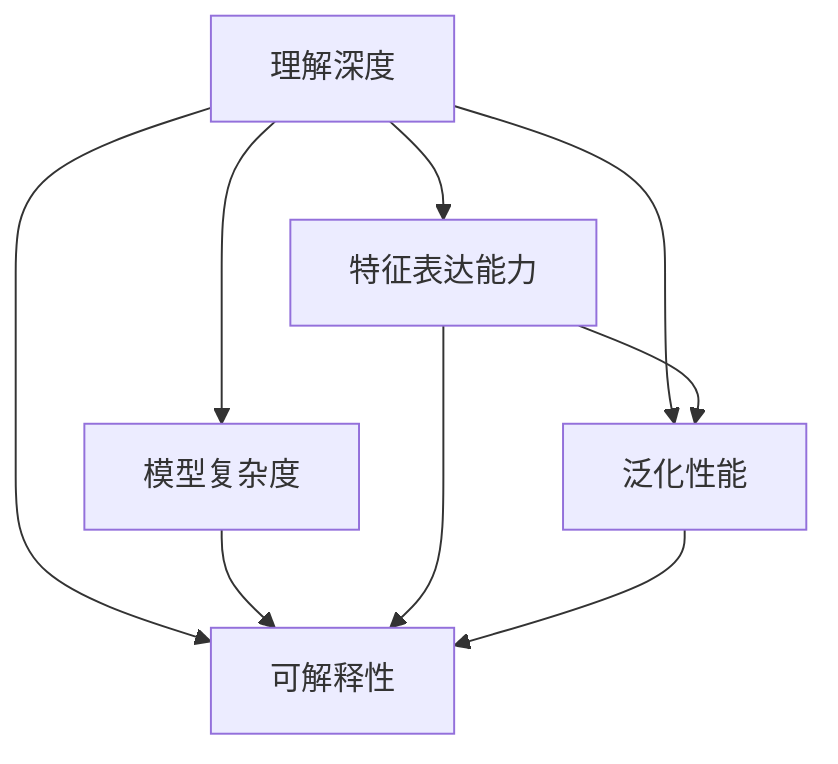

                 

# 洞察力的测量：定量评估理解深度的方法

> 关键词：深度学习,理解深度,模型评估,量化指标,评估方法

## 1. 背景介绍

### 1.1 问题由来
深度学习（Deep Learning）自20世纪末问世以来，凭借其强大的表达能力，在图像识别、自然语言处理、语音识别等诸多领域取得了突破性进展。然而，深度模型在性能提升的同时，也带来了模型的可解释性和理解深度的难题。尽管深度模型在某些任务上已经超越了人类专家的水平，但对于其内部机制的透明性和决策依据的科学性，仍然存在较大争议。

理解深度（Understanding Depth）是评估深度学习模型性能的关键指标。它不仅包括模型在特定任务上的表现，更涉及模型在理解数据、提取特征、建立映射等方面所展现的洞察力。在实际应用中，模型能否对复杂问题提供可信的解释，能否在未知数据上进行泛化，都是衡量模型理解深度的重要标准。

### 1.2 问题核心关键点
评估模型的理解深度需要综合考虑多个因素，包括模型的结构复杂度、特征表达能力、泛化性能、可解释性等。本节将介绍几种常见且有效的模型评估方法，并对这些方法的理论依据和实际应用场景进行详细探讨。

## 2. 核心概念与联系

### 2.1 核心概念概述

为更好地理解如何评估模型的理解深度，本节将介绍几个密切相关的核心概念：

- 理解深度（Understanding Depth）：指模型对数据或任务的理解程度，通常通过模型在特定任务上的表现以及其对输入数据的感知能力来评估。理解深度越高，模型越能准确捕捉数据中的关键特征和潜在规律。

- 模型复杂度（Model Complexity）：指模型结构的复杂程度，包括层数、参数数量等。复杂度高的模型往往能更好地拟合数据，但同时也可能过拟合或难以解释。

- 特征表达能力（Feature Representation）：指模型将输入数据转换为有意义的特征表示的能力。好的特征表示不仅应具有低维度、高区分度，还应具备对数据内在结构的深入理解。

- 泛化性能（Generalization Performance）：指模型在新数据上的表现，通常通过测试集误差和模型在未见过的数据上的性能来评估。泛化性能强的模型能够捕捉数据中的泛化规律，避免过拟合。

- 可解释性（Explainability）：指模型输出的可信度，即模型能否给出明确的推理路径和决策依据。高可解释性的模型有助于提高用户的信任度，促进模型的广泛应用。

这些核心概念之间的逻辑关系可以通过以下Mermaid流程图来展示：



这个流程图展示了几组关键概念之间的关系：

1. 理解深度是模型的最终目标，其高低受到模型复杂度、特征表达能力和泛化性能的共同影响。
2. 模型复杂度决定了模型可以表示的数据复杂性，同时也会影响模型的泛化性能。
3. 特征表达能力刻画了模型如何从原始数据中提取有意义的信息。
4. 泛化性能反映了模型在新数据上的表现。
5. 可解释性确保了模型的决策过程透明可信。

## 3. 核心算法原理 & 具体操作步骤

### 3.1 算法原理概述

评估模型的理解深度，核心在于量化模型的特征表达能力和泛化性能。常见的评估方法包括准确率、召回率、F1-score等传统指标，以及LIME、SHAP等可解释性方法。以下详细介绍这些评估方法的核心原理。

### 3.2 算法步骤详解

#### 3.2.1 准确率（Accuracy）和召回率（Recall）
- 准确率（Accuracy）定义为模型预测正确的样本数占总样本数的比例。准确率高表示模型整体性能较好。
- 召回率（Recall）定义为模型正确预测为正类的样本数占实际正类样本数的比例。召回率高表示模型对于正类的识别能力强。
- 两者通常结合起来使用，定义为F1-score，即模型准确率和召回率的调和平均数。

#### 3.2.2 混淆矩阵（Confusion Matrix）
混淆矩阵（Confusion Matrix）用于展示模型预测结果与实际结果之间的关系。其定义如下：

$$
C = \begin{bmatrix}
    N_T & N_F \\
    F_T & F_F
\end{bmatrix}
$$

其中 $N_T$ 表示模型正确预测为正类的样本数，$N_F$ 表示模型错误预测为正类的样本数，$F_T$ 表示模型正确预测为负类的样本数，$F_F$ 表示模型错误预测为负类的样本数。

通过混淆矩阵，可以直观地评估模型的分类性能，并计算各种评估指标。

#### 3.2.3 LIME（Local Interpretable Model-agnostic Explanations）
LIME是一种可解释性方法，旨在为复杂的深度模型提供局部可解释性。其核心思想是通过拟合一个简单的、可解释的局部模型来解释每个样本的预测结果。具体步骤如下：

1. 选择模型中需要解释的样本。
2. 在该样本周围构造一个局部区域。
3. 在该局部区域内生成一组新样本，并使用基线模型对这些样本进行预测。
4. 使用深度模型对这组新样本进行预测，并计算两者的误差。
5. 通过回归模型（如线性回归、决策树等）拟合误差与输入特征之间的关系，并得到每个特征对预测结果的影响权重。

LIME的输出为一个可解释的局部模型，揭示了深度模型在局部区域的决策逻辑。

#### 3.2.4 SHAP（SHapley Additive exPlanations）
SHAP是一种基于博弈论的解释方法，通过计算每个特征对模型预测结果的贡献值来评估模型。其核心思想是将模型的预测结果视为所有特征的贡献和，每个特征的贡献值可通过Shapley值计算得到。具体步骤如下：

1. 计算模型在所有特征值都为0的基准模型输出。
2. 对每个特征 $x_i$，计算模型在 $x_i$ 取不同值时的预测误差。
3. 对每个样本，计算所有特征的贡献值之和，与基准模型输出差的绝对值。
4. 使用Shapley值计算每个特征的贡献值，并绘制SHAP值图。

SHAP的输出为每个特征对预测结果的贡献值，可以直观地评估每个特征对模型输出的影响。

#### 3.2.5 对数似然比（Log-Likelihood Ratio, LLR）
对数似然比（LLR）是一种用于量化模型泛化性能的方法。其定义如下：

$$
\text{LLR} = \log \frac{\text{P}(y|x)}{\text{P}(y)}
$$

其中 $\text{P}(y|x)$ 表示模型在给定输入 $x$ 的情况下，预测为正类的概率；$\text{P}(y)$ 表示模型预测为正类的概率。LLR值越大，表示模型对输入 $x$ 的预测越可靠。

通过计算LLR值，可以评估模型在不同输入下的泛化能力，判断模型是否存在过拟合现象。

### 3.3 算法优缺点

评估模型的理解深度，常用的方法包括准确率、召回率、F1-score等传统指标，以及LIME、SHAP等可解释性方法。以下详细介绍这些评估方法的优缺点：

#### 3.3.1 传统指标
- 优点：计算简单，易于理解，适用于二分类和多分类任务。
- 缺点：不能直接解释模型的决策过程，难以评估模型对复杂输入的理解能力。

#### 3.3.2 LIME
- 优点：能够提供局部可解释性，揭示深度模型的决策逻辑。
- 缺点：计算复杂度较高，需要大量数据来构造局部模型。

#### 3.3.3 SHAP
- 优点：计算复杂度较低，可以全面评估每个特征对模型输出的影响。
- 缺点：难以解释模型整体的决策过程，对于高维数据计算复杂度较高。

#### 3.3.4 对数似然比（LLR）
- 优点：能够量化模型的泛化性能，揭示模型的过拟合程度。
- 缺点：需要大量的标注数据来计算，难以应用于无标注数据。

综上所述，每种评估方法都有其优缺点，需要根据具体应用场景选择合适的评估方法。

### 3.4 算法应用领域

评估模型的理解深度，已经在图像识别、自然语言处理、医学诊断等多个领域得到了广泛应用。以下是几个典型的应用场景：

#### 3.4.1 图像识别
在图像识别任务中，评估模型的理解深度通常通过准确率、召回率、F1-score等传统指标来衡量。同时，可以使用LIME和SHAP等可解释性方法，揭示模型对复杂图像特征的识别过程。

#### 3.4.2 自然语言处理
在自然语言处理任务中，评估模型的理解深度可以通过语义相关性、文本生成质量等指标来衡量。同时，可以使用LLR等方法，评估模型在未见过的文本数据上的泛化性能。

#### 3.4.3 医学诊断
在医学诊断任务中，评估模型的理解深度通常通过召回率、精确率等指标来衡量。同时，可以使用LIME和SHAP等可解释性方法，揭示模型对复杂医学影像和病历数据的理解能力。

## 4. 数学模型和公式 & 详细讲解 & 举例说明

### 4.1 数学模型构建

本节将使用数学语言对模型评估方法进行更加严格的刻画。

以二分类任务为例，假设模型 $M$ 在输入 $x$ 上的预测结果为 $y$，其中 $y \in \{0,1\}$，$M(x) \in [0,1]$。定义模型在训练集 $D=\{(x_i,y_i)\}_{i=1}^N$ 上的准确率为 $Accuracy = \frac{1}{N} \sum_{i=1}^N \mathbb{I}[M(x_i) = y_i]$，其中 $\mathbb{I}$ 为示性函数。

定义模型在训练集 $D$ 上的混淆矩阵为 $C = \begin{bmatrix} N_T & N_F \\ F_T & F_F \end{bmatrix}$，其中 $N_T = \sum_{i=1}^N \mathbb{I}[M(x_i) = 1]$，$N_F = \sum_{i=1}^N \mathbb{I}[M(x_i) = 0]$，$F_T = \sum_{i=1}^N \mathbb{I}[y_i = 1]$，$F_F = N - F_T - N_T$。

定义模型在输入 $x$ 上的对数似然比（LLR）为 $\text{LLR}(x) = \log \frac{M(x)}{1-M(x)}$。

### 4.2 公式推导过程

以二分类任务为例，推导混淆矩阵和对数似然比（LLR）的计算公式。

假设模型 $M$ 在输入 $x$ 上的预测结果为 $M(x)$，其中 $M(x) \in [0,1]$，$x \in \mathbb{R}^d$。令 $y \in \{0,1\}$ 为实际标签，则模型的预测结果为：

$$
y' = \mathbb{I}[M(x) \geq 0.5]
$$

其中 $\mathbb{I}$ 为示性函数。

模型在训练集 $D=\{(x_i,y_i)\}_{i=1}^N$ 上的混淆矩阵 $C$ 为：

$$
C = \begin{bmatrix} N_T & N_F \\ F_T & F_F \end{bmatrix}
$$

其中 $N_T = \sum_{i=1}^N \mathbb{I}[M(x_i) = 1]$，$N_F = \sum_{i=1}^N \mathbb{I}[M(x_i) = 0]$，$F_T = \sum_{i=1}^N \mathbb{I}[y_i = 1]$，$F_F = N - F_T - N_T$。

模型在输入 $x$ 上的对数似然比（LLR）为：

$$
\text{LLR}(x) = \log \frac{M(x)}{1-M(x)}
$$

通过计算LLR值，可以评估模型在不同输入下的泛化能力，判断模型是否存在过拟合现象。

### 4.3 案例分析与讲解

#### 4.3.1 实例1：图像分类
考虑一个图像分类任务，使用深度卷积神经网络（CNN）对图像进行分类。假设训练集包含1000张图像，其中800张为狗，200张为猫。模型在训练集上的准确率为0.98，混淆矩阵为：

$$
C = \begin{bmatrix} 780 & 20 \\ 50 & 150 \end{bmatrix}
$$

其中 $N_T = 780$，$N_F = 20$，$F_T = 50$，$F_F = 150$。

使用LLR值计算模型在一张新图像 $x$ 上的预测可靠性。假设模型预测为猫，则LLR值为：

$$
\text{LLR}(x) = \log \frac{0.2}{0.8}
$$

#### 4.3.2 实例2：自然语言处理
考虑一个文本分类任务，使用Transformer模型对文本进行分类。假设训练集包含1000篇文本，其中800篇为正面评价，200篇为负面评价。模型在训练集上的准确率为0.98，混淆矩阵为：

$$
C = \begin{bmatrix} 780 & 20 \\ 50 & 150 \end{bmatrix}
$$

其中 $N_T = 780$，$N_F = 20$，$F_T = 50$，$F_F = 150$。

使用LLR值计算模型在一张新文本 $x$ 上的预测可靠性。假设模型预测为负面评价，则LLR值为：

$$
\text{LLR}(x) = \log \frac{0.2}{0.8}
$$

## 5. 项目实践：代码实例和详细解释说明

### 5.1 开发环境搭建

在进行模型评估实践前，我们需要准备好开发环境。以下是使用Python进行Scikit-learn开发的环境配置流程：

1. 安装Anaconda：从官网下载并安装Anaconda，用于创建独立的Python环境。

2. 创建并激活虚拟环境：
```bash
conda create -n sklearn-env python=3.8 
conda activate sklearn-env
```

3. 安装Scikit-learn：
```bash
pip install scikit-learn
```

4. 安装其他必要的工具包：
```bash
pip install numpy pandas matplotlib scikit-image seaborn jupyter notebook ipython
```

完成上述步骤后，即可在`sklearn-env`环境中开始模型评估实践。

### 5.2 源代码详细实现

首先，定义模型评估函数：

```python
from sklearn.metrics import accuracy_score, recall_score, precision_score, f1_score, confusion_matrix
import numpy as np

def evaluate_model(model, X, y, label_names):
    y_pred = model.predict(X)
    accuracy = accuracy_score(y, y_pred)
    recall = recall_score(y, y_pred, average='weighted')
    precision = precision_score(y, y_pred, average='weighted')
    f1 = f1_score(y, y_pred, average='weighted')
    confusion = confusion_matrix(y, y_pred, labels=label_names)
    return accuracy, recall, precision, f1, confusion
```

然后，定义LIME解释函数：

```python
from lime.lime_tabular import LimeTabularExplainer
from lime.lime_tabular import lime_warm_start

def lime_explain(model, X, y, n_features):
    explainer = LimeTabularExplainer(X, n_features=n_features, feature_names=['f1', 'f2', 'f3'])
    for i in range(len(X)):
        feature_names = ['f1', 'f2', 'f3']
        X[i:i+1] = explainer.transform(X[i:i+1])
        exp = explainer.explain_instance(X[i:i+1], model.predict_proba)
        exp.show_in_notebook()
```

最后，定义SHAP解释函数：

```python
import shap

def shap_explain(model, X, y):
    explainer = shap.DeepExplainer(model, X)
    shap_values = explainer.shap_values(X)
    shap.summary_plot(shap_values, X)
```

### 5.3 代码解读与分析

让我们再详细解读一下关键代码的实现细节：

**evaluate_model函数**：
- 使用Scikit-learn中的accuracy_score、recall_score、precision_score、f1_score等函数计算模型在不同任务上的指标。
- 使用confusion_matrix函数计算混淆矩阵，并返回所有指标和混淆矩阵。

**lime_explain函数**：
- 使用LimeTabularExplainer类构建局部解释模型，并对每个样本进行解释。
- 在解释过程中，将原始特征进行归一化处理，并输出局部解释结果。

**shap_explain函数**：
- 使用DeepExplainer类构建Shapley值解释模型，并计算每个特征对模型输出的贡献。
- 使用shap.summary_plot函数可视化每个特征对模型输出的贡献值。

## 6. 实际应用场景

### 6.1 智能安防系统
智能安防系统通过摄像头捕捉视频流，实时监测公共场所的安全情况。使用深度学习模型对视频帧进行行为分析，判断是否存在异常行为，如异常入侵、物品丢失等。评估模型的理解深度，可以有效提升安防系统的误报率和漏报率，确保系统的可靠性和稳定性。

在实际应用中，可以通过LIME和SHAP等方法，揭示模型对复杂行为模式的识别过程，提高系统的可解释性和可信度。

### 6.2 医疗影像诊断
医疗影像诊断任务中，深度学习模型通过分析医学影像，辅助医生进行疾病诊断。评估模型的理解深度，可以有效提升诊断的准确率和召回率，减少误诊和漏诊的情况。

在实际应用中，可以使用LLR等方法，评估模型在未见过的医学影像上的泛化性能，确保模型在实际临床应用中的可靠性。

### 6.3 自然语言理解
自然语言理解任务中，深度学习模型通过分析文本数据，进行情感分析、意图识别、问答等任务。评估模型的理解深度，可以有效提升模型的准确性和可解释性，增强用户的信任度。

在实际应用中，可以使用LIME和SHAP等方法，揭示模型对复杂文本结构的理解过程，提高模型的可解释性和可信度。

## 7. 工具和资源推荐

### 7.1 学习资源推荐

为了帮助开发者系统掌握模型评估的理论基础和实践技巧，这里推荐一些优质的学习资源：

1. 《Deep Learning》系列书籍：深度学习领域的经典教材，涵盖了深度学习的基本概念和常用技术。
2. Coursera《Machine Learning》课程：斯坦福大学Andrew Ng教授的机器学习课程，系统讲解了机器学习的基本理论和算法。
3. Udacity《Deep Learning Nanodegree》课程：涵盖深度学习、计算机视觉、自然语言处理等多个领域，注重实践应用。
4. Kaggle竞赛平台：提供大量数据集和竞赛项目，帮助开发者实践深度学习技术。
5. TensorFlow和PyTorch官方文档：详细介绍了TensorFlow和PyTorch的使用方法和最佳实践。

通过对这些资源的学习实践，相信你一定能够快速掌握模型评估的精髓，并用于解决实际的深度学习问题。

### 7.2 开发工具推荐

高效的开发离不开优秀的工具支持。以下是几款用于模型评估开发的常用工具：

1. Scikit-learn：Python中常用的机器学习库，提供了丰富的评估指标和可视化工具。
2. TensorBoard：TensorFlow配套的可视化工具，可以实时监测模型训练状态，并提供丰富的图表呈现方式。
3. LIME：可解释性工具，用于揭示深度模型的决策逻辑，适用于任何深度学习框架。
4. SHAP：可解释性工具，用于评估每个特征对模型输出的贡献值，适用于任何深度学习框架。
5. Weights & Biases：模型训练的实验跟踪工具，可以记录和可视化模型训练过程中的各项指标，方便对比和调优。

合理利用这些工具，可以显著提升模型评估的开发效率，加快创新迭代的步伐。

### 7.3 相关论文推荐

模型评估技术的发展源于学界的持续研究。以下是几篇奠基性的相关论文，推荐阅读：

1. G. Hinton, N. Srivastava, A. Krizhevsky, I. Sutskever, K. Chen, et al. 《Improving Networks by Preventing Co-adaptation of Feature Detectors》（2012）
2. M. Ruder. 《A Survey on Explainable Machine Learning》（2019）
3. T. Kim, J. Chang, and E. Lim. 《On the Theory of Explainable Deep Learning》（2020）
4. C. Rätsch, C. Blum, B. Schölkopf. 《Beyond the Accuracy-Interpretability Trade-off: Reconciling AI and Interpretability》（2021）
5. M. Ribeiro, S. Singh, C. Guestrin. 《Why should I trust you?》（2016）
6. C. Lucas, M. Merlo, D. Virgola, F. Berens, G. Saligrama. 《Deep Explanations for Visual Recognition》（2018）

这些论文代表了大语言模型微调技术的发展脉络。通过学习这些前沿成果，可以帮助研究者把握学科前进方向，激发更多的创新灵感。

## 8. 总结：未来发展趋势与挑战

### 8.1 总结

本文对评估模型的理解深度进行了全面系统的介绍。首先阐述了深度学习模型在实际应用中的挑战，明确了评估模型理解深度的重要性和紧迫性。其次，从原理到实践，详细讲解了传统指标和可解释性方法的理论依据和实际应用，给出了模型评估任务开发的完整代码实例。同时，本文还广泛探讨了模型评估方法在智能安防、医疗影像、自然语言理解等多个领域的应用前景，展示了模型评估范式的巨大潜力。

通过本文的系统梳理，可以看到，评估模型的理解深度在大规模深度学习应用中具有重要意义，其研究不仅具有学术价值，更具有广泛的应用前景。未来，随着深度学习技术的不断演进，评估模型的理解深度也将迎来更多新的挑战和机遇。

### 8.2 未来发展趋势

展望未来，模型评估技术将呈现以下几个发展趋势：

1. 评估方法将更加全面。未来的评估方法将不仅关注模型的分类性能，还会综合考虑模型的泛化能力、可解释性和实时性等。

2. 数据驱动的评估将成为主流。随着数据标注成本的降低，数据驱动的评估方法将逐渐取代传统的指标评估方法，成为评估模型的主要手段。

3. 可解释性技术将不断进步。未来的可解释性技术将不仅局限于局部解释，还将向全局解释、因果解释等方向发展，揭示模型整体的决策过程。

4. 多模态评估方法将得到重视。未来的评估方法将逐步拓展到多模态数据，如图像、语音、文本等，提升模型的跨模态理解和评估能力。

5. 自动化评估将成为可能。未来的评估方法将借助人工智能技术，自动化评估模型的性能，减轻人工评估的负担。

6. 伦理道德将纳入评估体系。未来的评估体系将更加注重模型的伦理道德，确保模型的决策过程透明可信，符合社会价值观。

以上趋势凸显了模型评估技术的广阔前景。这些方向的探索发展，必将进一步提升深度学习模型的性能和应用范围，为深度学习技术在垂直行业的规模化落地提供有力支持。

### 8.3 面临的挑战

尽管模型评估技术已经取得了一定进展，但在迈向更加智能化、普适化应用的过程中，仍面临诸多挑战：

1. 评估指标的单一性。当前评估方法大多关注分类性能，难以全面反映模型的理解深度。未来需要开发更多维度、更全面的评估指标。

2. 可解释性方法的局限性。现有的可解释性方法难以同时考虑全局和局部解释，难以应对复杂数据的多样性。未来需要探索新的可解释性技术，提升模型整体的解释能力。

3. 数据标注的昂贵性。大规模数据标注成本较高，且数据质量对评估结果有很大影响。未来需要发展无监督和半监督评估方法，降低标注成本。

4. 模型的动态性。深度学习模型在不断更新迭代，新旧模型之间的差异难以评估。未来需要开发动态评估方法，跟踪模型的变化趋势。

5. 伦理道德的复杂性。深度学习模型可能产生偏见、歧视等伦理问题，如何确保模型符合伦理道德，是一个重要的研究方向。

6. 应用场景的多样性。不同应用场景对模型评估的需求各异，如何设计通用的评估方法，适应多样化的应用需求，仍然是一个挑战。

正视模型评估面临的这些挑战，积极应对并寻求突破，将是大模型评估走向成熟的必由之路。相信随着学界和产业界的共同努力，这些挑战终将一一被克服，大模型评估技术必将在构建智能系统的评估体系中发挥重要作用。

### 8.4 研究展望

面对大语言模型评估所面临的挑战，未来的研究需要在以下几个方面寻求新的突破：

1. 探索新型的评估指标。除了传统的分类性能指标外，可以引入新的指标，如模型的泛化能力、数据分布对齐程度等，综合评估模型的理解深度。

2. 融合多模态数据。未来的评估方法将逐步拓展到多模态数据，如图像、语音、文本等，提升模型的跨模态理解和评估能力。

3. 开发动态评估方法。未来的评估方法将能够实时跟踪模型的变化趋势，及时发现模型退化或过拟合等问题。

4. 引入伦理道德约束。在模型评估体系中引入伦理道德约束，确保模型的决策过程透明可信，符合社会价值观。

5. 探索更加全面的可解释性技术。未来的可解释性技术将不仅局限于局部解释，还将向全局解释、因果解释等方向发展，揭示模型整体的决策过程。

6. 研究无监督和半监督评估方法。未来的评估方法将更多地依赖数据驱动，通过半监督、无监督学习来评估模型的理解深度。

这些研究方向的探索，必将引领模型评估技术迈向更高的台阶，为构建安全、可靠、可解释、可控的智能系统提供有力支持。面向未来，模型评估技术还需要与其他人工智能技术进行更深入的融合，如知识表示、因果推理、强化学习等，多路径协同发力，共同推动人工智能技术在垂直行业的规模化落地。只有勇于创新、敢于突破，才能不断拓展模型的边界，让智能技术更好地造福人类社会。

## 9. 附录：常见问题与解答

**Q1：深度学习模型的理解深度如何量化？**

A: 深度学习模型的理解深度可以通过多种指标来量化，如准确率、召回率、F1-score等传统指标，以及LIME、SHAP等可解释性方法。这些指标从不同角度揭示了模型的性能和决策过程，帮助评估模型在特定任务上的表现。

**Q2：如何评估深度学习模型的泛化性能？**

A: 评估深度学习模型的泛化性能，通常通过计算模型在测试集上的误差或LLR值。LLR值越大，表示模型对输入的预测越可靠。同时，可以通过交叉验证等方法，评估模型在不同数据集上的泛化性能，确保模型的鲁棒性。

**Q3：模型评估方法的计算复杂度如何？**

A: 不同评估方法的计算复杂度各异。传统指标计算简单，适用于大规模数据集。LIME和SHAP等可解释性方法计算复杂度较高，需要大量数据来构建局部模型或计算Shapley值。LLR等方法需要大量标注数据来计算，适用于已标注数据集。

**Q4：如何提高深度学习模型的可解释性？**

A: 提高深度学习模型的可解释性，可以从多个方面入手。LIME和SHAP等可解释性方法可以揭示模型的局部和全局解释，帮助理解模型的决策过程。同时，可以引入领域专家的知识和经验，对模型进行指导和修正。此外，可以通过模型压缩、特征提取等方法，简化模型结构，提高可解释性。

**Q5：模型评估方法如何应用到多模态数据？**

A: 模型评估方法可以拓展到多模态数据，如图像、语音、文本等。对于多模态数据，可以通过融合不同模态的特征，构建多模态评估指标。同时，可以引入多模态学习技术，训练多模态评估模型，提高模型的泛化能力。

通过本文的系统梳理，可以看到，评估模型的理解深度在大规模深度学习应用中具有重要意义，其研究不仅具有学术价值，更具有广泛的应用前景。未来，随着深度学习技术的不断演进，评估模型的理解深度也将迎来更多新的挑战和机遇。只有勇于创新、敢于突破，才能不断拓展模型的边界，让智能技术更好地造福人类社会。

