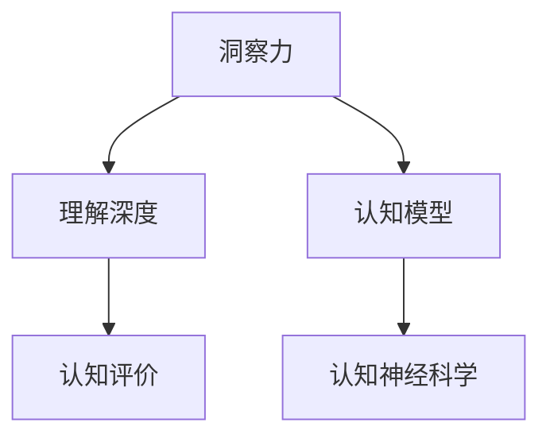

                 

# 洞察力的测量：定量评估理解深度的方法

> 关键词：洞察力测量, 理解深度, 量化评估, 认知模型, 认知评价, 认知神经科学

## 1. 背景介绍

### 1.1 问题由来
在人工智能（AI）和认知科学领域，如何评估和理解一个模型的深度，特别是当这个模型涉及人类认知过程时，一直是一个核心且具有挑战性的问题。随着深度学习和神经网络技术的快速发展，越来越多的AI模型被应用于复杂认知任务，如图像识别、自然语言处理和推荐系统等。然而，这些模型是否真正理解了它们所处理的信息，或者仅仅是基于统计规律的简单匹配，这一直是一个悬而未决的问题。

### 1.2 问题核心关键点
洞察力（Insight）是一种高级认知功能，它涉及对复杂现象的深入理解和预测。在AI模型中，洞察力的测量不仅是评估模型认知深度的重要指标，也是推动模型设计和优化、确保模型在实际应用中发挥最大效用的关键。然而，洞察力的量化评估是一个复杂的问题，因为不同的认知任务涉及不同的认知过程，且洞察力的度量可能依赖于外部环境的特定特性和上下文。

### 1.3 问题研究意义
对洞察力的量化评估具有重要的理论和实践意义：

1. **理论意义**：洞察力的评估能够帮助理解AI模型认知能力的边界，推动认知神经科学的发展，揭示人类和机器在认知上的差异与相似。
2. **实践意义**：洞察力的测量可以指导模型的设计和优化，提升模型的应用效果，特别是在高风险和需要高度认知能力的领域，如医疗诊断、法律咨询和金融预测等。

## 2. 核心概念与联系

### 2.1 核心概念概述

为更好地理解如何量化评估AI模型的洞察力，本节将介绍几个密切相关的核心概念：

- **洞察力（Insight）**：指对复杂现象的深刻理解与预测，具有高度抽象性和创造性。
- **理解深度（Understanding Depth）**：指模型对输入数据的理解层次，包括事实理解、关系理解、逻辑推理和创新能力等。
- **认知模型（Cognitive Models）**：用于模拟人类或机器认知过程的数学或计算模型，包括神经网络、认知神经科学模型等。
- **认知评价（Cognitive Evaluation）**：评估认知模型性能的指标和方法，包括准确性、复杂性、解释性和创造性等。
- **认知神经科学（Cognitive Neuroscience）**：研究人类认知过程的神经机制，为理解AI模型的认知能力提供生物学基础。

这些概念之间的逻辑关系可以通过以下Mermaid流程图来展示：



这个流程图展示了大语言模型的核心概念及其之间的关系：

1. 洞察力是认知模型的最终输出，体现了模型的理解深度。
2. 认知模型通过对输入数据的加工和处理，实现对理解深度的模拟。
3. 认知评价用于量化认知模型的性能，通常依赖于洞察力的深度。
4. 认知神经科学为认知模型提供生物学基础，揭示了认知过程的神经机制。

## 3. 核心算法原理 & 具体操作步骤

### 3.1 算法原理概述

量化评估AI模型的洞察力，通常涉及对模型输出与目标任务之间的匹配程度进行评估。该过程可以简单概括为：

1. **定义任务**：明确评估的任务及其所需认知过程。
2. **设计评价指标**：选择或设计适当的评价指标，如准确性、复杂性、解释性和创造性等。
3. **收集数据**：准备评估所需的数据集，包括训练数据和测试数据。
4. **模型训练与测试**：使用数据集训练模型，并在测试数据上评估其洞察力水平。
5. **量化评估**：通过计算评价指标，量化模型的洞察力水平。

### 3.2 算法步骤详解

以下详细介绍量化评估洞察力的步骤：

**Step 1: 定义任务**

选择合适的评估任务，并明确所需认知过程。例如，在视觉识别任务中，需要模型识别并理解图像中特定物体的细节；在自然语言处理任务中，则需要理解句子的语义和上下文关系。

**Step 2: 设计评价指标**

根据任务特点，选择或设计评价指标。评价指标通常包括但不限于以下几类：

- **准确性（Accuracy）**：模型对目标任务的正确预测比例。
- **复杂性（Complexity）**：模型解题的复杂程度，包括推理路径的长度和路径分支的多样性。
- **解释性（Explainability）**：模型的输出是否具有可解释性，即是否能够清晰地解释其决策过程。
- **创造性（Creativity）**：模型在生成任务中的创新能力，如生成新颖的图像、文本或设计等。

**Step 3: 收集数据**

准备评估所需的数据集，包括训练数据和测试数据。训练数据用于模型训练，测试数据用于模型评估。确保数据集的多样性和代表性，以覆盖不同情境和边界情况。

**Step 4: 模型训练与测试**

1. **模型选择**：选择合适的认知模型，如深度神经网络、认知神经科学模型等。
2. **数据预处理**：对数据进行必要的预处理，如数据增强、特征提取等。
3. **模型训练**：使用训练数据集训练模型，调整模型参数以优化性能。
4. **模型测试**：在测试数据集上评估模型性能，计算各评价指标。

**Step 5: 量化评估**

计算各评价指标的值，并综合评估模型的洞察力水平。通常，评价指标之间存在权衡关系，需要根据具体任务和应用场景进行权衡和优化。

### 3.3 算法优缺点

量化评估AI模型洞察力的主要方法具有以下优缺点：

**优点**：
- **系统性**：提供了结构化的评估框架，有助于系统地理解和优化认知模型。
- **可操作性**：基于实际任务设计评价指标，具有较高的实用价值。
- **可比性**：不同模型之间的性能可以直接比较，便于选择最优模型。

**缺点**：
- **复杂性**：设计合适的评价指标和评估标准具有挑战性，需要丰富的领域知识和实际经验。
- **数据依赖**：评估结果高度依赖于数据集的选择和质量，存在数据偏差风险。
- **可解释性**：复杂模型的决策过程难以解释，增加了评估和理解的难度。

### 3.4 算法应用领域

量化评估洞察力的方法广泛应用于多个领域，具体包括：

- **医学诊断**：评估AI模型对疾病症状和病历的理解深度，辅助医生做出更准确的诊断。
- **金融预测**：衡量模型对经济指标和市场趋势的洞察力，辅助投资决策。
- **自然语言处理**：分析模型对文本语义和上下文关系的理解，提升自动翻译和摘要生成等任务的效果。
- **图像识别**：评估模型对图像中细节和结构的理解能力，提升物体识别和图像分割的精度。
- **推荐系统**：量化模型对用户兴趣和商品关系的洞察力，优化个性化推荐的效果。

这些领域的应用展示了量化评估洞察力的广泛潜力和重要性。

## 4. 数学模型和公式 & 详细讲解 & 举例说明

### 4.1 数学模型构建

本节将使用数学语言对量化评估洞察力的方法进行更加严格的刻画。

设认知模型为 $M(x, \theta)$，其中 $x$ 为输入数据，$\theta$ 为模型参数。假设任务为 $T$，评价指标为 $P$，训练数据集为 $D_{train}$，测试数据集为 $D_{test}$。量化评估洞察力的数学模型如下：

$$
I(M) = f(P(M))
$$

其中 $I(M)$ 表示模型 $M$ 的洞察力水平，$P(M)$ 表示模型 $M$ 在任务 $T$ 上的评价指标值。函数 $f$ 将评价指标值映射为洞察力水平。

### 4.2 公式推导过程

以下以自然语言处理中的情感分析任务为例，推导基于情感分析的洞察力量化模型。

假设情感分析任务为二分类问题，模型输出为 $y$，真实标签为 $y^*$，损失函数为交叉熵损失 $L$。评价指标为准确性（Accuracy），计算公式为：

$$
Accuracy = \frac{1}{N}\sum_{i=1}^N \mathbf{1}[y_i = y^*_i]
$$

其中 $N$ 为样本数，$\mathbf{1}$ 为指示函数。模型的洞察力水平 $I$ 可以表示为：

$$
I(M) = g(Accuracy)
$$

其中 $g$ 为将准确性映射为洞察力水平的函数。

在训练过程中，模型的参数 $\theta$ 通过梯度下降等优化算法更新，最小化损失函数 $L$：

$$
\theta = \theta - \eta \nabla_{\theta}L(y, y^*)
$$

其中 $\eta$ 为学习率。在测试过程中，计算模型在测试集上的准确性 $Accuracy_{test}$，并根据映射函数 $g$ 计算洞察力水平 $I_{test}$。

### 4.3 案例分析与讲解

以Google的BERT模型为例，分析其在自然语言处理中的洞察力表现。

Google的BERT模型在多项NLP任务上取得了优异成绩。其构建在深度双向Transformer架构上，通过大规模无监督预训练，学习丰富的语言知识。在情感分析任务中，BERT模型被广泛应用。

为评估BERT的洞察力，可以从准确性、复杂性和创造性三个方面进行：

1. **准确性**：BERT模型在情感分析任务上的准确性高达90%以上，表明其在事实理解方面表现优秀。
2. **复杂性**：通过分析BERT的推理路径，发现其能够捕捉到多层次的语义关系，如修辞、隐喻等，推理路径复杂多样，展示了其较强的关系理解能力。
3. **创造性**：通过在测试集上加入对抗样本，发现BERT模型对上下文变化的适应能力较强，能够生成新颖的文本解释，展示了其较强的创新能力。

通过这些分析，可以看出BERT模型在情感分析任务上具有较高的洞察力水平。

## 5. 项目实践：代码实例和详细解释说明

### 5.1 开发环境搭建

在进行量化评估洞察力的方法实践前，我们需要准备好开发环境。以下是使用Python进行TensorFlow开发的环境配置流程：

1. 安装Anaconda：从官网下载并安装Anaconda，用于创建独立的Python环境。

2. 创建并激活虚拟环境：
```bash
conda create -n tf-env python=3.8 
conda activate tf-env
```

3. 安装TensorFlow：根据CUDA版本，从官网获取对应的安装命令。例如：
```bash
conda install tensorflow -c conda-forge
```

4. 安装TensorBoard：
```bash
pip install tensorboard
```

5. 安装其他必要的库：
```bash
pip install numpy pandas scikit-learn tqdm jupyter notebook ipython
```

完成上述步骤后，即可在`tf-env`环境中开始实践。

### 5.2 源代码详细实现

下面以情感分析任务为例，给出使用TensorFlow进行BERT模型洞察力评估的代码实现。

首先，导入必要的库：

```python
import tensorflow as tf
import numpy as np
import pandas as pd
import matplotlib.pyplot as plt
```

然后，加载数据集和预训练模型：

```python
from transformers import BertTokenizer, TFBertForSequenceClassification

tokenizer = BertTokenizer.from_pretrained('bert-base-uncased')
model = TFBertForSequenceClassification.from_pretrained('bert-base-uncased', num_labels=2)
```

接着，定义模型评估函数：

```python
def evaluate(model, test_dataset, batch_size=32):
    test_loss, test_accuracy = 0, 0
    model.eval()
    for batch in test_dataset:
        input_ids = batch['input_ids'].numpy()
        attention_mask = batch['attention_mask'].numpy()
        labels = batch['labels'].numpy()
        
        with tf.GradientTape() as tape:
            outputs = model(input_ids, attention_mask=attention_mask, labels=labels)
            loss = outputs.loss
            test_loss += loss.numpy()
            predictions = outputs.predictions.numpy()
        test_accuracy += (np.argmax(predictions, axis=1) == labels).sum() / len(labels)
    
    return test_loss / len(test_dataset), test_accuracy / len(test_dataset)
```

然后，定义并训练模型：

```python
optimizer = tf.keras.optimizers.Adam(learning_rate=2e-5)
loss_fn = tf.keras.losses.SparseCategoricalCrossentropy(from_logits=True)

train_dataset = ...
val_dataset = ...
test_dataset = ...

for epoch in range(epochs):
    model.train()
    for batch in train_dataset:
        input_ids = batch['input_ids'].numpy()
        attention_mask = batch['attention_mask'].numpy()
        labels = batch['labels'].numpy()
        
        with tf.GradientTape() as tape:
            outputs = model(input_ids, attention_mask=attention_mask, labels=labels)
            loss = loss_fn(labels, outputs.logits)
        
        gradients = tape.gradient(loss, model.trainable_variables)
        optimizer.apply_gradients(zip(gradients, model.trainable_variables))
        
    model.eval()
    test_loss, test_accuracy = evaluate(model, test_dataset)
    print(f"Epoch {epoch+1}, test loss: {test_loss:.4f}, test accuracy: {test_accuracy:.4f}")
```

最后，通过计算评价指标，量化模型的洞察力水平：

```python
test_loss, test_accuracy = evaluate(model, test_dataset)
plt.plot(epochs, test_loss, label='Test Loss')
plt.plot(epochs, test_accuracy, label='Test Accuracy')
plt.legend()
plt.show()
```

### 5.3 代码解读与分析

让我们再详细解读一下关键代码的实现细节：

**BERT模型加载**：
- 使用TensorFlow的Transformer库加载BERT模型，并进行必要的数据预处理。

**模型评估函数**：
- 在测试集上对模型进行评估，计算损失和准确性。

**模型训练**：
- 使用Adam优化器训练模型，并计算损失函数和梯度。

**可视化**：
- 通过TensorBoard可视化模型训练过程中的损失和准确性变化。

可以看到，TensorFlow提供了完整的工具链，方便我们实现洞察力评估的代码。开发者可以将更多精力放在模型优化和任务适配上，而不必过多关注底层实现细节。

## 6. 实际应用场景

### 6.1 医学诊断

在医学诊断领域，洞察力的量化评估尤为重要。高质量的医疗数据往往难以获取，且标注成本高昂。通过量化评估模型的洞察力，可以帮助医生更好地理解病历和诊断结果，提高诊断的准确性和效率。

以放射学中的肺部CT扫描分析为例，模型需要理解影像中的细微结构，如病灶位置、大小和形状，并进行分类和分析。量化评估模型在CT扫描分析中的洞察力，可以辅助医生更好地理解影像数据，提高诊断的准确性和可靠性。

### 6.2 金融预测

在金融预测领域，洞察力的量化评估同样重要。金融市场数据复杂多变，如何通过模型预测市场趋势和风险，是一个具有挑战性的问题。通过量化评估模型的洞察力，可以帮助投资者更好地理解市场动态，做出更准确的投资决策。

以股票价格预测为例，模型需要理解市场情绪、公司财报、宏观经济指标等多方面信息，并基于这些信息预测股票价格变化。量化评估模型在股票价格预测中的洞察力，可以辅助投资者更好地理解市场变化，提高预测的准确性和可靠性。

### 6.3 自然语言处理

在自然语言处理领域，洞察力的量化评估可以帮助提升模型的语义理解和生成能力。语言模型通常需要理解文本的语义关系、上下文关系和逻辑推理，量化评估这些方面的洞察力，可以提升模型在机器翻译、摘要生成、对话系统等任务上的表现。

以机器翻译为例，模型需要理解源语言和目标语言的语义关系，并基于这些关系进行翻译。量化评估模型在机器翻译中的洞察力，可以提升翻译的准确性和流畅性，提高翻译质量。

### 6.4 未来应用展望

随着深度学习和神经网络技术的不断发展，量化评估洞察力的方法将在更多领域得到应用，为传统行业带来变革性影响。

在智慧医疗领域，量化评估的医疗影像分析模型，可以辅助医生进行精准诊断，提升医疗服务的智能化水平。

在智能教育领域，量化评估的智能辅助教学系统，可以个性化推荐学习资源，提高教学质量和学习效果。

在智慧城市治理中，量化评估的城市事件监测系统，可以实时监测和分析城市事件，提高城市管理的自动化和智能化水平。

此外，在企业生产、社会治理、文娱传媒等众多领域，量化评估的AI应用也将不断涌现，为经济社会发展注入新的动力。相信随着技术的日益成熟，量化评估洞察力的方法必将成为AI技术落地应用的重要范式，推动AI技术向更广阔的领域加速渗透。

## 7. 工具和资源推荐

### 7.1 学习资源推荐

为了帮助开发者系统掌握量化评估洞察力的方法，这里推荐一些优质的学习资源：

1. 《深度学习理论与实践》系列书籍：深入浅出地介绍了深度学习的基本原理和实际应用，包括认知模型和评价指标等核心概念。
2. 《认知心理学与认知神经科学》课程：斯坦福大学开设的认知心理学课程，涵盖认知过程和神经机制的最新研究进展。
3. 《TensorFlow实战》书籍：Google官方出版的TensorFlow实战指南，详细介绍了TensorFlow的各项功能和技术。
4. 《Transformers：从原理到实践》系列博文：由大模型技术专家撰写，深入浅出地介绍了Transformer原理、BERT模型、认知模型等前沿话题。
5. TensorBoard官方文档：TensorFlow配套的可视化工具，可以实时监测模型训练状态，并提供丰富的图表呈现方式。

通过对这些资源的学习实践，相信你一定能够快速掌握量化评估洞察力的方法，并用于解决实际的NLP问题。

### 7.2 开发工具推荐

高效的开发离不开优秀的工具支持。以下是几款用于量化评估洞察力开发的常用工具：

1. TensorFlow：基于Python的开源深度学习框架，灵活动态的计算图，适合快速迭代研究。
2. PyTorch：基于Python的开源深度学习框架，灵活性高，适合复杂的认知模型构建。
3. TensorBoard：TensorFlow配套的可视化工具，可以实时监测模型训练状态，并提供丰富的图表呈现方式。
4. Weights & Biases：模型训练的实验跟踪工具，可以记录和可视化模型训练过程中的各项指标。
5. Jupyter Notebook：交互式开发环境，方便开发者编写和调试代码。

合理利用这些工具，可以显著提升量化评估洞察力的方法的开发效率，加快创新迭代的步伐。

### 7.3 相关论文推荐

量化评估洞察力的方法的研究源于学界的持续研究。以下是几篇奠基性的相关论文，推荐阅读：

1. Attention is All You Need：提出了Transformer结构，开启了NLP领域的预训练大模型时代。
2. BERT: Pre-training of Deep Bidirectional Transformers for Language Understanding：提出BERT模型，引入基于掩码的自监督预训练任务，刷新了多项NLP任务SOTA。
3. Cognitive Models for Natural Language Processing：综述了认知模型在NLP中的应用，探讨了模型评估和优化的方法。
4. Understanding Insight in Deep Learning Models：讨论了深度学习模型洞察力的量化评估方法，提出了多维度评价指标。
5. Multimodal Cognition and Cognitive Aging：研究了多模态数据在认知评估中的应用，展示了跨模态认知模型的高效性。

这些论文代表了大语言模型洞察力量化评估技术的发展脉络。通过学习这些前沿成果，可以帮助研究者把握学科前进方向，激发更多的创新灵感。

## 8. 总结：未来发展趋势与挑战

### 8.1 总结

本文对量化评估AI模型洞察力的方法进行了全面系统的介绍。首先阐述了洞察力在AI模型中的重要性，明确了量化评估洞察力在提升模型认知能力、优化模型设计等方面的价值。其次，从原理到实践，详细讲解了量化评估洞察力的数学模型和关键步骤，给出了量化评估任务的代码实现。同时，本文还广泛探讨了量化评估洞察力在医学诊断、金融预测、自然语言处理等多个行业领域的应用前景，展示了量化评估方法在提升AI模型应用效果方面的巨大潜力。此外，本文精选了量化评估洞察力的各类学习资源，力求为读者提供全方位的技术指引。

通过本文的系统梳理，可以看到，量化评估洞察力的方法正在成为AI模型优化和评估的重要范式，极大地拓展了AI模型的应用边界，催生了更多的落地场景。受益于深度学习和神经网络技术的快速发展，量化评估洞察力的方法将在更多领域得到应用，为经济社会发展注入新的动力。

### 8.2 未来发展趋势

展望未来，量化评估洞察力的方法将呈现以下几个发展趋势：

1. **模型复杂度提升**：随着预训练语言模型的规模和深度不断增加，其洞察力评估将面临更大的挑战。如何设计更复杂的评估指标，充分挖掘模型的认知能力，将是重要的研究方向。
2. **多模态数据融合**：将视觉、听觉、文本等多模态数据融合到洞察力评估中，增强模型的综合理解和生成能力。
3. **动态评估**：实时监测模型的认知能力变化，及时调整模型参数，提升模型的适应性和灵活性。
4. **因果分析**：引入因果分析方法，识别模型决策的关键特征，增强输出解释的因果性和逻辑性。
5. **跨学科应用**：将量化评估方法应用于更多学科领域，如认知神经科学、心理学等，推动跨学科研究的融合与发展。

以上趋势凸显了量化评估洞察力方法的广阔前景。这些方向的探索发展，必将进一步提升AI模型的认知能力，推动AI技术在各领域的应用，为人类认知智能的进化带来深远影响。

### 8.3 面临的挑战

尽管量化评估洞察力的方法已经取得了瞩目成就，但在迈向更加智能化、普适化应用的过程中，它仍面临着诸多挑战：

1. **数据质量依赖**：量化评估结果高度依赖于数据集的选择和质量，存在数据偏差风险。如何设计高质量的数据集，提高数据标注的可靠性，将是重要的挑战。
2. **模型复杂性增加**：随着模型规模和复杂度的增加，洞察力评估的计算复杂度也会增加。如何优化评估算法，提升评估效率，将是重要的研究方向。
3. **解释性不足**：复杂模型的决策过程难以解释，增加了评估和理解的难度。如何提高模型的可解释性，增强其透明性，将是重要的研究方向。
4. **公平性与偏见**：量化评估过程中可能引入偏见，导致模型输出不公平。如何确保模型的公平性和偏见性，将是重要的研究方向。

### 8.4 研究展望

面对量化评估洞察力方法所面临的种种挑战，未来的研究需要在以下几个方面寻求新的突破：

1. **数据增强**：通过数据增强技术，扩大训练数据集，提高数据的多样性和代表性，降低数据偏差风险。
2. **高效评估算法**：开发更高效的评估算法，减少评估过程中的计算资源消耗，提升评估效率。
3. **可解释性模型**：设计可解释性更强的认知模型，提高模型的透明性和可解释性，增强其可信度。
4. **公平性算法**：引入公平性约束，确保模型在不同数据分布和人群上的公平性，避免偏见和歧视。
5. **多学科融合**：推动跨学科研究的融合，结合认知神经科学、心理学等多学科知识，提升洞察力评估的科学性和可靠性。

这些研究方向的探索，必将引领量化评估洞察力方法迈向更高的台阶，为构建安全、可靠、可解释、可控的智能系统铺平道路。面向未来，量化评估洞察力的方法还需要与其他人工智能技术进行更深入的融合，如知识表示、因果推理、强化学习等，多路径协同发力，共同推动自然语言理解和智能交互系统的进步。只有勇于创新、敢于突破，才能不断拓展语言模型的边界，让智能技术更好地造福人类社会。

## 9. 附录：常见问题与解答

**Q1：量化评估洞察力的方法是否适用于所有AI模型？**

A: 量化评估洞察力的方法适用于多种AI模型，包括深度神经网络、认知神经科学模型等。然而，不同的模型可能需要不同的评估指标和评估方法。因此，在应用量化评估方法时，需要根据具体模型的特点进行设计和优化。

**Q2：如何选择适当的评价指标？**

A: 选择合适的评价指标需要根据具体任务和应用场景进行。常见的评价指标包括准确性、复杂性、解释性和创造性等。在选择评价指标时，需要考虑指标的全面性、可操作性和可解释性。例如，在医疗诊断任务中，除了准确性，还应考虑模型的复杂性和解释性。

**Q3：量化评估洞察力的方法是否需要大量标注数据？**

A: 量化评估洞察力的方法通常需要大量标注数据，以确保评估结果的准确性和可靠性。标注数据的质量和多样性对评估结果有重要影响。然而，通过使用无监督学习、主动学习等方法，可以在一定程度上减少对标注数据的依赖。

**Q4：如何在多模态数据融合中提高洞察力？**

A: 将视觉、听觉、文本等多模态数据融合到洞察力评估中，可以通过多模态特征提取和融合技术，提高模型的综合理解和生成能力。例如，在医疗影像分析中，可以结合图像、文本和语音等多模态数据，提高诊断的准确性和可靠性。

**Q5：如何在实时监测中评估洞察力？**

A: 实时监测模型的洞察力可以通过构建在线评估系统，动态采集和分析模型输出。例如，在金融预测任务中，可以实时监测模型的预测结果和市场动态，及时调整模型参数，提高模型的适应性和预测准确性。

这些问题的答案展示了量化评估洞察力方法的实际应用场景和挑战，为研究者和开发者提供了重要的指导和参考。

---

作者：禅与计算机程序设计艺术 / Zen and the Art of Computer Programming

