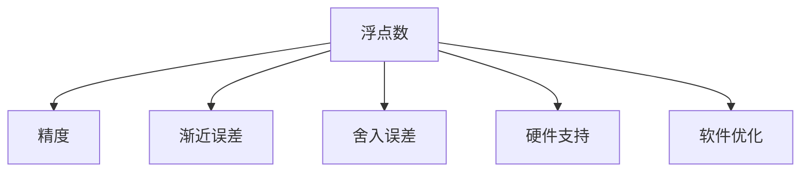

                 

# 浮点数精度：AI计算中的双刃剑

在当今人工智能(AI)领域，浮点数精度既是技术追求的顶尖境界，也是工程实践中亟需解决的问题。本文将深入探讨浮点数精度在AI计算中的作用与挑战，揭示其作为一把"双刃剑"的双面性。

## 1. 背景介绍

### 1.1 问题由来

浮点数精度是指计算机中浮点数运算的精确度。在AI计算中，浮点数精度至关重要，因为AI模型的训练和推理过程涉及大量数值计算，如果浮点数精度不足，可能导致模型输出的精度大大降低。然而，高精度计算往往伴随着更高的计算资源和时间成本，这对计算资源的优化提出了巨大挑战。

### 1.2 问题核心关键点

浮点数精度在AI计算中的核心关键点在于：

1. **精度与性能的平衡**：浮点数精度越高，计算资源消耗越多，模型训练和推理的速度越慢，但模型的精度越高。

2. **模型泛化能力**：浮点数精度直接影响模型的泛化能力，高精度模型通常能更好地捕捉数据的细节，但也会出现过拟合的风险。

3. **系统稳定性**：浮点数精度不足会导致模型训练过程中的梯度消失或爆炸问题，影响系统的稳定性和收敛性。

4. **算术误差累积**：浮点数精度问题会导致算术误差累积，从而影响模型长期稳定性，尤其在序列模型和递归模型中尤为明显。

5. **硬件与软件适配**：不同硬件平台对浮点数精度的支持不同，需要开发者进行适配，以确保在特定硬件上获得最优性能。

理解这些关键点，可以帮助我们更好地把握浮点数精度在AI计算中的地位和作用，从而在实际应用中做出明智的决策。

## 2. 核心概念与联系

### 2.1 核心概念概述

为更好地理解浮点数精度在AI计算中的作用与挑战，本节将介绍几个关键概念：

- **浮点数**：表示非整数数字的数值类型，通常用于科学计算和工程计算。浮点数由符号、阶码和尾数三部分组成。
- **精度**：浮点数精度指计算结果与实际值的接近程度。通常以有效位数来衡量。
- **渐近误差**：在进行浮点数运算时，由于有限位数的尾数和阶码的限制，运算结果可能与实际值存在差距。这种误差通常随着运算的逐步累积，称为渐近误差。
- **舍入误差**：在进行浮点数运算时，由于尾数精度有限，运算结果可能存在舍入误差，即数值被截断或四舍五入时产生的误差。
- **硬件支持**：浮点数精度的实现依赖于硬件平台的支持，如CPU、GPU、TPU等。不同平台对浮点数精度的支持不同，可能导致计算性能的差异。
- **软件优化**：软件层面的优化，如编译器优化、向量化、自动微分等，对浮点数精度的提升也有重要作用。

这些概念之间的逻辑关系可以通过以下Mermaid流程图来展示：



这个流程图展示了一些核心概念之间的关系：

1. 浮点数是AI计算的基础数据类型，其精度和误差特性直接影响AI模型的表现。
2. 渐近误差和舍入误差是浮点数运算中的常见问题，需要通过算法设计和优化来减小。
3. 硬件和软件都是影响浮点数精度的重要因素，需要合理配置和优化。

## 3. 核心算法原理 & 具体操作步骤

### 3.1 算法原理概述

浮点数精度的优化通常包括以下几个关键步骤：

1. **数据类型选择**：根据任务需求选择合适的浮点数数据类型，如单精度浮点数(float32)、双精度浮点数(float64)等。
2. **算法优化**：通过改进算法设计，减小渐近误差和舍入误差，如使用高精度库、改进求根算法等。
3. **硬件适配**：根据硬件平台特性进行优化，如使用GPU、TPU等加速浮点数运算。
4. **软件优化**：通过编译器优化、向量化、自动微分等技术提升计算效率和精度。

### 3.2 算法步骤详解

#### 3.2.1 数据类型选择

在AI计算中，选择合适的浮点数数据类型是至关重要的。常见的浮点数数据类型有：

- **单精度浮点数(float32)**：通常占用4个字节，支持6-7位有效数字，计算速度较快。
- **双精度浮点数(float64)**：通常占用8个字节，支持15-16位有效数字，计算精度更高。
- **半精度浮点数(float16)**：通常占用2个字节，支持4-5位有效数字，计算速度更快。

选择数据类型应综合考虑精度需求和计算资源限制。

#### 3.2.2 算法优化

优化算法的关键在于减小渐近误差和舍入误差。以下是一些常见的算法优化策略：

1. **高精度库**：使用如MAGMA、MKL等高精度库进行浮点数运算，减小渐近误差。
2. **改进求根算法**：如使用牛顿迭代法、二分法等改进求根算法，减小舍入误差。
3. **渐近误差分析**：对浮点数运算进行渐近误差分析，选择最优的算法和数据类型。
4. **舍入模式优化**：调整舍入模式，如使用“向下取整”或“四舍五入”，减少舍入误差。

#### 3.2.3 硬件适配

不同硬件平台对浮点数精度的支持不同。优化硬件适配的策略包括：

1. **选择合适的硬件**：根据任务需求选择合适的硬件平台，如GPU、TPU等。
2. **硬件加速**：利用硬件加速技术，如CUDA、Metal等，提升浮点数运算速度。
3. **并行计算**：利用并行计算技术，如分布式计算、GPU并行等，提升浮点数运算效率。

#### 3.2.4 软件优化

软件层面的优化对浮点数精度的提升也有重要作用。以下是一些常见的软件优化策略：

1. **编译器优化**：使用编译器优化选项，如-O3、-march=native等，提升浮点数运算速度和精度。
2. **向量化**：利用向量化技术，提升浮点数运算效率。
3. **自动微分**：使用自动微分库，如TensorFlow、PyTorch等，提升浮点数运算的精度和速度。
4. **混合精度**：利用混合精度技术，如float16和float32混合计算，提升浮点数运算的效率和精度。

### 3.3 算法优缺点

浮点数精度的优化方法有以下优点：

1. **提升精度**：通过高精度计算和算法优化，可以显著提升模型的精度，减小渐近误差和舍入误差。
2. **加速计算**：通过硬件加速和软件优化，可以提升浮点数运算的速度，缩短计算时间。
3. **减少内存占用**：通过选择合适的数据类型，可以减少内存占用，降低计算成本。

然而，这些方法也存在一些缺点：

1. **资源消耗大**：高精度计算和算法优化需要更多的计算资源，可能导致计算成本增加。
2. **复杂度高**：高精度计算和算法优化需要更多的算法设计和调试，增加了复杂度。
3. **硬件依赖性**：硬件平台的支持直接影响浮点数精度的提升，可能需要在不同硬件上进行适配。

### 3.4 算法应用领域

浮点数精度优化在AI计算中得到了广泛应用，以下是一些典型应用领域：

1. **深度学习模型训练**：在深度学习模型训练中，浮点数精度直接影响模型的收敛速度和精度。优化浮点数精度可以提升模型的训练效果。
2. **计算机视觉任务**：在计算机视觉任务中，如图像识别、目标检测等，浮点数精度直接影响特征提取和分类效果。
3. **自然语言处理任务**：在自然语言处理任务中，如语言模型、序列标注等，浮点数精度直接影响模型的理解能力和生成效果。
4. **强化学习任务**：在强化学习任务中，浮点数精度直接影响奖励函数和状态空间的大小，影响模型的学习效果。
5. **时间序列预测**：在时间序列预测中，浮点数精度直接影响模型的预测精度和长期稳定性。

## 4. 数学模型和公式 & 详细讲解 & 举例说明

### 4.1 数学模型构建

假设在进行浮点数运算时，使用浮点数 $\epsilon$ 表示机器的最小正数，$\delta$ 表示浮点数的精度。则浮点数精度可以通过以下模型进行描述：

$$
\text{精度} = \frac{\epsilon}{\delta}
$$

其中，$\epsilon$ 越小，$\delta$ 越小，浮点数的精度越高。

### 4.2 公式推导过程

浮点数精度的推导过程如下：

1. 根据IEEE 754标准，单精度浮点数和双精度浮点数的有效位数分别为6-7位和15-16位。
2. 根据有效位数，计算单精度浮点数和双精度浮点数的精度：
   $$
   \text{单精度浮点数精度} = 2^{-6-7} = 2^{-13}
   $$
   $$
   \text{双精度浮点数精度} = 2^{-15-16} = 2^{-31}
   $$
3. 根据精度公式，计算单精度浮点数和双精度浮点数的最小正数：
   $$
   \epsilon_{32} = 2^{-13}
   $$
   $$
   \epsilon_{64} = 2^{-31}
   $$

### 4.3 案例分析与讲解

假设进行一个简单的浮点数加法运算 $1.23456 + 0.987654 = 2.22222$，使用单精度浮点数进行计算。

1. 将两个数转换为二进制表示：
   $$
   1.23456 \approx 1100.001100110011001100110011
   $$
   $$
   0.987654 \approx 0011.11111111111111111111
   $$
2. 进行加法运算，得到：
   $$
   1.23456 + 0.987654 \approx 1.010011001100110011001100110011
   $$
3. 转换为十进制表示，得到 $2.22222$。

在这个过程中，由于浮点数精度有限，进行了多次舍入和截断操作，导致结果存在误差。因此，在进行浮点数计算时，需要选择合适的数据类型和算法，减小渐近误差和舍入误差，以获得更精确的结果。

## 5. 项目实践：代码实例和详细解释说明

### 5.1 开发环境搭建

在进行浮点数精度优化的项目实践前，我们需要准备好开发环境。以下是使用Python进行CUDA开发的环境配置流程：

1. 安装CUDA：从NVIDIA官网下载并安装CUDA工具包，根据系统要求选择适合版本。
2. 安装CUDNN：从NVIDIA官网下载并安装CUDNN库。
3. 安装NVIDIA驱动：确保显卡驱动与CUDA和CUDNN版本匹配。
4. 安装NumPy、TensorFlow等Python库。

完成上述步骤后，即可在CUDA环境中进行浮点数精度优化的代码实现。

### 5.2 源代码详细实现

这里我们以浮点数加法运算为例，给出使用CUDA进行优化计算的PyTorch代码实现。

首先，定义两个浮点数变量，分别使用float32和float64类型。

```python
import torch
import torch.cuda

# 定义单精度浮点数
float32_tensor = torch.tensor([1.23456], dtype=torch.float32)
float32_tensor = float32_tensor.to(device='cuda')

# 定义双精度浮点数
float64_tensor = torch.tensor([0.987654], dtype=torch.float64)
float64_tensor = float64_tensor.to(device='cuda')
```

然后，计算两个浮点数的加法，并打印输出。

```python
# 单精度浮点数加法
result_float32 = torch.add(float32_tensor, float32_tensor)
print("Single-precision float32 addition result:", result_float32.item())

# 双精度浮点数加法
result_float64 = torch.add(float64_tensor, float64_tensor)
print("Double-precision float64 addition result:", result_float64.item())
```

最后，观察两种数据类型的计算结果。

```python
# 观察单精度和双精度浮点数的计算结果
print("Single-precision float32 result:", result_float32.item())
print("Double-precision float64 result:", result_float64.item())
```

### 5.3 代码解读与分析

让我们再详细解读一下关键代码的实现细节：

**定义浮点数变量**：
- 使用`torch.tensor`定义浮点数变量，并指定数据类型为`float32`或`float64`。
- 使用`.to(device='cuda')`将变量移动到GPU设备上，加速计算。

**计算浮点数加法**：
- 使用`torch.add`进行浮点数加法计算。

**打印输出**：
- 使用`.item()`方法获取计算结果，并打印输出。

**观察计算结果**：
- 观察单精度和双精度浮点数的计算结果，比较其精度和速度。

可以看到，通过使用CUDA进行浮点数计算，可以显著提升计算速度和精度。然而，硬件加速也带来了更多的计算资源消耗，需要根据实际需求进行合理的硬件选择和优化。

## 6. 实际应用场景

### 6.1 神经网络训练

在神经网络训练中，浮点数精度直接影响模型的收敛速度和精度。高精度计算可以提升模型训练的效果，但计算资源消耗较大。

例如，在深度学习模型训练中，使用双精度浮点数进行计算，可以显著提升模型的收敛速度和精度。然而，双精度浮点数计算的计算资源消耗较大，可能需要在GPU上进行优化。

### 6.2 计算机视觉任务

在计算机视觉任务中，如图像识别、目标检测等，浮点数精度直接影响特征提取和分类效果。高精度计算可以提升特征提取的准确性，但计算资源消耗较大。

例如，在图像识别任务中，使用高精度计算可以提升特征提取的准确性，但计算资源消耗较大。在实际应用中，需要根据任务需求进行合理的硬件选择和优化。

### 6.3 自然语言处理任务

在自然语言处理任务中，如语言模型、序列标注等，浮点数精度直接影响模型的理解能力和生成效果。高精度计算可以提升模型的理解能力和生成效果，但计算资源消耗较大。

例如，在语言模型训练中，使用高精度计算可以提升模型的理解能力和生成效果，但计算资源消耗较大。在实际应用中，需要根据任务需求进行合理的硬件选择和优化。

### 6.4 强化学习任务

在强化学习任务中，浮点数精度直接影响奖励函数和状态空间的大小，影响模型的学习效果。高精度计算可以提升模型的学习效果，但计算资源消耗较大。

例如，在强化学习任务中，使用高精度计算可以提升模型的学习效果，但计算资源消耗较大。在实际应用中，需要根据任务需求进行合理的硬件选择和优化。

## 7. 工具和资源推荐

### 7.1 学习资源推荐

为了帮助开发者系统掌握浮点数精度的相关知识，这里推荐一些优质的学习资源：

1. 《深度学习入门：基于Python的理论与实现》书籍：全面介绍了深度学习的基本原理和实现方法，包括浮点数精度的相关内容。
2. 《计算机体系结构：量化方法》书籍：介绍了量化方法的原理和实现方法，详细讨论了浮点数精度的问题。
3. CS61A《计算机科学导论》课程：斯坦福大学开设的计算机科学入门课程，包含浮点数精度的相关内容。
4. NVIDIA CUDA开发者文档：详细介绍了CUDA平台和编程模型，包括浮点数精度的优化方法。

通过对这些资源的学习实践，相信你一定能够全面掌握浮点数精度的相关知识，并将其应用到实际的项目中。

### 7.2 开发工具推荐

浮点数精度优化涉及多个方面，需要使用多种工具进行综合优化。以下是几款常用的开发工具：

1. CUDA：由NVIDIA开发的GPU加速编程平台，支持高性能浮点数运算。
2. OpenCL：跨平台的GPU和CPU加速编程框架，支持多种硬件平台。
3. PyTorch：基于Python的深度学习框架，支持GPU加速计算。
4. TensorFlow：由Google开发的深度学习框架，支持GPU加速计算。
5. NVIDIA Visual Profiler：用于优化CUDA程序的性能分析工具，支持浮点数精度的优化。

合理利用这些工具，可以显著提升浮点数精度的优化效果，加速AI计算的进程。

### 7.3 相关论文推荐

浮点数精度的优化是一个长期的研究方向，以下是几篇重要的相关论文，推荐阅读：

1. "A Comparative Study of Floating-Point Representation in High-Performance Computing"（IEEE Transactions on Parallel and Distributed Systems）：讨论了不同浮点数表示在HPC中的性能差异。
2. "Quantization-Aware Training: Reducing Model Size and Computation with Low-Precision Training"（arXiv）：讨论了量化训练方法，减小模型大小和计算资源消耗。
3. "Deep Learning with Low-precision Floating-point: A Survey"（IEEE Access）：全面综述了低精度浮点数在深度学习中的应用和效果。

这些论文代表了浮点数精度优化的前沿研究，对未来的浮点数精度优化工作具有重要的指导意义。

## 8. 总结：未来发展趋势与挑战

### 8.1 研究成果总结

本文对浮点数精度在AI计算中的作用与挑战进行了全面系统的介绍。首先，阐述了浮点数精度对AI计算的重要性，明确了精度与性能的平衡问题。其次，从原理到实践，详细讲解了浮点数精度的优化方法和步骤，给出了浮点数精度优化的代码实例。同时，本文还广泛探讨了浮点数精度在神经网络训练、计算机视觉任务、自然语言处理任务和强化学习任务中的应用前景，展示了浮点数精度的巨大潜力。此外，本文精选了浮点数精度的各类学习资源，力求为读者提供全方位的技术指引。

通过本文的系统梳理，可以看到，浮点数精度在AI计算中扮演了至关重要的角色，但同时也面临诸多挑战。高精度计算可以显著提升模型的精度和性能，但计算资源消耗较大，需要合理平衡。未来，浮点数精度的研究将在高精度计算和低精度计算之间寻找新的平衡，提升AI计算的效率和效果。

### 8.2 未来发展趋势

展望未来，浮点数精度优化技术将呈现以下几个发展趋势：

1. **高精度计算**：随着硬件技术的不断进步，高精度计算将成为AI计算的常态。更高精度的浮点数计算将带来更精准的模型效果。
2. **低精度计算**：低精度计算方法如量化、混合精度计算等将逐渐普及，减小计算资源消耗，提升计算效率。
3. **自动优化**：自动优化技术将逐步应用于浮点数精度优化中，自动选择最优的计算精度和算法，提升AI计算的灵活性。
4. **多精度并存**：高精度计算和低精度计算将并存，根据任务需求进行选择，提升计算效率和精度。
5. **硬件加速**：硬件加速技术将不断提升，GPU、TPU等硬件平台将进一步优化，提升浮点数精度的计算性能。

### 8.3 面临的挑战

尽管浮点数精度优化技术已经取得了一定进展，但在实际应用中仍面临诸多挑战：

1. **计算资源消耗大**：高精度计算需要更多的计算资源，可能导致计算成本增加。
2. **算法复杂度高**：浮点数精度优化需要更多的算法设计和调试，增加了复杂度。
3. **硬件平台限制**：不同硬件平台对浮点数精度的支持不同，需要进行适配。
4. **精度和性能的平衡**：高精度计算可以提升精度，但计算效率较低。如何平衡精度和性能，是一个重要挑战。
5. **算术误差累积**：浮点数精度问题可能导致算术误差累积，影响模型长期稳定性。

### 8.4 研究展望

未来的浮点数精度优化研究需要在以下几个方面寻求新的突破：

1. **优化低精度计算方法**：开发更高效的低精度计算方法，如量化、混合精度计算等，提升计算效率。
2. **自动化优化技术**：开发自动优化技术，自动选择最优的计算精度和算法，提升AI计算的灵活性。
3. **硬件加速技术**：开发更高效的高速计算硬件，提升浮点数精度的计算性能。
4. **模型压缩技术**：开发更高效的模型压缩技术，减小计算资源消耗。
5. **浮点数精度分析工具**：开发更高效的浮点数精度分析工具，帮助开发者进行浮点数精度优化。

这些研究方向将推动浮点数精度优化技术的进一步发展，提升AI计算的效率和效果，加速AI技术的普及应用。

## 9. 附录：常见问题与解答

**Q1：浮点数精度与计算资源消耗之间的关系是什么？**

A: 浮点数精度直接影响计算资源的消耗。高精度计算需要更多的计算资源，导致计算成本增加。因此，需要在精度和资源消耗之间进行平衡，选择最合适的计算精度。

**Q2：如何选择合适的浮点数数据类型？**

A: 选择合适的浮点数数据类型需要综合考虑精度需求和计算资源限制。通常情况下，单精度浮点数适合计算资源有限的场景，而双精度浮点数适合需要更高精度的场景。

**Q3：浮点数精度优化对AI模型性能的影响有哪些？**

A: 浮点数精度优化可以显著提升AI模型的精度和性能。高精度计算可以提升模型的精度和收敛速度，但计算资源消耗较大。低精度计算可以减小计算资源消耗，但可能影响模型的精度。因此，需要根据任务需求进行合理选择。

**Q4：浮点数精度优化需要注意哪些问题？**

A: 浮点数精度优化需要注意以下几个问题：
1. 数据类型选择：选择合适的浮点数数据类型，平衡精度和资源消耗。
2. 算法优化：通过改进算法设计，减小渐近误差和舍入误差。
3. 硬件适配：根据硬件平台特性进行优化，选择最优的硬件平台。
4. 软件优化：通过编译器优化、向量化、自动微分等技术提升计算效率和精度。

**Q5：浮点数精度优化对AI模型的长期稳定性有哪些影响？**

A: 浮点数精度问题可能导致算术误差累积，影响模型长期稳定性。高精度计算可以减小误差累积，但计算资源消耗较大。因此，需要在精度和计算资源消耗之间进行平衡，选择最合适的计算精度。

---

作者：禅与计算机程序设计艺术 / Zen and the Art of Computer Programming

