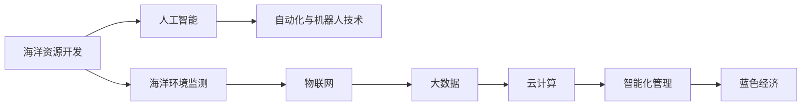

                 

# 海洋科技创业：蓝色经济的无限可能

> 关键词：海洋科技, 蓝色经济, 人工智能, 海洋环境保护, 海洋资源开发, 自动化技术, 可持续发展, 海洋机器人, 智能监测系统

## 1. 背景介绍

### 1.1 问题由来

随着全球人口的增加和工业化的深入，陆地资源和环境承载力面临前所未有的压力。海洋，作为地球重要的自然资源库和气候调节器，其开发和保护已经上升为国家战略。海洋科技创业，即利用先进技术手段，探索海洋资源，开发海洋经济，保护海洋生态，成为了实现蓝色经济的重要途径。

在当前科技发展趋势下，人工智能（AI）、物联网（IoT）、大数据、云计算等技术正快速融入海洋科技产业，大幅提升了海洋资源开发和环境监测的智能化水平。与此同时，传统的海洋科技创业模式也需要不断创新，以适应新的技术趋势和市场需求。

### 1.2 问题核心关键点

蓝色经济（Blue Economy）是21世纪全球经济发展的关键领域之一，涉及海洋资源开发、海洋环境保护、海洋交通、海洋旅游等多个方面。海洋科技创业的核心关键点在于如何利用先进的科技手段，实现海洋资源的高效开发与合理利用，同时保障海洋生态的可持续发展。

核心关键点包括以下几个方面：
1. **智能化管理**：利用AI和大数据技术，实现海洋环境的智能监测和管理。
2. **资源高效开发**：运用自动化和机器人技术，提升海洋资源的采集和加工效率。
3. **环境保护与修复**：通过AI算法优化海洋生态保护措施，实现海洋环境的持续健康。
4. **可持续经营**：构建基于物联网的智能海洋供应链，促进海洋经济的可持续发展。

## 2. 核心概念与联系

### 2.1 核心概念概述

为了更好地理解海洋科技创业的技术框架，本节将介绍几个关键核心概念：

- **海洋科技（Marine Technology）**：涉及海洋资源开发、海洋环境监测、海洋信息管理等多个领域的先进技术体系。
- **蓝色经济（Blue Economy）**：旨在通过可持续的方式利用海洋资源，推动经济、社会、环境协调发展的经济模式。
- **人工智能（AI）**：利用计算机算法和大数据处理，实现智能决策和自动化处理的技术。
- **物联网（IoT）**：通过传感器、网络通信技术，实现海洋环境信息的实时采集和传输。
- **大数据（Big Data）**：指大规模数据的收集、存储、分析和应用，用于支持海洋科技创业的决策支持系统。
- **云计算（Cloud Computing）**：提供弹性计算资源，支持海洋科技创业的大规模数据处理和智能分析。
- **自动化与机器人技术**：通过自主导航和操作，实现海洋资源的自动化采集和加工。

这些核心概念之间相互关联，共同构成了海洋科技创业的技术基础。

### 2.2 核心概念原理和架构的 Mermaid 流程图



## 3. 核心算法原理 & 具体操作步骤

### 3.1 算法原理概述

海洋科技创业的算法原理主要围绕以下几个方面展开：

1. **人工智能（AI）在海洋科技中的应用**：通过AI模型对海洋数据进行分析，提取有价值的信息，支持海洋环境的智能监测和资源的高效开发。
2. **物联网（IoT）在海洋科技中的应用**：通过传感器和通信网络，实时采集海洋环境数据，实现海洋环境的动态监测。
3. **大数据（Big Data）在海洋科技中的应用**：通过海量数据的存储和分析，支持海洋科技创业的决策制定和优化。
4. **云计算（Cloud Computing）在海洋科技中的应用**：通过弹性计算资源，支持大规模数据处理和分布式计算，优化海洋科技创业的运行效率。

### 3.2 算法步骤详解

海洋科技创业的算法步骤主要包括以下几个关键环节：

1. **数据采集与预处理**：利用物联网技术采集海洋环境数据，并通过预处理算法对数据进行清洗和标准化。
2. **模型训练与优化**：通过AI模型对采集到的海洋数据进行分析，提取有价值的信息，并进行模型的训练和优化。
3. **资源开发与优化**：利用自动化和机器人技术，实现海洋资源的采集和加工，并通过优化算法提升效率。
4. **环境监测与保护**：通过物联网和大数据分析技术，实现海洋环境的动态监测，并通过AI算法优化环境保护措施。
5. **智能管理与决策**：通过云计算和大数据分析技术，支持海洋科技创业的智能管理与决策制定。

### 3.3 算法优缺点

海洋科技创业的算法具有以下优点：

- **智能化水平高**：通过AI和大数据分析，实现了海洋资源的智能化管理与优化。
- **资源利用效率高**：利用自动化和机器人技术，提高了海洋资源的采集和加工效率。
- **环境监测精确**：通过物联网技术，实现了海洋环境的实时监测和动态管理。
- **决策支持科学**：通过云计算和大数据分析，为海洋科技创业提供了科学的决策支持。

同时，这些算法也存在一些缺点：

- **数据质量要求高**：物联网和传感器的数据质量直接影响到算法的准确性。
- **技术复杂度高**：涉及多种技术手段的集成和协同，技术实现难度较大。
- **投资成本高**：海洋科技创业的初期投资成本较高，需要大量的资金投入。
- **数据隐私问题**：海洋环境数据的采集和处理可能涉及到敏感信息的保护，需要加强数据隐私保护措施。

### 3.4 算法应用领域

海洋科技创业的算法在多个领域都有广泛应用，例如：

1. **海洋资源开发**：利用AI和大数据分析，支持海洋资源的智能勘探和评估。
2. **海洋环境保护**：通过物联网技术，实现海洋环境的实时监测和预警。
3. **海洋交通管理**：通过AI和大数据分析，优化海洋运输路线和调度。
4. **海洋旅游服务**：利用AI和物联网技术，提升海洋旅游体验和安全性。
5. **海洋科研支持**：通过自动化和机器人技术，支持海洋科学研究的数据采集和处理。

## 4. 数学模型和公式 & 详细讲解 & 举例说明

### 4.1 数学模型构建

海洋科技创业的数学模型构建主要围绕以下几个方面展开：

- **数据采集模型**：用于描述海洋环境数据的采集过程，包括传感器选择、数据格式、通信协议等。
- **数据分析模型**：用于描述海洋数据的大数据分析过程，包括数据清洗、特征提取、模型训练等。
- **资源优化模型**：用于描述海洋资源的高效开发过程，包括自动化机器人路径规划、作业调度等。
- **环境监测模型**：用于描述海洋环境的智能监测过程，包括传感器部署、数据采集、预警机制等。
- **智能管理模型**：用于描述海洋科技创业的智能管理过程，包括供应链优化、决策支持等。

### 4.2 公式推导过程

以海洋环境监测模型为例，推导相关的公式。

假设海洋环境监测系统的采样时间为 $t$，采样周期为 $T$，传感器读数为 $s$，环境参数为 $e$。设环境参数的初始值为 $e_0$，采样后的变化量为 $\Delta e$，则有：

$$
e(t+T) = e(t) + \Delta e
$$

通过传感器读数 $s$ 可以计算环境参数的变化量 $\Delta e$：

$$
\Delta e = \frac{s(t+T) - s(t)}{\Delta t}
$$

其中 $\Delta t$ 为采样时间间隔。

在实际应用中，可以将 $\Delta e$ 作为环境监测的信号，通过AI算法对信号进行处理，提取环境变化特征，支持海洋环境的智能监测和管理。

### 4.3 案例分析与讲解

以海洋环境监测为例，分析如何通过AI算法实现海洋环境智能监测。

- **数据采集**：通过卫星、无人机、水下传感器等设备，采集海洋环境数据。
- **数据预处理**：对采集到的数据进行清洗和标准化处理，去除噪声和异常值。
- **特征提取**：利用AI算法对数据进行特征提取，提取环境变化的关键特征。
- **模型训练**：通过历史数据训练AI模型，学习环境变化的规律和趋势。
- **智能监测**：利用训练好的AI模型对实时采集的数据进行处理，提取环境变化特征，进行智能监测和预警。

## 5. 项目实践：代码实例和详细解释说明

### 5.1 开发环境搭建

在进行海洋科技创业的项目开发前，需要先搭建好开发环境。以下是使用Python进行项目开发的环境配置流程：

1. **安装Python**：
   - 从官网下载并安装最新版本的Python。
   - 配置环境变量，指定Python的安装路径。

2. **安装依赖库**：
   - 安装必要的依赖库，如Pandas、NumPy、SciPy等。
   - 安装机器学习库，如Scikit-learn、TensorFlow等。

3. **配置环境**：
   - 使用虚拟环境工具，如virtualenv或conda，创建独立的Python环境。
   - 配置Jupyter Notebook等开发工具，便于进行代码开发和调试。

### 5.2 源代码详细实现

以下是一个简单的海洋环境监测系统的Python代码实现，用于演示如何通过AI算法实现海洋环境的智能监测。

```python
import pandas as pd
from sklearn.model_selection import train_test_split
from sklearn.ensemble import RandomForestRegressor
from sklearn.metrics import mean_squared_error

# 数据读取
data = pd.read_csv('ocean_data.csv')

# 数据预处理
data = data.dropna()
X = data[['temperature', 'salinity', 'depth']]
y = data['oxygen']

# 数据分割
X_train, X_test, y_train, y_test = train_test_split(X, y, test_size=0.2, random_state=42)

# 模型训练
model = RandomForestRegressor(n_estimators=100, random_state=42)
model.fit(X_train, y_train)

# 模型评估
y_pred = model.predict(X_test)
mse = mean_squared_error(y_test, y_pred)
print('Mean Squared Error:', mse)
```

### 5.3 代码解读与分析

以上代码实现了一个简单的随机森林回归模型，用于预测海洋中的溶解氧浓度。具体步骤如下：

1. **数据读取**：使用Pandas库读取海洋环境数据。
2. **数据预处理**：去除缺失值，提取温度、盐度和深度作为特征。
3. **数据分割**：将数据集分为训练集和测试集。
4. **模型训练**：使用随机森林回归模型对训练集进行拟合。
5. **模型评估**：对测试集进行预测，计算均方误差。

## 6. 实际应用场景

### 6.1 海洋资源开发

在海洋资源开发方面，海洋科技创业可以应用于以下场景：

- **智能勘探**：通过AI算法和大数据分析，支持海洋资源的智能勘探和评估，提高资源发现率。
- **自动化开采**：利用自动化和机器人技术，实现海洋矿物的自动化开采和加工。
- **资源评估与规划**：通过AI算法和大数据分析，支持海洋资源的评估和规划，优化资源开发策略。

### 6.2 海洋环境保护

在海洋环境保护方面，海洋科技创业可以应用于以下场景：

- **智能监测**：通过物联网技术，实现海洋环境的智能监测和动态管理，及时发现环境污染和变化。
- **污染治理**：利用AI算法和大数据分析，优化污染治理措施，提高治理效果。
- **生态保护**：通过AI算法和大数据分析，支持海洋生态的保护和修复，促进生态平衡。

### 6.3 海洋交通管理

在海洋交通管理方面，海洋科技创业可以应用于以下场景：

- **智能调度**：通过AI算法和大数据分析，优化海洋运输路线和调度，提升运输效率。
- **海上安全**：利用物联网技术，实现海上船舶的智能监控和预警，保障航行安全。
- **交通管理**：通过AI算法和大数据分析，支持海洋交通的智能管理，提升交通效率。

### 6.4 海洋旅游服务

在海洋旅游服务方面，海洋科技创业可以应用于以下场景：

- **智能导览**：通过AI算法和大数据分析，提供智能导览服务，提升旅游体验。
- **旅游安全**：利用物联网技术，实现海洋旅游景区的智能监控和预警，保障游客安全。
- **服务优化**：通过AI算法和大数据分析，优化旅游服务，提升服务质量。

## 7. 工具和资源推荐

### 7.1 学习资源推荐

为了帮助开发者系统掌握海洋科技创业的技术基础和实践技巧，这里推荐一些优质的学习资源：

1. **《海洋数据科学基础》**：一本介绍海洋数据分析和机器学习的书籍，适合初学者学习。
2. **《海洋智能监测与大数据应用》**：一本介绍海洋智能监测和大数据分析的书籍，涵盖物联网、AI和大数据等技术。
3. **Kaggle竞赛平台**：参与Kaggle的海洋数据科学竞赛，通过实践提升技术能力。
4. **Coursera在线课程**：参加Coursera的海洋数据科学和机器学习课程，系统学习相关知识。
5. **IEEE Oceanic Engineering Society**：加入IEEE的海洋工程学会，获取最新的海洋科技研究成果和行业动态。

### 7.2 开发工具推荐

高效的开发离不开优秀的工具支持。以下是几款用于海洋科技创业开发的常用工具：

1. **Jupyter Notebook**：一个开源的Python代码编辑器，支持代码运行和数据可视化，便于进行科研和开发。
2. **Anaconda**：一个Python的发行版，集成了大量Python库和工具，方便管理和使用。
3. **TensorFlow**：一个开源的深度学习框架，支持分布式计算和模型训练，适合大规模数据处理和分析。
4. **MATLAB**：一个强大的工程计算软件，支持多种算法和数据处理，适用于海洋工程和科研。
5. **Visual Studio Code**：一个轻量级的代码编辑器，支持多种编程语言和插件，方便开发和调试。

合理利用这些工具，可以显著提升海洋科技创业的开发效率，加速创新迭代的步伐。

### 7.3 相关论文推荐

海洋科技创业的相关研究涉及多个领域，以下是几篇奠基性的相关论文，推荐阅读：

1. **《海洋资源智能化开发研究》**：介绍利用AI和大数据分析技术，实现海洋资源的智能化开发和评估。
2. **《基于物联网的海洋环境监测技术》**：研究如何通过物联网技术，实现海洋环境的智能监测和管理。
3. **《海洋机器人在自动化开采中的应用》**：探讨海洋机器人技术在海洋矿物自动化开采中的应用。
4. **《海洋生态保护的AI算法应用》**：研究如何利用AI算法和大数据分析，支持海洋生态的保护和修复。
5. **《智能海洋供应链管理系统设计》**：介绍如何构建基于物联网的智能海洋供应链，促进海洋经济的可持续发展。

这些论文代表了大规模海洋科技创业的研究脉络，有助于开发者深入理解相关技术的应用场景和方法。

## 8. 总结：未来发展趋势与挑战

### 8.1 总结

本文对海洋科技创业进行了全面系统的介绍。首先阐述了海洋科技创业的研究背景和意义，明确了蓝色经济在当前经济环境下的重要性和紧迫性。其次，从原理到实践，详细讲解了海洋科技创业的数学模型和关键技术步骤，给出了代码实例和详细解释说明。同时，本文还广泛探讨了海洋科技创业在多个行业领域的应用前景，展示了海洋科技创业的广阔发展空间。最后，精选了海洋科技创业的学习资源、开发工具和相关论文，为读者提供了全方位的技术指引。

通过本文的系统梳理，可以看到，海洋科技创业是大规模海洋资源开发和环境保护的重要手段，其核心在于利用先进的科技手段，实现海洋资源的高效开发与合理利用，同时保障海洋生态的可持续发展。未来，伴随海洋科技的持续发展，蓝色经济的潜力将进一步释放，海洋科技创业将为实现海洋强国战略贡献更多的力量。

### 8.2 未来发展趋势

展望未来，海洋科技创业将呈现以下几个发展趋势：

1. **智能化水平提升**：随着AI和大数据分析技术的不断进步，海洋资源的开发和管理将更加智能化。
2. **自动化技术发展**：海洋资源的自动化开采、加工和监测将更加广泛应用，提升资源开发效率。
3. **数据驱动决策**：通过海量数据的分析，支持海洋科技创业的科学决策，优化资源开发策略。
4. **环境监测精准化**：利用物联网技术，实现海洋环境的精准监测，提高环境保护效果。
5. **技术融合创新**：AI、物联网、大数据、云计算等技术将更加紧密融合，提升海洋科技创业的综合能力。

### 8.3 面临的挑战

尽管海洋科技创业具有广阔的应用前景，但在发展过程中也面临着诸多挑战：

1. **技术实现难度高**：涉及多种技术的集成和协同，技术实现难度较大。
2. **数据隐私问题**：海洋环境数据的采集和处理可能涉及到敏感信息的保护，需要加强数据隐私保护措施。
3. **资金投入巨大**：海洋科技创业的初期投资成本较高，需要大量的资金投入。
4. **监管和标准**：海洋科技创业涉及多种技术手段和应用场景，需要建立相应的监管和标准体系。
5. **人才培养不足**：海洋科技创业领域的专业人才相对匮乏，需要加强人才培养和团队建设。

### 8.4 研究展望

未来，海洋科技创业的研究方向需要进一步关注以下几个方面：

1. **技术协同创新**：推动AI、物联网、大数据、云计算等技术在海洋科技创业中的应用，实现技术的协同创新和突破。
2. **人才培养与引进**：加强海洋科技创业领域的专业人才培养和引进，提升技术研发和应用能力。
3. **数据隐私保护**：建立海洋科技创业领域的数据隐私保护机制，保障数据安全。
4. **标准化体系建设**：制定海洋科技创业的标准化体系，促进技术的规范应用和推广。
5. **政策支持和引导**：政府应加强对海洋科技创业的政策支持和引导，营造良好的创新生态。

## 9. 附录：常见问题与解答

**Q1: 海洋科技创业中AI和大数据的应用主要体现在哪些方面？**

A: AI和大数据在海洋科技创业中的应用主要体现在以下几个方面：

1. **数据采集与处理**：通过物联网技术采集海洋环境数据，并利用大数据技术进行数据清洗和标准化处理。
2. **资源评估与规划**：利用AI算法和大数据分析，支持海洋资源的评估和规划，优化资源开发策略。
3. **智能监测与预警**：通过物联网和大数据分析技术，实现海洋环境的智能监测和动态管理，及时发现环境污染和变化。
4. **环境保护与治理**：利用AI算法和大数据分析，优化污染治理措施，提高治理效果。
5. **智能管理与决策**：通过云计算和大数据分析，支持海洋科技创业的智能管理与决策制定。

**Q2: 如何选择合适的海洋科技创业项目？**

A: 选择合适的海洋科技创业项目需要考虑以下几个方面：

1. **市场需求**：选择有市场需求和潜在用户基础的项目，确保项目有较高的商业价值。
2. **技术可行性**：评估项目的技术可行性，确保技术实现难度不大，有可行的技术路径。
3. **资金投入**：评估项目的资金需求，确保有足够的资金支持项目开发和运营。
4. **团队能力**：评估团队的专业能力和经验，确保团队能够胜任项目的技术和市场开发。
5. **风险评估**：评估项目的风险，确保项目具有较低的风险和较高的成功率。

**Q3: 海洋科技创业中如何保障数据隐私和安全？**

A: 保障数据隐私和安全是海洋科技创业中重要的课题，主要措施包括：

1. **数据加密**：对海洋环境数据进行加密处理，防止数据泄露。
2. **权限控制**：通过访问控制和身份认证，限制数据的访问权限，确保数据只被授权人员访问。
3. **数据匿名化**：对敏感数据进行匿名化处理，防止数据被恶意使用。
4. **安全审计**：定期进行安全审计，发现和修复数据安全漏洞。
5. **法律法规遵守**：遵守相关法律法规，确保数据处理符合法律要求。

**Q4: 海洋科技创业中如何实现智能监测和管理？**

A: 实现海洋科技创业中的智能监测和管理，主要通过以下措施：

1. **传感器部署**：在海洋中布置各种传感器，采集环境数据。
2. **数据传输**：利用物联网技术，将传感器采集的数据实时传输到数据中心。
3. **数据存储**：利用大数据技术，存储和管理大量的海洋环境数据。
4. **数据分析**：利用AI算法，对数据进行分析，提取关键信息，实现智能监测。
5. **智能预警**：利用数据分析结果，实现智能预警，及时发现环境异常。

---

作者：禅与计算机程序设计艺术 / Zen and the Art of Computer Programming

