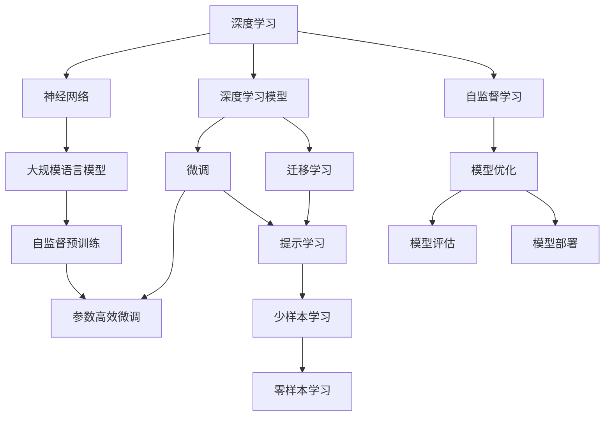

                 

# 深入理解AI、LLM和深度学习的实践课程

## 1. 背景介绍

### 1.1 问题由来
随着人工智能技术的迅猛发展，深度学习已成为解决复杂问题的核心工具，尤其在自然语言处理（NLP）、计算机视觉、语音识别等领域的突破，标志着人工智能技术的巨大潜力和广泛应用前景。其中，大规模语言模型（Large Language Models, LLMs）以其在语言生成、推理、理解等方面的强大能力，成为当前研究的热点。深度学习（Deep Learning, DL）则作为构建LLMs的基础技术，其在模型结构、优化算法、数据处理等方面的创新和突破，为LLMs的训练和应用提供了坚实的理论基础和实践指导。

### 1.2 问题核心关键点
理解AI、LLM和深度学习的实践课程，需要从其核心概念和关键技术入手。主要包括以下几个方面：
- **人工智能（AI）**：涵盖机器学习、深度学习、强化学习等技术，旨在使机器具备类似人类的智能行为。
- **大规模语言模型（LLM）**：指通过预训练和微调技术，在大型数据集上训练出的、具备高水平语言理解和生成的模型，如GPT、BERT等。
- **深度学习（DL）**：基于神经网络理论，通过多层神经元的组合和优化，实现对复杂非线性关系的建模和预测。

## 2. 核心概念与联系

### 2.1 核心概念概述

为更好地理解AI、LLM和深度学习的实践课程，我们首先介绍几个关键概念：

- **神经网络（Neural Networks）**：由多个神经元（神经元通过权重连接）组成的计算模型，用于模拟人脑的信息处理过程。
- **深度学习（Deep Learning）**：通过多层次的非线性映射，从大量数据中自动提取特征和模式。
- **大规模语言模型（Large Language Models）**：通过在大规模无标签数据上预训练，学习到丰富的语言知识和表示，具备强大的语言理解与生成能力。
- **自监督学习（Self-supervised Learning）**：利用数据本身的特性进行训练，如语言模型预测任务，无需标注数据即可学习到语言知识。
- **迁移学习（Transfer Learning）**：将在大规模数据集上预训练的模型知识迁移到特定任务中，提升模型在新任务上的性能。
- **微调（Fine-tuning）**：在大规模预训练模型的基础上，使用特定任务的少量标注数据进行微调，优化模型在该任务上的表现。

这些概念之间存在着密切的联系，构建了深度学习和LLM实践课程的理论基础。

### 2.2 核心概念的联系与逻辑结构

下面通过一个Mermaid流程图，展示AI、LLM和深度学习的核心概念及其联系。



这个流程图展示了深度学习、神经网络、大规模语言模型、自监督学习、迁移学习、微调、提示学习、少样本学习和零样本学习之间的关系。

## 3. 核心算法原理 & 具体操作步骤

### 3.1 算法原理概述

深度学习和LLM的实践课程主要围绕神经网络模型的设计、训练和应用展开。以下是对关键算法的介绍和原理概述：

- **前馈神经网络（Feedforward Neural Network）**：每个神经元仅在前一层神经元输出时激活，信息单向流动，是最基本的神经网络结构。
- **反向传播（Backpropagation）**：利用误差反向传播更新模型参数，是深度学习模型训练的核心算法。
- **自监督预训练（Self-supervised Pre-training）**：在无标签数据上通过特定任务训练模型，使其具备对语言或视觉数据的预处理能力。
- **迁移学习（Transfer Learning）**：在大规模数据集上预训练的模型，可以迁移到特定任务中，利用已有知识加速模型学习。
- **微调（Fine-tuning）**：在预训练模型的基础上，使用特定任务的少量标注数据进行微调，优化模型在该任务上的性能。

### 3.2 算法步骤详解

下面是深度学习和LLM实践课程的具体操作步骤：

**Step 1: 数据准备**
- 收集数据集，包括训练集、验证集和测试集。
- 数据预处理，包括分词、向量化等。

**Step 2: 模型设计**
- 选择合适的模型架构，如卷积神经网络（CNN）、循环神经网络（RNN）、Transformer等。
- 设计模型的损失函数和优化器。

**Step 3: 模型训练**
- 将训练集分批次输入模型，前向传播计算损失函数。
- 反向传播计算梯度，使用优化器更新模型参数。
- 周期性在验证集上评估模型性能。

**Step 4: 模型评估**
- 在测试集上评估模型性能，计算各种指标，如准确率、召回率、F1-score等。
- 可视化训练过程中的损失函数和指标变化。

**Step 5: 模型部署**
- 将训练好的模型保存到本地或远程服务器。
- 集成到实际应用系统中，进行实时推理和预测。

### 3.3 算法优缺点

深度学习和LLM实践课程的优点包括：
- **通用性**：适用于多种任务，如分类、回归、生成等。
- **自适应性**：能适应大规模数据集，无需人工干预。
- **可扩展性**：通过增加模型层数和节点数，提升模型复杂度和性能。

其缺点主要在于：
- **资源消耗大**：需要大量的计算资源和时间进行训练。
- **模型复杂**：模型结构复杂，难以理解和调试。
- **过拟合风险高**：大规模模型容易过拟合，需要采取正则化等技术。

### 3.4 算法应用领域

深度学习和LLM在多个领域取得了显著应用：

- **自然语言处理（NLP）**：如文本分类、情感分析、机器翻译、对话系统等。
- **计算机视觉（CV）**：如图像识别、目标检测、图像生成等。
- **语音识别（ASR）**：如语音转文本、语音情感识别等。
- **医疗健康**：如疾病诊断、药物研发等。
- **金融科技**：如信用评估、风险预测等。

这些领域的应用展示了深度学习和LLM的广泛影响力和强大能力。

## 4. 数学模型和公式 & 详细讲解 & 举例说明

### 4.1 数学模型构建

深度学习和LLM的实践课程涉及到多个数学模型，以下详细介绍：

- **前馈神经网络（Feedforward Neural Network）**：数学模型为 $y = \sigma(Wx + b)$，其中 $W$ 为权重矩阵，$x$ 为输入，$b$ 为偏置，$\sigma$ 为激活函数。
- **反向传播算法**：基于链式法则计算梯度，更新权重 $W$ 和偏置 $b$。
- **自监督预训练**：如语言模型预测任务，目标为最大化预测下一个单词的概率，数学模型为 $P(x_{t+1}|x_{<t})$，其中 $x_{<t}$ 为历史单词序列，$x_{t+1}$ 为预测单词。

### 4.2 公式推导过程

下面推导前馈神经网络的前向传播和反向传播公式：

**前向传播**：
$$
y = \sigma(Wx + b)
$$

**反向传播**：
$$
\frac{\partial L}{\partial W} = \frac{\partial L}{\partial y} \cdot \frac{\partial y}{\partial W} = \frac{\partial L}{\partial y} \cdot \frac{\partial \sigma(Wx + b)}{\partial W} = \frac{\partial L}{\partial y} \cdot \sigma'(Wx + b) \cdot x^T
$$

其中 $L$ 为损失函数，$\sigma$ 为激活函数，$\sigma'$ 为激活函数的导数。

### 4.3 案例分析与讲解

以BERT模型为例，BERT在大规模无标签数据上进行自监督预训练，通过预测下一单词的概率来训练模型，公式为：
$$
P(w_{t+1}|w_{<t}) = softmax(W[h_2] + b)
$$

其中 $w_{<t}$ 为历史单词序列，$w_{t+1}$ 为预测单词，$h_2$ 为Transformer模型的中间隐藏状态。

## 5. 项目实践：代码实例和详细解释说明

### 5.1 开发环境搭建

为了顺利进行深度学习和LLM实践课程的开发，需要以下开发环境：

- Python 3.x
- PyTorch
- TensorFlow
- Jupyter Notebook

安装上述环境，并进行必要的配置，如设置虚拟环境、安装依赖包等。

### 5.2 源代码详细实现

以下是一个基于PyTorch实现的简单前馈神经网络模型：

```python
import torch
import torch.nn as nn
import torch.optim as optim

class FeedforwardNetwork(nn.Module):
    def __init__(self, input_size, hidden_size, output_size):
        super(FeedforwardNetwork, self).__init__()
        self.linear1 = nn.Linear(input_size, hidden_size)
        self.relu = nn.ReLU()
        self.linear2 = nn.Linear(hidden_size, output_size)
        
    def forward(self, x):
        x = self.linear1(x)
        x = self.relu(x)
        x = self.linear2(x)
        return x

# 定义训练过程
def train(model, train_loader, epochs, optimizer):
    criterion = nn.CrossEntropyLoss()
    for epoch in range(epochs):
        for batch_idx, (data, target) in enumerate(train_loader):
            optimizer.zero_grad()
            output = model(data)
            loss = criterion(output, target)
            loss.backward()
            optimizer.step()
```

### 5.3 代码解读与分析

在上述代码中，定义了一个简单的前馈神经网络，包含一个线性层和一个ReLU激活函数，以及一个输出层。通过`nn.Module`的继承，可以方便地扩展和修改模型。在训练过程中，使用交叉熵损失函数进行模型优化，通过`nn.CrossEntropyLoss`实现。

## 6. 实际应用场景

### 6.1 智能客服系统

基于深度学习和LLM的智能客服系统，可以处理大量客户咨询，提供7x24小时不间断服务。系统通过训练深度学习模型，识别客户意图，生成自动回复，大大提升了客户满意度和服务效率。

### 6.2 金融舆情监测

在金融领域，深度学习和LLM可用于舆情监测和风险预警。系统通过分析社交媒体、新闻报道等文本数据，自动提取舆情热点，实时预警市场风险，帮助金融机构做出快速反应。

### 6.3 个性化推荐系统

推荐系统通过深度学习模型，分析用户历史行为和偏好，生成个性化推荐内容。通过不断优化模型，提升推荐效果，满足用户个性化需求，提高用户黏性和满意度。

### 6.4 未来应用展望

未来深度学习和LLM的应用将更加广泛和深入，包括但不限于以下几个方面：

- **医疗健康**：如疾病诊断、药物研发等。
- **金融科技**：如信用评估、风险预测等。
- **教育培训**：如智能辅导、课程推荐等。
- **智能家居**：如语音控制、智能推荐等。
- **智慧城市**：如交通管理、环境监测等。

## 7. 工具和资源推荐

### 7.1 学习资源推荐

为了深入理解深度学习和LLM的实践课程，推荐以下学习资源：

- **深度学习课程**：如Andrew Ng的《深度学习专项课程》、Ian Goodfellow的《深度学习》等。
- **自然语言处理课程**：如Stanford的CS224N课程、吴恩达的NLP课程等。
- **在线教程和博客**：如Kaggle上的深度学习项目、DeepLearning.AI的博客等。
- **开源框架和工具**：如PyTorch、TensorFlow、Jupyter Notebook等。

### 7.2 开发工具推荐

以下是深度学习和LLM实践课程的常用开发工具：

- **PyTorch**：用于构建和训练深度学习模型，易于使用和扩展。
- **TensorFlow**：Google开源的深度学习框架，支持多种硬件加速。
- **Jupyter Notebook**：交互式编程环境，方便调试和展示代码结果。
- **Scikit-learn**：用于数据处理和模型评估的机器学习库。
- **NumPy**：用于数值计算和数组操作的库。

### 7.3 相关论文推荐

以下几篇论文代表深度学习和LLM领域的最新研究进展：

- **Deep Residual Learning for Image Recognition**：提出ResNet结构，解决了深度神经网络中的梯度消失问题，大幅提升模型性能。
- **Attention is All You Need**：提出Transformer结构，实现了语言模型的自注意力机制，显著提升模型效果。
- **BERT: Pre-training of Deep Bidirectional Transformers for Language Understanding**：提出BERT模型，通过双向自监督预训练，显著提升语言理解能力。
- **GPT-3: Language Models are Unsupervised Multitask Learners**：提出GPT-3模型，具有强大的语言生成和理解能力，刷新了多项NLP任务SOTA。
- **Transformers from Scratch**：介绍Transformer结构的原理和实现，适合初学者入门。

## 8. 总结：未来发展趋势与挑战

### 8.1 研究成果总结

深度学习和LLM的实践课程涵盖了从理论基础到实际应用的各个方面，取得了显著的学术和工业成果。深度学习模型通过多层次的非线性映射，从大规模数据中自动提取特征和模式，广泛应用于多个领域。LLM通过大规模预训练和微调，具备强大的语言理解和生成能力，推动了自然语言处理技术的快速发展。

### 8.2 未来发展趋势

未来深度学习和LLM的发展趋势主要包括以下几个方面：

- **模型规模增大**：随着计算资源和数据的增长，预训练模型的规模将进一步扩大，提升模型的语言理解和生成能力。
- **多模态融合**：深度学习模型将融合视觉、语音等多模态信息，实现更全面的信息处理和决策。
- **可解释性和透明度**：深度学习模型的可解释性和透明度将得到提升，有助于理解和信任模型的决策过程。
- **自适应学习**：深度学习模型将具备更强的自适应能力，能够实时学习和适应新数据和新任务。
- **跨领域迁移**：深度学习模型将具备更强的跨领域迁移能力，能够迁移应用到新的领域和任务中。

### 8.3 面临的挑战

尽管深度学习和LLM取得了显著进展，但仍面临以下挑战：

- **计算资源需求高**：大规模预训练和训练需要大量的计算资源和电力，限制了模型的应用。
- **模型复杂性高**：深度学习模型的结构复杂，难以理解和调试，增加了模型维护和部署的难度。
- **数据需求大**：深度学习模型的训练需要大量的标注数据，数据收集和标注成本高。
- **过拟合风险**：深度学习模型容易过拟合，需要采取正则化和数据增强等技术。
- **伦理和安全问题**：深度学习模型的输出可能存在偏见和歧视，需要加强模型公平性和安全性。

### 8.4 研究展望

未来深度学习和LLM的研究方向主要包括以下几个方面：

- **模型压缩和优化**：通过模型压缩和优化技术，减少模型参数和计算资源消耗，提升模型效率。
- **自监督学习**：开发更多自监督学习方法，减少对标注数据的依赖，提升模型的自适应能力。
- **多模态融合**：实现视觉、语音等多模态信息的融合，提升模型的全面性和决策能力。
- **可解释性和透明度**：开发可解释性技术，提升模型的透明度和可信度。
- **跨领域迁移**：研究跨领域迁移方法，提升模型在新的领域和任务上的表现。

## 9. 附录：常见问题与解答

### 9.1 常见问题

- **Q1: 深度学习和LLM有什么区别？**
  A: 深度学习是一种基于神经网络的机器学习方法，通过多层非线性映射，实现对复杂非线性关系的建模。LLM则是通过大规模预训练和微调，学习到丰富的语言知识和表示，具备强大的语言理解与生成能力。

- **Q2: 深度学习和LLM的训练和微调有什么区别？**
  A: 深度学习通常通过监督学习任务训练模型，利用标注数据指导模型学习。LLM则通常通过自监督学习任务进行预训练，再使用特定任务的少量标注数据进行微调，优化模型在该任务上的性能。

- **Q3: 深度学习和LLM的应用场景有哪些？**
  A: 深度学习在图像识别、语音识别、自然语言处理等领域有广泛应用。LLM在问答系统、翻译系统、情感分析、推荐系统等领域表现出色。

### 9.2 解答

通过本文的深入介绍，相信你已对深度学习和LLM的实践课程有了更全面的理解和认识。希望通过这一系列课程，能够激发你对深度学习和大规模语言模型的研究兴趣，并在未来的实践中取得更多突破。

---

作者：禅与计算机程序设计艺术 / Zen and the Art of Computer Programming

