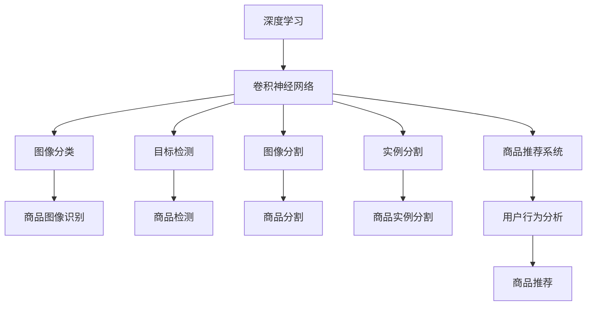

                 

# 深度学习在商品图像识别中的应用

> 关键词：深度学习,商品图像识别,卷积神经网络(CNN),图像分类,目标检测,图像分割,实例分割,商品推荐系统

## 1. 背景介绍

随着电商业务的迅速发展，商品图像识别成为了在线零售领域中的一个核心问题。传统的商品识别依赖于手工特征提取和机器学习算法，需要大量人工干预和标注，且在复杂场景下的鲁棒性较差。而深度学习技术，特别是卷积神经网络(CNN)，通过自动学习图像的特征表示，有效解决了这些问题。

在深度学习技术的推动下，商品图像识别技术得到了显著的提升，并在电商领域得到了广泛的应用。比如，京东、淘宝等大型电商网站都通过商品图像识别技术，实现了高效的智能推荐、库存管理和客户服务，极大地提升了用户体验和运营效率。

## 2. 核心概念与联系

### 2.1 核心概念概述

为更好地理解深度学习在商品图像识别中的应用，本节将介绍几个密切相关的核心概念：

- 深度学习(Deep Learning)：基于神经网络，通过多层非线性变换提取数据的高层次特征表示，适用于处理大规模复杂数据。

- 卷积神经网络(CNN)：一种专门用于图像处理和计算机视觉任务的人工神经网络结构，包含卷积层、池化层、全连接层等基本组件。

- 图像分类：将图像映射到预定义的类别标签中，是商品图像识别中最常见的应用场景之一。

- 目标检测：在图像中定位并标注出特定的目标物体，如商品图像中检测出特定商品。

- 图像分割：将图像细分为多个像素级别的区域，每个区域对应一个语义标签。

- 实例分割：在图像分割基础上，进一步识别出每个区域中实例的类别，如商品图像中识别出具体商品。

- 商品推荐系统：通过分析用户历史行为数据和商品图像信息，向用户推荐感兴趣的商品，提升用户体验和转化率。

- 预训练模型：在大规模数据集上进行预训练的模型，如ImageNet上预训练的VGG、ResNet等。

这些核心概念之间的逻辑关系可以通过以下Mermaid流程图来展示：



这个流程图展示了大语言模型在商品图像识别中的应用框架：

1. 深度学习提供强大的特征提取能力，卷积神经网络是其中应用最为广泛的一种。
2. 基于CNN的模型可以进行图像分类、目标检测、图像分割和实例分割等任务。
3. 这些任务的结果可以用于商品识别，并通过用户行为分析，构建商品推荐系统。

## 3. 核心算法原理 & 具体操作步骤
### 3.1 算法原理概述

深度学习在商品图像识别中的应用，主要通过训练具有视觉特征提取能力的神经网络模型，将其应用于实际的商品图像识别任务中。以下是具体流程：

1. **数据准备**：收集并标注商品图像数据，包含图像和对应的类别标签。
2. **模型选择与设计**：选择适当的卷积神经网络结构，并在图像分类、目标检测、图像分割等任务上进行微调。
3. **模型训练**：使用标注数据对模型进行训练，最小化预测误差。
4. **模型评估与优化**：在测试集上评估模型性能，并根据评估结果进行超参数调整和模型优化。
5. **模型应用**：将训练好的模型应用于商品图像识别任务中，如商品分类、检测、分割和推荐等。

### 3.2 算法步骤详解

下面详细介绍每个步骤的具体操作：

#### 3.2.1 数据准备

- **数据集构建**：收集商品图像数据，标注商品类别。可以使用公开数据集，如CIFAR-10、ImageNet等，也可以自己构建特定商品的数据集。
- **数据预处理**：对图像进行归一化、缩放、旋转、裁剪等预处理操作，以便模型更好地学习特征。

#### 3.2.2 模型选择与设计

- **模型选择**：根据任务需求选择合适的预训练模型。如ImageNet预训练的ResNet、VGG等。
- **模型微调**：在特定任务上对预训练模型进行微调，可以只微调顶层，也可以全模型微调。

#### 3.2.3 模型训练

- **训练集划分**：将数据集分为训练集、验证集和测试集。
- **损失函数选择**：根据任务类型选择合适的损失函数，如交叉熵损失、均方误差损失等。
- **优化器选择**：选择如SGD、Adam等优化器，并设置学习率等超参数。

#### 3.2.4 模型评估与优化

- **评估指标选择**：根据任务类型选择合适的评估指标，如准确率、召回率、F1-score等。
- **超参数调整**：根据模型在验证集上的性能，调整学习率、批大小、正则化强度等超参数。
- **模型优化**：可以使用数据增强、正则化、迁移学习等技术进一步优化模型性能。

#### 3.2.5 模型应用

- **商品分类**：输入商品图像，输出分类结果。
- **商品检测**：在图像中检测出商品区域，输出商品位置和类别。
- **商品分割**：将商品图像细分为多个区域，每个区域对应一个类别。
- **商品推荐**：结合用户行为数据，生成个性化推荐商品列表。

### 3.3 算法优缺点

深度学习在商品图像识别中具有以下优点：

- **自动特征提取**：深度学习模型能够自动学习图像的高级特征表示，无需手工特征提取。
- **鲁棒性强**：深度学习模型对光照、背景、尺度等变化具有较强的鲁棒性，能够处理复杂场景下的图像识别任务。
- **应用广泛**：深度学习模型可以应用于图像分类、目标检测、图像分割等多个领域，具有广泛的适用性。

同时，深度学习也存在以下缺点：

- **计算资源需求高**：深度学习模型参数量庞大，计算资源消耗大，对硬件设备要求高。
- **过拟合风险大**：深度学习模型容易过拟合，特别是在标注数据不足的情况下。
- **模型可解释性差**：深度学习模型通常是"黑盒"模型，难以解释其内部工作机制和决策逻辑。

### 3.4 算法应用领域

深度学习在商品图像识别中主要应用于以下几个领域：

- **商品分类**：通过训练分类模型，自动对商品图像进行分类。可以用于电商网站的商品归类和搜索。
- **商品检测**：通过训练检测模型，在图像中定位和标注出特定的商品。可以用于自动监控、无人商店等领域。
- **商品分割**：通过训练分割模型，将商品图像细分为多个区域，每个区域对应一个类别。可以用于商品识别和商品数量统计。
- **商品推荐**：通过分析用户历史行为数据和商品图像信息，向用户推荐感兴趣的商品。可以用于提升用户体验和电商平台的转化率。

除了上述这些经典应用外，深度学习在商品图像识别中还有很多创新性的应用，如3D商品建模、实时图像识别等，为电商领域带来了全新的技术突破。

## 4. 数学模型和公式 & 详细讲解  
### 4.1 数学模型构建

在商品图像识别中，深度学习模型通常基于卷积神经网络(CNN)构建。以下以图像分类任务为例，详细讲解CNN模型的数学模型。

记输入图像为 $\mathbf{x} \in \mathbb{R}^{d}$，卷积神经网络模型 $M_{\theta}$ 的输出为 $\mathbf{y} \in \mathbb{R}^{K}$，其中 $K$ 为类别数。定义模型 $M_{\theta}$ 在图像 $\mathbf{x}$ 上的损失函数为 $\ell(M_{\theta}(\mathbf{x}),y)$，则在训练集 $D=\{(\mathbf{x}_i,y_i)\}_{i=1}^N$ 上的经验风险为：

$$
\mathcal{L}(\theta) = \frac{1}{N} \sum_{i=1}^N \ell(M_{\theta}(\mathbf{x}_i),y_i)
$$

其中 $\theta$ 为模型参数。常见的损失函数包括交叉熵损失、均方误差损失等。

### 4.2 公式推导过程

下面以交叉熵损失为例，推导其在图像分类任务中的公式。

假设模型 $M_{\theta}$ 在输入图像 $\mathbf{x}$ 上的输出为 $\mathbf{y} \in [0,1]^K$，表示每个类别的预测概率。真实标签 $y \in \{1,0\}^K$。则交叉熵损失函数定义为：

$$
\ell(M_{\theta}(\mathbf{x}),y) = -\sum_{i=1}^K y_i \log M_{\theta}(\mathbf{x})_i
$$

将其代入经验风险公式，得：

$$
\mathcal{L}(\theta) = -\frac{1}{N}\sum_{i=1}^N \sum_{j=1}^K y_{ij} \log M_{\theta}(\mathbf{x}_i)_j
$$

其中 $y_{ij}$ 表示图像 $i$ 中第 $j$ 个类别的真实标签。

根据链式法则，损失函数对参数 $\theta_k$ 的梯度为：

$$
\frac{\partial \mathcal{L}(\theta)}{\partial \theta_k} = -\frac{1}{N}\sum_{i=1}^N \frac{y_i}{M_{\theta}(\mathbf{x}_i)_k} \frac{\partial M_{\theta}(\mathbf{x}_i)}{\partial \theta_k}
$$

其中 $\frac{\partial M_{\theta}(\mathbf{x}_i)}{\partial \theta_k}$ 可以通过自动微分技术高效计算。

### 4.3 案例分析与讲解

以ImageNet数据集为例，分析基于深度学习的商品图像分类模型。

ImageNet是一个大规模的图像分类数据集，包含数百万个图像和1000个类别。在ImageNet上预训练的模型（如ResNet、VGG等），通过在特定任务上进行微调，可以高效应用于商品图像分类任务。

假设在ImageNet上预训练了一个ResNet-50模型，需要在商品图像分类任务上进行微调。微调过程如下：

1. **数据准备**：收集商品图像数据，并进行预处理。
2. **模型选择**：选择ResNet-50模型作为预训练基础。
3. **微调**：只微调ResNet-50的顶层全连接层，使用商品图像数据进行微调，最小化交叉熵损失。
4. **评估与优化**：在验证集上评估模型性能，根据评估结果调整学习率等超参数，进一步优化模型。
5. **应用**：将微调后的模型应用于商品图像分类任务，自动分类商品图像，并生成商品推荐。

## 5. 项目实践：代码实例和详细解释说明
### 5.1 开发环境搭建

在进行商品图像识别项目开发前，我们需要准备好开发环境。以下是使用Python进行PyTorch开发的环境配置流程：

1. 安装Anaconda：从官网下载并安装Anaconda，用于创建独立的Python环境。

2. 创建并激活虚拟环境：
```bash
conda create -n pytorch-env python=3.8 
conda activate pytorch-env
```

3. 安装PyTorch：根据CUDA版本，从官网获取对应的安装命令。例如：
```bash
conda install pytorch torchvision torchaudio cudatoolkit=11.1 -c pytorch -c conda-forge
```

4. 安装其他依赖：
```bash
pip install torchmetrics numpy pandas scikit-learn matplotlib tqdm jupyter notebook ipython
```

完成上述步骤后，即可在`pytorch-env`环境中开始项目开发。

### 5.2 源代码详细实现

下面我们以基于卷积神经网络的图像分类任务为例，给出使用PyTorch进行深度学习模型开发的代码实现。

首先，定义模型类和数据处理函数：

```python
import torch
import torch.nn as nn
import torch.optim as optim
from torch.utils.data import DataLoader
from torchvision import datasets, transforms

class Net(nn.Module):
    def __init__(self):
        super(Net, self).__init__()
        self.conv1 = nn.Conv2d(3, 64, kernel_size=3, stride=1, padding=1)
        self.conv2 = nn.Conv2d(64, 128, kernel_size=3, stride=1, padding=1)
        self.pool = nn.MaxPool2d(kernel_size=2, stride=2)
        self.fc1 = nn.Linear(128*28*28, 1024)
        self.fc2 = nn.Linear(1024, 10)
        self.dropout = nn.Dropout(0.5)

    def forward(self, x):
        x = self.pool(F.relu(self.conv1(x)))
        x = self.pool(F.relu(self.conv2(x)))
        x = x.view(-1, 128*28*28)
        x = F.relu(self.fc1(x))
        x = self.dropout(x)
        x = self.fc2(x)
        return x

transform = transforms.Compose([
    transforms.ToTensor(),
    transforms.Normalize((0.5, 0.5, 0.5), (0.5, 0.5, 0.5))
])

train_dataset = datasets.CIFAR10(root='data', train=True, download=True, transform=transform)
test_dataset = datasets.CIFAR10(root='data', train=False, download=True, transform=transform)

train_loader = DataLoader(train_dataset, batch_size=64, shuffle=True)
test_loader = DataLoader(test_dataset, batch_size=64, shuffle=False)
```

然后，定义训练和评估函数：

```python
def train_epoch(model, optimizer, data_loader, device):
    model.train()
    total_loss = 0
    for batch_idx, (inputs, targets) in enumerate(data_loader):
        inputs, targets = inputs.to(device), targets.to(device)
        optimizer.zero_grad()
        outputs = model(inputs)
        loss = F.cross_entropy(outputs, targets)
        loss.backward()
        optimizer.step()
        total_loss += loss.item()
    return total_loss / len(data_loader)

def evaluate(model, data_loader, device):
    model.eval()
    total_loss = 0
    total_correct = 0
    with torch.no_grad():
        for batch_idx, (inputs, targets) in enumerate(data_loader):
            inputs, targets = inputs.to(device), targets.to(device)
            outputs = model(inputs)
            loss = F.cross_entropy(outputs, targets)
            total_loss += loss.item()
            total_correct += (outputs.argmax(dim=1) == targets).sum().item()
    return total_correct / len(data_loader.dataset)

# 训练过程
device = torch.device('cuda' if torch.cuda.is_available() else 'cpu')
model = Net().to(device)
optimizer = optim.Adam(model.parameters(), lr=0.001)

num_epochs = 10

for epoch in range(num_epochs):
    train_loss = train_epoch(model, optimizer, train_loader, device)
    test_accuracy = evaluate(model, test_loader, device)
    print(f'Epoch {epoch+1}, train loss: {train_loss:.4f}, test accuracy: {test_accuracy:.4f}')

print('Finished Training')
```

以上就是使用PyTorch对基于卷积神经网络的图像分类模型进行开发的完整代码实现。可以看到，通过构建简单的卷积神经网络，并使用PyTorch的强大API，我们能够快速实现图像分类任务，并在实际数据集上进行训练和评估。

### 5.3 代码解读与分析

让我们再详细解读一下关键代码的实现细节：

**Net类**：
- `__init__`方法：定义模型的层结构和参数。
- `forward`方法：定义模型前向传播的计算过程。

**transforms.Compose**：
- 用于定义图像预处理步骤，包括将图像转换为张量、归一化等。

**train_loader和test_loader**：
- 使用PyTorch的DataLoader，从CIFAR-10数据集加载训练和测试数据，并进行批处理和随机化。

**train_epoch和evaluate函数**：
- `train_epoch`函数：对模型进行前向传播和反向传播，更新参数。
- `evaluate`函数：在测试集上评估模型性能，计算准确率。

**训练过程**：
- 在GPU上部署模型。
- 定义Adam优化器和初始学习率。
- 循环训练多次，每次迭代更新模型参数，并在测试集上评估性能。

可以看到，PyTorch提供了便捷的工具和API，使得深度学习模型的开发和训练变得简单高效。通过合理利用这些工具，开发者可以专注于模型设计、数据处理等关键环节，减少底层实现的繁琐工作。

## 6. 实际应用场景
### 6.1 电商商品分类

在电商平台上，商品分类是重要的基础任务。通过深度学习模型，电商网站能够快速准确地对商品进行分类，提升用户的购物体验。

具体来说，电商网站可以使用深度学习模型对商品图片进行分类，将其映射到预设的分类标签中。这些分类标签可以作为搜索和推荐系统的输入，帮助用户快速找到所需商品，并推荐相关商品，提高转化率。例如，京东的“商品分类智能推荐系统”，通过深度学习模型对商品图片进行分类，实现了高效的商品搜索和推荐。

### 6.2 商品检测和识别

商品检测和识别是另一个重要的应用场景。电商平台可以使用深度学习模型，自动检测和识别图像中的商品，并输出商品位置和类别信息。这些信息可以用于库存管理、自动化仓储、智能推荐等领域。

例如，阿里巴巴的“商品检测系统”，使用深度学习模型对电商平台上大量的商品图片进行检测和识别，自动更新商品信息，提高了平台的运营效率。

### 6.3 个性化商品推荐

基于深度学习的商品推荐系统，能够根据用户历史行为数据和商品信息，生成个性化推荐商品列表，提升用户的购物体验。

具体来说，电商网站可以使用深度学习模型对用户行为数据和商品信息进行联合建模，生成用户画像和商品特征向量。通过计算相似度，推荐与用户兴趣和偏好相符的商品，提高用户的转化率和满意度。例如，亚马逊的“推荐系统”，通过深度学习模型对用户历史行为和商品信息进行建模，生成个性化推荐商品，提升了用户的购买意愿和购物体验。

## 7. 工具和资源推荐
### 7.1 学习资源推荐

为了帮助开发者系统掌握深度学习在商品图像识别中的应用，这里推荐一些优质的学习资源：

1. 《深度学习》系列课程：由斯坦福大学Andrew Ng教授开设，涵盖了深度学习的基础理论和经典算法，适合初学者系统学习。
2. 《PyTorch官方文档》：详细介绍了PyTorch的API和使用方法，是深度学习项目开发必备的学习资料。
3. 《深度学习实践》： hands-on深度学习项目开发指南，通过实际项目，帮助开发者提升实战能力。
4. Kaggle深度学习竞赛：参与Kaggle深度学习竞赛，通过实践提升深度学习模型开发和优化能力。
5. Coursera深度学习课程：提供大量深度学习领域的先进课程，涵盖理论和实践，适合进阶学习。

通过对这些资源的学习实践，相信你一定能够快速掌握深度学习在商品图像识别中的应用，并用于解决实际的电商问题。

### 7.2 开发工具推荐

高效的深度学习项目开发离不开优秀的工具支持。以下是几款用于深度学习项目开发的常用工具：

1. PyTorch：基于Python的开源深度学习框架，灵活动态的计算图，适合快速迭代研究。大部分深度学习模型都有PyTorch版本的实现。

2. TensorFlow：由Google主导开发的开源深度学习框架，生产部署方便，适合大规模工程应用。同样有丰富的深度学习模型资源。

3. Keras：基于TensorFlow和Theano的高级神经网络API，简单易用，适合快速原型开发。

4. Weights & Biases：模型训练的实验跟踪工具，可以记录和可视化模型训练过程中的各项指标，方便对比和调优。

5. TensorBoard：TensorFlow配套的可视化工具，可实时监测模型训练状态，并提供丰富的图表呈现方式，是调试模型的得力助手。

6. Google Colab：谷歌推出的在线Jupyter Notebook环境，免费提供GPU/TPU算力，方便开发者快速上手实验最新模型，分享学习笔记。

合理利用这些工具，可以显著提升深度学习项目开发效率，加快创新迭代的步伐。

### 7.3 相关论文推荐

深度学习在商品图像识别领域的发展源于学界的持续研究。以下是几篇奠基性的相关论文，推荐阅读：

1. AlexNet：ImageNet大规模视觉识别挑战赛的冠军算法，展示了深度学习在图像分类任务中的潜力。
2. VGGNet：提出了多层次卷积结构，显著提升了图像分类的准确率。
3. GoogLeNet：提出了Inception模块，在保持模型精简的同时，提升了分类准确率。
4. ResNet：提出了残差连接，解决了深层网络退化的问题，大幅提升了图像分类准确率。
5. DenseNet：提出了密集连接，进一步提升了网络深度和信息流通。

这些论文代表了大深度学习模型在图像分类任务中的进步。通过学习这些前沿成果，可以帮助研究者把握学科前进方向，激发更多的创新灵感。

## 8. 总结：未来发展趋势与挑战
### 8.1 总结

本文对深度学习在商品图像识别中的应用进行了全面系统的介绍。首先阐述了深度学习在商品图像识别中的研究背景和应用价值，明确了深度学习在商品图像识别中的独特优势。其次，从原理到实践，详细讲解了深度学习在商品图像识别中的应用流程，给出了深度学习模型开发的完整代码实例。同时，本文还广泛探讨了深度学习模型在电商领域的应用场景，展示了深度学习技术的广泛前景。此外，本文精选了深度学习模型相关的学习资源，力求为读者提供全方位的技术指引。

通过本文的系统梳理，可以看到，深度学习在商品图像识别中的应用已经取得了显著的进展，并得到了广泛的应用。未来，伴随深度学习技术的不断演进，商品图像识别技术必将进一步提升，为电商领域的智能化和数字化转型带来新的推动力。

### 8.2 未来发展趋势

展望未来，深度学习在商品图像识别领域将呈现以下几个发展趋势：

1. **模型规模持续增大**：深度学习模型的参数量将继续增加，计算资源需求将进一步提高。但随着计算能力的提升和模型压缩技术的发展，超大规模模型的应用将更为普及。

2. **多模态学习增强**：除了图像数据，深度学习模型将越来越多地融合多模态数据，如语音、文本等，提升模型的智能水平和鲁棒性。

3. **轻量化模型涌现**：针对计算资源受限的场景，如移动设备、边缘计算等，轻量化模型将得到广泛应用。

4. **自监督学习推广**：深度学习模型将越来越多地利用无标签数据进行自监督学习，提升模型的泛化能力和可解释性。

5. **实时化应用普及**：深度学习模型将越来越多地应用于实时场景，如智能推荐、自动化仓储等，提高系统响应速度和用户体验。

### 8.3 面临的挑战

尽管深度学习在商品图像识别中取得了显著进展，但在迈向更加智能化、普适化应用的过程中，它仍面临着诸多挑战：

1. **数据依赖问题**：深度学习模型需要大量的标注数据进行训练，获取高质量标注数据成本高、难度大。

2. **过拟合风险**：深度学习模型在标注数据不足的情况下容易过拟合，泛化能力有待提高。

3. **计算资源瓶颈**：深度学习模型计算资源需求高，对硬件设备要求高，实际部署中资源限制问题突出。

4. **模型可解释性不足**：深度学习模型通常难以解释其内部工作机制和决策逻辑，难以满足高风险应用的需求。

5. **伦理和安全性问题**：深度学习模型可能学习到有偏见、有害的信息，模型输出可能存在误导性和歧视性。

6. **实时性要求高**：深度学习模型实时化应用难度大，计算资源消耗大，对系统架构和算法优化要求高。

### 8.4 研究展望

针对深度学习在商品图像识别领域面临的挑战，未来的研究需要在以下几个方面寻求新的突破：

1. **数据增强和迁移学习**：利用数据增强和迁移学习技术，提升深度学习模型在标注数据不足情况下的性能。

2. **轻量化模型和压缩技术**：开发轻量化模型和模型压缩技术，降低深度学习模型的计算资源需求。

3. **自监督学习和半监督学习**：利用自监督和半监督学习技术，提升深度学习模型的泛化能力和可解释性。

4. **多模态融合技术**：开发多模态融合技术，提升深度学习模型在多模态数据上的性能。

5. **模型伦理和安全性保障**：研究模型伦理和安全性保障技术，确保深度学习模型输出符合人类价值观和伦理道德。

6. **实时化应用技术**：研究实时化应用技术，提升深度学习模型的实时性和系统架构的稳定性。

这些研究方向将引领深度学习在商品图像识别领域迈向更高的台阶，为构建安全、可靠、可解释、可控的智能系统铺平道路。面向未来，深度学习技术还需要与其他人工智能技术进行更深入的融合，如知识表示、因果推理、强化学习等，多路径协同发力，共同推动商品图像识别技术的进步。只有勇于创新、敢于突破，才能不断拓展深度学习的边界，让智能技术更好地服务于电商领域，提升用户的购物体验和平台运营效率。

## 9. 附录：常见问题与解答

**Q1：深度学习模型在电商领域有哪些具体应用？**

A: 深度学习模型在电商领域的应用非常广泛，具体包括：

1. **商品分类**：通过训练分类模型，对商品图片进行分类，用于商品搜索和推荐。
2. **商品检测**：在图像中检测和识别出商品，用于库存管理、自动化仓储等。
3. **个性化推荐**：通过分析用户行为数据和商品信息，生成个性化推荐商品，提高用户购买意愿和满意度。
4. **智能客服**：通过训练聊天模型，自动回答用户问题，提高客服效率和用户满意度。
5. **用户画像**：通过分析用户行为数据，生成用户画像，用于个性化推荐和精准营销。
6. **风险评估**：通过训练模型，对交易行为进行风险评估，提高平台安全性和用户体验。

这些应用展示了深度学习技术在电商领域的多样性和强大潜力，为电商企业的智能化和数字化转型提供了有力支撑。

**Q2：如何训练一个高效的深度学习商品分类模型？**

A: 训练一个高效的深度学习商品分类模型，需要以下几个关键步骤：

1. **数据准备**：收集商品图片数据，并进行预处理。
2. **模型选择**：选择适当的深度学习模型结构，如卷积神经网络(CNN)。
3. **模型微调**：在特定任务上进行微调，优化模型参数。
4. **超参数调整**：调整学习率、批大小、正则化强度等超参数，优化模型性能。
5. **模型评估与优化**：在验证集上评估模型性能，根据评估结果进行模型优化。

具体来说，可以使用以下步骤：

1. **数据集构建**：收集商品图片数据，并进行预处理。可以使用公开数据集，如CIFAR-10、ImageNet等，也可以自己构建特定商品的数据集。
2. **模型选择**：选择ResNet、VGG等预训练模型作为基础。
3. **微调**：只微调模型顶层全连接层，使用商品图片数据进行微调，最小化交叉熵损失。
4. **评估与优化**：在验证集上评估模型性能，根据评估结果调整学习率等超参数，进一步优化模型。
5. **应用**：将微调后的模型应用于商品分类任务，自动分类商品图片，并生成商品推荐。

通过合理利用深度学习技术，可以高效地解决电商领域的商品分类问题，提升用户体验和平台运营效率。

**Q3：深度学习模型在电商领域面临哪些技术挑战？**

A: 深度学习模型在电商领域面临以下技术挑战：

1. **数据依赖问题**：深度学习模型需要大量的标注数据进行训练，获取高质量标注数据成本高、难度大。
2. **过拟合风险**：深度学习模型在标注数据不足的情况下容易过拟合，泛化能力有待提高。
3. **计算资源瓶颈**：深度学习模型计算资源需求高，对硬件设备要求高，实际部署中资源限制问题突出。
4. **模型可解释性不足**：深度学习模型通常难以解释其内部工作机制和决策逻辑，难以满足高风险应用的需求。
5. **伦理和安全性问题**：深度学习模型可能学习到有偏见、有害的信息，模型输出可能存在误导性和歧视性。
6. **实时性要求高**：深度学习模型实时化应用难度大，计算资源消耗大，对系统架构和算法优化要求高。

这些挑战需要研究人员在模型设计、数据处理、超参数调优、伦理保障等方面进行深入研究，推动深度学习技术在电商领域的成熟应用。

通过合理利用深度学习技术，可以高效地解决电商领域的商品分类问题，提升用户体验和平台运营效率。

**Q4：如何使用深度学习模型进行电商商品检测？**

A: 使用深度学习模型进行电商商品检测，可以按照以下步骤进行：

1. **数据准备**：收集商品图片数据，并进行预处理。
2. **模型选择**：选择适当的深度学习模型结构，如卷积神经网络(CNN)。
3. **模型微调**：在特定任务上进行微调，优化模型参数。
4. **超参数调整**：调整学习率、批大小、正则化强度等超参数，优化模型性能。
5. **模型评估与优化**：在验证集上评估模型性能，根据评估结果进行模型优化。

具体来说，可以使用以下步骤：

1. **数据集构建**：收集商品图片数据，并进行预处理。可以使用公开数据集，如CIFAR-10、ImageNet等，也可以自己构建特定商品的数据集。
2. **模型选择**：选择ResNet、VGG等预训练模型作为基础。
3. **微调**：只微调模型顶层全连接层，使用商品图片数据进行微调，最小化交叉熵损失。
4. **评估与优化**：在验证集上评估模型性能，根据评估结果调整学习率等超参数，进一步优化模型。
5. **应用**：将微调后的模型应用于商品检测任务，自动检测商品位置和类别，提高库存管理效率和用户购物体验。

通过合理利用深度学习技术，可以高效地解决电商领域的商品检测问题，提升库存管理和用户体验。

**Q5：如何在电商平台上实现个性化商品推荐？**

A: 在电商平台上实现个性化商品推荐，可以按照以下步骤进行：

1. **数据准备**：收集用户行为数据和商品信息，并进行预处理。
2. **模型选择**：选择适当的深度学习模型结构，如卷积神经网络(CNN)。
3. **模型训练**：训练深度学习模型，生成用户画像和商品特征向量。
4. **推荐算法选择**：选择适当的推荐算法，如协同过滤、基于内容的推荐等。
5. **模型评估与优化**：评估推荐效果，根据评估结果优化模型。

具体来说，可以使用以下步骤：

1. **数据集构建**：收集用户行为数据和商品信息，并进行预处理。
2. **模型选择**：选择ResNet、VGG等预训练模型作为基础。
3. **训练**：训练深度学习模型，生成用户画像和商品特征向量。
4. **推荐算法**：选择协同过滤、基于内容的推荐等算法，生成推荐列表。
5. **评估与优化**：评估推荐效果，根据评估结果优化模型，提升用户体验和转化率。

通过合理利用深度学习技术，可以高效地实现电商平台的个性化商品推荐，提升用户体验和平台运营效率。

---

作者：禅与计算机程序设计艺术 / Zen and the Art of Computer Programming

